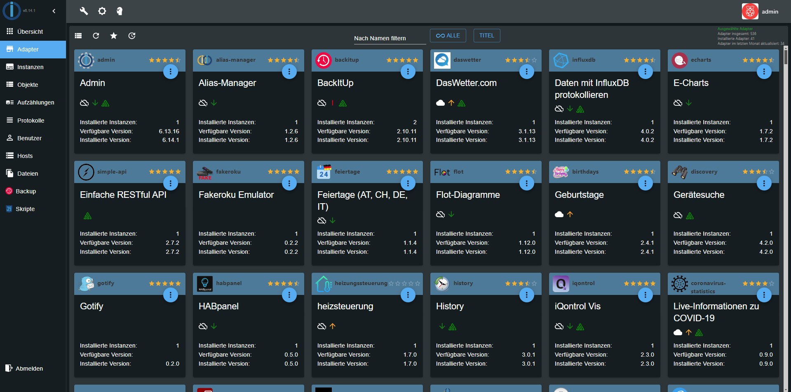

## Описание

Драйвер используется для обслуживания и настройки системы ioBroker и всех установленных драйверов. 
Он представляет собой WEB-интерфейс по адресу `<IP-Адрес сервера>:8081` и устанавливается вместе с ioBroker.

С помощью WEB-интерфейса, предоставляемого драйвером **admin**, реализуются следующие функции:

*   Установка дополнительных драйверов
*   Обзор объектов
*   Обзор состояний объектов
*   Управление пользователями и группами
*   Просмотр журнал (лог-файл) работы системы
*   Управление хостами (работа с распределенной системой - более одного хоста)

## Установка

Этот драйвер устанавливается вместе с ioBroker, ручная установка не требуется.

## Настройка

### Параметры конфигурации

#### IP

IP-адрес с которого доступен драйвер (поддерживаются IPv4 и IPv6). Значение по-умолчанию 0.0.0.0, то есть 
возможно соединение на любой IP-адрес. 

**Изменять не желательно, можно потерять досуп!**

#### Port

Порт, по которому доступен интерфейс драйвера. На сервере может быть запущено 
несколько WEB-сервисов и порт 8081 (настройка по-умолчанию) может быть занят, 
необходимо исключить конфликт занятого порта. Значение можно изменять.

#### Шифрование

Если необходимо использовать протокол HTTPS, необходимо отметить данную опцию.

#### Аутентификация

Если необходима аутентификация пользователя для работы с драйвером, 
необходимо отметить данную опцию (автоматически включится опция HTTPS).

#### Кэш

Необходимо отметить данную опцию, если планируется использовать кэш браузера.

#### Пользователь по-умолчанию

Если опция аутентификации отключена, то драйвер admin будет работать от имени пользователя по-умолчанию (выбирается из списка), в противном случае, от имени пользователя при аутентификации.

#### Проверка обновлений

Периодичность автоматической проверки обновлений системы и установленных драйверов. 
Можно выбрать опцию "ручное" и тогда проверка будет осуществляться только по запросу пользователя.

## Использование

В адресной строке WEB-браузера наберите: `<IP-Адрес сервера>:8081`

### Вкладки

Главное окно интерфейса состоит из нескольких вкладок. 

#### Вкладка "Драйвера"

Здесь можно установить или удалить экземпляры драйверов. В списке отображаются доступные для установки драйвера 
и их версии, а так же версии установленных. Обновить информацию по версиям можно с помощью кнопки в левом 
верхнем углу. В столбце **Версия** предусмотрена цветовая маркировка релиза драйвера 
(красный = в планах, желтый = бета-версия, оранжевый = альфа-версия, зеленый = финальная версия). 
Если установленная версия драйвера ниже версии на сервере (имеются обновления), то заголовок 
станет зеленым и появится в строке драйвера кнопка обновления. Если кнопка со знаком вопроса 
в последнем столбце активная, то нажав по ней, можно перейти на сайт **Github** для ознакомления с информацией об драйвере.

#### Вкладка "Настройки драйверов"

Здесь отображаются установленные экземпляры драйверов и осуществляется настройка/конфигурирование. 
Слева сверху находится кнопка включения режима эксперта - для отображения дополнительных настроек. 

Настройки драйверов:

*   Запуск/станов экземпляра драйвера
*   Открытие всплывающего окна с настройками драйвера
*   Кнопка перезапуска экземпляра драйвера
*   Кнопка удаления экземпляра драйвера
*   Если драйвер подразумевает собственный WEB-сервис, будет доступна кнопка перехода в новом окне.

Если щелкнуть на название драйвера в столбце **Заголовок**, можно изменить название экземпляра. 
В режиме эксперта появляются еще два столбца справа:

*   Столбец **Уровень** - выбор из списка уровень подробности ведения журнала работы адаптера (debug, error, warn, info)
*   Столбец **Max. RAM** - при необходимости можно ограничить выделение памяти ОЗУ для работы драйвера

#### Вкладка "Объекты"

На этой вкладке отображаются объекты системы (переменные, программы, устройства и пр.). 
По-умолчанию, системные объекты скрыты, их можно отобразить нажав кнопку **Показать системные объекты** 
слева сверху. С помощью кнопок со стрелками вверх/вниз можно загрузить/выгрузить объект(-ы) файлом JSON. 
В столбце справа можно нажатием кнопки вызвать окно настроек конкретного объекта (отдельной кнопкой настройки хранения истории) 
и удалить объекты. Если значения отображаются красным цветом, значит они еще не подтверждены - флаг `ack = false`.

#### Вкладка "Состояния"

Отображение в табличной форме состояний всех объектов системы. В шапке таблицы поля для ввода - фильтры для поиска объекта или группы объектов.

#### Вкладка "События"

Отображение в табличной форме изменений состояний объектов в режиме реального времени (можно приостановить, нажав справа сверху соответствующую кнопку).

#### Вкладки "Группы" и "Пользователи"

Добавление пользователей и групп, редактирование привилегий.

#### Вкладка "Категории"

Добавление/редактирование/удаление категорий (к примеру комнат для работы с адаптером **Scenes**).

#### Вкладка "Сервера"

Список серверов с установленным ioBroker, так же здесь отображается версия js-controller на каждом хосте. 
Если имеется новая версия, то заголовок вкладки будет отображаться зеленым цветом и появится кнопка 
обновления версии js-controller до актуальной. Запросить текущую версию (если отключено автоматическое обновление) 
можно с помощью кнопки **Обновить информацию драйвера** в левом нижнем углу окна. 
Так же возле имени хоста имеется кнопка перезагрузки js-controller (не OS).

#### Вкладка "Лог"

Здесь отображается журнал работы сервера. Сверху слева доступны поля для фильтрации записей. 
Можно отображать записи только указанного драйвера, либо всех (включая системный js-controller); 
можно выбрать уровень отображения лога (отладка, инфо, предупреждения, ошибки) и фильтровать по значениям. 

Справа сверху находятся кнопки:

*   Кнопка **Задержать вывод сообщений** - вывод сообщений на странице временно приостанавливается (например, когда сообщения появляются слишком быстро, чтобы не пропустить искомое)
*   Кнопка **Обновить протокол** - обновить журнал вручную (сообщения должны выводиться в режиме онлайн при активной вкладке)
*   Кнопка **Скопировать протокол** - сообщения на экране копируются в буфер обмена для дальнейшего использования (например, для вставки на форум, чтобы описать ошибку)
*   Кнопки **Очистить протокол на экране** и **Очистить протокол на сервере** - соответственно очищает вывод сообщений на вкладке **Лог** и полностью удаляет сообщения из журнала на сервере (применять осторожно).

#### Вкладка "Скрипты"

Эта вкладка активна только если установлен драйвер **Javascript/Coffescript Script Engine**. 
Здесь можно создавать/удалять/редактировать скрипты для автоматизации. 
Более подробно смотри описание данного драйвера.

#### Вкладка "Node-red" и вкладки других драйверов

Эти вкладки видны только если включен соответствующие драйвер (см. пункт ниже).

### Общие настройки

Справа сверху находятся кнопки общих настроек драйвера **Admin**:

*   Кнопка **Видимость вкладок** - можно включать и отключать вкладки, а так же, при установке определенных драйверов, для которых существуют свои вкладки - добавлять их на страницу
*   Кнопка **Системные настройки** - дополнительные настройки работы системы такие как: язык интерфейса, формат даты, единицы измерений, активный репозиторий и пр. (группа основные настройки); редактирование, добавление/удаление ссылок на репозитории (группа репозитории); добавление/удаление собственных сертификатов при использовании HTTPS (группа сертификаты); настройка анонимного сбора статистики (группа статистика)
*   Кнопка **Выйти** - выход из системы.

## Changelog
<!--
    Placeholder for the next version (at the beginning of the line):
    ### **WORK IN PROGRESS**
-->
### 8.0.19 (2026-09-26)
- (@GermanBluefox) Fixed: in the credentials of the system settings, a long translation of the type - "Benutzerdefiniert" in German - ran into the ID next to it, because the column had a fixed width that the text did not fit into. The column is wider now, and a translation that is longer still is cut with an ellipsis and shown in full as a tooltip (#3642)
- (@GermanBluefox) Changed: an object of an adapter can only be deleted in the expert mode now - the delete button in the row, the entry in the context menu and the `Delete` key are gone without it. Deleting such an object can stop the adapter from working, and it is created again at its next start anyway. Objects a user creates themselves (`0_userdata.*` and `alias.*`) can still be deleted without the expert mode (#3639)
- (@GermanBluefox) Fixed: an object whose ID contains a "/" - e.g. `ocpp.0./TACW1142021G1543.1.meterValues.Power_Active_Import` - could not be opened from the object tree. The ID went into the URL unencoded, so it was read back cut off at its first slash: the dialog showed the wrong title, the history settings started at 1 January 1970, the "Chart" tab disappeared and switching the tab ended in `can't access property "ocpp.0."`. The ID now survives the round trip through the URL (#3634). Needs `@iobroker/gui-components` 10.3.5
- (@GermanBluefox) Fixed: in a multihost system, the Log tab asked its own controller whether `getLogs` understands a log level, but sent the request to the selected host. If that host still ran an older js-controller, it answered with the complete log file. The question now goes to the host whose log is shown
- (@GermanBluefox) Fixed: if a host knows the command `searchLogs` but cannot carry it out - e.g. because it writes no log file at all - the Log tab showed its error. Its files are now read the way those of an older controller are read
- (@GermanBluefox) The assistant is shown only on admin tabs, not on the config pages of other adapters.

### 8.0.18 (2026-09-23)
- (@krobipd) Fixed: the admin showed its start screen for half a minute when the host could not reach the repository server (no internet, firewall). The start no longer waits for the repository and the installed versions; only the adapters tab needs them, and it fills itself as soon as they arrive
- (@krobipd) Fixed: on a slow or busy host, the admin start ended with "Cannot get hosts: Error: timeout" and an empty menu column until the page was reloaded. The menu and the host selector now try again (after 2 s, 5 s, then every 10 s) and after a reconnect, without an alert for each failed attempt; a missing permission is still reported once
- (@krobipd) Fixed: when the instance objects could not be read, the pinned config manager entries were deleted from the menu
- (@krobipd) Changed: several instance changes in a row rebuild the menu only once, and an older rebuild can no longer overwrite a newer one
- (@GermanBluefox) Changed: in the categories, an object dragged from one room or function onto another one is moved there; it is copied only if Shift, Ctrl or Alt is held while dropping (formerly only Alt, and the object often appeared to be copied anyway). The preview at the pointer shows whether it will be moved or copied, and a hint below the members explains the keys
- (@GermanBluefox) Fixed: after an object was moved to another room or function, it was still shown in the old one until the page was reloaded
- (@GermanBluefox) Added: the "Default History" selection in the base settings shows the icons of the history adapters, in the list and in the field
- (@GermanBluefox) Added: the base settings open with the tab that was used last, unless the link names a tab

### 8.0.17 (2026-09-20)
- (@BenAhrdt) Added: a config manager instance can be pinned to the menu. The pin sits in the toolbar of the device list and creates an entry that opens exactly this instance, so an adapter no longer needs an `adminTab` of its own just to lead there. The pinned instances are stored per browser (or in the GUI settings, if they are switched on), and an instance that is deleted or no longer offers a device manager loses its entry
- (@GermanBluefox) Added: a quick filter in the menu. From 11 entries on, a magnifier appears next to the logo; it turns the header into a text field and hides the menu entries that do not match. Both the translated and the English name are searched, so the English name of a tab finds it in every language; Enter opens the first hit, Escape closes the filter
- (@GermanBluefox) Added: the "Used by" column of the credentials now lists the scripts, too. Admin searches the sources of all scripts for `SECRETS.<ID>` (also `SECRETS['<ID>']`) and shows the scripts that read the credential; hovering an entry shows the full script ID. The engine of the script provides the icon, so `script.js.*` and `script.py.*` are treated alike

### 8.0.16 (2026-09-18)
- (@GermanBluefox) Fixed: once the order of the menu was saved, the tab of a newly installed adapter always came last and its `common.adminTab.order` had no effect. The tab is now placed after the tab that precedes it by order; the tabs the user has arranged keep their position
- (@GermanBluefox) Fixed: admin wrote the system config each time the menu was loaded or an instance changed, even though nothing had changed
- (@GermanBluefox) Added: with HTTPS enabled, admin speaks HTTP/2 - the browser loads the page and all its files over a single connection. Clients without HTTP/2 fall back to HTTP/1.1 automatically; the new option "Use HTTP/2" in the instance settings turns it off
- (@GermanBluefox) Fixed: the MCP endpoint built into admin (`/mcp`) always answered with the 404 page, so MCP clients could not connect to it
- (@GermanBluefox) Changed: the "page not found" page has the look of admin 8, follows its light or dark theme and is shown in the language of admin

### 8.0.15 (2026-09-16)
- (@GermanBluefox) Added: the Log tab searches the log files of the selected host - also the rotated and gzipped ones, based on [ioBroker.logsearch](https://github.com/disaster123/ioBroker.logsearch) by @disaster123. Typing in the message field still filters the shown entries; Enter searches the files with all filters of the table. The time column chooses the range - from the latest entries up to 30 days - and new entries keep arriving live. Entries that span several lines, like stack traces, stay together. The files of the own host are read from the disk; another host searches its files itself if its js-controller supports `CONTROLLER_SEARCH_LOGS`, otherwise it sends them with `getLogFile`. A new button exports the shown entries as a text file
- (@GermanBluefox) Fixed: the choice "Tips at start" in the system settings showed its two options in English in every language, as the entry was missing the flag that translates the values
- (@GermanBluefox) Fixed: the first "Did you know?" tip showed the raw `` tag as text instead of the expert-mode icon. A tip may contain images now: the `src` is a file or a data URI, `width`, `height` and `alt` are optional, and `class='icon'` draws a monochrome icon in the color of the text, so that it stays visible in the dark themes as well
- (@GermanBluefox) Fixed: the system settings closed by themselves right after opening them on the "Objects" or "Files" tab while an object or file was selected. The browser wrote its selection back into the URL and so replaced the dialog there
- (@GermanBluefox) Changed: the country lists in the system settings and in the wizard start with Germany, Austria and Switzerland. A separator follows, and then all other countries, sorted by their name in the current language instead of the English one. Both lists are the same now, and the 29 countries without translation got one

## License

The MIT License (MIT)

Copyright (c) 2014-2026 bluefox <dogafox@gmail.com>