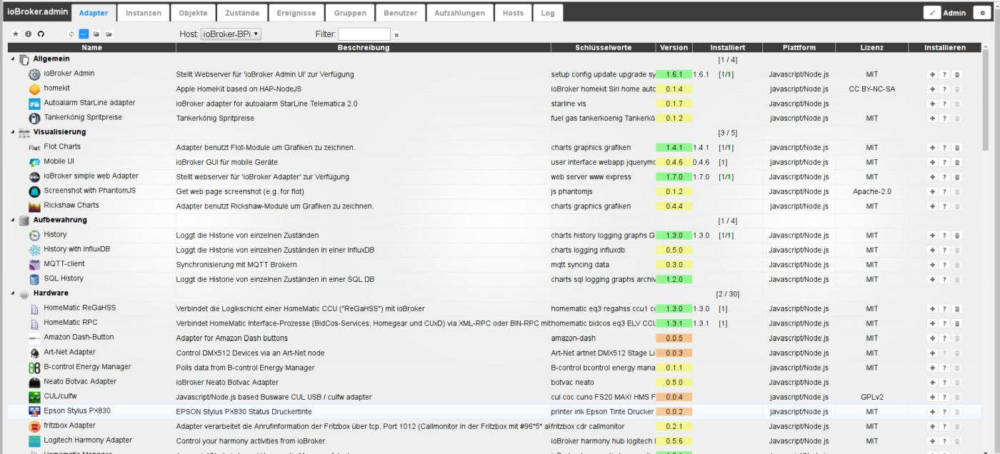
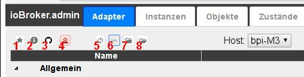
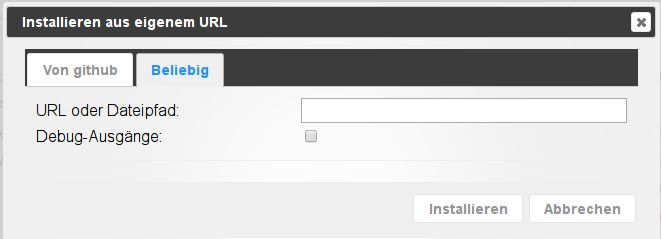

# Адаптер вкладок
Здесь отображаются и управляются доступные и установленные адаптеры.

## Строка заголовка
Строка заголовка содержит значки наиболее важных процессов.
Для каждой иконки есть контекстная помощь. Для этого просто задержите на некоторое время мышку на иконке.

### **Подробно о значках:**

### **1.)  показывать только установленные адаптеры**
При выборе этого значка отображаются только уже установленные адаптеры (функция переключения)

### **2.) Показать адаптеры с обновлениями**
При выборе этого значка отображаются только адаптеры, для которых доступно обновление (функция переключения)

За обновляемыми адаптерами в столбце **_installed_** находится значок обновления.
При нажатии на эту кнопку соответствующий адаптер будет обновлен до последней версии.

В строке заголовка также появляется еще один значок:

При нажатии на этот значок обновятся все доступные адаптеры.

### **3.) Установить адаптер со своего URL**
Используя значок Octocat, адаптеры можно установить по вашим собственным путям (URL-адресам или путям к файлам) или предварительным версиям с GitHub.

После нажатия на этот значок откроется соответствующее окно выбора:

На вкладке **_From github_** просто выберите нужный адаптер из раскрывающегося меню, и будет установлена последняя предварительная версия.

Если вы выберете вкладку «Любой», в поле можно ввести постоянный путь к файлу или любой URL-адрес (например, URL-адрес разработчика внешнего адаптера) и установить соответствующий адаптер.

### **4.) Включить экспертный режим**
Экспертный режим также позволяет устанавливать более старые версии адаптера.
Если выбрана эта кнопка, в правом углу каждого адаптера появится раскрывающееся меню (4), которое можно использовать для установки более ранних версий.

### **5.) Проверьте наличие обновлений**
Обновления автоматически проверяются при каждом перезапуске. Однако вы можете использовать эту кнопку, чтобы начать поиск вручную.

Если обновления доступны в репозитории, установленном в разделе [Системные настройки](#Systemeinstellungen), шрифт вкладки **_Adapter_** отображается зеленым цветом.

### **5.) Изменить сортировку**
Эта кнопка меняет сортировку адаптеров на этой странице.

Когда кнопка активна, все адаптеры сортируются в алфавитном порядке: первым отображается блок с установленными адаптерами, затем блок с еще не установленными адаптерами. Каждый из этих двух блоков отсортирован в алфавитном порядке.

Если эта кнопка неактивна, адаптеры будут отсортированы по темам.

Тогда также будут видны следующие два значка.

### **6.) Свернуть все предметные области**
### **7.) Развернуть все предметные области**
Справа также есть две кнопки.

### **8.) Вкладка «Редактировать»**
С помощью этой кнопки вы можете скрыть ненужные вкладки и показать те, которые не видны.

### ** 9.) Системные настройки**
Здесь задаются основные параметры для ioBroker.

## Содержимое страницы
 Адаптеры отображаются в таблице на странице. Таблица состоит из следующих столбцов:

### **1.) Имя**
В этом столбце перечислены имена адаптеров с соответствующими значками.
Если группировка адаптеров выбрана с помощью значка (5) в строке заголовка, здесь также отображаются названия групп.

### **2.) Описание**
Вот краткое описание того, как работает адаптер

### **3.) Ключевые слова**
Вот некоторые поисковые запросы, связанные с адаптером.

### **4.) Версия**
Доступная версия показана здесь. Для наглядности статус разработки адаптера выделен цветом. (красный = в планировании; желтый = бета; оранжевый = альфа; зеленый = окончательный вариант).

### **5.) установлено**
В этом столбце представлена различная информация о статусе установки этого адаптера.
С одной стороны, там указан номер версии установленного адаптера. Если это выделено жирным шрифтом, доступно обновление. За ним в квадратных скобках указано количество экземпляров, установленных данным адаптером, сколько из них активировано и какой у них статус. Итак [2/1] означает, что имеется два экземпляра этого адаптера, один из которых активирован и работает без проблем (последний можно узнать по зеленому цвету второй цифры). Дальше справа есть значок обновления, если есть обновление для данного адаптера-адаптера. Нажатие на этот значок запускает процесс обновления.

### **6.) Платформа**
Здесь указывается, на какой программной платформе основан этот адаптер. Обычно это javascript под nodejs.

### **7.) Лицензия**
Это лицензия, по которой доступен адаптер. Условия лицензии обычно можно найти в файле readme. Если лицензия требует принятия ее конечным пользователем, при создании экземпляра отобразится соответствующее окно с условиями лицензии.

### **8.) Установить**
В этом столбце находятся различные кнопки для установки и помощи.

1. (+) Добавляет экземпляр адаптера. Это еще необходимо настроить и активировать на вкладке «Экземпляры». Для большинства адаптеров можно установить любое количество экземпляров, например, для работы с различным оборудованием. Если это невозможно, откроется окно с соответствующим сообщением об ошибке.
2. (?) Если эта кнопка активна, она ведет на страницу помощи адаптера. Обычно он находится на GitHub, где также поддерживается адаптер.
3. (Корзина) Эта кнопка удаляет адаптер и все уже установленные экземпляры.
4. (Раскрывающееся меню) С помощью этого меню можно установить предыдущие версии соответствующего адаптера. Это раскрывающееся меню отображается только в экспертном режиме.