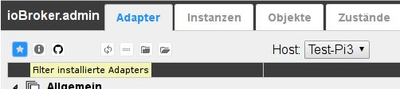
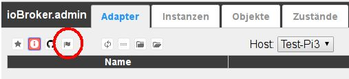
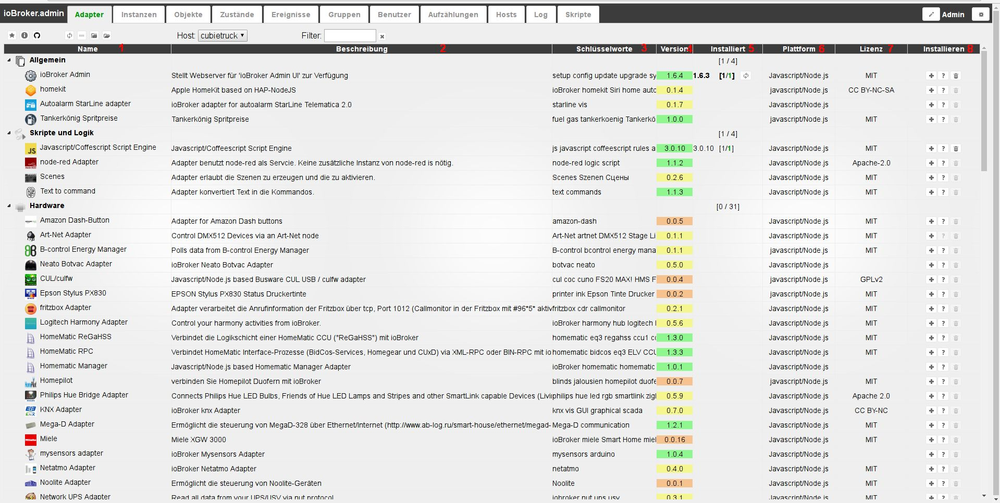

# Вкладка "Адаптеры"
Доступные и установленные адаптеры отображаются и управляются здесь.

## Строка заголовка
Строка заголовка содержит значки наиболее важных процессов.
Для каждой иконки есть контекстная помощь. Просто задержите мышь на иконке на некоторое время.

### **Значки в деталях:**

### **1.) Показывать только установленные адаптеры**
При выборе этого значка отображаются только уже установленные адаптеры (функция переключения)

### **2.) Просмотр адаптеров с обновлениями**
При выборе этого значка отображаются только адаптеры, для которых доступно обновление (функция переключения)

В столбце **_installed_** за обновляемыми адаптерами есть значок обновления.
При нажатии на эту кнопку соответствующий адаптер обновляется до последней версии.

Кроме того, в строке заголовка появляется еще один значок:

При нажатии на этот значок будут обновлены все доступные адаптеры.

### **3.) Установить адаптер с собственного URL**
Адаптеры можно устанавливать по их собственным путям (URL или пути к файлам) или по предварительным версиям GitHub с помощью значка Octocat.

После нажатия на этот значок открывается соответствующее окно выбора:

На вкладке **_From github_** просто выберите нужный адаптер в раскрывающемся меню, и будет установлена последняя предварительная версия.

Если вы выберете вкладку Любой, вы можете ввести любой путь к файлу или любой URL-адрес (например, URL-адрес внешнего разработчика адаптера) в поле, и соответствующий адаптер может быть установлен.

### **4.) Включить экспертный режим**
Экспертный режим также позволяет устанавливать более старые версии адаптера.
При выборе этой кнопки справа для каждого адаптера появляется выпадающее меню (4), с помощью которого можно установить более ранние версии.

### **5.) Проверить наличие обновлений**
Каждый раз, когда вы перезагружаетесь, он будет автоматически проверять наличие обновлений. Вы можете использовать эту кнопку, чтобы начать поиск вручную.

Если обновления доступны в репозитории, указанном в [системные настройки](#Systemeinstellungen), шрифт вкладки **_Adapter_** отображается зеленым цветом.

### **5.) Изменить сортировку**
Эта кнопка изменяет сортировку адаптеров на этой странице.

Когда кнопка активна, все адаптеры сортируются в алфавитном порядке, при этом сначала отображается блок с установленными адаптерами, а затем блок с еще не установленными адаптерами. Каждый из этих двух блоков отсортирован в алфавитном порядке.

Если эта кнопка не активна, адаптеры сортируются по темам.

Затем также видны следующие два значка.

### **6.) Закрыть все темы**
### **7.) Развернуть все темы**
С правой стороны также есть две кнопки.

### **8.) Вкладка «Правка»**
С помощью этой кнопки можно скрыть ненужные вкладки и показать невидимые.

### ** 9.) Системные настройки**
Здесь задаются основные параметры для ioBroker.

## Содержимое страницы
 Адаптеры отображаются на странице в виде таблицы. Таблица состоит из следующих столбцов:

### **1.) Имя**
В этом столбце перечислены имена адаптеров с соответствующими значками.
Если группа адаптеров выбрана с помощью значка (5) в строке заголовка, здесь также отображаются имена групп.

### **2.) Описание**
Вот краткое описание функции адаптера

### **3.) Ключевые слова**
Вот некоторые условия поиска, связанные с адаптером.

### **4-я версия**
Доступная версия показана здесь. Состояние разработки адаптера выделено цветом, чтобы обеспечить обзор. (красный = запланировано, желтый = бета, оранжевый = альфа, зеленый = окончательный).

### **5.) установлен**
В этом столбце содержится различная информация о состоянии установки этого адаптера.
С одной стороны есть номер версии установленного адаптера. Если это напечатано жирным шрифтом, есть обновление. После этого в квадратных скобках указано количество экземпляров, установленных этим адаптером, сколько из них включено и каков их статус. [2/1] означает наличие двух экземпляров этого адаптера, один из которых активирован и работает без проблем (последний можно узнать по зеленому цвету второго числа). Если есть обновление для этого адаптера, справа есть значок обновления. Щелчок по этому значку запускает процесс обновления.

### **6.) Платформа**
Здесь указывается программная платформа, на которой основан этот адаптер. Обычно это javascript под nodejs.

### **7.) Лицензия**
Это лицензия, по которой предоставляется адаптер. Условия лицензии обычно можно найти в файле readme. Если лицензия требует принятия конечным пользователем, при создании экземпляра появится окно с условиями лицензии.

### **8.) Установить**
Эта колонка содержит различные кнопки для установки и помощи.

1. (+) Это добавляет экземпляр адаптера. Это все еще необходимо настроить и активировать на вкладке «Экземпляры». С большинством адаптеров можно установить любое количество экземпляров, например, для работы с различным оборудованием. Если это невозможно, открывается окно с соответствующим сообщением об ошибке.
2. (?) Когда эта кнопка активна, она ведет на страницу справки адаптера. Обычно это находится на GitHub, где также поддерживается адаптер.
3. (корзина) Эта кнопка удаляет адаптер и все уже установленные экземпляры.
4. (Раскрывающееся меню) Через это меню можно установить предыдущие версии соответствующего адаптера. Это выпадающее меню видно только в экспертном режиме.
