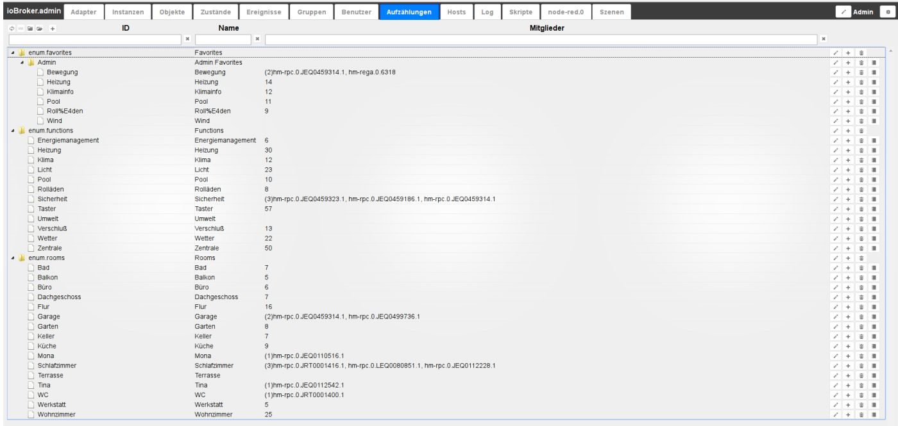
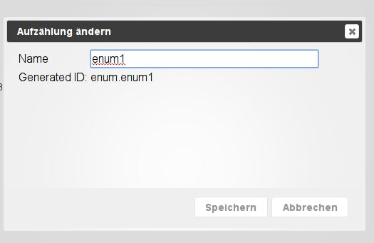
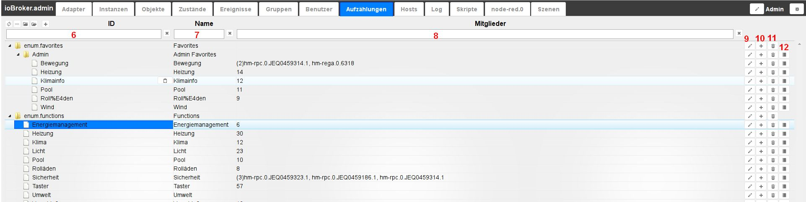
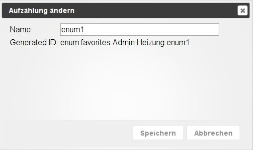
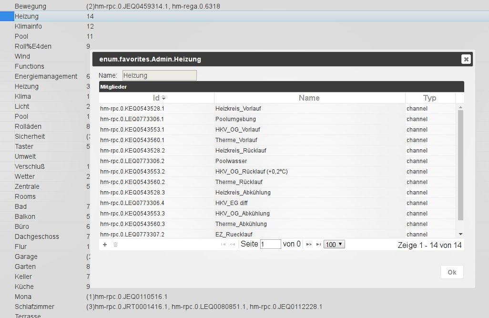

# Вкладка "Перечисления"
Здесь перечислены избранные, сделки и комнаты из Homematic CCU.
Вы также можете создавать свои собственные перечисления, которые затем можно использовать, например, в сценариях.

## Строка заголовка
Строка заголовка содержит значки наиболее важных процессов.
Для каждой иконки есть контекстная помощь. Просто задержите мышь на иконке на некоторое время.

### **Значки в деталях:**
### **1.) Обновить представление**
Если только что созданные объявления не видны, щелчок по этому значку поможет обновить статус страницы.

### **2.) Изменить сортировку**
Эта кнопка изменяет сортировку объектов на этой странице.

Когда кнопка активна, все объекты сортируются в алфавитном порядке.
Если эта кнопка не активна, объекты отображаются иерархически в соответствии со списками в древовидной структуре.

Затем также видны следующие два значка.

### **3.) Свернуть все вложенные папки**
### **4.) Развернуть все подпапки**
### **5.) добавить**
После выбора этого значка к базовой структуре можно добавить дополнительные списки.
Элементы в структуре папок создаются с помощью значка (+) справа (#10).
Откроется окно конфигурации:

Теперь здесь необходимо выбрать имя для нового перечисления, сгенерированный идентификатор будет скорректирован автоматически.

### Содержимое страницы

Существующие перечисления и их элементы отображаются на странице в виде таблицы.

Таблица состоит из следующих столбцов (поля под заголовками столбцов 6, 7 и 8 служат критериями фильтрации). Таблица на картинке упорядочена по иерархии и все подпункты (узлы) расширены:

### **6.) ID**
Здесь перечислены все члены перечисления с их идентификаторами. Это обозначение можно изменить, дважды щелкнув или щелкнув соответствующий значок карандаша (#9).
Полный идентификатор подчиненных структур также включает предшествующие вышестоящие уровни.

### **7.) Имя**
В этом столбце указано имя участника. Это обозначение можно изменить, дважды щелкнув или щелкнув соответствующий значок карандаша (#9).

### **8.) Участники**
В этом столбце отображаются члены перечисления, если их слишком много, отображается только число.
Если вы наведете указатель мыши на поле, все участники отобразятся в виде всплывающей информации.
Дополнительную информацию можно получить с помощью значка информации справа (# 12).

### **9.) Редактировать обозначения**
После нажатия на этот значок вы можете редактировать обозначения в столбцах ID и Name.
В этот момент появляется кнопка ok в виде галочки и значок отмены в виде (x).

### **10.) Добавить элемент структуры**
После нажатия на этот значок открывается диалоговое окно, в котором можно создать новый элемент в соответствующей структуре.

Здесь тоже имя можно выбрать индивидуально. Связанный идентификатор генерируется автоматически в соответствии со структурой и выбранным именем.

### **11.) Удалить элемент**
Элемент в этой строке удаляется со значком корзины

### **12.) Информация**
После нажатия на этот значок отображается другое окно с расширенной информацией о выбранном элементе.

