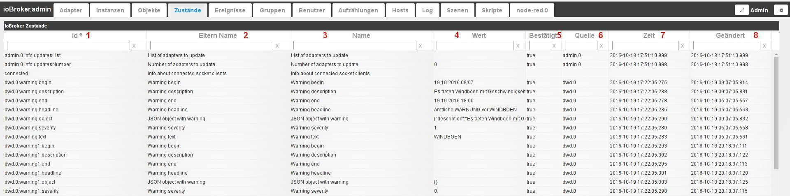
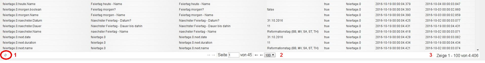

# Вкладка События
На этой вкладке отображаются текущие состояния всех точек данных. Значения также можно изменить.

## Содержимое страницы
Существующие объекты отображаются в таблице на странице. Столбцы можно сортировать по алфавиту по возрастанию или убыванию, щелкнув заголовки столбцов в соответствии с содержимым соответствующих столбцов (функция переключения). Поля ниже используются для фильтрации точек данных в соответствии с вашими критериями.

Таблица состоит из следующих столбцов:

### **1.) Идентификатор**
Это уникальное имя соответствующей точки данных в соответствии со структурой, состоящей, например, из имени адаптера.Номер экземпляра.Имя устройства.Имя канала.Имя точки данных.

### **2.) Имя родителей**
То же содержание, что и в названии столбца 3.

### **3.) Имя**
Имя точки данных. Это может быть автоматически сгенерированное имя или более понятное имя, назначенное вручную. Это имя не обязательно должно быть уникальным.

### **4.) Значение**
Здесь указывается текущее значение точки данных.

Это значение доступно для редактирования

### **5.) Подтверждено**
Если это значение было изменено и оно было принято системой, значение равно _true_, в противном случае _false._

### **6.) Источник**
Это указывает, какой экземпляр внес последнее изменение в точку данных.

### **7.) Время**
Это временная метка последнего обновления точки данных.

### **8.) изменено**
Это временная метка последнего изменения значения точки данных.

## Нижний колонтитул страницы
В нижнем колонтитуле страницы есть дополнительная информация

### **1.) перезагрузить**
Нажав на этот значок, можно обновить таблицу.

### **2.) Информация о странице**
Информационный блок в середине нижнего колонтитула страницы предоставляет возможность установить количество строк на странице с помощью раскрывающегося меню. Доступно 20, 100, 200, 500 и 1000 строк на страницу. Здесь также есть информация о том, сколько всего страниц, а также возможность прокручивать страницы вперед или назад с помощью значков стрелок.

### **3.) Информация о точках данных**
Эта информация указывает общее количество существующих точек данных и их диапазон, отображаемый на текущей странице.