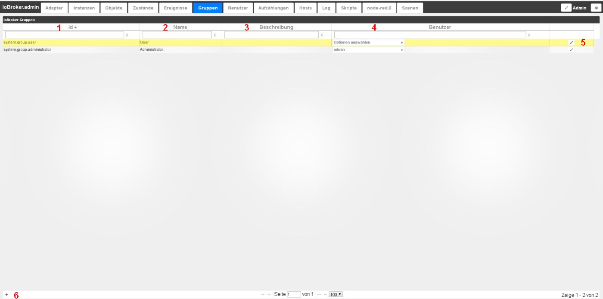

# Вкладка "Группы"
Здесь можно создать группы пользователей с разными правами, щелкнув значок (+) в левом нижнем углу экрана.

## Содержимое страницы
Существующие группы отображаются в виде таблицы на странице. Поля в заголовках столбцов используются для фильтрации таблицы в соответствии с вашими критериями.

Таблица состоит из следующих столбцов:

### **1.) ID**
Это уникальное имя каждой группы согласно структуре, состоящей из system.group.groupname.

### **2.) Имя**
Название группы. Это имя выбирается свободно. Это имя должно быть уникальным.

### **3.) Описание**
Здесь можно добавить описание, например, ссылку на права в этой группе.

### **4.) Пользователь**
Здесь отображаются пользователи, созданные на вкладке **_User_**, и их можно отнести к выбранной группе с помощью флажка.

### **5.) Настройка прав**
При нажатии на символ карандаша открывается другое окно, в котором можно настроить права этой группы.

### **6.) Создать новую группу**
С помощью этого значка можно создать новую группу, которая настраивается с помощью предыдущих пунктов.
