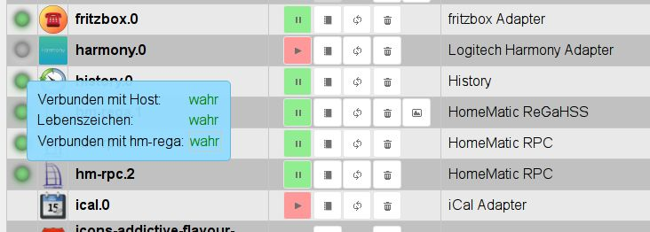

# Вкладка Экземпляры
Здесь перечислены экземпляры, уже установленные на вкладке «Адаптер», и их можно настроить соответствующим образом.

## Строка заголовка
Строка заголовка содержит значки наиболее важных процессов. Для каждой иконки есть контекстная помощь.
Для этого просто задержите на некоторое время мышку на иконке. Также есть информация о загрузке сервера

### **Подробнее о значках:**
### **1.)  Включите режим администратора**
При выборе этого значка отображаются дополнительные столбцы для настройки экземпляров (функция переключения).
Информацию об этом можно найти в разделе содержания страницы.

### **2.) Обновить представление**
Если только что созданные экземпляры не видны, щелчок по этому значку поможет обновить статус страницы.

### **3.) Информация о состоянии сервера**
В правой части заголовка находится информация об активности инстансов и загрузке сервера ioBroker.

Первые цифры указывают объем памяти, используемый экземплярами, и оставшуюся свободную память в МБ. За ним находится свободная память в %. В квадратных скобках указано имя сервера ioBroker и количество запущенных процессов.

## Содержимое страницы

На странице в виде таблицы отображаются установленные экземпляры адаптеров.

Таблица состоит из следующих столбцов:

### **1.) Состояние**
Здесь состояние экземпляра представлено светофором. Дополнительную информацию можно получить, наведя курсор мыши на сигнал.

Не во всех экземплярах есть этот светофор. Но это не повод для паники. Это либо управляемые по времени экземпляры, которые подключаются к контроллеру только на короткое время, а затем немедленно отключаются, либо, как vis, продолжают работать в фоновом режиме.

### **2.) Значок**
Здесь отображается значок, который используется в ioBroker для этого адаптера.

### **3.) Экземпляр**
Этот столбец содержит имя экземпляра. он состоит из имени адаптера и номера, который пронумерован последовательно в порядке установки экземпляров. Первый экземпляр получает 0.
Это имя является основой для названия точек данных в ioBroker.

### 4.) активировано
Здесь экземпляр запускается или останавливается. Зеленый знак паузы указывает, что адаптер работает и его можно приостановить, щелкнув по нему, красный знак воспроизведения показывает остановленный экземпляр, который можно запустить одним щелчком мыши.

### **5.) Конфигурация**
При нажатии на этот значок открывается меню конфигурации конкретного адаптера. Соответствующие меню описаны в соответствующем [адаптеры](http://www.iobroker.net/?page_id=2236&lang=de).

### **6.) перезагрузка**
При нажатии на этот значок соответствующий экземпляр будет перезапущен.

### **7.) Мусорный бак**
Этот значок удаляет соответствующий экземпляр. Другие экземпляры того же адаптера сохраняются.
Сам адаптер тоже остаётся.

### **8.) Веб-ссылка**
Этот значок содержит ссылку на сайт данного экземпляра. Либо потому, что этот адаптер имеет собственный веб-интерфейс (с другим портом), либо просто другой путь. В некоторых случаях эта ссылка также ведет на страницы справки.

### **9.) Название**
Здесь указывается имя экземпляра. Вы можете изменить это имя в соответствии с вашими желаниями и потребностями. Это особенно полезно, если имеется несколько экземпляров адаптера (в противном случае с одинаковым именем). Так будет, например, с hm-rpc, если есть экземпляры для RF, Wired и CuxD.

### **10.) Планирование**
Для адаптеров, которые запускаются по времени, здесь вводится время, когда этот адаптер должен запуститься.
Это расписание имеет формат [cronjobs](https://de.wikipedia.org/wiki/Cron#Beispiele).
Чтобы изменить его, нажмите на кнопку с тремя точками. Откроется окно ввода с большим количеством дополнительной информации и помощи.

### **11.) Перезагрузить**
Если этот флажок установлен, здесь также можно создать расписание, когда этот экземпляр должен быть перезапущен.

### **12.) Уровень журнала**
В этом столбце можно настроить соответствующий уровень журнала для экземпляра. Доступны отладка, информация, предупреждение и ошибка. По умолчанию это значение info. Если у вас сложилось впечатление, что что-то идет не так, вы можете настроить отладку. Тогда во вкладке журнала для этого экземпляра также будет выводиться отладочная информация, что может помочь найти ошибку. И наоборот, вы также можете установить это значение выше, чтобы журнал не был таким обширным.

### **13.) Ограничение ОЗУ**
Здесь вы можете указать, какой объем оперативной памяти должен быть доступен экземпляру в качестве меры предосторожности.
Этот объем памяти больше не доступен для других задач, и его не следует выбирать слишком большим, особенно для систем с небольшим объемом оперативной памяти. Если экземпляру временно потребуется больше памяти, она, конечно, будет выделена ему системой, но затем немедленно снова освобождена в систему. В то время, когда экземпляру требуется больше памяти, чем было для него зарезервировано, требуемая память отображается красным цветом.

### 14.) Использование оперативной памяти
Здесь отображается фактический объем памяти, используемый экземпляром. Эти значения регулярно обновляются. После обновления эти значения ненадолго отображаются зеленым текстом.