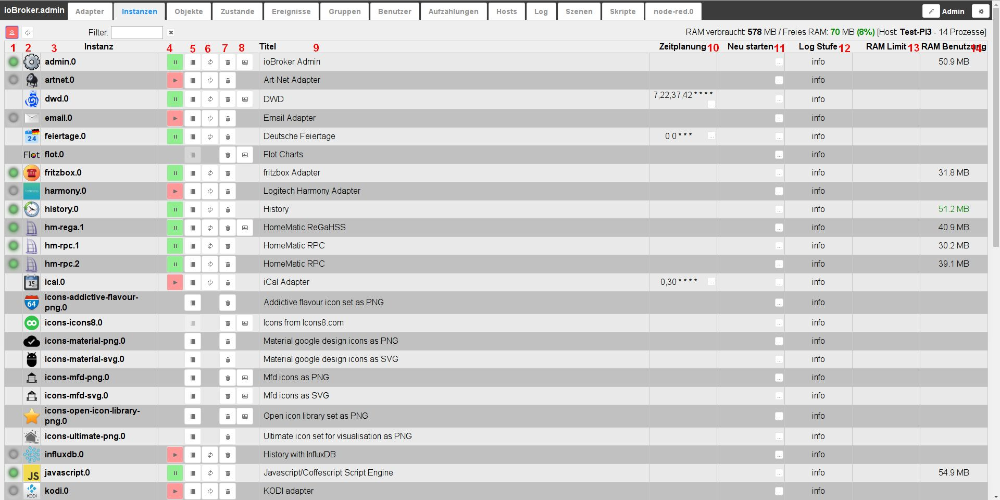

# Вкладка "Экземпляры"
Экземпляры, уже установленные на вкладке «Адаптер», перечислены здесь и могут быть соответствующим образом настроены.

## Строка заголовка
Строка заголовка содержит значки наиболее важных процессов. Для каждой иконки есть контекстная помощь.
Просто задержите мышь на иконке на некоторое время. Также есть информация о нагрузке на сервер

### **Значки в деталях:**
### **1.) Включить режим администратора**
При выборе этого значка отображаются дополнительные столбцы для настройки экземпляров (функция переключения).
Информацию об этом можно найти в разделе Контент страницы.

### **2.) Обновить представление**
Если только что созданные экземпляры не видны, щелчок по этому значку поможет обновить статус страницы.

### **3.) Информация о состоянии сервера**
В правой части строки заголовка находится информация об активности экземпляров и использовании сервера ioBroker.

Первые числа обозначают память, используемую экземплярами до сих пор, и оставшуюся свободную память в МБ. После этого свободная память в %. В квадратных скобках указано имя сервера ioBroker и количество запущенных процессов.

## Содержимое страницы

На странице представлены установленные экземпляры адаптеров.

Таблица состоит из следующих столбцов:

### **1.) Состояние**
Статус экземпляра показан здесь светофором. Дополнительную информацию можно получить, наведя указатель мыши на сигнал.

Не на всех экземплярах есть этот светофор. Но это не повод для паники. Это либо управляемые по времени экземпляры, которые ненадолго подключаются к контроллеру, а затем сразу же снова отключаются, либо продолжают работать в фоновом режиме, как, например, vis.

### **2.) Значок**
Здесь отображается значок, который используется в ioBroker для этого адаптера.

### **3.) Экземпляр**
Этот столбец содержит имя экземпляра. он состоит из имени адаптера и номера, последовательно пронумерованного в порядке установки экземпляров. Первый экземпляр получает 0.
Это обозначение является основой для обозначения точек данных в ioBroker.

### 4.) активирован
Здесь экземпляр запускается или останавливается. Зеленый знак паузы указывает на то, что адаптер работает и его можно приостановить, щелкнув по нему, красный значок воспроизведения указывает на остановленный экземпляр, который можно запустить одним щелчком мыши.

### **5.) Конфигурация**
Щелчок по этому значку открывает меню конфигурации конкретного адаптера. Соответствующие меню описаны в соответствующем [адаптеры](http://www.iobroker.net/?page_id=2236&lang=de).

### **6.) перезапустить**
При нажатии на этот значок соответствующий экземпляр перезапускается

### **7.) Мусорный бак**
С помощью этого значка соответствующий экземпляр удаляется. Остаются другие экземпляры того же адаптера.
Сам переходник тоже остался.

### **8.) Веб-ссылка**
За этим значком находится ссылка на сайт данного экземпляра. Либо потому, что этот адаптер имеет собственный веб-интерфейс (с другим портом), либо просто другой путь. В некоторых случаях эта ссылка также ведет на страницы справки.

### **9.) Заголовок**
Здесь указывается имя экземпляра. Вы можете изменить это имя в соответствии со своими пожеланиями или потребностями. Это особенно полезно, если имеется несколько экземпляров адаптера (с одинаковым обозначением). Это было бы в случае с hm-rpc, например, если бы было по одному экземпляру для RF, Wired и CuxD.

### **10.) Планирование**
В случае адаптеров, которые запускаются по времени, здесь вводится время запуска этого адаптера.
Это расписание имеет формат [хрон рабочие места](https://de.wikipedia.org/wiki/Cron#Beispiele).
Чтобы изменить его, нажмите на кнопку с тремя точками. Откроется окно ввода с большим количеством дополнительной информации и помощи.

### **11.) Перезагрузка**
Если этот флажок установлен, здесь также можно создать расписание, когда этот экземпляр должен быть перезапущен.

### **12.) Уровень журнала**
В этом столбце можно настроить соответствующий уровень журнала для экземпляра. Доступны отладка, информация, предупреждение и ошибка. По умолчанию это значение равно info. Если у вас сложилось впечатление, что что-то не работает гладко, вы можете настроить его на отладку. затем на вкладке журнала для этого экземпляра также отображается отладочная информация, которая может помочь найти ошибку. И наоборот, вы также можете установить это значение выше, чтобы журнал не был таким обширным.

### **13.) Лимит оперативной памяти**
Здесь вы можете указать, сколько памяти должно быть предоставлено экземпляру в качестве меры предосторожности.
Этот объем памяти становится недоступным для других задач, и его не следует выбирать слишком большим, особенно в системах с небольшим объемом основной памяти. Если экземпляру временно требуется больше памяти, система, конечно же, выделит ее вам, но затем сразу же снова освободит ее для системы. В то время, когда экземпляру требуется больше памяти, чем было зарезервировано, необходимая память отображается красным цветом.

### 14.) Использование оперативной памяти
Здесь отображается объем памяти, фактически используемый экземпляром. Эти значения регулярно обновляются. После обновления эти значения ненадолго отображаются зеленым текстом.
