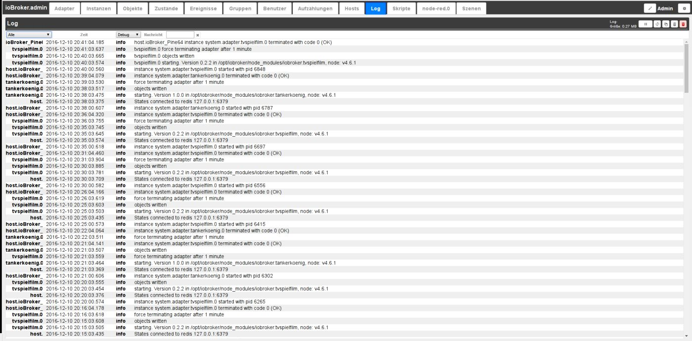
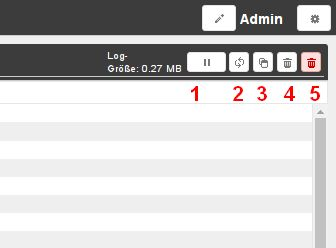

# Вкладка Журнал
Сюда постоянно выводятся сообщения системы.
Последнее сообщение выше.

## Строка заголовка
В строке заголовка расположены значки наиболее важных процессов.
Для каждой иконки есть контекстная помощь. Для этого просто задержите на некоторое время мышку на иконке.

### **Подробно о значках:**
### **1.) Остановить обновление**
Если нажать на эту кнопку, постоянное обновление списка будет остановлено.
Вместо значка паузы теперь отображается количество новых, не отображаемых сообщений.

### **2.) Журнал обновлений**
Эта кнопка обновляет список.

### **3.) Копировать журнал**
После щелчка по этому значку список отображается в виде текста. При нажатии CTRL-A выделяется весь текст, а при нажатии CTRL-C он вставляется в буфер обмена для дальнейшего редактирования.

### **4.) Удалить список**
Нажатие на этот значок удаляет только список на экране.

### **5.) Удалить журнал**
При нажатии на этот значок весь журнал на хосте будет безвозвратно удален.

### Раскрывающиеся меню
### **Фильтр экземпляров**

Это раскрывающееся меню можно использовать для фильтрации сообщений в соответствии с экземпляром журнала.
В меню отображаются только те экземпляры, для которых есть записи на странице.

### **отображаемый уровень журнала**

Это меню можно использовать для установки уровня серьезности сообщения, которое должно отображаться.
Однако это лишь фильтр существующего списка. Чтобы настроить ведение журнала на определенном уровне для экземпляра, это необходимо установить на вкладке _**Экземпляры**__.