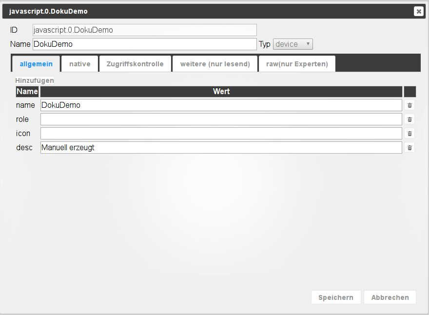

# Вкладка Объекты
Все управляемые объекты находятся на этой вкладке. Для каждого экземпляра создается папка, в которой созданные им точки данных располагаются в иерархической структуре. Здесь также можно создавать и удалять объекты вручную. Целые структуры объектов могут быть загружены или загружены. Другая кнопка позволяет отобразить экспертное представление.

## Строка заголовка
Строка заголовка содержит значки наиболее важных процессов. Для каждой иконки есть контекстная помощь. Просто задержите мышь на иконке на некоторое время.

### **Значки в деталях:**
### **1.) Обновить представление**
Если только что созданные объекты не видны, щелчок по этому значку поможет обновить статус страницы.

### **2.) Изменить сортировку**
Эта кнопка изменяет сортировку объектов на этой странице.

Когда кнопка активна, все объекты сортируются в алфавитном порядке. Если эта кнопка не активна, объекты сортируются иерархически по экземплярам.

Затем также видны следующие два значка.

### **3.) Закрыть все темы**
### **4.) Развернуть все темы**
### **5.) Режим администратора**
При выборе этого значка отображаются дополнительные объекты (функция переключения). Это точки данных системы.

### **6.) добавить**
После выбора этого значка можно добавить дополнительные объекты.
Если папка выбрана, она принимается как _Parent_ в структуре объекта.
Откроется окно конфигурации:

Теперь здесь должно быть выбрано имя для нового объекта, при этом устройство, канал или точка данных доступны как тип в соответствии с иерархической структурой.
В качестве типов точек данных доступны логическое значение, переключатель, строка символов, число, список значений, поле, объект и смешанные значения.

Как только вы подтвердите окно ввода с помощью ok, откроется другое окно:

Некоторые данные все еще могут быть введены здесь. К объекту можно добавить роль и значок.

Другие вкладки содержат дополнительные свойства объекта.
Такая информация есть по каждому объекту.

### **7.) Загрузить**
С помощью этой кнопки полная структура объекта загружается на сервер ioBroker в виде файла json.

### **8.) Скачать**
С помощью этой кнопки выбранная структура объекта загружается в виде json-файла с сервера ioBroker и может быть сохранена.

## Содержимое страницы

Существующие объекты отображаются в виде таблицы на странице.

Таблица состоит из следующих столбцов (поля под заголовками столбцов 1 и 2 и раскрывающиеся меню других столбцов служат критериями фильтрации).
Таблица на картинке упорядочена по иерархии и все подпункты (узлы) расширены:

### **1.) ID**
Это верхние уровни иерархии объектов. Вот, напр.
имя экземпляра, включая соответствующую структуру данных.

### **2.) Имя**
В этом столбце указывается обозначение объекта. Кроме того, предыдущий значок показывает, какой уровень иерархии задействован (устройство, канал или точка данных).

Значения этого столбца можно редактировать.

### **3.) Тип**
Тип на уровне иерархии, который уже был виден в столбце _Name_ по предыдущему значку, здесь снова явно назван. Вы можете использовать раскрывающееся меню в заголовке столбца, чтобы отфильтровать эти типы и, например, отобразить только все точки данных.

### 4.) Роль
Роль указывает, как пользовательские интерфейсы, такие как .vis и мобильные устройства, должны обрабатывать эту точку данных.
В принципе, это функция данного объекта, кратко описанная с помощью термина.
Затем вы можете снова отфильтровать. Значения этого столбца можно редактировать.

### **5.) Комната**
Если этот объект уже назначен комнате, это отображается здесь.
Это также используется, в том числе, для фильтрации при поиске объектов.
Значения этого столбца можно редактировать. Таким образом, объекты могут быть назначены помещениям позднее.
Если щелкнуть по полю, откроется всплывающее окно с ранее созданными комнатами.

### **6.) Функция**
В этом столбце указана сделка, которой присвоен соответствующий объект.

Значения этого столбца можно редактировать. Таким образом, объекты могут быть назначены сделкам позднее. Если щелкнуть по полю, откроется всплывающее окно с уже созданными сделками.

### **7.) Значение**
Если объект является точкой данных, здесь отображается текущее значение этой точки данных.

### **8.) Другое**
Если нажать на значок карандаша, откроется окно со свойствами этого объекта.
Это то же самое окно, которое появилось выше при создании нового объекта.
Здесь можно изменить свойства объекта. Эту функцию следует использовать с особой осторожностью и только в том случае, если вы точно знаете, что с ней делаете.

Щелчок по значку корзины удаляет этот объект и **все** объекты ниже него в иерархии. На всякий случай появляется окно, в котором необходимо еще раз подтвердить удаление.

Значок шестеренки появляется только в том случае, если установлен хотя бы один экземпляр истории (History, InfluxDB или SQL).
Здесь можно настроить точку данных для регистрации исторических данных. Дополнительную информацию можно найти в описании [адаптеры истории](http://www.iobroker.net/?page_id=144&lang=de).

Это действие можно выполнить одновременно для всех точек данных, соответствующих текущим критериям фильтрации, с помощью шестеренки в строке заголовка. Поэтому важно тщательно проверить, выбраны ли критерии фильтрации на этой странице таким образом, чтобы были включены только нужные точки данных.

Выпадающее меню для фильтрации этого столбца относится к точкам данных с зарегистрированными данными.
Здесь доступны _с_, _без_ и _все_, а также установленные экземпляры истории.