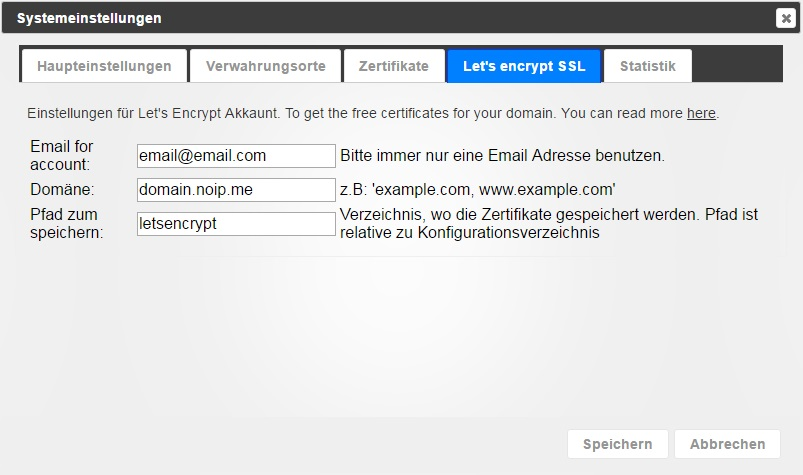
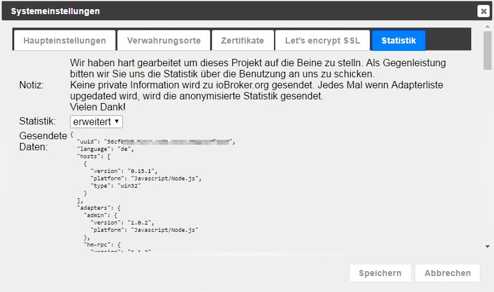

# Системные настройки
Здесь задаются основные параметры для ioBroker.

## Основные настройки
### Системный язык
Это позволяет выбирать между языками системы: немецкий, английский, русский.

### Температура агрегата
это значение используется некоторыми адаптерами. Возможны °C или °F.

### Валюта
В настоящее время нет адаптера, использующего этот

### Формат даты
выберите, как дата должна отображаться в админке и vis.

### Разделитель
Запятая или точка для значений с плавающей запятой

### Экземпляр истории по умолчанию
Этот экземпляр адаптера SQL/History/InfluxDB используется по умолчанию для флота и рикши (графиков).

## Репозитории или репозитории

ioBroker может получить список адаптеров из разных источников. При установке вводятся следующие источники:

* **по умолчанию** — http://download.iobroker.net/sources-dist.json — генерируется на сервере ежедневно в 01:00.

	Доступ осуществляется очень быстро, но информация о версии может быть датирована до 24 часов.

* **онлайн** – https://raw.githubusercontent.com/ioBroker/ioBroker.js-controller/master/conf/sources-dist.json – репозиторий.

	создается из онлайн-источника.  Доступ может занять много времени, это самый последний источник.

* **sources — conf/sources-dist.json** — также генерируется автоматически и занимает много времени, но ссылки могут быть устаревшими (некоторые адаптеры могут отсутствовать).

## Сертификаты

Это центральное расположение сертификатов, используемых для связи SSL/HTTPS. Сертификаты используются администратором, веб-сайтом, simple-api, Socketio. Стандартные сертификаты устанавливаются по умолчанию. Этим вы ничего не сможете проверить. Они предназначены только для SSL-связи. Поскольку сертификаты открыты, вам следует использовать собственные (самозаверяющие) сертификаты, покупать настоящие сертификаты или переходить на Let's Encrypt. Связь с сертификатами по умолчанию небезопасна, и если кто-то захочет прочитать трафик, это можно сделать. Обязательно установите собственные сертификаты. Например. согласно [Linux](http://guides.intertech.de/ssl_certificate_self.html).

## Давайте зашифруем

Let’s Encrypt — это бесплатный, автоматизированный центр сертификации с открытым исходным кодом от независимой Исследовательской группы по интернет-безопасности (ISRG).

Дополнительную информацию о Let’s Encrypt см. в [здесь](https://letsencrypt.org/).

В некоторых установках используется динамический DNS или аналогичный вариант для доступа к вашему собственному домену через назначенный там адрес. ioBroker поддерживает автоматический запрос и обновление сертификатов от организации Let’s Encrypt.

Возможность использования бесплатных сертификатов Let’s Encrypt существует практически в каждом адаптере, который может запускать веб-сервер и поддерживает HTTPS.

Если вы активируете опцию использования сертификатов, но не автоматического обновления, соответствующий экземпляр попытается работать с сохраненными сертификатами.

Если активированы автоматические обновления, экземпляр пытается запросить сертификаты у Let's Encrypt и обновляет их автоматически.

Сертификаты запрашиваются впервые при первом вызове соответствующего адреса. Это означает, что если, например, вы настроите «sub.domain.com» в качестве адреса, а затем вызовете [https://sub.domain.com](https://sub.domain.com/), сертификаты будут запрошены в первый раз, что может занять некоторое время, прежде чем придет ответ.

Выдача сертификатов — сложная процедура, но если вы будете следовать объяснениям ниже, получить бесплатные сертификаты будет легко.

**Процедура:**

1. Необходимо создать новую учетную запись с введенным адресом электронной почты (настройте это в настройках системы)
2. В качестве пароля для учетной записи генерируется случайный ключ.
3. После создания учетной записи система открывает небольшой веб-сайт через порт 80 для подтверждения адреса.
4. При шифровании **всегда** используется порт **80** для проверки адреса.
5. Если порт 80 уже используется другим сервисом, в дело вступает пункт 4 - т.е. назначить другому сервису другой порт!
6. При запуске небольшого веб-сервера на сервер Let's encrypt отправляется запрос сертификатов для адресов, указанных в настройках системы.
7. Сервер Let's Encrypt в ответ на запрос отправляет контрольную фразу и через некоторое время пытается прочитать эту контрольную фразу по адресу «http://вашдомен:80/.well-known/acme-challenge/».
8. Когда сервер получает эту контрольную фразу с нашей стороны, сервер Let's Encrypt отправляет сертификаты. Они сохраняются в каталоге, указанном в настройках системы.

Это звучит сложно, но все, что вам нужно сделать, это активировать несколько флажков и ввести адрес электронной почты и веб-адрес в настройках системы.

Полученные сертификаты действительны примерно 90 дней. После первой выдачи этих сертификатов запускается другая задача, которая автоматически продлевает их срок действия.

Эта тема довольно сложна, и тысячи вещей могут пойти не так. Если это не сработает, мы рекомендуем использовать облачный адаптер для доступа в пути.

**Let's Encrypt работает только с версией node.js >=4.5**

## Статистика

Администратор ioBroker отправляет следующую информацию на сайт download.iobroker.net:

<pre> { &quot;uuid&quot;: &quot;56cf0d20-XXXX-YYYY-BBBB-66eec47ZZZZZ&quot;, &quot;language&quot;: &quot;de&quot;, &quot;hosts&quot;: [ { &quot;version&quot;: &quot;0.15.1&quot;, &quot;platform&quot;: &quot;Javascript/Node. js&quot;, &quot;type&quot;: &quot;win32&quot; } ], &quot;adapters&quot;: { &quot;admin&quot;: { &quot;version&quot;: &quot;1.0.2&quot;, &quot;платформа&quot;: &quot;Javascript/Node.js&quot; }, &quot;hm-rpc&quot;: { &quot;версия&quot;: &quot;1.1.2&quot;, &quot;платформа&quot;: &quot;Javascript/Node.js&quot; } } }</pre>

Эту функцию можно отключить, установив для статистики значение «**ничего**».

Однако разработчики запрашивают следующую информацию:

<pre> Мы упорно трудились, чтобы сдвинуть этот проект с мертвой точки.
Взамен мы просим вас прислать нам статистику использования.
Никакая личная информация не отправляется на ioBroker.org.
При каждом обновлении списка адаптеров также отправляется анонимная статистика.
Спасибо!</pre>