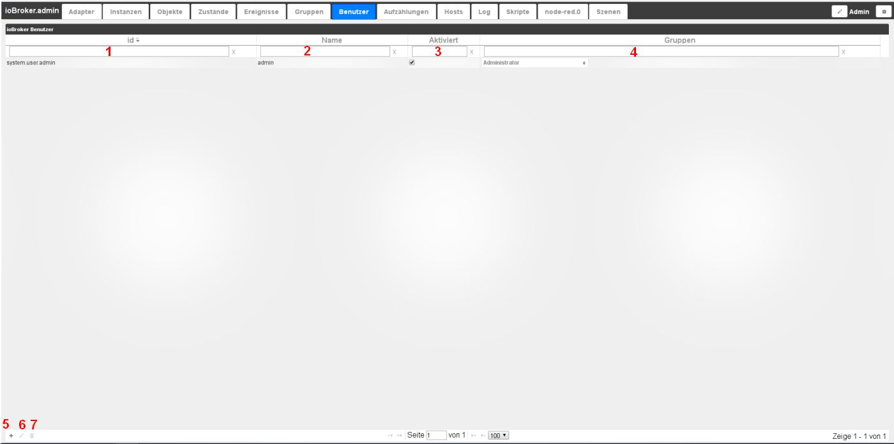
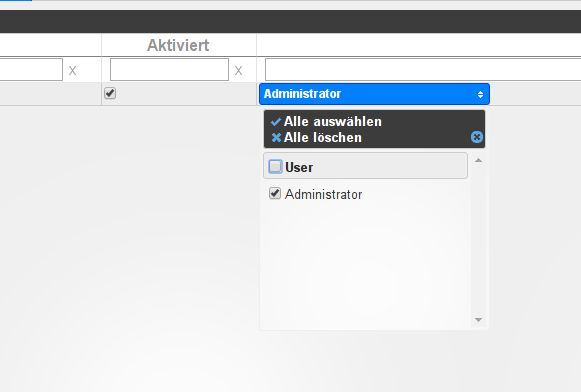

# Вкладка "Пользователи"
Здесь можно создавать пользователей. Для этого нажмите на (+) внизу слева. Администратор уже создан по умолчанию.

## Содержимое страницы
Существующие пользователи отображаются в виде таблицы на странице. Поля в заголовках столбцов используются для фильтрации таблицы в соответствии с вашими критериями.

Таблица состоит из следующих столбцов:

### **1.) ID**
Это уникальное имя каждого пользователя согласно структуре, состоящей из system.user.username.

### **2.) Имя**
Имя пользователя. Это имя выбирается свободно. Это имя должно быть уникальным.

### **3.) Активировано**
С помощью этого флажка можно активировать или деактивировать доступность пользователя.

### **4.) Группы**
Здесь отображаются группы, созданные на вкладке **_Groups_**. Здесь пользователи могут быть назначены в соответствующие группы с помощью флажка.

### **5.) Создать нового пользователя**
С помощью этого значка можно создать нового пользователя, который затем должен быть назначен существующей группе.

### **6.) Изменить существующего пользователя**
После выбора существующего пользователя в списке данные этого пользователя могут быть отредактированы с помощью этого значка.

### **7.) Удалить существующего пользователя**
Существующего пользователя можно удалить с помощью значка корзины, существующие группы сохраняются.