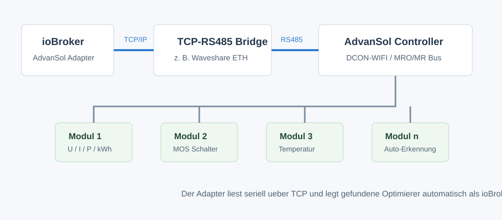
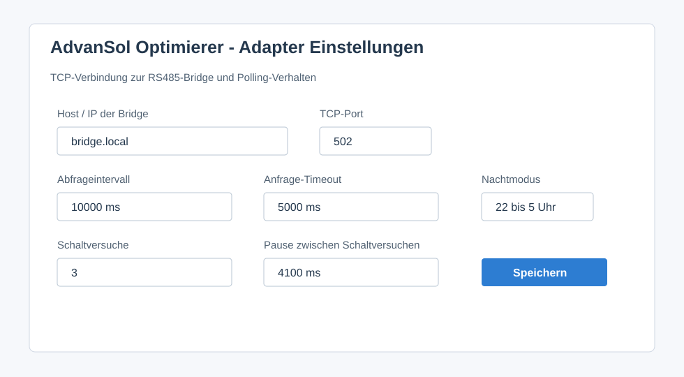
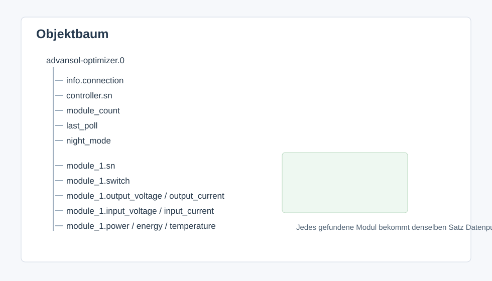

# IoBroker AdvanSol Optimizer Adapter
Адаптер ioBroker для оптимизаторов AdvanSol DCON-WIFI / MRO/MR, подключенных через мост TCP-to-RS485, например, адаптер Waveshare ETH-to-RS485.

Информация о продукте и производителе доступна в разделе [Официальный сайт AdvanSol Power](https://www.advansol-power.com/).

Адаптер основан на оригинальном JavaScript-скрипте ioBroker `Advinsol Optimierer2` и переносит логику в специальное пространство имен адаптера ioBroker.

## Функции
- Подключается к мосту TCP RS485.
- Считывает серийный номер контроллера.
- Автоматически обнаруживает подключенные модули оптимизатора.
- Циклически опрашивает значения модулей.
- Переключает каждый MOS оптимизатора через `module_X.switch`.
- Пропускает опрос в течение настраиваемого ночного периода.
— Отображает состояние соединения и состояние ночного режима.

## Типичная настройка
1. ioBroker работает в локальной сети.
2. Мост TCP-RS485 доступен через локальную сеть или Wi-Fi.
3. Сторона RS485 моста подключена к контроллеру AdvanSol.
4. Контроллер взаимодействует с модулями оптимизатора.

Рекомендуемая конфигурация моста:

- Режим: TCP-сервер
- Порт: тот же, что и настроен в адаптере, по умолчанию `502`.
- Настройки последовательного порта: согласование контроллера AdvanSol и шины RS485.
— RS485 A/B подключен правильно
— На шине RS485 активен только один ведущий компонент.

## Настройки адаптера

| Настройка | Значение | По умолчанию |
| --- | --- | --- |
| `Host` | IP-адрес или имя хоста моста TCP-RS485 | пусто |
| `Polling interval` | Время между циклами опроса в миллисекундах | `10000` |
| `Request timeout` | Максимальное время ожидания ответа | `5000` |
| `Switch retries` | Количество повторных команд переключения MOS | `3` |
| `Switch retry delay` | Задержка между попытками переключения | `4100` |
| `Night mode starts` | Час, в течение которого опрос пропускается | `22` |
| `Night mode ends` | Час возобновления голосования | `5` |
| «Ночной режим завершен» | Час, когда возобновляется опрос | «5» |

Ночное окно позволяет избежать ненужных ошибок, возникающих, когда оптимизаторы не реагируют ночью или при отсутствии напряжения на фотоэлектрической стороне.

## Штаты

Генеральные штаты:

| Государство | Значение |
| --- | --- |
| `info.connection` | Подключение к мосту TCP-RS485 |
| `controller.sn` | Серийный номер контроллера |
| `module_count` | Количество обнаруженных оптимизаторов |
| `last_poll` | Время последнего успешного цикла опроса |
| `night_mode` | Обнаружен адаптер для ночного режима |
| `night_mode` | Адаптер обнаружил ночной режим |

Каждому оптимизатору присваивается канал с именами `module_1`, `module_2`, `module_3` и так далее.

| Штат | Значение | Единица измерения |
| --- | --- | --- |
| `module_X.sn` | Серийный номер оптимизатора | |
| `module_X.mos` | Состояние MOS, `0` выключено и `1` включено | |
| `module_X.software` | Версия программного обеспечения | |
| `module_X.hardware` | Версия оборудования | |
| `module_X.output_voltage` | Выходное напряжение | В |
| `module_X.output_current` | Выходной ток | А |
| `module_X.input_voltage` | Входное напряжение | В |
| `module_X.input_current` | Входной ток | А |
| `module_X.power` | Мощность | Вт |
| `module_X.energy` | Общая энергия | кВт·ч |
| `module_X.temperature` | Температура | °C |
| `module_X.raw` | Исходный ответ в виде шестнадцатеричной строки | |
| `module_X.last_update` | Последнее обновление модуля | |
| `module_X.last_update` | Последнее обновление модуля | |

## Переключение оптимизаторов
Состояние `module_X.switch` допускает запись. Установка его в `true` отправляет команду включения MOS для серийного номера модуля. Установка его в `false` отправляет команду выключения MOS.

Адаптер повторяет команду в соответствии с `Switch retries` и ожидает `Switch retry delay` между попытками. Это сделано намеренно, поскольку преобразователи TCP-RS485 и модули оптимизатора могут не сразу подтверждать каждую команду.

## Поиск неисправностей
- Нет соединения: проверьте IP-адрес, порт и режим TCP-сервера моста.
- `TCP connect timeout`: мост недоступен или порт указан неверно.
- Модули не обнаружены: проверьте RS485 A/B, питание контроллера и питание со стороны фотоэлектрических панелей.
- Нет ответов в дневное время: проверьте параметры и проводку RS485.
- Отсутствие отклика в ночное время: обычно это нормально, если оптимизаторы переходят в спящий режим без напряжения от солнечных батарей. Отрегулируйте ночное окно.
- Переключение не работает: должен быть известен серийный номер, модуль должен отвечать, при необходимости увеличьте количество попыток переключения.
- Наличие нескольких систем на шине: убедитесь, что активным ведущим устройством, отправляющим кадры, является не более одного.

## Changelog

### **WORK IN PROGRESS**
- (ioBroker-Bot) Adapter requires admin >= 7.8.23 now.

### 0.1.12

- Fixed all findings from the ioBroker latest-repository review.
- Added the official AdvanSol manufacturer link and removed direct-install instructions.
- Changed object names to English and improved state roles and units.
- Validated all configurable timing values and changed polling to sequential timeouts.
- Completed all required admin and adapter-description translations.

### 0.1.11

- Published the adapter with npm provenance.
- Completed repository checker cleanup.

### 0.1.8

- Configured npm token based release publishing for the automated deploy workflow.

### 0.1.7

- Kept the standard ioBroker test workflow focused on package and integration tests.

### 0.1.6

- Switched CI to the standard ioBroker testing actions.
- Added standard package and integration tests for the repository checker.
- Added ioBroker development tooling and release configuration.
- Enabled jsonConfig i18n files.

### 0.1.5

- Fixed remaining adapter checker findings for repository metadata, workflow configuration and admin configuration.

### 0.1.4

- Published through the automated GitHub Actions release workflow with npm provenance.

### 0.1.3

- Added GitHub Actions release workflow with npm provenance publishing.
- Added responsive admin configuration metadata.
- Added repository metadata required by the ioBroker adapter checker.
- Updated README content for English-only publication checks.

### 0.1.2

- Updated package metadata for ioBroker adapter checker compatibility.
- Added repository, testing, license information, tier and extended translations.

### 0.1.1

- Added adapter icon and localized admin configuration labels.

### 0.1.0

- Initial adapter version based on the existing ioBroker JavaScript optimizer script.

Older entries can be moved to [CHANGELOG_OLD.md](CHANGELOG_OLD.md) when the changelog grows.

## License

Copyright (c) 2026 TheBam

MIT License. See [LICENSE](LICENSE) for details.