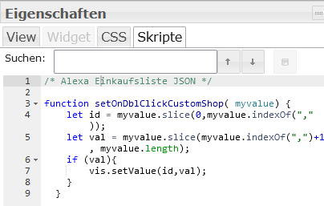

# ioBroker.alexa-shoppingList

\*\*Тесты:

**Этот адаптер использует библиотеки Sentry для автоматического сообщения разработчикам об исключениях и ошибках в коде.** Для получения более подробной информации и инструкций по отключению сообщений об ошибках, пожалуйста, обратитесь к [документации Sentry-Plugin](https://github.com/ioBroker/plugin-sentry#plugin-sentry) ! Использование системы отчетности Sentry начинается с версии js-controller 3.0.

## адаптер alexa-shoppingList для ioBroker

Генерирует список покупок с помощью Alexa.

Вы также можете использовать другие списки из Alexa — настройте это в параметрах администратора. Новый интерфейс администратора значительно упрощает этот процесс.

Предусмотрен режим добавления новых элементов: просто введите текст и нажмите Enter. Вы можете удалять активные и неактивные списки. Также можно перемещать отдельные элементы в обоих направлениях.

Надеюсь, вам понравится.

**Если вам понравилось, пожалуйста, рассмотрите возможность пожертвования:**

[](https://www.paypal.com/donate/?hosted_button_id=7QGL5CXJCUSCE)

## Точки данных

| Имя пользователя DP   | Тип         | Описание                                                                                                                                                                           |
| --------------------- | ----------- | ---------------------------------------------------------------------------------------------------------------------------------------------------------------------------------- |
| add\_position         | Нить        | Введите текст для вставки в список.                                                                                                                                                |
| delete\_activ\_list   | Кнопка      | Очищает список активных элементов и перемещает их в список неактивных.                                                                                                             |
| delete\_inactiv\_list | Кнопка      | Очищает список неактивных пользователей                                                                                                                                            |
| position\_to\_shift   | Число       | Вы можете ввести порядковый номер позиции перемещаемого элемента, а затем нажать кнопку «Переместить в список активных элементов» или «Переместить в список неактивных элементов». |
| список\_актив         | JSON        | Список действий в формате JSON                                                                                                                                                     |
| list\_active\_sort    | Выключатель | Вы можете отсортировать список активных элементов по имени или по времени добавления.                                                                                              |
| список\_неактивных    | JSON        | Список неактивных пользователей в формате JSON.                                                                                                                                    |
| list\_inactive\_sort  | Выключатель | Вы можете отсортировать список неактивных пользователей по имени или по времени добавления.                                                                                        |
| to\_activ\_list       | Кнопка      | Сначала вставьте position\_to\_shift, а затем нажмите кнопку, чтобы перейти в activ\_list.                                                                                         |
| to\_inactive\_list    | Кнопка      | Сначала вставьте position\_to\_shift, а затем нажмите кнопку, чтобы переместиться в список неактивных пользователей.                                                               |

| Атрибут в JSON | Описание                                                               |
| -------------- | ---------------------------------------------------------------------- |
| имя            | Название товара                                                        |
| время          | Отметка времени вставки                                                |
| идентификатор  | идентификатор в адаптере Alexa2                                        |
| поз            | Позиция в списке                                                       |
| buttonmove     | Кнопка для перемещения в список активных или неактивных пользователей. |
| buttondelete   | Кнопка для полного удаления элемента                                   |

Теперь JSON содержит 2 кнопки для перемещения элементов или удаления. Для этого вам нужно вставить код в редактор VIS в разделе Skript, вот он:

```
 /* Alexa Einkaufsliste JSON */

function setOnDblClickCustomShop( myvalue) {
    let id = myvalue.slice(0,myvalue.indexOf(","));
    let val = myvalue.slice(myvalue.indexOf(",")+1, myvalue.length);
    if (val=== "true"){
      vis.setValue(id,true);
      return
    }
    vis.setValue(id,false);
  }
```



## Changelog

<!--
	Placeholder for the next version (at the beginning of the line):
	### **WORK IN PROGRESS**
-->
### 1.1.5 (2026-06-04)

- CHORE: Update dependencies

### 1.1.4 (2026-06-04)

- CHORE: Add unit tests
- (copilot) Adapter requires node.js >= 22 now
- CHORE: Update dependencies
- CHORE: #203 Issues reported by repository checker
- CHORE: #193-Repository-Checker

### 1.1.3 (2025-11-29)

- CHORE: Update dependencies
- FIX: Error reported by sentry

### 1.1.2 (2025-09-20)

- CHORE: #145 Update dependencies

### 1.1.1 (2025-08-13)

- FIX: Error reported by sentry

## License

## License

MIT License

Copyright (c) 2021-2026 MiRo1310 <michael.roling@gmx.de>

Permission is hereby granted, free of charge, to any person obtaining a copy
of this software and associated documentation files (the "Software"), to deal
in the Software without restriction, including without limitation the rights
to use, copy, modify, merge, publish, distribute, sublicense, and/or sell
copies of the Software, and to permit persons to whom the Software is
furnished to do so, subject to the following conditions:

The above copyright notice and this permission notice shall be included in all
copies or substantial portions of the Software.

THE SOFTWARE IS PROVIDED "AS IS", WITHOUT WARRANTY OF ANY KIND, EXPRESS OR
IMPLIED, INCLUDING BUT NOT LIMITED TO THE WARRANTIES OF MERCHANTABILITY,
FITNESS FOR A PARTICULAR PURPOSE AND NONINFRINGEMENT. IN NO EVENT SHALL THE
AUTHORS OR COPYRIGHT HOLDERS BE LIABLE FOR ANY CLAIM, DAMAGES OR OTHER
LIABILITY, WHETHER IN AN ACTION OF CONTRACT, TORT OR OTHERWISE, ARISING FROM,
OUT OF OR IN CONNECTION WITH THE SOFTWARE OR THE USE OR OTHER DEALINGS IN THE
SOFTWARE.