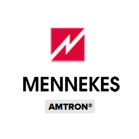

# IoBroker.amtronwallbox

**Этот адаптер использует библиотеки Sentry для автоматического сообщения разработчикам об исключениях и ошибках кода.** Более подробную информацию и информацию о том, как отключить отчеты об ошибках, см. в [Документация плагина Sentry](https://github.com/ioBroker/plugin-sentry#plugin-sentry)! Отчеты Sentry используются начиная с js-controller 3.0.

**Если вам это нравится, пожалуйста, рассмотрите возможность пожертвования:**

Адаптер служит интерфейсом для различных [Настенные коробки Amtron](https://www.mennekes.de/emobility/produkte/amtron-wallboxen/). Данные, предоставленные блоком, считываются и становятся доступными в виде точки данных в адаптере.
Данные обрабатываются только локально, подключение к облаку не требуется. Для настенных коробок, которые также поддерживают доступ для записи, адаптер может записывать данные (например, ток зарядки).
Поддерживаются следующие настенные коробки Amtron:

* Амтрон Экстра
* Amtron ChargeControl
* Амтрон Компакт

Адаптер может управлять несколькими ящиками.

## Конфигурация
Необходимо настроить только тип ящика, его IP-адрес и, при необходимости, API-ключ.

Примечание. Поскольку устройства имеют разные интерфейсы, возможно, не все интерфейсы работают напрямую. В этом случае обратитесь к разработчику.

## Известные вопросы
* создавайте проблемы на [github](https://github.com/rg-engineering/ioBroker.amtronwallbox/issues), если вы обнаружите ошибки или захотите новых функций.

## Changelog

<!--
  Placeholder for the next version (at the beginning of the line):
  ### **WORK IN PROGRESS**
-->
### 0.2.13 (2023-12-23)
* (René) just a sentry test

### 0.2.12 (2023-12-23)
* (René) see issue #162: ignore unused data from wallbox

### 0.2.11 (2023-12-16)
* (René) type of adapter changed back to "energy"

### 0.2.9 (2023-12-16)
* (René) dependencies updated

### 0.2.8 (2023-11-26)
* (René) role of states overworked

### 0.2.7 (2023-11-19)
* (René) dependencies updated

### 0.2.6 (2023-09-23)
* (René) bug fix for reported exceptions by sentry

### 0.2.5 (2023-08-27)
* (René) smaller bug fixes, see issue #59

### 0.2.4 (2023-07-30)
* (René) dependencies updated

### 0.2.3 (2023-06-01)
* (René) some changes to fullfill requirements to bring the adapter to latest

### 0.2.2 (2023-04-07)
* (René) dependencies updated

### 0.2.0 (2023-01-31)
* (René) see issue #1: write data to XTRA wallbox (experimentel)

### 0.1.0 (2022-12-18)
* (René) see issue #1: support of XTRA

### 0.0.3 (2022-08-18)
* (René) some bug fixes
* (René) change to cron
* (René) update of dependencies

### 0.0.1 (2022-05-19)
* (René) initial release

## License
MIT License

Copyright (c) 2022-2023 rg-engineering info@rg-engineering.eu

Permission is hereby granted, free of charge, to any person obtaining a copy
of this software and associated documentation files (the "Software"), to deal
in the Software without restriction, including without limitation the rights
to use, copy, modify, merge, publish, distribute, sublicense, and/or sell
copies of the Software, and to permit persons to whom the Software is
furnished to do so, subject to the following conditions:

The above copyright notice and this permission notice shall be included in all
copies or substantial portions of the Software.

THE SOFTWARE IS PROVIDED "AS IS", WITHOUT WARRANTY OF ANY KIND, EXPRESS OR
IMPLIED, INCLUDING BUT NOT LIMITED TO THE WARRANTIES OF MERCHANTABILITY,
FITNESS FOR A PARTICULAR PURPOSE AND NONINFRINGEMENT. IN NO EVENT SHALL THE
AUTHORS OR COPYRIGHT HOLDERS BE LIABLE FOR ANY CLAIM, DAMAGES OR OTHER
LIABILITY, WHETHER IN AN ACTION OF CONTRACT, TORT OR OTHERWISE, ARISING FROM,
OUT OF OR IN CONNECTION WITH THE SOFTWARE OR THE USE OR OTHER DEALINGS IN THE
SOFTWARE.
