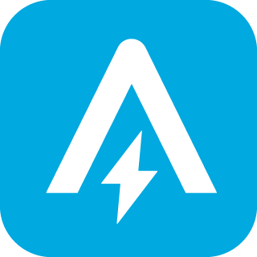

# IoBroker.ankersolix2
**Тесты:** 

## Адаптер ankersolix2 для ioBroker
Интегрировать Anker Solix 2

## Описание
Этот проект основан на https://github.com/tomquist/solix2mqtt и переносит информацию из API Anker непосредственно в ioBroker.

## Поддерживаемые устройства
У меня не все [Оборудование Anker (https://www.ankersolix.com/) доступно для тестирования. Я могу перечислить только то оборудование, которое я протестировал. Возможно, что всё остальное [оборудование Anker](https://www.ankersolix.com/) также совместимы

| Устройство | Описание |
| ------------ | --------------------------------------------------------------------------------------------------------------------------------------------- |
| `Solarbank` | - A17C0: Solarbank E1600 (1-е поколение)  - A17C1: Solarbank 2 E1600 Pro  - A17C3: Solarbank 2 E1600 Plus  - A17C5: Solarbank 3 E2700 Plus  |
| `Умный счётчик` | - A17X7: трёхфазный умный счётчик Anker с Wi-Fi  - SHEM3: Умный счетчик Shelly 3EM  - SHEMP3: Умный счетчик Shelly 3EM Pro |

## Важное изменение
Если вы обновляетесь с версии 1.x до 2.x, вам придётся заново ввести пароль! Если вы этого не сделаете, ваша учётная запись будет заблокирована!!!

## Конфигурация
1. ~~Создайте семейную учетную запись в приложении Anker и добавьте ее к своей основной учетной записи~~ С конца июля 2025 года вы можете использовать одну и ту же учетную запись в приложении и адаптере.
2. установите адаптер
3. перейдите в настройки адаптера и укажите свои учетные данные.
4. В первый раз используйте большое время опроса (180 сек.), чтобы у вас было достаточно времени остановить адаптер, если что-то пойдет не так.

Обычно в файле журнала вы можете увидеть, что у вас есть site_id и вы получили сообщение: Опубликовано.

## Управление с помощью адаптера
1. Вам необходимо войти в свою учетную запись администратора.
2. Перейдите в настройки адаптера, вкладка «Управление» и активируйте элемент управления.
3. выберите идентификатор сайта, которым вы хотите управлять.
4. Варианты контроля

4.1. Выберите точку данных, которой хотите управлять. Это может быть точка данных, заданная вручную скриптом, или точка данных интеллектуального счётчика. (Важно: значение должно быть числовым). 4.2. Вы можете настроить пользовательский план питания. Если вы хотите снова запустить план питания, вы можете управлять точкой данных ankersolix2.x.control.SetPowerplan (установите true и ack). 4.3. Вы можете включить загрузку переменного тока. Если она включена, вы можете управлять ею с помощью точки данных ankersolix2.x.control.ACLoading\ (установите true и ack = activ (текущее время + 12 ч), установите false и ack = inactiv, будет выбран пользовательский план питания).

5. нажмите «Сохранить» и перезапустите адаптер.

Примечание: Адаптер перезаписывает настройки в приложении. Чтобы снова использовать приложение, необходимо отключить адаптер или функцию управления.

## Помогает
Если у вас возникают ошибки типа 401, проверьте свои учётные данные.
Если ошибки появляются снова и вы не можете войти в систему, остановите адаптер и удалите файл session.data в папке iobroker-data/ankersolix2.0 (например, /opt/iobroker/iobroker-data/ankersolix2/), после чего снова запустите адаптер.

## Доку
- de: [zur Dokumentation](docs/de/README.md)
- ru: [для документации](docs/en/README.md)

## Хотите меня поддержать?

## Благодарности

## Changelog

<!--
    Placeholder for the next version (at the beginning of the line):
    ### **WORK IN PROGRESS**
-->
### 2.4.0 (2025-09-20)

- (ronny130286) add timeplan (schedule) and userdefine energyplan
- (ronny130286) add Powerplan and AC Loading (for AC devices)

### 2.3.0 (2025-08-16)

- (ronny130286) you can use now same account in app and adapter
- (ronny130286) now you can control the solarbank with adapter (if you use adminaccount)

### 2.2.0 (2025-06-30)

- (ronny130286) battery types and number are adjustable in the instance

### 2.1.2 (2025-05-28)

- (ronny130286) fix for Solix 3

### 2.1.1 (2025-05-15)

- (ronny130286) bugfix

### 2.1.0 (2025-04-17)

- (ronny130286) reorganized analysis option (now selectable in adminconsole)
- (ronny130286) add battery energy to solix devices
- (ronny130286) update packages

### 2.0.0 (2025-03-09)

- (ronny130286) update packages
- (ronny130286) decrypt password in adminui
- (ronny130286) add more language codes
- (ronny130286) reorganized some DP

### 1.1.0 (2025-02-08)

- (ronny130286) add analysis data for week/day
- (ronny130286) update packages

### 1.0.3 (2024-12-06)

- (ronny130286) edit refreshtimer
- (ronny130286) add to repo

### 1.0.2 (2024-12-04)

- (ronny130286) bugfix

### 1.0.1 (2024-12-01)

- (ronny130286) ESLint 9.x

### 1.0.0 (2024-11-29)

- (ronny130286) stable release
- (ronny130286) fixed backup_info object

### 0.1.0-beta.0 (2024-10-02)

- (ronny130286) beta release

### 0.0.3-alpha.0 (2024-09-25)

- (ronny130286) fix session.data
- (ronny130286) npm release

### 0.0.2-alpha.0 (2024-09-20)

- (ronny130286) initial release

## License

MIT License

Copyright (c) 2025 ronny130286 <ronnymatthei@gmx.de>

Permission is hereby granted, free of charge, to any person obtaining a copy
of this software and associated documentation files (the "Software"), to deal
in the Software without restriction, including without limitation the rights
to use, copy, modify, merge, publish, distribute, sublicense, and/or sell
copies of the Software, and to permit persons to whom the Software is
furnished to do so, subject to the following conditions:

The above copyright notice and this permission notice shall be included in all
copies or substantial portions of the Software.

THE SOFTWARE IS PROVIDED "AS IS", WITHOUT WARRANTY OF ANY KIND, EXPRESS OR
IMPLIED, INCLUDING BUT NOT LIMITED TO THE WARRANTIES OF MERCHANTABILITY,
FITNESS FOR A PARTICULAR PURPOSE AND NONINFRINGEMENT. IN NO EVENT SHALL THE
AUTHORS OR COPYRIGHT HOLDERS BE LIABLE FOR ANY CLAIM, DAMAGES OR OTHER
LIABILITY, WHETHER IN AN ACTION OF CONTRACT, TORT OR OTHERWISE, ARISING FROM,
OUT OF OR IN CONNECTION WITH THE SOFTWARE OR THE USE OR OTHER DEALINGS IN THE
SOFTWARE.