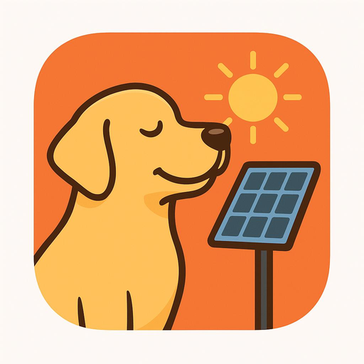

---

## 📌 Описание
Этот адаптер интегрируется с **микроинверторами APsystems EZ1** с помощью **локального HTTP API устройства (порт 8050)**.
Он позволяет считывать данные с инвертора в режиме реального времени и управлять определенными параметрами устройства.

### ✔ Поддерживаемые функции
- Считывание значений **мощности** и **энергопотребления** в режиме реального времени.
- Считывание **информации об устройстве** (прошивка, SSID, IP-адрес и т. д.)
- Прочитайте **состояния тревоги**
- Установите **максимальную мощность**
- Установить **состояние Вкл/Выкл**
- Поддержка **нескольких устройств** в одном экземпляре адаптера
- Логика таймаута HTTP и повторных попыток
- Дополнительная функция **оповещения по электронной почте** при повторных ошибках
- Включает в себя **виджет VIS2** для мониторинга и управления.

### 🔗 Информация от производителя
Страница продукта APsystems EZ1: https://apsystems.com

---

## 🛠 Установка
Установка через административную панель ioBroker:

**Адаптеры → Найдите “apsystems-ez1” → Установите**

или через командную строку:

```
iobroker install iobroker.apsystems-ez1
```

---

## ⚙️ Конфигурация
Адаптер поддерживает **несколько устройств** через массив JSON:

### **Устройства**
Пример:

```json
[
  { "name": "Roof", "ip": "192.168.1.50" },
  { "name": "Garage", "ip": "192.168.1.51" }
]
```

### PollInterval
- Интервал в секундах между опросами
- По умолчанию: 30

### HttpTimeout
- Таймаут HTTP в миллисекундах
- По умолчанию: 5000

### HttpRetries
- Количество попыток повтора
- По умолчанию: 2

### API-порт EZ1
- Номер IP-порта устройства
- По умолчанию: 8050

### AlertEmail
— Дополнительный адрес электронной почты для получения постоянных уведомлений об ошибках.
- Требуется локальная версия sendmail

---

## 📊 Созданные Штаты
Все государства созданы в соответствии с:

```
apsystems-ez1.<instance>.devices.<DeviceName>.*
```

### Информация об устройстве
|Штат |Тип |Описание|
| -------- | ------- | ------- |
|deviceId |string |DeviceID|
|devVer |string |Версия прошивки|
|SSID |строка |SSID подключенной сети Wi-Fi|
|ipAddr |string |IP-адрес устройства|

### Энергетика
|Штат |Тип |Описание|
| -------- | ------- | ------- |
|output.p1 |number |Power channel 1 (W)|
|output.p2 |number |Power channel 2 (W)|
|output.p |number |Total power (W)|
|output.e1 |number |Энергетический канал 1 (кВт·ч)|
|output.e2 |number |Энергетический канал 2 (кВт·ч)|
|выход.e |число |Общая энергия (кВт·ч)|
|output.te1 |number |Канал энергии жизненного цикла 1|
|output.te2 |number |Lifetime energy channel 2|

### Контроль
|Состояние |Тип |Написать |Описание|
| -------- | ------- | ------- | ------- |
|control.maxPower |number |yes |Установить максимальную мощность (Вт)|
|control.onOff |boolean |yes |Включить/выключить инвертор|

### Сигналы тревоги
|Штат |Тип |Описание|
| -------- | ------- | ------- |
|alarm.og |boolean |Автономная сигнализация|
|alarm.isce1 |boolean |DC1 короткое замыкание|
|alarm.isce2 |boolean |DC2 короткое замыкание|
|alarm.oe |boolean |Output fault|

## 🖼 Виджет VIS2
Шаблон виджета VIS2 включен в раздел:

```
vis2/ez1-control
```

Отображается следующее:

- Значения мощности и энергии
- Состояния тревоги
- Управление максимальной мощностью и включением/выключением

Возможно, вам потребуется изменить идентификатор экземпляра внутри виджета.

## 🌐 Локальные API-интерфейсы EZ1
Адаптер использует следующие конечные точки:

```
GET /getDeviceInfo
GET /getOutputData
GET /getMaxPower
GET /getAlarm
GET /getOnOff

GET /setMaxPower?p=VALUE
GET /setOnOff?status=0|1
```

---

## 🧪 Разработка и тестирование
Установите зависимости:

```
npm install
```

Запуск тестов:

```
npm test
```

Запустите адаптер на сервере разработки:

```
dev-server watch
```

---

## 📦 Издательство
Релизы обрабатываются через GitHub Actions.
Добавьте тег, например:

```
v0.1.7
```

и новая версия будет опубликована автоматически.

---

## 🧑‍💻 Автор
Хайнин Чжи GitHub: https://github.com/zhihaining

---

## Changelog
### 0.2.4 (2026-02-06)
- Fix review findings

### 0.2.3 (2026-01-13)
- release 0.2.3 to npm

### 0.1.6

- Fix warning at startup of validator function

### 0.1.5

- First pre‑release version

### 0.1.4

- First hardware‑tested version

### 0.1.3

- Refactor release script, add i18n step, avoid duplicates

### 0.1.2

- Fix JSON parsing and repository checker issues; add dminUI config and icons

### 0.1.1

- Initial release

---

## License

MIT License
Copyright (c) 2026

---