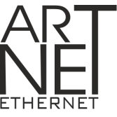

# IoBroker.artnet-recorder

## Адаптер artnet-recorder для ioBroker
Запишите данные Art-Net в файл для последующего воспроизведения.

## Цель
Простой адаптер для записи данных Art-Net, отправляемых широковещательно в JSON-файл, расположенный в пользовательских данных.
Записывается только изменение значений DMX.
При воспроизведении данные отправляются как есть, с указанием времени, хранящегося в JSON-файле.
В режиме слияния LTP или HTP сервер прослушивает все пакеты ArtDMX, отправляемые по сети, и пытается получить фактическое изображение данных DMX для добавления сохраненных значений.
Интервал или шаг отправки данных задается конфигурацией.

## Changelog

<!--
    Placeholder for the next version (at the beginning of the line):
    ### **WORK IN PROGRESS**
-->
### **WORK IN PROGRESS**
* (Bannsaenger) updated dependencies and issues from repository checker

### 0.1.5 (2025-10-24)
* (Bannsaenger) updated dependencies and issues from repository checker
* (Bannsaenger) migrate to NPM Trusted Publishing

### 0.1.4 (2025-09-06)
* (Bannsaenger) updated dependencies and issues from repository checker

### 0.1.3 (2025-02-25)
* (Bannsaenger) previous release did not work

### 0.1.2 (2025-02-25)
* (Bannsaenger) updated admin dependency

### 0.1.1 (2025-01-21)
* (Bannsaenger) removed script build on deploy

## License
MIT License

Copyright (c) 2021-2026 Bannsaenger <bannsaenger@gmx.de>

Permission is hereby granted, free of charge, to any person obtaining a copy
of this software and associated documentation files (the "Software"), to deal
in the Software without restriction, including without limitation the rights
to use, copy, modify, merge, publish, distribute, sublicense, and/or sell
copies of the Software, and to permit persons to whom the Software is
furnished to do so, subject to the following conditions:

The above copyright notice and this permission notice shall be included in all
copies or substantial portions of the Software.

THE SOFTWARE IS PROVIDED "AS IS", WITHOUT WARRANTY OF ANY KIND, EXPRESS OR
IMPLIED, INCLUDING BUT NOT LIMITED TO THE WARRANTIES OF MERCHANTABILITY,
FITNESS FOR A PARTICULAR PURPOSE AND NONINFRINGEMENT. IN NO EVENT SHALL THE
AUTHORS OR COPYRIGHT HOLDERS BE LIABLE FOR ANY CLAIM, DAMAGES OR OTHER
LIABILITY, WHETHER IN AN ACTION OF CONTRACT, TORT OR OTHERWISE, ARISING FROM,
OUT OF OR IN CONNECTION WITH THE SOFTWARE OR THE USE OR OTHER DEALINGS IN THE
SOFTWARE.

Credit:
 [Art-Net™ Designed by and Copyright Artistic Licence Holdings Ltd](https://art-net.org.uk)