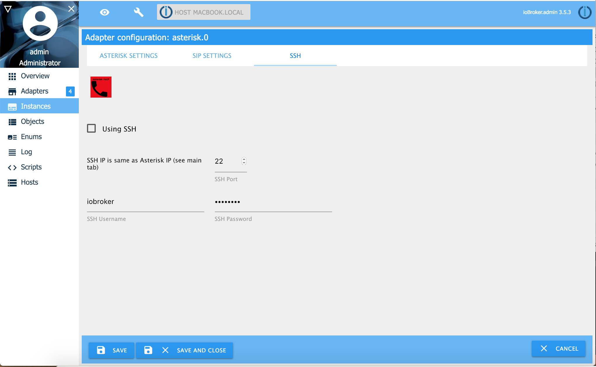
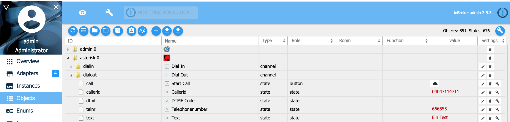
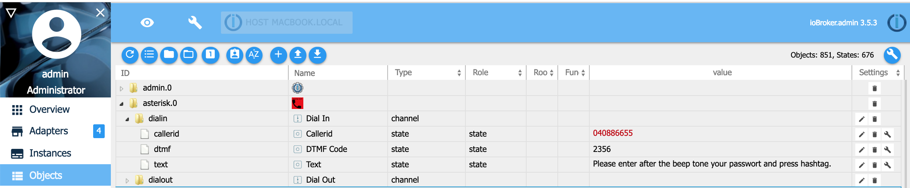

# ioBroker Asterisk VoIP Adapter

[Немецкое руководство / Deutsche Anleitung](/#/docs/adapterref/iobroker.asterisk/README_DE.md)

Адаптер Asterisk преобразует текстовые сообщения в аудиофайлы и, используя Asterisk для VoIP-звонков, позволяет позвонить на любой желаемый телефонный номер и воспроизвести аудиосообщение.

## Установка / Настройки

Для исходящих звонков Asterisk должен подключаться к вашему VoIP-провайдеру, например Telekom или Vodfone, или к вашему FritzBox! Пожалуйста, следуйте одному из этих руководств по установке.

### Пакеты Linux / ioBroker и Asterisk работают на одном сервере с ffmpeg

```sh
sudo apt-get install ffmpeg
# if asterisk package is missing, follow the instructions "Install asterisk manual"
sudo apt-get install asterisk
```

### Пакеты Linux / ioBroker и Asterisk работают на одном сервере с Sox.

Если у вас возникли проблемы с транскодированием с помощью ffmpeg, вы можете выбрать sox в качестве транскодера. Для этого необходимо установить следующие пакеты и выбрать sox в конфигурации адаптера.

```sh
sudo apt-get install lame
sudo apt-get install sox
sudo apt-get install libsox-fmt-mp3
# if asterisk package is missing, follow the instructions "Install asterisk manual"
sudo apt-get install asterisk
```

### Пакеты Linux / ioBroker и Asterisk работают на другом сервере с ffmpeg

```sh
# ioBroker server
sudo apt-get install ffmpeg
sudo apt install openssh-client
```

```sh
# asterisk server
# if asterisk package is missing, follow the instructions "Install asterisk manual"
sudo apt-get install asterisk
sudo apt-get install openssh-server
```

### Пакеты Linux / ioBroker и Asterisk работают на другом сервере с Sox.

Если у вас возникли проблемы с транскодированием с помощью ffmpeg, вы можете выбрать sox в качестве транскодера. Для этого необходимо установить следующие пакеты и выбрать sox в конфигурации адаптера.

```sh
sudo apt-get install lame
sudo apt-get install sox
sudo apt-get install libsox-fmt-mp3
```

```sh
# asterisk server
# if asterisk package is missing, follow the instructions "Install asterisk manual"
sudo apt-get install asterisk
sudo apt-get install openssh-server
```

### Установите Asterix вручную.

Если пакет apt asterisk отсутствует, вы можете установить asterisk вручную:

```sh
sudo apt install git vim curl wget libnewt-dev libssl-dev libncurses5-dev subversion libsqlite3-dev build-essential libjansson-dev libxml2-dev uuid-dev

cd /usr/src/
sudo wget https://downloads.asterisk.org/pub/telephony/asterisk/old-releases/asterisk-16.30.1.tar.gz
sudo tar xvf asterisk-16*.tar.gz
cd asterisk-16*/
sudo contrib/scripts/get_mp3_source.sh
sudo contrib/scripts/install_prereq install
sudo ./configure
sudo make menuselect

# Choose following packages in the menu:
## Add-ons: chan_ooh323 & format_mp3
## Core Sound Packages: Audio packets CORE-SOUNDS-EN-*
## Music On Hold: MOH-OPSOUND-WAV bis MOH-G729
## Extra Sound: EXTRA-SOUNDS-EN-WAV bis EXTRA-SOUNDS-EN-G729
## Applications: app_macro
## Exit with "Save&Exit".

sudo make
sudo make install
sudo make progdocs # (optional documentation)
sudo make samples
sudo make config
sudo ldconfig

sudo groupadd asterisk
sudo useradd -r -d /var/lib/asterisk -g asterisk asterisk
sudo usermod -aG audio,dialout asterisk
sudo chown -R asterisk:asterisk /etc/asterisk
sudo chown -R asterisk:asterisk /var/{lib,log,spool}/asterisk
sudo chown -R asterisk:asterisk /usr/lib/asterisk

# asterisk as default user for asterisk
sudo nano /etc/default/asterisk
AST_USER="asterisk"
AST_GROUP="asterisk"

# Insert/ replae follwoing in the config file /etc/asterisk/asterisk.conf
sudo nano /etc/asterisk/asterisk.conf
runuser = asterisk ; The user to run as.
rungroup = asterisk ; The group to run as

sudo ufw allow proto tcp from any to any port 5060,5061 # (optional open Firewall, if activ)

sudo systemctl restart asterisk
sudo systemctl enable asterisk

# Check state of asterisk
sudo systemctl status asterisk
sudo asterisk -rvv
```

### Настройка звездочки

В следующих документах подробно описана процедура настройки Asterisk.

- Настройка [Asterisk через SIP с помощью FritzBox](/#/docs/adapterref/iobroker.asterisk/docs/SIP_FRITZBOX.md) (самый простой способ)
- Настройка [Asterisk через PJSIP с использованием FriztBox](/#/docs/adapterref/iobroker.asterisk/docs/PJSIP_FRITZBOX.md) (pjsip — более современная версия SIP).
- Настройка [Asterisk через PJSIP с Telekom в качестве провайдера.](/#/docs/adapterref/iobroker.asterisk/docs/PJSIP_TELEKOM.md)
- Настройка [Asterisk через PJSIP с использованием Sipgate в качестве провайдера.](/#/docs/adapterref/iobroker.asterisk/docs/PJSIP_SIPGATE.md)

### Настройка с использованием SSH

Если ioBroker и Asterisk установлены на разных пользователях, на сервере Asterisk вам потребуется пользователь с доступом с сервера ioBroker для входа по SSH. У этого пользователя должны быть права пользователя Unix для записи файлов, которые Asterisk может читать. На сервере Asterisk создайте каталог с именем, указанным в конфигурации адаптера ioBroker Asterisk, под именем _«Путь для временных аудиофайлов»_ . Этот путь должен быть доступен и авторизован для Asterisk и SSH, поскольку ioBroker отправляет сгенерированный аудиофайл (ваше текстовое сообщение) по SCP на сервер Asterisk и сохраняет его в «Пути для временных аудиофайлов». После этого ioBroker через API AMI отправит сообщение в Asterisk для набора номера и воспроизведения сгенерированного аудиофайла, сохраненного в указанном пути.



## Использование звездочки

### Использование Asterisk с объектами/состояниями для исходящих звонков.

Самый простой способ использовать Asterisk — через страницу объектов ioBroker. Там заполните следующие значения в параметре dialout:

- Вызов: нажмите кнопку, чтобы начать вызов.
- callerid: номер телефона, который будет отображаться вызываемому абоненту.
- DTMF: вызываемый абонент нажал цифры на клавиатуре.
- telnr: номер для набора
- текст: текст, который будет воспроизводиться вызываемому абоненту.
- язык: текст будет преобразован в аудио на этом языке



### Использование Asterisk с объектами/состояниями для совершения звонков.

Если вы настроили своего SIP-провайдера (например, Fritzbox, Sipgate и т. д.) и конфигурацию Asterisk для разрешения входящих вызовов, вы можете установить следующий параметр.

- callerid: номер телефона, с которого был совершен звонок asteriks
- DTMF: абоненты нажимали цифры на клавиатуре.
- текст: текст, который будет воспроизведен для звонящего.
- язык: текст будет преобразован в аудио на этом языке



### Использование Asterisk с JavaScript или Blocky для исходящих звонков.

Теперь вы можете использовать адаптер в своих программах на JavaScript или Blocky.

```sh
const number   = '040 666-7766';
const callerid = '040 123 999'; // optional, if not set anonymous call
const msg      = 'Hello, this textmessage will be converted to audio';

// call telephone nummber 040 666-7766 and play text message as audio
sendTo('asterisk.0', 'dial', { telnr: number, callerid: callerid, text:  msg},  (res) => {
      console.log(`Result: ${JSON.stringify(res)}`);
});

// call telephone nummber 040 666-7766 and play mp3 audio file
// mp3 file has to exist on asterix server
sendTo('asterisk.0', 'dial', { telnr: number, callerid: callerid, audiofile: '/tmp/audio.mp3'},  (res) => {
      console.log(`Result: ${JSON.stringify(res)}`);
});

// call telephone nummber 040 666-7766 and play gsm audio file
// gsm file has to exist on asterix server
sendTo('asterisk.0', 'dial', { telnr: number, callerid: callerid, audiofile: '/tmp/audio.gsm'},  (res) => {
      console.log(`Result: ${JSON.stringify(res)}`);
});

// create dial in message
sendTo('asterisk.0', 'dial', { text:  'Please enter PIN after hashtag.' },  (res) => {
      console.log(`Result: ${JSON.stringify(res)}`);
});

// Show entered DTMF code
on({ id: 'asterisk.0.dialin.dtmf'/*DTMF Code*/ },  (obj) => {
    const dtmf = obj.state.val;
    console.log(`DTMF: ${dtmf}`);
});

// Show entered DTMF code
on({ id: 'asterisk.0.dialout.dtmf'/*DTMF Code*/ },  (obj) => {
    const dtmf = obj.state.val;
    console.log(`DTMF: ${dtmf}`);
});

```

> В операторе sendTo можно использовать следующий параметр:
>
> - **language:** язык, используемый функцией преобразования текста в речь (TTS). (Допустимые значения: 'DE', 'EN', ... По умолчанию используется системный язык ioBroker)
> - **repeat:** сколько раз следует повторить аудиосообщение (допустимые значения от 1 до n, по умолчанию 5)
> - **Приоритет:** если вы отправляете одновременно множество команд sendTo, сообщения с наименьшим приоритетом будут отправлены первыми (допустимые значения от 1 до n, по умолчанию 1).
> - **текст:** текстовое сообщение, которое будет отправлено в аудиоформате.
> - **timeout:** Время ожидания установления соединения в миллисекундах (по умолчанию 60000 мс)
> - **async:** Позволяет генерировать несколько вызовов без ожидания ответа (допустимые значения: false/true, по умолчанию false)
> - **audiofile:** если используется параметр text, преобразованный в аудио текст будет сохранен в файле audiofile. Если файл audiofile существует, он будет перезаписан. Если параметр text не используется, будет воспроизведен файл audiofile.
> - **callerid:** Определяет идентификатор (ваш номер телефона отправителя). Если callerid отсутствует, переданный номер телефона будет анонимным.
> - **telnr:** номер телефона для набора.

## Решение проблем

Если у вас возникли проблемы с Asterisk, попробуйте поискать что-нибудь в лог-файлах в каталоге /var/log/asterisk. После запуска Asterisk вы можете вызвать его с помощью команды \`asterisk -rvvvvvv\` в командной оболочке для отладки. После запуска \`asterisk -rvvvvvv\` вы можете инициализировать вызов через iobroker и посмотреть, что произойдет.

## Changelog
### 2.0.3 (2025-03-30)

- (Stübi) Bugfixing in sendto function
- (Stübi) Add Object repeat
- (Stübi) Fixing @iobroker/adapter-dev 1.0.1 specified. 1.3.0 is required as minimum, 1.3.0 is recommended (Issue #57)
- (Stübi) Fixing dependency (Issue #58)
- (Stübi) Fixing issue with missing template directory (Issue #56 and #65)

### 2.0.2 (2025-02-01)

- (Stübi) Add Create Directory
- (Stübi) Add translation for configuration
- (Stübi) Bugfixing

### 2.0.1 (2025-01-24)

- (Stübi) Fix error by using asterisk and iobroker on the same server
- (Stübi) Add action command for send messages
- (Stübi) Add dial in command for send messages
- (Stübi) Add create butteon for create dial in file

### 2.0.0 (2025-01-24)

- (Stübi) Redesign of Asterisk
- (Stübi) Switching from Javascript to Typescript
- (Stübi) Nodes 20 and 22 are now supported
- (Stübi) js controllers in versions 6 and 7 are supported
- (Stübi) Attention: Passwords must be re-entered from this version!
- (Stübi) Language object added
- (Stübi) Revision of the reconnect if Asterisk is restarted once
- (Stübi) Fixing errors from repository checker (Issue #51)
- (Stübi) Add documentation how to install asterisk manual (Issue #33)

### 1.0.6 ((2019-02-27)

- (Stübi) Update documentation and templates
- (Stübi) Asterisk adapter can create now asterisk configuration files. You have to rename and move them afterwards to the /etc/asterisk directory
- (Stübi) a new documentation for using Sipgate as provide.
- (Stübi) Now you can call internal fritzbox numbers. You must change your extensions.ael if you install the version 1.0.4! (replace **10 => { ... }** with **\_. => { ... }**)
- (Stübi) You can install asterisk on a different server and use scp to transfer audio files from ioBroker to asterisk.
- (Stübi) You can use the service PJSIP instead of SIP now.
- (Stübi) Support js-controller compact mode
- (Stübi) Calling without extension, if you do not use the fritzbox for example (leave sip.conf username in adapter config empty)
- (Stübi) Instead of ffmpeg you can use now sox too
- (Stübi) Update with languages
- (Stübi) Add Callerid to dialin states
- (Stübi) A lot of new features. Now you can call ioBroker / Asterisk by telephone number and enter a DTMF Code.
- (Stübi) You can enter a DTMF Code if you get called by ioBroker / Asterisk
- (Stübi) Bugfixing and password will be saved encrypted and text message size can be unlimited
- (Stübi) First Version

## License

The MIT License (MIT)

Copyright (c) 2025 Thorsten Stueben <thorsten@stueben.de> / <https://github.com/schmupu>

Permission is hereby granted, free of charge, to any person obtaining a copy
of this software and associated documentation files (the "Software"), to deal
in the Software without restriction, including without limitation the rights
to use, copy, modify, merge, publish, distribute, sublicense, and/or sell
copies of the Software, and to permit persons to whom the Software is
furnished to do so, subject to the following conditions:

The above copyright notice and this permission notice shall be included in
all copies or substantial portions of the Software.

THE SOFTWARE IS PROVIDED "AS IS", WITHOUT WARRANTY OF ANY KIND, EXPRESS OR
IMPLIED, INCLUDING BUT NOT LIMITED TO THE WARRANTIES OF MERCHANTABILITY,
FITNESS FOR A PARTICULAR PURPOSE AND NONINFRINGEMENT. IN NO EVENT SHALL THE
AUTHORS OR COPYRIGHT HOLDERS BE LIABLE FOR ANY CLAIM, DAMAGES OR OTHER
LIABILITY, WHETHER IN AN ACTION OF CONTRACT, TORT OR OTHERWISE, ARISING FROM,
OUT OF OR IN CONNECTION WITH THE SOFTWARE OR THE USE OR OTHER DEALINGS IN
THE SOFTWARE.