# IoBroker.atlas-scientific-ezo-i2c
**Тесты:** 

### Если вам нравится этот адаптер, пожалуйста, прочитайте его до конца и помогите мне пожертвовать мои усилия
Я рад каждому человеку, которому я могу помочь интегрировать эти замечательные датчики Atlas Scientific в их собственный дом, и я надеюсь, что вы представляете, сколько времени и усилий требует разработка такого адаптера. Тем не менее, я очень благодарен за вашу помогите мне с пожертвованием в Paypal..

[](https://www.paypal.com/donate/?hosted_button_id=7PGJFJX8X3Y82)

## Адаптер Atlas Scientific EZO I2C для ioBroker
Этот адаптер ioBroker интегрирует несколько устройств Atlas Scientific EZO https://atlas-scientific.com/ в вашу собственную среду ioBroker. Устройства EZO должны быть настроены для шины I2C и должны быть установлены на устройстве (например, RaspberryPi..) с настроенной и включенной шиной I2C.

### Поддерживаемые в настоящее время устройства
* EZO DO - Растворенный кислород -> https://atlas-scientific.com/dissolved-oxygen
* ЭЗО ОВП - Окислительно-восстановительный потенциал -> https://atlas-scientific.com/orp
* EZO pH - потенциал водорода -> https://atlas-scientific.com/ph
* EZO RTD - Датчик температуры сопротивления -> https://atlas-scientific.com/temperature
* EZO PMP — встроенный перистальтический дозирующий насос -> https://atlas-scientific.com/peristaltic/ezo-pmp/ (не тестировалось из-за отсутствия оборудования)
* EZO EC - Электропроводность -> https://atlas-scientific.com/conductivity

### Поддержка в будущем
* Пожалуйста, создайте вопрос с запросом функции, если вы думаете о дальнейших реализациях

## Начиная
### Монтаж
Особенно убедитесь, что вы правильно настроили и включили I2C в своей системе (при необходимости):

- [Настройка I2C на Raspberry Pi](https://github.com/fivdi/i2c-bus/blob/master/doc/raspberry-pi-i2c.md)

### Настройка адаптера
После установки адаптера и предварительной настройки на RaspberryPi вы найдете новый адаптер в разделе Instaces, где вы сможете дополнительно настроить свои датчики.

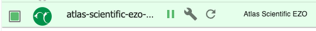

При нажатии на значок гаечного ключа появится новое окно настроек, предварительно выбранное на вкладке «Общие» настройки.

Здесь вы должны вставить номер I2C в текстовое поле, которое было настроено на Raspberry Pi (0 или 1). После этого вы можете нажать кнопку «Поиск устройств» для поиска всех подключенных цепей EZO. Обнаруженные адреса устройств будут перечислены слева.

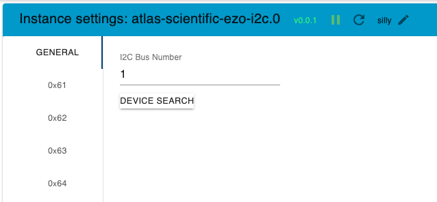

При нажатии на одно из обнаруженных устройств появляется экран «ненастроенного» устройства.

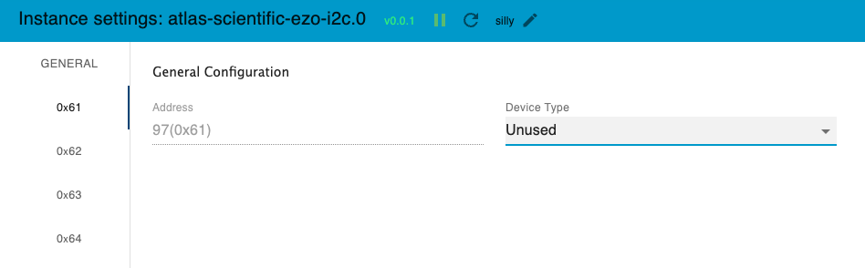

Щелкните раскрывающееся меню, чтобы выбрать тип нужного устройства.

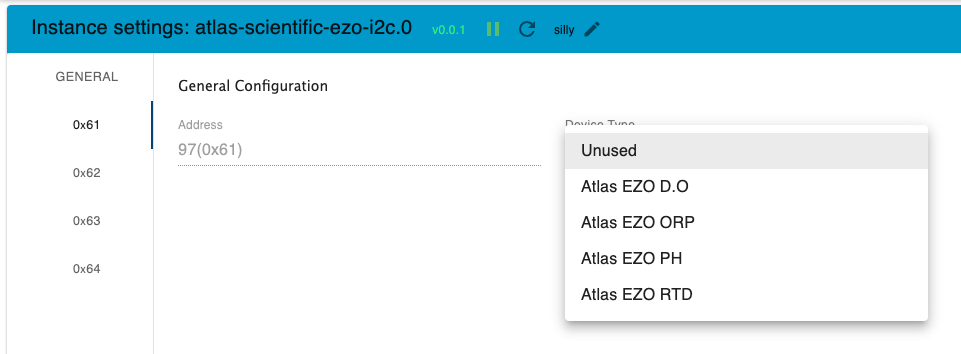

После того, как вы выбрали тип устройства, появится экран настроек для нужного устройства. Повторите эти шаги для каждого устройства, которое вы хотите использовать.

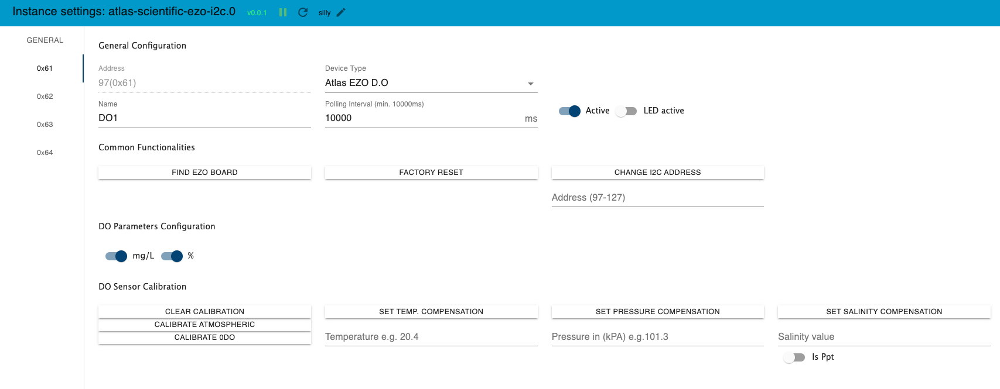

## Общая конфигурация (все устройства)
* **Адрес:** Не регулируется (кроме изменения IP-адреса)
* **Тип устройства:** Раскрывающийся список желаемого типа устройства
* **Имя:** Имя устройства, которое впоследствии будет сохранено на устройстве (пробелы будут удалены. Если длина превышает 16 символов, будут отправлены только первые 16 символов).
* **Интервал опроса:** Интервал в миллисекундах для опроса значения устройства. Если > 0, устройство будет считывать все значения в этом интервале. Пожалуйста, увеличьте интервал времени, когда вы получите неправильные показания. Я предлагаю хотя бы начать с 15000 мс
* **Активный переключатель:** включите или отключите использование этого датчика.
* **Активный переключатель светодиода:** С помощью этого параметра вы можете включить или отключить светодиод на устройстве EZO.

### Общие функции (все устройства)
* **Кнопка «Найти EZO Board»** -> При нажатии на эту кнопку светодиод на EZO Board начинает быстро мигать.
* **Кнопка «Сброс к заводским настройкам»** -> Выполните сброс к заводским настройкам для этого устройства.
* **Кнопка «Изменить адрес I2C»** -> Здесь вы можете запрограммировать новый адрес I2C для этого адаптера. Пожалуйста, убедитесь, что вы сохранили конфигурацию после этого.

### Общие состояния/объекты (все устройства)
В некоторых состояниях работает механизм обнаружения изменения состояния, который дает возможность устанавливать некоторые значения не только с помощью пользовательского интерфейса администратора, но и путем внесения изменений непосредственно в значение состояния извне. (например, с помощью скрипта или вручную) Это может быть полезно, например, если вы хотите использовать значения компенсации от датчика, такого как температура, для настройки значения температурной компенсации на датчике PH.

* **"IsPaused"** -> Переключение на временную приостановку всех показаний измерений с устройства, если оно не является "Actice" во время выполнения. true = приостановлено, false = измерения активны. По умолчанию установлено значение false (измерение активно) при запуске/перезапуске адаптера.

## Функции и настройки, связанные с DO
### DO Элементы пользовательского интерфейса администратора
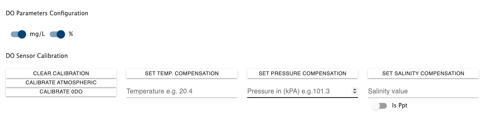

* **Кнопка «Очистить калибровку»** -> Удалить данные калибровки
* **Кнопка «Калибровать атмосферный»** -> выполнить калибровку по уровню кислорода в атмосфере
* **Кнопка "Calibrate 0DO"** -> откалибровать устройство до 0 растворенного кислорода
* **Кнопка «Установить температурную компенсацию»** -> установите температурную компенсацию с желаемым значением внутри текстового поля, например, 20,4
* **Кнопка «Установить компенсацию давления»** -> установите компенсацию давления с желаемым значением в кПа внутри текстового поля, например, 101,3
* **Кнопка «Установить компенсацию солености»** -> установите компенсацию солености с желаемым значением внутри текстового поля, например. 50000 долларов США
* **"isPpt"-Switch** -> Переключить, чтобы определить, будет ли значение солености считываться/устанавливаться в ppt вместо нас

### Состояния DO с включенным обнаружением изменения состояния
Для датчика DO следующие состояния отслеживают изменения:

* **"Температурная_компенсация"** -> Устанавливает температурную компенсацию
* **"Salinity_compensation"** -> Устанавливает компенсацию солености
* **"Pressure_compensation"** -> Устанавливает компенсацию давления
* **"Calibrate_Clear"** -> Установите значение true, чтобы сбросить калибровку датчика. Будет установлена ложная калибровка.
* **"Calibrate_Atmospheric"** -> Установите значение true, чтобы выполнить калибровку датчика атмосферы. После выполнения калибровки будет установлено значение false.
* **"Calibrate_Zero_DO"** -> Установите значение true, чтобы выполнить калибровку датчика растворенного кислорода с нулевым значением. После выполнения калибровки будет установлено значение false.

## Функции и настройки, связанные с pH
### Элементы пользовательского интерфейса администратора PH
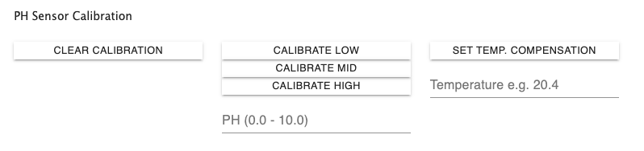

* **Кнопка «Очистить калибровку»** -> Удалить данные калибровки
* **Кнопка "Calibrate Low"** -> выполнить калибровку нижнего значения (обычно 4.0)
* **Кнопка "Calibrate Mid"** -> выполнить калибровку среднего значения (обычно 7.0)
* **Кнопка "Calibrate High"** -> выполнить калибровку верхнего значения (обычно 10.0)
* **Кнопка «Установить температурную компенсацию»** -> установите температурную компенсацию с желаемым значением внутри текстового поля, например, 20,4

### Состояния pH с включенным обнаружением изменения состояния
Для датчика pH следующие состояния отслеживают изменения:

* **"Температурная_компенсация"** -> Устанавливает температурную компенсацию
* **"Calibrate_Clear"** -> Установите значение true, чтобы сбросить калибровку датчика. Автоматически устанавливается в false после сброса калибровки.
* **"Calibrate_Low"** -> Установите значение, разделенное точкой, например. 4.0, чтобы выполнить калибровку нижнего предела с желаемым значением. Будет очищен после калибровки автоматически
* **"Calibrate_Mid"** -> Установите значение, разделенное точкой, например. 7.0, чтобы выполнить калибровку нижнего предела с желаемым значением. Будет очищен после калибровки автоматически
* **"Calibrate_High"** -> Установите значение, разделенное точкой, например. 10.0, чтобы выполнить калибровку нижнего предела с желаемым значением. Будет очищен после калибровки автоматически

## Функции и настройки, связанные с ORP
### Элементы пользовательского интерфейса администратора ORP
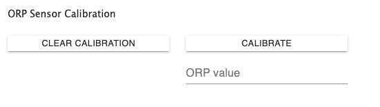

* **Кнопка «Очистить калибровку»** -> Удалить данные калибровки
* **Кнопка «Калибровка»** -> откалибровать до желаемого значения

### Состояния ORP с включенным обнаружением изменения состояния
Для датчика ОВП следующие состояния отслеживают изменения:

* **"Температурная_компенсация"**"-> Устанавливает температурную компенсацию
* **"Calibrate_Clear"** -> Установите значение true, чтобы сбросить калибровку датчика. Автоматически устанавливается в false после сброса калибровки.
* **"Калибровка"** -> Установите значение, разделенное точкой, например. xx.x мВ для запуска калибровки с желаемым значением. Будет очищен после калибровки автоматически

## Функции и настройки, связанные с EC
### Элементы пользовательского интерфейса администратора EC
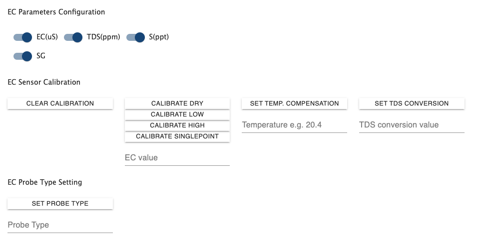

* **Кнопка «Очистить калибровку»** -> Удалить данные калибровки
* **Кнопка «Calibrate Dry»** -> запустить сухую калибровку сенсора
* **Кнопка "Calibrate Low"** -> откалибровать нижнюю точку устройства до желаемого значения
* **Кнопка "Calibrate High"** -> откалибровать верхнюю точку устройства до желаемого значения
* **Кнопка "Calibrate Singlepoint"** -> откалибровать одноточечное устройство до желаемого значения

* **Кнопка «Установить температурную компенсацию»** -> установите температурную компенсацию с желаемым значением внутри текстового поля, например, 20,4
* **Кнопка «Установить преобразование TDS»** -> установите коэффициент преобразования TDS (ppt) с желаемым значением из текстового поля от 0,001 до 1,00.
* **Кнопка «Установить тип датчика»** -> установите желаемый тип используемого датчика в текстовом поле (K0.1, K1.0 или K10)
* **"EC(us)"-Переключатель** -> Переключатель для включения или выключения "Проводимости = мкСм/см" внутри строки показаний
* **Переключатель «TDS(ppm)»** -> Переключатель для включения или выключения «Общее количество растворенных твердых веществ = ppm» внутри строки показаний
* **"S(ppt)"-Переключатель** -> Переключатель для включения или выключения "Соленость = PSU (ppt) 0,00 – 42,00" внутри строки чтения
* **Переключатель "SG"** -> Переключатель для включения или выключения "Удельный вес (только морская вода) = 1,00 – 1,300" внутри строки показаний

### Состояния EC с включенным обнаружением изменения состояния
Для датчика EC следующие состояния отслеживают изменения:

* **"Температурная_компенсация"** -> Устанавливает температурную компенсацию
* **"Calibrate_Clear"** -> Установите значение true, чтобы сбросить калибровку датчика. Будет установлена ложная калибровка.
* **"Calibrate_Singlepoint"** -> Установите значение true, чтобы запустить одноточечную калибровку датчика. После выполнения калибровки будет установлено значение false.
* **"Calibrate_Dry"** -> Установите значение true, чтобы запустить сухую калибровку датчика. После выполнения калибровки будет установлено значение false.
* **"Calibrate_Low"** -> Установите значение true, чтобы выполнить калибровку нижнего уровня датчика с желаемым значением. Будет очищен после калибровки автоматически
* **"Calibrate_High"** -> Установите значение true, чтобы выполнить калибровку высокого уровня датчика с желаемым значением. Будет очищен после калибровки автоматически

## Функции и настройки, связанные с RTD
### Элементы пользовательского интерфейса администратора RTD
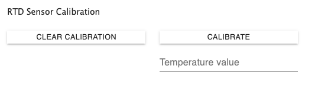

* **Кнопка «Очистить калибровку»** -> Удалить данные калибровки
* **Кнопка «Калибровка»** -> откалибровать до желаемого значения

### Состояния RTD с включенным обнаружением изменения состояния
Для датчика RTD следующие состояния отслеживают изменения:

* **"Calibrate_Clear"** -> Установите значение true, чтобы сбросить калибровку датчика. Автоматически устанавливается в false после сброса калибровки.
* **"Калибровка"** -> Установите значение, разделенное точкой, например. xx.x мВ для запуска калибровки с желаемым значением. Будет очищен после калибровки автоматически

## Функции и настройки, связанные с помпой
### Элементы административного интерфейса Pump
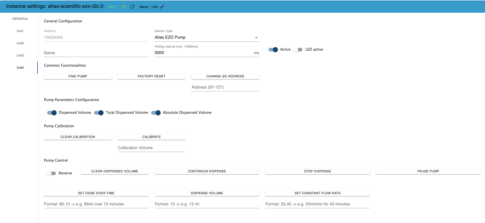

* **Кнопка «Очистить калибровку»** -> Удалить данные калибровки
* **Кнопка «Калибровать»** -> откалибровать до желаемого объема

### Секция управления насосом
* **"Reverse"-Switch** -> Если установлено в конфигурации, все команды насосу будут выполняться с установленным флажком реверса, чтобы направление насоса было обратным.
* **Кнопка «Очистить выданный объем»** -> Счетчик общего выданного объема будет установлен на 0
* **Кнопка «Непрерывное дозирование»** -> Насос будет непрерывно работать со скоростью ~105 мл/мин (с прилагаемой трубкой)
* **Кнопка «Остановить дозирование»** -> Насос немедленно прекратит дозирование
* **Кнопка «Пауза помпы»** -> Помпа немедленно приостанавливает подачу
* **Кнопка «Установить дозу по времени»** -> Помпа выдаст заданное количество мл в течение заданного времени в минутах.
* **Кнопка «Объем дозирования»** -> Помпа выдаст указанное количество мл
* **Кнопка «Установить постоянную скорость потока»** -> Насос будет подавать заданное количество мл в минуту «мл/мин» в течение заданного времени в минутах

### Состояния насоса с включенным обнаружением изменения состояния
Для насосов EZO следующие состояния отслеживают изменения:

* **"Continous_dispense"** -> Если установлено значение true, насос перейдет в режим непрерывного дозирования со скоростью 105 мл/мин (учитывается реверсивный переключатель). Если установлено значение false, помпа прекратит подачу.
* **"Dose_over_time"** -> Формат: значения, разделенные запятыми, мл, продолжительность в минутах -> Выдача заданного объема в течение заданных минут. мл для объема и продолжительности в минутах. Отрицательные значения запустят насос в обратном направлении. Состояние будет очищено автоматически после выполнения команды.
* **"Dispense_volume"** -> Выдает указанный объем (мл). Отрицательные значения запустят насос в обратном направлении. Состояние будет очищено автоматически после выполнения команды.
* **"Constant_flow_rate"** -> Формат: значения, разделенные запятыми, мл в минуту, продолжительность -> Постоянная подача заданного объема/мин в течение заданной продолжительности в минутах. мл для объема/мин и продолжительности в минутах. Отрицательные значения запустят насос в обратном направлении. Состояние будет очищено автоматически после выполнения команды.
* **"Pause_Pump"** -> Если установлено значение true, помпа будет приостановлена. Возобновление паузы выполняется при следующем действии дозирования.

## Функции и настройки, связанные с PRS
### Элементы пользовательского интерфейса администратора PRS
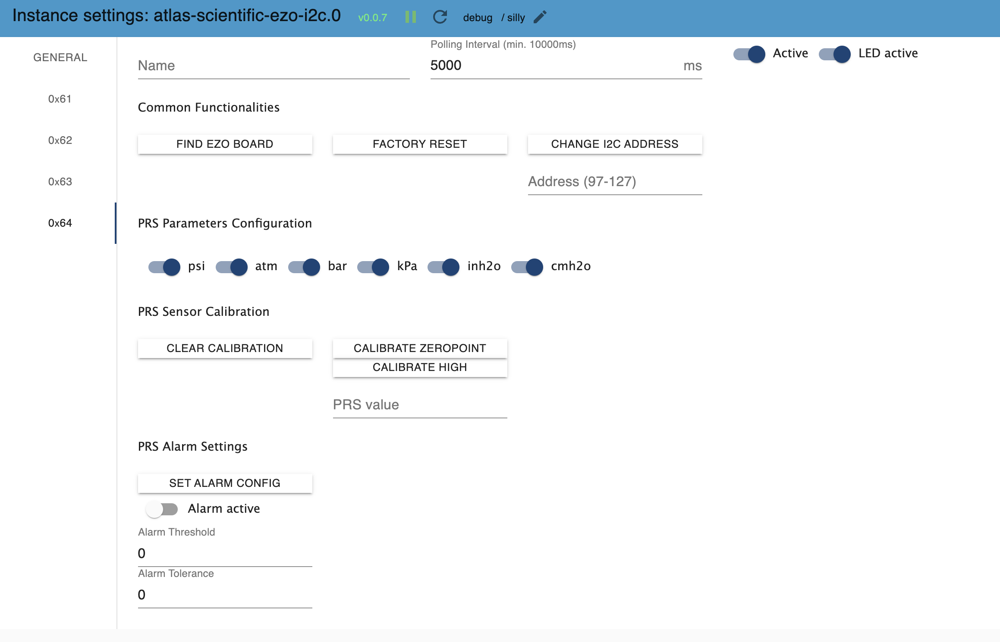

* **Кнопка «Очистить калибровку»** -> Удалить данные калибровки
* **Кнопка "Calibrate Zeropoint"** -> откалибровать нулевую точку устройства
* **Кнопка "Calibrate High"** -> откалибровать верхнюю точку устройства до желаемого значения

* **"psi"-Switch** -> Переключатель для включения или выключения "выход будет в фунтах на квадратный дюйм" внутри строки чтения
* **"atm"-Switch** -> Переключатель для включения или выключения "выход будет в атм" внутри строки чтения
* **"bar"-Switch** -> Переключатель для включения или выключения "вывод будет в баре" внутри строки чтения
* **"kPa"-Switch** -> Переключатель для включения или выключения "выход будет в кПа" внутри строки чтения
* **"inh2o"-Switch** -> Переключатель для включения или выключения "вывод будет в дюймах водяного столба" внутри строки чтения
* **"cmh2o"-Switch** -> Переключатель для включения или выключения "вывод будет в см водяного столба" внутри строки чтения

### Состояния PRS с включенным обнаружением изменения состояния
Для датчика PRS следующие состояния отслеживают изменения:

* **"Calibrate_Clear"** -> Установите значение true, чтобы сбросить калибровку датчика. Будет установлена ложная калибровка.
* **"Calibrate_Zeropoint"** -> Установите значение true, чтобы выполнить калибровку датчика нулевой точки. После выполнения калибровки будет установлено значение false.
* **"Calibrate_High"** -> Установите значение true, чтобы выполнить калибровку высокого уровня датчика с желаемым значением. Будет очищен после калибровки автоматически
* **"Alarm_enabled"** -> Установите значение true, чтобы включить сигнал тревоги от датчика, значение false, чтобы отключить
* **"Alarm_Threshold"** -> Установите желаемое значение порога срабатывания сигнализации. После изменения значение будет записано в датчик
* **"Alarm_Tolerance"** -> Установите желаемое значение порога срабатывания сигнализации. После изменения значение будет записано в датчик

## Пример визуализации с помощью Grafana Dashboard
Здесь вы можете увидеть небольшой пример того, как легко визуализировать значения адаптера. В этом примере экземпляр InfluxDB собирает и сохраняет значения, полученные от адаптера.

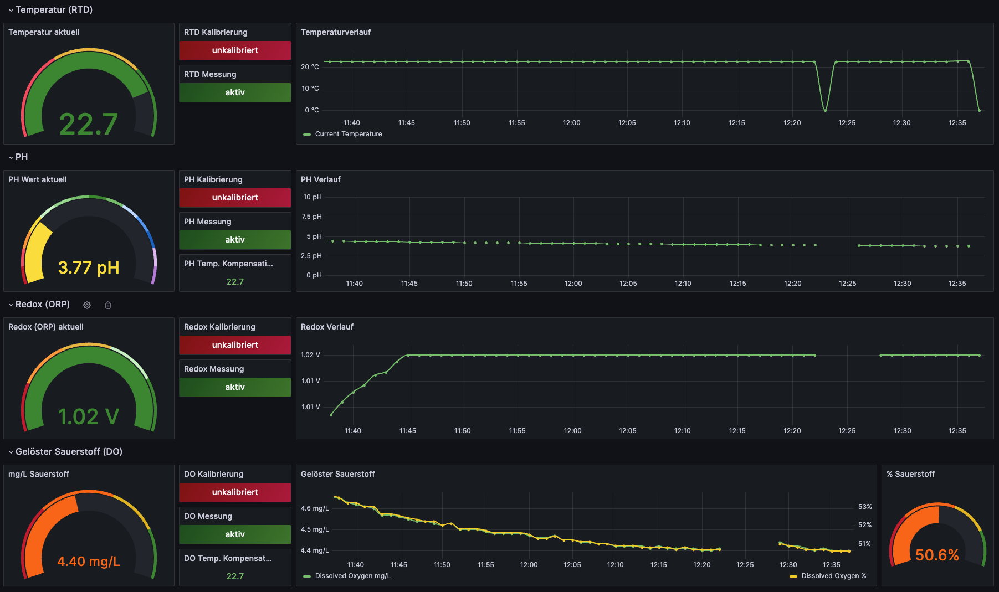

<details><summary>Пример кода Grafana-Dashboard JSON</summary>

  ### Экспорт JSON из Grafana
```json

  "annotations": {
    "list": [
      {
        "builtIn": 1,
        "datasource": {
          "type": "grafana",
          "uid": "-- Grafana --"
        },
        "enable": true,
        "hide": true,
        "iconColor": "rgba(0, 211, 255, 1)",
        "name": "Annotations & Alerts",
        "type": "dashboard"
      }
    ]
  },
  "editable": true,
  "fiscalYearStartMonth": 0,
  "graphTooltip": 0,
  "id": 1,
  "links": [],
  "liveNow": false,
  "panels": [
    {
      "collapsed": false,
      "gridPos": {
        "h": 1,
        "w": 24,
        "x": 0,
        "y": 0
      },
      "id": 16,
      "panels": [],
      "title": "Temperatur (RTD)",
      "type": "row"
    },
    {
      "datasource": {
        "type": "influxdb",
        "uid": "c9af6e75-ad53-408b-9093-079ced28a598"
      },
      "fieldConfig": {
        "defaults": {
          "color": {
            "mode": "thresholds"
          },
          "mappings": [],
          "max": 28,
          "min": 0,
          "thresholds": {
            "mode": "absolute",
            "steps": [
              {
                "color": "green",
                "value": null
              },
              {
                "color": "red",
                "value": 0
              },
              {
                "color": "#EAB839",
                "value": 10
              },
              {
                "color": "dark-green",
                "value": 20
              }
            ]
          },
          "unit": "short"
        },
        "overrides": []
      },
      "gridPos": {
        "h": 6,
        "w": 3,
        "x": 0,
        "y": 1
      },
      "id": 4,
      "options": {
        "orientation": "auto",
        "reduceOptions": {
          "calcs": [
            "lastNotNull"
          ],
          "fields": "",
          "values": false
        },
        "showThresholdLabels": false,
        "showThresholdMarkers": true
      },
      "pluginVersion": "10.0.2",
      "targets": [
        {
          "datasource": {
            "type": "influxdb",
            "uid": "c9af6e75-ad53-408b-9093-079ced28a598"
          },
          "groupBy": [
            {
              "params": [
                "$__interval"
              ],
              "type": "time"
            },
            {
              "params": [
                "null"
              ],
              "type": "fill"
            }
          ],
          "measurement": "atlas-scientific-ezo-i2c.0.0x63.Temperature",
          "orderByTime": "ASC",
          "policy": "autogen",
          "refId": "A",
          "resultFormat": "time_series",
          "select": [
            [
              {
                "params": [
                  "value"
                ],
                "type": "field"
              },
              {
                "params": [],
                "type": "last"
              }
            ]
          ],
          "tags": []
        }
      ],
      "title": "Temperatur aktuell",
      "type": "gauge"
    },
    {
      "datasource": {
        "type": "influxdb",
        "uid": "c9af6e75-ad53-408b-9093-079ced28a598"
      },
      "fieldConfig": {
        "defaults": {
          "mappings": [
            {
              "options": {
                "0": {
                  "color": "dark-red",
                  "index": 0,
                  "text": "unkalibriert"
                },
                "1": {
                  "color": "dark-green",
                  "index": 1,
                  "text": "kalibriert"
                }
              },
              "type": "value"
            }
          ],
          "thresholds": {
            "mode": "absolute",
            "steps": [
              {
                "color": "dark-red",
                "value": null
              }
            ]
          },
          "unit": "short"
        },
        "overrides": []
      },
      "gridPos": {
        "h": 2,
        "w": 2,
        "x": 3,
        "y": 1
      },
      "id": 11,
      "options": {
        "colorMode": "background",
        "graphMode": "none",
        "justifyMode": "auto",
        "orientation": "auto",
        "reduceOptions": {
          "calcs": [
            "lastNotNull"
          ],
          "fields": "",
          "values": false
        },
        "textMode": "auto"
      },
      "pluginVersion": "10.0.2",
      "targets": [
        {
          "datasource": {
            "type": "influxdb",
            "uid": "c9af6e75-ad53-408b-9093-079ced28a598"
          },
          "groupBy": [
            {
              "params": [
                "1m"
              ],
              "type": "time"
            },
            {
              "params": [
                "null"
              ],
              "type": "fill"
            }
          ],
          "measurement": "atlas-scientific-ezo-i2c.0.0x63.IsCalibrated",
          "orderByTime": "ASC",
          "policy": "autogen",
          "refId": "A",
          "resultFormat": "time_series",
          "select": [
            [
              {
                "params": [
                  "value"
                ],
                "type": "field"
              },
              {
                "params": [],
                "type": "last"
              }
            ]
          ],
          "tags": []
        }
      ],
      "title": "RTD Kalibrierung",
      "type": "stat"
    },
    {
      "datasource": {
        "type": "influxdb",
        "uid": "c9af6e75-ad53-408b-9093-079ced28a598"
      },
      "fieldConfig": {
        "defaults": {
          "color": {
            "mode": "palette-classic"
          },
          "custom": {
            "axisCenteredZero": false,
            "axisColorMode": "text",
            "axisLabel": "",
            "axisPlacement": "auto",
            "axisSoftMax": 28,
            "axisSoftMin": -2,
            "barAlignment": 0,
            "drawStyle": "line",
            "fillOpacity": 0,
            "gradientMode": "opacity",
            "hideFrom": {
              "legend": false,
              "tooltip": false,
              "viz": false
            },
            "lineInterpolation": "smooth",
            "lineStyle": {
              "fill": "solid"
            },
            "lineWidth": 2,
            "pointSize": 5,
            "scaleDistribution": {
              "type": "linear"
            },
            "showPoints": "auto",
            "spanNulls": false,
            "stacking": {
              "group": "A",
              "mode": "none"
            },
            "thresholdsStyle": {
              "mode": "off"
            }
          },
          "mappings": [],
          "thresholds": {
            "mode": "absolute",
            "steps": [
              {
                "color": "green",
                "value": null
              },
              {
                "color": "red",
                "value": 80
              }
            ]
          },
          "unit": "celsius"
        },
        "overrides": [
          {
            "matcher": {
              "id": "byName",
              "options": "atlas-scientific-ezo-i2c.0.0x61.Temperature_compensation.last"
            },
            "properties": [
              {
                "id": "displayName",
                "value": "DO temp compensation"
              }
            ]
          },
          {
            "matcher": {
              "id": "byName",
              "options": "atlas-scientific-ezo-i2c.0.0x62.Temperature_compensation.last"
            },
            "properties": [
              {
                "id": "displayName",
                "value": "PH temp compensation"
              }
            ]
          },
          {
            "matcher": {
              "id": "byName",
              "options": "atlas-scientific-ezo-i2c.0.0x63.Temperature.last"
            },
            "properties": [
              {
                "id": "displayName",
                "value": "Current Temperature"
              }
            ]
          },
          {
            "matcher": {
              "id": "byName",
              "options": "PH temp compensation"
            },
            "properties": [
              {
                "id": "color",
                "value": {
                  "fixedColor": "super-light-yellow",
                  "mode": "fixed"
                }
              }
            ]
          }
        ]
      },
      "gridPos": {
        "h": 6,
        "w": 12,
        "x": 5,
        "y": 1
      },
      "id": 1,
      "options": {
        "legend": {
          "calcs": [],
          "displayMode": "list",
          "placement": "bottom",
          "showLegend": true
        },
        "tooltip": {
          "mode": "single",
          "sort": "none"
        }
      },
      "targets": [
        {
          "datasource": {
            "type": "influxdb",
            "uid": "c9af6e75-ad53-408b-9093-079ced28a598"
          },
          "groupBy": [
            {
              "params": [
                "1m"
              ],
              "type": "time"
            },
            {
              "params": [
                "null"
              ],
              "type": "fill"
            }
          ],
          "measurement": "atlas-scientific-ezo-i2c.0.0x63.Temperature",
          "orderByTime": "ASC",
          "policy": "autogen",
          "refId": "A",
          "resultFormat": "time_series",
          "select": [
            [
              {
                "params": [
                  "value"
                ],
                "type": "field"
              },
              {
                "params": [],
                "type": "last"
              }
            ]
          ],
          "tags": []
        }
      ],
      "title": "Temperaturverlauf",
      "transformations": [
        {
          "id": "convertFieldType",
          "options": {
            "conversions": [
              {
                "destinationType": "number",
                "targetField": "atlas-scientific-ezo-i2c.0.0x63.Temperature.last"
              }
            ],
            "fields": {}
          }
        }
      ],
      "type": "timeseries"
    },
    {
      "datasource": {
        "type": "influxdb",
        "uid": "c9af6e75-ad53-408b-9093-079ced28a598"
      },
      "fieldConfig": {
        "defaults": {
          "mappings": [
            {
              "options": {
                "false": {
                  "color": "dark-green",
                  "index": 0,
                  "text": "aktiv"
                },
                "true": {
                  "color": "dark-red",
                  "index": 1,
                  "text": "pausiert"
                }
              },
              "type": "value"
            }
          ],
          "thresholds": {
            "mode": "absolute",
            "steps": [
              {
                "color": "dark-red",
                "value": null
              }
            ]
          },
          "unit": "short"
        },
        "overrides": []
      },
      "gridPos": {
        "h": 2,
        "w": 2,
        "x": 3,
        "y": 3
      },
      "id": 20,
      "options": {
        "colorMode": "background",
        "graphMode": "none",
        "justifyMode": "auto",
        "orientation": "auto",
        "reduceOptions": {
          "calcs": [
            "lastNotNull"
          ],
          "fields": "/^atlas\\-scientific\\-ezo\\-i2c\\.0\\.0x63\\.IsPaused\\.last$/",
          "values": false
        },
        "textMode": "auto"
      },
      "pluginVersion": "10.0.2",
      "targets": [
        {
          "datasource": {
            "type": "influxdb",
            "uid": "c9af6e75-ad53-408b-9093-079ced28a598"
          },
          "groupBy": [
            {
              "params": [
                "$__interval"
              ],
              "type": "time"
            },
            {
              "params": [
                "null"
              ],
              "type": "fill"
            }
          ],
          "measurement": "atlas-scientific-ezo-i2c.0.0x63.IsPaused",
          "orderByTime": "ASC",
          "policy": "autogen",
          "refId": "A",
          "resultFormat": "time_series",
          "select": [
            [
              {
                "params": [
                  "value"
                ],
                "type": "field"
              },
              {
                "params": [],
                "type": "last"
              }
            ]
          ],
          "tags": []
        }
      ],
      "title": "RTD Messung",
      "type": "stat"
    },
    {
      "collapsed": false,
      "gridPos": {
        "h": 1,
        "w": 24,
        "x": 0,
        "y": 7
      },
      "id": 15,
      "panels": [],
      "title": "PH",
      "type": "row"
    },
    {
      "datasource": {
        "type": "influxdb",
        "uid": "c9af6e75-ad53-408b-9093-079ced28a598"
      },
      "fieldConfig": {
        "defaults": {
          "color": {
            "mode": "thresholds"
          },
          "mappings": [],
          "max": 14,
          "min": 0,
          "thresholds": {
            "mode": "absolute",
            "steps": [
              {
                "color": "dark-red",
                "value": null
              },
              {
                "color": "dark-red",
                "value": 0
              },
              {
                "color": "red",
                "value": 1
              },
              {
                "color": "orange",
                "value": 2
              },
              {
                "color": "yellow",
                "value": 3
              },
              {
                "color": "super-light-green",
                "value": 4
              },
              {
                "color": "light-green",
                "value": 5
              },
              {
                "color": "green",
                "value": 6
              },
              {
                "color": "dark-green",
                "value": 7
              },
              {
                "color": "green",
                "value": 8
              },
              {
                "color": "super-light-blue",
                "value": 9
              },
              {
                "color": "blue",
                "value": 10
              },
              {
                "color": "dark-blue",
                "value": 11
              },
              {
                "color": "super-light-purple",
                "value": 12
              },
              {
                "color": "purple",
                "value": 13
              },
              {
                "color": "dark-purple",
                "value": 14
              }
            ]
          },
          "unit": "pH"
        },
        "overrides": []
      },
      "gridPos": {
        "h": 6,
        "w": 3,
        "x": 0,
        "y": 8
      },
      "id": 5,
      "options": {
        "orientation": "auto",
        "reduceOptions": {
          "calcs": [
            "lastNotNull"
          ],
          "fields": "",
          "values": false
        },
        "showThresholdLabels": false,
        "showThresholdMarkers": true,
        "text": {}
      },
      "pluginVersion": "10.0.2",
      "targets": [
        {
          "datasource": {
            "type": "influxdb",
            "uid": "c9af6e75-ad53-408b-9093-079ced28a598"
          },
          "groupBy": [
            {
              "params": [
                "$__interval"
              ],
              "type": "time"
            },
            {
              "params": [
                "null"
              ],
              "type": "fill"
            }
          ],
          "measurement": "atlas-scientific-ezo-i2c.0.0x62.PH_Value",
          "orderByTime": "ASC",
          "policy": "autogen",
          "refId": "A",
          "resultFormat": "time_series",
          "select": [
            [
              {
                "params": [
                  "value"
                ],
                "type": "field"
              },
              {
                "params": [],
                "type": "last"
              }
            ]
          ],
          "tags": []
        }
      ],
      "title": "PH Wert aktuell",
      "type": "gauge"
    },
    {
      "datasource": {
        "type": "influxdb",
        "uid": "c9af6e75-ad53-408b-9093-079ced28a598"
      },
      "fieldConfig": {
        "defaults": {
          "mappings": [
            {
              "options": {
                "0": {
                  "color": "dark-red",
                  "index": 0,
                  "text": "unkalibriert"
                },
                "1": {
                  "color": "super-light-green",
                  "index": 1,
                  "text": "Einpunkt"
                },
                "2": {
                  "color": "green",
                  "index": 2,
                  "text": "Zweipunkt"
                },
                "3": {
                  "color": "dark-green",
                  "index": 3,
                  "text": "Dreipunkt"
                }
              },
              "type": "value"
            }
          ],
          "thresholds": {
            "mode": "absolute",
            "steps": [
              {
                "color": "dark-red",
                "value": null
              }
            ]
          },
          "unit": "short"
        },
        "overrides": []
      },
      "gridPos": {
        "h": 2,
        "w": 2,
        "x": 3,
        "y": 8
      },
      "id": 12,
      "options": {
        "colorMode": "background",
        "graphMode": "none",
        "justifyMode": "auto",
        "orientation": "auto",
        "reduceOptions": {
          "calcs": [
            "lastNotNull"
          ],
          "fields": "",
          "values": false
        },
        "textMode": "auto"
      },
      "pluginVersion": "10.0.2",
      "targets": [
        {
          "datasource": {
            "type": "influxdb",
            "uid": "c9af6e75-ad53-408b-9093-079ced28a598"
          },
          "groupBy": [
            {
              "params": [
                "1m"
              ],
              "type": "time"
            },
            {
              "params": [
                "null"
              ],
              "type": "fill"
            }
          ],
          "measurement": "atlas-scientific-ezo-i2c.0.0x62.IsCalibrated",
          "orderByTime": "ASC",
          "policy": "autogen",
          "refId": "A",
          "resultFormat": "time_series",
          "select": [
            [
              {
                "params": [
                  "value"
                ],
                "type": "field"
              },
              {
                "params": [],
                "type": "last"
              }
            ]
          ],
          "tags": []
        }
      ],
      "title": "PH Kalibrierung",
      "type": "stat"
    },
    {
      "datasource": {
        "type": "influxdb",
        "uid": "c9af6e75-ad53-408b-9093-079ced28a598"
      },
      "fieldConfig": {
        "defaults": {
          "color": {
            "mode": "palette-classic"
          },
          "custom": {
            "axisCenteredZero": false,
            "axisColorMode": "text",
            "axisLabel": "",
            "axisPlacement": "auto",
            "axisSoftMax": 10,
            "axisSoftMin": 0,
            "barAlignment": 0,
            "drawStyle": "line",
            "fillOpacity": 0,
            "gradientMode": "none",
            "hideFrom": {
              "legend": false,
              "tooltip": false,
              "viz": false
            },
            "lineInterpolation": "smooth",
            "lineWidth": 1,
            "pointSize": 5,
            "scaleDistribution": {
              "type": "linear"
            },
            "showPoints": "auto",
            "spanNulls": false,
            "stacking": {
              "group": "A",
              "mode": "none"
            },
            "thresholdsStyle": {
              "mode": "off"
            }
          },
          "mappings": [],
          "thresholds": {
            "mode": "absolute",
            "steps": [
              {
                "color": "green",
                "value": null
              },
              {
                "color": "red",
                "value": 80
              }
            ]
          },
          "unit": "pH"
        },
        "overrides": []
      },
      "gridPos": {
        "h": 6,
        "w": 12,
        "x": 5,
        "y": 8
      },
      "id": 2,
      "options": {
        "legend": {
          "calcs": [],
          "displayMode": "list",
          "placement": "bottom",
          "showLegend": false
        },
        "tooltip": {
          "mode": "single",
          "sort": "none"
        }
      },
      "targets": [
        {
          "datasource": {
            "type": "influxdb",
            "uid": "c9af6e75-ad53-408b-9093-079ced28a598"
          },
          "groupBy": [
            {
              "params": [
                "1m"
              ],
              "type": "time"
            },
            {
              "params": [
                "null"
              ],
              "type": "fill"
            }
          ],
          "measurement": "atlas-scientific-ezo-i2c.0.0x62.PH_Value",
          "orderByTime": "ASC",
          "policy": "autogen",
          "refId": "A",
          "resultFormat": "time_series",
          "select": [
            [
              {
                "params": [
                  "value"
                ],
                "type": "field"
              },
              {
                "params": [],
                "type": "last"
              }
            ]
          ],
          "tags": []
        }
      ],
      "title": "PH Verlauf",
      "transformations": [
        {
          "id": "convertFieldType",
          "options": {
            "conversions": [
              {
                "destinationType": "number",
                "targetField": "atlas-scientific-ezo-i2c.0.0x63.Temperature.last"
              }
            ],
            "fields": {}
          }
        }
      ],
      "type": "timeseries"
    },
    {
      "datasource": {
        "type": "influxdb",
        "uid": "c9af6e75-ad53-408b-9093-079ced28a598"
      },
      "fieldConfig": {
        "defaults": {
          "mappings": [
            {
              "options": {
                "false": {
                  "color": "dark-green",
                  "index": 0,
                  "text": "aktiv"
                },
                "true": {
                  "color": "dark-red",
                  "index": 1,
                  "text": "pausiert"
                }
              },
              "type": "value"
            }
          ],
          "thresholds": {
            "mode": "absolute",
            "steps": [
              {
                "color": "dark-red",
                "value": null
              }
            ]
          },
          "unit": "short"
        },
        "overrides": []
      },
      "gridPos": {
        "h": 2,
        "w": 2,
        "x": 3,
        "y": 10
      },
      "id": 21,
      "options": {
        "colorMode": "background",
        "graphMode": "none",
        "justifyMode": "auto",
        "orientation": "auto",
        "reduceOptions": {
          "calcs": [
            "lastNotNull"
          ],
          "fields": "/^atlas\\-scientific\\-ezo\\-i2c\\.0\\.0x62\\.IsPaused\\.last$/",
          "values": false
        },
        "textMode": "auto"
      },
      "pluginVersion": "10.0.2",
      "targets": [
        {
          "datasource": {
            "type": "influxdb",
            "uid": "c9af6e75-ad53-408b-9093-079ced28a598"
          },
          "groupBy": [
            {
              "params": [
                "$__interval"
              ],
              "type": "time"
            },
            {
              "params": [
                "null"
              ],
              "type": "fill"
            }
          ],
          "measurement": "atlas-scientific-ezo-i2c.0.0x62.IsPaused",
          "orderByTime": "ASC",
          "policy": "autogen",
          "refId": "A",
          "resultFormat": "time_series",
          "select": [
            [
              {
                "params": [
                  "value"
                ],
                "type": "field"
              },
              {
                "params": [],
                "type": "last"
              }
            ]
          ],
          "tags": []
        }
      ],
      "title": "PH Messung",
      "type": "stat"
    },
    {
      "datasource": {
        "type": "influxdb",
        "uid": "c9af6e75-ad53-408b-9093-079ced28a598"
      },
      "fieldConfig": {
        "defaults": {
          "mappings": [],
          "thresholds": {
            "mode": "absolute",
            "steps": [
              {
                "color": "green",
                "value": null
              },
              {
                "color": "red",
                "value": 80
              }
            ]
          },
          "unit": "short"
        },
        "overrides": []
      },
      "gridPos": {
        "h": 2,
        "w": 2,
        "x": 3,
        "y": 12
      },
      "id": 10,
      "options": {
        "colorMode": "value",
        "graphMode": "area",
        "justifyMode": "auto",
        "orientation": "auto",
        "reduceOptions": {
          "calcs": [
            "lastNotNull"
          ],
          "fields": "",
          "values": false
        },
        "textMode": "auto"
      },
      "pluginVersion": "10.0.2",
      "targets": [
        {
          "datasource": {
            "type": "influxdb",
            "uid": "c9af6e75-ad53-408b-9093-079ced28a598"
          },
          "groupBy": [
            {
              "params": [
                "1m"
              ],
              "type": "time"
            },
            {
              "params": [
                "null"
              ],
              "type": "fill"
            }
          ],
          "measurement": "atlas-scientific-ezo-i2c.0.0x62.Temperature_compensation",
          "orderByTime": "ASC",
          "policy": "autogen",
          "refId": "A",
          "resultFormat": "time_series",
          "select": [
            [
              {
                "params": [
                  "value"
                ],
                "type": "field"
              },
              {
                "params": [],
                "type": "last"
              }
            ]
          ],
          "tags": []
        }
      ],
      "title": "PH Temp. Kompensation ",
      "type": "stat"
    },
    {
      "collapsed": false,
      "gridPos": {
        "h": 1,
        "w": 24,
        "x": 0,
        "y": 14
      },
      "id": 14,
      "panels": [],
      "title": "Redox (ORP)",
      "type": "row"
    },
    {
      "datasource": {
        "type": "influxdb",
        "uid": "c9af6e75-ad53-408b-9093-079ced28a598"
      },
      "fieldConfig": {
        "defaults": {
          "color": {
            "mode": "thresholds"
          },
          "mappings": [],
          "max": 1019,
          "min": 0,
          "thresholds": {
            "mode": "absolute",
            "steps": [
              {
                "color": "green",
                "value": null
              },
              {
                "color": "dark-red",
                "value": 0
              },
              {
                "color": "orange",
                "value": 200
              },
              {
                "color": "#EAB839",
                "value": 400
              },
              {
                "color": "super-light-green",
                "value": 600
              },
              {
                "color": "dark-green",
                "value": 800
              },
              {
                "color": "dark-green",
                "value": 1019
              }
            ]
          },
          "unit": "mvolt"
        },
        "overrides": []
      },
      "gridPos": {
        "h": 6,
        "w": 3,
        "x": 0,
        "y": 15
      },
      "id": 6,
      "options": {
        "orientation": "auto",
        "reduceOptions": {
          "calcs": [
            "lastNotNull"
          ],
          "fields": "",
          "values": false
        },
        "showThresholdLabels": false,
        "showThresholdMarkers": true,
        "text": {}
      },
      "pluginVersion": "10.0.2",
      "targets": [
        {
          "datasource": {
            "type": "influxdb",
            "uid": "c9af6e75-ad53-408b-9093-079ced28a598"
          },
          "groupBy": [
            {
              "params": [
                "$__interval"
              ],
              "type": "time"
            },
            {
              "params": [
                "null"
              ],
              "type": "fill"
            }
          ],
          "measurement": "atlas-scientific-ezo-i2c.0.0x64.ORP_Value",
          "orderByTime": "ASC",
          "policy": "autogen",
          "refId": "A",
          "resultFormat": "time_series",
          "select": [
            [
              {
                "params": [
                  "value"
                ],
                "type": "field"
              },
              {
                "params": [],
                "type": "last"
              }
            ]
          ],
          "tags": []
        }
      ],
      "title": "Redox (ORP) aktuell",
      "type": "gauge"
    },
    {
      "datasource": {
        "type": "influxdb",
        "uid": "c9af6e75-ad53-408b-9093-079ced28a598"
      },
      "fieldConfig": {
        "defaults": {
          "mappings": [
            {
              "options": {
                "0": {
                  "color": "dark-red",
                  "index": 0,
                  "text": "unkalibriert"
                },
                "1": {
                  "color": "dark-green",
                  "index": 1,
                  "text": "kalibriert"
                }
              },
              "type": "value"
            }
          ],
          "thresholds": {
            "mode": "absolute",
            "steps": [
              {
                "color": "dark-red",
                "value": null
              }
            ]
          },
          "unit": "short"
        },
        "overrides": []
      },
      "gridPos": {
        "h": 2,
        "w": 2,
        "x": 3,
        "y": 15
      },
      "id": 17,
      "options": {
        "colorMode": "background",
        "graphMode": "none",
        "justifyMode": "auto",
        "orientation": "auto",
        "reduceOptions": {
          "calcs": [
            "lastNotNull"
          ],
          "fields": "",
          "values": false
        },
        "textMode": "auto"
      },
      "pluginVersion": "10.0.2",
      "targets": [
        {
          "datasource": {
            "type": "influxdb",
            "uid": "c9af6e75-ad53-408b-9093-079ced28a598"
          },
          "groupBy": [
            {
              "params": [
                "1m"
              ],
              "type": "time"
            },
            {
              "params": [
                "null"
              ],
              "type": "fill"
            }
          ],
          "measurement": "atlas-scientific-ezo-i2c.0.0x64.IsCalibrated",
          "orderByTime": "ASC",
          "policy": "autogen",
          "refId": "A",
          "resultFormat": "time_series",
          "select": [
            [
              {
                "params": [
                  "value"
                ],
                "type": "field"
              },
              {
                "params": [],
                "type": "last"
              }
            ]
          ],
          "tags": []
        }
      ],
      "title": "Redox Kalibrierung",
      "type": "stat"
    },
    {
      "datasource": {
        "type": "influxdb",
        "uid": "c9af6e75-ad53-408b-9093-079ced28a598"
      },
      "fieldConfig": {
        "defaults": {
          "color": {
            "mode": "palette-classic"
          },
          "custom": {
            "axisCenteredZero": false,
            "axisColorMode": "text",
            "axisLabel": "",
            "axisPlacement": "auto",
            "barAlignment": 0,
            "drawStyle": "line",
            "fillOpacity": 0,
            "gradientMode": "none",
            "hideFrom": {
              "legend": false,
              "tooltip": false,
              "viz": false
            },
            "lineInterpolation": "smooth",
            "lineWidth": 2,
            "pointSize": 5,
            "scaleDistribution": {
              "type": "linear"
            },
            "showPoints": "auto",
            "spanNulls": false,
            "stacking": {
              "group": "A",
              "mode": "none"
            },
            "thresholdsStyle": {
              "mode": "off"
            }
          },
          "mappings": [],
          "thresholds": {
            "mode": "absolute",
            "steps": [
              {
                "color": "green",
                "value": null
              },
              {
                "color": "red",
                "value": 80
              }
            ]
          },
          "unit": "mvolt"
        },
        "overrides": []
      },
      "gridPos": {
        "h": 6,
        "w": 12,
        "x": 5,
        "y": 15
      },
      "id": 3,
      "options": {
        "legend": {
          "calcs": [],
          "displayMode": "list",
          "placement": "bottom",
          "showLegend": false
        },
        "tooltip": {
          "mode": "single",
          "sort": "none"
        }
      },
      "targets": [
        {
          "datasource": {
            "type": "influxdb",
            "uid": "c9af6e75-ad53-408b-9093-079ced28a598"
          },
          "groupBy": [
            {
              "params": [
                "1m"
              ],
              "type": "time"
            },
            {
              "params": [
                "null"
              ],
              "type": "fill"
            }
          ],
          "measurement": "atlas-scientific-ezo-i2c.0.0x64.ORP_Value",
          "orderByTime": "ASC",
          "policy": "autogen",
          "refId": "A",
          "resultFormat": "time_series",
          "select": [
            [
              {
                "params": [
                  "value"
                ],
                "type": "field"
              },
              {
                "params": [],
                "type": "last"
              }
            ]
          ],
          "tags": []
        }
      ],
      "title": "Redox Verlauf",
      "transformations": [
        {
          "id": "convertFieldType",
          "options": {
            "conversions": [
              {
                "destinationType": "number",
                "targetField": "atlas-scientific-ezo-i2c.0.0x63.Temperature.last"
              }
            ],
            "fields": {}
          }
        }
      ],
      "type": "timeseries"
    },
    {
      "datasource": {
        "type": "influxdb",
        "uid": "c9af6e75-ad53-408b-9093-079ced28a598"
      },
      "fieldConfig": {
        "defaults": {
          "mappings": [
            {
              "options": {
                "false": {
                  "color": "dark-green",
                  "index": 0,
                  "text": "aktiv"
                },
                "true": {
                  "color": "dark-red",
                  "index": 1,
                  "text": "pausiert"
                }
              },
              "type": "value"
            }
          ],
          "thresholds": {
            "mode": "absolute",
            "steps": [
              {
                "color": "dark-red",
                "value": null
              }
            ]
          },
          "unit": "short"
        },
        "overrides": []
      },
      "gridPos": {
        "h": 2,
        "w": 2,
        "x": 3,
        "y": 17
      },
      "id": 22,
      "options": {
        "colorMode": "background",
        "graphMode": "none",
        "justifyMode": "auto",
        "orientation": "auto",
        "reduceOptions": {
          "calcs": [
            "lastNotNull"
          ],
          "fields": "/^atlas\\-scientific\\-ezo\\-i2c\\.0\\.0x64\\.IsPaused\\.last$/",
          "values": false
        },
        "textMode": "auto"
      },
      "pluginVersion": "10.0.2",
      "targets": [
        {
          "datasource": {
            "type": "influxdb",
            "uid": "c9af6e75-ad53-408b-9093-079ced28a598"
          },
          "groupBy": [
            {
              "params": [
                "$__interval"
              ],
              "type": "time"
            },
            {
              "params": [
                "null"
              ],
              "type": "fill"
            }
          ],
          "measurement": "atlas-scientific-ezo-i2c.0.0x64.IsPaused",
          "orderByTime": "ASC",
          "policy": "autogen",
          "refId": "A",
          "resultFormat": "time_series",
          "select": [
            [
              {
                "params": [
                  "value"
                ],
                "type": "field"
              },
              {
                "params": [],
                "type": "last"
              }
            ]
          ],
          "tags": []
        }
      ],
      "title": "Redox Messung",
      "type": "stat"
    },
    {
      "collapsed": false,
      "gridPos": {
        "h": 1,
        "w": 24,
        "x": 0,
        "y": 21
      },
      "id": 13,
      "panels": [],
      "title": "Gelöster Sauerstoff (DO)",
      "type": "row"
    },
    {
      "datasource": {
        "type": "influxdb",
        "uid": "c9af6e75-ad53-408b-9093-079ced28a598"
      },
      "fieldConfig": {
        "defaults": {
          "color": {
            "mode": "thresholds"
          },
          "mappings": [],
          "max": 10,
          "min": 0,
          "thresholds": {
            "mode": "absolute",
            "steps": [
              {
                "color": "dark-red",
                "value": null
              },
              {
                "color": "dark-orange",
                "value": 3
              },
              {
                "color": "dark-yellow",
                "value": 6
              },
              {
                "color": "dark-green",
                "value": 8
              },
              {
                "color": "dark-green",
                "value": 10
              }
            ]
          },
          "unit": "mg/L"
        },
        "overrides": []
      },
      "gridPos": {
        "h": 6,
        "w": 3,
        "x": 0,
        "y": 22
      },
      "id": 18,
      "options": {
        "orientation": "auto",
        "reduceOptions": {
          "calcs": [
            "lastNotNull"
          ],
          "fields": "",
          "values": false
        },
        "showThresholdLabels": false,
        "showThresholdMarkers": true,
        "text": {}
      },
      "pluginVersion": "10.0.2",
      "targets": [
        {
          "datasource": {
            "type": "influxdb",
            "uid": "c9af6e75-ad53-408b-9093-079ced28a598"
          },
          "groupBy": [
            {
              "params": [
                "1m"
              ],
              "type": "time"
            },
            {
              "params": [
                "null"
              ],
              "type": "fill"
            }
          ],
          "measurement": "javascript.0.DO_Sensor.DO_mg_L",
          "orderByTime": "ASC",
          "policy": "autogen",
          "refId": "A",
          "resultFormat": "time_series",
          "select": [
            [
              {
                "params": [
                  "value"
                ],
                "type": "field"
              },
              {
                "params": [],
                "type": "last"
              }
            ]
          ],
          "tags": []
        }
      ],
      "title": "mg/L Sauerstoff",
      "transformations": [
        {
          "id": "convertFieldType",
          "options": {
            "conversions": [],
            "fields": {}
          }
        }
      ],
      "type": "gauge"
    },
    {
      "datasource": {
        "type": "influxdb",
        "uid": "c9af6e75-ad53-408b-9093-079ced28a598"
      },
      "fieldConfig": {
        "defaults": {
          "mappings": [
            {
              "options": {
                "0": {
                  "color": "dark-red",
                  "index": 0,
                  "text": "unkalibriert"
                },
                "1": {
                  "color": "super-light-green",
                  "index": 1,
                  "text": "Atmospherisch"
                },
                "3": {
                  "color": "dark-green",
                  "index": 2,
                  "text": "Atmospherisch & 0 DO"
                }
              },
              "type": "value"
            }
          ],
          "thresholds": {
            "mode": "absolute",
            "steps": [
              {
                "color": "dark-red",
                "value": null
              }
            ]
          },
          "unit": "short"
        },
        "overrides": []
      },
      "gridPos": {
        "h": 2,
        "w": 2,
        "x": 3,
        "y": 22
      },
      "id": 19,
      "options": {
        "colorMode": "background",
        "graphMode": "none",
        "justifyMode": "auto",
        "orientation": "auto",
        "reduceOptions": {
          "calcs": [
            "lastNotNull"
          ],
          "fields": "",
          "values": false
        },
        "textMode": "auto"
      },
      "pluginVersion": "10.0.2",
      "targets": [
        {
          "datasource": {
            "type": "influxdb",
            "uid": "c9af6e75-ad53-408b-9093-079ced28a598"
          },
          "groupBy": [
            {
              "params": [
                "1m"
              ],
              "type": "time"
            },
            {
              "params": [
                "null"
              ],
              "type": "fill"
            }
          ],
          "measurement": "atlas-scientific-ezo-i2c.0.0x61.IsCalibrated",
          "orderByTime": "ASC",
          "policy": "autogen",
          "refId": "A",
          "resultFormat": "time_series",
          "select": [
            [
              {
                "params": [
                  "value"
                ],
                "type": "field"
              },
              {
                "params": [],
                "type": "last"
              }
            ]
          ],
          "tags": []
        }
      ],
      "title": "DO Kalibrierung",
      "type": "stat"
    },
    {
      "datasource": {
        "type": "influxdb",
        "uid": "c9af6e75-ad53-408b-9093-079ced28a598"
      },
      "fieldConfig": {
        "defaults": {
          "color": {
            "mode": "palette-classic"
          },
          "custom": {
            "axisCenteredZero": false,
            "axisColorMode": "text",
            "axisLabel": "",
            "axisPlacement": "auto",
            "barAlignment": 0,
            "drawStyle": "line",
            "fillOpacity": 0,
            "gradientMode": "none",
            "hideFrom": {
              "legend": false,
              "tooltip": false,
              "viz": false
            },
            "lineInterpolation": "smooth",
            "lineWidth": 2,
            "pointSize": 5,
            "scaleDistribution": {
              "type": "linear"
            },
            "showPoints": "auto",
            "spanNulls": false,
            "stacking": {
              "group": "A",
              "mode": "none"
            },
            "thresholdsStyle": {
              "mode": "off"
            }
          },
          "mappings": [],
          "thresholds": {
            "mode": "absolute",
            "steps": [
              {
                "color": "green",
                "value": null
              },
              {
                "color": "red",
                "value": 80
              }
            ]
          },
          "unit": "mg/L"
        },
        "overrides": [
          {
            "matcher": {
              "id": "byName",
              "options": "javascript.0.DO_Sensor.DO_Percent.last"
            },
            "properties": [
              {
                "id": "custom.axisPlacement",
                "value": "right"
              },
              {
                "id": "unit",
                "value": "percent"
              }
            ]
          },
          {
            "matcher": {
              "id": "byName",
              "options": "javascript.0.DO_Sensor.DO_mg_L.last"
            },
            "properties": [
              {
                "id": "displayName",
                "value": "Dissolved Oxygen mg/L"
              }
            ]
          },
          {
            "matcher": {
              "id": "byName",
              "options": "javascript.0.DO_Sensor.DO_Percent.last"
            },
            "properties": [
              {
                "id": "displayName",
                "value": "Dissolved Oxygen %"
              }
            ]
          }
        ]
      },
      "gridPos": {
        "h": 6,
        "w": 10,
        "x": 5,
        "y": 22
      },
      "id": 7,
      "options": {
        "legend": {
          "calcs": [],
          "displayMode": "list",
          "placement": "bottom",
          "showLegend": true
        },
        "timezone": [
          ""
        ],
        "tooltip": {
          "mode": "single",
          "sort": "none"
        }
      },
      "targets": [
        {
          "datasource": {
            "type": "influxdb",
            "uid": "c9af6e75-ad53-408b-9093-079ced28a598"
          },
          "groupBy": [
            {
              "params": [
                "1m"
              ],
              "type": "time"
            },
            {
              "params": [
                "null"
              ],
              "type": "fill"
            }
          ],
          "measurement": "javascript.0.DO_Sensor.DO_mg_L",
          "orderByTime": "ASC",
          "policy": "autogen",
          "refId": "A",
          "resultFormat": "time_series",
          "select": [
            [
              {
                "params": [
                  "value"
                ],
                "type": "field"
              },
              {
                "params": [],
                "type": "last"
              }
            ]
          ],
          "tags": []
        },
        {
          "datasource": {
            "type": "influxdb",
            "uid": "c9af6e75-ad53-408b-9093-079ced28a598"
          },
          "groupBy": [
            {
              "params": [
                "1m"
              ],
              "type": "time"
            },
            {
              "params": [
                "null"
              ],
              "type": "fill"
            }
          ],
          "hide": false,
          "measurement": "javascript.0.DO_Sensor.DO_Percent",
          "orderByTime": "ASC",
          "policy": "autogen",
          "refId": "B",
          "resultFormat": "time_series",
          "select": [
            [
              {
                "params": [
                  "value"
                ],
                "type": "field"
              },
              {
                "params": [],
                "type": "last"
              }
            ]
          ],
          "tags": []
        }
      ],
      "title": "Gelöster Sauerstoff ",
      "transformations": [
        {
          "id": "convertFieldType",
          "options": {
            "conversions": [
              {
                "destinationType": "number",
                "targetField": "atlas-scientific-ezo-i2c.0.0x61.Dissolved_Oxygen.last"
              }
            ],
            "fields": {}
          }
        }
      ],
      "type": "timeseries"
    },
    {
      "datasource": {
        "type": "influxdb",
        "uid": "c9af6e75-ad53-408b-9093-079ced28a598"
      },
      "fieldConfig": {
        "defaults": {
          "color": {
            "mode": "thresholds"
          },
          "mappings": [],
          "thresholds": {
            "mode": "absolute",
            "steps": [
              {
                "color": "dark-red",
                "value": null
              },
              {
                "color": "dark-orange",
                "value": 30
              },
              {
                "color": "dark-yellow",
                "value": 60
              },
              {
                "color": "dark-green",
                "value": 80
              },
              {
                "color": "dark-green",
                "value": 100
              }
            ]
          },
          "unit": "percent"
        },
        "overrides": []
      },
      "gridPos": {
        "h": 6,
        "w": 2,
        "x": 15,
        "y": 22
      },
      "id": 9,
      "options": {
        "orientation": "auto",
        "reduceOptions": {
          "calcs": [
            "lastNotNull"
          ],
          "fields": "/^javascript\\.0\\.DO_Sensor\\.DO_Percent\\.last$/",
          "values": false
        },
        "showThresholdLabels": false,
        "showThresholdMarkers": true,
        "text": {}
      },
      "pluginVersion": "10.0.2",
      "targets": [
        {
          "datasource": {
            "type": "influxdb",
            "uid": "c9af6e75-ad53-408b-9093-079ced28a598"
          },
          "groupBy": [
            {
              "params": [
                "$__interval"
              ],
              "type": "time"
            },
            {
              "params": [
                "null"
              ],
              "type": "fill"
            }
          ],
          "measurement": "javascript.0.DO_Sensor.DO_Percent",
          "orderByTime": "ASC",
          "policy": "autogen",
          "refId": "A",
          "resultFormat": "time_series",
          "select": [
            [
              {
                "params": [
                  "value"
                ],
                "type": "field"
              },
              {
                "params": [],
                "type": "last"
              }
            ]
          ],
          "tags": []
        }
      ],
      "title": "% Sauerstoff",
      "transformations": [
        {
          "id": "convertFieldType",
          "options": {
            "conversions": [],
            "fields": {}
          }
        }
      ],
      "type": "gauge"
    },
    {
      "datasource": {
        "type": "influxdb",
        "uid": "c9af6e75-ad53-408b-9093-079ced28a598"
      },
      "fieldConfig": {
        "defaults": {
          "mappings": [
            {
              "options": {
                "false": {
                  "color": "dark-green",
                  "index": 0,
                  "text": "aktiv"
                },
                "true": {
                  "color": "dark-red",
                  "index": 1,
                  "text": "pausiert"
                }
              },
              "type": "value"
            }
          ],
          "thresholds": {
            "mode": "absolute",
            "steps": [
              {
                "color": "dark-red",
                "value": null
              }
            ]
          },
          "unit": "short"
        },
        "overrides": []
      },
      "gridPos": {
        "h": 2,
        "w": 2,
        "x": 3,
        "y": 24
      },
      "id": 23,
      "options": {
        "colorMode": "background",
        "graphMode": "none",
        "justifyMode": "auto",
        "orientation": "auto",
        "reduceOptions": {
          "calcs": [
            "lastNotNull"
          ],
          "fields": "/^atlas\\-scientific\\-ezo\\-i2c\\.0\\.0x61\\.IsPaused\\.last$/",
          "values": false
        },
        "textMode": "auto"
      },
      "pluginVersion": "10.0.2",
      "targets": [
        {
          "datasource": {
            "type": "influxdb",
            "uid": "c9af6e75-ad53-408b-9093-079ced28a598"
          },
          "groupBy": [
            {
              "params": [
                "$__interval"
              ],
              "type": "time"
            },
            {
              "params": [
                "null"
              ],
              "type": "fill"
            }
          ],
          "measurement": "atlas-scientific-ezo-i2c.0.0x61.IsPaused",
          "orderByTime": "ASC",
          "policy": "autogen",
          "refId": "A",
          "resultFormat": "time_series",
          "select": [
            [
              {
                "params": [
                  "value"
                ],
                "type": "field"
              },
              {
                "params": [],
                "type": "last"
              }
            ]
          ],
          "tags": []
        }
      ],
      "title": "DO Messung",
      "type": "stat"
    },
    {
      "datasource": {
        "type": "influxdb",
        "uid": "c9af6e75-ad53-408b-9093-079ced28a598"
      },
      "fieldConfig": {
        "defaults": {
          "mappings": [],
          "thresholds": {
            "mode": "absolute",
            "steps": [
              {
                "color": "green",
                "value": null
              },
              {
                "color": "red",
                "value": 80
              }
            ]
          },
          "unit": "short"
        },
        "overrides": []
      },
      "gridPos": {
        "h": 2,
        "w": 2,
        "x": 3,
        "y": 26
      },
      "id": 24,
      "options": {
        "colorMode": "value",
        "graphMode": "area",
        "justifyMode": "auto",
        "orientation": "auto",
        "reduceOptions": {
          "calcs": [
            "lastNotNull"
          ],
          "fields": "/^atlas\\-scientific\\-ezo\\-i2c\\.0\\.0x61\\.Temperature_compensation\\.last$/",
          "values": false
        },
        "textMode": "auto"
      },
      "pluginVersion": "10.0.2",
      "targets": [
        {
          "datasource": {
            "type": "influxdb",
            "uid": "c9af6e75-ad53-408b-9093-079ced28a598"
          },
          "groupBy": [
            {
              "params": [
                "1m"
              ],
              "type": "time"
            },
            {
              "params": [
                "null"
              ],
              "type": "fill"
            }
          ],
          "measurement": "atlas-scientific-ezo-i2c.0.0x61.Temperature_compensation",
          "orderByTime": "ASC",
          "policy": "autogen",
          "refId": "A",
          "resultFormat": "time_series",
          "select": [
            [
              {
                "params": [
                  "value"
                ],
                "type": "field"
              },
              {
                "params": [],
                "type": "last"
              }
            ]
          ],
          "tags": []
        }
      ],
      "title": "DO Temp. Kompensation ",
      "type": "stat"
    }
  ],
  "refresh": "5s",
  "schemaVersion": 38,
  "style": "dark",
  "tags": [],
  "templating": {
    "list": []
  },
  "time": {
    "from": "now-15m",
    "to": "now"
  },
  "timepicker": {},
  "timezone": "",
  "title": "NAF Stein Bruthaus-Wassermonitor",
  "uid": "d6d13e1c-3d76-4996-8b30-42db5d61a555",
  "version": 11,
  "weekStart": ""
}
```

</детали>

## Запуск скриптов для каждого экземпляра адаптера Javascript
В некоторых случаях полезно использовать выполнение кода javascript. Я добавил несколько примеров в репозиторий, включая описание.


### Пример 1: Получение подстрок из значения датчика растворенного кислорода, связанного с активными параметрами, мг/л и %
Этот сценарий создан для использования в адаптере JavaScript "Выполнение сценария". Точки данных, конечно, должны быть адаптированы к местным настройкам. Скрипт разделяет строку значений, предоставленную датчиком DO, которая может содержать мг/л, а также % в зависимости от активированных параметров, на два значения и сохраняет их в двух точках данных. .

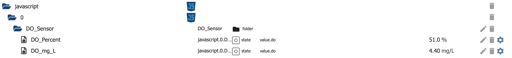

<details><summary>Пример 1 Скрипт</summary>

```javascript
 console.log('Start');

 const DO_mg_L = 'javascript.' + instance + '.DO_Sensor.DO_mg_L';
 createState(DO_mg_L, 0, {"type": "string", read: true, write: false, role: "value.do", unit: "mg/L"});
 const DO_Percent = 'javascript.' + instance + '.DO_Sensor.DO_Percent';
 createState(DO_Percent, 0, {"type": "string", read: true, write: false, role: "value.do", unit: "%"});


 function buildSubstrings(str, start, end) {
 const arr = str.split(',');
 console.log('Array:' + arr.toString());
 return arr;
 }

 on({id: 'atlas-scientific-ezo-i2c.0.0x61.Dissolved_Oxygen', change: "any"}, function (obj) {

 console.log('Value changed: ' + obj.state.val);
 const doString = obj.state.val;
 const result = buildSubstrings(doString, 0, 1);
 console.log(result.toString());

 // Only mg/L
 if(result.length === 1){
    console.log('Setting state DO_mg_L: ' + result[0].toString());
    setState(DO_mg_L, result[0], true);
 }
 // mg/l & %
 else if (result.length === 2) {
    console.log('Setting state DO_mg_L: ' + result[0].toString());
    setState(DO_mg_L, result[0], true);
    console.log('Setting state DO_Percent: ' + result[1].toString());
    setState(DO_Percent, result[1], true);
 }
 });
`

</детали>

### Пример 2: Установите температурную компенсацию для нескольких датчиков
Этот сценарий создан для использования в адаптере JavaScript "Выполнение сценария". Точки данных, конечно, должны быть адаптированы к местным настройкам. Он проверяет значения температуры, поступающие от датчика RTD, усекает десятичные разряды до 1.
Если произошло изменение старого значения на новое, состояния temp_compensation нужных (целевых) датчиков устанавливаются со смещением по времени


<details><summary>Пример 2 Скрипт</summary>

```javascript
 console.log('Start temp compensation Script');

 const ph_temp_compensation = 'atlas-scientific-ezo-i2c.0.0x62.Temperature_compensation';
 const do_temp_compensation = 'atlas-scientific-ezo-i2c.0.0x61.Temperature_compensation';

 on({id: 'atlas-scientific-ezo-i2c.0.0x63.Temperature', change: "any"}, function (obj) {

 const newTemptring = obj.state.val;
 const oldTempString = obj.oldState.val;
 const newTempCut = parseFloat(newTemptring).toFixed(1);
 const oldTempCut = parseFloat(oldTempString).toFixed(1);

 console.log('Temp value received: Old:' + oldTempCut + ' New:' + newTempCut );

 if(!(newTempCut === oldTempCut))
 {
    console.log('Temp changed from ' + oldTempCut + ' to' + newTempCut );
    console.log('Setting state ph_temp_compensation: ' + newTempCut);
    setStateDelayed(ph_temp_compensation, newTempCut, 5000);
    console.log('Setting state do_temp_compensation: ' + newTempCut);
    setStateDelayed(do_temp_compensation, newTempCut, 8000);
 }
 });
`

</детали>

### ОТКАЗ ОТ ОТВЕТСТВЕННОСТИ
Пожалуйста, убедитесь, что вы учитываете авторские права и товарные знаки, когда используете названия или логотипы компаний, и добавьте заявление об отказе от ответственности в свой файл README.
Вы можете проверить другие адаптеры для примеров или спросить в сообществе разработчиков. Использование названия или логотипа компании без разрешения может вызвать у вас юридические проблемы.

## Лицензии третьих лиц
Некоторые небольшие части этого проекта основаны на ioBroker.i2c для UncleSamSwiss https://github.com/UncleSamSwiss/ioBroker.i2c.

Copyright 2021 UncleSamSwiss

Под лицензией Apache License, версия 2.0 («Лицензия»); вы не можете использовать этот файл, кроме как в соответствии с Лицензией. Вы можете получить копию Лицензии по адресу

http://www.apache.org/licenses/LICENSE-2.0

Если это не требуется применимым законодательством или не согласовано в письменной форме, программное обеспечение, распространяемое по Лицензии, распространяется на условиях «КАК ЕСТЬ», БЕЗ КАКИХ-ЛИБО ГАРАНТИЙ ИЛИ УСЛОВИЙ, явных или подразумеваемых.

См. Лицензию для конкретного языка, регулирующего разрешения и ограничения в рамках Лицензии.

## Changelog

<!--
    Placeholder for the next version (at the beginning of the line):
    ### **WORK IN PROGRESS**
-->
### 2.3.0 (2023-08-14)
- NPM Package updates

### 2.2.3 (2023-08-12)
- Added support for EZO PRS Sensor
- Added help for PRS in readme.md

### 2.2.2 (2023-08-06)
- Bugfixings: Fixed wrong order of delay initialization and delay values for some drivers
- Added backend hardware driver for embedded EZO PRS (not functional right now)

### 2.2.1 (2023-08-04)
- Added support for EC Electrical conductivity sensors
- Extended Help with new implementation

### 2.2.0 (2023-08-02)
- Several Bugfixes in Pump implementation
- adjusted readme.md

### 2.1.0 (2023-08-01)
- Added example Grafana Dashboard code and documentation
- Added example Scripts and documentation for helpful Javascript Adapter

### 2.0.0 (2023-07-31)
- Feature request: add the "active" Switch to objects #10 Part I -> Added State including state change listeners "IsPaused" to pause measure per sensor during runtime
- Feature request: add the "calibration" switches to objects #10 Part II -> Added calibration state objects
- Adjusted Readme with Help for new Features
- Added state translations for alphanumeric and boolean states to clear text

### 1.2.4 (2023-07-06)
- Finished first Pump implementation (UI and Pump control) untested due to missing device
- extended README.md
- Further translations

### 1.2.3 (2023-07-03)
- implemented delay after each polling cycle to decouple memory race conditions on device for I2C
- First steps in base implementation for peristaltic pump
- added translations for new values

### 1.2.2 (2023-06-19)
- Removed forbidden characters from sensor state objects
- added state roles where possible 
- added state units where senseful
- adjusted Readme according changes

### 1.2.1 (2023-06-16)
- Extended Help with Statechangelisteners

### 1.2.0 (2023-06-16)
- Code cleanup
- Exchanged standard setTimeOut / clearTimeout calls with adapter wrapper methods
- Removed "later" function in index.ts and used Delay Class instead

### 1.1.0 (2023-06-08)

- Removed Developer Info
- Extended Test Matrix to [16.x, 18.x, 20.x]
- Patched Translations
- Removed Whitespaces for all States from Sensors and exchanged with underscores

### 1.0.0 (2023-06-06)
- further bugfixes
- patched release yml file
- added  releaseconfig.json

### 0.0.3 (2023-05-09)
bugfixes

### 0.0.2 (2023-05-09)
-   (Buzze11) initial release

### 0.0.1 (2023-05-09)

### DISCLAIMER

Please make sure that you consider copyrights and trademarks when you use names or logos of a company and add a disclaimer to your README.
You can check other adapters for examples or ask in the developer community. Using a name or logo of a company without permission may cause legal problems for you.

## License

                                 Apache License
                           Version 2.0, January 2004
                        http://www.apache.org/licenses/

TERMS AND CONDITIONS FOR USE, REPRODUCTION, AND DISTRIBUTION

1. Definitions.

    "License" shall mean the terms and conditions for use, reproduction,
    and distribution as defined by Sections 1 through 9 of this document.

    "Licensor" shall mean the copyright owner or entity authorized by
    the copyright owner that is granting the License.

    "Legal Entity" shall mean the union of the acting entity and all
    other entities that control, are controlled by, or are under common
    control with that entity. For the purposes of this definition,
    "control" means (i) the power, direct or indirect, to cause the
    direction or management of such entity, whether by contract or
    otherwise, or (ii) ownership of fifty percent (50%) or more of the
    outstanding shares, or (iii) beneficial ownership of such entity.

    "You" (or "Your") shall mean an individual or Legal Entity
    exercising permissions granted by this License.

    "Source" form shall mean the preferred form for making modifications,
    including but not limited to software source code, documentation
    source, and configuration files.

    "Object" form shall mean any form resulting from mechanical
    transformation or translation of a Source form, including but
    not limited to compiled object code, generated documentation,
    and conversions to other media types.

    "Work" shall mean the work of authorship, whether in Source or
    Object form, made available under the License, as indicated by a
    copyright notice that is included in or attached to the work
    (an example is provided in the Appendix below).

    "Derivative Works" shall mean any work, whether in Source or Object
    form, that is based on (or derived from) the Work and for which the
    editorial revisions, annotations, elaborations, or other modifications
    represent, as a whole, an original work of authorship. For the purposes
    of this License, Derivative Works shall not include works that remain
    separable from, or merely link (or bind by name) to the interfaces of,
    the Work and Derivative Works thereof.

    "Contribution" shall mean any work of authorship, including
    the original version of the Work and any modifications or additions
    to that Work or Derivative Works thereof, that is intentionally
    submitted to Licensor for inclusion in the Work by the copyright owner
    or by an individual or Legal Entity authorized to submit on behalf of
    the copyright owner. For the purposes of this definition, "submitted"
    means any form of electronic, verbal, or written communication sent
    to the Licensor or its representatives, including but not limited to
    communication on electronic mailing lists, source code control systems,
    and issue tracking systems that are managed by, or on behalf of, the
    Licensor for the purpose of discussing and improving the Work, but
    excluding communication that is conspicuously marked or otherwise
    designated in writing by the copyright owner as "Not a Contribution."

    "Contributor" shall mean Licensor and any individual or Legal Entity
    on behalf of whom a Contribution has been received by Licensor and
    subsequently incorporated within the Work.

2. Grant of Copyright License. Subject to the terms and conditions of
   this License, each Contributor hereby grants to You a perpetual,
   worldwide, non-exclusive, no-charge, royalty-free, irrevocable
   copyright license to reproduce, prepare Derivative Works of,
   publicly display, publicly perform, sublicense, and distribute the
   Work and such Derivative Works in Source or Object form.

3. Grant of Patent License. Subject to the terms and conditions of
   this License, each Contributor hereby grants to You a perpetual,
   worldwide, non-exclusive, no-charge, royalty-free, irrevocable
   (except as stated in this section) patent license to make, have made,
   use, offer to sell, sell, import, and otherwise transfer the Work,
   where such license applies only to those patent claims licensable
   by such Contributor that are necessarily infringed by their
   Contribution(s) alone or by combination of their Contribution(s)
   with the Work to which such Contribution(s) was submitted. If You
   institute patent litigation against any entity (including a
   cross-claim or counterclaim in a lawsuit) alleging that the Work
   or a Contribution incorporated within the Work constitutes direct
   or contributory patent infringement, then any patent licenses
   granted to You under this License for that Work shall terminate
   as of the date such litigation is filed.

4. Redistribution. You may reproduce and distribute copies of the
   Work or Derivative Works thereof in any medium, with or without
   modifications, and in Source or Object form, provided that You
   meet the following conditions:

    (a) You must give any other recipients of the Work or
    Derivative Works a copy of this License; and

    (b) You must cause any modified files to carry prominent notices
    stating that You changed the files; and

    (c) You must retain, in the Source form of any Derivative Works
    that You distribute, all copyright, patent, trademark, and
    attribution notices from the Source form of the Work,
    excluding those notices that do not pertain to any part of
    the Derivative Works; and

    (d) If the Work includes a "NOTICE" text file as part of its
    distribution, then any Derivative Works that You distribute must
    include a readable copy of the attribution notices contained
    within such NOTICE file, excluding those notices that do not
    pertain to any part of the Derivative Works, in at least one
    of the following places: within a NOTICE text file distributed
    as part of the Derivative Works; within the Source form or
    documentation, if provided along with the Derivative Works; or,
    within a display generated by the Derivative Works, if and
    wherever such third-party notices normally appear. The contents
    of the NOTICE file are for informational purposes only and
    do not modify the License. You may add Your own attribution
    notices within Derivative Works that You distribute, alongside
    or as an addendum to the NOTICE text from the Work, provided
    that such additional attribution notices cannot be construed
    as modifying the License.

    You may add Your own copyright statement to Your modifications and
    may provide additional or different license terms and conditions
    for use, reproduction, or distribution of Your modifications, or
    for any such Derivative Works as a whole, provided Your use,
    reproduction, and distribution of the Work otherwise complies with
    the conditions stated in this License.

5. Submission of Contributions. Unless You explicitly state otherwise,
   any Contribution intentionally submitted for inclusion in the Work
   by You to the Licensor shall be under the terms and conditions of
   this License, without any additional terms or conditions.
   Notwithstanding the above, nothing herein shall supersede or modify
   the terms of any separate license agreement you may have executed
   with Licensor regarding such Contributions.

6. Trademarks. This License does not grant permission to use the trade
   names, trademarks, service marks, or product names of the Licensor,
   except as required for reasonable and customary use in describing the
   origin of the Work and reproducing the content of the NOTICE file.

7. Disclaimer of Warranty. Unless required by applicable law or
   agreed to in writing, Licensor provides the Work (and each
   Contributor provides its Contributions) on an "AS IS" BASIS,
   WITHOUT WARRANTIES OR CONDITIONS OF ANY KIND, either express or
   implied, including, without limitation, any warranties or conditions
   of TITLE, NON-INFRINGEMENT, MERCHANTABILITY, or FITNESS FOR A
   PARTICULAR PURPOSE. You are solely responsible for determining the
   appropriateness of using or redistributing the Work and assume any
   risks associated with Your exercise of permissions under this License.

8. Limitation of Liability. In no event and under no legal theory,
   whether in tort (including negligence), contract, or otherwise,
   unless required by applicable law (such as deliberate and grossly
   negligent acts) or agreed to in writing, shall any Contributor be
   liable to You for damages, including any direct, indirect, special,
   incidental, or consequential damages of any character arising as a
   result of this License or out of the use or inability to use the
   Work (including but not limited to damages for loss of goodwill,
   work stoppage, computer failure or malfunction, or any and all
   other commercial damages or losses), even if such Contributor
   has been advised of the possibility of such damages.

9. Accepting Warranty or Additional Liability. While redistributing
   the Work or Derivative Works thereof, You may choose to offer,
   and charge a fee for, acceptance of support, warranty, indemnity,
   or other liability obligations and/or rights consistent with this
   License. However, in accepting such obligations, You may act only
   on Your own behalf and on Your sole responsibility, not on behalf
   of any other Contributor, and only if You agree to indemnify,
   defend, and hold each Contributor harmless for any liability
   incurred by, or claims asserted against, such Contributor by reason
   of your accepting any such warranty or additional liability.

END OF TERMS AND CONDITIONS

APPENDIX: How to apply the Apache License to your work.

      To apply the Apache License to your work, attach the following
      boilerplate notice, with the fields enclosed by brackets "[]"
      replaced with your own identifying information. (Don't include
      the brackets!)  The text should be enclosed in the appropriate
      comment syntax for the file format. We also recommend that a
      file or class name and description of purpose be included on the
      same "printed page" as the copyright notice for easier
      identification within third-party archives.

Copyright 2023 Buzze11

Licensed under the Apache License, Version 2.0 (the "License");
you may not use this file except in compliance with the License.
You may obtain a copy of the License at

       http://www.apache.org/licenses/LICENSE-2.0

Unless required by applicable law or agreed to in writing, software
distributed under the License is distributed on an "AS IS" BASIS,
WITHOUT WARRANTIES OR CONDITIONS OF ANY KIND, either express or implied.
See the License for the specific language governing permissions and
limitations under the License.
