# ioBroker.atlas-scientific-ezo-i2c

### Если вам понравился этот адаптер, пожалуйста, дочитайте до конца и помогите мне, пожертвовав средства на мои усилия.

Я рад каждому, кому смог помочь интегрировать эти замечательные датчики Atlas Scientific в свою домашнюю систему, и, надеюсь, вы можете представить, сколько времени и усилий требует разработка такого адаптера. Поэтому я очень благодарен за вашу помощь в виде пожертвования через PayPal.

[](https://www.paypal.com/donate/?hosted_button_id=7PGJFJX8X3Y82)

## Адаптер Atlas Scientific EZO I2C для ioBroker

Этот адаптер ioBroker интегрирует несколько устройств Atlas Scientific EZO <https://atlas-scientific.com/> в вашу собственную среду ioBroker. Устройства EZO должны быть настроены для работы с шиной I2C и установлены на устройстве (например, Raspberry Pi) с настроенной и включенной шиной I2C.

### Поддерживаемые в настоящее время устройства

- EZO DO - Растворенный кислород -> <https://atlas-scientific.com/dissolved-oxygen>
- EZO ORP - Окислительно-восстановительный потенциал -> <https://atlas-scientific.com/orp>
- EZO pH - Водородный потенциал -> <https://atlas-scientific.com/ph>
- EZO RTD - Резистивный датчик температуры -> <https://atlas-scientific.com/temperature>
- EZO PMP — Встраиваемый перистальтический дозирующий насос -> <https://atlas-scientific.com/peristaltic/ezo-pmp/> (не тестировался из-за отсутствия оборудования)
- EZO EC - Электропроводность -> <https://atlas-scientific.com/conductivity>

### Поддержка в будущем

- Пожалуйста, создайте запрос на добавление новой функции, если вы планируете дальнейшую реализацию.

## Начиная

### Установка

В частности, убедитесь, что вы правильно настроили и включили интерфейс I2C в вашей системе (при необходимости):

- [Настройка I2C на Raspberry Pi](https://github.com/fivdi/i2c-bus/blob/master/doc/raspberry-pi-i2c.md)

### Настройка адаптера

После установки адаптера и предварительной настройки на Raspberry Pi вы найдете новый адаптер в разделе «Экземпляры», где сможете дополнительно настроить свои датчики.

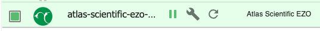

При нажатии на значок гаечного ключа откроется новое окно настроек, в котором предварительно выбран раздел «Общие настройки».

Здесь необходимо ввести номер I2C в текстовое поле, настроенное на Raspberry Pi (0 или 1). Затем можно нажать кнопку «Поиск устройств», чтобы найти все подключенные схемы EZO. Обнаруженные адреса устройств будут отображены в левой части экрана.

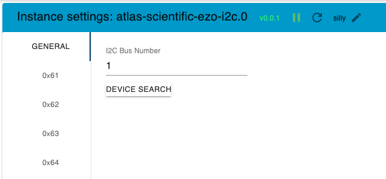

При нажатии на одно из обнаруженных устройств появляется экран "не сконфигурированное устройство".

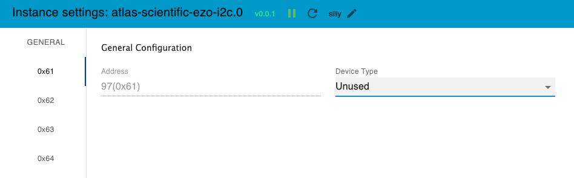

Нажмите на выпадающее меню, чтобы выбрать тип нужного вам устройства.

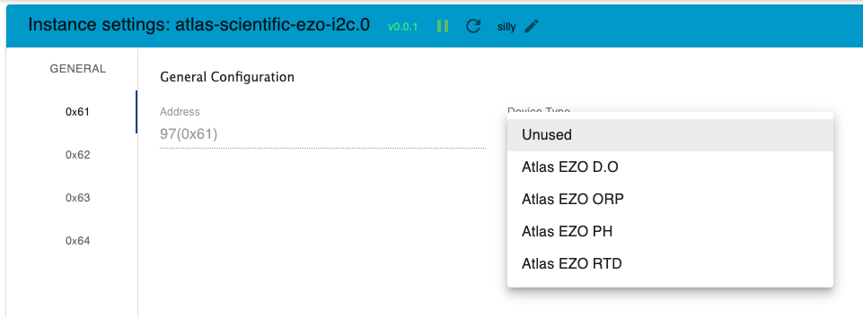

После выбора типа устройства появится экран настроек нужного устройства. Повторите эти шаги для каждого устройства, которое вы хотите использовать.

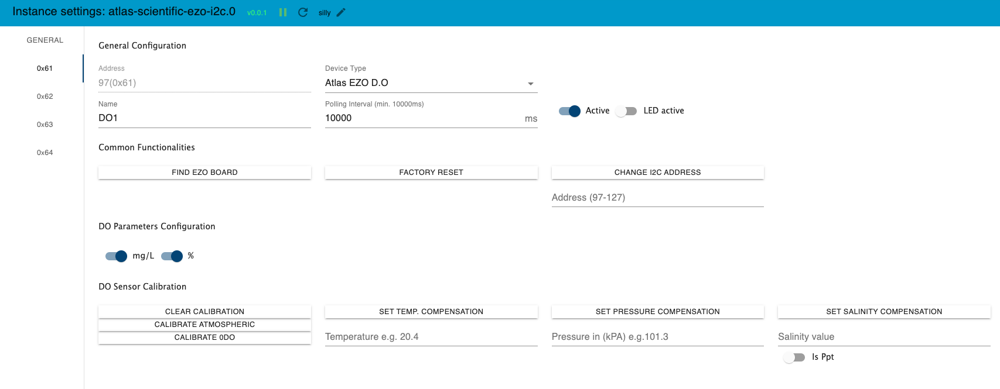

## Общие настройки (для всех устройств)

- **Адрес:** Не подлежит изменению (за исключением изменения IP-адреса)
- **Тип устройства:** Выпадающий список желаемого типа устройства
- **Имя:** Имя устройства, которое будет сохранено на устройстве позже (пробелы будут удалены. Если имя длиннее 16 символов, будут отправлены только первые 16).
- **Интервал опроса:** Интервал в миллисекундах для опроса значений устройства. Если > 0, устройство будет считывать все значения в течение этого интервала. Пожалуйста, увеличьте интервал, если вы будете получать неверные показания. Я рекомендую начать с 15000 мс.
- **Активный переключатель:** Переключатель для включения или выключения использования данного датчика.
- **Активный переключатель светодиода:** с помощью этой настройки вы можете включить или выключить светодиод на устройстве EZO.

### Общие функциональные возможности (все устройства)

- **Кнопка «Найти плату EZO»** -> При нажатии на эту кнопку светодиод на плате EZO начинает быстро мигать.
- **Кнопка «Сброс к заводским настройкам»** -> Выполнить сброс устройства к заводским настройкам.
- **Кнопка «Изменить I2C-адрес»** -> Здесь вы можете запрограммировать новый I2C-адрес для этого адаптера. После этого обязательно сохраните конфигурацию.

### Общие состояния / Объекты (для всех устройств)

В некоторых состояниях работает механизм обнаружения изменений состояния, который позволяет устанавливать некоторые значения не только через административный интерфейс, но и путем внесения изменений непосредственно в значение состояния извне (например, с помощью скрипта или вручную). Это может быть полезно, например, если вы хотите использовать значения компенсации от датчика, например, температуры, для корректировки значения температурной компенсации на датчике pH.

- **"IsPaused"** -> Переключатель, позволяющий временно приостанавливать все измерения с устройства, если оно не находится в режиме "Активно" во время работы. true = приостановлено, false = измерения активны. Значение по умолчанию — false (измерение активно) при запуске/перезапуске адаптера.

## Функциональные возможности и настройки, связанные с DO

### Элементы административного интерфейса DO

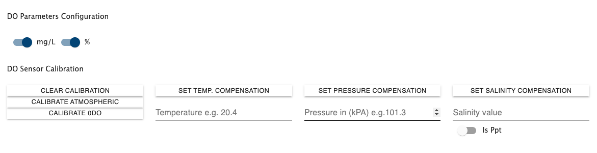

- **Кнопка «Очистить калибровку»** -> Удалить данные калибровки
- **Кнопка «Калибровка атмосферы»** -> калибровка по уровню кислорода в атмосфере.
- **Кнопка «Калибровка 0DO»** -> калибровка устройства до 0 растворенного кислорода
- **Кнопка «Установить температурную компенсацию»** -> установите температурную компенсацию, указав желаемое значение в текстовом поле, например, 20.4.
- **Кнопка «Установить компенсацию давления»** -> установите компенсацию давления с желаемым значением в кПа в текстовом поле, например, 101,3.
- **Кнопка «Установить компенсацию солености»** -> установите компенсацию солености, указав желаемое значение в текстовом поле, например, 50000 мкс.
- **Переключатель "isPpt"** -> Переключатель, определяющий, будет ли значение солености считываться/устанавливаться в PowerPoint вместо нас.

### В штатах, где внедрена функция обнаружения изменений на уровне штата, это будет включено.

Для датчика DO следующие состояния отслеживают изменения:

- **"Temperature\_compensation"** -> Задает температурную компенсацию
- **"Компенсация солености"** -> Устанавливает компенсацию солености
- **"Компенсация\_давления"** -> Задает компенсацию давления
- **"Calibrate\_Clear"** -> Установите значение true, чтобы очистить калибровку датчика. Если калибровка очищена, значение будет установлено на false.
- **"Calibrate\_Atmospheric"** -> Установите значение true, чтобы выполнить калибровку атмосферного датчика. После завершения калибровки значение будет установлено на false.
- **"Calibrate\_Zero\_DO"** -> Установите значение true, чтобы выполнить калибровку датчика растворенного кислорода до нуля. После завершения калибровки значение будет установлено на false.

## Функции и настройки, связанные с pH

### Элементы административного интерфейса PH

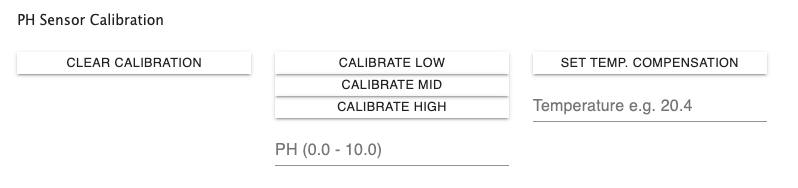

- **Кнопка «Очистить калибровку»** -> Удалить данные калибровки
- **Кнопка «Калибровка низкого значения»** -> выполнить калибровку низкого значения (обычно 4.0)
- **Кнопка «Калибровка среднего значения»** -> выполнить калибровку среднего значения (обычно 7.0)
- **Кнопка «Высокая калибровка»** -> выполнить калибровку высокого значения (обычно 10,0).
- **Кнопка «Установить температурную компенсацию»** -> установите температурную компенсацию, указав желаемое значение в текстовом поле, например, 20.4.

### Состояния pH, включающие обнаружение изменения состояния.

Для датчика pH следующие состояния отслеживают изменения:

- **"Temperature\_compensation"** -> Задает температурную компенсацию
- **"Calibrate\_Clear"** -> Установите значение true, чтобы очистить калибровку датчика. После очистки калибровки значение автоматически изменится на false.
- **"Calibrate\_Low"** -> Установите значение, разделенное точками, например, 4.0, чтобы запустить калибровку низкого уровня с желаемым значением. После калибровки значение будет автоматически сброшено.
- **"Calibrate\_Mid"** -> Установите значение, разделенное точками, например, 7.0, чтобы выполнить калибровку с низким значением и желаемым результатом. После калибровки значение будет автоматически сброшено.
- **"Calibrate\_High"** -> Установите значение, разделенное точками, например, 10.0, чтобы выполнить калибровку низкого уровня с желаемым значением. После калибровки значение будет автоматически сброшено.

## Функциональные возможности и настройки, связанные с ORP

### Элементы административного интерфейса ORP

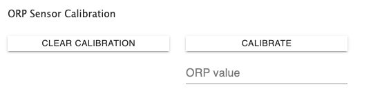

- **Кнопка «Очистить калибровку»** -> Удалить данные калибровки
- **Кнопка «Калибровка»** -> откалибровать до желаемого значения

### В штатах, участвующих в программе ORP, предусмотрено обнаружение изменений в штате.

Для датчика ORP следующие состояния отслеживают изменения:

- **"Temperature\_compensation"** -> Устанавливает температурную компенсацию
- **"Calibrate\_Clear"** -> Установите значение true, чтобы очистить калибровку датчика. После очистки калибровки значение автоматически изменится на false.
- **"Калибровка"** -> Задайте значение, разделенное точками, например, xx.x мВ, чтобы запустить калибровку с желаемым значением. Значение будет автоматически удалено после калибровки.

## Функции и настройки, связанные с EC

### Элементы административного интерфейса EC

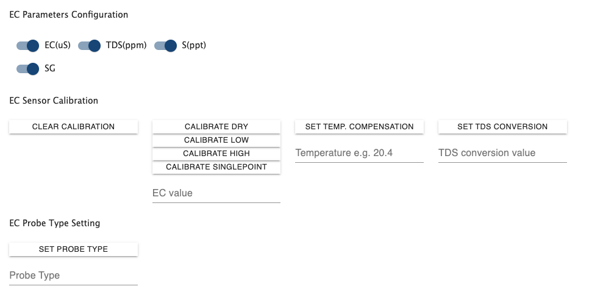

- **Кнопка «Очистить калибровку»** -> Удалить данные калибровки

- **Кнопка «Калибровка сухого датчика»** -> выполнить калибровку сухого датчика

- **Кнопка «Калибровка низкого уровня»** -> калибровка низкого значения устройства до желаемого значения.

- **Кнопка «Калибровка высокого уровня»** -> откалибровать точку высокого уровня устройства до желаемого значения.

- **Кнопка «Калибровка по одной точке»** -> откалибровать устройство по одной точке до желаемого значения.

- **Кнопка «Установить температурную компенсацию»** -> установите температурную компенсацию, указав желаемое значение в текстовом поле, например, 20.4.

- **Кнопка «Установить коэффициент пересчета TDS»** -> установите коэффициент пересчета TDS (ppt) с желаемым значением в текстовом поле от 0,001 до 1,00.

- **Кнопка «Установить тип датчика»** -> выберите нужный тип датчика в текстовом поле (K0.1, K1.0 или K10).

- **Переключатель "EC(us)" -** > Переключатель для включения или выключения параметра "Проводимость = мкСм/см" в строке показаний.

- **Переключатель "TDS(ppm)" -** > Переключатель для включения или выключения параметра "Общее количество растворенных твердых веществ = ppm" в строке показаний.

- **Переключатель "S(ppt)" -** > Переключатель для включения или выключения строки "Соленость = PSU (ppt) 0.00 – 42.00" в строке чтения.

- **Переключатель "SG"** -> Переключатель для включения или выключения параметра "Удельная плотность (только для морской воды) = 1,00 – 1,300" в строке показаний.

### Государства ЕС, включающие обнаружение изменений состояния.

Для датчика EC следующие состояния отслеживают изменения:

- **"Temperature\_compensation"** -> Задает температурную компенсацию
- **"Calibrate\_Clear"** -> Установите значение true, чтобы очистить калибровку датчика. Если калибровка очищена, значение будет установлено на false.
- **"Calibrate\_Singlepoint"** -> Установите значение true, чтобы выполнить калибровку датчика в одной точке. После завершения калибровки значение будет установлено на false.
- **"Calibrate\_Dry"** -> Установите значение true, чтобы выполнить калибровку датчика всухую. После завершения калибровки значение будет установлено на false.
- **"Calibrate\_Low"** -> Установите значение true, чтобы выполнить калибровку датчика низкого уровня с желаемым значением. После калибровки значение будет автоматически сброшено.
- **"Calibrate\_High"** -> Установите значение true, чтобы выполнить калибровку датчика с высоким значением и желаемым результатом. После калибровки значение будет автоматически сброшено.

## Функциональные возможности и настройки, связанные с RTD

### Элементы административного интерфейса RTD

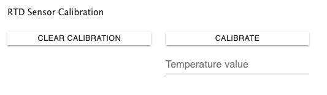

- **Кнопка «Очистить калибровку»** -> Удалить данные калибровки
- **Кнопка «Калибровка»** -> откалибровать до желаемого значения

### В штатах, использующих RTD, предусмотрено обнаружение изменений на уровне штата.

Для датчика RTD следующие состояния отслеживают изменения:

- **"Calibrate\_Clear"** -> Установите значение true, чтобы очистить калибровку датчика. После очистки калибровки значение автоматически изменится на false.
- **"Калибровка"** -> Задайте значение, разделенное точками, например, xx.x мВ, чтобы запустить калибровку с желаемым значением. Значение будет автоматически удалено после калибровки.

## Функции и настройки, связанные с насосом.

### Элементы административного интерфейса насоса

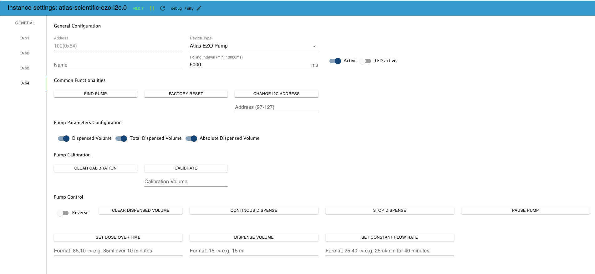

- **Кнопка «Очистить калибровку»** -> Удалить данные калибровки
- **Кнопка «Калибровка»** -> откалибруйте громкость до желаемого уровня.

### Секция управления насосом

- **Переключатель "Реверс"** -> Если он установлен в конфигурации, все команды насосу будут выполняться с установленным флагом реверса, так что направление вращения насоса будет инвертировано.
- **Кнопка «Очистить выданный объем»** -> Счетчик общего выданного объема будет установлен на 0.
- **Кнопка «Непрерывное дозирование»** -> Насос будет непрерывно работать со скоростью \~105 мл/мин (с использованием прилагаемой трубки).
- **Кнопка «Остановить подачу»** -> Дозатор немедленно прекратит подачу.
- **Кнопка «Пауза насоса»** -> Насос немедленно приостановит подачу жидкости.
- **Кнопка «Установить дозу за определенный период времени»** -> Насос выдаст заданное количество мл в течение заданного промежутка времени в минутах.
- **Кнопка «Объем дозирования»** -> Насос дозирует заданное количество мл.
- **Кнопка «Установить постоянную скорость потока»** -> Насос будет подавать заданное количество мл в минуту (мл/мин) в течение заданного времени (мин).

### В штатах, обслуживаемых насосными станциями, предусмотрена функция обнаружения изменений состояния.

В отношении компании EZO Pumps следующие штаты ожидают изменений:

- **"Continous\_dispense"** -> Если установлено значение true, насос перейдет в режим непрерывного дозирования со скоростью 105 мл/мин (с учетом реверсивного переключателя). Если установлено значение false, насос прекратит дозирование.
- **"Dose\_over\_time"** -> Формат: значения, разделенные запятыми, мл, продолжительность в мин -> Выдает заданный объем в течение заданного количества минут. мл для объема и продолжительность в минутах. Отрицательные значения заставят насос работать в обратном направлении. Состояние будет автоматически очищено после выполнения команды.
- **"Dispense\_volume"** -> Выдает заданный объем (мл). Отрицательные значения приведут к обратному вращению насоса. Состояние будет автоматически очищено после выполнения команды.
- **"Constant\_flow\_rate"** -> Формат: значения, разделенные запятыми, мл в мин, продолжительность -> Постоянно подает заданный объем в минуту в течение заданного времени в минутах. мл для объема в минуту и продолжительности в минутах. Отрицательные значения заставят насос работать в обратном направлении. Состояние будет автоматически очищено после выполнения команды.
- **"Pause\_Pump"** -> Если установлено значение true, работа насоса будет приостановлена. Возобновление работы происходит при следующем дозировании.

## Функциональные возможности и настройки, связанные с PRS

### Элементы административного интерфейса PRS

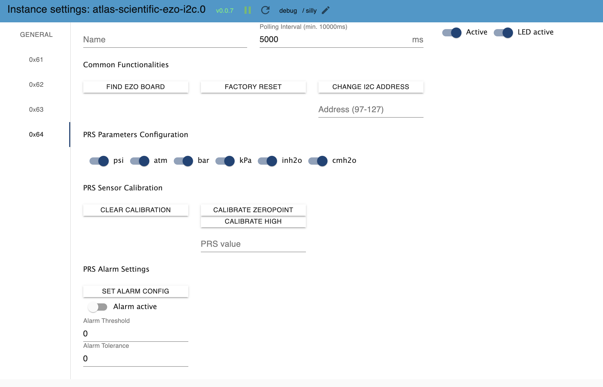

- **Кнопка «Очистить калибровку»** -> Удалить данные калибровки

- **Кнопка «Калибровка нулевой точки»** -> калибровка нулевой точки устройства

- **Кнопка «Калибровка высокого уровня»** -> откалибровать точку высокого уровня устройства до желаемого значения.

- **Переключатель "psi"** -> Переключатель для включения или выключения параметра "Выходные данные будут в psi" в строке чтения.

- **Переключатель "atm"** -> Переключатель для включения или выключения параметра "вывод будет в банкомате" внутри строки чтения.

- **Переключатель "bar"** -> Переключатель для включения или выключения параметра "вывод будет в формате bar" внутри строки чтения.

- **Переключатель "кПа"** -> Переключатель для включения или выключения параметра "Выходные данные будут в кПа" в строке чтения.

- **Переключатель "inh2o"** -> Переключатель для включения или выключения параметра "выходное значение будет в дюймах водяного столба" в строке показаний.

- **Переключатель "cmh2o"** -> Переключатель для включения или выключения параметра "Выходные данные будут в см воды" в строке показаний.

### В штатах, использующих систему PRS, предусмотрено обнаружение изменений в состоянии.

Для датчика PRS следующие состояния отслеживают изменения:

- **"Calibrate\_Clear"** -> Установите значение true, чтобы очистить калибровку датчика. Если калибровка очищена, значение будет установлено на false.
- **"Calibrate\_Zeropoint"** -> Установите значение true, чтобы выполнить калибровку датчика нулевой точки. После завершения калибровки значение будет установлено на false.
- **"Calibrate\_High"** -> Установите значение true, чтобы выполнить калибровку датчика с высоким значением и желаемым результатом. После калибровки значение будет автоматически сброшено.
- **"Alarm\_enabled"** -> Установите значение true, чтобы включить сигнал тревоги от датчика, false — чтобы отключить.
- **"Alarm\_Threshold"** -> Установите желаемое значение порогового значения тревоги. После изменения значение будет записано в датчик.
- **"Alarm\_Tolerance"** -> Установите желаемое значение порогового значения тревоги. После изменения значение будет записано в датчик.

## Пример визуализации с помощью панели мониторинга Grafana.

Здесь вы можете увидеть небольшой пример того, как легко визуализировать значения адаптера. В этом примере экземпляр InfluxDB собирает и хранит значения, полученные от адаптера.

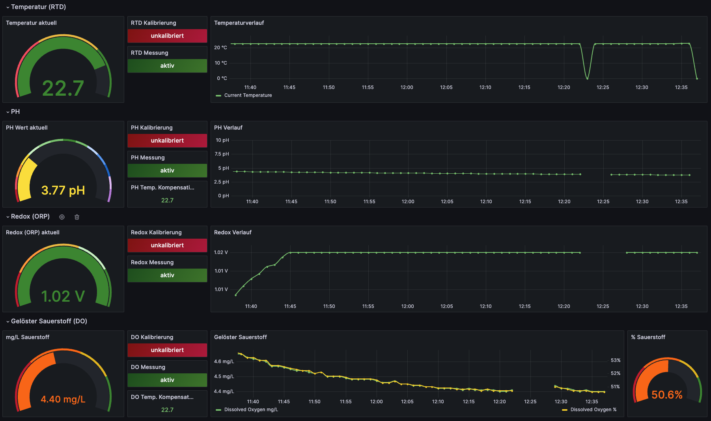

<details>
  <summary>Example Code Grafana-Dashboard JSON</summary>

### Экспорт JSON из Grafana

```json
{
  "annotations": {
    "list": [
      {
        "builtIn": 1,
        "datasource": {
          "type": "grafana",
          "uid": "-- Grafana --"
        },
        "enable": true,
        "hide": true,
        "iconColor": "rgba(0, 211, 255, 1)",
        "name": "Annotations & Alerts",
        "type": "dashboard"
      }
    ]
  },
  "editable": true,
  "fiscalYearStartMonth": 0,
  "graphTooltip": 0,
  "id": 1,
  "links": [],
  "liveNow": false,
  "panels": [
    {
      "collapsed": false,
      "gridPos": {
        "h": 1,
        "w": 24,
        "x": 0,
        "y": 0
      },
      "id": 16,
      "panels": [],
      "title": "Temperatur (RTD)",
      "type": "row"
    },
    {
      "datasource": {
        "type": "influxdb",
        "uid": "c9af6e75-ad53-408b-9093-079ced28a598"
      },
      "fieldConfig": {
        "defaults": {
          "color": {
            "mode": "thresholds"
          },
          "mappings": [],
          "max": 28,
          "min": 0,
          "thresholds": {
            "mode": "absolute",
            "steps": [
              {
                "color": "green",
                "value": null
              },
              {
                "color": "red",
                "value": 0
              },
              {
                "color": "#EAB839",
                "value": 10
              },
              {
                "color": "dark-green",
                "value": 20
              }
            ]
          },
          "unit": "short"
        },
        "overrides": []
      },
      "gridPos": {
        "h": 6,
        "w": 3,
        "x": 0,
        "y": 1
      },
      "id": 4,
      "options": {
        "orientation": "auto",
        "reduceOptions": {
          "calcs": [
            "lastNotNull"
          ],
          "fields": "",
          "values": false
        },
        "showThresholdLabels": false,
        "showThresholdMarkers": true
      },
      "pluginVersion": "10.0.2",
      "targets": [
        {
          "datasource": {
            "type": "influxdb",
            "uid": "c9af6e75-ad53-408b-9093-079ced28a598"
          },
          "groupBy": [
            {
              "params": [
                "$__interval"
              ],
              "type": "time"
            },
            {
              "params": [
                "null"
              ],
              "type": "fill"
            }
          ],
          "measurement": "atlas-scientific-ezo-i2c.0.0x63.Temperature",
          "orderByTime": "ASC",
          "policy": "autogen",
          "refId": "A",
          "resultFormat": "time_series",
          "select": [
            [
              {
                "params": [
                  "value"
                ],
                "type": "field"
              },
              {
                "params": [],
                "type": "last"
              }
            ]
          ],
          "tags": []
        }
      ],
      "title": "Temperatur aktuell",
      "type": "gauge"
    },
    {
      "datasource": {
        "type": "influxdb",
        "uid": "c9af6e75-ad53-408b-9093-079ced28a598"
      },
      "fieldConfig": {
        "defaults": {
          "mappings": [
            {
              "options": {
                "0": {
                  "color": "dark-red",
                  "index": 0,
                  "text": "unkalibriert"
                },
                "1": {
                  "color": "dark-green",
                  "index": 1,
                  "text": "kalibriert"
                }
              },
              "type": "value"
            }
          ],
          "thresholds": {
            "mode": "absolute",
            "steps": [
              {
                "color": "dark-red",
                "value": null
              }
            ]
          },
          "unit": "short"
        },
        "overrides": []
      },
      "gridPos": {
        "h": 2,
        "w": 2,
        "x": 3,
        "y": 1
      },
      "id": 11,
      "options": {
        "colorMode": "background",
        "graphMode": "none",
        "justifyMode": "auto",
        "orientation": "auto",
        "reduceOptions": {
          "calcs": [
            "lastNotNull"
          ],
          "fields": "",
          "values": false
        },
        "textMode": "auto"
      },
      "pluginVersion": "10.0.2",
      "targets": [
        {
          "datasource": {
            "type": "influxdb",
            "uid": "c9af6e75-ad53-408b-9093-079ced28a598"
          },
          "groupBy": [
            {
              "params": [
                "1m"
              ],
              "type": "time"
            },
            {
              "params": [
                "null"
              ],
              "type": "fill"
            }
          ],
          "measurement": "atlas-scientific-ezo-i2c.0.0x63.IsCalibrated",
          "orderByTime": "ASC",
          "policy": "autogen",
          "refId": "A",
          "resultFormat": "time_series",
          "select": [
            [
              {
                "params": [
                  "value"
                ],
                "type": "field"
              },
              {
                "params": [],
                "type": "last"
              }
            ]
          ],
          "tags": []
        }
      ],
      "title": "RTD Kalibrierung",
      "type": "stat"
    },
    {
      "datasource": {
        "type": "influxdb",
        "uid": "c9af6e75-ad53-408b-9093-079ced28a598"
      },
      "fieldConfig": {
        "defaults": {
          "color": {
            "mode": "palette-classic"
          },
          "custom": {
            "axisCenteredZero": false,
            "axisColorMode": "text",
            "axisLabel": "",
            "axisPlacement": "auto",
            "axisSoftMax": 28,
            "axisSoftMin": -2,
            "barAlignment": 0,
            "drawStyle": "line",
            "fillOpacity": 0,
            "gradientMode": "opacity",
            "hideFrom": {
              "legend": false,
              "tooltip": false,
              "viz": false
            },
            "lineInterpolation": "smooth",
            "lineStyle": {
              "fill": "solid"
            },
            "lineWidth": 2,
            "pointSize": 5,
            "scaleDistribution": {
              "type": "linear"
            },
            "showPoints": "auto",
            "spanNulls": false,
            "stacking": {
              "group": "A",
              "mode": "none"
            },
            "thresholdsStyle": {
              "mode": "off"
            }
          },
          "mappings": [],
          "thresholds": {
            "mode": "absolute",
            "steps": [
              {
                "color": "green",
                "value": null
              },
              {
                "color": "red",
                "value": 80
              }
            ]
          },
          "unit": "celsius"
        },
        "overrides": [
          {
            "matcher": {
              "id": "byName",
              "options": "atlas-scientific-ezo-i2c.0.0x61.Temperature_compensation.last"
            },
            "properties": [
              {
                "id": "displayName",
                "value": "DO temp compensation"
              }
            ]
          },
          {
            "matcher": {
              "id": "byName",
              "options": "atlas-scientific-ezo-i2c.0.0x62.Temperature_compensation.last"
            },
            "properties": [
              {
                "id": "displayName",
                "value": "PH temp compensation"
              }
            ]
          },
          {
            "matcher": {
              "id": "byName",
              "options": "atlas-scientific-ezo-i2c.0.0x63.Temperature.last"
            },
            "properties": [
              {
                "id": "displayName",
                "value": "Current Temperature"
              }
            ]
          },
          {
            "matcher": {
              "id": "byName",
              "options": "PH temp compensation"
            },
            "properties": [
              {
                "id": "color",
                "value": {
                  "fixedColor": "super-light-yellow",
                  "mode": "fixed"
                }
              }
            ]
          }
        ]
      },
      "gridPos": {
        "h": 6,
        "w": 12,
        "x": 5,
        "y": 1
      },
      "id": 1,
      "options": {
        "legend": {
          "calcs": [],
          "displayMode": "list",
          "placement": "bottom",
          "showLegend": true
        },
        "tooltip": {
          "mode": "single",
          "sort": "none"
        }
      },
      "targets": [
        {
          "datasource": {
            "type": "influxdb",
            "uid": "c9af6e75-ad53-408b-9093-079ced28a598"
          },
          "groupBy": [
            {
              "params": [
                "1m"
              ],
              "type": "time"
            },
            {
              "params": [
                "null"
              ],
              "type": "fill"
            }
          ],
          "measurement": "atlas-scientific-ezo-i2c.0.0x63.Temperature",
          "orderByTime": "ASC",
          "policy": "autogen",
          "refId": "A",
          "resultFormat": "time_series",
          "select": [
            [
              {
                "params": [
                  "value"
                ],
                "type": "field"
              },
              {
                "params": [],
                "type": "last"
              }
            ]
          ],
          "tags": []
        }
      ],
      "title": "Temperaturverlauf",
      "transformations": [
        {
          "id": "convertFieldType",
          "options": {
            "conversions": [
              {
                "destinationType": "number",
                "targetField": "atlas-scientific-ezo-i2c.0.0x63.Temperature.last"
              }
            ],
            "fields": {}
          }
        }
      ],
      "type": "timeseries"
    },
    {
      "datasource": {
        "type": "influxdb",
        "uid": "c9af6e75-ad53-408b-9093-079ced28a598"
      },
      "fieldConfig": {
        "defaults": {
          "mappings": [
            {
              "options": {
                "false": {
                  "color": "dark-green",
                  "index": 0,
                  "text": "aktiv"
                },
                "true": {
                  "color": "dark-red",
                  "index": 1,
                  "text": "pausiert"
                }
              },
              "type": "value"
            }
          ],
          "thresholds": {
            "mode": "absolute",
            "steps": [
              {
                "color": "dark-red",
                "value": null
              }
            ]
          },
          "unit": "short"
        },
        "overrides": []
      },
      "gridPos": {
        "h": 2,
        "w": 2,
        "x": 3,
        "y": 3
      },
      "id": 20,
      "options": {
        "colorMode": "background",
        "graphMode": "none",
        "justifyMode": "auto",
        "orientation": "auto",
        "reduceOptions": {
          "calcs": [
            "lastNotNull"
          ],
          "fields": "/^atlas\\-scientific\\-ezo\\-i2c\\.0\\.0x63\\.IsPaused\\.last$/",
          "values": false
        },
        "textMode": "auto"
      },
      "pluginVersion": "10.0.2",
      "targets": [
        {
          "datasource": {
            "type": "influxdb",
            "uid": "c9af6e75-ad53-408b-9093-079ced28a598"
          },
          "groupBy": [
            {
              "params": [
                "$__interval"
              ],
              "type": "time"
            },
            {
              "params": [
                "null"
              ],
              "type": "fill"
            }
          ],
          "measurement": "atlas-scientific-ezo-i2c.0.0x63.IsPaused",
          "orderByTime": "ASC",
          "policy": "autogen",
          "refId": "A",
          "resultFormat": "time_series",
          "select": [
            [
              {
                "params": [
                  "value"
                ],
                "type": "field"
              },
              {
                "params": [],
                "type": "last"
              }
            ]
          ],
          "tags": []
        }
      ],
      "title": "RTD Messung",
      "type": "stat"
    },
    {
      "collapsed": false,
      "gridPos": {
        "h": 1,
        "w": 24,
        "x": 0,
        "y": 7
      },
      "id": 15,
      "panels": [],
      "title": "PH",
      "type": "row"
    },
    {
      "datasource": {
        "type": "influxdb",
        "uid": "c9af6e75-ad53-408b-9093-079ced28a598"
      },
      "fieldConfig": {
        "defaults": {
          "color": {
            "mode": "thresholds"
          },
          "mappings": [],
          "max": 14,
          "min": 0,
          "thresholds": {
            "mode": "absolute",
            "steps": [
              {
                "color": "dark-red",
                "value": null
              },
              {
                "color": "dark-red",
                "value": 0
              },
              {
                "color": "red",
                "value": 1
              },
              {
                "color": "orange",
                "value": 2
              },
              {
                "color": "yellow",
                "value": 3
              },
              {
                "color": "super-light-green",
                "value": 4
              },
              {
                "color": "light-green",
                "value": 5
              },
              {
                "color": "green",
                "value": 6
              },
              {
                "color": "dark-green",
                "value": 7
              },
              {
                "color": "green",
                "value": 8
              },
              {
                "color": "super-light-blue",
                "value": 9
              },
              {
                "color": "blue",
                "value": 10
              },
              {
                "color": "dark-blue",
                "value": 11
              },
              {
                "color": "super-light-purple",
                "value": 12
              },
              {
                "color": "purple",
                "value": 13
              },
              {
                "color": "dark-purple",
                "value": 14
              }
            ]
          },
          "unit": "pH"
        },
        "overrides": []
      },
      "gridPos": {
        "h": 6,
        "w": 3,
        "x": 0,
        "y": 8
      },
      "id": 5,
      "options": {
        "orientation": "auto",
        "reduceOptions": {
          "calcs": [
            "lastNotNull"
          ],
          "fields": "",
          "values": false
        },
        "showThresholdLabels": false,
        "showThresholdMarkers": true,
        "text": {}
      },
      "pluginVersion": "10.0.2",
      "targets": [
        {
          "datasource": {
            "type": "influxdb",
            "uid": "c9af6e75-ad53-408b-9093-079ced28a598"
          },
          "groupBy": [
            {
              "params": [
                "$__interval"
              ],
              "type": "time"
            },
            {
              "params": [
                "null"
              ],
              "type": "fill"
            }
          ],
          "measurement": "atlas-scientific-ezo-i2c.0.0x62.PH_Value",
          "orderByTime": "ASC",
          "policy": "autogen",
          "refId": "A",
          "resultFormat": "time_series",
          "select": [
            [
              {
                "params": [
                  "value"
                ],
                "type": "field"
              },
              {
                "params": [],
                "type": "last"
              }
            ]
          ],
          "tags": []
        }
      ],
      "title": "PH Wert aktuell",
      "type": "gauge"
    },
    {
      "datasource": {
        "type": "influxdb",
        "uid": "c9af6e75-ad53-408b-9093-079ced28a598"
      },
      "fieldConfig": {
        "defaults": {
          "mappings": [
            {
              "options": {
                "0": {
                  "color": "dark-red",
                  "index": 0,
                  "text": "unkalibriert"
                },
                "1": {
                  "color": "super-light-green",
                  "index": 1,
                  "text": "Einpunkt"
                },
                "2": {
                  "color": "green",
                  "index": 2,
                  "text": "Zweipunkt"
                },
                "3": {
                  "color": "dark-green",
                  "index": 3,
                  "text": "Dreipunkt"
                }
              },
              "type": "value"
            }
          ],
          "thresholds": {
            "mode": "absolute",
            "steps": [
              {
                "color": "dark-red",
                "value": null
              }
            ]
          },
          "unit": "short"
        },
        "overrides": []
      },
      "gridPos": {
        "h": 2,
        "w": 2,
        "x": 3,
        "y": 8
      },
      "id": 12,
      "options": {
        "colorMode": "background",
        "graphMode": "none",
        "justifyMode": "auto",
        "orientation": "auto",
        "reduceOptions": {
          "calcs": [
            "lastNotNull"
          ],
          "fields": "",
          "values": false
        },
        "textMode": "auto"
      },
      "pluginVersion": "10.0.2",
      "targets": [
        {
          "datasource": {
            "type": "influxdb",
            "uid": "c9af6e75-ad53-408b-9093-079ced28a598"
          },
          "groupBy": [
            {
              "params": [
                "1m"
              ],
              "type": "time"
            },
            {
              "params": [
                "null"
              ],
              "type": "fill"
            }
          ],
          "measurement": "atlas-scientific-ezo-i2c.0.0x62.IsCalibrated",
          "orderByTime": "ASC",
          "policy": "autogen",
          "refId": "A",
          "resultFormat": "time_series",
          "select": [
            [
              {
                "params": [
                  "value"
                ],
                "type": "field"
              },
              {
                "params": [],
                "type": "last"
              }
            ]
          ],
          "tags": []
        }
      ],
      "title": "PH Kalibrierung",
      "type": "stat"
    },
    {
      "datasource": {
        "type": "influxdb",
        "uid": "c9af6e75-ad53-408b-9093-079ced28a598"
      },
      "fieldConfig": {
        "defaults": {
          "color": {
            "mode": "palette-classic"
          },
          "custom": {
            "axisCenteredZero": false,
            "axisColorMode": "text",
            "axisLabel": "",
            "axisPlacement": "auto",
            "axisSoftMax": 10,
            "axisSoftMin": 0,
            "barAlignment": 0,
            "drawStyle": "line",
            "fillOpacity": 0,
            "gradientMode": "none",
            "hideFrom": {
              "legend": false,
              "tooltip": false,
              "viz": false
            },
            "lineInterpolation": "smooth",
            "lineWidth": 1,
            "pointSize": 5,
            "scaleDistribution": {
              "type": "linear"
            },
            "showPoints": "auto",
            "spanNulls": false,
            "stacking": {
              "group": "A",
              "mode": "none"
            },
            "thresholdsStyle": {
              "mode": "off"
            }
          },
          "mappings": [],
          "thresholds": {
            "mode": "absolute",
            "steps": [
              {
                "color": "green",
                "value": null
              },
              {
                "color": "red",
                "value": 80
              }
            ]
          },
          "unit": "pH"
        },
        "overrides": []
      },
      "gridPos": {
        "h": 6,
        "w": 12,
        "x": 5,
        "y": 8
      },
      "id": 2,
      "options": {
        "legend": {
          "calcs": [],
          "displayMode": "list",
          "placement": "bottom",
          "showLegend": false
        },
        "tooltip": {
          "mode": "single",
          "sort": "none"
        }
      },
      "targets": [
        {
          "datasource": {
            "type": "influxdb",
            "uid": "c9af6e75-ad53-408b-9093-079ced28a598"
          },
          "groupBy": [
            {
              "params": [
                "1m"
              ],
              "type": "time"
            },
            {
              "params": [
                "null"
              ],
              "type": "fill"
            }
          ],
          "measurement": "atlas-scientific-ezo-i2c.0.0x62.PH_Value",
          "orderByTime": "ASC",
          "policy": "autogen",
          "refId": "A",
          "resultFormat": "time_series",
          "select": [
            [
              {
                "params": [
                  "value"
                ],
                "type": "field"
              },
              {
                "params": [],
                "type": "last"
              }
            ]
          ],
          "tags": []
        }
      ],
      "title": "PH Verlauf",
      "transformations": [
        {
          "id": "convertFieldType",
          "options": {
            "conversions": [
              {
                "destinationType": "number",
                "targetField": "atlas-scientific-ezo-i2c.0.0x63.Temperature.last"
              }
            ],
            "fields": {}
          }
        }
      ],
      "type": "timeseries"
    },
    {
      "datasource": {
        "type": "influxdb",
        "uid": "c9af6e75-ad53-408b-9093-079ced28a598"
      },
      "fieldConfig": {
        "defaults": {
          "mappings": [
            {
              "options": {
                "false": {
                  "color": "dark-green",
                  "index": 0,
                  "text": "aktiv"
                },
                "true": {
                  "color": "dark-red",
                  "index": 1,
                  "text": "pausiert"
                }
              },
              "type": "value"
            }
          ],
          "thresholds": {
            "mode": "absolute",
            "steps": [
              {
                "color": "dark-red",
                "value": null
              }
            ]
          },
          "unit": "short"
        },
        "overrides": []
      },
      "gridPos": {
        "h": 2,
        "w": 2,
        "x": 3,
        "y": 10
      },
      "id": 21,
      "options": {
        "colorMode": "background",
        "graphMode": "none",
        "justifyMode": "auto",
        "orientation": "auto",
        "reduceOptions": {
          "calcs": [
            "lastNotNull"
          ],
          "fields": "/^atlas\\-scientific\\-ezo\\-i2c\\.0\\.0x62\\.IsPaused\\.last$/",
          "values": false
        },
        "textMode": "auto"
      },
      "pluginVersion": "10.0.2",
      "targets": [
        {
          "datasource": {
            "type": "influxdb",
            "uid": "c9af6e75-ad53-408b-9093-079ced28a598"
          },
          "groupBy": [
            {
              "params": [
                "$__interval"
              ],
              "type": "time"
            },
            {
              "params": [
                "null"
              ],
              "type": "fill"
            }
          ],
          "measurement": "atlas-scientific-ezo-i2c.0.0x62.IsPaused",
          "orderByTime": "ASC",
          "policy": "autogen",
          "refId": "A",
          "resultFormat": "time_series",
          "select": [
            [
              {
                "params": [
                  "value"
                ],
                "type": "field"
              },
              {
                "params": [],
                "type": "last"
              }
            ]
          ],
          "tags": []
        }
      ],
      "title": "PH Messung",
      "type": "stat"
    },
    {
      "datasource": {
        "type": "influxdb",
        "uid": "c9af6e75-ad53-408b-9093-079ced28a598"
      },
      "fieldConfig": {
        "defaults": {
          "mappings": [],
          "thresholds": {
            "mode": "absolute",
            "steps": [
              {
                "color": "green",
                "value": null
              },
              {
                "color": "red",
                "value": 80
              }
            ]
          },
          "unit": "short"
        },
        "overrides": []
      },
      "gridPos": {
        "h": 2,
        "w": 2,
        "x": 3,
        "y": 12
      },
      "id": 10,
      "options": {
        "colorMode": "value",
        "graphMode": "area",
        "justifyMode": "auto",
        "orientation": "auto",
        "reduceOptions": {
          "calcs": [
            "lastNotNull"
          ],
          "fields": "",
          "values": false
        },
        "textMode": "auto"
      },
      "pluginVersion": "10.0.2",
      "targets": [
        {
          "datasource": {
            "type": "influxdb",
            "uid": "c9af6e75-ad53-408b-9093-079ced28a598"
          },
          "groupBy": [
            {
              "params": [
                "1m"
              ],
              "type": "time"
            },
            {
              "params": [
                "null"
              ],
              "type": "fill"
            }
          ],
          "measurement": "atlas-scientific-ezo-i2c.0.0x62.Temperature_compensation",
          "orderByTime": "ASC",
          "policy": "autogen",
          "refId": "A",
          "resultFormat": "time_series",
          "select": [
            [
              {
                "params": [
                  "value"
                ],
                "type": "field"
              },
              {
                "params": [],
                "type": "last"
              }
            ]
          ],
          "tags": []
        }
      ],
      "title": "PH Temp. Kompensation ",
      "type": "stat"
    },
    {
      "collapsed": false,
      "gridPos": {
        "h": 1,
        "w": 24,
        "x": 0,
        "y": 14
      },
      "id": 14,
      "panels": [],
      "title": "Redox (ORP)",
      "type": "row"
    },
    {
      "datasource": {
        "type": "influxdb",
        "uid": "c9af6e75-ad53-408b-9093-079ced28a598"
      },
      "fieldConfig": {
        "defaults": {
          "color": {
            "mode": "thresholds"
          },
          "mappings": [],
          "max": 1019,
          "min": 0,
          "thresholds": {
            "mode": "absolute",
            "steps": [
              {
                "color": "green",
                "value": null
              },
              {
                "color": "dark-red",
                "value": 0
              },
              {
                "color": "orange",
                "value": 200
              },
              {
                "color": "#EAB839",
                "value": 400
              },
              {
                "color": "super-light-green",
                "value": 600
              },
              {
                "color": "dark-green",
                "value": 800
              },
              {
                "color": "dark-green",
                "value": 1019
              }
            ]
          },
          "unit": "mvolt"
        },
        "overrides": []
      },
      "gridPos": {
        "h": 6,
        "w": 3,
        "x": 0,
        "y": 15
      },
      "id": 6,
      "options": {
        "orientation": "auto",
        "reduceOptions": {
          "calcs": [
            "lastNotNull"
          ],
          "fields": "",
          "values": false
        },
        "showThresholdLabels": false,
        "showThresholdMarkers": true,
        "text": {}
      },
      "pluginVersion": "10.0.2",
      "targets": [
        {
          "datasource": {
            "type": "influxdb",
            "uid": "c9af6e75-ad53-408b-9093-079ced28a598"
          },
          "groupBy": [
            {
              "params": [
                "$__interval"
              ],
              "type": "time"
            },
            {
              "params": [
                "null"
              ],
              "type": "fill"
            }
          ],
          "measurement": "atlas-scientific-ezo-i2c.0.0x64.ORP_Value",
          "orderByTime": "ASC",
          "policy": "autogen",
          "refId": "A",
          "resultFormat": "time_series",
          "select": [
            [
              {
                "params": [
                  "value"
                ],
                "type": "field"
              },
              {
                "params": [],
                "type": "last"
              }
            ]
          ],
          "tags": []
        }
      ],
      "title": "Redox (ORP) aktuell",
      "type": "gauge"
    },
    {
      "datasource": {
        "type": "influxdb",
        "uid": "c9af6e75-ad53-408b-9093-079ced28a598"
      },
      "fieldConfig": {
        "defaults": {
          "mappings": [
            {
              "options": {
                "0": {
                  "color": "dark-red",
                  "index": 0,
                  "text": "unkalibriert"
                },
                "1": {
                  "color": "dark-green",
                  "index": 1,
                  "text": "kalibriert"
                }
              },
              "type": "value"
            }
          ],
          "thresholds": {
            "mode": "absolute",
            "steps": [
              {
                "color": "dark-red",
                "value": null
              }
            ]
          },
          "unit": "short"
        },
        "overrides": []
      },
      "gridPos": {
        "h": 2,
        "w": 2,
        "x": 3,
        "y": 15
      },
      "id": 17,
      "options": {
        "colorMode": "background",
        "graphMode": "none",
        "justifyMode": "auto",
        "orientation": "auto",
        "reduceOptions": {
          "calcs": [
            "lastNotNull"
          ],
          "fields": "",
          "values": false
        },
        "textMode": "auto"
      },
      "pluginVersion": "10.0.2",
      "targets": [
        {
          "datasource": {
            "type": "influxdb",
            "uid": "c9af6e75-ad53-408b-9093-079ced28a598"
          },
          "groupBy": [
            {
              "params": [
                "1m"
              ],
              "type": "time"
            },
            {
              "params": [
                "null"
              ],
              "type": "fill"
            }
          ],
          "measurement": "atlas-scientific-ezo-i2c.0.0x64.IsCalibrated",
          "orderByTime": "ASC",
          "policy": "autogen",
          "refId": "A",
          "resultFormat": "time_series",
          "select": [
            [
              {
                "params": [
                  "value"
                ],
                "type": "field"
              },
              {
                "params": [],
                "type": "last"
              }
            ]
          ],
          "tags": []
        }
      ],
      "title": "Redox Kalibrierung",
      "type": "stat"
    },
    {
      "datasource": {
        "type": "influxdb",
        "uid": "c9af6e75-ad53-408b-9093-079ced28a598"
      },
      "fieldConfig": {
        "defaults": {
          "color": {
            "mode": "palette-classic"
          },
          "custom": {
            "axisCenteredZero": false,
            "axisColorMode": "text",
            "axisLabel": "",
            "axisPlacement": "auto",
            "barAlignment": 0,
            "drawStyle": "line",
            "fillOpacity": 0,
            "gradientMode": "none",
            "hideFrom": {
              "legend": false,
              "tooltip": false,
              "viz": false
            },
            "lineInterpolation": "smooth",
            "lineWidth": 2,
            "pointSize": 5,
            "scaleDistribution": {
              "type": "linear"
            },
            "showPoints": "auto",
            "spanNulls": false,
            "stacking": {
              "group": "A",
              "mode": "none"
            },
            "thresholdsStyle": {
              "mode": "off"
            }
          },
          "mappings": [],
          "thresholds": {
            "mode": "absolute",
            "steps": [
              {
                "color": "green",
                "value": null
              },
              {
                "color": "red",
                "value": 80
              }
            ]
          },
          "unit": "mvolt"
        },
        "overrides": []
      },
      "gridPos": {
        "h": 6,
        "w": 12,
        "x": 5,
        "y": 15
      },
      "id": 3,
      "options": {
        "legend": {
          "calcs": [],
          "displayMode": "list",
          "placement": "bottom",
          "showLegend": false
        },
        "tooltip": {
          "mode": "single",
          "sort": "none"
        }
      },
      "targets": [
        {
          "datasource": {
            "type": "influxdb",
            "uid": "c9af6e75-ad53-408b-9093-079ced28a598"
          },
          "groupBy": [
            {
              "params": [
                "1m"
              ],
              "type": "time"
            },
            {
              "params": [
                "null"
              ],
              "type": "fill"
            }
          ],
          "measurement": "atlas-scientific-ezo-i2c.0.0x64.ORP_Value",
          "orderByTime": "ASC",
          "policy": "autogen",
          "refId": "A",
          "resultFormat": "time_series",
          "select": [
            [
              {
                "params": [
                  "value"
                ],
                "type": "field"
              },
              {
                "params": [],
                "type": "last"
              }
            ]
          ],
          "tags": []
        }
      ],
      "title": "Redox Verlauf",
      "transformations": [
        {
          "id": "convertFieldType",
          "options": {
            "conversions": [
              {
                "destinationType": "number",
                "targetField": "atlas-scientific-ezo-i2c.0.0x63.Temperature.last"
              }
            ],
            "fields": {}
          }
        }
      ],
      "type": "timeseries"
    },
    {
      "datasource": {
        "type": "influxdb",
        "uid": "c9af6e75-ad53-408b-9093-079ced28a598"
      },
      "fieldConfig": {
        "defaults": {
          "mappings": [
            {
              "options": {
                "false": {
                  "color": "dark-green",
                  "index": 0,
                  "text": "aktiv"
                },
                "true": {
                  "color": "dark-red",
                  "index": 1,
                  "text": "pausiert"
                }
              },
              "type": "value"
            }
          ],
          "thresholds": {
            "mode": "absolute",
            "steps": [
              {
                "color": "dark-red",
                "value": null
              }
            ]
          },
          "unit": "short"
        },
        "overrides": []
      },
      "gridPos": {
        "h": 2,
        "w": 2,
        "x": 3,
        "y": 17
      },
      "id": 22,
      "options": {
        "colorMode": "background",
        "graphMode": "none",
        "justifyMode": "auto",
        "orientation": "auto",
        "reduceOptions": {
          "calcs": [
            "lastNotNull"
          ],
          "fields": "/^atlas\\-scientific\\-ezo\\-i2c\\.0\\.0x64\\.IsPaused\\.last$/",
          "values": false
        },
        "textMode": "auto"
      },
      "pluginVersion": "10.0.2",
      "targets": [
        {
          "datasource": {
            "type": "influxdb",
            "uid": "c9af6e75-ad53-408b-9093-079ced28a598"
          },
          "groupBy": [
            {
              "params": [
                "$__interval"
              ],
              "type": "time"
            },
            {
              "params": [
                "null"
              ],
              "type": "fill"
            }
          ],
          "measurement": "atlas-scientific-ezo-i2c.0.0x64.IsPaused",
          "orderByTime": "ASC",
          "policy": "autogen",
          "refId": "A",
          "resultFormat": "time_series",
          "select": [
            [
              {
                "params": [
                  "value"
                ],
                "type": "field"
              },
              {
                "params": [],
                "type": "last"
              }
            ]
          ],
          "tags": []
        }
      ],
      "title": "Redox Messung",
      "type": "stat"
    },
    {
      "collapsed": false,
      "gridPos": {
        "h": 1,
        "w": 24,
        "x": 0,
        "y": 21
      },
      "id": 13,
      "panels": [],
      "title": "Gelöster Sauerstoff (DO)",
      "type": "row"
    },
    {
      "datasource": {
        "type": "influxdb",
        "uid": "c9af6e75-ad53-408b-9093-079ced28a598"
      },
      "fieldConfig": {
        "defaults": {
          "color": {
            "mode": "thresholds"
          },
          "mappings": [],
          "max": 10,
          "min": 0,
          "thresholds": {
            "mode": "absolute",
            "steps": [
              {
                "color": "dark-red",
                "value": null
              },
              {
                "color": "dark-orange",
                "value": 3
              },
              {
                "color": "dark-yellow",
                "value": 6
              },
              {
                "color": "dark-green",
                "value": 8
              },
              {
                "color": "dark-green",
                "value": 10
              }
            ]
          },
          "unit": "mg/L"
        },
        "overrides": []
      },
      "gridPos": {
        "h": 6,
        "w": 3,
        "x": 0,
        "y": 22
      },
      "id": 18,
      "options": {
        "orientation": "auto",
        "reduceOptions": {
          "calcs": [
            "lastNotNull"
          ],
          "fields": "",
          "values": false
        },
        "showThresholdLabels": false,
        "showThresholdMarkers": true,
        "text": {}
      },
      "pluginVersion": "10.0.2",
      "targets": [
        {
          "datasource": {
            "type": "influxdb",
            "uid": "c9af6e75-ad53-408b-9093-079ced28a598"
          },
          "groupBy": [
            {
              "params": [
                "1m"
              ],
              "type": "time"
            },
            {
              "params": [
                "null"
              ],
              "type": "fill"
            }
          ],
          "measurement": "javascript.0.DO_Sensor.DO_mg_L",
          "orderByTime": "ASC",
          "policy": "autogen",
          "refId": "A",
          "resultFormat": "time_series",
          "select": [
            [
              {
                "params": [
                  "value"
                ],
                "type": "field"
              },
              {
                "params": [],
                "type": "last"
              }
            ]
          ],
          "tags": []
        }
      ],
      "title": "mg/L Sauerstoff",
      "transformations": [
        {
          "id": "convertFieldType",
          "options": {
            "conversions": [],
            "fields": {}
          }
        }
      ],
      "type": "gauge"
    },
    {
      "datasource": {
        "type": "influxdb",
        "uid": "c9af6e75-ad53-408b-9093-079ced28a598"
      },
      "fieldConfig": {
        "defaults": {
          "mappings": [
            {
              "options": {
                "0": {
                  "color": "dark-red",
                  "index": 0,
                  "text": "unkalibriert"
                },
                "1": {
                  "color": "super-light-green",
                  "index": 1,
                  "text": "Atmospherisch"
                },
                "3": {
                  "color": "dark-green",
                  "index": 2,
                  "text": "Atmospherisch & 0 DO"
                }
              },
              "type": "value"
            }
          ],
          "thresholds": {
            "mode": "absolute",
            "steps": [
              {
                "color": "dark-red",
                "value": null
              }
            ]
          },
          "unit": "short"
        },
        "overrides": []
      },
      "gridPos": {
        "h": 2,
        "w": 2,
        "x": 3,
        "y": 22
      },
      "id": 19,
      "options": {
        "colorMode": "background",
        "graphMode": "none",
        "justifyMode": "auto",
        "orientation": "auto",
        "reduceOptions": {
          "calcs": [
            "lastNotNull"
          ],
          "fields": "",
          "values": false
        },
        "textMode": "auto"
      },
      "pluginVersion": "10.0.2",
      "targets": [
        {
          "datasource": {
            "type": "influxdb",
            "uid": "c9af6e75-ad53-408b-9093-079ced28a598"
          },
          "groupBy": [
            {
              "params": [
                "1m"
              ],
              "type": "time"
            },
            {
              "params": [
                "null"
              ],
              "type": "fill"
            }
          ],
          "measurement": "atlas-scientific-ezo-i2c.0.0x61.IsCalibrated",
          "orderByTime": "ASC",
          "policy": "autogen",
          "refId": "A",
          "resultFormat": "time_series",
          "select": [
            [
              {
                "params": [
                  "value"
                ],
                "type": "field"
              },
              {
                "params": [],
                "type": "last"
              }
            ]
          ],
          "tags": []
        }
      ],
      "title": "DO Kalibrierung",
      "type": "stat"
    },
    {
      "datasource": {
        "type": "influxdb",
        "uid": "c9af6e75-ad53-408b-9093-079ced28a598"
      },
      "fieldConfig": {
        "defaults": {
          "color": {
            "mode": "palette-classic"
          },
          "custom": {
            "axisCenteredZero": false,
            "axisColorMode": "text",
            "axisLabel": "",
            "axisPlacement": "auto",
            "barAlignment": 0,
            "drawStyle": "line",
            "fillOpacity": 0,
            "gradientMode": "none",
            "hideFrom": {
              "legend": false,
              "tooltip": false,
              "viz": false
            },
            "lineInterpolation": "smooth",
            "lineWidth": 2,
            "pointSize": 5,
            "scaleDistribution": {
              "type": "linear"
            },
            "showPoints": "auto",
            "spanNulls": false,
            "stacking": {
              "group": "A",
              "mode": "none"
            },
            "thresholdsStyle": {
              "mode": "off"
            }
          },
          "mappings": [],
          "thresholds": {
            "mode": "absolute",
            "steps": [
              {
                "color": "green",
                "value": null
              },
              {
                "color": "red",
                "value": 80
              }
            ]
          },
          "unit": "mg/L"
        },
        "overrides": [
          {
            "matcher": {
              "id": "byName",
              "options": "javascript.0.DO_Sensor.DO_Percent.last"
            },
            "properties": [
              {
                "id": "custom.axisPlacement",
                "value": "right"
              },
              {
                "id": "unit",
                "value": "percent"
              }
            ]
          },
          {
            "matcher": {
              "id": "byName",
              "options": "javascript.0.DO_Sensor.DO_mg_L.last"
            },
            "properties": [
              {
                "id": "displayName",
                "value": "Dissolved Oxygen mg/L"
              }
            ]
          },
          {
            "matcher": {
              "id": "byName",
              "options": "javascript.0.DO_Sensor.DO_Percent.last"
            },
            "properties": [
              {
                "id": "displayName",
                "value": "Dissolved Oxygen %"
              }
            ]
          }
        ]
      },
      "gridPos": {
        "h": 6,
        "w": 10,
        "x": 5,
        "y": 22
      },
      "id": 7,
      "options": {
        "legend": {
          "calcs": [],
          "displayMode": "list",
          "placement": "bottom",
          "showLegend": true
        },
        "timezone": [
          ""
        ],
        "tooltip": {
          "mode": "single",
          "sort": "none"
        }
      },
      "targets": [
        {
          "datasource": {
            "type": "influxdb",
            "uid": "c9af6e75-ad53-408b-9093-079ced28a598"
          },
          "groupBy": [
            {
              "params": [
                "1m"
              ],
              "type": "time"
            },
            {
              "params": [
                "null"
              ],
              "type": "fill"
            }
          ],
          "measurement": "javascript.0.DO_Sensor.DO_mg_L",
          "orderByTime": "ASC",
          "policy": "autogen",
          "refId": "A",
          "resultFormat": "time_series",
          "select": [
            [
              {
                "params": [
                  "value"
                ],
                "type": "field"
              },
              {
                "params": [],
                "type": "last"
              }
            ]
          ],
          "tags": []
        },
        {
          "datasource": {
            "type": "influxdb",
            "uid": "c9af6e75-ad53-408b-9093-079ced28a598"
          },
          "groupBy": [
            {
              "params": [
                "1m"
              ],
              "type": "time"
            },
            {
              "params": [
                "null"
              ],
              "type": "fill"
            }
          ],
          "hide": false,
          "measurement": "javascript.0.DO_Sensor.DO_Percent",
          "orderByTime": "ASC",
          "policy": "autogen",
          "refId": "B",
          "resultFormat": "time_series",
          "select": [
            [
              {
                "params": [
                  "value"
                ],
                "type": "field"
              },
              {
                "params": [],
                "type": "last"
              }
            ]
          ],
          "tags": []
        }
      ],
      "title": "Gelöster Sauerstoff ",
      "transformations": [
        {
          "id": "convertFieldType",
          "options": {
            "conversions": [
              {
                "destinationType": "number",
                "targetField": "atlas-scientific-ezo-i2c.0.0x61.Dissolved_Oxygen.last"
              }
            ],
            "fields": {}
          }
        }
      ],
      "type": "timeseries"
    },
    {
      "datasource": {
        "type": "influxdb",
        "uid": "c9af6e75-ad53-408b-9093-079ced28a598"
      },
      "fieldConfig": {
        "defaults": {
          "color": {
            "mode": "thresholds"
          },
          "mappings": [],
          "thresholds": {
            "mode": "absolute",
            "steps": [
              {
                "color": "dark-red",
                "value": null
              },
              {
                "color": "dark-orange",
                "value": 30
              },
              {
                "color": "dark-yellow",
                "value": 60
              },
              {
                "color": "dark-green",
                "value": 80
              },
              {
                "color": "dark-green",
                "value": 100
              }
            ]
          },
          "unit": "percent"
        },
        "overrides": []
      },
      "gridPos": {
        "h": 6,
        "w": 2,
        "x": 15,
        "y": 22
      },
      "id": 9,
      "options": {
        "orientation": "auto",
        "reduceOptions": {
          "calcs": [
            "lastNotNull"
          ],
          "fields": "/^javascript\\.0\\.DO_Sensor\\.DO_Percent\\.last$/",
          "values": false
        },
        "showThresholdLabels": false,
        "showThresholdMarkers": true,
        "text": {}
      },
      "pluginVersion": "10.0.2",
      "targets": [
        {
          "datasource": {
            "type": "influxdb",
            "uid": "c9af6e75-ad53-408b-9093-079ced28a598"
          },
          "groupBy": [
            {
              "params": [
                "$__interval"
              ],
              "type": "time"
            },
            {
              "params": [
                "null"
              ],
              "type": "fill"
            }
          ],
          "measurement": "javascript.0.DO_Sensor.DO_Percent",
          "orderByTime": "ASC",
          "policy": "autogen",
          "refId": "A",
          "resultFormat": "time_series",
          "select": [
            [
              {
                "params": [
                  "value"
                ],
                "type": "field"
              },
              {
                "params": [],
                "type": "last"
              }
            ]
          ],
          "tags": []
        }
      ],
      "title": "% Sauerstoff",
      "transformations": [
        {
          "id": "convertFieldType",
          "options": {
            "conversions": [],
            "fields": {}
          }
        }
      ],
      "type": "gauge"
    },
    {
      "datasource": {
        "type": "influxdb",
        "uid": "c9af6e75-ad53-408b-9093-079ced28a598"
      },
      "fieldConfig": {
        "defaults": {
          "mappings": [
            {
              "options": {
                "false": {
                  "color": "dark-green",
                  "index": 0,
                  "text": "aktiv"
                },
                "true": {
                  "color": "dark-red",
                  "index": 1,
                  "text": "pausiert"
                }
              },
              "type": "value"
            }
          ],
          "thresholds": {
            "mode": "absolute",
            "steps": [
              {
                "color": "dark-red",
                "value": null
              }
            ]
          },
          "unit": "short"
        },
        "overrides": []
      },
      "gridPos": {
        "h": 2,
        "w": 2,
        "x": 3,
        "y": 24
      },
      "id": 23,
      "options": {
        "colorMode": "background",
        "graphMode": "none",
        "justifyMode": "auto",
        "orientation": "auto",
        "reduceOptions": {
          "calcs": [
            "lastNotNull"
          ],
          "fields": "/^atlas\\-scientific\\-ezo\\-i2c\\.0\\.0x61\\.IsPaused\\.last$/",
          "values": false
        },
        "textMode": "auto"
      },
      "pluginVersion": "10.0.2",
      "targets": [
        {
          "datasource": {
            "type": "influxdb",
            "uid": "c9af6e75-ad53-408b-9093-079ced28a598"
          },
          "groupBy": [
            {
              "params": [
                "$__interval"
              ],
              "type": "time"
            },
            {
              "params": [
                "null"
              ],
              "type": "fill"
            }
          ],
          "measurement": "atlas-scientific-ezo-i2c.0.0x61.IsPaused",
          "orderByTime": "ASC",
          "policy": "autogen",
          "refId": "A",
          "resultFormat": "time_series",
          "select": [
            [
              {
                "params": [
                  "value"
                ],
                "type": "field"
              },
              {
                "params": [],
                "type": "last"
              }
            ]
          ],
          "tags": []
        }
      ],
      "title": "DO Messung",
      "type": "stat"
    },
    {
      "datasource": {
        "type": "influxdb",
        "uid": "c9af6e75-ad53-408b-9093-079ced28a598"
      },
      "fieldConfig": {
        "defaults": {
          "mappings": [],
          "thresholds": {
            "mode": "absolute",
            "steps": [
              {
                "color": "green",
                "value": null
              },
              {
                "color": "red",
                "value": 80
              }
            ]
          },
          "unit": "short"
        },
        "overrides": []
      },
      "gridPos": {
        "h": 2,
        "w": 2,
        "x": 3,
        "y": 26
      },
      "id": 24,
      "options": {
        "colorMode": "value",
        "graphMode": "area",
        "justifyMode": "auto",
        "orientation": "auto",
        "reduceOptions": {
          "calcs": [
            "lastNotNull"
          ],
          "fields": "/^atlas\\-scientific\\-ezo\\-i2c\\.0\\.0x61\\.Temperature_compensation\\.last$/",
          "values": false
        },
        "textMode": "auto"
      },
      "pluginVersion": "10.0.2",
      "targets": [
        {
          "datasource": {
            "type": "influxdb",
            "uid": "c9af6e75-ad53-408b-9093-079ced28a598"
          },
          "groupBy": [
            {
              "params": [
                "1m"
              ],
              "type": "time"
            },
            {
              "params": [
                "null"
              ],
              "type": "fill"
            }
          ],
          "measurement": "atlas-scientific-ezo-i2c.0.0x61.Temperature_compensation",
          "orderByTime": "ASC",
          "policy": "autogen",
          "refId": "A",
          "resultFormat": "time_series",
          "select": [
            [
              {
                "params": [
                  "value"
                ],
                "type": "field"
              },
              {
                "params": [],
                "type": "last"
              }
            ]
          ],
          "tags": []
        }
      ],
      "title": "DO Temp. Kompensation ",
      "type": "stat"
    }
  ],
  "refresh": "5s",
  "schemaVersion": 38,
  "style": "dark",
  "tags": [],
  "templating": {
    "list": []
  },
  "time": {
    "from": "now-15m",
    "to": "now"
  },
  "timepicker": {},
  "timezone": "",
  "title": "NAF Stein Bruthaus-Wassermonitor",
  "uid": "d6d13e1c-3d76-4996-8b30-42db5d61a555",
  "version": 11,
  "weekStart": ""
}
```

</details>

## Запуск скриптов для каждого экземпляра Javascript-адаптера

В некоторых случаях полезно использовать выполнение кода JavaScript. Я добавил несколько примеров в репозиторий, включая описание.

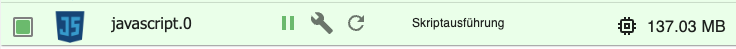

### Пример 1: Получение подстрок из значения датчика растворенного кислорода, связанных с активными параметрами мг/л и %

Этот скрипт создан для использования в JavaScript-адаптере "Выполнение скрипта". Точки данных, разумеется, должны быть адаптированы к локальной конфигурации. Скрипт разделяет строковое значение, предоставляемое датчиком растворенного кислорода (которое может содержать как мг/л, так и % в зависимости от активированных параметров), на два значения и сохраняет их в двух точках данных.

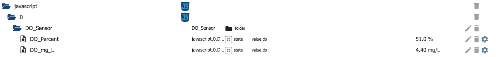

<details>
  <summary>Example 1 Script </summary>

```javascript
 console.log('Start');

 const DO_mg_L = 'javascript.' + instance + '.DO_Sensor.DO_mg_L';
 createState(DO_mg_L, 0, {"type": "string", read: true, write: false, role: "value.do", unit: "mg/L"});
 const DO_Percent = 'javascript.' + instance + '.DO_Sensor.DO_Percent';
 createState(DO_Percent, 0, {"type": "string", read: true, write: false, role: "value.do", unit: "%"});


 function buildSubstrings(str, start, end) {
 const arr = str.split(',');
 console.log('Array:' + arr.toString());
 return arr; 
 }

 on({id: 'atlas-scientific-ezo-i2c.0.0x61.Dissolved_Oxygen', change: "any"}, function (obj) { 
 
 console.log('Value changed: ' + obj.state.val);
 const doString = obj.state.val;
 const result = buildSubstrings(doString, 0, 1);
 console.log(result.toString());
 
 // Only mg/L
 if(result.length === 1){
    console.log('Setting state DO_mg_L: ' + result[0].toString());
    setState(DO_mg_L, result[0], true);
 }
 // mg/l & %
 else if (result.length === 2) {
    console.log('Setting state DO_mg_L: ' + result[0].toString());
    setState(DO_mg_L, result[0], true);
    console.log('Setting state DO_Percent: ' + result[1].toString());
    setState(DO_Percent, result[1], true);
 }
 });
```

</details>

### Пример 2: Настройка температурной компенсации для нескольких датчиков.

Этот скрипт создан для использования в JavaScript-адаптере "Выполнение скрипта". Точки данных, разумеется, должны быть адаптированы к локальной конфигурации. Он проверяет значения температуры, предоставляемые датчиком RTD, и обрезает десятичные знаки до 1. Если произошло изменение старого значения на новое, устанавливаются состояния компенсаций температуры (temp\_compensation) для целевых датчиков с временным смещением.


<details>
  <summary>Example 2 Script </summary>

```javascript
 console.log('Start temp compensation Script');

 const ph_temp_compensation = 'atlas-scientific-ezo-i2c.0.0x62.Temperature_compensation';
 const do_temp_compensation = 'atlas-scientific-ezo-i2c.0.0x61.Temperature_compensation';

 on({id: 'atlas-scientific-ezo-i2c.0.0x63.Temperature', change: "any"}, function (obj) { 

 const newTemptring = obj.state.val;
 const oldTempString = obj.oldState.val;
 const newTempCut = parseFloat(newTemptring).toFixed(1);
 const oldTempCut = parseFloat(oldTempString).toFixed(1);

 console.log('Temp value received: Old:' + oldTempCut + ' New:' + newTempCut );

 if(!(newTempCut === oldTempCut))
 {
    console.log('Temp changed from ' + oldTempCut + ' to' + newTempCut );
    console.log('Setting state ph_temp_compensation: ' + newTempCut);
    setStateDelayed(ph_temp_compensation, newTempCut, 5000);
    console.log('Setting state do_temp_compensation: ' + newTempCut);
    setStateDelayed(do_temp_compensation, newTempCut, 8000);
 }
 });
```

</details>

### ОТКАЗ ОТ ОТВЕТСТВЕННОСТИ

Пожалуйста, учитывайте авторские права и товарные знаки при использовании названий или логотипов компаний и добавьте соответствующее предупреждение в файл README. Вы можете посмотреть примеры в других адаптерах или обратиться за разъяснениями в сообщество разработчиков. Использование названия или логотипа компании без разрешения может повлечь за собой юридические проблемы.

## Лицензии третьих сторон

Некоторые небольшие части этого проекта основаны на ioBroker.i2c от UncleSamSwiss <https://github.com/UncleSamSwiss/ioBroker.i2c>

Авторские права принадлежат UncleSamSwiss, 2021 год.

Данный файл распространяется под лицензией Apache License, Version 2.0 («Лицензия»); вы не можете использовать этот файл иначе, чем в соответствии с условиями Лицензии. Вы можете получить копию Лицензии по адресу:

<http://www.apache.org/licenses/LICENSE-2.0>

Если иное не требуется применимым законодательством или не согласовано в письменной форме, программное обеспечение, распространяемое в соответствии с настоящей Лицензией, распространяется на условиях «КАК ЕСТЬ», без каких-либо гарантий или условий, явных или подразумеваемых.

См. Лицензию для получения информации о конкретных условиях и ограничениях, предусмотренных Лицензией.

## Changelog

<!--
    Placeholder for the next version (at the beginning of the line):
    ### **WORK IN PROGRESS**
-->
### 2.3.0 (2023-08-14)
- NPM Package updates

### 2.2.3 (2023-08-12)
- Added support for EZO PRS Sensor
- Added help for PRS in readme.md

### 2.2.2 (2023-08-06)
- Bugfixings: Fixed wrong order of delay initialization and delay values for some drivers
- Added backend hardware driver for embedded EZO PRS (not functional right now)

### 2.2.1 (2023-08-04)
- Added support for EC Electrical conductivity sensors
- Extended Help with new implementation

### 2.2.0 (2023-08-02)
- Several Bugfixes in Pump implementation
- adjusted readme.md

### 2.1.0 (2023-08-01)
- Added example Grafana Dashboard code and documentation
- Added example Scripts and documentation for helpful Javascript Adapter

### 2.0.0 (2023-07-31)
- Feature request: add the "active" Switch to objects #10 Part I -> Added State including state change listeners "IsPaused" to pause measure per sensor during runtime
- Feature request: add the "calibration" switches to objects #10 Part II -> Added calibration state objects
- Adjusted Readme with Help for new Features
- Added state translations for alphanumeric and boolean states to clear text

### 1.2.4 (2023-07-06)
- Finished first Pump implementation (UI and Pump control) untested due to missing device
- extended README.md
- Further translations

### 1.2.3 (2023-07-03)
- implemented delay after each polling cycle to decouple memory race conditions on device for I2C
- First steps in base implementation for peristaltic pump
- added translations for new values

### 1.2.2 (2023-06-19)
- Removed forbidden characters from sensor state objects
- added state roles where possible 
- added state units where senseful
- adjusted Readme according changes

### 1.2.1 (2023-06-16)
- Extended Help with Statechangelisteners

### 1.2.0 (2023-06-16)
- Code cleanup
- Exchanged standard setTimeOut / clearTimeout calls with adapter wrapper methods
- Removed "later" function in index.ts and used Delay Class instead

### 1.1.0 (2023-06-08)

- Removed Developer Info
- Extended Test Matrix to [16.x, 18.x, 20.x]
- Patched Translations
- Removed Whitespaces for all States from Sensors and exchanged with underscores

### 1.0.0 (2023-06-06)
- further bugfixes
- patched release yml file
- added  releaseconfig.json

### 0.0.3 (2023-05-09)
bugfixes

### 0.0.2 (2023-05-09)
-   (Buzze11) initial release

### 0.0.1 (2023-05-09)

### DISCLAIMER

Please make sure that you consider copyrights and trademarks when you use names or logos of a company and add a disclaimer to your README.
You can check other adapters for examples or ask in the developer community. Using a name or logo of a company without permission may cause legal problems for you.

## License

                                 Apache License
                           Version 2.0, January 2004
                        http://www.apache.org/licenses/

TERMS AND CONDITIONS FOR USE, REPRODUCTION, AND DISTRIBUTION

1. Definitions.

    "License" shall mean the terms and conditions for use, reproduction,
    and distribution as defined by Sections 1 through 9 of this document.

    "Licensor" shall mean the copyright owner or entity authorized by
    the copyright owner that is granting the License.

    "Legal Entity" shall mean the union of the acting entity and all
    other entities that control, are controlled by, or are under common
    control with that entity. For the purposes of this definition,
    "control" means (i) the power, direct or indirect, to cause the
    direction or management of such entity, whether by contract or
    otherwise, or (ii) ownership of fifty percent (50%) or more of the
    outstanding shares, or (iii) beneficial ownership of such entity.

    "You" (or "Your") shall mean an individual or Legal Entity
    exercising permissions granted by this License.

    "Source" form shall mean the preferred form for making modifications,
    including but not limited to software source code, documentation
    source, and configuration files.

    "Object" form shall mean any form resulting from mechanical
    transformation or translation of a Source form, including but
    not limited to compiled object code, generated documentation,
    and conversions to other media types.

    "Work" shall mean the work of authorship, whether in Source or
    Object form, made available under the License, as indicated by a
    copyright notice that is included in or attached to the work
    (an example is provided in the Appendix below).

    "Derivative Works" shall mean any work, whether in Source or Object
    form, that is based on (or derived from) the Work and for which the
    editorial revisions, annotations, elaborations, or other modifications
    represent, as a whole, an original work of authorship. For the purposes
    of this License, Derivative Works shall not include works that remain
    separable from, or merely link (or bind by name) to the interfaces of,
    the Work and Derivative Works thereof.

    "Contribution" shall mean any work of authorship, including
    the original version of the Work and any modifications or additions
    to that Work or Derivative Works thereof, that is intentionally
    submitted to Licensor for inclusion in the Work by the copyright owner
    or by an individual or Legal Entity authorized to submit on behalf of
    the copyright owner. For the purposes of this definition, "submitted"
    means any form of electronic, verbal, or written communication sent
    to the Licensor or its representatives, including but not limited to
    communication on electronic mailing lists, source code control systems,
    and issue tracking systems that are managed by, or on behalf of, the
    Licensor for the purpose of discussing and improving the Work, but
    excluding communication that is conspicuously marked or otherwise
    designated in writing by the copyright owner as "Not a Contribution."

    "Contributor" shall mean Licensor and any individual or Legal Entity
    on behalf of whom a Contribution has been received by Licensor and
    subsequently incorporated within the Work.

2. Grant of Copyright License. Subject to the terms and conditions of
   this License, each Contributor hereby grants to You a perpetual,
   worldwide, non-exclusive, no-charge, royalty-free, irrevocable
   copyright license to reproduce, prepare Derivative Works of,
   publicly display, publicly perform, sublicense, and distribute the
   Work and such Derivative Works in Source or Object form.

3. Grant of Patent License. Subject to the terms and conditions of
   this License, each Contributor hereby grants to You a perpetual,
   worldwide, non-exclusive, no-charge, royalty-free, irrevocable
   (except as stated in this section) patent license to make, have made,
   use, offer to sell, sell, import, and otherwise transfer the Work,
   where such license applies only to those patent claims licensable
   by such Contributor that are necessarily infringed by their
   Contribution(s) alone or by combination of their Contribution(s)
   with the Work to which such Contribution(s) was submitted. If You
   institute patent litigation against any entity (including a
   cross-claim or counterclaim in a lawsuit) alleging that the Work
   or a Contribution incorporated within the Work constitutes direct
   or contributory patent infringement, then any patent licenses
   granted to You under this License for that Work shall terminate
   as of the date such litigation is filed.

4. Redistribution. You may reproduce and distribute copies of the
   Work or Derivative Works thereof in any medium, with or without
   modifications, and in Source or Object form, provided that You
   meet the following conditions:

    (a) You must give any other recipients of the Work or
    Derivative Works a copy of this License; and

    (b) You must cause any modified files to carry prominent notices
    stating that You changed the files; and

    (c) You must retain, in the Source form of any Derivative Works
    that You distribute, all copyright, patent, trademark, and
    attribution notices from the Source form of the Work,
    excluding those notices that do not pertain to any part of
    the Derivative Works; and

    (d) If the Work includes a "NOTICE" text file as part of its
    distribution, then any Derivative Works that You distribute must
    include a readable copy of the attribution notices contained
    within such NOTICE file, excluding those notices that do not
    pertain to any part of the Derivative Works, in at least one
    of the following places: within a NOTICE text file distributed
    as part of the Derivative Works; within the Source form or
    documentation, if provided along with the Derivative Works; or,
    within a display generated by the Derivative Works, if and
    wherever such third-party notices normally appear. The contents
    of the NOTICE file are for informational purposes only and
    do not modify the License. You may add Your own attribution
    notices within Derivative Works that You distribute, alongside
    or as an addendum to the NOTICE text from the Work, provided
    that such additional attribution notices cannot be construed
    as modifying the License.

    You may add Your own copyright statement to Your modifications and
    may provide additional or different license terms and conditions
    for use, reproduction, or distribution of Your modifications, or
    for any such Derivative Works as a whole, provided Your use,
    reproduction, and distribution of the Work otherwise complies with
    the conditions stated in this License.

5. Submission of Contributions. Unless You explicitly state otherwise,
   any Contribution intentionally submitted for inclusion in the Work
   by You to the Licensor shall be under the terms and conditions of
   this License, without any additional terms or conditions.
   Notwithstanding the above, nothing herein shall supersede or modify
   the terms of any separate license agreement you may have executed
   with Licensor regarding such Contributions.

6. Trademarks. This License does not grant permission to use the trade
   names, trademarks, service marks, or product names of the Licensor,
   except as required for reasonable and customary use in describing the
   origin of the Work and reproducing the content of the NOTICE file.

7. Disclaimer of Warranty. Unless required by applicable law or
   agreed to in writing, Licensor provides the Work (and each
   Contributor provides its Contributions) on an "AS IS" BASIS,
   WITHOUT WARRANTIES OR CONDITIONS OF ANY KIND, either express or
   implied, including, without limitation, any warranties or conditions
   of TITLE, NON-INFRINGEMENT, MERCHANTABILITY, or FITNESS FOR A
   PARTICULAR PURPOSE. You are solely responsible for determining the
   appropriateness of using or redistributing the Work and assume any
   risks associated with Your exercise of permissions under this License.

8. Limitation of Liability. In no event and under no legal theory,
   whether in tort (including negligence), contract, or otherwise,
   unless required by applicable law (such as deliberate and grossly
   negligent acts) or agreed to in writing, shall any Contributor be
   liable to You for damages, including any direct, indirect, special,
   incidental, or consequential damages of any character arising as a
   result of this License or out of the use or inability to use the
   Work (including but not limited to damages for loss of goodwill,
   work stoppage, computer failure or malfunction, or any and all
   other commercial damages or losses), even if such Contributor
   has been advised of the possibility of such damages.

9. Accepting Warranty or Additional Liability. While redistributing
   the Work or Derivative Works thereof, You may choose to offer,
   and charge a fee for, acceptance of support, warranty, indemnity,
   or other liability obligations and/or rights consistent with this
   License. However, in accepting such obligations, You may act only
   on Your own behalf and on Your sole responsibility, not on behalf
   of any other Contributor, and only if You agree to indemnify,
   defend, and hold each Contributor harmless for any liability
   incurred by, or claims asserted against, such Contributor by reason
   of your accepting any such warranty or additional liability.

END OF TERMS AND CONDITIONS

APPENDIX: How to apply the Apache License to your work.

      To apply the Apache License to your work, attach the following
      boilerplate notice, with the fields enclosed by brackets "[]"
      replaced with your own identifying information. (Don't include
      the brackets!)  The text should be enclosed in the appropriate
      comment syntax for the file format. We also recommend that a
      file or class name and description of purpose be included on the
      same "printed page" as the copyright notice for easier
      identification within third-party archives.

Copyright 2023 Buzze11

Licensed under the Apache License, Version 2.0 (the "License");
you may not use this file except in compliance with the License.
You may obtain a copy of the License at

       http://www.apache.org/licenses/LICENSE-2.0

Unless required by applicable law or agreed to in writing, software
distributed under the License is distributed on an "AS IS" BASIS,
WITHOUT WARRANTIES OR CONDITIONS OF ANY KIND, either express or implied.
See the License for the specific language governing permissions and
limitations under the License.