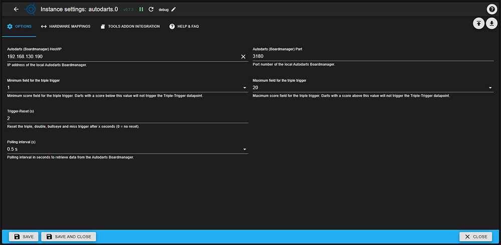

## Адаптер для интеграции с Autodarts
## Что делает этот адаптер
Подключается к локальному менеджеру досок Autodarts (через IP-адрес и порт, например, `192.168.x.x:3180`) и предоставляет доступ к состояниям ioBroker для домашней автоматизации:

- Включайте свет, когда начинается игра.
- Воспроизвести звук в мишени
- Объявить следующий бросок с помощью преобразования текста в речь (TTS)
- Аппаратное обеспечение платы управления (освещение, питание)
- Запускать любые другие сценарии автоматизации ioBroker на основе событий Dart.

## Документация
- 🇺🇸 [Документация](./docs/en/README.md)
- 🇩🇪 [Документация](./docs/de/README.md)

## Функции
### Состояние игры и броски
- **`visit.score`**: Общий балл за последний полный визит (3 броска)
- **`throw.current`**: Числовой результат последнего брошенного дротика
- **`trigger.isTriple`**: Логический флаг для количества совпадений в тройке в пределах настраиваемого диапазона сегментов (по умолчанию: 1–20)
- **`trigger.isDouble`**: Логический флаг, указывающий только на двойные попадания (все сегменты)
- **`trigger.isBullseye`**: Логический флаг, указывающий только на попадание в яблочко.
- **`trigger.isMiss`**: Логический флаг, который принимает значение true, если дротик не попадает ни в один допустимый сегмент для набора очков (чистый промах, нет очков).

### Состояние платы
- **`status.boardStatus`**: Индикатор состояния события на плате (например, «Остановлено», «Калибровка завершена», «Запущено»).
- **`status.trafficLightColor`**: шестнадцатеричный код цвета текущего состояния светофора
- **`status.trafficLightState`**: Индикатор состояния
- `зеленый` = Игрок может бросать
- `жёлтый` = Удалить дротики
- `красный` = Доска недоступна/ошибка

### Информация о системе
- **`system.software.*`**: Версии Autodarts (boardVersion, desktopVersion), сведения об ОС и платформе.
- **`system.hardware.*`**: модель процессора, архитектура ядра, имя хоста
- **`system.cams.cam0/1/2`**: Конфигурация камеры (ширина, высота, частота кадров) в формате JSON

### Управление оборудованием
- **`system.hardware.light`**: Управление подсветкой платы (двунаправленная подсветка с внешними состояниями)
- **`system.hardware.power`**: Управление питанием платы (двунаправленное с внешними состояниями)

### Конфигурация во время выполнения
- **`config.tripleMinScore/tripleMaxScore`**: Настройка пороговых значений для запуска тройного триггера во время выполнения
- **`config.triggerResetSec`**: Время автоматического сброса для флагов тройного/двойного/целевого/промаха

### Интеграция дополнений к инструментам
- **`tools.RAW`**: Состояние ввода, используемое для приема событий от инструментов браузера (например, busted, gameon, gameshot, 180, matchshot, takeout).
- **`trigger.is180/isBusted/isGameon/isGameshot/isMatchshot/isTakeout`**: Флаги триггера только для чтения устанавливаются при получении соответствующих событий через `tools.RAW`.
- **`tools.config.url*`**: Предварительно сгенерированные HTTP-адреса (простые вызовы API), которые можно скопировать в расширение Tools for Autodarts для браузера.

## Чего этот адаптер НЕ делает
- ❌ Данные не передаются в интернет или на серверы третьих лиц.
- ❌ Никакие исторические данные, статистика или персональная информация не сохраняются и не передаются третьим лицам.
- ❌ Запрещен доступ к чужим форумам или удаленным форумам через интернет.
- ❌ Нет облачных функций и аналитики

Все данные остаются локально в вашей системе ioBroker.

## Конфигурация

### Настройки адаптера разделены на четыре вкладки: **ПАРАМЕТРЫ**, **СОПОСТАВЛЕНИЯ**, **ИНТЕГРАЦИЯ ДОПОЛНЕНИЙ ИНСТРУМЕНТОВ** и **ПОМОЩЬ И ЧАСТО ЗАДАВАЕМЫЕ ВОПРОСЫ**.
### Вкладка: ПАРАМЕТРЫ
В разделе **ПАРАМЕТРЫ** вы настраиваете способ подключения адаптера к локальному менеджеру доски Autodarts и частоту опроса данных:

- **IP-адрес менеджера платы**

IP-адрес вашего менеджера доски Autodarts (например, `192.168.178.50` или `127.0.0.1`).

- **Порт**

TCP-порт диспетчера плат (обычно `3180`).

- **Тройной диапазон срабатывания**

Два выпадающих списка для определения **минимального** и **максимального** количества полей (1–20), которые следует учитывать для `trigger.isTriple`.
Тройки, выходящие за пределы этого диапазона, не будут активировать флаг.

- **Сброс триггера(ов)**

Время в секундах, по истечении которого сбрасываются флажки «тройной», «двойной», «мишень» и «промах».
`0` означает отсутствие автоматического сброса.

- **Интервал опроса (с)**

Как часто адаптер опрашивает диспетчер плат на наличие новых данных (например, `0.5`, `1`, `2` секунд).

### Вкладка: СОПОСТАВЛЕНИЯ
В разделе **MAPPINGS** можно связать существующие состояния ioBroker с состояниями адаптера, относящимися к оборудованию:

- **Идентификация легкой цели**

Идентификатор состояния ioBroker, синхронизированный с `system.hardware.light` (например, `0_userdata.0.Autodarts.LIGHT` или состоянием умного светильника/светодиодного кольца).

- **Идентификатор целевого объекта питания**

Идентификатор состояния ioBroker, синхронизированный с `system.hardware.power` (например, `0_userdata.0.Autodarts.POWER` или состоянием умной розетки).

При соответствующей настройке изменения с обеих сторон (состояние адаптера или внешнее состояние) синхронизируются в обоих направлениях, поэтому вы можете как управлять платой из ioBroker, так и реагировать на события платы.

### Вкладка: ИНТЕГРАЦИЯ ДОПОЛНЕНИЯ ИНСТРУМЕНТОВ
— Настройте IP-адрес, порт и экземпляр, чтобы адаптер мог генерировать HTTP-адреса, указывающие на вашу конечную точку simple-api в ioBroker.

​

- Конечные URL-адреса для Busted, Game On и Gameshot отображаются в виде состояний в файле autodarts.X.tools.config.urlBusted/urlGameon/urlGameshot и могут быть скопированы в расширение для браузера Tools for Autodarts.

### Вкладка: ПОМОЩЬ и ЧАСТО ЗАДАВАЕМЫЕ ВОПРОСЫ
В разделе **ПОМОЩЬ И ЧАСТО ЗАДАВАЕМЫЕ ВОПРОСЫ** вы найдете общую информацию и справку по адаптеру и его настройке.

## Конфиденциальность и обработка данных
- Этот адаптер считывает данные только из вашей **локальной** системы управления мишенями Autodarts Board Manager в вашей собственной сети.
- Персональные данные не передаются на внешние серверы и не хранятся в облаке.
- Все данные остаются в вашей системе; никакая статистика или история бросков не собираются и не передаются третьим лицам.
- Этот адаптер предназначен для работы только с вашей собственной мишенью для дартса, а не с удаленными или чужими мишенями.

## Более старые изменения
- [CHANGELOG_OLD.md](CHANGELOG_OLD.md)

## Changelog
<!--
	### **WORK IN PROGRESS**
-->
### 1.0.7 (2026-03-01)
- (skvarel) CI/CD: Updated GitHub Copilot instructions template to version 0.5.7 with latest ioBroker best practices (fixes #21, #25)

### 1.0.6 (2026-02-28)
- (skvarel) TESTING: Fixed test cleanup issues - added settled flag to httpHelper for proper Promise handling and --exit flag to test script to prevent hanging tests

### 1.0.5 (2026-02-28)
- (skvarel) FIXED: Updated outdated dependencies - release-script packages to v5.1.x and admin globalDependency to v7.6.20 (fixes #23)

### 1.0.4 (2026-01-24)
- (skvarel) FIXED: Reverted to setState() from deprecated setStateAsync()

### 1.0.3 (2026-01-21)
- (copilot) FIXED: Use setStateAsync() instead of setState() for trigger resets in throw.js to ensure database reliability
- (copilot) ENHANCED: Corrected API endpoints in copilot-instructions.md - now documents /api/state, /api/config, /api/host, /api/version correctly
- (copilot) TESTING: Added comprehensive unit tests for core modules (throw, visit, config, trafficLight, httpHelper)

## License
MIT License

Copyright (c) 2026 skvarel <sk@inventwo.com>

Permission is hereby granted, free of charge, to any person obtaining a copy
of this software and associated documentation files (the "Software"), to deal
in the Software without restriction, including without limitation the rights
to use, copy, modify, merge, publish, distribute, sublicense, and/or sell
copies of the Software, and to permit persons to whom the Software is
furnished to do so, subject to the following conditions:

The above copyright notice and this permission notice shall be included in all
copies or substantial portions of the Software.

THE SOFTWARE IS PROVIDED "AS IS", WITHOUT WARRANTY OF ANY KIND, EXPRESS OR
IMPLIED, INCLUDING BUT NOT LIMITED TO THE WARRANTIES OF MERCHANTABILITY,
FITNESS FOR A PARTICULAR PURPOSE AND NONINFRINGEMENT. IN NO EVENT SHALL THE
AUTHORS OR COPYRIGHT HOLDERS BE LIABLE FOR ANY CLAIM, DAMAGES OR OTHER
LIABILITY, WHETHER IN AN ACTION OF CONTRACT, TORT OR OTHERWISE, ARISING FROM,
OUT OF OR IN CONNECTION WITH THE SOFTWARE OR THE USE OR OTHER DEALINGS IN THE
SOFTWARE.