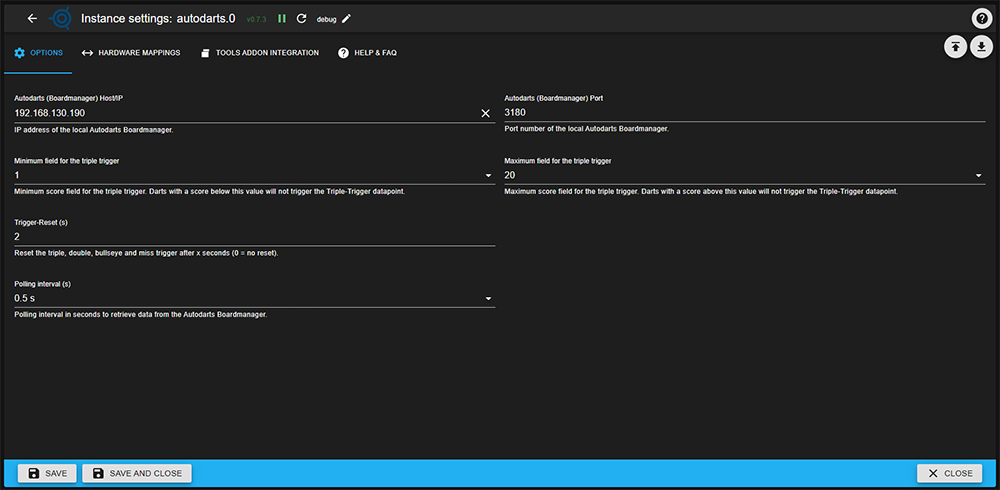

# Адаптер ioBroker для AUTODARTS

---

## Для чего нужен этот адаптер?

Подключается к вашему локальному менеджеру доски Autodarts (через IP-адрес и порт, например).`192.168.x.x:3180` ) и предоставляет доступ к состояниям ioBroker для домашней автоматизации:

- Включите свет, когда начнётся игра.
- Воспроизвести звук в мишени
- Объявите следующий бросок с помощью преобразования текста в речь (TTS).
- Аппаратное обеспечение панели управления (освещение, питание)
- Запускайте любые другие сценарии автоматизации ioBroker на основе событий Dart.

## Документация

- 🇺🇸 [Документация](./docs/en/README.md)
- 🇩🇪 [Документация](./docs/de/README.md)

## Функции

### Состояние игры и броски

- **`visit.score`** : Общий балл за последний полный визит (3 броска)
- **`throw.current`** Числовой результат последнего брошенного дротика
- **`trigger.isTriple`** : Логический флаг для тройных попаданий в пределах настраиваемого диапазона сегментов (по умолчанию: 1–20)
- **`trigger.isDouble`** Логический флаг, указывающий только на двойные попадания (во всех сегментах).
- **`trigger.isBullseye`** Логический флаг, указывающий только на попадание в цель.
- **`trigger.isMiss`** Логический флаг, который принимает значение true, если дротик не попадает ни в один допустимый сегмент для набора очков (чистый промах, нет очков).

### Статус доски

- **`status.boardStatus`** Индикатор состояния события на плате (например)`"Stopped"` ,`"Calibration finished"` ,`"Started"` ).
- **`status.trafficLightColor`** : HEX-код цвета текущего состояния платы
- **`status.trafficLightState`** Индикатор состояния
  - `green` = Игрок может бросать
  - `yellow` = Удалите дротики
  - `red` = Плата недоступна/ошибка

### Информация о системе

- **`system.software.*`** : Версии Autodarts (boardVersion, desktopVersion), сведения об ОС и платформе
- **`system.hardware.*`** : модель процессора, архитектура ядра, имя хоста
- **`system.cams.cam0/1/2`** : Конфигурация камеры (ширина, высота, частота кадров) в формате JSON

### Управление оборудованием

- **`system.hardware.light`** : Подсветка панели управления (двунаправленная, с внешними индикаторами состояния)
- **`system.hardware.power`** : Управление питанием платы (двунаправленное с внешними состояниями)

### Конфигурация во время выполнения

- **`config.tripleMinScore/tripleMaxScore`** : Настройте пороговые значения тройного срабатывания во время выполнения.
- **`config.triggerResetSec`** : Время автоматического сброса для тройных/двойных/точечных/промахов

### Интеграция инструментов и дополнений

- **`tools.RAW`** : Состояние ввода, используемое для получения событий от браузерных инструментов (например, busted, gameon, gameshot, 180, matchshot, takeout).
- **`trigger.is180/isBusted/isGameon/isGameshot/isMatchshot/isTakeout`** Флаги запуска, доступные только для чтения, устанавливаются при получении соответствующих событий.`tools.RAW` .
- **`tools.config.url*`** : Предварительно сгенерированные HTTP-адреса (простые вызовы API), которые можно скопировать в расширение Tools for Autodarts для браузера.

## Что этот адаптер НЕ делает

- ❌ Данные не передаются в интернет или на серверы третьих лиц.
- ❌ Никакие исторические данные, статистика или персональная информация не сохраняются и не передаются третьим лицам.
- ❌ Запрещен доступ к чужим форумам или удаленным форумам через интернет.
- ❌ Отсутствуют облачные функции и аналитика.

Все данные остаются локально в вашей системе ioBroker.

## Конфигурация

### Настройки адаптера разделены на четыре вкладки: **ПАРАМЕТРЫ** , **СОПОСТАВЛЕНИЯ** , **ИНТЕГРАЦИЯ ДОПОЛНЕНИЙ ИНСТРУМЕНТОВ** и **ПОМОЩЬ И ЧАСТО ЗАДАВАЕМЫЕ ВОПРОСЫ** .

### Вкладка: ПАРАМЕТРЫ

В **разделе «ПАРАМЕТРЫ»** вы настраиваете способ подключения адаптера к локальному менеджеру доски Autodarts и частоту опроса данных:

- **IP-адрес менеджера платы**\
  &#x20;IP-адрес вашего менеджера доски Autodarts (например)`192.168.178.50` или`127.0.0.1` ).

- **Порт**\
  &#x20;TCP-порт менеджера платы (обычно)`3180` ).

- **Диапазон действия тройного спускового крючка**\
  &#x20;Два выпадающих списка для определения **минимального** и **максимального** количества полей (1–20), которые следует учитывать.`trigger.isTriple` .\
  &#x20;Тройные удары, выходящие за пределы этого диапазона, не приведут к срабатыванию флага.

- **Сброс триггера (с)**\
  &#x20;Время в секундах, по истечении которого сбрасываются флажки, обозначающие тройной, двойной, точный и промах.\
  `0` Это означает отсутствие автоматического сброса.

- **Интервал опроса (с)**\
  &#x20;Как часто адаптер опрашивает диспетчер платы для получения новых данных (например)`0.5` ,`1` ,`2` секунд).

### Вкладка: СОПОСТАВЛЕНИЯ

В **разделе MAPPINGS** можно связать существующие состояния ioBroker с состояниями адаптера, относящимися к оборудованию:

- **Идентификатор световой цели**\
  &#x20;Идентификатор состояния ioBroker, синхронизированный с`system.hardware.light`\
  &#x20;(например`0_userdata.0.Autodarts.LIGHT` или состояние умного светильника/светодиодного кольца).

- **Идентификатор целевого источника питания**\
  &#x20;Идентификатор состояния ioBroker, синхронизированный с`system.hardware.power`\
  &#x20;(например`0_userdata.0.Autodarts.POWER` или состояние умной розетки).

При соответствующей настройке изменения с обеих сторон (состояние адаптера или внешнее состояние) синхронизируются в обоих направлениях, поэтому вы можете как управлять платой из ioBroker, так и реагировать на события платы.

### Вкладка: ИНТЕГРАЦИЯ ДОПОЛНЕНИЙ ИНСТРУМЕНТОВ

- Настройте IP-адрес, порт и экземпляр, чтобы адаптер мог генерировать HTTP-адреса, указывающие на вашу конечную точку ioBroker simple-api.
- Конечные URL-адреса для Busted, Game On и Gameshot отображаются в виде состояний в файле autodarts.X.tools.config.urlBusted/urlGameon/urlGameshot и могут быть скопированы в расширение для браузера Tools for Autodarts.

### Вкладка: ПОМОЩЬ и ЧАСТО ЗАДАВАЕМЫЕ ВОПРОСЫ

В разделе **«Помощь и часто задаваемые вопросы»** вы найдете общую информацию и справку по адаптеру и его настройке.

## Конфиденциальность и обработка данных

- Этот адаптер считывает данные только из **локального** менеджера доски Autodarts в вашей собственной сети.
- Персональные данные не передаются на внешние серверы и не хранятся в облаке.
- Все данные остаются в вашей системе; никакая статистика или история бросков не собираются и не передаются третьим лицам.
- Этот адаптер предназначен для работы только с вашей собственной мишенью для дартса, а не с удаленными или чужими мишенями.

## Changelog
<!--
	### **WORK IN PROGRESS**
-->
### 1.0.12 (2026-06-28)
- (skvarel) Fixed admin i18n labels flagged as untranslated by the repository checker (fixes #67)

### 1.0.11 (2026-06-10)
- (skvarel) Added meta object types for adapter and instance namespace

### 1.0.10 (2026-06-05)
- (skvarel) Migrated project rules from GitHub Copilot to Cursor rules
- (skvarel) Updated @alcalzone/release-script to 5.2.1 (fixes #59)
- (skvarel) Replaced plain setInterval() and setTimeout() with adapter-managed this.setInterval(), adapter.setTimeout() and corresponding clear methods (fixes #59)

### 1.0.9 (2026-05-25)
- (skvarel) Adapter requires node.js >= 22 now
- (skvarel) Updated @alcalzone/release-script und Plugins auf 5.2.0 aktualisiert (fixes #56)
- (skvarel) Downgraded @types/node auf ^22.0.0 heruntergestuft (fixes #56)

### 1.0.8 (2026-04-13)
- (skvarel) Removed react and mui
- (skvarel) Removed admin/style.css

## License
MIT License

Copyright (c) 2026 skvarel <sk@inventwo.com>

Permission is hereby granted, free of charge, to any person obtaining a copy
of this software and associated documentation files (the "Software"), to deal
in the Software without restriction, including without limitation the rights
to use, copy, modify, merge, publish, distribute, sublicense, and/or sell
copies of the Software, and to permit persons to whom the Software is
furnished to do so, subject to the following conditions:

The above copyright notice and this permission notice shall be included in all
copies or substantial portions of the Software.

THE SOFTWARE IS PROVIDED "AS IS", WITHOUT WARRANTY OF ANY KIND, EXPRESS OR
IMPLIED, INCLUDING BUT NOT LIMITED TO THE WARRANTIES OF MERCHANTABILITY,
FITNESS FOR A PARTICULAR PURPOSE AND NONINFRINGEMENT. IN NO EVENT SHALL THE
AUTHORS OR COPYRIGHT HOLDERS BE LIABLE FOR ANY CLAIM, DAMAGES OR OTHER
LIABILITY, WHETHER IN AN ACTION OF CONTRACT, TORT OR OTHERWISE, ARISING FROM,
OUT OF OR IN CONNECTION WITH THE SOFTWARE OR THE USE OR OTHER DEALINGS IN THE
SOFTWARE.