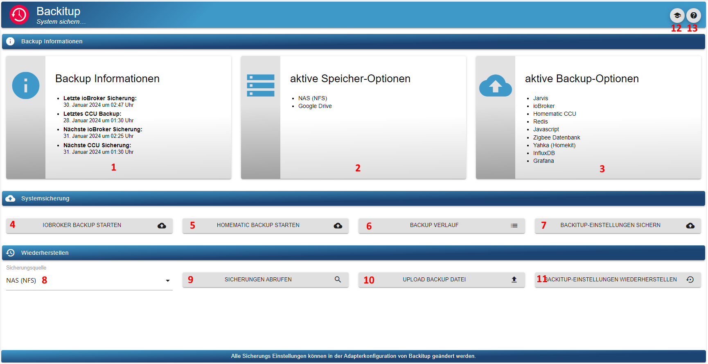
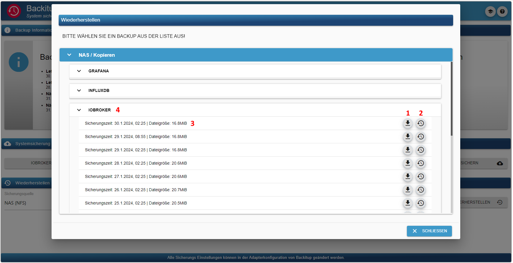
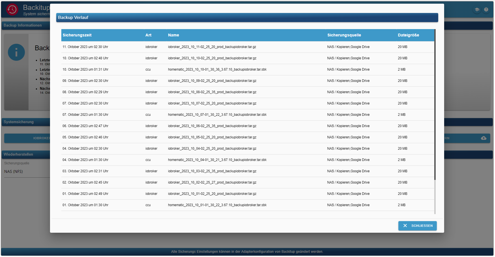
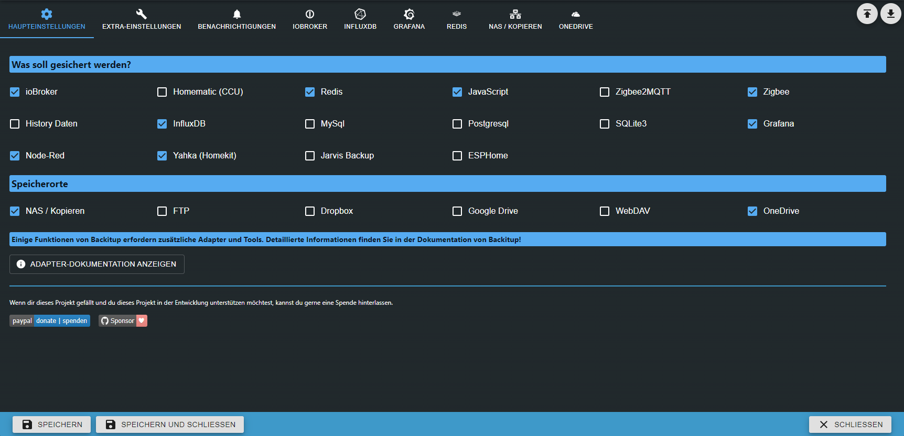
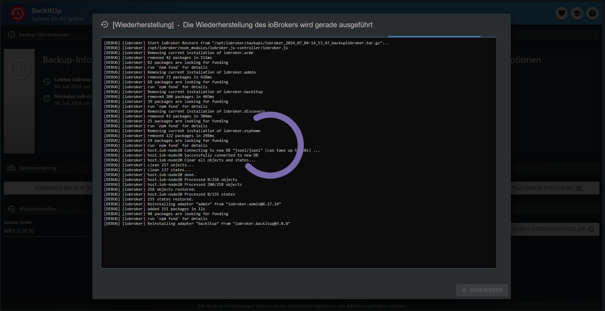
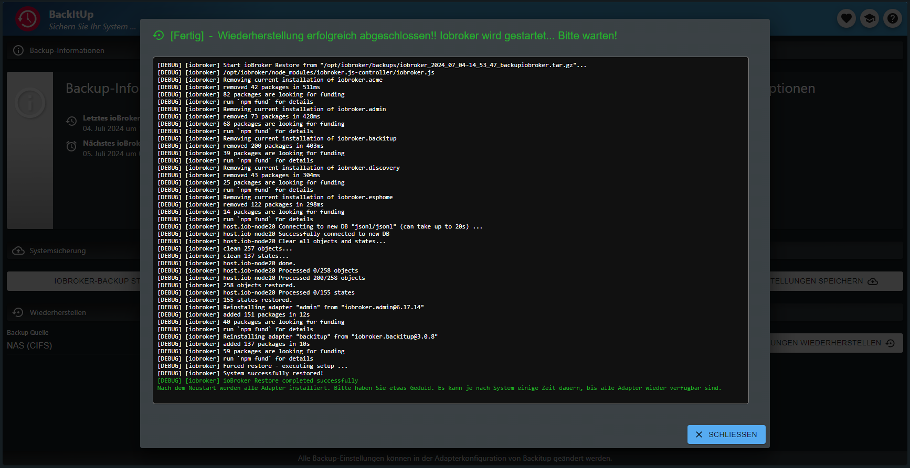

# Документация и инструкции для ioBroker.backitup

---

## Поддержка разработки адаптеров

**Если вы`ioBroker.backitup` Если вам понравилось, пожалуйста, рассмотрите возможность сделать пожертвование:**

[](https://paypal.me/mk1676)

---

## Отказ от ответственности

**`ioBroker.backitup`Это плагин резервного копирования, специально разработанный для программного обеспечения для умного дома ioBroker.**

**Данная программа не связана с [Nero BackItUp](https://www.nero.com/deu/products/nero-backitup/?vlang=de) (инструментом резервного копирования данных для систем Windows) и не поддерживается ею.**

---

## Основы

`ioBroker.backitup` Это решение для резервного копирования, позволяющее осуществлять циклическое резервное копирование как установки ioBroker, так и блока управления Homematic CCU.

Адаптер подходит для использования на разных платформах и может применяться как в системах Linux, так и в системах Windows и Mac.

Кроме того, можно создавать резервные копии различных дополнительных файлов, таких как базы данных SQL, базы данных InfluxDB, а также некоторые настройки адаптеров и устройств.

`ioBroker.backitup` Он тесно взаимодействует с js-контроллером и создает резервную копию ioBroker, идентичную той, что создается командой CLI.`iobroker backup` .

Этот процесс резервного копирования идентичен стандартному резервному копированию js-контроллера и включает в себя все состояния и объекты, а также пользовательские файлы, такие как VIS.

Процесс восстановления также полностью идентичен команде CLI.`iobroker restore <backupname>` контроллера JavaScript.

В процессе восстановления восстанавливаются все состояния, объекты и пользовательские данные.`ioBroker.backitup` Восстановлено. После восстановления ваш ioBroker перезапустится, и с этого момента установка отсутствующих адаптеров будет снова обрабатываться контроллером JavaScript.

`ioBroker.backitup` После запуска ioBroker процесс восстановления никак не влияет на работу приложения. Всё происходит в фоновом режиме, и контроллер JavaScript обрабатывает это на основе восстановленной информации в состояниях и объектах.

Однако, в отличие от команды CLI,`ioBroker.backitup` Также необходимо выполнить восстановление различных дополнительных резервных копий. Это невозможно сделать через командную строку.

_[Вернуться к началу](#dokumentation-und-anleitung-für-iobrokerbackitup)_

---

## Зависимости

- Для монтирования по протоколу CIFS необходимо установить пакет cifs-utils.
  - `sudo apt install cifs-utils`

- Для монтирования NFS требуется установленный пакет nfs-common.
  - `sudo apt install nfs-common`

- Для использования функции резервного копирования MySQL в системах MySQL необходимо установить на систему программу mysqldump.
  - `sudo apt install mysql-client` или под Debian`sudo apt install default-mysql-client`

- Для использования резервных копий MySQL в системах MariaDB необходимо установить на систему утилиту mysqldump.
  - `sudo apt install mariadb-client`

- Для использования резервного копирования SQLite3 необходимо, чтобы в системе был установлен пакет sqlite3.
  - `sudo apt install sqlite3`

- Для использования функции резервного копирования PostgreSQL необходимо установить в системе утилиту mysqldump.
  - [Руководство по установке PostgreSQL](https://www.postgresql.org/download/linux/debian/)

- Для резервного копирования InfluxDB требуется установленный influxd.
  - [Инструкции по установке InfluxDB 1.x](https://docs.influxdata.com/influxdb/v1.8/introduction/install/)
  - [Инструкции по установке InfluxDB 2.x](https://docs.influxdata.com/influxdb/v2.1/install/)
  - [Инструкция по установке Influx-CLI для версии 2.x](https://docs.influxdata.com/influxdb/v2.1/tools/influx-cli/?t=Linux)

_[Вернуться к началу](#dokumentation-und-anleitung-für-iobrokerbackitup)_

---

## Использование и эксплуатация

`ioBroker.backitup` Это можно настроить в экземплярах адаптера. Все следующие параметры доступны там.

Для повседневной работы и функционирования`ioBroker.backitup` Вкладка «Администрирование» доступна.

Если эта вкладка активна в меню вкладок административного интерфейса,`ioBroker.backitup` Управлять им можно непосредственно через вкладку в левой боковой панели вкладок ioBroker.

Там доступна информация о созданных резервных копиях, можно создавать резервные копии и восстанавливать их.



Ниже приведено краткое описание параметров в меню вкладок.

| Нет. | Описание                                                                                                                                                                                               |
| ---- | ------------------------------------------------------------------------------------------------------------------------------------------------------------------------------------------------------ |
| 1.   | Информация о последнем и следующем резервном копировании.                                                                                                                                              |
| 2.   | Информация о месте хранения резервных копий.                                                                                                                                                           |
| 3.   | Информация о том, какие типы резервного копирования активны и выполняются.                                                                                                                             |
| 4.   | Запустите резервное копирование iobroker вручную.                                                                                                                                                      |
| 5.   | Запустите резервное копирование Homematic вручную.                                                                                                                                                     |
| 6.   | Открывает новое окно и отображает все резервные копии из истории.                                                                                                                                      |
| 7.   | Эта кнопка позволяет изменить настройки`ioBroker.backitup` Сохраните настройки. Это полезный инструмент при переключении между системами. Настройки выводятся в формате JSON.                          |
| 8.   | В этом варианте вы выбираете место хранения, из которого должно быть выполнено восстановление.                                                                                                         |
| 9.   | Нажатие кнопки «Восстановить резервные копии» открывает новое окно и отображает список всех доступных резервных копий в выбранном месте хранения.                                                      |
| 10.  | Если вы хотите восстановить резервную копию с другой системы, файл резервной копии можно загрузить в систему с помощью этой кнопки.                                                                    |
| 11.  | Эта кнопка используется для просмотра сохраненных файлов.`ioBroker.backitup` Для восстановления настроек адаптера. Это не восстановление ioBroker, и сюда можно загружать только файлы в формате JSON! |
| 12.  | Открывает новую вкладку и отображает документацию.`ioBroker.backitup` к.                                                                                                                               |
| 13.  | Открывает новую вкладку и отображает файл readme.`ioBroker.backitup` к.                                                                                                                                |



Работа вкладки «Восстановить» осуществляется следующим образом.

| Нет. | Описание                                               |
| ---- | ------------------------------------------------------ |
| 1.   | Загрузите выбранную резервную копию на свой компьютер. |
| 2.   | Начинается восстановление выбранной резервной копии.   |
| 3.   | Резервная информация.                                  |
| 4.   | Информация о типе резервного копирования.              |





_[Вернуться к началу](#dokumentation-und-anleitung-für-iobrokerbackitup)_

---

## Типы резервного копирования

`ioBroker.backitup`Он предлагает множество вариантов для выполнения различных типов резервного копирования циклически или одним нажатием кнопки. По умолчанию каждая резервная копия сохраняется в каталоге /opt/iobroker/backups. При желании можно настроить загрузку по FTP или использовать монтирование через CIFS/NFS.

### ioBroker Backup

Эта резервная копия соответствует резервной копии, включенной в ioBroker, доступ к которой можно получить в консоли с помощью команды.`iobroker backup` Запустить его можно. Однако здесь это делается через заданные параметры в конфигурации адаптера или виджет OneClick Backup, без необходимости использования консоли.

### Резервное копирование CCU (Homematic)

Функция резервного копирования позволяет сохранить три разные версии установки Homematic (оригинальный CCU / pivCCU / Raspberrymatic). Резервное копирование также можно выполнить с помощью настроек адаптера или виджета OneClick Backup.

Те, кто хочет создать резервную копию более чем одного блока управления Homematic, могут активировать опцию «Резервное копирование нескольких систем», а затем указать свои блоки управления Homematic в таблице.

> \[!ВАЖНО] Резервное копирование CCU может быть выполнено только пользователем.`Admin` Выполнение поручения будет осуществлено отделением интенсивной терапии!

### резервное копирование MySQL

Эта отдельно настраиваемая резервная копия, если она включена, создается при каждом резервном копировании ioBroker и удаляется по истечении указанного периода хранения. Для этой резервной копии также можно использовать FTP или CIFS, при условии, что они настроены для других типов резервного копирования ioBroker.

Важно отметить, что даже если сервер MySQL работает на удаленной системе, команду mysqldump необходимо выполнить в системе ioBroker. Для систем Linux команда установки будет выглядеть следующим образом:`sudo apt install mysql-client` или под Debian`sudo apt install default-mysql-client` или для систем MariaDB`sudo apt install mariadb-client` .

Пользователи, желающие создать резервную копию более чем одной базы данных, могут активировать опцию «Резервное копирование нескольких систем», а затем определить свои базы данных в таблице.

### резервное копирование SQLite3

Эта отдельно настраиваемая резервная копия, если она включена, создается при каждом резервном копировании ioBroker и удаляется по истечении указанного периода хранения. Для этой резервной копии также можно использовать FTP или CIFS, при условии, что они настроены для других типов резервного копирования ioBroker.

На хост-системе должен быть установлен SQLite3 (`sudo apt install sqlite3` ) необходимо установить.

### резервное копирование Redis

Эта отдельно настраиваемая резервная копия, если она включена, создается при каждом резервном копировании ioBroker и удаляется по истечении указанного периода хранения. Для этой резервной копии также можно использовать FTP или CIFS, при условии, что они настроены для других типов резервного копирования ioBroker.

Для использования Redis с`ioBroker.backitup` Необходимо скорректировать права доступа пользователя iobroker:

```
sudo usermod -a -G redis iobroker
sudo reboot
```

Для удалённого резервного копирования требуется redis-cli в локальной системе ioBroker.

`sudo apt install redis-tools`

Здесь вам необходимо указать хост и порт удаленного сервера Redis, а также учетные данные для входа в вашу систему.

Это важная функция, особенно для пользователей Docker.

Обратите внимание, что восстановление Redis для удаленных систем через этот механизм невозможно.`ioBroker.backitup` Графический интерфейс пользователя невозможен, поскольку Redis его не поддерживает. Файл dump.rdb, содержащийся в архиве tar.gz, необходимо восстановить вручную, распаковав резервную копию архива, скопировав файл в каталог Redis и изменив права доступа к файлу dump.rdb.

Вот пример:

```
sudo tar -xvzf <Backupdatei>.tar.gz /var/lib/redis/
sudo chown redis:redis /var/lib/redis/dump.rdb
redis-cli shutdown nosave
```

### Резервное копирование исторических данных

Эта отдельно настраиваемая резервная копия, если она включена, создается при каждом резервном копировании ioBroker и удаляется по истечении указанного периода хранения. Для этой резервной копии также можно использовать FTP или CIFS, при условии, что они настроены для других типов резервного копирования ioBroker.

### Резервное копирование InfluxDB

Эта отдельно настраиваемая резервная копия, если она включена, создается при каждом резервном копировании ioBroker и удаляется по истечении указанного периода хранения. Для этой резервной копии также можно использовать FTP или CIFS, при условии, что они настроены для других типов резервного копирования ioBroker.

**Требования для удалённого резервного копирования с использованием InfluxDB v1.x:**

Для удаленного резервного копирования в InfluxDB 1.x необходимы некоторые корректировки.

**Для выполнения резервного копирования InfluxDB необходимо установить InfluxDB в системе iobroker.**

**Неважно, управляется ли база данных локально или работает на другом сервере.**

Если резервное копирование InfluxDB выполняется с удаленного сервера, необходимо изменить права доступа для службы RPC в файле influxdb.conf на удаленном сервере.

```
bind-address = "<InfluxDB-IP>:8088"
```

или

```
bind-address = "0.0.0.0:8088"
```

**После внесения изменений в конфигурацию необходимо перезапустить службу InfluxDB.**

Дополнительную информацию о резервном копировании данных в InfluxDB можно найти [здесь](https://docs.influxdata.com/influxdb/v1.8/administration/backup_and_restore/#online-backup-and-restore-for-influxdb-oss) .

**Требования для резервного копирования с помощью InfluxDB v2.x:**

Для создания резервной копии базы данных InfluxDB 2.x необходимо установить на вашем компьютере Influx-CLI. Это требуется как для локального, так и для удаленного резервного копирования.

Для удалённого резервного копирования InfluxCLI необходимо установить на системе, где работает ваш ioBroker. Установка на удалённой системе, где находится ваша база данных, для резервного копирования не требуется.

Здесь вы найдете официальные инструкции по установке Influx-CLI на вашу систему.

[Инструкция по установке Influx-CLI для версии 2.x](https://docs.influxdata.com/influxdb/v2.1/tools/influx-cli/?t=Linux)

Пользователи, желающие создать резервную копию более чем одной базы данных, могут активировать опцию «Резервное копирование нескольких систем», а затем определить свои базы данных в таблице.

> \[!ВАЖНО] Для создания и восстановления резервной копии InfluxDB2 требуется токен оператора!

### резервное копирование PostgreSQL

Эта отдельно настраиваемая резервная копия, если она включена, создается при каждом резервном копировании ioBroker и удаляется по истечении указанного периода хранения. Для этой резервной копии также можно использовать FTP или CIFS, при условии, что они настроены для других типов резервного копирования ioBroker.

Важно отметить, что даже если сервер PostgreSQL работает на удаленной системе, PostgreSQL также должен быть запущен на системе ioBroker. Инструкции по установке для систем Linux доступны [здесь](https://www.postgresql.org/download/linux/debian/) .

Пользователи, желающие создать резервную копию более чем одной базы данных, могут активировать опцию «Резервное копирование нескольких систем», а затем определить свои базы данных в таблице.

### резервное копирование с помощью JavaScript

Эта отдельно настраиваемая резервная копия, если она включена, создается при каждом резервном копировании ioBroker и удаляется по истечении указанного периода хранения. Для этой резервной копии также можно использовать FTP или CIFS, при условии, что они настроены для других типов резервного копирования ioBroker.

Прочь`ioBroker.backitup` В версии 2.2.0 скрипты сохраняются непосредственно из объектов. Резервное копирование JavaScript из более старых версий не поддерживается.`ioBroker.backitup` -Версии несовместимы для восстановления!!

К с`ioBroker.backitup` Для выполнения резервного копирования с помощью JavaScript в версиях < 2.2.0 необходимо предварительно определить пункты меню «Зеркалирование скриптов в указанный путь к файлу» и «Экземпляр, выполняющий зеркалирование» в конфигурации адаптера JavaScript.

`ioBroker.backitup` Затем эти настройки можно применить в меню конфигурации.

### Джарвис в качестве резервного копирования

Эта отдельно настраиваемая резервная копия, если она включена, создается при каждом резервном копировании ioBroker и удаляется по истечении указанного периода хранения. Для этой резервной копии также можно использовать FTP или CIFS, при условии, что они настроены для других типов резервного копирования ioBroker.

### резервное копирование Zigbee

Эта отдельно настраиваемая резервная копия, если она включена, создается при каждом резервном копировании ioBroker и удаляется по истечении указанного периода хранения. Для этой резервной копии также можно использовать FTP или CIFS, при условии, что они настроены для других типов резервного копирования ioBroker.

### резервное копирование Zigbee2MQTT

Эта отдельно настраиваемая резервная копия, если она включена, создается при каждом резервном копировании ioBroker и удаляется по истечении указанного периода хранения. Для этой резервной копии также можно использовать FTP или CIFS, при условии, что они настроены для других типов резервного копирования ioBroker.

#### Локальное резервное копирование Zigbee2MQTT

Путь в`ioBroker.backitup` Адаптер всегда следует создавать непосредственно в пути «данных» zigbee2mqtt. Пример:`/opt/zigbee2mqtt/data` или непосредственно в том во время установки zigbee2mqtt в Docker.

Также важно, чтобы пользователь "iobroker" имел права доступа к папке с данными, чтобы иметь возможность читать и записывать файлы.

Права доступа для групп можно настроить следующим образом:

```
sudo usermod -a -G <zigbee2mqtt User> iobroker
sudo reboot
```

#### Удалённое резервное копирование Zigbee в MQTT

Можно создать резервную копию Zigbee2MQTT, расположенную на другом компьютере.

Для этого необходимо настроить IP-адрес MQTT-сервера (не IP-адрес Zigbee2MQTT) в Backitup с помощью Zigbee2MQTT, а также порт MQTT и базовую тему Zigbee2MQTT.

Если на MQTT-сервере включена аутентификация, потребуется также имя пользователя и пароль.

> \[!ВАЖНО] Восстановление удаленной резервной копии выполняется напрямую через Zigbee2MQTT, а не через Backitup.

### Резервное копирование Node-RED

Эта отдельно настраиваемая резервная копия, если она включена, создается при каждом резервном копировании ioBroker и удаляется по истечении указанного периода хранения. Для этой резервной копии также можно использовать FTP или CIFS, при условии, что они настроены для других типов резервного копирования ioBroker.

### Резервное копирование Grafana

Эта отдельно настраиваемая резервная копия, если она включена, создается при каждом резервном копировании ioBroker и удаляется по истечении указанного периода хранения. Для этой резервной копии также можно использовать FTP или CIFS, при условии, что они настроены для других типов резервного копирования ioBroker.

> \[!ВАЖНО] Для создания резервной копии Grafana необходимо сгенерировать ключ API или сервисный токен в веб-интерфейсе Grafana, чтобы получить доступ к панелям мониторинга и источникам данных.

Вплоть до версии Grafana 8.x ключ API можно создать в разделе _**"Конфигурация → Ключи API или сервисный токен"**_ и для этого требуются полные права администратора.

Начиная с версии 9.0, учетная запись службы сначала создается в разделе _**«Конфигурация → Администрирование Пользователи и доступ → Учетные записи служб»**_ . После создания учетной записи можно добавить токен, используя _**кнопку «Добавить токен учетной записи службы»**_ .

### Резервная копия Yahka

Эта отдельно настраиваемая резервная копия, если она включена, создается при каждом резервном копировании ioBroker и удаляется по истечении указанного периода хранения. Для этой резервной копии также можно использовать FTP или CIFS, при условии, что они настроены для других типов резервного копирования ioBroker.

Все системные настройки HomeKit и настройки устройств будут сохранены в резервной копии.

_[Вернуться к началу](#dokumentation-und-anleitung-für-iobrokerbackitup)_

---

## Варианты хранения

### Местный

Место хранения резервных копий по умолчанию в ioBroker — это...`/opt/iobroker/backups` Это задано системой заранее и не может быть изменено. Если ни один из перечисленных ниже путей монтирования CIFS или NFS не активен, все резервные копии будут храниться в пути по умолчанию и оставаться локально на хост-системе.

Дополнительные варианты хранения, такие как облачное хранилище или FTP, создают копию резервной копии только в выбранном месте хранения вне хост-системы.

### CIFS

В Linux монтирование по протоколу CIFS не представляет проблемы.

Обратите внимание, что необходимо установить пакет cifs-utils.

Путь должен выглядеть примерно так (например, "/имя/путь к общей папке")

При желании вы можете включить/отключить функцию удаления резервных копий с NAS-сервера.

### NFS

В Linux монтирование NFS не представляет проблемы.

Обратите внимание, что необходимо установить nfs-common.

Путь должен выглядеть примерно так (например, "/share name/path").

При желании вы можете включить/отключить функцию удаления резервных копий с NAS-сервера.

### ФТП

FTP доступен во всех операционных системах и служит альтернативой монтированию через CIFS.

Путь, указываемый по протоколу FTP, всегда должен начинаться с символа "/" (например, "/path")

При желании вы можете включить/отключить функцию удаления резервных копий с NAS-сервера.

### Копия

Если монтирование по протоколу CIFS невозможно, есть другой вариант — использование функции копирования.

Здесь, в настройках CIFS, необходимо указать путь, в который следует скопировать данные.

Для функции копирования поле IP-адреса должно оставаться пустым.

### Экспертная монтировка

В профессиональных настройках вы можете создать собственную команду монтирования, которую адаптер будет использовать для резервного копирования и восстановления. Здесь вы можете настроить параметры и, например, включить файл fstab или учетные данные.

> \[!ВНИМАНИЕ] Обратите внимание, что эта опция предназначена только для экспертов.

### Dropbox

Для использования резервного копирования Dropbox необходимо получить токен доступа. Это можно сделать на странице настроек Dropbox.`ioBroker.backitup` делать.

ioBroker получает доступ только к определенным областям; токены и пользовательские данные в облаке не хранятся.

Любой желающий может создать собственное приложение Dropbox API в настройках.`ioBroker.backitup` Выберите этот пункт, а затем выполните следующие действия.

> Примечание: В настоящее время пользовательские приложения используют только токен "short\_live", действительный в течение 4 часов. Мы рекомендуем использовать стандартное приложение ioBroker.

Для использования функции резервного копирования в Dropbox необходимо создать токен доступа и приложение по адресу <https://www.dropbox.com/developers/apps> :

- Шаг 1: Воспользуйтесь кнопкой «Создать приложение».
- Шаг 2: Выберите «Ограниченный доступ».
- Шаг 3: Выберите «Папка приложений».
- Шаг 4: Введите название для вашего приложения и нажмите кнопку «Создать приложение».
- Шаг 5: На вкладке «Разрешения» отметьте все 4 поля в разделе «Файлы и папки».
- Шаг 6: На вкладке «Настройки» установите для параметра «Срок действия токена доступа» значение «Без срока действия».
- Шаг 7: Нажмите кнопку «Сгенерированный токен доступа» (Этот сгенерированный токен будет сохранен в настройках).`ioBroker.backitup` (введено)

В вашем Dropbox появилась новая папка под названием "Приложения".

### Google Диск

Для использования резервных копий в Google Drive необходимо получить токен доступа. Это можно сделать на странице настроек.

ioBroker имеет доступ только к определенным областям. Код OAuth можно посмотреть [здесь](https://github.com/simatec/ioBroker.backitup/blob/master/docs/oAuthService.js) .

В облаке не хранятся токены и пользовательские данные.

### OneDrive

Для использования резервного копирования OneDrive необходимо получить токен доступа. Это можно сделать на странице настроек OneDrive.`ioBroker.backitup` делать.

ioBroker получает доступ только к определенным областям; токены и пользовательские данные в облаке не хранятся.

### ВебДАВ

WebDAV предлагает`ioBroker.backitup` Возможность доступа к нескольким облачным системам, наиболее известной из которых является Nextcloud. Для установления соединения WebDAV требуются имя пользователя и пароль облачной учетной записи.

Подключение к облаку осуществляется через зашифрованное соединение.

Для установления соединения имя хоста облачного сервиса должно соответствовать всем требованиям к сертификатам безопасности.

> Пример URL: " <https://example.com/remote.php/dav/files/username/> "

Подключение с использованием локального IP-адреса возможно только в том случае, если параметр "Разрешить только подписанные сертификаты" отключен.

_[Вернуться к началу](#dokumentation-und-anleitung-für-iobrokerbackitup)_

---

## Удаление старых резервных копий

`ioBroker.backitup` Она может автоматически удалять старые резервные копии. Количество сохраняемых резервных копий можно настроить в параметрах.`ioBroker.backitup` Это можно указать. Более старые резервные копии удаляются только в том случае, если адаптер выполняет автоматическое резервное копирование по расписанию.

> \[!NOTE] Более старые файлы резервных копий не удаляются при ручном резервном копировании.

> \[!ВАЖНО] Если во время процесса резервного копирования произойдет ошибка, более старые резервные копии не будут удалены по соображениям безопасности.

В журнале отладки отображается информация о том, какие резервные копии были удалены, а также о любых ошибках, возникших в процессе удаления.

_[Вернуться к началу](#dokumentation-und-anleitung-für-iobrokerbackitup)_

---

## Поддержка нескольких хостов

Многохостовая система для`ioBroker.backitup` может использоваться с несколькими экземплярами`ioBroker.backitup` Работает на разных хостах.

Пример`ioBroker.backitup` Для обеспечения поддержки его необходимо настроить как главный сервер. Все остальные экземпляры, расположенные на удаленных хостах, настраиваются как подчиненные серверы.

Главная система управляет автоматическим резервным копированием. Все подчиненные экземпляры можно выбрать из меню главной системы.

Для подчиненных экземпляров можно включить следующие параметры резервного копирования:

- Редис
- Зигби
- Джарвис
- История
- ИнфлюксД
- MySQL
- SQLite3
- PostgreSQL
- Графана
- Яхка
- Node-RED
- Zigbee2MQTT

Поскольку автоматическое резервное копирование управляется главным экземпляром в подчиненном экземпляре, резервное копирование iobroker, резервное копирование JavaScript и резервное копирование CCU выбрать нельзя.

Места хранения отдельных резервных копий можно свободно настраивать на каждом подчиненном устройстве. Это позволяет каждому подчиненному устройству создавать собственную систему хранения файлов независимо от главного устройства.

В системах с ограниченным объемом оперативной памяти...`ioBroker.backitup` Главный сервер должен автоматически запускать подчиненные экземпляры для процесса резервного копирования, а затем снова останавливать их.

Этот параметр можно настроить в меню.

_[Вернуться к началу](#dokumentation-und-anleitung-für-iobrokerbackitup)_

---

## поддержка Docker

Поскольку системы баз данных не следует устанавливать в контейнерах Docker, резервное копирование всех баз данных не поддерживается и недоступно по умолчанию при обнаружении контейнера Docker. Для резервного копирования внешних баз данных в любом случае необходимо установить две переменные среды контейнера:

- IOB\_BACKITUP\_EXTDB=true
- УПАКОВКИ

Содержимое переменной среды "PACKAGES" определяется пакетами, которые необходимо установить для доступа к соответствующей базе данных. Примерами могут служить "mysql-client" или "redis-tools". Более подробную информацию можно найти [здесь](https://docs.buanet.de/iobroker-docker-image/docs_backitup/) .

К`ioBroker.backitup` Для полноценного использования в Docker необходимо настроить некоторые порты.

- Порт 8091 — Восстановление веб-интерфейса
- Порт 9081 — файловый сервер для загрузки резервных копий через веб-интерфейс`ioBroker.backitup`
- Порт 9082 — файловый сервер для загрузки резервных копий через веб-интерфейс.`ioBroker.backitup`

_[Вернуться к началу](#dokumentation-und-anleitung-für-iobrokerbackitup)_

---

## использовать

1. Адаптер создает несколько точек данных для использования в Vis.

   - oneClick.ccu -> служит триггером для резервного копирования CCU (можно установить значение true в Vis с помощью кнопки)

   - oneClick.iobroker -> служит триггером для стандартного резервного копирования (можно установить значение true в Vis с помощью кнопки).

   - history.html -> служит журналом истории, который можно настроить в Vis через CCS с точки зрения дизайна.

   - history.json -> служит журналом истории, который можно настроить в Vis через CCS.

   - history.ccuLastTime -> хранит дату и время создания последней резервной копии CCU.

   - history.minimalLastTime -> хранит дату и время создания последней стандартной резервной копии.

   - history.ccuSuccess -> отображает состояние "true", когда резервное копирование выполнено успешно.

   - history.minimalSuccess -> отображает состояние "true" для успешных резервных копий

   - history.iobrokerLastTime -> показывает последнее резервное копирование ioBroker

   - history.ccuLastTime -> показывает последнее резервное копирование CCU

   - info.ccuNextTime -> показывает время следующего выполнения резервного копирования CCU

   - info.iobrokerNextTime -> показывает время следующего выполнения резервного копирования ioBroker.

   - info.latestBackup -> отображает последнюю резервную копию, определенную при запуске, в формате JSON.

2. Просмотреть журнал истории резервного копирования в Vis
   - В журнале истории резервного копирования отображаются последние x резервных копий.
   - Количество отображаемых записей истории можно задать в дополнительных настройках.
   - Отобразить журнал истории, например, в HTML-виджете можно, введя в HTML следующую строку:

```
{backitup.0.history.html}
```

Синтаксис: {BackitupInstanz.history.html}

3. Форматирование журнала истории в соответствии со стандартом CCS:

```
   .html{
       display:block;
       width:100%;
   /*    overflow-y:scroll; */
   }
   .backup-type-iobroker
       {
           float:left;
           color:white;
           font-size:20px;
       }
   .backup-type-ccu
       {
           float:left;
           color:red;
           font-size:20px;
    }
```

4. Кнопка OneClick со статусным текстом
   - Когда для точки данных OneClick установлено значение true, начинается соответствующее резервное копирование, и по истечении заданного времени эта точка данных снова устанавливается в значение false. Это позволяет создать кнопку с индикатором состояния. Для этого измените следующую строку и введите её в качестве текста кнопки в Vis:

```
{wert: backitup.0.oneClick.iobroker; wert === "true" || wert === true ? "Minimal Backup </br> wird erstellt" : "Minimal Backup </br> starten"}
```

Синтаксис: {значение:<BackitupInstanz> .oneClick.\<trigger>; value === "true" || value === true ? "Текст при создании резервной копии" : "Текст по умолчанию"}

_[Вернуться к началу](#dokumentation-und-anleitung-für-iobrokerbackitup)_

---

## Уведомления

`ioBroker.backitup` Для уведомлений об успешном резервном копировании поддерживаются следующие мессенджеры. Для их использования необходимо установить и настроить соответствующие адаптеры.

- Телеграмма
- Слабак
- электронная почта
- WhatsApp
- сигнал
- матрица
- Discord

_[Вернуться к началу](#dokumentation-und-anleitung-für-iobrokerbackitup)_

---

## Восстановить

С`ioBroker.backitup` Можно ли восстановить все созданные типы резервных копий через меню настроек в ioBroker?

`ioBroker.backitup` Он тесно взаимодействует с js-контроллером и создает резервную копию iobroker, идентичную команде CLI "iobroker backup".

Этот процесс резервного копирования идентичен стандартному резервному копированию js-контроллера и включает в себя все состояния и объекты, а также пользовательские файлы, такие как VIS.

Процесс восстановления также полностью идентичен команде CLI контроллера js.

В процессе восстановления восстанавливаются все состояния, объекты и пользовательские данные.`ioBroker.backitup` восстановлено.



После восстановления ваш ioBroker перезапустится, и с этого момента js-контроллер возьмет на себя установку отсутствующих адаптеров.



`ioBroker.backitup` После запуска ioBroker система не влияет на процесс восстановления. Он обрабатывается в фоновом режиме контроллером JavaScript с использованием восстановленной информации из состояний и объектов.

Восстановление можно выполнить со всех носителей информации.

> \[!NOTE] Однако, как правило, самый безопасный способ — это выполнить восстановление локально.

Для обеспечения максимальной безопасности выполните восстановление локально и поместите файл резервной копии в папку резервных копий ioBroker. В системах Linux эта папка находится по следующему пути:`/opt/iobroker/backups`

При использовании типов резервного копирования "ioBroker" и "redis" процесс восстановления ioBroker останавливается, а затем автоматически перезапускается.

**Для всех остальных типов резервного копирования ioBroker не останавливается. Временно останавливаются только затронутые адаптеры.**

Тем, кто предпочитает восстанавливать резервные копии вручную, следует выполнить следующие действия:

_**Восстановление резервной копии ioBroker:**_ - Резервная копия должна находиться в обычном каталоге.`opt/iobroker/backups` Ложь — это можно сделать через консоль с помощью команды:`iobroker restore <Backupdateiname>` будет восстановлено. - После восстановления,`iobroker upload all` необходимый

Подробные инструкции по восстановлению с помощью`ioBroker.backitup` Инструкции по ручному восстановлению также можно найти [здесь](https://github.com/simatec/ioBroker.backitup/wiki/%5BHowTo%5D-Restore-auf-Linux-Distributionen) .

**Резервную копию CCU по-прежнему необходимо восстанавливать через веб-интерфейс CCU.**

_**Восстановление резервной копии Raspberrymatic/CCU:**_ - Скопируйте файл \*.sbk с помощью SCP в каталог "/usr/local/tmp" на Raspberrymatic. - Войдите в Raspberrymatic как пользователь root через консоль. - Выполните команду: "/bin/restoreBackup.sh /user/local/tmp/YourBackupFilename" на Raspberrymatic. - Выполните команду: "reboot" на Raspberrymatic, чтобы перезагрузить Raspberrymatic. - В качестве альтернативы, резервную копию, конечно же, можно восстановить обычным способом через веб-интерфейс.

### Восстановление базы данных InfluxDB

При восстановлении резервной копии InfluxDB важно отметить, что адаптер InfluxDB должен быть предварительно остановлен, а база данных не должна существовать.

> \[!NOTE] Если база данных существует, ее необходимо удалить перед восстановлением.

Перезапускать адаптер InfluxDB следует только после завершения процесса восстановления, поскольку он всегда будет пытаться создать базу данных.

Кроме того, для восстановления базы данных InfluxDB 2.x необходимо предварительно настроить токен оператора в меню ioBroker.backitup перед началом восстановления.

> \[!NOTE] Восстановление невозможно без корректного токена оператора.

_[Вернуться к началу](#dokumentation-und-anleitung-für-iobrokerbackitup)_

---

## Поиск неисправностей

```
Um Fehler zu loggen, muss `ioBroker.backitup` in unter dem ioBroker Reiter "Instanzen" auf Log-Stufe "debug" gestellt werden.
```

_[Вернуться к началу](#dokumentation-und-anleitung-für-iobrokerbackitup)_

---

## Обнаруженные ошибки / Решения

Ниже приведён список проблем, с которыми мы столкнулись на данный момент, и их решения (где это возможно).

1. У пользователя Olifall (с форума) возникла проблема: после восстановления веб-интерфейс ioBroker стал недоступен. Он смог решить эту проблему, выполнив следующие действия через консоль:
   - sudo iobroker status
   - Сообщение = "Нет связи с состояниями 127.0.0.0:6379\[redis]"
   - sudo apt install redis-server

2. Если монтирование по IP-адресу через CIFS невозможно, следует использовать имя хоста NAS.

3. Пользователи обнаружили, что при монтировании CIFS-интерфейса пароль, содержащий специальные символы, необходимо вводить в конфигурационном файле в кавычках.

4. По словам некоторых пользователей, CIFS-Mount не может обрабатывать очень длинные пароли. Если монтирование не удается, немного сократите пароль (мне достаточно 12 символов).

5. Если установка адаптера не удалась, проверьте версии Node и Node.js. Адаптер не поддерживает версии Node ниже 8.

6. Если ваша система ioBroker была установлена с помощью нового скрипта установки, у вас может отсутствовать весь необходимый набор прав для нового пользователя "iobroker". К сожалению, это также влияет на backitup, поскольку backitup использует некоторые критически важные для системы команды.

   Для решения проблемы с отсутствующими правами доступа существует исправление для скрипта установки ioBroker. Пожалуйста, выполните следующие команды в консоли вашей среды ioBroker:

   ```
   iobroker stop
   iobroker fix
   sudo reboot
   ```

7. Если при создании базы данных Redis вы получаете сообщение об ошибке, проверьте, имеет ли пользователь "iobroker" необходимые права доступа и является ли он членом группы пользователей "Redis". В противном случае, вы можете исправить это с помощью следующей команды в консоли.
   ```
   sudo usermod -a -G redis iobroker
   sudo reboot
   ```
   Если вы не устанавливали ioBroker с помощью скрипта установки и у вашего пользователя другое имя, замените "iobroker" на ваше имя пользователя в команде.

8. Если устройство Fritzbox используется в качестве NAS с версией прошивки >= 7.21, следует учитывать следующее:`ioBroker.backitup` В настройках SMB установлено значение "3.1.1", и включена опция "noserverino".

_[Вернуться к началу](#dokumentation-und-anleitung-für-iobrokerbackitup)_

---

## Changelog
### 4.0.3 (2026-08-22)
* (simatec) Fix signed FTP Certificates
* (simatec) Fix Backup Timeout
* (simatec) Fix lint check

### 4.0.2 (2026-08-18)
* (simatec) Fix Backitup Tab
* (simatec) dependencies updated

### 4.0.1 (2026-08-07)
* (simatec) Fix Backitup Tab

### 4.0.0 (2026-08-04)
* (simatec) dependencies updated
* (simatec) Fix Translation
* (simatec) small Fixes
* (simatec) Integrated token encryption
* (simatec) Fix Yahka Backup
* (@GermanBluefox) Updated GUI packages und removed linter errors
* (simatec) Update Node Engine
* (@GermanBluefox) Migrated to Admin 8
* (simatec) Redesign Backitup Tab

### 3.3.17 (2026-04-14)
* (simatec) Fix vite Build

[Older changelogs can be found there](CHANGELOG_OLD.md)

## License

The MIT License (MIT)

Copyright (c) 2018-2026 simatec

Permission is hereby granted, free of charge, to any person obtaining a copy
of this software and associated documentation files (the "Software"), to deal
in the Software without restriction, including without limitation the rights
to use, copy, modify, merge, publish, distribute, sublicense, and/or sell
copies of the Software, and to permit persons to whom the Software is
furnished to do so, subject to the following conditions:

The above copyright notice and this permission notice shall be included in
all copies or substantial portions of the Software.

THE SOFTWARE IS PROVIDED "AS IS", WITHOUT WARRANTY OF ANY KIND, EXPRESS OR
IMPLIED, INCLUDING BUT NOT LIMITED TO THE WARRANTIES OF MERCHANTABILITY,
FITNESS FOR A PARTICULAR PURPOSE AND NONINFRINGEMENT. IN NO EVENT SHALL THE
AUTHORS OR COPYRIGHT HOLDERS BE LIABLE FOR ANY CLAIM, DAMAGES OR OTHER
LIABILITY, WHETHER IN AN ACTION OF CONTRACT, TORT OR OTHERWISE, ARISING FROM,
OUT OF OR IN CONNECTION WITH THE SOFTWARE OR THE USE OR OTHER DEALINGS IN
THE SOFTWARE.