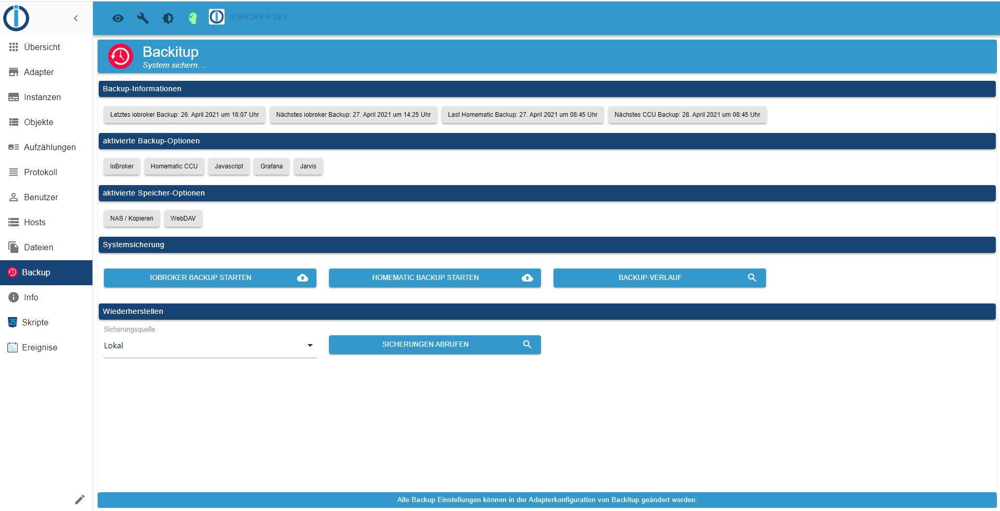

# IoBroker.backitup


**Если вам нравится ioBroker.backitup, рассмотрите возможность сделать пожертвование:**

[![PayPal] (https://www.paypalobjects.com/en_US/DK/i/btn/btn_donateCC_LG.gif)](https://paypal.me/mk1676)

**************************************************************************************************************

## Отказ от ответственности
**ioBroker.backitup — это плагин резервного копирования только для ПО для умного дома ioBroker.**<br> **Он не связан с [Nero BackItUp](https://www.nero.com/deu/products/nero-backitup/?vlang=de) (инструмент для резервного копирования данных в системах Windows) и не поддерживается им.**

**Этот личный проект ioBroker.backitup выполняется в свободное время и не преследует коммерческих целей.**

**************************************************************************************************************

# Содержание
* [базовый](#базовый)
* [зависимости](#зависимости)
* [использование и эксплуатация](#использование-и-эксплуатация)
* [типы резервных копий](#типы резервных копий)
* [Резервная копия ioBroker](#Резервная копия ioBroker)
* [Резервное копирование CCU (Homematic)](#CCU-Резервное копирование-(Homematic))
* [резервная копия mysql] (# резервная копия mysql)
    * [резервная копия Redis] (# резервная копия Redis)
* [Резервная копия InfluxDB] (#Резервная копия InfluxDB)
    * [Резервная копия PostgreSQL](#Резервная копия PostgreSQL)
    * [резервная копия javascript](#резервная копия javascript)
    * [резервная копия Джарвиса] (# резервная копия Джарвиса)
    * [Резервное копирование Zigbee] (#Резервное копирование Zigbee)
    * [резервная копия графана](#резервная копия графана)
    * [Резервная копия Яхки] (#Резервная копия Яхки)
* [Параметры хранения](#Параметры хранения)
    * [CIFS](#CIFS)
    * [НФС](#НФС)
    * [FTP](#FTP)
    * [Копировать](#Копировать)
    * [дропбокс](#дропбокс)
    * [Диск Google](#Диск Google)
    * [WebDAV](#WebDAV)
* [Поддержка нескольких хостов] (# Поддержка нескольких хостов)
* [Поддержка Docker](#Поддержка Docker)
* [Использование](#Использование)
* [Уведомления](#Уведомления)
* [Восстановить](#Восстановить)
* [Устранение неполадок](#Устранение неполадок)
* [Обнаружены ошибки/решения](#Обнаружены ошибки-/-решения)

---

# Основы
ioBroker.backitup — это решение для резервного копирования, которое обеспечивает циклическое резервное копирование установки ioBroker и Homematic CCU.

Адаптер подходит для мультиплатформ и может использоваться в установках Linux, а также в установках Windows и Mac.

Кроме того, есть возможность сохранять различные дополнительные резервные копии, такие как базы данных SQL, базы данных Influx и некоторые настройки адаптера и устройства.

ioBroker.backitup тесно взаимодействует с js-контроллером и создает резервную копию iobroker, идентичную команде CLI `iobroker backup`.

Все состояния и объекты, а также пользовательские файлы, такие как VIS, сохраняются здесь идентично стандартному резервному копированию js-контроллера.

Восстановление также полностью идентично команде CLI `iobroker restore <backupname>` js-контроллера.

При восстановлении все состояния, объекты и пользовательские данные восстанавливаются из ioBroker.backitup.
После восстановления ваш iobroker перезапускается, и оттуда js-контроллер снова берет на себя установку отсутствующих адаптеров.

ioBroker.backitup никак не влияет на восстановление после запуска iobroker. Все это происходит в фоновом режиме, и js-контроллер берет на себя управление на основе восстановленной информации в состояниях и объектах.

### [назад](#Inhalt)
---

# Зависимости
* Для монтирования CIFS необходимо установить cifs-utils.
    - `sudo apt установить cifs-utils`

* nfs-common должен быть установлен для монтирования NFS.
    - `sudo apt установить nfs-common`

* Чтобы использовать резервную копию MySql систем MySql, в системе должен быть установлен mysqldump.
    - `sudo apt install mysql-client` или в Debian `sudo apt install default-mysql-client`

* Чтобы использовать резервную копию MySql систем MariaDB, в системе должен быть установлен mysqldump.
    - `sudo apt установить mariadb-клиент`

* Чтобы использовать резервную копию Sqlite3, в системе должен быть установлен sqlite3.
    - `sudo apt установить sqlite3`

* Чтобы использовать резервную копию PostgreSQL, в системе должен быть установлен mysqldump.
    - [Руководство по установке PostgreSQL](https://www.postgresql.org/download/linux/debian/)

* Для использования резервной копии InfluxDB необходимо установить Influxd.
    - [Руководство по установке InfluxDB 1.x] (https://docs.influxdata.com/influxdb/v1.8/introduction/install/)
    - [Руководство по установке InfluxDB 2.x] (https://docs.influxdata.com/influxdb/v2.1/install/)
    - [Руководство по установке Influx-CLI для 2.x] (https://docs.influxdata.com/influxdb/v2.1/tools/influx-cli/?t=Linux)

### [назад](#Inhalt)
---

# Использование и эксплуатация
ioBroker.backitup можно настроить в экземплярах адаптера. Здесь доступны все следующие параметры настройки.<br><br> Во вкладке администратора доступна вкладка для ежедневной работы и эксплуатации ioBroker.backitup.<br> Если эта вкладка активна в меню вкладок интерфейса администратора, ioBroker.backitup можно управлять напрямую через вкладку на левой панели вкладок iobroker.<br><br> Там доступна информация о созданных резервных копиях, можно создавать резервные копии и есть возможность восстановить резервную копию.

  

### [назад](#Inhalt)
---

# Типы резервных копий
ioBroker.backitup предлагает множество вариантов циклического выполнения различных типов резервного копирования или одним нажатием кнопки. По умолчанию каждая резервная копия хранится в каталоге /opt/iobroker/backups/. При желании можно настроить загрузку по FTP или, в качестве альтернативы, можно использовать монтирование CIFS/NFS.

## Резервное копирование ioBroker
Эта резервная копия соответствует резервной копии, содержащейся в ioBroker, которую можно запустить в консоли, вызвав `iobroker backup`. Только здесь это делается через указанные настройки в конфигурации адаптера или виджет OneClick Backup без использования консоли.

## Резервное копирование CCU (Homematic)
Эта резервная копия дает возможность создать резервную копию 3 различных версий установки Homematic (CCU-Original / pivCCU / Raspberrymatic). Это резервное копирование также можно выполнить с использованием параметров, указанных в конфигурации адаптера или в виджете OneClick Backup.<br><br> Если вы не хотите просто создавать резервную копию CCU, вы можете активировать опцию «Резервное копирование нескольких систем», а затем указать свои центры Homematic в таблице.

## Бэкап MySQL
Если он активирован, эта отдельно настраиваемая резервная копия создается при каждом резервном копировании ioBroker, а также удаляется по истечении указанного срока хранения. FTP или CIFS также допустимы для этой резервной копии, если они установлены для других типов резервных копий ioBroker.<br><br> Здесь важно, что даже если сервер mysql работает в удаленной системе, mysqldump должен работать в системе ioBroker.<br> Для систем Linux команда установки будет следующей: `sudo apt install mysql-client` или в Debian `sudo apt install default-mysql-client` или для систем MariaDB `sudo apt install mariadb-client`.<br><br> Если вы не хотите просто создавать резервные копии одной базы данных, вы можете активировать опцию «Резервное копирование нескольких систем», а затем определить свои базы данных в таблице.

## Резервное копирование Sqlite3
Если он активирован, эта отдельно настраиваемая резервная копия создается при каждом резервном копировании ioBroker, а также удаляется по истечении указанного срока хранения. FTP или CIFS также допустимы для этой резервной копии, если они установлены для других типов резервных копий ioBroker.<br><br> Sqlite3 (`sudo apt install msqlite3`) должен быть установлен в хост-системе.

## Резервное копирование Redis
Если он активирован, эта отдельно настраиваемая резервная копия создается при каждом резервном копировании ioBroker, а также удаляется по истечении указанного срока хранения. FTP или CIFS также допустимы для этой резервной копии, если они установлены для других типов резервных копий ioBroker.<br> Для использования Redis с ioBroker.backitup необходимо настроить права пользователя iobroker:<br>

```
sudo usermod -a -G redis iobroker
sudo reboot
```

Для удаленного резервного копирования требуется redis-cli в локальной системе iobroker.

`sudo apt install redis-tools`

Здесь вы должны ввести свой хост и порт удаленного сервера Redis, а также данные для входа в вашу систему.

Это важная функция, особенно для пользователей Docker.

Обратите внимание, что восстановление Redis для удаленных систем невозможно через графический интерфейс ioBroker.backitup.
Redis не поддерживает это.
Здесь необходимо вручную восстановить файл dump.rdb, содержащийся в архиве tar.gz.

Для этого необходимо распаковать резервный архив, скопировать файл в директорию Redis и настроить права на dump.rdb.

Вот пример:

```
sudo tar -xvzf <Backupdatei>.tar.gz /var/lib/redis/
sudo chown redis:redis /var/lib/redis/dump.rdb
redis-cli shutdown nosave
```

## Резервное копирование данных истории
Если он активирован, эта отдельно настраиваемая резервная копия создается при каждом резервном копировании ioBroker, а также удаляется по истечении указанного срока хранения. FTP или CIFS также допустимы для этой резервной копии, если они установлены для других типов резервных копий ioBroker.

## Бэкап InfluxDB
Если он активирован, эта отдельно настраиваемая резервная копия создается при каждом резервном копировании ioBroker, а также удаляется по истечении указанного срока хранения. FTP или CIFS также допустимы для этой резервной копии, если они установлены для других типов резервных копий ioBroker.<br><br> **Требования к удаленному резервному копированию с помощью InfluxDB v1.x:**

Некоторые настройки необходимы для удаленного резервного копирования под InfluxDB 1.x.

**Для запуска резервного копирования InfluxDB необходимо установить Influxd в системе iobroker.**<br> **Не имеет значения, администрируется ли база данных локально или работает на другом сервере.**<br><br> Если резервная копия InfluxDB должна создаваться удаленным сервером, удаленные права для службы RPC должны быть настроены в файле influxdb.conf на удаленном сервере.

```
bind-address = "<InfluxDB-IP>:8088"
```

или

```
bind-address = "0.0.0.0:8088"
```

**После изменения конфигурации сервис InfluxDB необходимо перезапустить.**

Дополнительную информацию о резервном копировании данных InfluxDB можно найти в [здесь](https://docs.influxdata.com/influxdb/v1.8/administration/backup_and_restore/#online-backup-and-restore-for-influxdb-oss).<br><br>

**Требования к резервному копированию с помощью InfluxDB v2.x:**

Чтобы иметь возможность создать резервную копию InfluxDB 2.x, в вашей системе должен быть установлен Influx-CLI.
Это необходимо как для локального, так и для удаленного резервного копирования.

Для удаленного резервного копирования Influx-CLI должен быть установлен в системе, в которой также работает ваш iobroker.
На удаленной системе, где работает ваша база данных, установка для резервного копирования не требуется.

Здесь вы найдете официальные инструкции по установке Influx-CLI в вашей системе.

[Руководство по установке Influx-CLI для 2.x](https://docs.influxdata.com/influxdb/v2.1/tools/influx-cli/?t=Linux)<br><br>

Если вы не хотите просто создавать резервные копии одной базы данных, вы можете активировать опцию «Резервное копирование нескольких систем», а затем определить свои базы данных в таблице.<br>

## Бэкап PostgreSQL
Если он активирован, эта отдельно настраиваемая резервная копия создается при каждом резервном копировании ioBroker, а также удаляется по истечении указанного срока хранения. FTP или CIFS также допустимы для этой резервной копии, если они установлены для других типов резервных копий ioBroker.<br><br> Здесь важно, что даже если сервер PostgreSQL работает в удаленной системе, PostgreSQL должен работать в системе ioBroker.<br> Существуют [здесь](https://www.postgresql.org/download/linux/debian/) инструкции по установке для систем Linux.<br><br> Если вы не хотите просто создавать резервные копии одной базы данных, вы можете активировать опцию «Резервное копирование нескольких систем», а затем определить свои базы данных в таблице.

## Резервное копирование Javascript
Если он активирован, эта отдельно настраиваемая резервная копия создается при каждом резервном копировании ioBroker, а также удаляется по истечении указанного срока хранения. FTP или CIFS также допустимы для этой резервной копии, если они установлены для других типов резервных копий ioBroker.<br><br> Начиная с ioBroker.backitup версии 2.2.0, скрипты резервируются непосредственно из объектов. Резервные копии Javascript из более старых версий ioBroker.backitup не подходят для восстановления!!<br><br> Чтобы иметь возможность выполнять резервное копирование Javascript с версиями ioBroker.backitup &lt; 2.2.0, пункты меню «Зеркальное отображение скриптов в пути к файлу» и «Экземпляр, выполняющий зеркалирование» должны быть заранее указаны в конфигурации адаптера Javascript.<br> Затем ioBroker.backitup может взять на себя настройки в меню конфигурации.

## Резервная копия Джарвиса
Если он активирован, эта отдельно настраиваемая резервная копия создается при каждом резервном копировании ioBroker, а также удаляется по истечении указанного срока хранения. FTP или CIFS также допустимы для этой резервной копии, если они установлены для других типов резервных копий ioBroker.<br><br>

## Резервное копирование Zigbee
Если он активирован, эта отдельно настраиваемая резервная копия создается при каждом резервном копировании ioBroker, а также удаляется по истечении указанного срока хранения. FTP или CIFS также допустимы для этой резервной копии, если они установлены для других типов резервных копий ioBroker.

## Резервная копия Zigbee2MQTT
Если он активирован, эта отдельно настраиваемая резервная копия создается при каждом резервном копировании ioBroker, а также удаляется по истечении указанного срока хранения. FTP или CIFS также допустимы для этой резервной копии, если они установлены для других типов резервных копий ioBroker.

Путь в адаптере ioBroker.backitup всегда должен создаваться непосредственно на пути «данных» zigbee2mqtt.
Пример: `/opt/zigbee2mqtt/data` или непосредственно в том с установкой zigbee2mqtt в Docker.

Здесь также важно, чтобы пользователь «iobroker» имел права на папку с данными, чтобы иметь возможность читать и записывать файлы.

Групповые права можно настроить следующим образом:

```
sudo usermod -a -G <zigbe2mqtt User> iobroker
sudo reboot
```

## Красная резервная копия узла
Если он активирован, эта отдельно настраиваемая резервная копия создается при каждом резервном копировании ioBroker, а также удаляется по истечении указанного срока хранения. FTP или CIFS также допустимы для этой резервной копии, если они установлены для других типов резервных копий ioBroker.

## Резервное копирование Графана
Если он активирован, эта отдельно настраиваемая резервная копия создается при каждом резервном копировании ioBroker, а также удаляется по истечении указанного срока хранения. FTP или CIFS также допустимы для этой резервной копии, если они установлены для других типов резервных копий ioBroker.<br><br> **Чтобы иметь возможность создать резервную копию Grafana, необходимы имя пользователя Grafana (admin) и пароль.**<br><br> **Кроме того, для доступа к информационным панелям в веб-интерфейсе Grafana необходимо сгенерировать ключ API или токен службы.**<br> Ключ API можно создать в разделе *** «Конфигурация → Ключи API или токен службы»***, и он должен иметь полные права администратора.

## Резервная копия Яхки
Если он активирован, эта отдельно настраиваемая резервная копия создается при каждом резервном копировании ioBroker, а также удаляется по истечении указанного срока хранения. FTP или CIFS также допустимы для этой резервной копии, если они установлены для других типов резервных копий ioBroker.<br><br> Все системные настройки Homkit и настройки устройства будут сохранены.

### [назад](#Inhalt)
---

# Варианты хранения
##СИФС
Монтирование CIFS не является проблемой в Linux.<br> Следует отметить, что cifs-utils устанавливается

Спецификация пути должна выглядеть следующим образом (например: «/имя общего ресурса/спецификация пути»)<br> При желании вы можете включить/выключить удаление резервных копий из NAS.

  ## НФС
Монтирование NFS не является проблемой в Linux.<br> Следует отметить, что nfs-common установлен<br><br> Спецификация пути должна выглядеть следующим образом (например, «/имя общего ресурса/спецификация пути»).<br> При желании вы можете включить/выключить удаление резервных копий из NAS.

## FTP
FTP возможен во всех ОС и служит альтернативой монтированию CIFS.<br> Спецификация пути в FTP всегда должна начинаться с «/» (например: «/спецификация пути»)<br> При желании вы можете включить/выключить удаление резервных копий из NAS.

## Копировать
Если монтирование CIFS невозможно, есть еще один вариант функции копирования<br> Здесь в настройках CIFS нужно прописать путь, куда должно происходить копирование.<br> IP-адрес должен оставаться пустым для функции копирования.

## Дропбокс
Чтобы использовать резервную копию в Dropbox, вам необходимо получить токен доступа. Это можно сделать на странице конфигурации ioBroker.backitup.<br> ioBroker имеет доступ только к определенным областям.<br><br> Никакие токены или пользовательские данные не хранятся в облаке.

Если вы хотите создать собственное приложение API Dropbox, вы можете выбрать его в настройках ioBroker.backitup, а затем выполнить следующие шаги.

> Примечание. Собственные приложения имеют только токен «short_live», который действителен только в течение 4 часов. Мы рекомендуем использовать стандартное приложение iobroker.

Чтобы использовать резервную копию в Dropbox, необходимо создать токен доступа и приложение на странице https://www.dropbox.com/developers/apps.<br><br>

* Шаг 1: Используйте кнопку «Создать приложение»
* Шаг 2: Выберите «Ограниченный доступ».
* Шаг 3: Выберите «Папка приложения».
* Шаг 4: Введите «Назовите свое приложение» и нажмите кнопку «Создать приложение».
* Шаг 5: На вкладке «Разрешения» установите все 4 флажка в области «Файлы и папки».
* Шаг 6: На вкладке «Настройки» установите «Срок действия токена доступа» на «Без срока действия».
* Шаг 7: Нажмите кнопку «Сгенерированный токен доступа» (данный сгенерированный токен вводится в настройках ioBroker.backitup)<br><br>

В вашем Dropbox теперь есть новая папка под названием «Приложения».

## Гугл Диск
Чтобы использовать резервную копию на Google Диске, вам необходимо получить токен доступа. Это можно сделать на странице конфигурации.<br> ioBroker имеет доступ только к определенным областям. Код для oAuth можно увидеть в [здесь](https://github.com/simatec/ioBroker.backitup/blob/master/docs/oAuthService.js).<br><br> Никакие токены или пользовательские данные не хранятся в облаке.

## Один диск
Чтобы использовать резервную копию в Onedrive, вам необходимо получить токен доступа. Это можно сделать на странице конфигурации ioBroker.backitup.<br> ioBroker имеет доступ только к определенным областям.<br><br> Никакие токены или пользовательские данные не хранятся в облаке.

##WebDAV
С помощью WebDAV ioBroker.backitup предлагает возможность обращения к нескольким облачным системам.<br> Наиболее известным здесь является NextCloud. Для установки соединения WebDAV требуются имя пользователя и пароль облачной учетной записи.<br> Соединение с облаком осуществляется через зашифрованное соединение.<br><br> Чтобы можно было установить соединение, имя хоста облака должно соответствовать всем сертификатам безопасности.<br><br> &gt; Пример URL: &quot;https://example.com/remote.php/dav/files/username/&quot;<br><br> Соединение с локальным IP-адресом возможно только при отключенной опции «Разрешить только подписанные сертификаты».

### [назад](#Inhalt)
---

# Поддержка нескольких хостов
Мультихост для ioBroker.backitup может работать с несколькими экземплярами ioBroker.backitup на разных хостах.<br> Экземпляр ioBroker.backitup должен быть настроен как главный для поддержки. Все остальные экземпляры, расположенные на удаленных хостах, настроены как подчиненные.<br><br> Мастер управляет автоматическим резервным копированием. Все ведомые экземпляры можно выбрать в ведущем через меню.<br> Для подчиненных экземпляров можно активировать следующие параметры резервного копирования:<br>

* Редис
* Зигби
* Джарвис
* История
* Приток БД
* MySQL
* Sqlite3
* PostgreSQL
* Графана
* Яхка
* Красный узел
* Zigbee2MQTT

Поскольку автоматическое резервное копирование контролируется ведущим устройством в подчиненном экземпляре, резервные копии iobroker, резервные копии Javascript и резервные копии CCU не могут быть выбраны.<br><br> Места хранения отдельных резервных копий можно свободно настроить на каждом ведомом устройстве. Таким образом, каждый может разработать свою систему хранения файлов независимо от мастера.<br><br>

В системах с ограниченным объемом оперативной памяти мастер ioBroker.backitup может автоматически запускать, а затем останавливать подчиненные экземпляры для процесса резервного копирования.<br> Этот параметр настраивается в меню.

### [назад](#Inhalt)
---

# Поддержка докера
Начиная с версии 2.2.0 резервное копирование и восстановление поддерживаются в официальном контейнере Docker.<br><br> Поскольку в Docker не нужно устанавливать системы баз данных, резервные копии всех баз данных не поддерживаются и не могут быть выбраны для распознанного контейнера Docker.<br> Поддержка ioBroker.backitup поддерживается в официальном док-контейнере iobroker начиная с версии v5.2.0-beta4.

### [назад](#Inhalt)
---

# Использовать
1. Адаптер создает некоторые точки данных для использования в Vis<br>
* oneClick.ccu -> служит триггером для резервного копирования CCU (можно установить значение true в Vis с помощью кнопки)
* oneClick.iobroker -&gt; служит триггером для стандартного резервного копирования (можно установить в Vis кнопкой)<br><br>
* history.html -> служит журналом истории, который можно настроить в Vis через CCS.
    * history.json -> служит журналом истории, который можно настроить в Vis через CCS.
* history.ccuLastTime -> сохраняет дату и время создания последней резервной копии CCU
* history.minimalLastTime -> сохраняет дату и время создания последней стандартной резервной копии
    * history.ccuSuccess -> показывает состояние «true», если резервное копирование прошло успешно
    * history.minimalSuccess -> показывает состояние "true", если резервное копирование прошло успешно
    * history.iobrokerLastTime -> показывает последнюю резервную копию ioBroker
    * history.ccuLastTime -> показывает последнюю резервную копию CCU
    * info.ccuNextTime -> показывает время следующего выполнения резервной копии CCU
    * info.iobrokerNextTime -> показывает время следующего выполнения резервной копии ioBroker
    * info.latestBackup -> показывает в формате json последнюю резервную копию, определенную при запуске

2. Показать журнал истории в Vis
   - Можно отобразить журнал истории в виджете HTML, например, введя следующую строку в HTML:

```
{backitup.0.history.html}
```

Синтаксис: {BackitupInstance.history.html}

3. CCS форматирование журнала истории:

```
   .html{
       display:block;
       width:100%;
   /*    overflow-y:scroll; */
   }
   .backup-type-iobroker
       {
           float:left;
           color:white;
           font-size:20px;
       }
   .backup-type-ccu
       {
           float:left;
           color:red;
           font-size:20px;
    }
   ```

4. Кнопка OneClick с текстом состояния
   - Если для точки данных OneClick установлено значение true, запускается соответствующее резервное копирование, и по истечении заданного времени для этой точки данных снова устанавливается значение false, поэтому можно создать кнопку со статусом, адаптировать следующую строку и ввести ее в Vis как текст кнопки:

```
{wert: backitup.0.oneClick.iobroker; wert === "true" || wert === true ? "Minimal Backup </br> wird erstellt" : "Minimal Backup </br> starten"}

```

Синтаксис: {value: <backitupinstance>.oneClick.<trigger>; значение === "истина" || значение === правда? «Текст во время создания резервной копии» : «Текст по умолчанию»}

### [назад](#Inhalt)
---

# Уведомления
ioBroker.backitup поддерживает следующие мессенджеры для уведомлений после успешного резервного копирования.
Перед использованием необходимо установить и настроить соответствующие адаптеры.

   * Телеграмма
   * Пустяк
   * электронная почта
   * WhatsApp
   * Сигнал
   * Матрица
   * Дискорд

### [назад](#Inhalt)
---

# Восстановить
С помощью ioBroker.backitup можно восстановить все созданные типы резервных копий через меню конфигурации в ioBroker.<br><br> ioBroker.backitup очень тесно работает с js-контроллером и создает резервную копию iobroker, идентичную команде CLI «резервная копия iobroker».

Все состояния и объекты, а также пользовательские файлы, такие как VIS, сохраняются здесь идентично стандартному резервному копированию js-контроллера.

Восстановление также полностью идентично CLI-команде js-контроллера.

При восстановлении все состояния, объекты и пользовательские данные восстанавливаются из ioBroker.backitup.
После восстановления ваш iobroker перезапускается, и оттуда js-контроллер снова берет на себя установку отсутствующих адаптеров.

ioBroker.backitup никак не влияет на восстановление после запуска iobroker. Все это происходит в фоновом режиме, и js-контроллер берет на себя управление на основе восстановленной информации в состояниях и объектах.

Восстановление может быть выполнено со всех носителей.<br><br> **В принципе, самый безопасный способ — запустить восстановление локально.**<br><br> Если вы выбрали самый безопасный способ и хотите выполнить восстановление локально, вы должны сохранить файл резервной копии в папке резервных копий iobroker. В системах Linux эта папка находится по следующему пути: `/opt/iobroker/backups`

При использовании типов резервного копирования «iobroker» и «redis» во время восстановления iobroker останавливается, а затем автоматически перезапускается.<br> После остановки iobroker открывается новая вкладка браузера, в которой можно увидеть ход восстановления.<br><br> ***Если эта вкладка не открывается, проверьте настройки браузера на блокировку всплывающих окон.***<br><br>

**Для всех других типов резервного копирования iobroker не останавливается. Здесь кратковременно останавливаются только затронутые адаптеры.**<br><br>

Если вы предпочитаете восстанавливать резервные копии вручную, вам следует сделать следующее:

***Восстановить резервную копию ioBroker:***

    - Резервная копия должна находиться в каталоге opt/iobroker/backups, как обычно.
    - Его можно восстановить из консоли с помощью команды: `iobroker restore <имя файла резервной копии>`.
    - После восстановления требуется `iobroker upload all`

Подробные инструкции по восстановлению с помощью ioBroker.backitup, а также по восстановлению вручную можно найти в [здесь](https://forum.iobroker.net/topic/27271/howto-iobroker-restore-unter-linux-durchf%C3%BChren).

**Резервную копию CCU необходимо восстановить через веб-интерфейс CCU.**

***Восстановление резервной копии Raspberrymatic/CCU:***

    - Скопируйте файл *.sbk в «каталог /usr/local/tmp» на Raspberrymatic через SCP.
    - Войдите в Raspberrymatic как пользователь root через консоль.
    - Запустите команду: «/bin/restoreBackup.sh /user/local/tmp/yourbackupfilename» на Raspberrymatic.
    - Выполните команду: «перезагрузить» на Raspberrymatic, чтобы перезапустить PI.
    - Кроме того, резервную копию, конечно, можно восстановить, как обычно, через веб-интерфейс.

### [назад](#Inhalt)
---

# Поиск неисправностей
    Чтобы регистрировать ошибки, ioBroker.backitup должен быть установлен на уровень журнала «отладка» на вкладке «Экземпляры ioBroker».

### [назад](#Inhalt)
---

# Произошедшие ошибки/решения:
Вот список проблем, которые возникли до сих пор, и их решения, если таковые имеются.

1. У Olifall (с форума) была проблема, что веб-интерфейс ioBroker больше не был доступен после восстановления.Он смог исправить это, выполнив следующие действия через консоль:
    - статус sudo iobroker
    - Сообщение = "Нет связи с состояниями 127.0.0.0:6379[redis]"
    - sudo apt установить redis-сервер

2. Если монтирование CIFS с IP-адресом невозможно, следует использовать имя хоста NAS.
3. Если вы используете пароль со специальными символами для cifs-mount, пользователи заметили, что пароль должен храниться в конфиге с кавычками.
4. По мнению некоторых пользователей, cifs-mount не справляется с очень длинными паролями. Если монтирование не работает, немного укоротите пароль (у меня работает 12 символов).
5. Если адаптер установить не удается, проверьте свои версии node и nodejs. Адаптер не поддерживает версии < Node 8.
6. Если ваша система iobroker была установлена с помощью нового сценария установки, может случиться так, что у вас нет всех прав для нового пользователя iobroker.

    К сожалению, это также влияет на резервное копирование, так как резервное копирование использует некоторые важные для системы команды.

Для решения проблемы с отсутствующими правами теперь есть исправление для скрипта установщика iobroker.
Пожалуйста, выполните следующие команды в вашей среде iobroker в консоли:

```
iobroker stop
iobroker fix
sudo reboot
```

7. Если при создании базы данных Redis вы получаете сообщение об ошибке, проверьте, есть ли у вашего пользователя iobroker права и входит ли он в группу пользователей Redis.

    Если это не так, вы можете исправить это с помощью следующей команды в консоли.

```
sudo usermod -a -G redis iobroker
sudo reboot
```

    Если вы не настроили установку iobroker с помощью сценария установщика и у вашего пользователя другое имя, замените «iobroker» на своего пользователя в команде.

8. Если в качестве NAS используется Fritzbox с прошивкой >= 7.21, для параметров SMB в ioBroker.backitup необходимо установить значение «3.1.1» и активировать опцию «noserverino».

### [назад](#Inhalt)
---

## Changelog
<!-- ### **WORK IN PROGRESS** -->
### **WORK IN PROGRESS**
* (simatec) small Sentry fixes
* (simatec) Bugfix System-Message

### 2.7.0 (2023-08-14)
* (simatec) dependencies updated
* (simatec) Fix error Messages
* (simatec) edit automatic name addition added
* (simatec) Docu & Wiki updated
* (simatec) small bug fixes
* (simatec) Translation updated
* (crycode-de) Add support for sending notifications via discord (requires ioBroker.discord >= 2.1)

### 2.6.23 (2023-05-25)
* (simatec) Fix Influx Restore for MultiDB
* (simatec) Token renew for Onedrive added
* (simatec) Fix PSQL Restore

### 2.6.22 (2023-05-24)
* (simatec) Fix Influx Restore for MultiDB
* (simatec) Default Ports for InfluxDB added

### 2.6.21 (2023-05-19)
* (simatec) small Sentry fixes
* (simatec) Fix Influx Restore
* (simatec) Fix Onedrive Download
* (simatec) dependencies updated

### 2.6.20 (2023-05-02)
* (simatec) FTP self signed Certificates added
* (simatec) dependencies updated

### 2.6.19 (2023-04-20)
* (simatec) small fix for js-controller 5

### 2.6.18 (2023-04-19)
* (simatec) dependencies updated
* (simatec) small Sentry fixes
* (simatec) Error notifications optimized

### 2.6.17 (2023-04-13)
* (simatec) Fix delete InfluxDB tmp dir
* (simatec) small Sentry fixes

### 2.6.16 (2023-03-30)
* (simatec) small fix for js-controller 5

### 2.6.15 (2023-03-27)
* (simatec) Node-Red Backup optimized
* (simatec) Grafana Backup optimized
* (simatec) Zigbee2mqtt Backup optimized
* (simatec) skip-verify for influxdb 2.x

### 2.6.14 (2023-03-22)
* (simatec) Bug Fix History JSON

### 2.6.13 (2023-03-22)
* (simatec) Fix Zigbee2mqtt Restore
* (simatec) Fix Grafana Backup
* (simatec) Backup notifications optimized
* (simatec) Error notifications optimized
* (simatec) history data optimized
* (simatec) small bug fixes

### 2.6.12 (2023-03-16)
* (simatec) Fix Zigbee2mqtt Backup & Restore
* (simatec) Node-Red Backup optimized
* (simatec) Grafana Backup optimized
* (simatec) InfluxDB Backup optimized
* (simatec) Docu & Wiki updated

### 2.6.11 (2023-03-11)
* (simatec) Fix Zigbee2mqtt Backup & Restore

### 2.6.10 (2023-03-10)
* (simatec) Design Fix
* (simatec) node 14 set as minimum requirement
* (simatec) cleaning status log added
* (simatec) Fix Node-Red Backup & Restore

### 2.6.9 (2023-03-08)
* (simatec) Dropbox session upload optimized
* (simatec) Error handling optimized

### 2.6.8 (2023-03-07)
* (simatec) Fix Dropbox session upload

### 2.6.7 (2023-03-06)
* (simatec) Dropbox session upload optimized

### 2.6.6 (2023-03-05)
* (simatec) Dropbox file upload up to 350 GB added

### 2.6.5 (2023-03-03)
* (simatec) Fix cifs Password
* (simatec) Fix InfluxDB-Backup

### 2.6.4 (2023-02-26)
* (simatec) Design optimized
* (simatec) Onedrive Upload Session added

### 2.6.3 (2023-02-24)
* (simatec) Fix SQLite3 Backup
* (simatec) Fix Matrix Message

### 2.6.2 (2023-02-23)
* (simatec) Fix SQLite3 Backup

### 2.6.1 (2023-02-20)
* (simatec) igonore temp-files for redis added

### 2.6.0 (2023-02-16)
* (simatec) Onedrive-Api added
* (simatec) Matrix Messenger added
* (simatec) TLS for FTP added
* (simatec) Tab Extra-Settings added
* (simatec) Node-Red Backup added
* (simatec) SQLLite Backup added
* (simatec) Zigbee2MQTT Backup added
* (simatec) Local-Storage check added
* (simatec) System-Message added
* (simatec) Jarvis Backup updated
* (simatec) many small Fixes

### 2.5.12 (2023-01-19)
* (simatec) Fix Windows ioBroker-Restore

### 2.5.11 (2023-01-18)
* (simatec) Fix Windows ioBroker-Restore

### 2.5.10 (2023-01-03)
* (simatec) Fix Docker Restore
* (simatec) Fix Link Design
* (simatec) dependencies updated
* (Grothesk242) Fix CIFS Mount

### 2.5.9 (2022-12-05)
* (simatec) dependencies dropbox-v2-api updated
* (simatec) Fix Zigbee Restore
* (simatec) Fix Yahka Restore
* (simatec) Fix Javascript Restore
* (simatec) Fix Dropbox Error Messages

### 2.5.8 (2022-12-03)
* (simatec) Fix iobroker Backup
* (simatec) dependencies updated

### 2.5.7 (2022-11-27)
* (simatec) Axios 1.1.3 added
* (bluefox) Added ukrainian language

### 2.5.6 (2022-11-14)
* (simatec) Fix Grafana Backup
* (simatec) Fix Downloadserver
* (simatec) Translation updated

### 2.5.5 (2022-11-13)
* (simatec) Design Fix
* (simatec) Docker DB Support added

### 2.5.4 (2022-11-02)
* (simatec) Fix maxBuffer for DB-Backups
* (simatec) Docu updated
* (simatec) Fix Dropbox error messages
* (simatec) Grafana self signed Certificates added

### 2.5.3 (2022-11-01)
* (simatec) dependencies updated

### 2.5.2 (2022-10-26)
* (simatec) Bugfix Google Drive

### 2.5.1 (2022-10-26)
* (simatec) Bugfix Google Drive

### 2.5.0 (2022-10-18)
* (bluefox) Google Drive authentication was fixed
* (simatec) small Bugfix

### 2.4.16 (2022-10-04)
* (simatec) small Bugfix

### 2.4.15 (2022-10-03)
* (simatec) adapter-core updated
* (simatec) path fix

### 2.4.14 (2022-09-29)
* (simatec) small Bugfix

### 2.4.13 (2022-09-28)
* (simatec) dependencies updated
* (simatec) Fix Grafana Backup
* (simatec) Appveyor testing removed
* (simatec) Fix Test & Release

### 2.4.12 (2022-08-11)
* (simatec) Fix WebDav Error Handling

### 2.4.11 (2022-08-10)
* (simatec) Filesize Check added
* (simatec) dependencies updated
* (simatec) Fix mySql Backup
* (simatec) Fix pgSql Backup

### 2.4.10 (2022-07-05)
* (simatec) Code cleaning
* (simatec) dependencies updated
* (simatec) Disclaimer added
* (simatec) Travis Support removed
* (simatec) Fix backup-download with ssl

### 2.4.9 (2022-05-25)
* (simatec) German Wiki added
* (simatec) English Wiki added
* (simatec) ignore .tar.gz files for zigbee Backups

### 2.4.8 (2022-05-18)
* (simatec) Fix restore from local Mount path

### 2.4.7 (2022-05-16)
* (simatec) dependencies updated
* (simatec) many small bugfixes
* (simatec) Fix Sentry Error Messages
* (simatec) Default SMB Version 3.1.1

### 2.4.6 (2022-04-06)
* (simatec) https support for Download added

### 2.4.5 (2022-04-04)
* (simatec) Download-Server close added

### 2.4.4 (2022-04-02)
* (simatec) try/catch GoogleDrive added
* (Bluefox/simatec) Backup Download added

### 2.4.3 (2022-03-29)
* (simatec) Bugfixes Dropbox
* (simatec) try/catch options added
* (simatec) code verifier check for Dropbox oAuth

### 2.4.2 (2022-03-29)
* (simatec) Bugfixes Dropbox

### 2.4.1 (2022-03-29)
* (simatec) small Bugfixes
* (simatec) try/catch Dropbox Api
* (simatec) Debug Log Dropbox Api

### 2.4.0 (2022-03-28)
* (simatec) Default History path added
* (simatec) dependencies updated
* (simatec) Dropbox default APP added
* (simatec) Bugfix Info Messages
* (simatec) Info Message for Script-Backup added
* (simatec) Signal-cmb added
* (simatec) many small Bugfixes
* (simatec) Documentation updated

### 2.3.5 (2022-02-26)
* (simatec) fix Redis Config

### 2.3.4 (2022-02-26)
* (simatec) Redis Remote Backup for Docker added
* (simatec) Docu updated

### 2.3.3 (2022-02-17)
* (simatec) small GUI fixes
* (simatec) Docker restore tunning

### 2.3.2 (2022-02-13)
* (simatec) Bugfix Restore Interface for http
* (simatec) Fix json history

### 2.3.1 (2022-02-12)
* (simatec) Bugfix Grafana
* (simatec) Bugfix Restore for Docker System
* (simatec) Restore Interface with https Support
* (simatec) use iobroker SSL Certificates for https

### 2.3.0 (2022-02-11)
* (simatec) Influxdb2 Backup added
* (simatec) Influxdb2 Restore added
* (simatec) Bugfix Grafana Backup
* (simatec) Bugfix GUI
* (simatec) Bugfix Redis Restore
* (simatec) New Restore WebIf added
* (simatec) dependencies updated
* (simatec) Bugfix start after Restore
* (simatec) redis remote Backup added
* (simatec) Error messages configurable
* (simatec) Translations added
* (simatec) Adjustments to js-controller 4

### 2.2.4 (2022-01-27)
* (simatec) Restore backup of different controller version added
* (simatec) Fix YAHKA Backup for more Instances

### 2.2.3 (2022-01-10)
* (simatec) Bugfix Error Message
* (simatec) dependencies updated

### 2.2.2 (06.11.2021)
* (simatec) Fix CCU option to use self-signed certificates
* (simatec) Fix Config Menu
* (simatec) dependabot added
* (simatec) small Bugfixes

### 2.2.1 (08.10.2021)
* (simatec) CCU option to use self-signed certificates
* (simatec) small fix for Javascript Message

### 2.2.0 (06.10.2021)
* (simatec) multihost function for master/slave systems added
* (simatec) Multi CCU Backup added
* (simatec) Multi InfluxDB Backup added
* (simatec) Multi MySql Backup added
* (simatec) Multi PGSql Backup added
* (simatec) Yahka backup added
* (simatec) Yahka Restore added
* (simatec) new Restore Interface added
* (simatec) new Tab-Menu added
* (simatec) Docker Support added
* (simatec) delete option for temp-directory added
* (simatec) breaking changes!! Javascript Backup from Objects added
* (simatec) breaking changes!! Javascript Restore from Objects added
* (simatec) WebDav option to use self-signed certificates

### 2.1.17 (15.08.2021)
* (simatec) dependencies updated
* (simatec) Preparation for dark design by Admin 5

### 2.1.16 (12.08.2021)
* (simatec) dependencies updated
* (simatec) https support for ccu backup
* (simatec) sentry Bugfixes

### 2.1.15 (05.08.2021)
* (simatec) Bugfix Google Drive
* (simatec) memory optimization
* (simatec) fix Zigbee Restore
* (simatec) Grafana Protocol selection added
* (simatec) translations updated

### 2.1.14 (04.08.2021)
* (simatec) dependencies updated
* (simatec) RAM memory optimization
* (simatec) googleapis deleted
* (simatec) @googleapis/drive added

### 2.1.13 (14.06.2021)
* (simatec) ready for Grafana 8.x
* (simatec) BugFix PostgreSQL
* (simatec) dependencies updated
* (simatec) Name-Sufix for Messages added

### 2.1.12 (01.06.2021)
* (simatec) adminTab edited
* (simatec) translation changed
* (simatec) dependencies updated
* (simatec) more debug for mount added
* (simatec) Bugfix history json

### 2.1.11 (19.05.2021)
* (simatec) adminTab edited
* (simatec) translation changed

### 2.1.10 (16.05.2021)
* (simatec) Bugfix adminTab

### 2.1.9 (15.05.2021)
* (simatec) adminTab for admin 5 changed

### 2.1.8 (14.05.2021)
* (simatec) adminTab for admin 5 changed

### 2.1.7 (14.05.2021)
* (simatec) Bugfix mysql Restore
* (simatec) Bugfix pgsql Restore
* (simatec) small Bugfix
* (simatec) dependencies updated
* (simatec) node 16 support added

### 2.1.6 (01.05.2021)
* (simatec) Bugfix for js-controller 3.3.x
* (simatec) small Bugfix Dropbox Log
* (simatec) small Bugfix for History Config reading

### 2.1.5 (29.04.2021)
* (simatec) Bugfix AdminTab
* (simatec) small Bugfix

### 2.1.4 (26.04.2021)
* (simatec) Redesign Restore GUI
* (simatec) small GUI Bugfix

### 2.1.3 (22.04.2021)
* (simatec) Admin-Tab changed
* (simatec) Javascript Restore changed
* (simatec) Redesign Admin-Tab
* (simatec) Redesign Config
* (simatec) Preparation for admin 5

### 2.1.2 (13.04.2021)
* (simatec) Creation of temporary folders changed
* (simatec) Filter for redis rdb files changed
* (simatec) automatic deletion of old influx databases added
* (simatec) noserverino option for CIFS mount added
* (simatec) dependencies updated

### 2.1.1 (11.04.2021)
* (simatec) Bugfix redis
* (simatec) debug Log for Restore request added
* (simatec) Bugfix influxdb
* (simatec) ignore Filenames for javascript-Backup added

### 2.1.0 (24.03.2021)
* (simatec) Admin-Tab added
* (simatec) dependencies targz removed
* (simatec) dependencies tar-fs added
* (simatec) dependencies updated
* (simatec) small Bugfixes

### 2.0.5 (14.03.2021)
* (simatec) error handling for redis backup added
* (simatec) error handling for history backup added
* (simatec) BugFix Grafana backup

### 2.0.4 (10.03.2021)
* (simatec) Bugfix history json
* (simatec) BugFix Redis backup
* (simatec) chmod for backup directory added
* (simatec) error handling for Grafana backup added

### 2.0.3 (04.03.2021)
* (simatec) Promise for redis aof added
* (simatec) BugFix Grafana restore
* (simatec) small BugFix umount

### 2.0.2 (03.03.2021)
* (simatec) BugFix redis backup
* (simatec) aof for redis added

### 2.0.1 (23.02.2021)
* (simatec) BugFix redis backup/restore
* (simatec) dependencies node-tar added
* (simatec) BugFix Notification
* (simatec) BugFix Grafana backup

### 2.0.0 (31.01.2021)
* (simatec) BugFix detect last backup
* (simatec) WebDAV added
* (simatec) BugFix Zigbee
* (simatec) stop/start Instances on restore
* (simatec) Download Icon for Cloud Restore added
* (simatec) javscript Backup added
* (simatec) Grafana Backup added
* (simatec) Restore added for some types without restart
* (simatec) timestamp for history-json added
* (simatec) Source code rewritten
* (simatec) Restore revised
* (simatec) fixed many small bugs
* (simatec) Added warning messages
* (simatec) Fixed cloud restore

### 1.8.5 (11.01.2021)
* (simatec) Bugfix Jarvis Backup
* (simatec) Bugfix GUI

### 1.8.4 (09.01.2021)
* (simatec) Bugfix influxDB Backup
* (simatec) Bugfix influxDB Restore
* (simatec) Jarvis Backup added
* (simatec) Jarvis Restore added
* (simatec) Bugfix mysql Backup
* (simatec) Bugfix pgsql Backup
* (simatec) small Bugfixes
* (simatec) Info-Message for storage added

### 1.8.3 (22.12.2020)
* (simatec) Bugfix iobroker start after restore on Windows
* (simatec) changed webui-port for restore
* (simatec) Bugfix influxDB Restore
* (simatec) dependencies updated

### 1.8.2 (09.12.2020)
* (simatec) code cleaned
* (simatec) code for history.html object revised
* (simatec) code for history.json object revised

### 1.8.1 (07.12.2020)
* (simatec) influxDB Backup added
* (simatec) influxDB Restore added
* (simatec) Postgresql Backup added
* (simatec) Postgresql Restore added
* (simatec) translation added
* (simatec) new zigbee Restore added
* (simatec) dependencies updated
* (simatec) many small bugfixes
* (simatec) new redis Restore added
* (simatec) enable/disable option for Sentry Plugin
* (simatec) smb 3.02 support added
* (simatec) smb 3.1.1 support added

### 1.7.0 (26.10.2020)
* (simatec) small Bugfix for umount on cifs/nfs mount
* (simatec) Dev-Dependencies updated
* (simatec) Dependencies updated

### 1.6.9 (30.09.2020)
* (simatec) Timeout fix for backup process

### 1.6.8 (24.09.2020)
* (simatec) Translations update for Weblate
* (simatec) dependencies updated
* (simatec) devdependencies updated
* (weblate) translation updated

### 1.6.7 (09.09.2020)
* (simatec) Bugfix error on GoogleDrive

### 1.6.6 (08.09.2020)
* (simatec) Bugfix clean local backups
* (simatec) Bugfix mount and umount for sentry.io

### 1.6.5 (07.09.2020)
* (simatec) Bugfix GoogleDrive Rate Limit errors 
* (simatec) small fixes on zigbee backup

### 1.6.4 (04.09.2020)
* (simatec) small fixes for sentry.io
* (simatec) small fixes on zigbee backup

### 1.6.3 (01.09.2020)
* (simatec) dependencies for googleapis updated
* (simatec) dependencies for dropbox-v2-api updated
* (simatec) devdependencies updated

### 1.6.2 (31.08.2020)
* (simatec) added whatsapp-cmb support for notifications

### 1.6.1 (24.08.2020)
* (Apollon77) several fixes and optimizations

### 1.6.0 (03.08.2020)
* (Jey-Cee/simatec) adapter configuration revised

### 1.5.9 (21.07.2020)
* (simatec) small fixes on mysql backup
* (simatec) next bugfixs errorhandling sentry.io
* (simatec) updated dependencies

### 1.5.8 (20.05.2020)
* (simatec) small fixes on zigbee backup
* (simatec) added log for zigbee Instances
* (simatec) next bugfix errorhandling sentry.io

### 1.5.7 (11.05.2020)
* (simatec) bugfix errorhandling sentry.io
* (simatec) updated dependencies
* (simatec) added node14 support

### 1.5.6 (02.05.2020)
* (simatec) Bugfix reading restore list

### 1.5.5 (01.05.2020)
* (simatec) bugfix errorhandling sentry.io

### 1.5.4 (29.04.2020)
* (simatec) added osDependencies for nfs and cifs
* (simatec) Bugfixes for errorhandling telegram, pushover, e-mail, ftp list and create backup folder

### 1.5.3 (28.04.2020)
* (simatec) many smal Bugfixes for errorhandling sentry.io

### 1.5.2 (24.04.2020)
* (simatec) errorhandling sentry.io
* (AlCalzone) docu updated

### 1.5.1 (23.04.2020)
* (simatec) Bugfix list from nas
* (simatec) Bugfix sentry errors

### 1.5.0 (21.04.2020)
* (simatec) revised error handling
* (simatec) revised mount process
* (simatec) revised umount process
* (simatec) added log for last backup file
* (simatec) updated dependencies
* (simatec) added sentry.io support

### 1.4.5 (23.03.2020)
* (simatec) Bugfix CIFS Domain

### 1.4.4 (23.03.2020)
* (simatec) Fix history error

### 1.4.3 (21.03.2020)
* (simatec) Fix for autochecker

### 1.4.2 (21.03.2020)
* (simatec) Fix start after restore
* (simatec) update dependencies

### 1.4.1 (02.03.2020)
* (simatec) json historystate with more options

### 1.4.0 (27.02.2020)
* (simatec) added next Backup Time
* (simatec) added Name Suffix for mysql Backup
* (simatec) added more Options for mysql
* (simatec) added domain support for cifs
* (simatec) added json historystate

### 1.3.6 (18.12.2019)
* (simatec) Fix historyList for compact-mode
* (simatec) Added ack for history states

### 1.3.5 (17.12.2019)
* (simatec) Fix compact-mode for history

### 1.3.4 (15.12.2019)
* (simatec) Fix hide passwords

### 1.3.3 (14.12.2019)
* (simatec) Fix Webinterface for Restore
* (simatec) Fix MySql Backup
* (simatec) Added some debug logs for Restore
* (simatec) some Bug Fix
* (simatec) Messagebox for restore list
* (simatec) hide password on log
* (simatec) Added password hiding
* (simatec) Clean Code
* (simatec) detected history path
* (simatec) Fix deteced

### 1.3.2 (04.12.2019)
* (simatec) Add Webinterface for Restore
* (simatec) Bug fix

### 1.3.1 (02.12.2019)
* (bluefox) Added information about latest backup
* (simatec) some Bug fix
* (simatec) add new translation
* (simatec) Fix translation
* (simatec) Default backup renamed to ioBroker backup
* (simatec) delete old objects

### 1.3.0 (22.11.2019)
* (simatec) support end for the total backup
* (simatec) Added backup of history data path
* (simatec) Added startup of all adapters after restore
* (simatec) Revision of the restoration for Redis
* (simatec) revision of log issues
* (simatec) Rebuild the start / stop processes under Unix
* (simatec) Rebuilding the start / stop processes under Windows
* (simatec) new translations
* (simatec) adjustments to the new Windows Installer
* (simatec) adjustments to the new Linux installer
* (simatec) fixed some small bugs

### 1.2.2 (20.10.2019)
* (simatec) Fix update process

### 1.2.1 (19.10.2019)
* (simatec) Fix CIFS password with special characters

### 1.2.0 (02.07.2019)
* (bluefox) Google Drive was added
* (simatec) Support for node 6 ended

### 1.1.4 (08.04.2019)
* (simatec) Support for SMB3
* (simatec) Backup for Zigbee Database
* (simatec) Restore for Zigbee Database

### 1.1.3 (12.03.2019)
* (simatec) Timeout for email sending
* (simatec) Timeout for pushover sending
* (simatec) Timeout for telegram sending
* (simatec) Code cleaned up

### 1.1.2 (21.02.2019)
* (simatec) exec Start for iobroker
* (simatec) Fix umount before Restore

### 1.1.1 (12.02.2019)
* (simatec) Fix iobroker-stop for total backup

### 1.1.0 (10.02.2019)
* (simatec) stable Release

### 1.0.9 (02.02.2019)
* (simatec) Add New umount query
* (simatec) Add Umount wait by device busy
* (simatec) Add Timeout for History settings
* (simatec) Add Notification only on error

### 1.0.8 (26.01.2019)
* (simatec) modification for new installer
* (simatec) WOL-waittime adjustable
* (simatec) Fix History settings

### 1.0.7 (17.01.2019)
* (simatec) better start/stop Handling for backup and restore

### 1.0.6 (16.01.2019)
* (simatec) Fix Start/Stop for new iobroker-installer

### 1.0.5 (14.01.2019)
* (simatec) Fix compact mode
* (simatec) Fix total backup
* (simatec) better history handling for html
* (simatec) better history handling
* (simatec) error Message for telegram
* (simatec) error Message for E-Mail
* (simatec) error Message for pushover

### 1.0.4 (08.01.2019)
* (simatec) support for compact mode

### 1.0.3 (06.01.2019)
* (simatec) Bugfix

### 1.0.2 (05.01.2019)
* (simatec) Fix start/stop for new iobroker-Installer

### 1.0.1 (30.12.2018)
* (simatec) Fix delete old Files
* (simatec) Add wake on LAN for CIFS and NFS

### 1.0.0 (24.12.2018)
* (simatec) Stable Release

### 0.4.4 (19.12.2018)
* (simatec) Fix cifs-mount User

### 0.4.3 (17.12.2018)
* (simatec) Add device ID for pushover

### 0.4.2 (10.12.2018)
* (simatec) Fix mount / umount
* (simatec) Fix Readme

### 0.4.1 (07.12.2018)
* (simatec) Added boolean for backup Success
* (simatec) Added Selection menu SMB type (CIFS)
* (simatec) Added Checkbox for mount as root (sudo)

### 0.4.0 (04.12.2018)
* (simatec) Added Pushover Notification

### 0.3.9 (03.12.2018)
* (simatec) Fix cifs/nfs mount and umount

### 0.3.8 (08.11.2018)
* (simatec) Fix notifications format
* (simatec) Fix Telegram User

### 0.3.7 (07.11.2018)
* (simatec) Added e-mail notification
* (simatec) Create backup directory on first boot
* (simatec) many small changes
* (peoples) Fix Telegram SilentNotice
* (peoples) Added Possibility to select a Telegram Receiver
* (peoples) Added Possibility to select a Telegram Notification length
* (peoples) Some Translations

### 0.3.6 (16.10.2018)
* (simatec) Fix Dropbox Backup
* (simatec) Fix Restore path for ownDir
* (simatec) Fix FTP and NAS path
* (simatec) Fix Access Token for dropbox

### 0.3.5 (03.10.2018)
* (simatec) Fix Translation
* (simatec) Fix Filename Suffix for Restore
* (peoples) Bugfix Title for Backup deletion

### 0.3.4 (01.10.2018)
* (simatec) Fix Restart after total-backup

### 0.3.3 (27.09.2018)
* (simatec) Fix Backup-Directoy for dropbox
* (simatec) Fix Restart after total-backup
* (simatec) Fix error Log on cifs

### 0.3.2 (25.09.2018)
* (simatec) Fix Filename for ccu backup

### 0.3.1 (25.09.2018)
* (simatec) Fix FTP Directory
* (simatec) delete old Files

### 0.3.0 (24.09.2018)
* (bluefox/simatec) Add Multiplatform (Windows/Linux/Mac)
* (bluefox/simatec) ioBroker.backitup switched to Javascript
* (bluefox/simatec) shell support removed
* (bluefox/simatec) Deleting old backups up to the last X backups added
* (bluefox/simatec) restore feature added (beta)
* (bluefox/simatec) Restore added via NAS/FTP/Local/Dropbox (Beta)
* (simatec) NFS support added
* (bluefox) Dropbox Support added
* (bluefox) Fix History
* (peoples) Added silent mode for telegram
* (simatec) Redis/mysql added with standard backup
* (simatec) translations added
* (simatec) Docs adapted

### 0.2.7 (29.07.2018)
* (simatec) Fix Delete old Files

### 0.2.6 (27.07.2018)
* (bluefox) Configurable redis path was added
* (simatec) Translations Script
* (simatec) Fix FTP Upload

### 0.2.5 (26.07.2018)
* (simatec) Check for dependencies
* (simatec) Delete older files if number of files greater than X
* (simatec) Check for Backup Dir
* (simatec) Translations added

### 0.2.4 (23.07.2018)
 * (peoples) Some Bugfixes
 * (peoples) Added translations in words.js

### 0.2.3 (19.07.2018)
 * (bluefox) The backup buttons in configuration dialog were added
 * (bluefox) Show bash output text
 * (peoples) Bug Fix Mysql-Login Error

### 0.2.2 (17.07.2018)
 * (peoples/simatec/bluefox) Bug Fix Code

### 0.2.1 (15.07.2018)
 * (peoples/simatec) Bug Fix

### 0.2.0 (14.07.2018)
 * (blufox) Code formatting

### 0.1.8 (11.07.2018)
 * (darkiop) MySQL-Sicherung um Host- und Portabfrage erweitert
 * (peoples) Versendende Telegram-Instanz wählbar
 * (peoples) Telegram-Nachrichten angepasst an Verbindungstyp
 * (peoples) History-Log angepasst an Verbindungstyp
 * (simatec) Komprimierung der MySQL-Datenbank-Sicherung eingebaut
 * (simatec) Anpassung der Konfigoberfläche an Telegram-Instanz Auswahl

### 0.1.7 (05.07.2018)
 * (peoples) Datenpunkte in io-package definiert

### 0.1.6 (04.07.2018)
 * (simatec/peoples) Beta Version

### 0.1.5 (03.07.2018)
 * (peoples) Log Einträge neu formatiert

### 0.1.4 (02.07.2018)
 * (simatec/peoples) diverse Anpassungen

### 0.1.3 (01.07.2018)
 * (simatec/peoples) Sprachen hinzugefügt

### 0.1.2 (30.06.2018)
 * (simatec/peoples) Erste Beta-Version

### 0.1.0 (25.06.2018)
 * (simatec/peoples) Erste Git-Adapter-Version

## License

The MIT License (MIT)

Copyright (c) 2018 - 2023 simatec

Permission is hereby granted, free of charge, to any person obtaining a copy
of this software and associated documentation files (the "Software"), to deal
in the Software without restriction, including without limitation the rights
to use, copy, modify, merge, publish, distribute, sublicense, and/or sell
copies of the Software, and to permit persons to whom the Software is
furnished to do so, subject to the following conditions:

The above copyright notice and this permission notice shall be included in
all copies or substantial portions of the Software.

THE SOFTWARE IS PROVIDED "AS IS", WITHOUT WARRANTY OF ANY KIND, EXPRESS OR
IMPLIED, INCLUDING BUT NOT LIMITED TO THE WARRANTIES OF MERCHANTABILITY,
FITNESS FOR A PARTICULAR PURPOSE AND NONINFRINGEMENT. IN NO EVENT SHALL THE
AUTHORS OR COPYRIGHT HOLDERS BE LIABLE FOR ANY CLAIM, DAMAGES OR OTHER
LIABILITY, WHETHER IN AN ACTION OF CONTRACT, TORT OR OTHERWISE, ARISING FROM,
OUT OF OR IN CONNECTION WITH THE SOFTWARE OR THE USE OR OTHER DEALINGS IN
THE SOFTWARE.