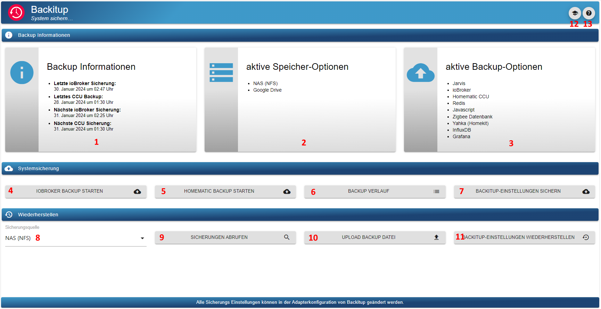
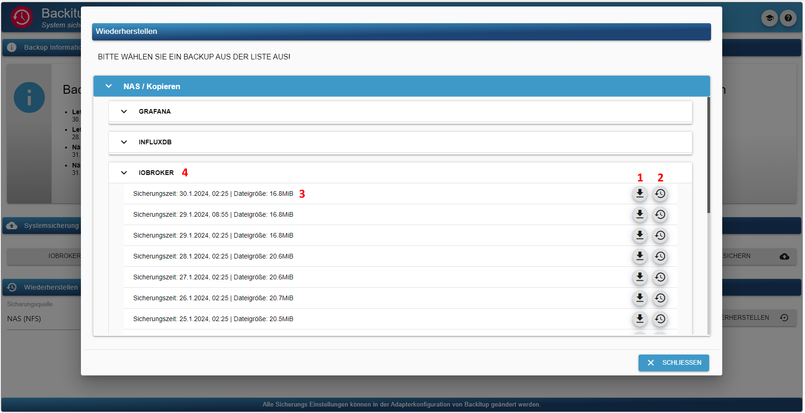

# Документация и инструкции для ioBroker.backitup


**************************************************************************************************************

## Поддержка разработки адаптера
**Если вам нравится `ioBroker.backitup`, пожалуйста, рассмотрите возможность пожертвования:**

[](https://paypal.me/mk1676)

**************************************************************************************************************

## Отказ от ответственности
**`ioBroker.backitup` — это резервный плагин только для программного обеспечения умного дома ioBroker.**

**Он не связан и не поддерживается [Nero BackItUp](https://www.nero.com/deu/products/nero-backitup/?vlang=de) (инструментом для резервного копирования данных в системах Windows).**

**************************************************************************************************************

## Основы
`ioBroker.backitup` — это решение для резервного копирования, которое обеспечивает циклическое резервное копирование установки ioBroker и Homematic CCU.

Адаптер является многоплатформенным и может использоваться в установках Windows и Mac, а также в установках Linux.

Кроме того, можно создавать резервные копии различных дополнительных резервных копий, таких как базы данных SQL, базы данных Influx, а также некоторые настройки адаптеров и устройств.

`ioBroker.backitup` работает очень тесно с js-controller и создает резервную копию ioBroker, идентичную команде CLI `iobroker backup`.

Здесь, как и при стандартном резервном копировании js-контроллера, создаются резервные копии всех состояний и объектов, а также пользовательских файлов, таких как VIS.

Восстановление также полностью идентично CLI-команде `iobroker restore <backupname>` js-controller.

Восстановление восстанавливает все состояния, объекты и пользовательские данные из `ioBroker.backitup`.
После восстановления ваш iobroker перезапускается, и с этого момента js-controller берёт на себя установку всех отсутствующих адаптеров.

`ioBroker.backitup` не влияет на восстановление после запуска iobroker. Всё это происходит в фоновом режиме и обрабатывается контроллером JS на основе восстановленной информации в состояниях и объектах.

В отличие от команды CLI, команда `ioBroker.backitup` также может восстанавливать различные дополнительные резервные копии.
Через CLI это невозможно.

_[Вернуться наверх](#dokumentation-und-anleitung-für-iobrokerbackitup)_

---

## Зависимости
* Для монтирования CIFS необходимо установить cifs-utils.
- `sudo apt install cifs-utils`

* Для монтирования NFS требуется установка nfs-common.
- `sudo apt install nfs-common`

* Чтобы использовать резервное копирование MySql-систем, в системе должен быть установлен mysqldump.
- `sudo apt install mysql-client` или в Debian `sudo apt install default-mysql-client`

* Чтобы использовать резервное копирование MySql систем MariaDB, в системе должен быть установлен mysqldump.
- `sudo apt install mariadb-client`

* Чтобы использовать резервную копию Sqlite3, в системе должен быть установлен sqlite3.
- `sudo apt install sqlite3`

* Для использования резервной копии PostgreSQL в системе должен быть установлен mysqldump
- [Руководство по установке PostgreSQL](https://www.postgresql.org/download/linux/debian/)

* Для использования резервного копирования InfluxDB необходимо установить influxd.
- [Руководство по установке InfluxDB 1.x](https://docs.influxdata.com/influxdb/v1.8/introduction/install/)
- [Руководство по установке InfluxDB 2.x](https://docs.influxdata.com/influxdb/v2.1/install/)
- [Руководство по установке Influx CLI для 2.x](https://docs.influxdata.com/influxdb/v2.1/tools/influx-cli/?t=Linux)

_[Вернуться наверх](#dokumentation-und-anleitung-für-iobrokerbackitup)_

---

## Использование и эксплуатация
`ioBroker.backitup` можно настроить в экземплярах адаптера. Там доступны все перечисленные ниже параметры.

Для ежедневной работы и эксплуатации `ioBroker.backitup` доступна вкладка на вкладке Администрирование.

Если эта вкладка активна в меню вкладок интерфейса администратора, `ioBroker.backitup` можно управлять непосредственно через вкладку на левой панели вкладок ioBroker.

Там доступна информация о созданных резервных копиях, можно создавать резервные копии и можно восстанавливать их.



Вот краткое объяснение опций в меню вкладок.

| № | Описание |
|-----|---------------------------------------------------------------------------------------------------------------------------------------------------------------------------------------------------------------------|
| 1. | Информация о последнем и следующем резервном копировании. |
| 2. | Информация о месте хранения резервных копий. |
| 3. | Информация о том, какие типы резервного копирования активны и какие резервные копии создаются. |
| 4. | Запустите резервное копирование iobroker вручную. |
| 5. | Запустите резервное копирование Homematic вручную. |
| 6. | Открывает новое окно и отображает все резервные копии из истории. |
| 7. | Эта кнопка позволяет сохранить настройки `ioBroker.backitup`. Это полезный инструмент при смене системы. Настройки выводятся в формате JSON. |
| 8. | В этом параметре вы выбираете хранилище, из которого следует выполнить восстановление. |
| 9. | При нажатии кнопки «Извлечь резервные копии» открывается новое окно со списком всех существующих резервных копий в выбранном хранилище. |
| 11. | Эта кнопка восстанавливает сохранённые настройки `ioBroker.backitup` в адаптере. Это не восстановление ioBroker, и сюда можно загружать только файлы в формате JSON! |
| 12. | Открывает новую вкладку и отображает документацию для `ioBroker.backitup`. |
| 13. | Открывает новую вкладку и отображает файл readme для `ioBroker.backitup`. |
| 13. | Открывает новую вкладку и отображает файл readme для `ioBroker.backitup`. |



Работа вкладки «Восстановление» происходит следующим образом.

| № | Описание |
|-----|------------------------------------------------|
| 1. | Загрузите выбранную резервную копию на свой ПК. |
| 2. | Начать восстановление выбранной резервной копии. |
| 3. | Резервная информация. |
| 4. | Информация о типе резервного копирования. |


_[Вернуться наверх](#dokumentation-und-anleitung-für-iobrokerbackitup)_

---

## Типы резервного копирования
`ioBroker.backitup` предлагает широкий спектр возможностей для выполнения различных типов резервного копирования циклически или по нажатию кнопки. По умолчанию каждая резервная копия сохраняется в каталоге /opt/iobroker/backups. При желании можно настроить загрузку по FTP или использовать монтирование CIFS/NFS.

### Резервное копирование ioBroker
Это резервное копирование похоже на резервное копирование, входящее в состав ioBroker, которое можно запустить в консоли командой `iobroker backup`. Однако здесь оно выполняется с использованием настроек, указанных в конфигурации адаптера или виджета OneClick Backup, без использования консоли.

### Резервное копирование CCU (Homematic)
Это резервное копирование позволяет создать резервные копии трёх различных версий установки Homematic (CCU Original / pivCCU / RaspberryMatic). Резервное копирование также можно выполнить с использованием настроек, заданных в конфигурации адаптера, или виджета OneClick Backup.

Если вы хотите создать резервную копию более одного CCU, вы можете активировать опцию «Резервное копирование нескольких систем», а затем определить ваши центральные блоки Homematic в таблице.

> [!ВАЖНО] > Резервное копирование CCU может быть выполнено только пользователем CCU `Admin`!

### Резервное копирование MySQL
Эта отдельно настраиваемая резервная копия, если она включена, создаётся вместе с каждой резервной копией ioBroker и удаляется по истечении указанного срока хранения. FTP или CIFS также подходят для этой резервной копии, если они настроены для других типов резервного копирования ioBroker.

Важно отметить, что даже если сервер MySQL работает на удалённой системе, mysqldump должен быть запущен в системе ioBroker.
Для систем Linux команда установки будет выглядеть так: `sudo apt install mysql-client`, для Debian — `sudo apt install default-mysql-client`, а для систем MariaDB — `sudo apt install mariadb-client`.

Если вы хотите создать резервную копию более одной базы данных, вы можете активировать опцию «Резервное копирование нескольких систем», а затем определить ваши базы данных в таблице.

### Резервное копирование SQLite3
Эта отдельно настраиваемая резервная копия, если она включена, создаётся вместе с каждой резервной копией ioBroker и удаляется по истечении указанного срока хранения. FTP или CIFS также подходят для этой резервной копии, если они настроены для других типов резервного копирования ioBroker.

На хост-системе должен быть установлен Sqlite3 (`sudo apt install sqlite3`).

### Резервное копирование Redis
Эта отдельно настраиваемая резервная копия, если она включена, создаётся вместе с каждой резервной копией ioBroker и удаляется по истечении указанного срока хранения. FTP или CIFS также подходят для этой резервной копии, если они настроены для других типов резервного копирования ioBroker.

Чтобы использовать Redis с `ioBroker.backitup`, необходимо настроить права пользователя iobroker:

```
sudo usermod -a -G redis iobroker
sudo reboot
```

Для удаленного резервного копирования требуется redis-cli на локальной системе ioBroker.

`sudo apt install redis-tools`

Здесь вам необходимо указать ваш хост и порт удаленного сервера Redis, а также данные для входа в вашу систему.

Это важная функция, особенно для пользователей Docker.

Обратите внимание, что восстановление Redis для удалённых систем невозможно через графический интерфейс `ioBroker.backitup`, поскольку Redis его не поддерживает.
В этом случае файл dump.rdb, содержащийся в архиве tar.gz, необходимо восстановить вручную, распаковав архив резервной копии и скопировав файл в каталог Redis, а также настроив права доступа для файла dump.rdb.

Вот пример:

```
sudo tar -xvzf <Backupdatei>.tar.gz /var/lib/redis/
sudo chown redis:redis /var/lib/redis/dump.rdb
redis-cli shutdown nosave
```

### Резервное копирование исторических данных
Эта отдельно настраиваемая резервная копия, если она включена, создаётся вместе с каждой резервной копией ioBroker и удаляется по истечении указанного срока хранения. FTP или CIFS также подходят для этой резервной копии, если они настроены для других типов резервного копирования ioBroker.

### Резервное копирование InfluxDB
Эта отдельно настраиваемая резервная копия, если она включена, создаётся вместе с каждой резервной копией ioBroker и удаляется по истечении указанного срока хранения. FTP или CIFS также подходят для этой резервной копии, если они настроены для других типов резервного копирования ioBroker.

**Требования для удаленного резервного копирования с помощью InfluxDB v1.x:**

Для удаленного резервного копирования в InfluxDB 1.x необходимы некоторые корректировки.

**Для выполнения резервного копирования InfluxDB необходимо установить InfluxDB в системе iobroker.**

**Неважно, управляется ли база данных локально или работает на другом сервере.**

Если необходимо выполнить резервное копирование InfluxDB с удаленного сервера, необходимо настроить удаленные разрешения для службы RPC в файле influxdb.conf на удаленном сервере.

```
bind-address = "<InfluxDB-IP>:8088"
```

или

```
bind-address = "0.0.0.0:8088"
```

**После внесения изменений в конфигурацию необходимо перезапустить службу InfluxDB.**

Дополнительную информацию о резервном копировании данных InfluxDB можно найти в [здесь](https://docs.influxdata.com/influxdb/v1.8/administration/backup_and_restore/#online-backup-and-restore-for-influxdb-oss).

**Требования для резервного копирования с помощью InfluxDB v2.x:**

Для создания резервной копии InfluxDB 2.x в вашей системе должен быть установлен Influx-CLI.
Это необходимо как для локального, так и для удалённого резервного копирования.

Для удалённого резервного копирования необходимо установить Influx-CLI в системе, где запущен ваш ioBroker.
Установка не требуется в удалённой системе, где запущена ваша база данных для резервного копирования.

Здесь вы можете найти официальные инструкции по установке Influx-CLI на вашу систему.

[Инструкция по установке Influx-CLI для 2.x](https://docs.influxdata.com/influxdb/v2.1/tools/influx-cli/?t=Linux)

Если вы хотите создать резервную копию более одной базы данных, вы можете активировать опцию «Резервное копирование нескольких систем», а затем определить ваши базы данных в таблице.

> [!ВАЖНО] > Для создания и восстановления резервной копии InfluxDB2 требуется токен оператора!

### Резервное копирование PostgreSQL
Эта отдельно настраиваемая резервная копия, если она включена, создаётся вместе с каждой резервной копией ioBroker и удаляется по истечении указанного срока хранения. FTP или CIFS также подходят для этой резервной копии, если они настроены для других типов резервного копирования ioBroker.

Важно отметить, что даже если сервер PostgreSQL работает на удалённой системе, PostgreSQL должен быть запущен в системе ioBroker.
Инструкции по установке для систем Linux см. в разделе [здесь](https://www.postgresql.org/download/linux/debian/).

Если вы хотите создать резервную копию более одной базы данных, вы можете активировать опцию «Резервное копирование нескольких систем», а затем определить ваши базы данных в таблице.

### Резервное копирование Javascript
Эта отдельно настраиваемая резервная копия, если она включена, создаётся вместе с каждой резервной копией ioBroker и удаляется по истечении указанного срока хранения. FTP или CIFS также подходят для этой резервной копии, если они настроены для других типов резервного копирования ioBroker.

Начиная с версии 2.2.0 `ioBroker.backitup`, резервное копирование скриптов выполняется непосредственно из объектов. Резервные копии JavaScript из более старых версий `ioBroker.backitup` несовместимы для восстановления!

Чтобы иметь возможность выполнять резервное копирование JavaScript с версиями `ioBroker.backitup` < 2.2.0, в конфигурации адаптера JavaScript должны быть заранее определены пункты меню «Зеркальное копирование скриптов в путь к файлу» и «Экземпляр, выполняющий зеркалирование».

Затем `ioBroker.backitup` может применить настройки в меню конфигурации.

### Резервное копирование Джарвиса
Эта отдельно настраиваемая резервная копия, если она включена, создаётся вместе с каждой резервной копией ioBroker и удаляется по истечении указанного срока хранения. FTP или CIFS также подходят для этой резервной копии, если они настроены для других типов резервного копирования ioBroker.

### Резервное копирование ZigBee
Эта отдельно настраиваемая резервная копия, если она включена, создаётся вместе с каждой резервной копией ioBroker и удаляется по истечении указанного срока хранения. FTP или CIFS также подходят для этой резервной копии, если они настроены для других типов резервного копирования ioBroker.

### Резервное копирование Zigbee2MQTT
Эта отдельно настраиваемая резервная копия, если она включена, создаётся вместе с каждой резервной копией ioBroker и удаляется по истечении указанного срока хранения. FTP или CIFS также подходят для этой резервной копии, если они настроены для других типов резервного копирования ioBroker.

#### Локальное резервное копирование Zigbee2MQTT
Путь в адаптере `ioBroker.backitup` всегда должен указывать непосредственно на путь к данным zigbee2mqtt.
Пример: `/opt/zigbee2mqtt/data` или непосредственно на том в Docker-инсталляции zigbee2mqtt.

Также важно, чтобы пользователю «iobroker» были предоставлены права на папку с данными, чтобы он мог читать и записывать файлы.

Права группы можно установить следующим образом:

```
sudo usermod -a -G <zigbee2mqtt User> iobroker
sudo reboot
```

#### Удаленное резервное копирование Zigbee2MQTT
Можно создать резервную копию Zigbee2MQTT, расположенную в другой системе.

Для этого необходимо настроить IP-адрес MQTT-сервера (а не IP-адрес Zigbee2MQTT) Zigbee2MQTT в Backitup, порт MQTT и базовую тему Zigbee2MQTT.

Если на сервере MQTT активна аутентификация, также потребуются имя пользователя и пароль.

> [!ВАЖНО] > Удалённое резервное копирование восстанавливается напрямую через Zigbee2MQTT, а не через Backitup.

### Резервное копирование Node-Red
Эта отдельно настраиваемая резервная копия, если она включена, создаётся вместе с каждой резервной копией ioBroker и удаляется по истечении указанного срока хранения. FTP или CIFS также подходят для этой резервной копии, если они настроены для других типов резервного копирования ioBroker.

### Резервное копирование Grafana
Эта отдельно настраиваемая резервная копия, если она включена, создаётся вместе с каждой резервной копией ioBroker и удаляется по истечении указанного срока хранения. FTP или CIFS также подходят для этой резервной копии, если они настроены для других типов резервного копирования ioBroker.

> [!ВАЖНО] > Для создания резервной копии Grafana необходимо сгенерировать ключ API или токен сервиса в веб-интерфейсе Grafana, чтобы получить доступ к панелям мониторинга и источникам данных.

До версии Grafana 8.x ключ API можно создать в разделе ***«Конфигурация → Ключи API или токены сервисов»***, для этого необходимы полные права администратора.

Начиная с версии 9.0, учётная запись службы сначала создаётся в разделе ***«Конфигурация → Администрирование → Пользователи и доступ → Учётные записи служб»***. После создания учётной записи токен можно добавить, выбрав ***«Добавить токен учётной записи службы»***.

### Яка резервное копирование
Эта отдельно настраиваемая резервная копия, если она включена, создаётся вместе с каждой резервной копией ioBroker и удаляется по истечении указанного срока хранения. FTP или CIFS также подходят для этой резервной копии, если они настроены для других типов резервного копирования ioBroker.

Все настройки системы Homekit и устройства резервируются.

_[Вернуться наверх](#dokumentation-und-anleitung-für-iobrokerbackitup)_

---

## Варианты хранения
### Местный
Расположение резервных копий по умолчанию в ioBroker — `/opt/iobroker/backups`.
Это предопределено системой и не может быть изменено.
Если ни одно из перечисленных ниже подключений CIFS или NFS неактивно, все резервные копии сохраняются по пути по умолчанию и хранятся локально в хост-системе.

Дополнительные варианты хранения, такие как облако или FTP, просто создают копию резервной копии в выбранном месте за пределами хост-системы.

### CIFS
Монтирование CIFS не представляет проблем в Linux.

Следует отметить, что cifs-utils установлен.

Путь должен выглядеть следующим образом (например, "/sharename/path")

При желании вы можете включить/отключить удаление резервных копий с NAS.

### НФС
Монтирование NFS не представляет проблем в Linux.

Следует отметить, что установлен nfs-common.

Путь должен выглядеть следующим образом (например: "/sharename/path").

При желании вы можете включить/отключить удаление резервных копий с NAS.

### FTP
FTP доступен во всех операционных системах и служит альтернативой монтированию CIFS.

Указание пути по FTP всегда должно начинаться с «/» (например, «/path specification»).

При желании вы можете включить/отключить удаление резервных копий с NAS.

### Копировать
Если монтирование CIFS невозможно, есть другой вариант — использование функции копирования.

Здесь необходимо ввести путь, куда следует скопировать данные в настройках CIFS.

Для функции копирования IP-адрес необходимо оставить пустым.

### Экспертное крепление
В разделе «Эксперт» вы можете создать собственную команду монтирования, которую адаптер затем будет использовать для резервного копирования и восстановления.
Здесь вы можете работать индивидуально и, например, интегрировать fstab или учётные данные.

> [!ВНИМАНИЕ] > Обратите внимание, что эта опция предназначена только для экспертов.

### Дропбокс
Чтобы использовать резервную копию Dropbox, вам необходимо получить токен доступа. Это можно сделать на странице настроек `ioBroker.backitup`.

ioBroker получает доступ только к определенным областям; токены или пользовательские данные в облаке не хранятся.

Если вы хотите создать собственное приложение Dropbox API, вы можете выбрать это в настройках `ioBroker.backitup`, а затем выполнить следующие шаги.

> Примечание: пользовательские приложения используют только токен «short_live», который действителен в течение 4 часов. Мы рекомендуем использовать стандартное приложение iobroker.

Чтобы использовать резервную копию в Dropbox, необходимо создать токен доступа и приложение по адресу https://www.dropbox.com/developers/apps:

* Шаг 1: Используйте кнопку «Создать приложение»
* Шаг 2: Выберите «Ограниченный доступ»
* Шаг 3: Выберите «Папка приложения»
* Шаг 4: Введите «Назовите свое приложение» и нажмите кнопку «Создать приложение».
* Шаг 5: На вкладке «Разрешения» отметьте все 4 флажка в разделе «Файлы и папки».
* Шаг 6: На вкладке «Настройки» установите для параметра «Срок действия токена доступа» значение «Без срока действия».
* Шаг 7: Нажмите кнопку «Сгенерировать токен доступа» (сгенерированный токен будет введен в настройки `ioBroker.backitup`)

Теперь в вашем Dropbox появилась новая папка под названием «Apps».

### Google Диск
Чтобы использовать резервное копирование на Google Диске, вам необходимо получить токен доступа. Это можно сделать на странице настроек.

ioBroker имеет доступ только к определённым областям. Код для oAuth можно найти в [здесь](https://github.com/simatec/ioBroker.backitup/blob/master/docs/oAuthService.js).

Никакие токены или данные пользователей не хранятся в облаке.

### Onedrive
Чтобы использовать резервную копию OneDrive, вам необходимо получить токен доступа. Это можно сделать на странице настроек `ioBroker.backitup`.

ioBroker получает доступ только к определенным областям; токены или пользовательские данные в облаке не хранятся.

### WebDAV
С помощью WebDAV `ioBroker.backitup` предоставляет возможность доступа к нескольким облачным системам, самой популярной из которых является NextCloud.
Для установки соединения WebDAV требуются имя пользователя и пароль облачной учётной записи.

Подключение к облаку осуществляется через зашифрованное соединение.

Для установления соединения имя хоста облака должно соответствовать всем сертификатам безопасности.

> Пример URL: «https://example.com/remote.php/dav/files/username/»

Подключение с локальным IP-адресом возможно только в том случае, если отключена опция «Разрешить только подписанные сертификаты».

_[Вернуться наверх](#dokumentation-und-anleitung-für-iobrokerbackitup)_

---

## Удалить старые резервные копии
`ioBroker.backitup` может автоматически удалять старые резервные копии. Количество сохраняемых резервных копий можно указать в конфигурации `ioBroker.backitup`.
Старые резервные копии удаляются только в том случае, если адаптер выполняет автоматическое запланированное резервное копирование.

> [!ПРИМЕЧАНИЕ] > Резервное копирование вручную не удаляет старые файлы резервных копий.

> [!ВАЖНО] > Если во время процесса резервного копирования возникнет ошибка, старые резервные копии не будут удалены из соображений безопасности.

Информация о том, какие резервные копии были удалены, а также возможные ошибки удаления выводятся в журнале отладки.

_[Вернуться наверх](#dokumentation-und-anleitung-für-iobrokerbackitup)_

---

## Поддержка нескольких хостов
Мультихост для `ioBroker.backitup` может работать с несколькими экземплярами `ioBroker.backitup` на разных хостах.

Для его поддержки один экземпляр `ioBroker.backitup` должен быть настроен как ведущий. Все остальные экземпляры, расположенные на удалённых хостах, настраиваются как ведомые.

Главный сервер управляет автоматическим резервным копированием. Все подчинённые серверы можно выбрать через меню главного сервера.

Для подчиненных экземпляров можно включить следующие параметры резервного копирования:

* Редис
* Зигби
* Джарвис
* История
* InfluxDB
* MySQL
* SQLite3
* PostgreSQL
* Графана
* Яка
* Узел-Красный
* Zigbee2MQTT

Поскольку автоматическое резервное копирование на подчиненном экземпляре контролируется главным, резервное копирование iobroker, резервное копирование JavaScript и резервное копирование CCU не могут быть выбраны.

Место хранения отдельных резервных копий можно свободно настроить на каждом ведомом сервере. Это позволяет каждому ведомому серверу создать собственную систему хранения файлов независимо от ведущего сервера.

В системах с ограниченным объемом оперативной памяти главный компьютер `ioBroker.backitup` может автоматически запускать и затем останавливать подчиненные экземпляры для процесса резервного копирования.

Эту опцию можно настраивать в меню.

_[Вернуться наверх](#dokumentation-und-anleitung-für-iobrokerbackitup)_

---

## Поддержка Docker
Поскольку в Docker-контейнере не должно быть установлено ни одной системы баз данных, резервное копирование всех баз данных не поддерживается и недоступно по умолчанию для обнаруженного Docker-контейнера. Чтобы сохранить возможность резервного копирования внешних баз данных, необходимо настроить две переменные среды контейнера:

* IOB_BACKITUP_EXTDB=true
* ПАКЕТЫ

Содержимое переменной среды «PACKAGES» определяется пакетами, которые необходимо установить для доступа к соответствующей базе данных. Например, «mysql-client» или «redis-tools». Подробнее см. в разделе [здесь](https://docs.buanet.de/iobroker-docker-image/docs_backitup/).

Чтобы полностью использовать `ioBroker.backitup` в Docker, некоторые порты все еще необходимо отобразить.

* Порт 8091 - Восстановление веб-интерфейса
* Порт 9081 - Файловый сервер для загрузки резервных копий через веб-интерфейс `ioBroker.backitup`
* Порт 9082 - Файловый сервер для загрузки резервных копий через веб-интерфейс `ioBroker.backitup`

_[Вернуться наверх](#dokumentation-und-anleitung-für-iobrokerbackitup)_

---

## Использование
1. Адаптер создает некоторые точки данных для использования в Vis.

* oneClick.ccu -> служит триггером для резервного копирования CCU (можно установить значение true в Vis с помощью кнопки)
* oneClick.iobroker -> служит триггером для стандартного резервного копирования (можно установить значение true в Vis с помощью кнопки)

* history.html -> служит журналом истории, который можно настраивать в Vis через CCS.
* history.json -> служит журналом истории, который можно настраивать в Vis через CCS.
* history.ccuLastTime -> сохраняет дату и время создания последней резервной копии CCU
* history.minimalLastTime -> хранит дату и время создания последней стандартной резервной копии
* history.ccuSuccess -> показывает состояние «true», если резервное копирование прошло успешно
* history.minimalSuccess -> показывает состояние «true», если резервное копирование прошло успешно
* history.iobrokerLastTime -> показывает последнюю резервную копию ioBroker
* history.ccuLastTime -> показывает последнюю резервную копию CCU
* info.ccuNextTime -> показывает следующее время выполнения резервной копии CCU
* info.iobrokerNextTime -> показывает следующее время выполнения резервной копии ioBroker
* info.latestBackup -> показывает последнюю резервную копию, определенную при запуске, в формате json

2. Просмотр журнала истории резервного копирования в Vis
- Журнал истории резервного копирования показывает последние x резервных копий.
- Количество отображаемых записей истории можно задать в дополнительных настройках.
- Можно отобразить журнал истории, например, в HTML-виджете, введя следующую строку в HTML:

```
{backitup.0.history.html}
```

Синтаксис: {BackitupInstanz.history.html}

3. Форматирование журнала истории в CCS:

```
   .html{
       display:block;
       width:100%;
   /*    overflow-y:scroll; */
   }
   .backup-type-iobroker
       {
           float:left;
           color:white;
           font-size:20px;
       }
   .backup-type-ccu
       {
           float:left;
           color:red;
           font-size:20px;
    }
   ```

4. Кнопка OneClick с текстом статуса
– Когда точка данных OneClick установлена в значение «истина», запускается соответствующее резервное копирование, и по истечении заданного времени эта точка данных возвращается в значение «ложь». Это позволяет создать кнопку со статусом. Для этого адаптируйте следующую строку и введите её в качестве текста кнопки в Vis:

```
{wert: backitup.0.oneClick.iobroker; wert === "true" || wert === true ? "Minimal Backup </br> wird erstellt" : "Minimal Backup </br> starten"}
```

Синтаксис: {value: <BackupInstance>.oneClick.<Trigger>; value === "true" || value === true ? "Текст во время создания резервной копии" : "Текст по умолчанию"}

_[Вернуться наверх](#dokumentation-und-anleitung-für-iobrokerbackitup)_

---

## Уведомления
`ioBroker.backitup` поддерживает следующие мессенджеры для уведомлений после успешного резервного копирования.
Для их использования необходимо установить и настроить соответствующие адаптеры.

* Телеграмма
* Пустячок
* Электронная почта
* WhatsApp
* Сигнал
* Матрица
* Дискорд

_[Вернуться наверх](#dokumentation-und-anleitung-für-iobrokerbackitup)_

---

## Восстановить
С помощью `ioBroker.backitup` можно восстановить все созданные типы резервных копий через меню конфигурации в ioBroker.

`ioBroker.backitup` работает в тесном контакте с js-controller и создает резервную копию iobroker, идентичную команде CLI «iobroker backup».

Здесь, как и при стандартном резервном копировании js-контроллера, создаются резервные копии всех состояний и объектов, а также пользовательских файлов, таких как VIS.

Восстановление также полностью идентично CLI-команде js-controller.

Во время восстановления восстанавливаются все состояния, объекты и пользовательские данные из `ioBroker.backitup`.


После восстановления ваш ioBroker перезапустится, и с этого момента js-controller возьмет на себя установку отсутствующих адаптеров.


`ioBroker.backitup` не влияет на восстановление после запуска iobroker. Контроллер JS выполняет это в фоновом режиме, основываясь на восстановленной информации в состояниях и объектах.

Восстановление можно выполнить со всех носителей информации.

> [!NOTE] > В общем случае самый безопасный способ — выполнить восстановление локально.

Если вы выберете наиболее безопасный вариант и захотите выполнить восстановление локально, необходимо сохранить файл резервной копии в папке резервных копий ioBroker.
В системах Linux эта папка находится по следующему пути: `/opt/iobroker/backups`

Для типов резервного копирования «ioBroker» и «redis» ioBroker останавливается во время восстановления, а затем автоматически перезапускается.

**Для всех остальных типов резервного копирования ioBroker не останавливается. В этом случае временно останавливаются только затронутые адаптеры.**

Если вы предпочитаете восстанавливать резервные копии вручную, выполните следующие действия:

***Восстановление резервной копии ioBroker:***

- Резервная копия должна располагаться в каталоге `opt/iobroker/backups`, как обычно.
- Его можно восстановить через консоль с помощью команды: `iobroker restore <имя файла резервной копии>`.
- После восстановления необходимо выполнить `iobroker upload all`

Подробные инструкции по восстановлению с помощью `ioBroker.backitup`, а также по ручному восстановлению можно найти в [здесь](https://github.com/simatec/ioBroker.backitup/wiki/%5BHowTo%5D-Restore-auf-Linux-Distributionen).

**Резервную копию CCU по-прежнему необходимо восстанавливать через веб-интерфейс CCU.**

***Восстановление резервной копии Raspberrymatic/CCU:***

- Скопируйте файл *.sbk через SCP в каталог «/usr/local/tmp directory» на Raspberrymatic
- Войдите в Raspberrymatic как пользователь root через консоль.
- Выполните команду: «/bin/restoreBackup.sh /user/local/tmp/YourBackupFilename» на Raspberrymatic.
- Выполните команду «reboot» на Raspberrymatic, чтобы перезапустить PI.
- Конечно, резервную копию можно также восстановить обычным способом через веб-интерфейс.

### Восстановление базы данных InfluxDB
При восстановлении резервной копии InfluxDB обратите внимание, что адаптер InfluxDB должен быть предварительно остановлен, а база данных не должна существовать.

> [!NOTE] > Если база данных существует, ее необходимо удалить перед восстановлением.

Адаптер InfluxDB нельзя перезапускать до окончания восстановления, так как он всегда будет пытаться создать базу данных.

Кроме того, для восстановления базы данных InfluxDB 2.x токен оператора должен быть настроен в меню ioBroker.backitup перед восстановлением.

> [!NOTE] > Без правильного токена оператора восстановление невозможно.

_[Вернуться наверх](#dokumentation-und-anleitung-für-iobrokerbackitup)_

---

## Поиск неисправностей
Для регистрации ошибок необходимо установить уровень регистрации `ioBroker.backitup` на вкладке «Экземпляры» ioBroker «Отладка».

_[Вернуться наверх](#dokumentation-und-anleitung-für-iobrokerbackitup)_

---

## Обнаруженные ошибки / решения
Ниже приведен список проблем, возникших на данный момент, и их решения (если таковые имеются).

1. У Олифалла (с форума) возникла проблема: после восстановления веб-интерфейс ioBroker стал недоступен. Он смог решить эту проблему, выполнив следующие действия через консоль:
- статус sudo iobroker
- Сообщение = «Нет соединения с состояниями 127.0.0.0:6379[redis]»
- sudo apt install redis server

2. Если монтирование CIFS с IP-адресом невозможно, следует использовать имя хоста NAS.
3. Пользователи обнаружили, что если для монтирования CIFS используется пароль со специальными символами, то в конфигурации пароль необходимо хранить в кавычках.
4. По словам некоторых пользователей, монтирование CIFS не поддерживает очень длинные пароли. Если монтирование не удалось, немного укоротите пароль (мне хватает 12 символов).
5. Если адаптер не устанавливается, проверьте версии Node и NodeJS. Адаптер не поддерживает версии ниже Node 8.
6. Если ваша система ioBroker была установлена с помощью нового скрипта установщика, может случиться, что у вас нет всех прав для нового пользователя iobroker.

К сожалению, это также влияет на backitup, поскольку backitup использует некоторые системные команды.

Для решения проблемы с отсутствием разрешений существует исправление для скрипта установщика ioBroker.
Выполните следующие команды в консоли вашей среды ioBroker:

```
iobroker stop
iobroker fix
sudo reboot
```

7. Если при создании базы данных Redis вы получили сообщение об ошибке, проверьте, имеет ли ваш пользователь iobroker необходимые права и входит ли он в группу пользователей Redis.

Если это не так, вы можете исправить это с помощью следующей команды в консоли.

```
sudo usermod -a -G redis iobroker
sudo reboot
```

Если вы не настроили установку ioBroker с помощью скрипта установщика и у вашего пользователя другое имя, замените «iobroker» на ваше имя пользователя в команде.

8. Если Fritzbox используется в качестве NAS с прошивкой >= 7.21, настройки SMB в `ioBroker.backitup` должны быть установлены на «3.1.1» и должна быть включена опция «noserverino».

_[Вернуться наверх](#dokumentation-und-anleitung-für-iobrokerbackitup)_

---

## Changelog
### **WORK IN PROGRESS**
* (simatec) dependencies updated

### 3.3.6 (2025-08-31)
* (simatec) dependencies updated

### 3.3.5 (2025-07-05)
* (simatec) Fix Dropbox Token Check
* (simatec) dependencies updated

### 3.3.4 (2025-06-26)
* (simatec) Fix Grafana Backup & Restore

### 3.3.3 (2025-06-24)
* (simatec) Translation updated
* (simatec) Fix Grafana Backup & Restore
* (simatec) Docu updated
* (simatec) dependencies updated

### 3.3.2 (2025-06-19)
* (simatec) Base Topic for z2m Remote Backup added

### 3.3.1 (2025-06-18)
* (simatec) Fix z2m Remote Backup

### 3.3.0 (2025-06-15)
* (simatec) local onedrive api added
* (simatec) dependencies updated
* (simatec) z2m Remote Backup added
* (simatec) Fix Zigbee Backup

### 3.2.2 (2025-05-16)
* (simatec) Grafana Folder added to Restore
* (simatec) Grafanfa Folder uid added
* (simatec) dependencies updated
* (simatec) Fix Mail Subject on Error

### 3.2.1 (2025-04-25)
* (simatec) Fix Onedrive download
* (simatec) Fix Onedrive Restore

### 3.2.0 (2025-04-04)
* (Bluefox/DileSoft) json custom typescript added
* (Bluefox/simatec) Dropbox OAuth updated
* (simatec) Fix Webdav Certificates
* (simatec) Dependencies updated

### 3.1.0 (2025-03-02)
* (Bluefox) Dependencies updated
* (Bluefox) Vite added
* (simatec) jsonConfig updated
* (simatec) Fix month for history

### 3.0.37 (2025-02-28)
* (simatec) Fix CronJob

### 3.0.36 (2025-02-26)
* (simatec) Fix src-admin

### 3.0.35 (2025-02-26)
* (simatec) Fix src-admin

### 3.0.34 (2025-02-26)
* (simatec) Fix src-admin

### 3.0.33 (2025-02-25)
* (simatec) Fix cronjob
* (simatec) Fix Backup Console

### 3.0.32 (2025-02-24)
* (simatec) Error handling for GoogleDrive fix
* (simatec) globalDependencies updated
* (simatec) Dependencies updated
* (simatec) Design Fix

### 3.0.31 (2024-11-30)
* (simatec) Fix Tab Menu

### 3.0.30 (2024-11-29)
* (simatec) Fix Tab Menu

### 3.0.29 (2024-11-29)
* (simatec) Fix Tab Menu

### 3.0.28 (2024-11-27)
* (simatec) Dependencies updated
* (simatec) eslint-config added
* (bluefox) Allow to store files for up to ca 3 years
* (Marc-Berg) Grafana Docu updated

### 3.0.27 (2024-11-12)
* (simatec) dependencies updated
* (simatec) Design Fix

### 3.0.26 (2024-10-16)
* (simatec) Fix FTP Connections
* (simatec) dependencies updated
* (simatec) Issue Workflow added

### 3.0.25 (2024-09-26)
* (bluefox) Improvement of Google Drive authentication workflow
* (bluefox) Removed gulp from a build process
* (simatec) small Design Fix
* (simatec) Fix for Admin 7.1.5
* (simatec) Fix Test & Release
* (simatec) Fix ESlint errors

### 3.0.22 (2024-09-03)
* (simatec) Fix Notification Instance
* (simatec) Fix Notification Design
* (simatec) Fix Default Settings

### 3.0.21 (2024-09-01)
* (simatec) Fix Onedrive Notification
* (simatec) Fix Zigbee2MQTT Backup
* (simatec) dependencies updated

### 3.0.20 (2024-08-22)
* (simatec) Responsive Design for Tab added
* (simatec) Responsive Design for jsonConfig added
* (simatec) dependencies updated

### 3.0.19 (2024-08-15)
* (simatec) Fix CCU Backup
* (simatec) Fix InfluxDB Backup Config
* (simatec) Fix Backup-Log for Slave Instanz

### 3.0.18 (2024-08-14)
* (simatec) Package optimisation
* (simatec) Fix the warning when opening the configuration
* (simatec) dependencies updated

### 3.0.17 (2024-08-12)
* (simatec) Fix io-package for Release
* (simatec) manual-review added
* (simatec) Fix Slave Backup
* (simatec) dependencies updated

### 3.0.16 (2024-08-05)
* (bluefox) dependencies updated
* (simatec) Rename json5 Files

### 3.0.15 (2024-08-03)
* (simatec) fix dependencies

### 3.0.14 (2024-08-02)
* (simatec) dependencies updated
* (simatec) Improved log outputs

### 3.0.12 (2024-08-01)
* (simatec) Backup Log for History added
* (simatec) Added separate selection for deleting FTP backups
* (simatec) Added separate selection for deleting Onedrive backups
* (simatec) Added separate selection for deleting Webdav backups
* (simatec) Added separate selection for deleting Dropbox backups
* (simatec) Added separate selection for deleting Googledrive backups
* (simatec) Improved log outputs
* (simatec) Source code cleaned up
* (simatec) dependencies updated

### 3.0.11 (2024-07-28)
* (simatec) Design Fix
* (simatec) dependencies updated

### 3.0.10 (2024-07-22)
* (simatec) Design Fix for Dark Mode
* (bluefox) dependencies updated

### 3.0.9 (2024-07-11)
* (simatec) Tab Icons added
* (simatec) small fix
* (simatec) Docu updated

### 3.0.8 (2024-07-01)
* (Grothesk242/simatec) forceuid and forcegid added
* (simatec) dependencies updated
* (simatec) small fix

### 3.0.7 (2024-06-26)
* (simatec) Restore Information added
* (simatec) Fix Formaterrors
* (bluefox) Fixing the problems with styles
* (simatec) Fix iobroker Backup Error

### 3.0.6 (2024-06-26)
* (simatec) Restore Information added
* (simatec) Fix Formaterrors
* (bluefox) Fixing the problems with styles
* (simatec) Fix iobroker Backup Error

### 3.0.5 (2024-06-18)
* (simatec) Fix Build

### 3.0.4 (2024-06-18)
* (simatec) History Gui Fix
* (simatec) Tab GUI modified
* (bluefox) Added support for Admin 7
* (simatec) Onedrive ready for School/Business Accounts

### 3.0.3 (2024-06-10)
* (simatec) Fixed WebDav
* (simatec) Admin Notification for Backup errors added
* (simatec) Remove Sentry Config
* (simatec) Translations updated
* (simatec) Error handling optimized
* (simatec) dependencies updated

### 3.0.2 (2024-06-06)
* (simatec) Fixed Google Drive
* (simatec) Fixed Translations
* (simatec) Fixed Onedrive
* (simatec) Fixed MySql Backup
* (simatec) Fixed Translation added
* (simatec) Design Fix
* (simatec) new notifications content added

### 3.0.1 (2024-05-29)
* (simatec) Fixed umount callback
* (simatec) Fixed Backup Message
* (simatec) Translations updated
* (simatec) Fixed InfluxDB Multi Backup
* (simatec) Fixed Restore Console
* (simatec) Fixed Backup Console

### 3.0.0 (2024-05-28)
* (simatec) jsonConfig added
* (bluefox) Conversion to React
* (bluefox) Added react components
* (bluefox/simatec) Working on React GUI
* (simatec) dependencies updated
* (simatec) Fixed Yahka Backup
* (simatec) Fixed Nodered Backup
* (simatec) some bugs fixed
* (bluefox/simatec) New Restore-Interface
* (simatec) Translation updated

### 2.11.0 (2024-03-04)
* (simatec) Fixed Sqlite3 Path

### 2.10.11 (2024-02-14)
* (simatec) Design Fix
* (simatec) dependencies updated

### 2.10.10 (2024-02-04)
* (simatec) small Design Fix

### 2.10.9 (2024-02-01)
* (simatec) Fixed Translation

### 2.10.8 (2024-01-30)
* (simatec) Fixed Expert Mount
* (simatec) Docu updated
* (simatec) dependencies updated

### 2.10.7 (2024-01-29)
* (simatec) small fixes
* (simatec) small Design Fix
* (simatec) Translation updated
* (simatec) Expert Mount added

### 2.10.6 (2024-01-27)
* (simatec) Gulp deleted
* (simatec) adapter-dev added
* (simatec) Translation added
* (simatec) Customised design
* (simatec) Hover info added to the Restore tab
* (simatec) Improved mobile view
* (simatec) dependencies updated

### 2.10.5 (2024-01-22)
* (simatec) Fixed CCU Backup with selfsigned Certificates

### 2.10.4 (2024-01-21)
* (simatec) Fixed CCU Backup

### 2.10.3 (2024-01-19)
* (simatec) CCU backup switched from request to axios
* (simatec) Sentry fix

### 2.10.2 (2024-01-14)
* (simatec) Cronjob for Expert Settings added
* (simatec) Code restructured
* (simatec) Translation added

### 2.10.1 (2024-01-09)
* (simatec) small Fixes
* (simatec) Code restructured

### 2.10.0 (2024-01-06)
* (simatec) File server improved
* (simatec) Restore Tab improved
* (simatec) Design improved
* (simatec) Docu updated
* (simatec) Breaking Changes for Docker mapping ports

### 2.9.10 (2023-12-29)
* (simatec) Fixed node-red restore
* (simatec) auto install after restore for node-red added

### 2.9.9 (2023-12-29)
* (simatec) dependencies updated
* (simatec) Default storage path for history adapter added
* (simatec) Added check of the storage path from the History Adapter

### 2.9.8 (2023-12-14)
* (simatec) Sentry fix

### 2.9.7 (2023-12-12)
* (simatec) URL Update
* (simatec) Fixed redis Password

### 2.9.6 (2023-12-10)
* (simatec) Gotify Notication added
* (simatec) dependencies updated
* (simatec) Copypath check added

### 2.9.5 (2023-11-29)
* (simatec) dependencies updated
* (simatec) Fixed redis Password

### 2.9.4 (2023-11-20)
* (simatec) dependencies updated
* (simatec) Fixed CIFS Password
* (simatec) Fixed mySql Password
* (simatec) Fixed pgSql Password
* (simatec) Fixed redis Password

### 2.9.3 (2023-11-11)
* (simatec) Fixed Port for Filerserver
* (simatec) Docu updated

### 2.9.2 (2023-11-10)
* (simatec) dependencies updated
* (simatec) Design fix
* (simatec) Backup File upload added
* (simatec) Uploadserver added
* (simatec) Translation updated

### 2.9.1 (2023-11-02)
* (simatec) ignore Build directory for ESPHome added

### 2.9.0 (2023-11-01)
* (simatec) mount option "Cache Loose" added
* (simatec) ESPHome Backup added
* (simatec) dependencies updated

### 2.8.7 (2023-10-19)
* (buanet) fix restore in docker v9

### 2.8.6 (2023-10-13)
* (simatec) Fixed node-red restore
* (simatec) dependencies updated

### 2.8.5 (2023-10-13)
* (simatec) Fixed mount errors

### 2.8.4 (2023-10-11)
* (simatec) Fixed mysql Backup
* (simatec) Fixed pgsql Backup
* (simatec) Fixed InfluxDB Backup

### 2.8.3 (2023-10-10)
* (simatec) Wake on LAN Advanced Settings added
* (simatec) dependencies updated

### 2.8.2 (2023-09-28)
* (simatec) Fixed redis backup

### 2.8.1 (2023-09-12)
* (simatec) Fixed roles
* (simatec) help-links added

### 2.8.0 (2023-09-11)
* (simatec) small Sentry fixes
* (simatec) Bugfix System-Message
* (simatec) Docu & Wiki updated
* (simatec) Translation updated
* (simatec) dependencies updated
* (simatec) Fixed Webdav
* (simatec) WOL Address & Port added
* (simatec) Restore for Backitup Config added

### 2.7.0 (2023-08-14)
* (simatec) dependencies updated
* (simatec) Fixed error Messages
* (simatec) edit automatic name addition added
* (simatec) Docu & Wiki updated
* (simatec) small bug fixes
* (simatec) Translation updated
* (crycode-de) Add support for sending notifications via discord (requires ioBroker.discord >= 2.1)

### 2.6.23 (2023-05-25)
* (simatec) Fixed Influx Restore for MultiDB
* (simatec) Token renew for Onedrive added
* (simatec) Fixed PSQL Restore

### 2.6.22 (2023-05-24)
* (simatec) Fixed Influx Restore for MultiDB
* (simatec) Default Ports for InfluxDB added

### 2.6.21 (2023-05-19)
* (simatec) small Sentry fixes
* (simatec) Fixed Influx Restore
* (simatec) Fixed Onedrive Download
* (simatec) dependencies updated

### 2.6.20 (2023-05-02)
* (simatec) FTP self signed Certificates added
* (simatec) dependencies updated

### 2.6.19 (2023-04-20)
* (simatec) small fix for js-controller 5

### 2.6.18 (2023-04-19)
* (simatec) dependencies updated
* (simatec) small Sentry fixes
* (simatec) Error notifications optimized

### 2.6.17 (2023-04-13)
* (simatec) Fixed delete InfluxDB tmp dir
* (simatec) small Sentry fixes

### 2.6.16 (2023-03-30)
* (simatec) small fix for js-controller 5

### 2.6.15 (2023-03-27)
* (simatec) Node-Red Backup optimized
* (simatec) Grafana Backup optimized
* (simatec) Zigbee2mqtt Backup optimized
* (simatec) skip-verify for influxdb 2.x

### 2.6.14 (2023-03-22)
* (simatec) Bug Fix History JSON

### 2.6.13 (2023-03-22)
* (simatec) Fixed Zigbee2mqtt Restore
* (simatec) Fixed Grafana Backup
* (simatec) Backup notifications optimized
* (simatec) Error notifications optimized
* (simatec) history data optimized
* (simatec) small bug fixes

### 2.6.12 (2023-03-16)
* (simatec) Fixed Zigbee2mqtt Backup & Restore
* (simatec) Node-Red Backup optimized
* (simatec) Grafana Backup optimized
* (simatec) InfluxDB Backup optimized
* (simatec) Docu & Wiki updated

### 2.6.11 (2023-03-11)
* (simatec) Fixed Zigbee2mqtt Backup & Restore

### 2.6.10 (2023-03-10)
* (simatec) Design Fix
* (simatec) node 14 set as minimum requirement
* (simatec) cleaning status log added
* (simatec) Fixed Node-Red Backup & Restore

### 2.6.9 (2023-03-08)
* (simatec) Dropbox session upload optimized
* (simatec) Error handling optimized

### 2.6.8 (2023-03-07)
* (simatec) Fixed Dropbox session upload

### 2.6.7 (2023-03-06)
* (simatec) Dropbox session upload optimized

### 2.6.6 (2023-03-05)
* (simatec) Dropbox file upload up to 350 GB added

### 2.6.5 (2023-03-03)
* (simatec) Fixed cifs Password
* (simatec) Fixed InfluxDB-Backup

### 2.6.4 (2023-02-26)
* (simatec) Design optimized
* (simatec) Onedrive Upload Session added

### 2.6.3 (2023-02-24)
* (simatec) Fixed SQLite3 Backup
* (simatec) Fixed Matrix Message

### 2.6.2 (2023-02-23)
* (simatec) Fixed SQLite3 Backup

### 2.6.1 (2023-02-20)
* (simatec) igonore temp-files for redis added

### 2.6.0 (2023-02-16)
* (simatec) Onedrive-Api added
* (simatec) Matrix Messenger added
* (simatec) TLS for FTP added
* (simatec) Tab Extra-Settings added
* (simatec) Node-Red Backup added
* (simatec) SQLLite Backup added
* (simatec) Zigbee2MQTT Backup added
* (simatec) Local-Storage check added
* (simatec) System-Message added
* (simatec) Jarvis Backup updated
* (simatec) many small Fixes

### 2.5.12 (2023-01-19)
* (simatec) Fixed Windows ioBroker-Restore

### 2.5.11 (2023-01-18)
* (simatec) Fixed Windows ioBroker-Restore

### 2.5.10 (2023-01-03)
* (simatec) Fixed Docker Restore
* (simatec) Fixed Link Design
* (simatec) dependencies updated
* (Grothesk242) Fixed CIFS Mount

### 2.5.9 (2022-12-05)
* (simatec) dependencies dropbox-v2-api updated
* (simatec) Fixed Zigbee Restore
* (simatec) Fixed Yahka Restore
* (simatec) Fixed Javascript Restore
* (simatec) Fixed Dropbox Error Messages

### 2.5.8 (2022-12-03)
* (simatec) Fixed iobroker Backup
* (simatec) dependencies updated

### 2.5.7 (2022-11-27)
* (simatec) Axios 1.1.3 added
* (bluefox) Added ukrainian language

### 2.5.6 (2022-11-14)
* (simatec) Fixed Grafana Backup
* (simatec) Fixed Downloadserver
* (simatec) Translation updated

### 2.5.5 (2022-11-13)
* (simatec) Design Fix
* (simatec) Docker DB Support added

### 2.5.4 (2022-11-02)
* (simatec) Fixed maxBuffer for DB-Backups
* (simatec) Docu updated
* (simatec) Fixed Dropbox error messages
* (simatec) Grafana self signed Certificates added

### 2.5.3 (2022-11-01)
* (simatec) dependencies updated

### 2.5.2 (2022-10-26)
* (simatec) Bugfix Google Drive

### 2.5.1 (2022-10-26)
* (simatec) Bugfix Google Drive

### 2.5.0 (2022-10-18)
* (bluefox) Google Drive authentication was fixed
* (simatec) small Bugfix

### 2.4.16 (2022-10-04)
* (simatec) small Bugfix

### 2.4.15 (2022-10-03)
* (simatec) adapter-core updated
* (simatec) path fix

### 2.4.14 (2022-09-29)
* (simatec) small Bugfix

### 2.4.13 (2022-09-28)
* (simatec) dependencies updated
* (simatec) Fixed Grafana Backup
* (simatec) Appveyor testing removed
* (simatec) Fixed Test & Release

### 2.4.12 (2022-08-11)
* (simatec) Fixed WebDav Error Handling

### 2.4.11 (2022-08-10)
* (simatec) Filesize Check added
* (simatec) dependencies updated
* (simatec) Fixed mySql Backup
* (simatec) Fixed pgSql Backup

### 2.4.10 (2022-07-05)
* (simatec) Code cleaning
* (simatec) dependencies updated
* (simatec) Disclaimer added
* (simatec) Travis Support removed
* (simatec) Fixed backup-download with ssl

### 2.4.9 (2022-05-25)
* (simatec) German Wiki added
* (simatec) English Wiki added
* (simatec) ignore .tar.gz files for zigbee Backups

### 2.4.8 (2022-05-18)
* (simatec) Fixed restore from local Mount path

### 2.4.7 (2022-05-16)
* (simatec) dependencies updated
* (simatec) many small bugfixes
* (simatec) Fixed Sentry Error Messages
* (simatec) Default SMB Version 3.1.1

### 2.4.6 (2022-04-06)
* (simatec) https support for Download added

### 2.4.5 (2022-04-04)
* (simatec) Download-Server close added

### 2.4.4 (2022-04-02)
* (simatec) try/catch GoogleDrive added
* (Bluefox/simatec) Backup Download added

### 2.4.3 (2022-03-29)
* (simatec) Bugfixes Dropbox
* (simatec) try/catch options added
* (simatec) code verifier check for Dropbox oAuth

### 2.4.2 (2022-03-29)
* (simatec) Bugfixes Dropbox

### 2.4.1 (2022-03-29)
* (simatec) small Bugfixes
* (simatec) try/catch Dropbox Api
* (simatec) Debug Log Dropbox Api

### 2.4.0 (2022-03-28)
* (simatec) Default History path added
* (simatec) dependencies updated
* (simatec) Dropbox default APP added
* (simatec) Bugfix Info Messages
* (simatec) Info Message for Script-Backup added
* (simatec) Signal-cmb added
* (simatec) many small Bugfixes
* (simatec) Documentation updated

### 2.3.5 (2022-02-26)
* (simatec) fix Redis Config

### 2.3.4 (2022-02-26)
* (simatec) Redis Remote Backup for Docker added
* (simatec) Docu updated

### 2.3.3 (2022-02-17)
* (simatec) small GUI fixes
* (simatec) Docker restore tunning

### 2.3.2 (2022-02-13)
* (simatec) Bugfix Restore Interface for http
* (simatec) Fixed json history

### 2.3.1 (2022-02-12)
* (simatec) Bugfix Grafana
* (simatec) Bugfix Restore for Docker System
* (simatec) Restore Interface with https Support
* (simatec) use iobroker SSL Certificates for https

### 2.3.0 (2022-02-11)
* (simatec) Influxdb2 Backup added
* (simatec) Influxdb2 Restore added
* (simatec) Bugfix Grafana Backup
* (simatec) Bugfix GUI
* (simatec) Bugfix Redis Restore
* (simatec) New Restore WebIf added
* (simatec) dependencies updated
* (simatec) Bugfix start after Restore
* (simatec) redis remote Backup added
* (simatec) Error messages configurable
* (simatec) Translations added
* (simatec) Adjustments to js-controller 4

### 2.2.4 (2022-01-27)
* (simatec) Restore backup of different controller version added
* (simatec) Fixed YAHKA Backup for more Instances

### 2.2.3 (2022-01-10)
* (simatec) Bugfix Error Message
* (simatec) dependencies updated

### 2.2.2 (06.11.2021)
* (simatec) Fixed CCU option to use self-signed certificates
* (simatec) Fixed Config Menu
* (simatec) dependabot added
* (simatec) small Bugfixes

### 2.2.1 (08.10.2021)
* (simatec) CCU option to use self-signed certificates
* (simatec) small fix for Javascript Message

### 2.2.0 (06.10.2021)
* (simatec) multihost function for master/slave systems added
* (simatec) Multi CCU Backup added
* (simatec) Multi InfluxDB Backup added
* (simatec) Multi MySql Backup added
* (simatec) Multi PGSql Backup added
* (simatec) Yahka backup added
* (simatec) Yahka Restore added
* (simatec) new Restore Interface added
* (simatec) new Tab-Menu added
* (simatec) Docker Support added
* (simatec) delete option for temp-directory added
* (simatec) breaking changes!! Javascript Backup from Objects added
* (simatec) breaking changes!! Javascript Restore from Objects added
* (simatec) WebDav option to use self-signed certificates

### 2.1.17 (15.08.2021)
* (simatec) dependencies updated
* (simatec) Preparation for dark design by Admin 5

### 2.1.16 (12.08.2021)
* (simatec) dependencies updated
* (simatec) https support for ccu backup
* (simatec) sentry Bugfixes

### 2.1.15 (05.08.2021)
* (simatec) Bugfix Google Drive
* (simatec) memory optimization
* (simatec) fix Zigbee Restore
* (simatec) Grafana Protocol selection added
* (simatec) translations updated

### 2.1.14 (04.08.2021)
* (simatec) dependencies updated
* (simatec) RAM memory optimization
* (simatec) googleapis deleted
* (simatec) @googleapis/drive added

### 2.1.13 (14.06.2021)
* (simatec) ready for Grafana 8.x
* (simatec) BugFix PostgreSQL
* (simatec) dependencies updated
* (simatec) Name-Sufix for Messages added

### 2.1.12 (01.06.2021)
* (simatec) adminTab edited
* (simatec) translation changed
* (simatec) dependencies updated
* (simatec) more debug for mount added
* (simatec) Bugfix history json

### 2.1.11 (19.05.2021)
* (simatec) adminTab edited
* (simatec) translation changed

### 2.1.10 (16.05.2021)
* (simatec) Bugfix adminTab

### 2.1.9 (15.05.2021)
* (simatec) adminTab for admin 5 changed

### 2.1.8 (14.05.2021)
* (simatec) adminTab for admin 5 changed

### 2.1.7 (14.05.2021)
* (simatec) Bugfix mysql Restore
* (simatec) Bugfix pgsql Restore
* (simatec) small Bugfix
* (simatec) dependencies updated
* (simatec) node 16 support added

### 2.1.6 (01.05.2021)
* (simatec) Bugfix for js-controller 3.3.x
* (simatec) small Bugfix Dropbox Log
* (simatec) small Bugfix for History Config reading

### 2.1.5 (29.04.2021)
* (simatec) Bugfix AdminTab
* (simatec) small Bugfix

### 2.1.4 (26.04.2021)
* (simatec) Redesign Restore GUI
* (simatec) small GUI Bugfix

### 2.1.3 (22.04.2021)
* (simatec) Admin-Tab changed
* (simatec) Javascript Restore changed
* (simatec) Redesign Admin-Tab
* (simatec) Redesign Config
* (simatec) Preparation for admin 5

### 2.1.2 (13.04.2021)
* (simatec) Creation of temporary folders changed
* (simatec) Filter for redis rdb files changed
* (simatec) automatic deletion of old influx databases added
* (simatec) noserverino option for CIFS mount added
* (simatec) dependencies updated

### 2.1.1 (11.04.2021)
* (simatec) Bugfix redis
* (simatec) debug Log for Restore request added
* (simatec) Bugfix influxdb
* (simatec) ignore Filenames for javascript-Backup added

### 2.1.0 (24.03.2021)
* (simatec) Admin-Tab added
* (simatec) dependencies targz removed
* (simatec) dependencies tar-fs added
* (simatec) dependencies updated
* (simatec) small Bugfixes

### 2.0.5 (14.03.2021)
* (simatec) error handling for redis backup added
* (simatec) error handling for history backup added
* (simatec) BugFix Grafana backup

### 2.0.4 (10.03.2021)
* (simatec) Bugfix history json
* (simatec) BugFix Redis backup
* (simatec) chmod for backup directory added
* (simatec) error handling for Grafana backup added

### 2.0.3 (04.03.2021)
* (simatec) Promise for redis aof added
* (simatec) BugFix Grafana restore
* (simatec) small BugFix umount

### 2.0.2 (03.03.2021)
* (simatec) BugFix redis backup
* (simatec) aof for redis added

### 2.0.1 (23.02.2021)
* (simatec) BugFix redis backup/restore
* (simatec) dependencies node-tar added
* (simatec) BugFix Notification
* (simatec) BugFix Grafana backup

### 2.0.0 (31.01.2021)
* (simatec) BugFix detect last backup
* (simatec) WebDAV added
* (simatec) BugFix Zigbee
* (simatec) stop/start Instances on restore
* (simatec) Download Icon for Cloud Restore added
* (simatec) javscript Backup added
* (simatec) Grafana Backup added
* (simatec) Restore added for some types without restart
* (simatec) timestamp for history-json added
* (simatec) Source code rewritten
* (simatec) Restore revised
* (simatec) fixed many small bugs
* (simatec) Added warning messages
* (simatec) Fixed cloud restore

### 1.8.5 (11.01.2021)
* (simatec) Bugfix Jarvis Backup
* (simatec) Bugfix GUI

### 1.8.4 (09.01.2021)
* (simatec) Bugfix influxDB Backup
* (simatec) Bugfix influxDB Restore
* (simatec) Jarvis Backup added
* (simatec) Jarvis Restore added
* (simatec) Bugfix mysql Backup
* (simatec) Bugfix pgsql Backup
* (simatec) small Bugfixes
* (simatec) Info-Message for storage added

### 1.8.3 (22.12.2020)
* (simatec) Bugfix iobroker start after restore on Windows
* (simatec) changed webui-port for restore
* (simatec) Bugfix influxDB Restore
* (simatec) dependencies updated

### 1.8.2 (09.12.2020)
* (simatec) code cleaned
* (simatec) code for history.html object revised
* (simatec) code for history.json object revised

### 1.8.1 (07.12.2020)
* (simatec) influxDB Backup added
* (simatec) influxDB Restore added
* (simatec) Postgresql Backup added
* (simatec) Postgresql Restore added
* (simatec) translation added
* (simatec) new zigbee Restore added
* (simatec) dependencies updated
* (simatec) many small bugfixes
* (simatec) new redis Restore added
* (simatec) enable/disable option for Sentry Plugin
* (simatec) smb 3.02 support added
* (simatec) smb 3.1.1 support added

### 1.7.0 (26.10.2020)
* (simatec) small Bugfix for umount on cifs/nfs mount
* (simatec) Dev-Dependencies updated
* (simatec) Dependencies updated

### 1.6.9 (30.09.2020)
* (simatec) Timeout fix for backup process

### 1.6.8 (24.09.2020)
* (simatec) Translations update for Weblate
* (simatec) dependencies updated
* (simatec) devdependencies updated
* (weblate) translation updated

### 1.6.7 (09.09.2020)
* (simatec) Bugfix error on GoogleDrive

### 1.6.6 (08.09.2020)
* (simatec) Bugfix clean local backups
* (simatec) Bugfix mount and umount for sentry.io

### 1.6.5 (07.09.2020)
* (simatec) Bugfix GoogleDrive Rate Limit errors 
* (simatec) small fixes on zigbee backup

### 1.6.4 (04.09.2020)
* (simatec) small fixes for sentry.io
* (simatec) small fixes on zigbee backup

### 1.6.3 (01.09.2020)
* (simatec) dependencies for googleapis updated
* (simatec) dependencies for dropbox-v2-api updated
* (simatec) devdependencies updated

### 1.6.2 (31.08.2020)
* (simatec) added whatsapp-cmb support for notifications

### 1.6.1 (24.08.2020)
* (Apollon77) several fixes and optimizations

### 1.6.0 (03.08.2020)
* (Jey-Cee/simatec) adapter configuration revised

### 1.5.9 (21.07.2020)
* (simatec) small fixes on mysql backup
* (simatec) next bugfixs error handling sentry.io
* (simatec) updated dependencies

### 1.5.8 (20.05.2020)
* (simatec) small fixes on zigbee backup
* (simatec) added log for zigbee Instances
* (simatec) next bugfix error handling sentry.io

### 1.5.7 (11.05.2020)
* (simatec) bugfix error handling sentry.io
* (simatec) updated dependencies
* (simatec) added node14 support

### 1.5.6 (02.05.2020)
* (simatec) Bugfix reading restore list

### 1.5.5 (01.05.2020)
* (simatec) bugfix error handling sentry.io

### 1.5.4 (29.04.2020)
* (simatec) added osDependencies for nfs and cifs
* (simatec) Bugfixes for error handling telegram, pushover, e-mail, ftp list and create backup folder

### 1.5.3 (28.04.2020)
* (simatec) many smal Bugfixes for error handling sentry.io

### 1.5.2 (24.04.2020)
* (simatec) error handling sentry.io
* (AlCalzone) docu updated

### 1.5.1 (23.04.2020)
* (simatec) Bugfix list from nas
* (simatec) Bugfix sentry errors

### 1.5.0 (21.04.2020)
* (simatec) revised error handling
* (simatec) revised mount process
* (simatec) revised umount process
* (simatec) added log for last backup file
* (simatec) updated dependencies
* (simatec) added sentry.io support

### 1.4.5 (23.03.2020)
* (simatec) Bugfix CIFS Domain

### 1.4.4 (23.03.2020)
* (simatec) Fixed history error

### 1.4.3 (21.03.2020)
* (simatec) Fixed for autochecker

### 1.4.2 (21.03.2020)
* (simatec) Fixed start after restore
* (simatec) update dependencies

### 1.4.1 (02.03.2020)
* (simatec) json historystate with more options

### 1.4.0 (27.02.2020)
* (simatec) added next Backup Time
* (simatec) added Name Suffix for mysql Backup
* (simatec) added more Options for mysql
* (simatec) added domain support for cifs
* (simatec) added json history state

### 1.3.6 (18.12.2019)
* (simatec) Fixed historyList for compact-mode
* (simatec) Added ack for history states

### 1.3.5 (17.12.2019)
* (simatec) Fixed compact-mode for history

### 1.3.4 (15.12.2019)
* (simatec) Fixed hide passwords

### 1.3.3 (14.12.2019)
* (simatec) Fixed Webinterface for Restore
* (simatec) Fixed MySql Backup
* (simatec) Added some debug logs for Restore
* (simatec) some Bug Fix
* (simatec) Messagebox for restore list
* (simatec) hide password on log
* (simatec) Added password hiding
* (simatec) Clean Code
* (simatec) detected history path
* (simatec) Fix detected

### 1.3.2 (04.12.2019)
* (simatec) Add Webinterface for Restore
* (simatec) Bug fix

### 1.3.1 (02.12.2019)
* (bluefox) Added information about the latest backup
* (simatec) some Bug fix
* (simatec) add new translation
* (simatec) Fixed translation
* (simatec) Default backup renamed to ioBroker backup
* (simatec) delete old objects

### 1.3.0 (22.11.2019)
* (simatec) support end for the total backup
* (simatec) Added backup of a history data path
* (simatec) Added startup of all adapters after restore
* (simatec) Revision of the restoration for Redis
* (simatec) revision of log issues
* (simatec) Rebuild the start / stop processes under Unix
* (simatec) Rebuilding the start / stop processes under Windows
* (simatec) new translations
* (simatec) adjustments to the new Windows Installer
* (simatec) adjustments to the new Linux installer
* (simatec) fixed some small bugs

### 1.2.2 (20.10.2019)
* (simatec) Fixed update process

### 1.2.1 (19.10.2019)
* (simatec) Fixed CIFS password with special characters

### 1.2.0 (02.07.2019)
* (bluefox) Google Drive was added
* (simatec) Support for node 6 ended

### 1.1.4 (08.04.2019)
* (simatec) Support for SMB3
* (simatec) Backup for Zigbee Database
* (simatec) Restore for Zigbee Database

### 1.1.3 (12.03.2019)
* (simatec) Timeout for email sending
* (simatec) Timeout for pushover sending
* (simatec) Timeout for telegram sending
* (simatec) Code cleaned up

### 1.1.2 (21.02.2019)
* (simatec) exec Start for iobroker
* (simatec) Fixed umount before Restore

### 1.1.1 (12.02.2019)
* (simatec) Fixed iobroker-stop for total backup

### 1.1.0 (10.02.2019)
* (simatec) stable Release

### 1.0.9 (02.02.2019)
* (simatec) Add New umount query
* (simatec) Add Umount wait by device busy
* (simatec) Add Timeout for History settings
* (simatec) Add Notification only on error

### 1.0.8 (26.01.2019)
* (simatec) modification for new installer
* (simatec) WOL-wait time adjustable
* (simatec) Fixed History settings

### 1.0.7 (17.01.2019)
* (simatec) better start/stop Handling for backup and restore

### 1.0.6 (16.01.2019)
* (simatec) Fixed Start/Stop for new iobroker-installer

### 1.0.5 (14.01.2019)
* (simatec) Fixed compact mode
* (simatec) Fixed total backup
* (simatec) better history handling for html
* (simatec) better history handling
* (simatec) error Message for telegram
* (simatec) error Message for E-Mail
* (simatec) error Message for pushover

### 1.0.4 (08.01.2019)
* (simatec) support for compact mode

### 1.0.3 (06.01.2019)
* (simatec) Bugfix

### 1.0.2 (05.01.2019)
* (simatec) Fixed start/stop for new iobroker-Installer

### 1.0.1 (30.12.2018)
* (simatec) Fixed delete old Files
* (simatec) Add a wake on LAN for CIFS and NFS

### 1.0.0 (24.12.2018)
* (simatec) Stable Release

### 0.4.4 (19.12.2018)
* (simatec) Fixed cifs-mount User

### 0.4.3 (17.12.2018)
* (simatec) Add device ID for pushover

### 0.4.2 (10.12.2018)
* (simatec) Fixed mount / umount
* (simatec) Fixed Readme

### 0.4.1 (07.12.2018)
* (simatec) Added boolean for backup Success
* (simatec) Added Selection menu SMB type (CIFS)
* (simatec) Added Checkbox for mount as root (sudo)

### 0.4.0 (04.12.2018)
* (simatec) Added Pushover Notification

### 0.3.9 (03.12.2018)
* (simatec) Fixed cifs/nfs mount and umount

### 0.3.8 (08.11.2018)
* (simatec) Fixed notifications format
* (simatec) Fixed Telegram User

### 0.3.7 (07.11.2018)
* (simatec) Added e-mail notification
* (simatec) Create backup directory on first boot
* (simatec) many small changes
* (peoples) Fixed Telegram SilentNotice
* (peoples) Added Possibility to select a Telegram Receiver
* (peoples) Added Possibility to select a Telegram Notification length
* (peoples) Some Translations

### 0.3.6 (16.10.2018)
* (simatec) Fixed Dropbox Backup
* (simatec) Fixed Restore path for ownDir
* (simatec) Fixed FTP and NAS path
* (simatec) Fixed Access Token for dropbox

### 0.3.5 (03.10.2018)
* (simatec) Fixed Translation
* (simatec) Fixed Filename Suffix for Restore
* (peoples) Bugfix Title for Backup deletion

### 0.3.4 (01.10.2018)
* (simatec) Fixed Restart after total-backup

### 0.3.3 (27.09.2018)
* (simatec) Fixed Backup-Directory for dropbox
* (simatec) Fixed Restart after total-backup
* (simatec) Fixed error Log on cifs

### 0.3.2 (25.09.2018)
* (simatec) Fixed Filename for ccu backup

### 0.3.1 (25.09.2018)
* (simatec) Fixed FTP Directory
* (simatec) delete old Files

### 0.3.0 (24.09.2018)
* (bluefox/simatec) Add Multiplatform (Windows/Linux/Mac)
* (bluefox/simatec) ioBroker.backitup switched to Javascript
* (bluefox/simatec) shell support removed
* (bluefox/simatec) Deleting old backups up to the last X backups added
* (bluefox/simatec) restore feature added (beta)
* (bluefox/simatec) Restore added via NAS/FTP/Local/Dropbox (Beta)
* (simatec) NFS support added
* (bluefox) Dropbox Support added
* (bluefox) Fixed History
* (peoples) Added silent mode for telegram
* (simatec) Redis/mysql added with standard backup
* (simatec) translations added
* (simatec) Docs adapted

### 0.2.7 (29.07.2018)
* (simatec) Fixed Delete old Files

### 0.2.6 (27.07.2018)
* (bluefox) Configurable redis path was added
* (simatec) Translations Script
* (simatec) Fixed FTP Upload

### 0.2.5 (26.07.2018)
* (simatec) Check for dependencies
* (simatec) Delete older files if the number of files is greater than X
* (simatec) Check for Backup Dir
* (simatec) Translations added

### 0.2.4 (23.07.2018)
 * (peoples) Some Bugfixes
 * (peoples) Added translations in words.js

### 0.2.3 (19.07.2018)
 * (bluefox) The backup buttons in the configuration dialog were added
 * (bluefox) Show bash output text
 * (peoples) Bug Fix Mysql-Login Error

### 0.2.2 (17.07.2018)
 * (peoples/simatec/bluefox) Bug Fix Code

### 0.2.1 (15.07.2018)
 * (peoples/simatec) Bug Fix

### 0.2.0 (14.07.2018)
 * (blufox) Code formatting

### 0.1.8 (11.07.2018)
 * (darkiop) MySQL-Sicherung um Host- und Portabfrage erweitert
 * (peoples) Versendende Telegram-Instanz wählbar
 * (peoples) Telegram-Nachrichten angepasst an Verbindungstyp
 * (peoples) History-Log angepasst an Verbindungstyp
 * (simatec) Komprimierung der MySQL-Datenbank-Sicherung eingebaut
 * (simatec) Anpassung der Konfigoberfläche an Telegram-Instanz Auswahl

### 0.1.7 (05.07.2018)
 * (peoples) Datenpunkte in io-package definiert

### 0.1.6 (04.07.2018)
 * (simatec/peoples) Beta Version

### 0.1.5 (03.07.2018)
 * (peoples) Log Einträge neu formatiert

### 0.1.4 (02.07.2018)
 * (simatec/peoples) diverse Anpassungen

### 0.1.3 (01.07.2018)
 * (simatec/peoples) Sprachen hinzugefügt

### 0.1.2 (30.06.2018)
 * (simatec/peoples) Erste Beta-Version

### 0.1.0 (25.06.2018)
 * (simatec/peoples) Erste Git-Adapter-Version

## License

The MIT License (MIT)

Copyright (c) 2018-2025 simatec

Permission is hereby granted, free of charge, to any person obtaining a copy
of this software and associated documentation files (the "Software"), to deal
in the Software without restriction, including without limitation the rights
to use, copy, modify, merge, publish, distribute, sublicense, and/or sell
copies of the Software, and to permit persons to whom the Software is
furnished to do so, subject to the following conditions:

The above copyright notice and this permission notice shall be included in
all copies or substantial portions of the Software.

THE SOFTWARE IS PROVIDED "AS IS", WITHOUT WARRANTY OF ANY KIND, EXPRESS OR
IMPLIED, INCLUDING BUT NOT LIMITED TO THE WARRANTIES OF MERCHANTABILITY,
FITNESS FOR A PARTICULAR PURPOSE AND NONINFRINGEMENT. IN NO EVENT SHALL THE
AUTHORS OR COPYRIGHT HOLDERS BE LIABLE FOR ANY CLAIM, DAMAGES OR OTHER
LIABILITY, WHETHER IN AN ACTION OF CONTRACT, TORT OR OTHERWISE, ARISING FROM,
OUT OF OR IN CONNECTION WITH THE SOFTWARE OR THE USE OR OTHER DEALINGS IN
THE SOFTWARE.