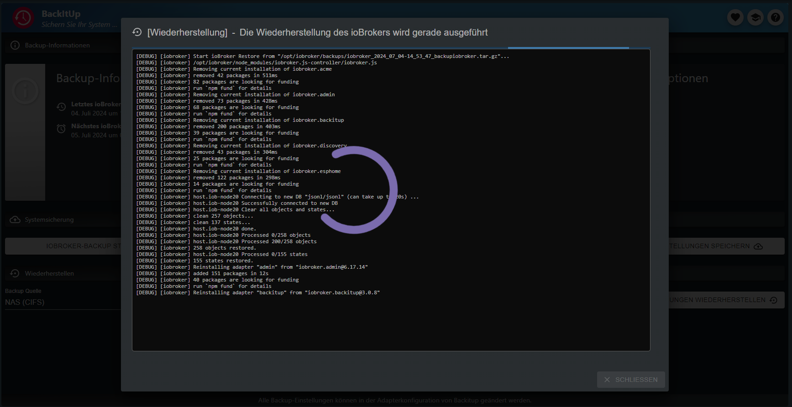

# Документация и инструкции для ioBroker.backitup


**************************************************************************************************************

## Поддержка разработки адаптеров
**Если вам нравится `ioBroker.backitup`, рассмотрите возможность пожертвования:**

[](https://paypal.me/mk1676)

**************************************************************************************************************

## Отказ от ответственности
**`ioBroker.backitup` — это плагин резервного копирования только для программного обеспечения умного дома ioBroker.**

**Он не связан и не поддерживается [Неро BackItUp](https://www.nero.com/deu/products/nero-backitup/?vlang=de) (инструментом для резервного копирования данных в системах Windows).**

**************************************************************************************************************

## Основы
`ioBroker.backitup` — это решение для резервного копирования, которое позволяет выполнять циклическое резервное копирование установки ioBroker и Homematic CCU.

Адаптер подходит для мультиплатформ и может использоваться в установках Windows и Mac в дополнение к установкам Linux.

Также возможно создавать резервные копии различных дополнительных резервных копий, таких как базы данных SQL, базы данных Influx и некоторые настройки адаптера и устройства.

`ioBroker.backitup` очень тесно работает с контроллером js и создает резервную копию ioBroker, идентичную команде CLI `iobroker backup`.

Здесь резервируются все состояния и объекты, а также пользовательские файлы, такие как VIS, так же, как и стандартный бэкап js-контроллера.

Восстановление также полностью идентично команде CLI `iobroker restore <backupname>` контроллера js.

Во время восстановления восстанавливаются все состояния, объекты и пользовательские данные из `ioBroker.backitup`.
После восстановления ваш iobroker перезапустится, и с этого момента js-контроллер снова возьмет на себя установку отсутствующих адаптеров.

`ioBroker.backitup` не влияет на восстановление после запуска iobroker. Все это происходит в фоновом режиме, и контроллер js берет на себя управление на основе восстановленной информации в состояниях и объектах.

В отличие от команды CLI, `ioBroker.backitup` также может восстанавливать различные дополнительные резервные копии.
Через CLI это невозможно.

_[Вернуться к началу](#dokumentation-und-anleitung-für-iobrokerbackitup)_

---

## Зависимости
* Для монтирования CIFS необходимо установить Cifs-utils.
    - `sudo apt install cifs-utils`

* Для монтирования NFS необходимо установить nfs-common.
    - `sudo apt install nfs-common`

* Чтобы использовать резервную копию MySql систем MySql, в системе должен быть установлен mysqldump.
    - `sudo apt install mysql-client` или в Debian `sudo apt install default-mysql-client`

* Чтобы использовать резервную копию MySql систем MariaDB, в системе должен быть установлен mysqldump.
    - `sudo apt install mariadb-client`

* Чтобы использовать резервное копирование Sqlite3, в системе должен быть установлен sqlite3.
    - `sudo apt install sqlite3`

* Чтобы использовать резервное копирование PostgreSQL, в системе должен быть установлен mysqldump.
    - [Руководство по установке PostgreSQL](https://www.postgresql.org/download/linux/debian/)

* Чтобы использовать резервное копирование InfluxDB, необходимо установить influxd.
    - [Руководство по установке InfluxDB 1.x] (https://docs.influxdata.com/influxdb/v1.8/introduction/install/)
    - [Руководство по установке InfluxDB 2.x] (https://docs.influxdata.com/influxdb/v2.1/install/)
    - [Руководство по установке Influx CLI для 2.x] (https://docs.influxdata.com/influxdb/v2.1/tools/influx-cli/?t=Linux)

_[Вернуться к началу](#dokumentation-und-anleitung-für-iobrokerbackitup)_

---

## Использование и эксплуатация
`ioBroker.backitup` можно настроить в экземплярах адаптера. Здесь доступны все следующие параметры настройки.

Во вкладке администратора доступна вкладка для ежедневной работы и эксплуатации `ioBroker.backitup`.

Если эта вкладка активна в меню вкладок интерфейса администратора, `ioBroker.backitup` можно управлять непосредственно через вкладку на левой панели вкладок ioBroker.

Там доступна информация о созданных резервных копиях, можно создавать резервные копии и есть возможность восстановить резервную копию.


Вот краткое объяснение опций в меню вкладок.

| № | Описание |
|-----|---------------------------------------------------------------------------------------------------------------------------------------------------------------------------------------------------------------------|
| 1. | Информация о последней и следующей резервной копии.                                                                                                                                                                      |
| 2. | Информация о том, где хранятся резервные копии.                                                                                                                                                                   |
| 3. | Информация о том, какие типы резервных копий активны и копируются.                                                                                                                                                  |
| 4. | Запустите резервное копирование iobroker вручную.                                                                                                                                                                                |
| 5. | Запустите резервное копирование Homematic вручную.                                                                                                                                                                               |
| 6. | Открывает новое окно и показывает все резервные копии из истории.                                                                                                                                                 |
| 7. | С помощью этой кнопки вы можете сохранить настройки `ioBroker.backitup`. Это полезный инструмент при изменении систем. Настройки выводятся в формате JSON.                                |
| 8. | В этой опции вы выбираете память, из которой должно быть выполнено восстановление.                                                                                                                                |
| 9. | При нажатии кнопки «Получить резервные копии» открывается новое окно со списком всех существующих резервных копий в выбранном хранилище.                                                                                 |
| 11. | Эта кнопка используется для восстановления сохраненных настроек `ioBroker.backitup` в адаптере. Это не восстановление ioBroker и сюда можно загружать только файлы в формате JSON! |
| 12. | Открывает новую вкладку и отображает документацию для `ioBroker.backitup`.                                                                                                                                        |
| 13. | Открывает новую вкладку и отображает файл сведений `ioBroker.backitup`.                                                                                                                                               |
| 13. | Открывает новую вкладку и отображает файл readme `ioBroker.backitup`.                                                                                                                                               |


Вкладка «Восстановление» работает следующим образом.

| № | Описание |
|-----|------------------------------------------------|
| 1. | Загрузите выбранную резервную копию на ПК.     |
| 2. | Запустите восстановление выбранной резервной копии.      |
| 3. | Резервная информация.                      |
| 4. | Информация о типе резервной копии.                   |


_[Вернуться к началу](#dokumentation-und-anleitung-für-iobrokerbackitup)_

---

## Типы резервных копий
`ioBroker.backitup` предлагает множество вариантов выполнения различных типов резервного копирования циклически или одним нажатием кнопки. По умолчанию каждая резервная копия хранится в каталоге /opt/iobroker/backups. При желании можно настроить загрузку по FTP или использовать монтирование CIFS/NFS.

### Резервное копирование ioBroker
Эта резервная копия соответствует резервной копии, содержащейся в ioBroker, которую можно запустить в консоли, вызвав `iobroker backup`. Только здесь это осуществляется через указанные настройки в конфигурации адаптера или виджета OneClick Backup, без использования консоли.

### Резервное копирование CCU (Homematic)
Эта резервная копия предлагает возможность резервного копирования трех различных вариантов установки Homematic (CCU-Original/pivCCU/Raspberrymatic). Такое резервное копирование также можно выполнить с помощью настроек, указанных в конфигурации адаптера или виджета OneClick Backup.

Если вы не хотите просто создать резервную копию одного CCU, вы можете активировать опцию «Резервное копирование нескольких систем», а затем определить свои центральные блоки Homematic в таблице.

> [!ВАЖНО] > Резервное копирование CCU может выполняться только пользователем `Admin` CCU!

### Резервное копирование Mysql
Если эта опция активирована, эта отдельно настраиваемая резервная копия создается с каждой резервной копией ioBroker, а также удаляется по истечении указанного срока хранения. Для этой резервной копии также подходят FTP или CIFS, если они установлены для других типов резервных копий ioBroker.

Здесь важно то, что даже если сервер Mysql работает в удаленной системе, mysqldump должен работать в системе ioBroker.
Для систем Linux команда установки будет следующей: `sudo apt install mysql-client` или в Debian `sudo apt install default-mysql-client` или для систем MariaDB `sudo apt install mariadb-client`.

Если вы не хотите просто создавать резервную копию одной базы данных, вы можете активировать опцию «Резервное копирование нескольких систем», а затем определить свои базы данных в таблице.

### Резервное копирование Sqlite3
Если эта опция активирована, эта отдельно настраиваемая резервная копия создается с каждой резервной копией ioBroker и также удаляется по истечении указанного срока хранения. Для этой резервной копии также подходят FTP или CIFS, если они установлены для других типов резервных копий ioBroker.

Sqlite3 (`sudo apt install sqlite3`) должен быть установлен в хост-системе.

### Резервное копирование Redis
Если эта опция активирована, эта отдельно настраиваемая резервная копия создается с каждой резервной копией ioBroker, а также удаляется по истечении указанного срока хранения. Для этой резервной копии также подходят FTP или CIFS, если они установлены для других типов резервных копий ioBroker.

Чтобы использовать Redis с `ioBroker.backitup`, необходимо настроить права пользователя iobroker:

```
sudo usermod -a -G redis iobroker
sudo reboot
```

Для удаленного резервного копирования требуется redis-cli в локальной системе ioBroker.

`sudo apt install redis-tools`

Здесь вам необходимо ввести свой хост и порт удаленного сервера Redis, а также данные для входа в вашу систему.

Это важная функция, особенно для пользователей Docker.

Обратите внимание, что восстановление Redis для удаленных систем невозможно через графический интерфейс `ioBroker.backitup`, поскольку Redis не поддерживает это.
Здесь dump.rdb, содержащийся в архиве tar.gz, необходимо восстановить вручную, распаковав резервный архив и скопировав файл в каталог Redis, а также настроив права для dump.rdb.

Вот пример:

```
sudo tar -xvzf <Backupdatei>.tar.gz /var/lib/redis/
sudo chown redis:redis /var/lib/redis/dump.rdb
redis-cli shutdown nosave
```

### Резервное копирование исторических данных
Если эта опция активирована, эта отдельно настраиваемая резервная копия создается с каждой резервной копией ioBroker, а также удаляется по истечении указанного срока хранения. Для этой резервной копии также подходят FTP или CIFS, если они установлены для других типов резервных копий ioBroker.

### Резервное копирование InfluxDB
Если эта опция активирована, эта отдельно настраиваемая резервная копия создается с каждой резервной копией ioBroker, а также удаляется по истечении указанного срока хранения. Для этой резервной копии также подходят FTP или CIFS, если они установлены для других типов резервных копий ioBroker.

**Требования к удаленному резервному копированию с помощью InfluxDB v1.x:**

Некоторые настройки необходимы для удаленного резервного копирования в InfluxDB 1.x.

**Для запуска резервного копирования InfluxDB необходимо установить InfluxDB в системе iobroker.**

**Не имеет значения, управляется ли база данных локально или работает на другом сервере.**

Если резервное копирование InfluxDB должно выполняться с удаленного сервера, удаленные права для службы RPC должны быть настроены в файле influxdb.conf на удаленном сервере.

```
bind-address = "<InfluxDB-IP>:8088"
```

или

```
bind-address = "0.0.0.0:8088"
```

**После внесения изменений в конфигурацию сервис InfluxDB необходимо перезапустить.**

Дополнительную информацию о резервном копировании данных InfluxDB можно найти в [здесь](https://docs.influxdata.com/influxdb/v1.8/administration/backup_and_restore/#online-backup-and-restore-for-influxdb-oss).

**Требования к резервному копированию с помощью InfluxDB v2.x:**

Чтобы создать резервную копию InfluxDB 2.x, в вашей системе должен быть установлен Influx-CLI.
Это необходимо как для локального, так и для удаленного резервного копирования.

Для удаленного резервного копирования Influx-CLI должен быть установлен в системе, в которой работает ваш ioBroker.
Установка резервной копии не требуется на удаленной системе, где работает ваша база данных.

Здесь вы найдете официальные инструкции по установке Influx-CLI в вашей системе.

[Инструкция по установке Influx-CLI для 2.x](https://docs.influxdata.com/influxdb/v2.1/tools/influx-cli/?t=Linux)

Если вы не хотите просто создавать резервную копию одной базы данных, вы можете активировать опцию «Резервное копирование нескольких систем», а затем определить свои базы данных в таблице.

> [!ВАЖНО] > Чтобы создать резервную копию InfluxDB2, а также иметь возможность ее восстановить, необходим токен оператора!

### Резервное копирование PostgreSQL
Если эта опция активирована, эта отдельно настраиваемая резервная копия создается с каждой резервной копией ioBroker, а также удаляется по истечении указанного срока хранения. Для этой резервной копии также подходят FTP или CIFS, если они установлены для других типов резервных копий ioBroker.

Здесь важно то, что даже если сервер PostgreSQL работает в удаленной системе, PostgreSQL должен работать в системе ioBroker.
Для систем Linux имеются инструкции по установке [здесь](https://www.postgresql.org/download/linux/debian/).

Если вы не хотите просто создавать резервную копию одной базы данных, вы можете активировать опцию «Резервное копирование нескольких систем», а затем определить свои базы данных в таблице.

### Резервное копирование Javascript
Если эта опция активирована, эта отдельно настраиваемая резервная копия создается с каждой резервной копией ioBroker, а также удаляется по истечении указанного срока хранения. Для этой резервной копии также подходят FTP или CIFS, если они установлены для других типов резервных копий ioBroker.

Начиная с `ioBroker.backitup` версии 2.2.0, скрипты сохраняются непосредственно из объектов. Резервные копии Javascript из более старых версий `ioBroker.backitup` несовместимы для восстановления!!

Чтобы иметь возможность выполнять резервное копирование Javascript с `ioBroker.backitup` версий < 2.2.0, в конфигурации адаптера Javascript необходимо заранее установить пункты меню «Зеркалирование сценариев в пути к файлу» и «Экземпляр, выполняющий зеркалирование». .

`ioBroker.backitup` затем сможет применить настройки в меню конфигурации.

### Резервная копия Джарвиса
Если эта опция активирована, эта отдельно настраиваемая резервная копия создается с каждой резервной копией ioBroker, а также удаляется по истечении указанного срока хранения. Для этой резервной копии также подходят FTP или CIFS, если они установлены для других типов резервных копий ioBroker.

### Резервное копирование Zigbee
Если эта опция активирована, эта отдельно настраиваемая резервная копия создается с каждой резервной копией ioBroker, а также удаляется по истечении указанного срока хранения. Для этой резервной копии также подходят FTP или CIFS, если они установлены для других типов резервных копий ioBroker.

### Резервное копирование Zigbee2MQTT
Если эта опция активирована, эта отдельно настраиваемая резервная копия создается с каждой резервной копией ioBroker и также удаляется по истечении указанного срока хранения. Для этой резервной копии также подходят FTP или CIFS, если они установлены для других типов резервных копий ioBroker.

Путь в адаптере `ioBroker.backitup` всегда должен создаваться непосредственно на пути «данных» zigbee2mqtt.
Пример: `/opt/zigbee2mqtt/data` или непосредственно в том с установкой zigbee2mqtt в Docker.

Здесь также важно, чтобы пользователь «iobroker» получил права на папку данных, чтобы иметь возможность читать и записывать файлы.

Групповые права могут быть установлены следующим образом:

```
sudo usermod -a -G <zigbee2mqtt User> iobroker
sudo reboot
```

### Красный резервный узел
Если эта опция активирована, эта отдельно настраиваемая резервная копия создается с каждой резервной копией ioBroker, а также удаляется по истечении указанного срока хранения. Для этой резервной копии также подходят FTP или CIFS, если они установлены для других типов резервных копий ioBroker.

### Резервное копирование Grafana
Если эта опция активирована, эта отдельно настраиваемая резервная копия создается с каждой резервной копией ioBroker, а также удаляется по истечении указанного срока хранения. Для этой резервной копии также подходят FTP или CIFS, если они установлены для других типов резервных копий ioBroker.

> [!ВАЖНО] > Для создания резервной копии Grafana необходимы имя пользователя Grafana (admin) и пароль.
> Кроме того, для получения доступа к панелям мониторинга в веб-интерфейсе Grafana необходимо создать ключ API или токен службы.

Ключ API можно создать в разделе *** «Конфигурация → Ключи API или сервисный токен»*** и он должен иметь полные права администратора.

### Яхка резервная копия
Если эта опция активирована, эта отдельно настраиваемая резервная копия создается с каждой резервной копией ioBroker, а также удаляется по истечении указанного срока хранения. Для этой резервной копии также подходят FTP или CIFS, если они установлены для других типов резервных копий ioBroker.

Все системные настройки и настройки устройства сохраняются с помощью Homekit.

_[Вернуться к началу](#dokumentation-und-anleitung-für-iobrokerbackitup)_

---

## Варианты хранения
### Местный
Местоположение резервной копии по умолчанию в ioBroker — `/opt/iobroker/backups`.
Это задается системой и не может быть изменено.
Если ни один из перечисленных ниже подключений CIFS или NFS не активен, все резервные копии попадают по стандартному пути и располагаются локально в хост-системе.

Дополнительные варианты хранения, такие как облако или FTP, просто создают копию резервной копии в выбранном месте за пределами хост-системы.

### КИФС
Монтирование CIFS не является проблемой в Linux.

Следует отметить, что cifs-utils установлен.

Путь должен выглядеть следующим образом (например: «/имя общего ресурса/путь»)

При желании вы можете активировать/деактивировать необходимость удаления резервных копий с NAS.

### НФС
Монтирование NFS не является проблемой в Linux.

Следует отметить, что nfs-common установлен.

Путь должен выглядеть следующим образом (например: «/имя общего ресурса/путь»).

При желании вы можете активировать/деактивировать необходимость удаления резервных копий с NAS.

###FTP
FTP возможен на всех ОС и служит альтернативой монтированию CIFS.

Информация о пути в FTP всегда должна начинаться с «/» (например: «/информация о пути»).

При желании вы можете активировать/деактивировать необходимость удаления резервных копий с NAS.

### Копировать
Если монтирование CIFS невозможно, существует другой вариант функции копирования.

Здесь путь, куда должна быть скопирована копия, необходимо прописать в настройках CIFS.

IP-адрес должен оставаться пустым для функции копирования.

### Экспертный маунт
В области «Эксперт» можно создать собственную команду монтирования, которую адаптер затем использует для резервного копирования и восстановления.
Здесь вы можете работать индивидуально и, например, интегрировать fstab или учетные данные.

> [!ВНИМАНИЕ] > Обратите внимание, что эта опция предназначена только для экспертов.

### Дропбокс
Чтобы использовать резервную копию в Dropbox, вам необходимо получить токен доступа. Вы можете сделать это на странице конфигурации `ioBroker.backitup`.

ioBroker получает доступ только к определенным областям; токены или пользовательские данные не хранятся в облаке.

Если вы хотите создать собственное приложение Dropbox API, вы можете выбрать это в настройках `ioBroker.backitup`, а затем выполнить следующие шаги.

> Примечание. Ваши собственные приложения имеют только токен «short_live», который действителен только в течение 4 часов. Мы рекомендуем использовать стандартное приложение iobroker.

Чтобы использовать резервное копирование в Dropbox, необходимо создать токен доступа и приложение по адресу https://www.dropbox.com/developers/apps:

* Шаг 1. Используйте кнопку «Создать приложение».
* Шаг 2. Выберите «Ограниченный доступ».
* Шаг 3: Выберите «Папка приложения».
* Шаг 4. Назначьте «Назовите свое приложение» и нажмите кнопку «Создать приложение».
* Шаг 5: На вкладке «Разрешения» поставьте все 4 галочки в области «Файлы и папки».
* Шаг 6. На вкладке «Настройки» установите для параметра «Срок действия токена доступа» значение «Без срока действия».
* Шаг 7: Нажмите кнопку «Сгенерированный токен доступа» (этот сгенерированный токен вводится в настройки `ioBroker.backitup`)

Теперь в вашем Dropbox появилась новая папка под названием «Приложения».

### Google Диск
Чтобы использовать резервную копию на Google Диске, вам необходимо получить токен доступа. Вы можете сделать это на странице конфигурации.

ioBroker получает доступ только к определенным областям. Код oAuth можно увидеть по адресу [здесь](https://github.com/simatec/ioBroker.backitup/blob/master/docs/oAuthService.js).

Никакие токены или пользовательские данные не хранятся в облаке.

### Onedrive
Чтобы использовать резервную копию в Onedrive, вам необходимо получить токен доступа. Вы можете сделать это на странице конфигурации `ioBroker.backitup`.

ioBroker получает доступ только к определенным областям; токены или пользовательские данные не хранятся в облаке.

### ВебДАВ
С помощью WebDAV `ioBroker.backitup` предлагает возможность обращения к нескольким облачным системам, наиболее известной из которых является NextCloud.
Чтобы установить соединение WebDAV, необходимы имя пользователя и пароль облачной учетной записи.

Подключение к облаку происходит через зашифрованное соединение.

Чтобы установить соединение, имя хоста облака должно соответствовать всем сертификатам безопасности.

> Пример URL-адреса: «https://example.com/remote.php/dav/files/username/»

Соединение с локальным IP-адресом возможно только в том случае, если отключена опция «Разрешить только подписанные сертификаты».

_[Вернуться к началу](#dokumentation-und-anleitung-für-iobrokerbackitup)_

---

## Удаление старых резервных копий
`ioBroker.backitup` может автоматически удалять старые резервные копии. Количество сохраняемых резервных копий можно указать в конфигурации `ioBroker.backitup`.
Более старые резервные копии удаляются только в том случае, если адаптер выполняет автоматическое резервное копирование с контролем по времени.

> [!NOTE] > При резервном копировании вручную старые файлы резервных копий не удаляются.

> [!ВАЖНО] > Если в процессе резервного копирования произойдет ошибка, более старые резервные копии не будут удалены по соображениям безопасности.

Какие резервные копии были удалены и возможные ошибки при удалении выводятся в журнале отладки.

_[Вернуться к началу](#dokumentation-und-anleitung-für-iobrokerbackitup)_

---

## Поддержка нескольких хостов
Мультихост для `ioBroker.backitup` может работать с несколькими экземплярами `ioBroker.backitup` на разных хостах.

Для поддержки этой возможности экземпляр `ioBroker.backitup` должен быть настроен как главный. Все остальные экземпляры, расположенные на удаленных хостах, настроены как подчиненные.

Мастер берет на себя управление автоматическим резервным копированием. Все ведомые экземпляры можно выбрать в ведущем устройстве через меню.

Для подчиненных экземпляров можно активировать следующие параметры резервного копирования:

* Редис
* Зигби
*Джарвис
* История
* ИнфлюксБД
* MySql
* Склайт3
* PostgreSql
* Графана
*Яхка
* Узел Красный
* Зигби2MQTT

Поскольку автоматическое резервное копирование в подчиненном экземпляре контролируется главным устройством, резервные копии iobroker, резервные копии Javascript и резервные копии CCU выбрать нельзя.

Места хранения отдельных резервных копий можно свободно настроить на каждом подчиненном устройстве. Это означает, что каждый может спроектировать свою систему хранения файлов независимо от мастера.

В системах с ограниченным объемом оперативной памяти главный `ioBroker.backitup` может автоматически запускать подчиненные экземпляры для процесса резервного копирования, а затем снова останавливать их.

Эта опция настраивается в меню.

_[Вернуться к началу](#dokumentation-und-anleitung-für-iobrokerbackitup)_

---

## Поддержка Докера
Поскольку в контейнере Docker не следует устанавливать системы баз данных, резервное копирование всех баз данных не поддерживается и не может быть выбрано по умолчанию при распознавании контейнера Docker. Чтобы иметь возможность выполнять резервное копирование внешних баз данных, необходимо установить две переменные среды контейнера:

* IOB_BACKITUP_EXTDB=истина
* ПАКЕТЫ

Содержимое переменной среды «PACKAGES» зависит от устанавливаемых пакетов, необходимых для доступа к соответствующей базе данных. Примерами могут быть «mysql-client» или «redis-tools». Более подробную информацию можно найти в [здесь](https://docs.buanet.de/iobroker-docker-image/docs_backitup/).

Чтобы иметь возможность полностью использовать `ioBroker.backitup` в Docker, необходимо сопоставить несколько портов.

* Порт 8091 — восстановить веб-интерфейс.
* Порт 9081 — Файловый сервер для загрузки резервных копий через веб-интерфейс `ioBroker.backitup`
* Порт 9082 — Файловый сервер для загрузки резервных копий через веб-интерфейс `ioBroker.backitup`

_[Вернуться к началу](#dokumentation-und-anleitung-für-iobrokerbackitup)_

---

## Использование
1. Адаптер создает некоторые точки данных для использования в Vis.

	* oneClick.ccu -> служит триггером для резервного копирования CCU (можно установить значение true в Vis с помощью кнопки)
	* oneClick.iobroker -> служит триггером для стандартного резервного копирования (в Vis можно установить значение true с помощью кнопки)

	* History.html -> служит журналом истории, который можно адаптировать к дизайну в Vis через CCS.
    * History.json -> служит журналом истории, который можно адаптировать к дизайну в Vis через CCS.
	* History.ccuLastTime -> сохраняет дату и время создания последней резервной копии CCU.
	* History.minimalLastTime -> сохраняет дату и время создания последней стандартной резервной копии
    * History.ccuSuccess -> показывает состояние «истина», если резервное копирование прошло успешно.
    * History.minimalSuccess -> показывает состояние «истина», если резервное копирование прошло успешно.
    * History.iobrokerLastTime -> показывает последнюю резервную копию ioBroker
    * History.ccuLastTime -> показывает последнюю резервную копию CCU
    * info.ccuNextTime -> показывает следующее время выполнения резервной копии CCU.
    * info.iobrokerNextTime -> показывает следующее время выполнения резервной копии ioBroker.
    * info.latestBackup -> показывает в формате JSON последнюю резервную копию, определенную при запуске.

2. Просмотрите журнал истории резервного копирования в Vis.
   - Журнал истории резервного копирования показывает последние x резервных копий.
   - Количество отображаемых записей истории можно установить в дополнительных настройках.
   — Отобразить журнал истории можно в HTML-виджете, например, введя в HTML следующую строку:

```
{backitup.0.history.html}
```

Синтаксис: {BackitupInstanz.history.html}

3. CCS форматирование журнала истории:

```
   .html{
       display:block;
       width:100%;
   /*    overflow-y:scroll; */
   }
   .backup-type-iobroker
       {
           float:left;
           color:white;
           font-size:20px;
       }
   .backup-type-ccu
       {
           float:left;
           color:red;
           font-size:20px;
    }
   ```

4. Кнопка OneClick с текстом статуса.
   - Если для точки данных OneClick установлено значение true, запускается соответствующее резервное копирование, и через заданное время для этой точки данных снова устанавливается значение false. Это дает возможность создать кнопку со статусом. Для этого адаптируйте следующую строку и введите ее в Vis как текст кнопки:

```
{wert: backitup.0.oneClick.iobroker; wert === "true" || wert === true ? "Minimal Backup </br> wird erstellt" : "Minimal Backup </br> starten"}
```

Синтаксис: {значение: <BackitupInstance>.oneClick.<TriggerTrigger>; значение === "истина" || значение === правда? «Текст во время создания резервной копии»: «Текст по умолчанию»}

_[Вернуться к началу](#dokumentation-und-anleitung-für-iobrokerbackitup)_

---

## Уведомления
`ioBroker.backitup` поддерживает следующие мессенджеры для уведомлений после успешного резервного копирования.
Для его использования необходимо установить и настроить соответствующие адаптеры.

   * Телеграмма
   * Пушоверы
   * Электронная почта
   * Ватсап
   * Сигнал
   * Матрица
   *Раздор

_[Вернуться к началу](#dokumentation-und-anleitung-für-iobrokerbackitup)_

---

##Восстановить
С помощью `ioBroker.backitup` можно восстановить все созданные типы резервных копий через меню конфигурации в ioBroker.

`ioBroker.backitup` очень тесно работает с контроллером js и создает резервную копию iobroker, идентичную команде CLI «iobroker backup».

Здесь резервируются все состояния и объекты, а также пользовательские файлы, такие как VIS, так же, как и стандартный бэкап js-контроллера.

Восстановление также полностью идентично команде CLI контроллера js.

Во время восстановления восстанавливаются все состояния, объекты и пользовательские данные из `ioBroker.backitup`.



После восстановления ваш ioBroker перезапускается, и с этого момента контроллер js снова берет на себя установку отсутствующих адаптеров.


`ioBroker.backitup` не влияет на восстановление после запуска iobroker. Контроллер js делает это в фоновом режиме на основе восстановленной информации в состояниях и объектах.

Восстановление можно выполнить со всех носителей информации.

> [!NOTE] > По сути, самый безопасный способ — запустить восстановление локально.

Если вы выбрали самый безопасный маршрут и хотите выполнить восстановление локально, вам необходимо сохранить файл резервной копии в папке резервных копий ioBroker.
В системах Linux эта папка находится по следующему пути: `/opt/iobroker/backups`.

При использовании типов резервного копирования «ioBroker» и «redis» ioBroker останавливается во время восстановления, а затем автоматически запускается снова.

**Для всех остальных типов резервного копирования ioBroker не останавливается. Здесь на короткое время останавливаются только затронутые адаптеры.**

Если вы предпочитаете восстанавливать резервные копии вручную, вам следует сделать следующее:

***Восстановить резервную копию ioBroker:***

    - Резервная копия должна находиться в каталоге `opt/iobroker/backups`, как обычно.
    - Его можно восстановить из консоли с помощью команды: `iobrokerrestore <имя файла резервной копии>`.
    - После восстановления необходимо загрузить все с помощью iobroker.

Подробные инструкции по восстановлению с помощью `ioBroker.backitup`, а также по восстановлению вручную можно найти в [здесь](https://github.com/simatec/ioBroker.backitup/wiki/%5BHowTo%5D-Restore-auf-Linux-Distributionen).

**Резервную копию CCU необходимо восстановить через веб-интерфейс CCU.**

***Восстановление резервной копии Raspberrymatic/CCU:***

    - Скопируйте файл *.sbk через SCP в каталог «каталог /usr/local/tmp» на Raspberrymatic.
    - Войдите в Raspberrymatic как пользователь root через консоль.
    - Запустите команду: «/bin/restoreBackup.sh /user/local/tmp/EuerBackupFilename» на Raspberrymatic.
    - Запустите команду «reboot» на Raspberrymatic, чтобы перезапустить PI.
    - В качестве альтернативы резервную копию, конечно, можно восстановить как обычно через веб-интерфейс.

### Восстановление базы данных InfluxDB
При восстановлении резервной копии InfluxDB обратите внимание, что адаптер InfluxDB должен быть заранее остановлен, а база данных не должна существовать.

> [!NOTE] > Если база данных существует, ее необходимо удалить перед восстановлением.

Адаптер InfluxDB можно запустить снова только после восстановления, поскольку он всегда будет пытаться создать базу данных.

Кроме того, чтобы восстановить базу данных InfluxDB 2.x, перед восстановлением необходимо настроить токен оператора в меню ioBroker.backitup.

> [!NOTE] > Восстановление невозможно без правильного токена оператора.

_[Вернуться к началу](#dokumentation-und-anleitung-für-iobrokerbackitup)_

---

## Поиск неисправностей
    Чтобы регистрировать ошибки, для `ioBroker.backitup` необходимо установить уровень журнала «отладка» на вкладке «Экземпляры» ioBroker.

_[Вернуться к началу](#dokumentation-und-anleitung-für-iobrokerbackitup)_

---

## Возникшие ошибки/решения
Вот список проблем, которые произошли на данный момент, и их решения (если таковые имеются).

1. У Olifall (с форума) была проблема, что веб-интерфейс ioBroker после восстановления стал недоступен. Ему удалось это исправить, выполнив следующие действия через консоль:
    - статус sudo iobroker
    - Сообщение = «Нет соединения с состояниями 127.0.0.0:6379[redis]»
    - sudo apt установить сервер Redis

2. Если монтирование CIFS с IP-адресом невозможно, следует использовать имя хоста NAS.
3. Если вы используете пароль со специальными символами для монтирования CIFS, пользователи обнаружили, что пароль необходимо хранить в конфигурации с кавычками.
4. По мнению некоторых пользователей, монтирование CIFS не может обрабатывать очень длинные пароли. Если монтирование не работает, немного сократите пароль (у меня работает 12 символов).
5. Если адаптер не может быть установлен, проверьте версии node и nodejs. Адаптер не поддерживает версии < Node 8.
6. Если ваша система ioBroker была установлена с помощью нового сценария установки, может случиться так, что у вас нет всех прав для нового пользователя iobroker.

    К сожалению, это также влияет на резервное копирование, поскольку резервное копирование использует некоторые системные команды.

Для решения проблемы с отсутствующими правами существует исправление скрипта установщика ioBroker.
Пожалуйста, выполните следующие команды в вашей среде ioBroker в консоли:

```
iobroker stop
iobroker fix
sudo reboot
```

7. Если при создании базы данных Redis вы получаете сообщение об ошибке, проверьте, имеет ли ваш пользователь iobroker права и существует ли он в группе пользователей Redis.

    Если это не так, вы можете исправить это с помощью следующей команды в консоли.

```
sudo usermod -a -G redis iobroker
sudo reboot
```

    Если вы не настроили установку ioBroker с помощью сценария установки и у вашего пользователя другое имя, замените «iobroker» на своего пользователя в команде.

8. Если Fritzbox используется в качестве NAS с прошивкой >= 7.21, для настроек SMB в `ioBroker.backitup` должно быть установлено значение "3.1.1", а опция "noserverino" должна быть активирована.

_[Вернуться к началу](#dokumentation-und-anleitung-für-iobrokerbackitup)_

---

## Changelog
### **WORK IN PROGRESS**
* (bluefox) Improvement of Google Drive authentication workflow
* (bluefox) Removed gulp from a build process

### 3.0.22 (2024-09-03)
* (simatec) Fix Notification Instance
* (simatec) Fix Notification Design
* (simatec) Fix Default Settings

### 3.0.21 (2024-09-01)
* (simatec) Fix Onedrive Notification
* (simatec) Fix Zigbee2MQTT Backup
* (simatec) dependencies updated

### 3.0.20 (2024-08-22)
* (simatec) Responsive Design for Tab added
* (simatec) Responsive Design for jsonConfig added
* (simatec) dependencies updated

### 3.0.19 (2024-08-15)
* (simatec) Fix CCU Backup
* (simatec) Fix InfluxDB Backup Config
* (simatec) Fix Backup-Log for Slave Instanz

### 3.0.18 (2024-08-14)
* (simatec) Package optimisation
* (simatec) Fix the warning when opening the configuration
* (simatec) dependencies updated

### 3.0.17 (2024-08-12)
* (simatec) Fix io-package for Release
* (simatec) manual-review added
* (simatec) Fix Slave Backup
* (simatec) dependencies updated

### 3.0.16 (2024-08-05)
* (bluefox) dependencies updated
* (simatec) Rename json5 Files

### 3.0.15 (2024-08-03)
* (simatec) fix dependencies

### 3.0.14 (2024-08-02)
* (simatec) dependencies updated
* (simatec) Improved log outputs

### 3.0.12 (2024-08-01)
* (simatec) Backup Log for History added
* (simatec) Added separate selection for deleting FTP backups
* (simatec) Added separate selection for deleting Onedrive backups
* (simatec) Added separate selection for deleting Webdav backups
* (simatec) Added separate selection for deleting Dropbox backups
* (simatec) Added separate selection for deleting Googledrive backups
* (simatec) Improved log outputs
* (simatec) Source code cleaned up
* (simatec) dependencies updated

### 3.0.11 (2024-07-28)
* (simatec) Design Fix
* (simatec) dependencies updated

### 3.0.10 (2024-07-22)
* (simatec) Design Fix for Dark Mode
* (bluefox) dependencies updated

### 3.0.9 (2024-07-11)
* (simatec) Tab Icons added
* (simatec) small fix
* (simatec) Docu updated

### 3.0.8 (2024-07-01)
* (Grothesk242/simatec) forceuid and forcegid added
* (simatec) dependencies updated
* (simatec) small fix

### 3.0.7 (2024-06-26)
* (simatec) Restore Information added
* (simatec) Fix Formaterrors
* (bluefox) Fixing the problems with styles
* (simatec) Fix iobroker Backup Error

### 3.0.6 (2024-06-26)
* (simatec) Restore Information added
* (simatec) Fix Formaterrors
* (bluefox) Fixing the problems with styles
* (simatec) Fix iobroker Backup Error

### 3.0.5 (2024-06-18)
* (simatec) Fix Build

### 3.0.4 (2024-06-18)
* (simatec) History Gui Fix
* (simatec) Tab GUI modified
* (bluefox) Added support for Admin 7
* (simatec) Onedrive ready for School/Business Accounts

### 3.0.3 (2024-06-10)
* (simatec) Fixed WebDav
* (simatec) Admin Notification for Backup errors added
* (simatec) Remove Sentry Config
* (simatec) Translations updated
* (simatec) Error handling optimized
* (simatec) dependencies updated

### 3.0.2 (2024-06-06)
* (simatec) Fixed Google Drive
* (simatec) Fixed Translations
* (simatec) Fixed Onedrive
* (simatec) Fixed MySql Backup
* (simatec) Fixed Translation added
* (simatec) Design Fix
* (simatec) new notifications content added

### 3.0.1 (2024-05-29)
* (simatec) Fixed umount callback
* (simatec) Fixed Backup Message
* (simatec) Translations updated
* (simatec) Fixed InfluxDB Multi Backup
* (simatec) Fixed Restore Console
* (simatec) Fixed Backup Console

### 3.0.0 (2024-05-28)
* (simatec) jsonConfig added
* (bluefox) Conversion to React
* (bluefox) Added react components
* (bluefox/simatec) Working on React GUI
* (simatec) dependencies updated
* (simatec) Fixed Yahka Backup
* (simatec) Fixed Nodered Backup
* (simatec) some bugs fixed
* (bluefox/simatec) New Restore-Interface
* (simatec) Translation updated

### 2.11.0 (2024-03-04)
* (simatec) Fixed Sqlite3 Path

### 2.10.11 (2024-02-14)
* (simatec) Design Fix
* (simatec) dependencies updated

### 2.10.10 (2024-02-04)
* (simatec) small Design Fix

### 2.10.9 (2024-02-01)
* (simatec) Fixed Translation

### 2.10.8 (2024-01-30)
* (simatec) Fixed Expert Mount
* (simatec) Docu updated
* (simatec) dependencies updated

### 2.10.7 (2024-01-29)
* (simatec) small fixes
* (simatec) small Design Fix
* (simatec) Translation updated
* (simatec) Expert Mount added

### 2.10.6 (2024-01-27)
* (simatec) Gulp deleted
* (simatec) adapter-dev added
* (simatec) Translation added
* (simatec) Customised design
* (simatec) Hover info added to the Restore tab
* (simatec) Improved mobile view
* (simatec) dependencies updated

### 2.10.5 (2024-01-22)
* (simatec) Fixed CCU Backup with selfsigned Certificates

### 2.10.4 (2024-01-21)
* (simatec) Fixed CCU Backup

### 2.10.3 (2024-01-19)
* (simatec) CCU backup switched from request to axios
* (simatec) Sentry fix

### 2.10.2 (2024-01-14)
* (simatec) Cronjob for Expert Settings added
* (simatec) Code restructured
* (simatec) Translation added

### 2.10.1 (2024-01-09)
* (simatec) small Fixes
* (simatec) Code restructured

### 2.10.0 (2024-01-06)
* (simatec) File server improved
* (simatec) Restore Tab improved
* (simatec) Design improved
* (simatec) Docu updated
* (simatec) Breaking Changes for Docker mapping ports

### 2.9.10 (2023-12-29)
* (simatec) Fixed node-red restore
* (simatec) auto install after restore for node-red added

### 2.9.9 (2023-12-29)
* (simatec) dependencies updated
* (simatec) Default storage path for history adapter added
* (simatec) Added check of the storage path from the History Adapter

### 2.9.8 (2023-12-14)
* (simatec) Sentry fix

### 2.9.7 (2023-12-12)
* (simatec) URL Update
* (simatec) Fixed redis Password

### 2.9.6 (2023-12-10)
* (simatec) Gotify Notication added
* (simatec) dependencies updated
* (simatec) Copypath check added

### 2.9.5 (2023-11-29)
* (simatec) dependencies updated
* (simatec) Fixed redis Password

### 2.9.4 (2023-11-20)
* (simatec) dependencies updated
* (simatec) Fixed CIFS Password
* (simatec) Fixed mySql Password
* (simatec) Fixed pgSql Password
* (simatec) Fixed redis Password

### 2.9.3 (2023-11-11)
* (simatec) Fixed Port for Filerserver
* (simatec) Docu updated

### 2.9.2 (2023-11-10)
* (simatec) dependencies updated
* (simatec) Design fix
* (simatec) Backup File upload added
* (simatec) Uploadserver added
* (simatec) Translation updated

### 2.9.1 (2023-11-02)
* (simatec) ignore Build directory for ESPHome added

### 2.9.0 (2023-11-01)
* (simatec) mount option "Cache Loose" added
* (simatec) ESPHome Backup added
* (simatec) dependencies updated

### 2.8.7 (2023-10-19)
* (buanet) fix restore in docker v9

### 2.8.6 (2023-10-13)
* (simatec) Fixed node-red restore
* (simatec) dependencies updated

### 2.8.5 (2023-10-13)
* (simatec) Fixed mount errors

### 2.8.4 (2023-10-11)
* (simatec) Fixed mysql Backup
* (simatec) Fixed pgsql Backup
* (simatec) Fixed InfluxDB Backup

### 2.8.3 (2023-10-10)
* (simatec) Wake on LAN Advanced Settings added
* (simatec) dependencies updated

### 2.8.2 (2023-09-28)
* (simatec) Fixed redis backup

### 2.8.1 (2023-09-12)
* (simatec) Fixed roles
* (simatec) help-links added

### 2.8.0 (2023-09-11)
* (simatec) small Sentry fixes
* (simatec) Bugfix System-Message
* (simatec) Docu & Wiki updated
* (simatec) Translation updated
* (simatec) dependencies updated
* (simatec) Fixed Webdav
* (simatec) WOL Address & Port added
* (simatec) Restore for Backitup Config added

### 2.7.0 (2023-08-14)
* (simatec) dependencies updated
* (simatec) Fixed error Messages
* (simatec) edit automatic name addition added
* (simatec) Docu & Wiki updated
* (simatec) small bug fixes
* (simatec) Translation updated
* (crycode-de) Add support for sending notifications via discord (requires ioBroker.discord >= 2.1)

### 2.6.23 (2023-05-25)
* (simatec) Fixed Influx Restore for MultiDB
* (simatec) Token renew for Onedrive added
* (simatec) Fixed PSQL Restore

### 2.6.22 (2023-05-24)
* (simatec) Fixed Influx Restore for MultiDB
* (simatec) Default Ports for InfluxDB added

### 2.6.21 (2023-05-19)
* (simatec) small Sentry fixes
* (simatec) Fixed Influx Restore
* (simatec) Fixed Onedrive Download
* (simatec) dependencies updated

### 2.6.20 (2023-05-02)
* (simatec) FTP self signed Certificates added
* (simatec) dependencies updated

### 2.6.19 (2023-04-20)
* (simatec) small fix for js-controller 5

### 2.6.18 (2023-04-19)
* (simatec) dependencies updated
* (simatec) small Sentry fixes
* (simatec) Error notifications optimized

### 2.6.17 (2023-04-13)
* (simatec) Fixed delete InfluxDB tmp dir
* (simatec) small Sentry fixes

### 2.6.16 (2023-03-30)
* (simatec) small fix for js-controller 5

### 2.6.15 (2023-03-27)
* (simatec) Node-Red Backup optimized
* (simatec) Grafana Backup optimized
* (simatec) Zigbee2mqtt Backup optimized
* (simatec) skip-verify for influxdb 2.x

### 2.6.14 (2023-03-22)
* (simatec) Bug Fix History JSON

### 2.6.13 (2023-03-22)
* (simatec) Fixed Zigbee2mqtt Restore
* (simatec) Fixed Grafana Backup
* (simatec) Backup notifications optimized
* (simatec) Error notifications optimized
* (simatec) history data optimized
* (simatec) small bug fixes

### 2.6.12 (2023-03-16)
* (simatec) Fixed Zigbee2mqtt Backup & Restore
* (simatec) Node-Red Backup optimized
* (simatec) Grafana Backup optimized
* (simatec) InfluxDB Backup optimized
* (simatec) Docu & Wiki updated

### 2.6.11 (2023-03-11)
* (simatec) Fixed Zigbee2mqtt Backup & Restore

### 2.6.10 (2023-03-10)
* (simatec) Design Fix
* (simatec) node 14 set as minimum requirement
* (simatec) cleaning status log added
* (simatec) Fixed Node-Red Backup & Restore

### 2.6.9 (2023-03-08)
* (simatec) Dropbox session upload optimized
* (simatec) Error handling optimized

### 2.6.8 (2023-03-07)
* (simatec) Fixed Dropbox session upload

### 2.6.7 (2023-03-06)
* (simatec) Dropbox session upload optimized

### 2.6.6 (2023-03-05)
* (simatec) Dropbox file upload up to 350 GB added

### 2.6.5 (2023-03-03)
* (simatec) Fixed cifs Password
* (simatec) Fixed InfluxDB-Backup

### 2.6.4 (2023-02-26)
* (simatec) Design optimized
* (simatec) Onedrive Upload Session added

### 2.6.3 (2023-02-24)
* (simatec) Fixed SQLite3 Backup
* (simatec) Fixed Matrix Message

### 2.6.2 (2023-02-23)
* (simatec) Fixed SQLite3 Backup

### 2.6.1 (2023-02-20)
* (simatec) igonore temp-files for redis added

### 2.6.0 (2023-02-16)
* (simatec) Onedrive-Api added
* (simatec) Matrix Messenger added
* (simatec) TLS for FTP added
* (simatec) Tab Extra-Settings added
* (simatec) Node-Red Backup added
* (simatec) SQLLite Backup added
* (simatec) Zigbee2MQTT Backup added
* (simatec) Local-Storage check added
* (simatec) System-Message added
* (simatec) Jarvis Backup updated
* (simatec) many small Fixes

### 2.5.12 (2023-01-19)
* (simatec) Fixed Windows ioBroker-Restore

### 2.5.11 (2023-01-18)
* (simatec) Fixed Windows ioBroker-Restore

### 2.5.10 (2023-01-03)
* (simatec) Fixed Docker Restore
* (simatec) Fixed Link Design
* (simatec) dependencies updated
* (Grothesk242) Fixed CIFS Mount

### 2.5.9 (2022-12-05)
* (simatec) dependencies dropbox-v2-api updated
* (simatec) Fixed Zigbee Restore
* (simatec) Fixed Yahka Restore
* (simatec) Fixed Javascript Restore
* (simatec) Fixed Dropbox Error Messages

### 2.5.8 (2022-12-03)
* (simatec) Fixed iobroker Backup
* (simatec) dependencies updated

### 2.5.7 (2022-11-27)
* (simatec) Axios 1.1.3 added
* (bluefox) Added ukrainian language

### 2.5.6 (2022-11-14)
* (simatec) Fixed Grafana Backup
* (simatec) Fixed Downloadserver
* (simatec) Translation updated

### 2.5.5 (2022-11-13)
* (simatec) Design Fix
* (simatec) Docker DB Support added

### 2.5.4 (2022-11-02)
* (simatec) Fixed maxBuffer for DB-Backups
* (simatec) Docu updated
* (simatec) Fixed Dropbox error messages
* (simatec) Grafana self signed Certificates added

### 2.5.3 (2022-11-01)
* (simatec) dependencies updated

### 2.5.2 (2022-10-26)
* (simatec) Bugfix Google Drive

### 2.5.1 (2022-10-26)
* (simatec) Bugfix Google Drive

### 2.5.0 (2022-10-18)
* (bluefox) Google Drive authentication was fixed
* (simatec) small Bugfix

### 2.4.16 (2022-10-04)
* (simatec) small Bugfix

### 2.4.15 (2022-10-03)
* (simatec) adapter-core updated
* (simatec) path fix

### 2.4.14 (2022-09-29)
* (simatec) small Bugfix

### 2.4.13 (2022-09-28)
* (simatec) dependencies updated
* (simatec) Fixed Grafana Backup
* (simatec) Appveyor testing removed
* (simatec) Fixed Test & Release

### 2.4.12 (2022-08-11)
* (simatec) Fixed WebDav Error Handling

### 2.4.11 (2022-08-10)
* (simatec) Filesize Check added
* (simatec) dependencies updated
* (simatec) Fixed mySql Backup
* (simatec) Fixed pgSql Backup

### 2.4.10 (2022-07-05)
* (simatec) Code cleaning
* (simatec) dependencies updated
* (simatec) Disclaimer added
* (simatec) Travis Support removed
* (simatec) Fixed backup-download with ssl

### 2.4.9 (2022-05-25)
* (simatec) German Wiki added
* (simatec) English Wiki added
* (simatec) ignore .tar.gz files for zigbee Backups

### 2.4.8 (2022-05-18)
* (simatec) Fixed restore from local Mount path

### 2.4.7 (2022-05-16)
* (simatec) dependencies updated
* (simatec) many small bugfixes
* (simatec) Fixed Sentry Error Messages
* (simatec) Default SMB Version 3.1.1

### 2.4.6 (2022-04-06)
* (simatec) https support for Download added

### 2.4.5 (2022-04-04)
* (simatec) Download-Server close added

### 2.4.4 (2022-04-02)
* (simatec) try/catch GoogleDrive added
* (Bluefox/simatec) Backup Download added

### 2.4.3 (2022-03-29)
* (simatec) Bugfixes Dropbox
* (simatec) try/catch options added
* (simatec) code verifier check for Dropbox oAuth

### 2.4.2 (2022-03-29)
* (simatec) Bugfixes Dropbox

### 2.4.1 (2022-03-29)
* (simatec) small Bugfixes
* (simatec) try/catch Dropbox Api
* (simatec) Debug Log Dropbox Api

### 2.4.0 (2022-03-28)
* (simatec) Default History path added
* (simatec) dependencies updated
* (simatec) Dropbox default APP added
* (simatec) Bugfix Info Messages
* (simatec) Info Message for Script-Backup added
* (simatec) Signal-cmb added
* (simatec) many small Bugfixes
* (simatec) Documentation updated

### 2.3.5 (2022-02-26)
* (simatec) fix Redis Config

### 2.3.4 (2022-02-26)
* (simatec) Redis Remote Backup for Docker added
* (simatec) Docu updated

### 2.3.3 (2022-02-17)
* (simatec) small GUI fixes
* (simatec) Docker restore tunning

### 2.3.2 (2022-02-13)
* (simatec) Bugfix Restore Interface for http
* (simatec) Fixed json history

### 2.3.1 (2022-02-12)
* (simatec) Bugfix Grafana
* (simatec) Bugfix Restore for Docker System
* (simatec) Restore Interface with https Support
* (simatec) use iobroker SSL Certificates for https

### 2.3.0 (2022-02-11)
* (simatec) Influxdb2 Backup added
* (simatec) Influxdb2 Restore added
* (simatec) Bugfix Grafana Backup
* (simatec) Bugfix GUI
* (simatec) Bugfix Redis Restore
* (simatec) New Restore WebIf added
* (simatec) dependencies updated
* (simatec) Bugfix start after Restore
* (simatec) redis remote Backup added
* (simatec) Error messages configurable
* (simatec) Translations added
* (simatec) Adjustments to js-controller 4

### 2.2.4 (2022-01-27)
* (simatec) Restore backup of different controller version added
* (simatec) Fixed YAHKA Backup for more Instances

### 2.2.3 (2022-01-10)
* (simatec) Bugfix Error Message
* (simatec) dependencies updated

### 2.2.2 (06.11.2021)
* (simatec) Fixed CCU option to use self-signed certificates
* (simatec) Fixed Config Menu
* (simatec) dependabot added
* (simatec) small Bugfixes

### 2.2.1 (08.10.2021)
* (simatec) CCU option to use self-signed certificates
* (simatec) small fix for Javascript Message

### 2.2.0 (06.10.2021)
* (simatec) multihost function for master/slave systems added
* (simatec) Multi CCU Backup added
* (simatec) Multi InfluxDB Backup added
* (simatec) Multi MySql Backup added
* (simatec) Multi PGSql Backup added
* (simatec) Yahka backup added
* (simatec) Yahka Restore added
* (simatec) new Restore Interface added
* (simatec) new Tab-Menu added
* (simatec) Docker Support added
* (simatec) delete option for temp-directory added
* (simatec) breaking changes!! Javascript Backup from Objects added
* (simatec) breaking changes!! Javascript Restore from Objects added
* (simatec) WebDav option to use self-signed certificates

### 2.1.17 (15.08.2021)
* (simatec) dependencies updated
* (simatec) Preparation for dark design by Admin 5

### 2.1.16 (12.08.2021)
* (simatec) dependencies updated
* (simatec) https support for ccu backup
* (simatec) sentry Bugfixes

### 2.1.15 (05.08.2021)
* (simatec) Bugfix Google Drive
* (simatec) memory optimization
* (simatec) fix Zigbee Restore
* (simatec) Grafana Protocol selection added
* (simatec) translations updated

### 2.1.14 (04.08.2021)
* (simatec) dependencies updated
* (simatec) RAM memory optimization
* (simatec) googleapis deleted
* (simatec) @googleapis/drive added

### 2.1.13 (14.06.2021)
* (simatec) ready for Grafana 8.x
* (simatec) BugFix PostgreSQL
* (simatec) dependencies updated
* (simatec) Name-Sufix for Messages added

### 2.1.12 (01.06.2021)
* (simatec) adminTab edited
* (simatec) translation changed
* (simatec) dependencies updated
* (simatec) more debug for mount added
* (simatec) Bugfix history json

### 2.1.11 (19.05.2021)
* (simatec) adminTab edited
* (simatec) translation changed

### 2.1.10 (16.05.2021)
* (simatec) Bugfix adminTab

### 2.1.9 (15.05.2021)
* (simatec) adminTab for admin 5 changed

### 2.1.8 (14.05.2021)
* (simatec) adminTab for admin 5 changed

### 2.1.7 (14.05.2021)
* (simatec) Bugfix mysql Restore
* (simatec) Bugfix pgsql Restore
* (simatec) small Bugfix
* (simatec) dependencies updated
* (simatec) node 16 support added

### 2.1.6 (01.05.2021)
* (simatec) Bugfix for js-controller 3.3.x
* (simatec) small Bugfix Dropbox Log
* (simatec) small Bugfix for History Config reading

### 2.1.5 (29.04.2021)
* (simatec) Bugfix AdminTab
* (simatec) small Bugfix

### 2.1.4 (26.04.2021)
* (simatec) Redesign Restore GUI
* (simatec) small GUI Bugfix

### 2.1.3 (22.04.2021)
* (simatec) Admin-Tab changed
* (simatec) Javascript Restore changed
* (simatec) Redesign Admin-Tab
* (simatec) Redesign Config
* (simatec) Preparation for admin 5

### 2.1.2 (13.04.2021)
* (simatec) Creation of temporary folders changed
* (simatec) Filter for redis rdb files changed
* (simatec) automatic deletion of old influx databases added
* (simatec) noserverino option for CIFS mount added
* (simatec) dependencies updated

### 2.1.1 (11.04.2021)
* (simatec) Bugfix redis
* (simatec) debug Log for Restore request added
* (simatec) Bugfix influxdb
* (simatec) ignore Filenames for javascript-Backup added

### 2.1.0 (24.03.2021)
* (simatec) Admin-Tab added
* (simatec) dependencies targz removed
* (simatec) dependencies tar-fs added
* (simatec) dependencies updated
* (simatec) small Bugfixes

### 2.0.5 (14.03.2021)
* (simatec) error handling for redis backup added
* (simatec) error handling for history backup added
* (simatec) BugFix Grafana backup

### 2.0.4 (10.03.2021)
* (simatec) Bugfix history json
* (simatec) BugFix Redis backup
* (simatec) chmod for backup directory added
* (simatec) error handling for Grafana backup added

### 2.0.3 (04.03.2021)
* (simatec) Promise for redis aof added
* (simatec) BugFix Grafana restore
* (simatec) small BugFix umount

### 2.0.2 (03.03.2021)
* (simatec) BugFix redis backup
* (simatec) aof for redis added

### 2.0.1 (23.02.2021)
* (simatec) BugFix redis backup/restore
* (simatec) dependencies node-tar added
* (simatec) BugFix Notification
* (simatec) BugFix Grafana backup

### 2.0.0 (31.01.2021)
* (simatec) BugFix detect last backup
* (simatec) WebDAV added
* (simatec) BugFix Zigbee
* (simatec) stop/start Instances on restore
* (simatec) Download Icon for Cloud Restore added
* (simatec) javscript Backup added
* (simatec) Grafana Backup added
* (simatec) Restore added for some types without restart
* (simatec) timestamp for history-json added
* (simatec) Source code rewritten
* (simatec) Restore revised
* (simatec) fixed many small bugs
* (simatec) Added warning messages
* (simatec) Fixed cloud restore

### 1.8.5 (11.01.2021)
* (simatec) Bugfix Jarvis Backup
* (simatec) Bugfix GUI

### 1.8.4 (09.01.2021)
* (simatec) Bugfix influxDB Backup
* (simatec) Bugfix influxDB Restore
* (simatec) Jarvis Backup added
* (simatec) Jarvis Restore added
* (simatec) Bugfix mysql Backup
* (simatec) Bugfix pgsql Backup
* (simatec) small Bugfixes
* (simatec) Info-Message for storage added

### 1.8.3 (22.12.2020)
* (simatec) Bugfix iobroker start after restore on Windows
* (simatec) changed webui-port for restore
* (simatec) Bugfix influxDB Restore
* (simatec) dependencies updated

### 1.8.2 (09.12.2020)
* (simatec) code cleaned
* (simatec) code for history.html object revised
* (simatec) code for history.json object revised

### 1.8.1 (07.12.2020)
* (simatec) influxDB Backup added
* (simatec) influxDB Restore added
* (simatec) Postgresql Backup added
* (simatec) Postgresql Restore added
* (simatec) translation added
* (simatec) new zigbee Restore added
* (simatec) dependencies updated
* (simatec) many small bugfixes
* (simatec) new redis Restore added
* (simatec) enable/disable option for Sentry Plugin
* (simatec) smb 3.02 support added
* (simatec) smb 3.1.1 support added

### 1.7.0 (26.10.2020)
* (simatec) small Bugfix for umount on cifs/nfs mount
* (simatec) Dev-Dependencies updated
* (simatec) Dependencies updated

### 1.6.9 (30.09.2020)
* (simatec) Timeout fix for backup process

### 1.6.8 (24.09.2020)
* (simatec) Translations update for Weblate
* (simatec) dependencies updated
* (simatec) devdependencies updated
* (weblate) translation updated

### 1.6.7 (09.09.2020)
* (simatec) Bugfix error on GoogleDrive

### 1.6.6 (08.09.2020)
* (simatec) Bugfix clean local backups
* (simatec) Bugfix mount and umount for sentry.io

### 1.6.5 (07.09.2020)
* (simatec) Bugfix GoogleDrive Rate Limit errors 
* (simatec) small fixes on zigbee backup

### 1.6.4 (04.09.2020)
* (simatec) small fixes for sentry.io
* (simatec) small fixes on zigbee backup

### 1.6.3 (01.09.2020)
* (simatec) dependencies for googleapis updated
* (simatec) dependencies for dropbox-v2-api updated
* (simatec) devdependencies updated

### 1.6.2 (31.08.2020)
* (simatec) added whatsapp-cmb support for notifications

### 1.6.1 (24.08.2020)
* (Apollon77) several fixes and optimizations

### 1.6.0 (03.08.2020)
* (Jey-Cee/simatec) adapter configuration revised

### 1.5.9 (21.07.2020)
* (simatec) small fixes on mysql backup
* (simatec) next bugfixs error handling sentry.io
* (simatec) updated dependencies

### 1.5.8 (20.05.2020)
* (simatec) small fixes on zigbee backup
* (simatec) added log for zigbee Instances
* (simatec) next bugfix error handling sentry.io

### 1.5.7 (11.05.2020)
* (simatec) bugfix error handling sentry.io
* (simatec) updated dependencies
* (simatec) added node14 support

### 1.5.6 (02.05.2020)
* (simatec) Bugfix reading restore list

### 1.5.5 (01.05.2020)
* (simatec) bugfix error handling sentry.io

### 1.5.4 (29.04.2020)
* (simatec) added osDependencies for nfs and cifs
* (simatec) Bugfixes for error handling telegram, pushover, e-mail, ftp list and create backup folder

### 1.5.3 (28.04.2020)
* (simatec) many smal Bugfixes for error handling sentry.io

### 1.5.2 (24.04.2020)
* (simatec) error handling sentry.io
* (AlCalzone) docu updated

### 1.5.1 (23.04.2020)
* (simatec) Bugfix list from nas
* (simatec) Bugfix sentry errors

### 1.5.0 (21.04.2020)
* (simatec) revised error handling
* (simatec) revised mount process
* (simatec) revised umount process
* (simatec) added log for last backup file
* (simatec) updated dependencies
* (simatec) added sentry.io support

### 1.4.5 (23.03.2020)
* (simatec) Bugfix CIFS Domain

### 1.4.4 (23.03.2020)
* (simatec) Fixed history error

### 1.4.3 (21.03.2020)
* (simatec) Fixed for autochecker

### 1.4.2 (21.03.2020)
* (simatec) Fixed start after restore
* (simatec) update dependencies

### 1.4.1 (02.03.2020)
* (simatec) json historystate with more options

### 1.4.0 (27.02.2020)
* (simatec) added next Backup Time
* (simatec) added Name Suffix for mysql Backup
* (simatec) added more Options for mysql
* (simatec) added domain support for cifs
* (simatec) added json history state

### 1.3.6 (18.12.2019)
* (simatec) Fixed historyList for compact-mode
* (simatec) Added ack for history states

### 1.3.5 (17.12.2019)
* (simatec) Fixed compact-mode for history

### 1.3.4 (15.12.2019)
* (simatec) Fixed hide passwords

### 1.3.3 (14.12.2019)
* (simatec) Fixed Webinterface for Restore
* (simatec) Fixed MySql Backup
* (simatec) Added some debug logs for Restore
* (simatec) some Bug Fix
* (simatec) Messagebox for restore list
* (simatec) hide password on log
* (simatec) Added password hiding
* (simatec) Clean Code
* (simatec) detected history path
* (simatec) Fix detected

### 1.3.2 (04.12.2019)
* (simatec) Add Webinterface for Restore
* (simatec) Bug fix

### 1.3.1 (02.12.2019)
* (bluefox) Added information about the latest backup
* (simatec) some Bug fix
* (simatec) add new translation
* (simatec) Fixed translation
* (simatec) Default backup renamed to ioBroker backup
* (simatec) delete old objects

### 1.3.0 (22.11.2019)
* (simatec) support end for the total backup
* (simatec) Added backup of a history data path
* (simatec) Added startup of all adapters after restore
* (simatec) Revision of the restoration for Redis
* (simatec) revision of log issues
* (simatec) Rebuild the start / stop processes under Unix
* (simatec) Rebuilding the start / stop processes under Windows
* (simatec) new translations
* (simatec) adjustments to the new Windows Installer
* (simatec) adjustments to the new Linux installer
* (simatec) fixed some small bugs

### 1.2.2 (20.10.2019)
* (simatec) Fixed update process

### 1.2.1 (19.10.2019)
* (simatec) Fixed CIFS password with special characters

### 1.2.0 (02.07.2019)
* (bluefox) Google Drive was added
* (simatec) Support for node 6 ended

### 1.1.4 (08.04.2019)
* (simatec) Support for SMB3
* (simatec) Backup for Zigbee Database
* (simatec) Restore for Zigbee Database

### 1.1.3 (12.03.2019)
* (simatec) Timeout for email sending
* (simatec) Timeout for pushover sending
* (simatec) Timeout for telegram sending
* (simatec) Code cleaned up

### 1.1.2 (21.02.2019)
* (simatec) exec Start for iobroker
* (simatec) Fixed umount before Restore

### 1.1.1 (12.02.2019)
* (simatec) Fixed iobroker-stop for total backup

### 1.1.0 (10.02.2019)
* (simatec) stable Release

### 1.0.9 (02.02.2019)
* (simatec) Add New umount query
* (simatec) Add Umount wait by device busy
* (simatec) Add Timeout for History settings
* (simatec) Add Notification only on error

### 1.0.8 (26.01.2019)
* (simatec) modification for new installer
* (simatec) WOL-wait time adjustable
* (simatec) Fixed History settings

### 1.0.7 (17.01.2019)
* (simatec) better start/stop Handling for backup and restore

### 1.0.6 (16.01.2019)
* (simatec) Fixed Start/Stop for new iobroker-installer

### 1.0.5 (14.01.2019)
* (simatec) Fixed compact mode
* (simatec) Fixed total backup
* (simatec) better history handling for html
* (simatec) better history handling
* (simatec) error Message for telegram
* (simatec) error Message for E-Mail
* (simatec) error Message for pushover

### 1.0.4 (08.01.2019)
* (simatec) support for compact mode

### 1.0.3 (06.01.2019)
* (simatec) Bugfix

### 1.0.2 (05.01.2019)
* (simatec) Fixed start/stop for new iobroker-Installer

### 1.0.1 (30.12.2018)
* (simatec) Fixed delete old Files
* (simatec) Add a wake on LAN for CIFS and NFS

### 1.0.0 (24.12.2018)
* (simatec) Stable Release

### 0.4.4 (19.12.2018)
* (simatec) Fixed cifs-mount User

### 0.4.3 (17.12.2018)
* (simatec) Add device ID for pushover

### 0.4.2 (10.12.2018)
* (simatec) Fixed mount / umount
* (simatec) Fixed Readme

### 0.4.1 (07.12.2018)
* (simatec) Added boolean for backup Success
* (simatec) Added Selection menu SMB type (CIFS)
* (simatec) Added Checkbox for mount as root (sudo)

### 0.4.0 (04.12.2018)
* (simatec) Added Pushover Notification

### 0.3.9 (03.12.2018)
* (simatec) Fixed cifs/nfs mount and umount

### 0.3.8 (08.11.2018)
* (simatec) Fixed notifications format
* (simatec) Fixed Telegram User

### 0.3.7 (07.11.2018)
* (simatec) Added e-mail notification
* (simatec) Create backup directory on first boot
* (simatec) many small changes
* (peoples) Fixed Telegram SilentNotice
* (peoples) Added Possibility to select a Telegram Receiver
* (peoples) Added Possibility to select a Telegram Notification length
* (peoples) Some Translations

### 0.3.6 (16.10.2018)
* (simatec) Fixed Dropbox Backup
* (simatec) Fixed Restore path for ownDir
* (simatec) Fixed FTP and NAS path
* (simatec) Fixed Access Token for dropbox

### 0.3.5 (03.10.2018)
* (simatec) Fixed Translation
* (simatec) Fixed Filename Suffix for Restore
* (peoples) Bugfix Title for Backup deletion

### 0.3.4 (01.10.2018)
* (simatec) Fixed Restart after total-backup

### 0.3.3 (27.09.2018)
* (simatec) Fixed Backup-Directory for dropbox
* (simatec) Fixed Restart after total-backup
* (simatec) Fixed error Log on cifs

### 0.3.2 (25.09.2018)
* (simatec) Fixed Filename for ccu backup

### 0.3.1 (25.09.2018)
* (simatec) Fixed FTP Directory
* (simatec) delete old Files

### 0.3.0 (24.09.2018)
* (bluefox/simatec) Add Multiplatform (Windows/Linux/Mac)
* (bluefox/simatec) ioBroker.backitup switched to Javascript
* (bluefox/simatec) shell support removed
* (bluefox/simatec) Deleting old backups up to the last X backups added
* (bluefox/simatec) restore feature added (beta)
* (bluefox/simatec) Restore added via NAS/FTP/Local/Dropbox (Beta)
* (simatec) NFS support added
* (bluefox) Dropbox Support added
* (bluefox) Fixed History
* (peoples) Added silent mode for telegram
* (simatec) Redis/mysql added with standard backup
* (simatec) translations added
* (simatec) Docs adapted

### 0.2.7 (29.07.2018)
* (simatec) Fixed Delete old Files

### 0.2.6 (27.07.2018)
* (bluefox) Configurable redis path was added
* (simatec) Translations Script
* (simatec) Fixed FTP Upload

### 0.2.5 (26.07.2018)
* (simatec) Check for dependencies
* (simatec) Delete older files if the number of files is greater than X
* (simatec) Check for Backup Dir
* (simatec) Translations added

### 0.2.4 (23.07.2018)
 * (peoples) Some Bugfixes
 * (peoples) Added translations in words.js

### 0.2.3 (19.07.2018)
 * (bluefox) The backup buttons in the configuration dialog were added
 * (bluefox) Show bash output text
 * (peoples) Bug Fix Mysql-Login Error

### 0.2.2 (17.07.2018)
 * (peoples/simatec/bluefox) Bug Fix Code

### 0.2.1 (15.07.2018)
 * (peoples/simatec) Bug Fix

### 0.2.0 (14.07.2018)
 * (blufox) Code formatting

### 0.1.8 (11.07.2018)
 * (darkiop) MySQL-Sicherung um Host- und Portabfrage erweitert
 * (peoples) Versendende Telegram-Instanz wählbar
 * (peoples) Telegram-Nachrichten angepasst an Verbindungstyp
 * (peoples) History-Log angepasst an Verbindungstyp
 * (simatec) Komprimierung der MySQL-Datenbank-Sicherung eingebaut
 * (simatec) Anpassung der Konfigoberfläche an Telegram-Instanz Auswahl

### 0.1.7 (05.07.2018)
 * (peoples) Datenpunkte in io-package definiert

### 0.1.6 (04.07.2018)
 * (simatec/peoples) Beta Version

### 0.1.5 (03.07.2018)
 * (peoples) Log Einträge neu formatiert

### 0.1.4 (02.07.2018)
 * (simatec/peoples) diverse Anpassungen

### 0.1.3 (01.07.2018)
 * (simatec/peoples) Sprachen hinzugefügt

### 0.1.2 (30.06.2018)
 * (simatec/peoples) Erste Beta-Version

### 0.1.0 (25.06.2018)
 * (simatec/peoples) Erste Git-Adapter-Version

## License

The MIT License (MIT)

Copyright (c) 2018-2024 simatec

Permission is hereby granted, free of charge, to any person obtaining a copy
of this software and associated documentation files (the "Software"), to deal
in the Software without restriction, including without limitation the rights
to use, copy, modify, merge, publish, distribute, sublicense, and/or sell
copies of the Software, and to permit persons to whom the Software is
furnished to do so, subject to the following conditions:

The above copyright notice and this permission notice shall be included in
all copies or substantial portions of the Software.

THE SOFTWARE IS PROVIDED "AS IS", WITHOUT WARRANTY OF ANY KIND, EXPRESS OR
IMPLIED, INCLUDING BUT NOT LIMITED TO THE WARRANTIES OF MERCHANTABILITY,
FITNESS FOR A PARTICULAR PURPOSE AND NONINFRINGEMENT. IN NO EVENT SHALL THE
AUTHORS OR COPYRIGHT HOLDERS BE LIABLE FOR ANY CLAIM, DAMAGES OR OTHER
LIABILITY, WHETHER IN AN ACTION OF CONTRACT, TORT OR OTHERWISE, ARISING FROM,
OUT OF OR IN CONNECTION WITH THE SOFTWARE OR THE USE OR OTHER DEALINGS IN
THE SOFTWARE.