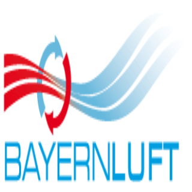

# ioBroker.bayernluft

## Адаптер BayernLuft для ioBroker

Обеспечивает подключение вентиляционного устройства производства [BayernLuft](https://www.bayernluft.de/) к системам IoBroker.

## Отказ от ответственности

**Все названия продуктов и компаний, а также логотипы являются товарными знаками™ или зарегистрированными® товарными знаками соответствующих владельцев. Их использование не подразумевает какой-либо связи с ними или их дочерними компаниями, а также не подразумевает одобрения с их стороны! Этот личный проект ведется в свободное время и не преследует коммерческих целей.**

## Что необходимо сделать?

Для использования этого адаптера необходимо изменить шаблон экспорта устройства.\
&#x20;**Обязательно выполните следующие шаги.**

## Как изменить шаблон?

1. Перейдите в веб-интерфейс вашего устройства.
2. Нажмите на значок шестеренки настроек, чтобы перейти в раздел «Настройки».
3. Прокрутите вниз, пока не увидите «Экспертный режим».
4. Загрузите файл 'export\_iobroker.txt' из этого репозитория GitHub.
5. Готово, настройте устройство в экземпляре адаптера. Стандартный порт устройства — 80.

## Полезная информация

Команды commands.setSpeedIn, commands.setSpeedOut, commands.setSpeedAntiFreeze работают только при выключенном устройстве. Если устройство включено, оно подтверждает выполнение команд, но ничего не происходит (это можно проверить вручную в соответствующих состояниях states.speed\_in, states.speed\_out и states.speed\_antifreeze).

## Кредиты

Этот адаптер не был бы возможен без замечательной работы @Marco15453 ( <https://github.com/Marco15453> ), который создал версию 1.xx этого адаптера. Также выражаем огромную благодарность компании Bayernluft за их отличную поддержку.

## Changelog
<!--
	Placeholder for the next version (at the beginning of the line):
    ### **WORK IN PROGRESS**
-->

### **WORK IN PROGRESS**
- (copilot) Adapter requires node.js >= 22 now
- (copilot) Adapter requires admin >= 7.7.22 now

### 3.1.1 (2026-02-11)
* (mcm1957) Dependencies have been updated

### 3.1.0 (2025-09-07)
* (mcm1957) Adapter requires Admin >= 7.6.17, js-controller >= 6.0.11 and node.js >= 20 now.
* (mcm1957) Dependencies have been updated

### 3.0.0 (2025-02-24)
* (boriswerner) **Breaking Change:** All states from the 2.alpha versions have been removed and the adapter has been completely redesigned. The Bayernlüfter devices need a new export configuration file. Please upload export_iobroker.txt to each of your devices and delete old states.
* (mcm1957) Adapter requires node.js 20, js-controller 6 and admin 7 now.
* (boriswerner) Commands have been implemnted for individual fan speeds (see  WS32240427 in https://www.bayernluft.de/de/wlan32_changelist.html):
    When device is turned off, the fans can be set individually (commands: setSpeedIn, setSpeedOut, setSpeedAntiFreeze)
* (boriswerner) States in "states"-folder have been set to read-only
* (boriswerner) Roles of states have been changed
* (boriswerner) Update interval label and set default port have been fixed
* (mcm1957) Missing values from device are set to null and qs flag is set to 0x82 now
* (mcm1957) Units have been added where appropiate
* (mcm1957) Translations have been added for all supported languages
* (mcm1957) Dependencies have been updated

### 2.0.1 (2025-01-16)
* (mcm1957) AdminUI and translations have been fixed.

### 2.0.0 (2025-01-14)
* (mcm1957) Adapter requires node.js 20, js-controller 6 and and admin 6 now.
* (boriswerner) Corrected the API calls to match the new API (rev 2.0 version WS32231301, see: https://www.bayernluft.de/de/wlan32_changelist.html)
* (boriswerner) Corrected the ACK-handling in onStateChange
* (mcm1957) Adapter has been move to iobroker-community-adapters organization
* (mcm1957) Dependencies have been updated

[Older changelogs can be found there](https://github.com/iobroker-community-adapters/ioBroker.bayernluft/blob/main/CHANGELOG_OLD.md)

## License
MIT License

Copyright (c) 2024-2026 iobroker-community-adapters <iobroker-community-adapters@gmx.de>  
Copyright (c) 2022 Marco15453 <support@marco15453.xyz>

Permission is hereby granted, free of charge, to any person obtaining a copy
of this software and associated documentation files (the "Software"), to deal
in the Software without restriction, including without limitation the rights
to use, copy, modify, merge, publish, distribute, sublicense, and/or sell
copies of the Software, and to permit persons to whom the Software is
furnished to do so, subject to the following conditions:

The above copyright notice and this permission notice shall be included in all
copies or substantial portions of the Software.

THE SOFTWARE IS PROVIDED "AS IS", WITHOUT WARRANTY OF ANY KIND, EXPRESS OR
IMPLIED, INCLUDING BUT NOT LIMITED TO THE WARRANTIES OF MERCHANTABILITY,
FITNESS FOR A PARTICULAR PURPOSE AND NONINFRINGEMENT. IN NO EVENT SHALL THE
AUTHORS OR COPYRIGHT HOLDERS BE LIABLE FOR ANY CLAIM, DAMAGES OR OTHER
LIABILITY, WHETHER IN AN ACTION OF CONTRACT, TORT OR OTHERWISE, ARISING FROM,
OUT OF OR IN CONNECTION WITH THE SOFTWARE OR THE USE OR OTHER DEALINGS IN THE
SOFTWARE.