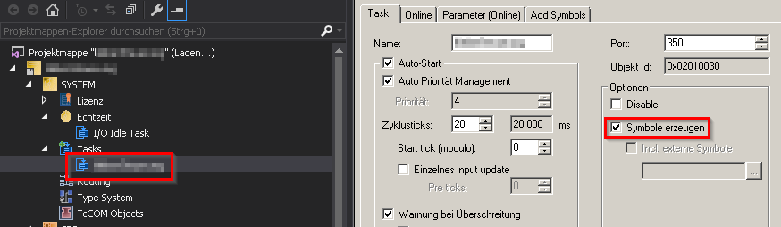
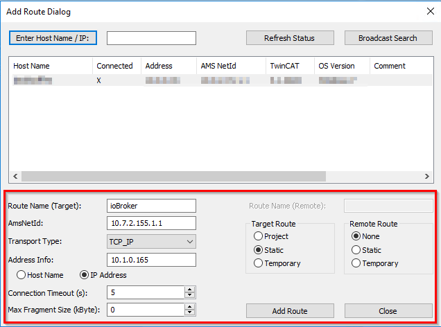

# IoBroker.beckhoff
Этот адаптер ioBroker реализует связь с контроллером Beckhof (Twincat 2 или 3) по протоколу ADS.
Протокол ADS реализован в каждом контроллере Beckhoff и может использоваться без лицензии.

Этот проект не имеет никакого отношения к компании Beckhoff.

## Описание
### Требования
- Beckhoff с сетевым подключением, которое подключено к сети, доступной для ioBroker
  - Контроллеру должен быть назначен фиксированный IP-адрес
  - Контроллер должен быть пропингован ioBroker.
  - TwinCat 2 **кроме элементов управления BC** или TwinCat 3

### Конфигурация контроллера
1. В проекте должна быть активирована ADS. Для этого зайдите в настройку задачи в контрольном проекте и активируйте чекбокс «Создать символы». Затем загрузите конфигурацию в контроллер и перезапустите его. Перезапуск необходим только в том случае, если используется TwinCat 2.

   

2. В контроллере должен быть создан статический маршрут. Маршрут должен соответствовать ioBroker (IP-адрес и AMS-Net-ID).

   Вот пример того, как это может выглядеть, когда маршрут добавляется непосредственно в контроллер. Маршрут также можно добавить через инженерный калькулятор.

   

   Дополнительную информацию о маршрутизаторе TwinCat и управлении в целом можно найти в [Информационная система Бекхофф](https://infosys.beckhoff.com/ 'Beckhoff Information System').

3. При использовании TwinCat 2 в контроллере все равно должна быть создана структура. Затем добавьте структуру в таблицу глобальных переменных. Затем здесь можно создать все необходимые переменные. В этом случае обмен данными осуществляется ADS и адаптером независимо друг от друга.

   ##### Поддерживаемые в настоящее время типы данных: BOOL, BYTE, WORD, DWORD, SINT, USINT, INT, UINT, DINT, UDINT, REAL, LREAL, TIME, TIME_OF_DAY, TOD, DATE, DATE_AND_TIME, DT, STRING
   НЕОБЯЗАТЕЛЬНО: Переменная может быть создана прямо в таблице переменных без вложенности с точным именем -> ioBrokerResync (верхний/нижний регистр и тип данных не имеют значения) -> Каждый раз, когда это значение изменяется, таблица переменных в ioBroker считывается заново .

4. В TwinCat 3 в контроллере также должна быть создана таблица глобальных переменных. Затем здесь можно создать все необходимые переменные. В этом случае обмен данными осуществляется ADS и адаптером независимо друг от друга.

   ##### Поддерживаемые в настоящее время типы данных: BOOL, BYTE, WORD, DWORD, SINT, USINT, INT, UINT, DINT, UDINT, REAL, LREAL, TIME, TIME_OF_DAY, TOD, DATE, DATE_AND_TIME, DT, STRING
   НЕОБЯЗАТЕЛЬНО: Переменная может быть создана прямо в таблице переменных без вложенности с точным именем -> ioBrokerResync (верхний/нижний регистр и тип данных не имеют значения) -> Каждый раз при изменении этого значения таблица переменных в ioBroker считывается заново .

### Настройки адаптера
#### Twincat 3 и Twincat 2
1. Выберите версию среды выполнения
2. Введите целевой IP-адрес и сетевой идентификатор AMS.
3. В TwinCat 2 введите имя экземпляра структуры из таблицы глобальных переменных.
4. Введите правильное имя таблицы переменных для TwinCat 3.
5. Остальные пункты обычно менять не нужно.

#### Twincat 2 <= v2.11.2240
Необходимо загрузить файл \*.tpy из проекта ПЛК. -> Всякий раз, когда что-то изменяется в структуре, отвечающей за связь с ioBroker, этот файл необходимо загрузить снова.

### Обмен данными
- Как только переменная в контроллере изменяется, это значение автоматически переносится в соответствующее состояние в ioBroker.
- Если значение изменяется в ioBroker (важно: ACK должно быть FALSE!!), оно автоматически передается в контроллер. Если значение принимается контроллером, ACK устанавливается в TRUE.

### Важный
1. Маршрутизатор TwinCAT AMS не допускает нескольких соединений TCP с одного и того же хоста. Если два экземпляра настроены с одного и того же хоста на один и тот же маршрутизатор TwinCat, маршрутизатор автоматически закрывает первое соединение и отвечает только на самое новое соединение.
2. Адаптер автоматически синхронизирует все переменные в ioBroker. Существует несколько способов запуска повторной синхронизации:
   - При изменении значения переменной Resyc (см. [здесь](#configuration-of-the-controller))
   - Если контроллер не находится в режиме RUN дольше, чем интервал повторного подключения -> Таблица переменных повторно синхронизируется, когда контроллер переключается в режим RUN.
   - Когда проект загружается в контроллер. Исключение -> OnlineChange
   - При перезапуске адаптера.
3. «Синхронизация» или «Чтение» означает не обмен значениями переменных, а синхронизацию самих переменных и их создание или удаление в ioBroker.

## Changelog

### 1.5.2 (2023-03-21)

- (dkleber89) Fix Adapter Checker Issues

### 1.5.1 (2022-03-19)

- (PLCHome) Add TIME, TIME_OF_DAY, TOD, DATE, DATE_AND_TIME and DT support
- (PLCHome) Support for strings with all char length

### 1.5.0 (2021-09-28)

- (dkleber89) Process next state in list when register subscriptions not before the previous is finish processed in plc

### 1.4.1 (2021-06-13)

- (dkleber89) Some little Adapter maintenance

### 1.4.0 (2021-01-25)

- (dkleber89) Add LREAL Support

### 1.3.0 (2021-01-25)

- (dkleber89) Set correct type for channels

### 1.2.2 (2020-05-30)

- (dkleber89) Clear reconnectTimeout on Adapter unload;

### 1.2.1 (2020-04-20)

- (dkleber89) Add CI over Github Actions; Update Dependencies;

### 1.2.0 (2020-01-02)

- (dkleber89) Add Support for Strings with fixed length to 80 Chars

### 1.1.0 (2019-11-12)

- (dkleber89) Add Support for older TwinCat2 Systems with no autosync

### 1.0.7 (2019-10-25)

- (dkleber89) Add Support for Compact Mode -> JS Controller >= 2.0.0

### 1.0.6 (2019-08-11)

- (dkleber89) Add check change of Datatype on resync

### 1.0.5 (2019-08-10)

- (dkleber89) Eslint, Prettier with Airbnb Codestyle, CI adopted, little random changes in Project Structure

## License

The MIT License (MIT)

Copyright (c) 2018-2023 dkleber89 <dkleber89@gmail.com>

Permission is hereby granted, free of charge, to any person obtaining a copy
of this software and associated documentation files (the "Software"), to deal
in the Software without restriction, including without limitation the rights
to use, copy, modify, merge, publish, distribute, sublicense, and/or sell
copies of the Software, and to permit persons to whom the Software is
furnished to do so, subject to the following conditions:

The above copyright notice and this permission notice shall be included in
all copies or substantial portions of the Software.

THE SOFTWARE IS PROVIDED "AS IS", WITHOUT WARRANTY OF ANY KIND, EXPRESS OR
IMPLIED, INCLUDING BUT NOT LIMITED TO THE WARRANTIES OF MERCHANTABILITY,
FITNESS FOR A PARTICULAR PURPOSE AND NONINFRINGEMENT. IN NO EVENT SHALL THE
AUTHORS OR COPYRIGHT HOLDERS BE LIABLE FOR ANY CLAIM, DAMAGES OR OTHER
LIABILITY, WHETHER IN AN ACTION OF CONTRACT, TORT OR OTHERWISE, ARISING FROM,
OUT OF OR IN CONNECTION WITH THE SOFTWARE OR THE USE OR OTHER DEALINGS IN
THE SOFTWARE.
