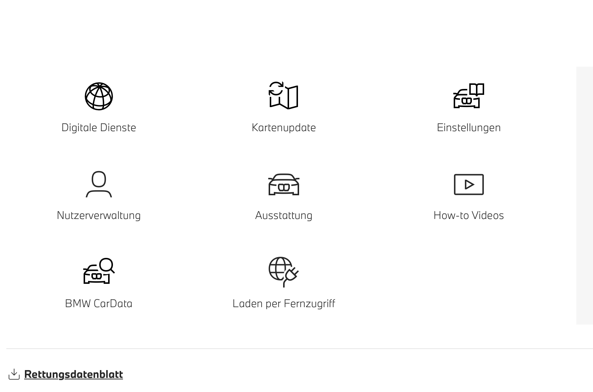
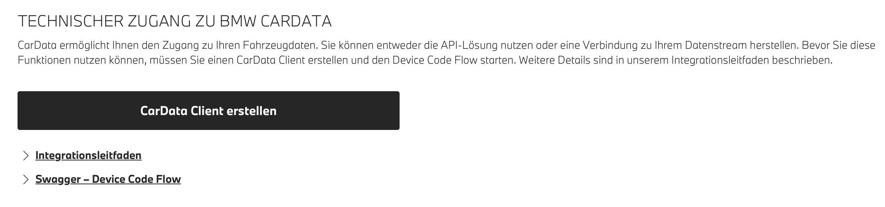
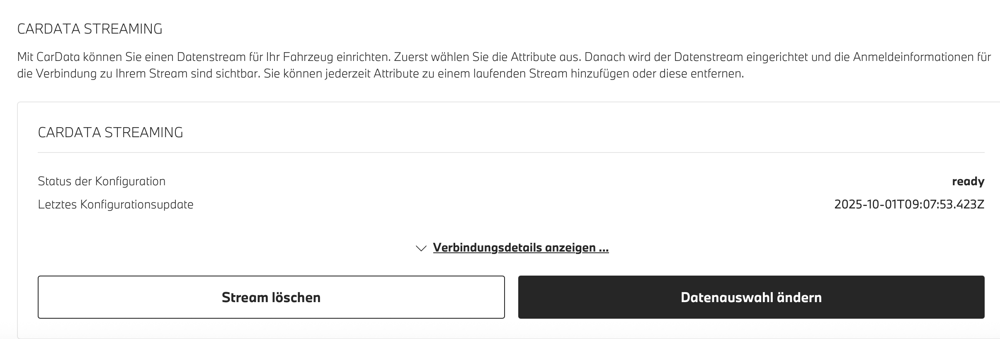

# IoBroker.bmw
## Версии
# Адаптер BMW для ioBroker
Этот адаптер интегрирует автомобили BMW в ioBroker, используя новый API BMW CarData с аутентификацией OAuth2 и потоковой передачей данных по протоколу MQTT в реальном времени. Он обеспечивает комплексный мониторинг данных об автомобилях BMW для всех моделей, связанных с вашей учетной записью BMW.

## Обновление данных во время зарядки
Во время зарядки может случиться так, что уровень заряда батареи не обновляется в потоке, поскольку автомобиль находится в спящем режиме/режиме ожидания. После включения автомобиля данные будут обновлены. Вы можете инициировать обновление через API `bmw.0.vin.remote.fetchViaAPI`

## Описание точки данных
Подробное описание данных можно найти здесь [telematic.json](telematic.json)

## Инструкции по настройке
### 1. Настройка портала BMW ConnectedDrive
1. Посетите портал BMW ConnectedDrive: **https://www.bmw.de/de-de/mybmw/vehicle-overview** или https://www.mini.de/de-de/mymini/vehicle-overview
2. Перейдите в раздел **BMW CarData** (вы увидите различные категории услуг).

3. Нажмите кнопку **"CarData Client erstellen"** (Создать клиент CarData).
4. Скопируйте client_id
5. Подождите 30 секунд.
6. Нажмите на CarData API
7. Подождите 30 секунд.
8. Нажмите «Потоковая передача CarData».

# **ВАЖНО**: Нажмите на одну из служб и подождите 30 секунд. Если появится сообщение об ошибке, нажмите еще раз. Не нажимайте на "Gerät Authentifizieren/Devict authentication". Введите client_id в настройках iobroker. Если это не работает, попробуйте ввести все буквы строчными.
### 2. Настройка потоковой передачи CarData
**НЕОБХОДИМО НАСТРОИТЬ ПОТОКОВУЮ ПЕРЕДАЧУ КАРДАТЫ И ВЫБРАТЬ ВСЕ 244 ТОЧКИ ДАННЫХ**

После создания идентификатора клиента настройте потоковую передачу:

1. В разделе CarData найдите пункт **"CARDATA STREAMING"**.
2. Вы должны увидеть статус конфигурации как **готово**.
3. Обратите внимание на временную метку **Letztes Konfigurationsupdate** (последнее обновление конфигурации).

4. Нажмите кнопку **Datenauswahl ändern** (Изменить выбор данных).
5. **Выберите ВСЕ категории** (Состояние автомобиля, Зарядка, Данные о поездке и т. д.)
6. **Вручную проверьте ВСЕ 244 отдельных точки данных**
7. Или введите это в консоли разработчика Google, нажав F12: `document.querySelectorAll('label.chakra-checkbox:not([data-checked])').forEach(l => l.click());`
8. Сохраните конфигурацию, нажав кнопку «Stream löschen» (при необходимости сбросьте настройки), а затем выполните повторную настройку.

**Без выбора всех точек данных потоковая передача MQTT не предоставит полные данные!**

### 3. Настройка адаптера
1. Введите свой **идентификатор клиента** в настройках адаптера.
2. Введите ваше **имя пользователя для потоковой передачи CarData** (его можно найти на портале BMW в разделе CarData > Потоковая передача).
3. Выберите марку вашего автомобиля (BMW, Mini, Toyota Supra)
4. Установите **интервал обновления** (минимум 10 минут из-за квоты API).
5. При необходимости настройте **список игнорирования VIN-кода**.

### 4. Процесс аутентификации
1. Включите адаптер.
2. Проверьте журналы на наличие URL-адреса авторизации OAuth2.
3. Перейдите по указанному URL-адресу и войдите в систему, используя свою учетную запись BMW.
4. Авторизовать заявку
5. После авторизации адаптер автоматически продолжит работу.

## Структура данных
Данные об автомобиле организованы в разделе `bmw.0.VIN.*`, где `VIN` обозначает идентификационный номер вашего транспортного средства:

### Структура основных папок
- **`bmw.0.VIN.api.*`** - Данные API (периодические обновления)
— Данные получены через REST API BMW CarData с использованием .remote.
- Использует квоту API (50 вызовов в течение 24 часов)

- **`bmw.0.VIN.stream.*`** - Потоковые данные (MQTT в реальном времени)
- Данные, полученные через потоковую передачу MQTT в реальном времени или удаленную функцию fetchViaAPI.
- Мгновенное обновление при изменении данных об автомобиле
- Включает все 244 настроенные точки данных

### Доступные конечные точки API (настраиваемые)
Вы можете включить/отключить эти конечные точки в настройках адаптера (BMW CarData API v1):

- `bmw.0.VIN.api.basicData.*` - Информация об автомобиле: модель, марка, серия ✅ **(По умолчанию: Включено)**
- `bmw.0.VIN.api.chargingHistory.*` - Сеансы зарядки и история ✅ **(По умолчанию: Включено)**
- `bmw.0.VIN.api.image.*` - Изображение автомобиля для отображения.
- `bmw.0.VIN.api.locationBasedChargingSettings.*` - Настройки и параметры зарядки, зависящие от местоположения.
- `bmw.0.VIN.api.smartMaintenanceTyreDiagnosis.*` - Интеллектуальная система технического обслуживания, диагностика состояния шин.

### Метаданные
- `bmw.0.VIN.lastStreamViaAPIUpdate` - Метка времени последнего обновления данных (API)
- `bmw.0.VIN.lastStreamUpdate` - Метка времени последнего обновления потока MQTT

## Обновления в режиме реального времени
Адаптер получает обновления в реальном времени через потоковую передачу MQTT, когда:

- Автомобиль не находится в спящем режиме/режиме ожидания.
- Изменения состояния автомобиля (двери, окна, фары)
- Обновления статуса зарядки
- Изменение местоположения во время движения
- Активация системы климат-контроля
- Уведомления о сервисных событиях

## Удаленные команды
**Доступные пульты дистанционного управления:**

API BMW CarData доступен только для чтения, поэтому этот адаптер не предоставляет функциональность управления автомобилем. Для дистанционного управления используйте:

**Официальные решения BMW:**

- **Мобильное приложение MyBMW** - Полная функциональность дистанционного управления
- **Портал BMW ConnectedDrive** - Веб-интерфейс для управления автомобилем
- **Навык BMW Alexa** - Интеграция голосового управления с Amazon Alexa для таких команд, как:
— «Алекса, попроси BMW заблокировать мою машину»
— «Алекса, попроси BMW включить климат-контроль»
— «Алекса, попроси BMW включить мне фары»

**В этом адаптере доступны следующие пульты дистанционного управления:**

- `fetchViaAPI` - Получение последних телематических данных через API контейнера
- `basicData` - Обновить основную информацию об автомобиле (модель, марка, серия)
- `chargingHistory` - Получение данных о сеансах зарядки за последние 30 дней
- `image` - Получить изображение текущего транспортного средства
- `locationBasedChargingSettings` - Получение настроек зарядки в зависимости от местоположения.
- `smartMaintenanceTyreDiagnosis` - Получение данных диагностики шин

Примечание: Это только команды для получения данных — API BMW CarData не поддерживает команды управления автомобилем.

## Поиск неисправностей
### Проблемы с аутентификацией (ошибка 400 при запросе)
Если возникнут ошибки аутентификации:

1. Убедитесь, что API CarData активирован для вашего идентификатора клиента.
2. Убедитесь, что функция потоковой передачи CarData включена.
3. Убедитесь, что выбраны все 244 точки данных.
4. Рассмотрите возможность повторной генерации вашего идентификатора клиента.

### Нет данных MQTT
Если вы не получаете обновления в режиме реального времени:

1. Убедитесь, что услуга CarData Streaming оформлена и активна.
2. Убедитесь, что выбраны все дескрипторы данных (244 точки).
3. Убедитесь, что ваш автомобиль поддерживает потоковую передачу CarData.
4. Перезапустите адаптер после внесения изменений в конфигурацию дескриптора.

### Превышена квота API
Адаптер автоматически управляет ограничением в 50 вызовов API за 24 часа:

— **Отключите ненужные конечные точки API** в настройках адаптера, чтобы уменьшить использование квоты.
- Увеличьте интервал обновления, если часто превышаете лимиты квоты.
- Потоковая передача данных по протоколу MQTT не учитывается в рамках квоты API и обеспечивает передачу данных в режиме реального времени.
- Каждая включенная конечная точка API использует один вызов квоты за интервал обновления.

### Отсутствуют данные в папке API
Если вы не видите ожидаемых данных в `VIN.api.*`:

1. Проверьте, включена ли соответствующая конечная точка в настройках адаптера.
2. Убедитесь, что вы не превысили квоту API (проверьте журналы адаптера).
3. Некоторые конечные точки могут быть недоступны для всех типов транспортных средств.
4. Проверьте журналы адаптера на наличие ошибок конкретных конечных точек (404, 403 и т. д.).

### Понимание источников данных
- **`VIN.api.*`** - Обновляется периодически в зависимости от интервала и включенных конечных точек.
- **`VIN.stream.*`** - Обновляется в режиме реального времени через MQTT при изменении данных об автомобиле.
- **`VIN.lastUpdate`** - Временная метка последнего обновления данных (API или MQTT)
- **`VIN.lastStreamUpdate`** - Временная метка последнего обновления потока MQTT

## Источник
Этот адаптер можно приобрести по адресу: [https://github.com/TA2k/ioBroker.bmw](https://github.com/TA2k/ioBroker.bmw)

## Changelog

<!--
  Placeholder for the next version (at the beginning of the line):
  ### **WORK IN PROGRESS**
-->

### **WORK IN PROGRESS**

- (hombach) fix repo checker warnings
- (hombach) update dependencies

### 4.3.4 (2026-02-28)

- enhance docu and logging
- (hombach) fix vulnerability
- (hombach) update dependencies

### 4.3.3 (2026-01-02)

- (hombach) year 2026 changes
- (hombach) update dependencies

### 4.3.2 (2025-12-15)

- update telemetry ids for container creation
- optimize dependabot config (#209)

### 4.3.1 (2025-10-11)

- fix gps coordinate parsing

### 4.3.0 (2025-10-09)

- improve logs
- add autocast
- add descriptions

### 4.2.0 (2025-10-04)

- improve token refresh
- fix image fetching

### 4.1.1 (2025-10-03)

- Add API fetching via Container and move other apis to manually fetching

### 4.0.5 (2025-10-01)

- **BREAKING:** Complete migration to BMW CarData API with OAuth2 Device Flow authentication
- **BREAKING:** Removed username/password authentication (deprecated by BMW)
- **BREAKING:** Removed all remote control functionality (CarData API is read-only)
- **BREAKING:** Removed second user support and CAPTCHA requirements
- **NEW:** Real-time MQTT streaming for instant vehicle data updates
- **NEW:** OAuth2 Device Code Flow authentication with PKCE
- **NEW:** API quota management system (50 calls per 24 hours)
- **NEW:** Configurable API endpoint selection to manage quota usage
- **NEW:** Organized folder structure: api/ for periodic updates, stream/ for real-time data
- **NEW:** Enhanced state management with proper object creation
- **NEW:** Modern JSON-based configuration interface (jsonConfig.json)
- **NEW:** Comprehensive setup documentation with BMW portal integration
- **FIXED:** MQTT message processing logic for correct data validation
- **FIXED:** State creation issues preventing "no existing object" errors
- **IMPROVED:** Removed unused dependencies (cookie handling, legacy auth)
- **IMPROVED:** Enhanced error handling with specific guidance for common issues

### 3.0.1 (2025-09-27)

- (hombach) change to recommended stable admin 7.6.17 (#159)
- (hombach) migrate to iobroker/eslint-config (#146)
- (hombach) fix form-data vulnerability
- (hombach) code cleanups
- (hombach) update axios
- (hombach) bump adapter-core
- (hombach) fix issues detected by repository checker (#170)
- (hombach) bump dependencies

### 3.0.0 (2025-06-10)

- BREAKING: Dropped support for Node.js 18 (#88)
- (hombach) BREAKING: Dropped support for js-controller 5 (#111)
- (hombach) BREAKING: change to admin 7.4.10 as recommended by ioBroker (#111)
- (hombach) encrypt and protect second user password - has to be reentered (#111)
- (hombach) bump dependencies

### 2.9.5 (2025-05-18)

- (hombach) update axios
- (hombach) fixing issues detected by repository checker (#88)
- (hombach) some small code cleanups/modernisations
- (hombach) add/translate description
- (hombach) update logo

### 2.9.4 (2025-02-26)

- fix for Mitbenutzer Feature

### 2.9.3 (2025-01-29)

- fix remote controls
- add Mitbenutzer Login for remote controls

### 2.9.0 (2024-11-28)

- added new remotes as switch and updated values
- added retry logic for remotes

### 2.8.4 (2024-11-21)

- improved charging session parsing
- added remote to fetch charging session from a specific month
- added raw JSON of charging session for export

### 2.8.3 (2024-11-18)

- login fixed

### 2.8.2 (2024-10-05)

- fix error getvehicles v2 failed

### 2.8.1 (2024-09-30)

- fix remote commands

### 2.7.1

- Bugfixes

### 2.5.5

- Fix login

### 2.5.0

- Fix login

### 2.4.1

- Add support for MINI and force refresh remote

### 2.3.0

- Disable v1 Endpoints

### 2.1.1

- Upgrade to statusV2 and remoteV2

### 2.0.0

- (TA2k) initial release

## License

MIT License

Copyright (c) 2021-2026 TA2k <tombox2020@gmail.com>

Permission is hereby granted, free of charge, to any person obtaining a copy
of this software and associated documentation files (the "Software"), to deal
in the Software without restriction, including without limitation the rights
to use, copy, modify, merge, publish, distribute, sublicense, and/or sell
copies of the Software, and to permit persons to whom the Software is
furnished to do so, subject to the following conditions:

The above copyright notice and this permission notice shall be included in all
copies or substantial portions of the Software.

THE SOFTWARE IS PROVIDED "AS IS", WITHOUT WARRANTY OF ANY KIND, EXPRESS OR
IMPLIED, INCLUDING BUT NOT LIMITED TO THE WARRANTIES OF MERCHANTABILITY,
FITNESS FOR A PARTICULAR PURPOSE AND NONINFRINGEMENT. IN NO EVENT SHALL THE
AUTHORS OR COPYRIGHT HOLDERS BE LIABLE FOR ANY CLAIM, DAMAGES OR OTHER
LIABILITY, WHETHER IN AN ACTION OF CONTRACT, TORT OR OTHERWISE, ARISING FROM,
OUT OF OR IN CONNECTION WITH THE SOFTWARE OR THE USE OR OTHER DEALINGS IN THE
SOFTWARE.