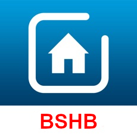

# ioBroker.bshb

## адаптер bosch-smart-home-bridge для ioBroker

Этот адаптер позволяет взаимодействовать с устройствами умного дома Bosch.

[Контроллер умного дома Bosch](https://www.bosch-smarthome.com/de/de/produkte/smart-system-solutions/smart-home-controller)

Для этого используется библиотека [bosch-smart-home-bridge](https://github.com/holomekc/bosch-smart-home-bridge) , которая использует информацию из официального [локального REST API контроллера умного дома Bosch](https://github.com/BoschSmartHome/bosch-shc-api-docs) .

Обсуждение адаптера BSHB на форуме IoBroker: <https://forum.iobroker.net/topic/25370/test-adapter-bshb-bosch-smart-home-v0-0-x/>

Примеры: <https://github.com/holomekc/ioBroker.bshb/wiki/Examples>

Работа продолжается. Будем благодарны за отзывы.

Если вы хотите поддержать мою работу, я буду признателен за небольшое пожертвование. Это абсолютно добровольно и не является обязательным условием для использования адаптера. Ссылка находится вверху страницы.

## Changelog
### 0.6.3 (2026-05-15)

* (holomekc) Migrate from yarn to npm
* (holomekc) Adopt ioBroker standard release workflow
* (holomekc) Drop Node.js 20, require >= 22
* (holomekc) Update dependencies
* (holomekc) Use node: prefix for built-in modules

### 0.6.2

* (holomekc) update dependency

### 0.6.1

* (holomekc) adapter post install step
* Dependencies updated

### 0.6.0

* (holomekc) semantic-release
* (holomekc) release
* (holomekc) yarn
* (holomekc) update dependencies and fix missing room bug
* Dependencies updated

### 0.5.2

* Dependencies updated

## License

The MIT License (MIT)

Copyright (c) 2025-2026 Christopher Holomek <holomekc.github@gmail.com>

Permission is hereby granted, free of charge, to any person obtaining a copy
of this software and associated documentation files (the "Software"), to deal
in the Software without restriction, including without limitation the rights
to use, copy, modify, merge, publish, distribute, sublicense, and/or sell
copies of the Software, and to permit persons to whom the Software is
furnished to do so, subject to the following conditions:

The above copyright notice and this permission notice shall be included in
all copies or substantial portions of the Software.

THE SOFTWARE IS PROVIDED "AS IS", WITHOUT WARRANTY OF ANY KIND, EXPRESS OR
IMPLIED, INCLUDING BUT NOT LIMITED TO THE WARRANTIES OF MERCHANTABILITY,
FITNESS FOR A PARTICULAR PURPOSE AND NONINFRINGEMENT. IN NO EVENT SHALL THE
AUTHORS OR COPYRIGHT HOLDERS BE LIABLE FOR ANY CLAIM, DAMAGES OR OTHER
LIABILITY, WHETHER IN AN ACTION OF CONTRACT, TORT OR OTHERWISE, ARISING FROM,
OUT OF OR IN CONNECTION WITH THE SOFTWARE OR THE USE OR OTHER DEALINGS IN
THE SOFTWARE.