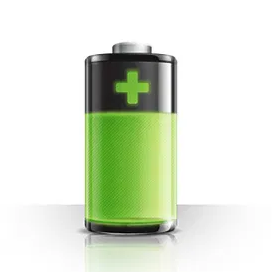

## Адаптер bydhvs для ioBroker
Данные опроса аккумуляторов BYD HVS

## Английский:
## Вступление
Этот адаптер принимает данные от аккумуляторной батареи byd (https://www.bydbatterybox.com/) и помещает их в точки данных адаптера. К сожалению, нет официального API и документации, поэтому я использовал wirehark и byd-hvs-simulater, чтобы попытаться понять общение. Мой адаптер имитирует byd-app, отправляет на устройство похожие пакеты и анализирует ответы.

## Будь осторожен
В приложении beConnect есть два шага: на первом вы получаете обычные данные, на втором шаге вы получаете подробные данные для всех ячеек (температура и напряжение отдельных ячеек и некоторые другие подробности). быть задержкой после одного из пакетов данных, пока я не смогу получить результат. Я думаю, что тем временем измеряются все клетки, но я не уверен. Поэтому я ограничил частоту чтения подробных данных, это делается только за "n" чтений обычных данных, вы можете изменить эту настройку. Если вам не нужны подробные данные: вы можете отключить эту часть.

## Подсказка для систем с 5 модулями
Люди, у которых 5 модулей: данные ячейки читаются только для первых 4 модулей - протокол одинаковый для 2-4 модулей. Я хотел бы расширить его на 5 модулей, но либо кто-то купит мне три недостающих модуля ;-), чтобы я мог проанализировать протокол, либо я получу захват wirehark из рабочего соединения.

## Настройки
Интервал: Это просто: как часто (а) должны опрашиваться данные IP-адрес: Это самоочевидно. Либо вы используете стандартный адрес (192.168.16.254) и меняете маршрутизацию дома, например: https://www.photovoltaikforum.com/thread/150898-byd-hvs-firmware-update/?postID=2215343#post2215343. Преимущество: приложение beConnect тоже работает. Другая возможность: вы меняете IP-адрес ящика. Но: будьте осторожны: текст на веб-странице сбивает с толку, и если вы не совсем уверены в том, что делаете: ПОЖАЛУЙСТА, не трогайте настройки. На немецких форумах я читал отзывы людей, которые были заблокированы в своей системе, и пути назад нет, либо byd отправит вам замену HVU, либо вам придется купить новый.
Детали батареи: Как объяснено выше: Вам нужны детали батареи? Если да: установите checkobx.
Сведения о батарее - каждые ... циклы: Также, как и выше, должен быть отключен тестовый режим - показывать данные в журнале ошибок: если вы установите этот флажок: отправленные и полученные данные отображаются в журнале ошибок, поэтому вы можете легко загрузить данные и присылайте их мне в случае ошибок.

## Немецкий:
## Ein wenig Erklärungen:
Принцип работы адаптера для Анализа Датыпакета zwischen der BYD-App и BYD-Akku-System Entstanden. Es werden im Wesentlichen die Daten aus dem TAB System Info и aus dem TAB Diagnosis dargestellt. Offensichtlich sind die Daten für "System Info" sofort in der Batterie bereit zum abholen, für die Diagnose-Daten sieht es so aus als wäre ein Messvorgang erforderlich, zwischen der Abfrage und den Werten muss ein Zeitintervall ein Zeitintervall vonden von.

Daher lasse ich die Diagnose-Daten auch nicht bei jeder Abfrage der Daten mit ermitteln.

## Zu den Einstellungen:
Интервал: Zeitlicher Abstand zwischen den Abfragen des Adapters

IP-адрес: Eigentlich logisch, Damit ist die IP-Adresse des Adapters gemeint. Dafür gibt es zwei Möglichkeiten: Entweder hält man sich an die Anleitung von Becker3 aus dem Photovoltaik-Forum, его ссылка: https://www.photovoltaikforum.com/thread/150898-byd-hvs-firmware-update/? 2215343 # post2215343. Das hat den Vorteil das auch die BYD-APP läuft und man mit dieser direkt an die Daten, auch zum Vergleich, herankommt. Один человек может передать IP-адрес в BYD-Box в соответствии с DHCP-адресом. Ausdrücklich waren möchte ich vor Änderungen an den IP-Einstellungen der BOX! Im Forum kann man Berichte von Leute lesen die sich die Erreichbarkeit der Box dauerhaft ruiniert haben.

Batterie-Details: Steuerung, ob die Details zu den Zellen gelesen werden sollen

Lesezyklen zu Batterie-Details: Anzahl der "Normal-Lese-Zyklen" bis wieder einmal die Diagnose-Daten gelesen werden. Hier die Warnung dazu: Ich habe keine Idee ob man sich durch häufige Diagnose-Messungen Nachteile einhandelt, daher empfehle ich den Wert möglichst hoch zu setzen. Ich wüsste auch nicht was man mit den Diagnose-Daten im regelmäßigen Poll anfangen sollte.

Zu den Batterie-Größen: Der Adaptor funktioniert auch für Zelltemperan und ZellSpannungen bei 2,3 und 4 Batterie-Modulen. Bei einem System mit 5 Modulen werden nur die Zellspannungen der ersten 128 Zellen angezeigt. Für die Zellen 129 bis 160 ist mir nicht bekannt wo die Daten gespeichert werden. Ich würde das gerne mit in den Adapter einbauen, benötige aber dafür einen Wireshark-Mittschnitt der Kommunikation zwischen der beConnect App und dem Speicher. Ich helfe auch gerne wenn jemand nicht weiß wie man den Mittschnitt machen kann, автор по Teamviewer или по сообщениям на форуме. Offensichtlich funktioniert die Kommunikation für die 5. Einheit anders als bei den ersten 4 Einheiten.

## Changelog
<!--
	Placeholder for the next version (at the beginning of the line):
	### __WORK IN PROGRESS__
-->
### 1.2.3 (2021-06-18)
*changed ratio of logo

### 1.2.2 (2021-06-14)
* bump to new patch-level (to get rid of the "-0")

### 1.2.2-0 (2021-05-30)
* Create States for Diagnose-Data only if necessary
* changes according review of the adapter

### 1.2.1 (2021-05-20)
* Power is now fixed with 2 number after the decimal point
* bug removed, cell voltage for cell 64 works now

### 1.2.0 (2021-05-15)
* preparation for being listed in official repository
* English part in readme.md
* removed State.ErrorNum totally in code, datapoint has to be deleted manually - I did not found a way to do it with JS
* hopefully works with HVM and HVS and possibly with HVL (only American market)
* redesign and more robust detection: number of cells for voltage and temperature
* New: inverter type
* New: type of battery 
* compatibility with new js-controller 3.3
* compatibility with nodejs 15
* compatibility with admin UI 5

###

## License
MIT License

Copyright (c) 2021 Christian <github@familie-herrmann.de>

Permission is hereby granted, free of charge, to any person obtaining a copy
of this software and associated documentation files (the "Software"), to deal
in the Software without restriction, including without limitation the rights
to use, copy, modify, merge, publish, distribute, sublicense, and/or sell
copies of the Software, and to permit persons to whom the Software is
furnished to do so, subject to the following conditions:

The above copyright notice and this permission notice shall be included in all
copies or substantial portions of the Software.

THE SOFTWARE IS PROVIDED "AS IS", WITHOUT WARRANTY OF ANY KIND, EXPRESS OR
IMPLIED, INCLUDING BUT NOT LIMITED TO THE WARRANTIES OF MERCHANTABILITY,
FITNESS FOR A PARTICULAR PURPOSE AND NONINFRINGEMENT. IN NO EVENT SHALL THE
AUTHORS OR COPYRIGHT HOLDERS BE LIABLE FOR ANY CLAIM, DAMAGES OR OTHER
LIABILITY, WHETHER IN AN ACTION OF CONTRACT, TORT OR OTHERWISE, ARISING FROM,
OUT OF OR IN CONNECTION WITH THE SOFTWARE OR THE USE OR OTHER DEALINGS IN THE
SOFTWARE.