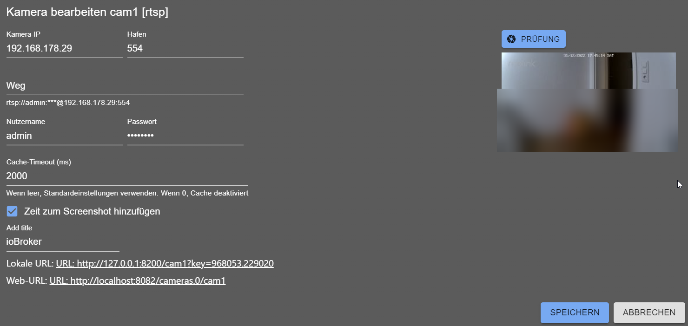

# IoBroker.cameras
## Адаптер IP-камер для ioBroker
Вы можете интегрировать свои веб/IP-камеры в vis и другие средства визуализации.
Если вы настроите камеру с именем `cam1`, она будет доступна на веб-сервере по адресу `http(s)://iobroker-IP:8082/cameras.0/cam1`.

**Используйте именно этот URL-адрес - без расширения файла.** Каждый запрос к нему получает новый кадр с камеры, поэтому периодическая перезагрузка обеспечивает отображение изображения в реальном времени.

Адаптер дополнительно сохраняет последний кадр в файл под именем `cameras.0/cam1.jpg`, который веб-сервер также обслуживает под именем `http(s)://iobroker-IP:8082/cameras.0/cam1.jpg`. Этот файл перезаписывается только при запуске адаптера и при обработке сообщения `image` - он **не** обновляется при запросе. Поэтому при наведении виджета на `.jpg` отображается изображение, которое никогда не обновляется, независимо от заданного интервала обновления.

Кроме того, изображение можно запросить через сообщение:

```js
sendTo('cameras.0', 'image', {
    name: 'cam1',
    width: 100, // optional
    height: 50, // optional
    angle: 90,   // optional
    noCache: true // optional, if you want to get the image not from cache
}, result => {
    const img = 'data:' + result.contentType + ';base64,' + result.data;
    console.log('Show image: ' + img);
});
```

Результат всегда отображается в формате `jpg`.

### Отправка изображения в мессенджер
`result.data` - это JPEG-файл в виде строки base64, поэтому его нельзя передать в мессенджер напрямую. Сначала преобразуйте его в `Buffer` или файл. В скрипте JavaScript-адаптера (также доступном в Blockly через блок *функция JavaScript*):

```js
sendTo('cameras.0', 'image', { name: 'cam1' }, result => {
    if (result.error) {
        log(`Cannot get image: ${result.error}`, 'warn');
        return;
    }
    const image = Buffer.from(result.data, 'base64');

    // Telegram accepts the buffer directly
    sendTo('telegram.0', 'send', { text: image, type: 'photo', caption: 'cam1' });

    // Every other adapter gets a file path, e.g. pushover, signal or email attachments
    const fileName = createTempFile('cam1.jpg', image);
    sendTo('pushover.0', 'send', { message: 'cam1', file: fileName });
});
```

Поддерживаемые камеры:

- Более 50 производителей с указанием моделей, например, Hikvision, Dahua, Axis, Reolink (включая E1 Pro), Foscam, TP-Link/Tapo.
- `Eufy` через адаптер `eusec`
- `UniFi Protect` - каждая камера, управляемая консолью UniFi или видеорегистратором (NVR), см. ниже.
- [HiKam](https://support.hikam.de/support/solutions/articles/16000070656-zugriff-auf-kameras-der-2-generation-via-onvif-f%C3%BCr-s6-q8-a7-2-generation-) второго и третьего поколения через ONVIF (для S6, Q8, A7 2. Generation), A7 Pro, A9
- [WIWICam M1 через адаптер HiKam](https://www.wiwacam.com/de/mw1-minikamera-kurzanleitung-und-faq/)
- Поддержка RTSP (если ваша камера поддерживает протокол RTSP)
- Скриншоты через HTTP-адрес - если вы можете получить снимок с вашей камеры через URL-адрес.

### Добавление камеры
В диалоговом окне сначала запрашивается **производитель**. После этого отображаются только подходящие варианты:

- **Универсальный (пользовательский URL / RTSP)** для URL-адреса снимка (с базовой аутентификацией или без нее) или потока RTSP.

Поток RTSP принимает весь канал связи, например, `rtsp://192.168.1.10:554/stream1` или `rtsps://...`; вход в систему по каналу связи перемещается в поля имени пользователя и пароля.

- Производитель, имеющий собственную реализацию (Eufy, HiKam, INSTAR, UniFi Protect), предлагает её как *Connection*.

рядом со списком моделей, если он есть у производителя.

- Каждый второй производитель выводит список своих моделей. Основное поле - это **путь потока**: в списке отображаются пути

Производитель отсортировал результаты по количеству используемых моделей, поэтому нужный вариант обычно находится в числе первых. *Указание модели для поиска* необязательно и лишь сужает список. Также можно ввести собственный путь.

Сохраненная конфигурация сохраняет свой формат, существующие камеры отображаются с указанием производителя. Прежний тип `Reolink E1` устарел: он по-прежнему работает, больше не предлагается для новых камер, а его диалоговое окно одним щелчком преобразует его в список моделей `Reolink`.

### UniFi Protect
Protect передаёт потоковое видео с каждой камеры с консоли, поэтому адрес - это адрес консоли (или NVR), а не камеры. Вместо учётных данных ссылка на поток содержит токен: `rtsp://<console>:7447/<token>` или `rtsps://<console>:7441/<token>?enableSrtp`.
Сам Protect всегда использует эти два порта. Поле *RTSP-порт* необходимо только в том случае, если доступ к консоли осуществляется через переадресацию портов или прокси; если оно пустое, используется значение RTSPS.

Существует два способа настройки камеры:

- **С помощью ключа API** (Protect 5.3 или новее): создайте ключ в *UniFi OS → Настройки → Панель управления →

В разделе «Интеграции»* введите его вместе с IP-адресом консоли и нажмите «Загрузить камеры». После этого токен считывается из Protect при каждом запуске, и Protect делает снимки (примерно за 0,3 с, `ffmpeg` не требуется).
Если у Protect еще нет RTSP-потока для выбранного качества, адаптер включает его - аналогично включению «RTSP» для камеры в пользовательском интерфейсе Protect.

- **Только с токеном**: включите RTSP для камеры в Protect и вставьте ссылку (или только её последнюю часть) в

*Токен потока*. Затем снимки декодируются из потока с помощью `ffmpeg`.

**Рекомендуется: введите оба параметра.** Ключ API поддерживает актуальность токена - Protect выдает новый токен при выключении и повторном включении RTSP или при повторном подключении камеры, и токен, введенный вручную, перестает работать до тех пор, пока не будет заменен.
Токен остается в качестве резервного: если API недоступен или ключ был удален, поток используется с настроенным токеном, а снимки берутся из `ffmpeg`.

Используйте **только токен**, если вы не хотите предоставлять ioBroker ключ API - ключ открывает весь API Protect, все камеры и их настройки, в то время как токен предоставляет доступ только для чтения к одному потоку - или если ваша версия Protect старше 5.3. В обоих случаях для потоковой передачи в реальном времени используется протокол RTSP/RTSPS с токеном; ключ влияет только на снимки и способ получения токена.

Консоль использует самоподписанный сертификат, который не проверяется для этих запросов. Многие камеры Protect отправляют H.265; снимки делаются только из ключевых кадров, в противном случае первое изображение представляет собой серую область. API снимков Protect знает только высокое и низкое разрешение, поэтому *среднее* разрешение соответствует высокому.

### Эуфи
После установки адаптера [eusec](https://github.com/bropat/ioBroker.eusec) в диалоговом окне отображаются камеры и дверные звонки по именам из приложения Eufy:

- Камера **с поддержкой RTSP** использует ссылку, предоставляемую `eusec` в `rtsp_stream_url`. Для неё включен протокол RTSP.

автоматически; если ссылка не отображается, включите протокол RTSP для камеры в приложении Eufy.

- Камера **без RTSP** (многие камеры с батарейным питанием) помечена как *трансляция в реальном времени через станцию*: для получения изображения адаптер нажимает кнопку

`start_stream` из `eusec`, который передает изображение с камеры через станцию на собственный go2rtc и делает снимок оттуда. Первый снимок занимает несколько секунд, и каждый раз камера с разряженной батареей активируется. `eusec` завершает поток после *максимальной продолжительности прямой трансляции*; изображения, полученные в течение этого времени, не активируют камеру снова. Такая камера активируется только по запросу - в отличие от всех других типов, она не получает изображение в начале работы адаптера, что разряжало бы ее батарею при каждом перезапуске. RTSP-сервер go2rtc в `eusec` не должен требовать авторизации - его пароль является защищенной настройкой `eusec`, которую другие адаптеры не могут прочитать.

Без `eusec` доступ к камере с протоколом RTSP возможен по её IP-адресу.

### URL изображения
Это обычный URL-запрос, где все параметры находятся в URL. Например, `http://mycam/snapshot.jpg`

### Изображение по URL с базовой аутентификацией
Это запрос изображения по URL, где все параметры указаны в URL, но вы можете указать учетные данные для базовой аутентификации. Например, `http://mycam/snapshot.jpg`

Оба типа URL-адресов, а также HTTP-пути списков моделей, также принимают **поток MJPEG** (`multipart/x-mixed-replace`, часто `.../video.mjpg` или `.../mjpg/video.cgi`): берется первый кадр, и соединение закрывается, `ffmpeg` не требуется. Видеопоток по HTTP (ASF, MP4 и т. д.) таким способом декодировать невозможно; он сразу же завершается ошибкой с указанием использовать URL-адрес снимка или RTSP камеры.

### FFmpeg
Для доступа к снимкам с RTSP-камер можно использовать `ffmpeg`. Необходимо установить `ffmpeg` в вашей системе:

- В Windows уже есть предварительно скомпилированный `ffmpeg`, и ничего скачивать не нужно. (Версия для Windows взята отсюда: https://www.gyan.dev/ffmpeg/builds/ffmpeg-git-full.7z)
- Linux: `sudo apt-get install ffmpeg -y`

Многие камеры передают H.265. При объединении двух ключевых кадров `ffmpeg` декодирует первое изображение как плоскую серую область. Адаптер распознает такое изображение, снова делает снимок из ключевого кадра и сохраняет его для камеры на время работы (в журнале появляется соответствующая запись). *Только ключевые кадры* в экспертных настройках типа RTSP устанавливает это значение навсегда.

Как обновить версию `ffmpeg` для Windows:

- Скачать файл https://www.gyan.dev/ffmpeg/builds/ffmpeg-git-full.7z
- Распакуйте файл `bin/ffmpeg.exe`
- Переименовать `ffmpeg.exe` в `win-ffmpeg.exe`
- Заархивируйте файл `win-ffmpeg.exe` в файл `win-ffmpeg.zip`
- Поместите файл `win-ffmpeg.zip` в корневую папку этого репозитория.
- Выполните команду `win-ffmpeg.exe --version`, чтобы получить версию, и сохраните её в константе `WIN_FFMPEG_VERSION` в файле `main.ts` (например, `2025-02-02-git-957eb2323a-full_build-www.gyan.dev`).

Вот пример того, как добавить Reolink E1:



### Ezviz - Как повторно включить RTSP для камер EZVIZ
По какой-то причине компания EZVIZ решила отключить протокол RTSP для своих камер:

Откройте приложение EZVIZ и перейдите в: Профиль / Настройки / Просмотр в режиме реального времени по локальной сети
- Начните сканирование, затем выберите «Камера»:
- Войдите в систему, используя пароль от вашей камеры (пароль по умолчанию указан на наклейке камеры).
- Нажмите на значок «Настройки» и выберите «Настройки локальных служб».
- Включить RTSP

## Как добавить новую камеру (для разработчиков)
### Простой способ: новый производитель универсального типа
Большинству камер не требуется никакого кода. Тип `universal` определяется файлами данных в `src-admin/public/data/`, которые генерируются с сайта ispyconnect.com:

1. Добавьте производителя в карту `MANUFACTURERS` в верхней части файла `tools/parser.js`.
2. Запустите `node tools/parser.js <manufacturer>` - это запишет `src-admin/public/data/<manufacturer>.json`

и обновления `manufacturers.json`

3. Запустите `node tools/logos.js`, чтобы добавить логотип. Он использует фирменный знак из `simple-icons`, если это необходимо.

В коллекции указан производитель, в противном случае генерируется монограмма. Чтобы использовать настоящий логотип, просто поместите `<manufacturer>.svg`, `.png` или `.jpg` в `src-admin/public/data/` - существующие файлы никогда не перезаписываются (если не указан `--force`).

В этом случае новый производитель появится в списке производителей в диалоговом окне камеры.

Порт строки данных захватывается только тогда, когда камера, вероятно, принимает его без дополнительных настроек (`PLAUSIBLE_PORTS` в `tools/parser.js`). `ispyconnect` хранит порт, через который отправитель обратился к своей камере, что часто представляет собой переадресацию портов маршрутизатора, и это не должно стать значением по умолчанию для каждого владельца модели. Все остальное записывается как `0`, поэтому диалоговое окно предлагает 80 или 554 - и поле порта можно изменить в любом случае.

### Специализированный тип камеры
Требуется только в том случае, если камере необходима собственная логика. Создайте запрос на слияние (Pull Request) со следующим содержимым:

- `src/types.d.ts` - добавить ключ в объединение `CameraType`, добавить `CameraConfigMyCam extends CameraConfig`

и добавить его в объединение `CameraConfigAny`

- `src/cameras/MyCamCamera.ts` - расширить `GenericCamera` для получения простого HTTP-снимка или `GenericRtspCamera`

для RTSP (заполните `this.settings` и `this.decodedPassword` в `init()` перед вызовом `super.init()`)

- `src/cameras/Factory.ts` - добавить `case` для нового типа
- `src-admin/src/Types/MyCam.tsx` - диалоговое окно настройки, расширяющее `ConfigGeneric`.
- `src-admin/src/Tabs/Cameras.tsx` - импортируйте диалоговое окно и добавьте его в структуру `TYPES`, например:

`mycam: { Config: MyCamConfig as unknown as IConfigGeneric, name: 'MyCam' },`. Ключ должен быть идентичен ключу `type`, используемому в бэкэнде.

- `src-admin/src/Components/TypeSelector.tsx` - добавить тип в `DEDICATED` в поле производителя (

идентификатор списка моделей (если он есть), в противном случае диалоговое окно его не предлагает. Тип, замененный другим, получает `deprecated: true`: существующие камеры продолжают работать, новые не могут его выбрать.

- Добавьте новые метки ко всем файлам в `src-admin/src/i18n/`

### Go2rtc (необязательно)
Если в настройках включен параметр `go2rtc`, локальный процесс [go2rtc](https://github.com/AlexxIT/go2rtc) заменяет процессы `ffmpeg`: по одному на каждый снимок в адаптере и по одному на каждую камеру в веб-расширении. go2rtc поддерживает одно соединение на каждую камеру и обслуживает всех потребителей с этой камеры.

go2rtc привязывает свой API к `127.0.0.1` и никогда не доступен напрямую из браузера. Весь доступ осуществляется через адаптер `web`, поэтому он использует ту же аутентификацию и ту же схему http/https, что и остальная часть ioBroker - никаких дополнительных портов открывать не нужно. Помимо существующего веб-сокета, каждая камера также предлагает `/<instance>/<camera>/stream.mjpeg`, который можно использовать в обычном ``.

Если исполняемый файл не найден или не запускается, адаптер автоматически переключается на `ffmpeg`.

<!-- Заполнитель для следующей версии (в начале строки):

### **РАБОТА В ПРОЦЕССЕ**
* (@hdering) Добавлено: В файле README показано, как отправить изображение из сообщения `image` в Telegram или другой мессенджер (#78)

-->

## Changelog
### 3.2.2 (2026-10-03)
* (@hdering) Fixed: after a browser tab with a live stream was closed, "Cannot send to UI: ... is not registered" was logged for every frame and the stream kept running (#201)
* (@GermanBluefox) Fixed: the live picture of a camera in ioBroker.devices froze after a minute - the widget did not renew its subscription

### 3.2.1 (2026-10-03)
* (@hdering) Changed: a camera is added by choosing the manufacturer first, then only the fitting connection is offered; the stored configuration keeps its format
* (@hdering) Changed: the model list is chosen by stream path, sorted by how many models use it; the model is optional. HTTP paths that deliver a stream instead of an image are hidden, they never worked
* (@hdering) Changed: an RTSP camera is configured with one URL field, also for `rtsps://`; a pasted login goes to its own fields
* (@hdering) Deprecated: the type "Reolink E1" - it keeps working and can be converted to the Reolink model list in its dialog
* (@hdering) Fixed: the RTSP dialog showed UDP while the adapter used TCP, and saved UDP as soon as another field was changed
* (@hdering) Fixed: the URL preview of an RTSP camera was only updated after saving
* (@hdering) Fixed: changes in the camera dialog were applied to the stored settings instead of the edited ones, so an earlier change could get lost
* (@hdering) Added: MJPEG streams over HTTP - the first frame is taken; this makes the MJPEG paths of the model lists usable. A video stream over HTTP fails at once with a hint instead of a timeout
* (@hdering) Added: a grey snapshot of an H.265 stream is recognized and taken again from a key frame; "Key frames only" in the expert settings of the RTSP type sets it permanently
* (@hdering) Added: the Eufy dialog lists the cameras of the `eusec` adapter; cameras without RTSP of their own are streamed through the station by `eusec` (#205)
* (@hdering) Fixed: switching the Eufy dialog between `eusec` and IP address was not saved
* (@GermanBluefox) Fixed: opening or closing the full screen dialog of an RTSP camera asks for the stream in the size it is shown in right away; until now the big view showed the small picture enlarged for up to 14 seconds
* (@GermanBluefox) Fixed: the dialog of the RTSP camera widget for ioBroker.devices never asked for a bigger picture at all

### 3.2.0 (2026-10-01)
* (@hdering) Added: UniFi Protect cameras, with the stream token from the Protect API or entered by hand (#133)
* (@hdering) Added: RTSPS for UniFi Protect, also through go2rtc
* (@GermanBluefox) Fixed: the stderr of a failed `ffmpeg` call was passed on unmasked, so a camera password could end up in the log
* (@hdering) Fixed: the web URL of a camera in the admin was always shown with `http://`, also for a web instance with https; the MJPEG stream URL is shown when go2rtc is enabled
* (@GermanBluefox) Fixed: a request for the MJPEG stream of a camera was left hanging when go2rtc was switched on but not reachable
* (@hdering) Fixed: all camera URLs of the web extension answered 404 when the native WebRTC binary was missing (#321)
* (@GermanBluefox) Removed the unfinished `rtsp2WebRTC` experiment and the `@roamhq/wrtc` dependency with it - WebRTC runs through go2rtc

### 3.1.0 (2026-09-29)
* (@GermanBluefox) Fixed: after a single failed request a camera stayed broken until the adapter was restarted
* (@GermanBluefox) Fixed: after a live stream had ended, every snapshot kept showing its last frame
* (@GermanBluefox) Fixed: an RTSP camera with "original width/height" never delivered a picture, because the scale filter was passed to `ffmpeg` without `-vf`
* (@GermanBluefox) Fixed: the first picture of a live stream appeared only after a delay of 10 seconds
* (@GermanBluefox) Fixed: closing the view of one camera also unsubscribed the other cameras of the same browser
* (@GermanBluefox) Fixed: a camera that failed to start could throw when a GUI client unsubscribed from it
* (@GermanBluefox) Fixed: two cameras with the same IP address overwrote each other's snapshot
* (@GermanBluefox) Fixed: a password containing `!` appeared in the log in clear text
* (@GermanBluefox) Pictures are cached per requested size, so the web adapter and a widget no longer evict each other
* (@GermanBluefox) A browser that leaves the page no longer produces warnings in the log
* (@GermanBluefox) The universal camera type has a port field now - the port from the model table is only a suggestion
* (@GermanBluefox) Fixed: the model table of the universal type offered the port of somebody's port forwarding as the default for 226 URLs
* (@GermanBluefox) Fixed: `[WIDTH]`, `[HEIGHT]` and `[AUTH]` in the URL of a universal camera were never replaced, and a placeholder was only replaced once per URL
* (@GermanBluefox) Added the `VIVOTEK` H9161
* (@GermanBluefox) Updated packages

### 3.0.2 (2026-08-17)
* (@GermanBluefox) The web extension can now request snapshots via messages instead of the private HTTP server, which is used automatically when the cameras adapter runs on a different host than the web instance
* (@GermanBluefox) Fixed: a failed snapshot request answered with an empty `{}` instead of the error message

## License
MIT License

Copyright (c) 2020-2026 bluefox <dogafox@gmail.com>

Permission is hereby granted, free of charge, to any person obtaining a copy
of this software and associated documentation files (the "Software"), to deal
in the Software without restriction, including without limitation the rights
to use, copy, modify, merge, publish, distribute, sublicense, and/or sell
copies of the Software, and to permit persons to whom the Software is
furnished to do so, subject to the following conditions:

The above copyright notice and this permission notice shall be included in all
copies or substantial portions of the Software.

THE SOFTWARE IS PROVIDED "AS IS", WITHOUT WARRANTY OF ANY KIND, EXPRESS OR
IMPLIED, INCLUDING BUT NOT LIMITED TO THE WARRANTIES OF MERCHANTABILITY,
FITNESS FOR A PARTICULAR PURPOSE AND NONINFRINGEMENT. IN NO EVENT SHALL THE
AUTHORS OR COPYRIGHT HOLDERS BE LIABLE FOR ANY CLAIM, DAMAGES OR OTHER
LIABILITY, WHETHER IN AN ACTION OF CONTRACT, TORT OR OTHERWISE, ARISING FROM,
OUT OF OR IN CONNECTION WITH THE SOFTWARE OR THE USE OR OTHER DEALINGS IN THE
SOFTWARE.