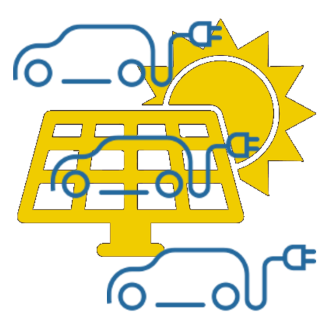

# ioBroker.chargemaster

## Версии

## Часовой

**Этот адаптер использует библиотеки Sentry для автоматического сообщения разработчикам об исключениях и ошибках в коде.** Более подробную информацию, а также сведения о том, как отключить отправку сообщений об ошибках, см. в разделе \[ссылка на соответствующий раздел].<a href="https://github.com/ioBroker/plugin-sentry#plugin-sentry"> Документация по плагину Sentry</a> !

## Адаптер для управления одним или несколькими зарядными устройствами для электромобилей с использованием энергии солнечных батарей.

**!!! Этот адаптер находится в стадии разработки !!!**

ChargeMaster управляет одним или несколькими зарядными устройствами для электромобилей (настенными зарядными станциями) и регулирует ток зарядки в зависимости от доступной избыточной энергии солнечных батарей в вашем доме. Он не зависит от производителя настенных зарядных станций: он не взаимодействует с самим оборудованием, а считывает и записывает данные в состояния ioBroker ваших существующих адаптеров настенных зарядных станций (например, go-e, но подойдет любой адаптер, предоставляющий необходимые состояния).

### Функции

- Позволяет одновременно управлять несколькими настенными распределительными коробками, соблюдая при этом общий максимальный суммарный ток (например, ограничение, установленное в вашем доме или в линии электропитания настенной коробки).
- Режим **ChargeNOW** для каждого настенного зарядного устройства: мгновенная зарядка заданным пользователем током, независимо от выработки солнечной энергии.
- Режим **ChargeManager** для каждой настенной зарядной станции: автоматическая зарядка от избытка солнечной энергии с учетом потребления электроэнергии в доме и вашей домашней батареи.
- Настраиваемый приоритет домашней батареи: зарядка электромобиля начинается только после того, как домашняя батарея достигнет настраиваемого уровня заряда; при превышении этого уровня часть энергии батареи может использоваться для зарядки электромобиля.
- Плавная регулировка: зарядный ток увеличивается/уменьшается на 1 А за цикл управления, с гистерезисом и задержкой отключения для защиты автомобильного зарядного устройства от резких переключений.
- Управление на основе событий: мгновенно реагирует на действия пользователя (например, включение ChargeNOW) и получает данные об энергопотреблении через подписки на состояние, а не путем опроса.

### Как это работает

Адаптер выполняет цикл управления (по умолчанию каждые 10 секунд). Для каждого настроенного настенного блока он планирует целевой ток в зависимости от его режима работы:

1. **Функция ChargeNOW включена** → настенное зарядное устройство планируется с использованием пользовательских настроек.`ChargeCurrent` .
2. **Менеджер зарядки включен** → если уровень заряда домашней батареи достиг заданного значения (`Settings.Setpoint_HomeBatSoC` ), оптимальный ток рассчитывается исходя из избытка солнечной энергии (см. [алгоритм управления зарядом](#charge-manager-algorithm) ). В противном случае настенное зарядное устройство остается выключенным до полной зарядки аккумулятора.
3. **Ни один из режимов не включен** → настенная приставка выключена.

Затем глобальный ограничитель распределяет доступный суммарный ток (`maximum total current` (настройка): Сначала обслуживаются настенные зарядные устройства в режиме ChargeNOW, оставшийся ток передается настенным зарядным устройствам ChargeManager. Если оставшийся ток для настенного зарядного устройства упадет ниже минимального значения, оно полностью отключается. Наконец, полученные значения тока и команды включения зарядки записываются в настроенные состояния настенных зарядных устройств.

## Требования

- node.js >= 22.18, js-controller >= 6.0.11, admin >= 7.6.20
- Адаптер ioBroker для ваших настенных зарядных устройств, предоставляющий состояния для: установки тока зарядки, разрешения/запрета зарядки, активной мощности зарядки, активного тока зарядки.
- ioBroker отображает выработку электроэнергии от солнечных батарей (Вт), потребление электроэнергии в доме (Вт) и — если имеется — уровень заряда домашней батареи (%), например, от адаптера инвертора.

## Конфигурация

### Основные настройки

| Параметр                                | Описание                                                                                                                                     |
| --------------------------------------- | -------------------------------------------------------------------------------------------------------------------------------------------- |
| `cycle time`                            | Интервал цикла управления задается в миллисекундах (по умолчанию 10000). Значения ниже 5000 не рекомендуются.                                |
| `maximum total current`                 | Глобальное ограничение тока в А для всех настенных распределительных коробок вместе взятых (например, ограничение по линии электропередачи). |
| `state of solar power`                  | Иностранное государство с текущим объемом производства фотоэлектрической энергии в Западной Европе.                                          |
| `state of home power consumption`       | Зарубежное государство с текущим потреблением электроэнергии в домохозяйстве в Вт (без учета мощности зарядного устройства Wallbox).         |
| `state of home battery state of charge` | Иностранное государство с текущим уровнем заряда батареи в %.                                                                                |

### Список настенных ящиков

Добавьте по одному ряду на каждый блок:

| Столбец                | Описание                                                                                          |
| ---------------------- | ------------------------------------------------------------------------------------------------- |
| `state charge current` | Иностранное государство **записывает** заданное значение зарядного тока (А).                      |
| `state charge allowed` | Иностранное государство для **записи** команды включения/отключения заряда (логическое значение). |
| `state active power`   | Иностранное государство **считывает** текущую мощность зарядки (Вт).                              |
| `state active current` | Иностранное государство **считывает** текущий зарядный ток (А).                                   |
| `min current`          | Минимальный зарядный ток этого настенного зарядного устройства измеряется в А (обычно 6 А).       |
| `max current`          | Максимальный зарядный ток этой настенной зарядной станции измеряется в А (например, 16 А).        |

При запуске адаптера проверяются все настроенные состояния — если какое-либо состояние отсутствует, адаптер регистрирует ошибку и останавливается.

## Состояния, созданные адаптером

| Состояние                       | Описание                                                                                                                            |
| ------------------------------- | ----------------------------------------------------------------------------------------------------------------------------------- |
| `Settings.Setpoint_HomeBatSoC`  | Минимальный уровень заряда домашней батареи в % до начала зарядки от избытка солнечной энергии (можно записывать, по умолчанию 80). |
| `Settings.WB_<x>.ChargeNOW`     | Включите мгновенную зарядку настенного зарядного устройства.`<x>` (доступно для записи).                                            |
| `Settings.WB_<x>.ChargeCurrent` | Ток зарядки в А, используемый в режиме ChargeNOW (с возможностью записи).                                                           |
| `Settings.WB_<x>.ChargeManager` | Включите зарядку избыточной солнечной энергии для настенного зарядного устройства.`<x>` (доступно для записи).                      |
| `Power.Charge`                  | Суммарная измеренная мощность зарядки всех настенных зарядных устройств в Вт.                                                       |
| `info.connection`               | Да, это верно, пока проверены все настроенные внешние состояния и адаптер работает.                                                 |

## алгоритм управления зарядкой

Оптимальный зарядный ток для настенного зарядного устройства в режиме ChargeManager рассчитывается следующим образом:

```
batteryShare = up to 2000 W, scaling linearly from 0 at Setpoint_HomeBatSoC to 2000 W at 100% SoC
optimalCurrent = (solarPower - houseConsumption + 100 W reserve + batteryShare) / 230 V
```

Затем запланированный ток приближается к этому оптимуму на 1 А за цикл. Зарядка включается, как только запланированный ток превышает минимальный ток зарядного устройства плюс гистерезис в 3 А, и отключается только после того, как запланированный ток оставался ниже минимального тока более 15 последовательных циклов (задержка выключения, предотвращает переключение при кратковременных разрядах).

## Примечания и ограничения

- Преобразование мощности в ток предполагает однофазную зарядку при напряжении 230 В. Для трехфазных зарядных устройств в настоящее время расчетный избыточный ток не делится на количество фаз — возможность настройки количества фаз находится в стадии разработки.
- Потребление электроэнергии в доме не должно включать в себя мощность самой настенной зарядной станции, иначе контур управления будет колебаться.
- Адаптер записывает состояние вашего настенного блока каждый цикл — убедитесь, что настроена правильная конфигурация.`state charge current` /`state charge allowed` Это действительно состояния управления, доступные для записи, вашего адаптера настенной коробки.

## Пожертвовать

<a href="https://www.paypal.com/donate/?hosted_button_id=H5PMQ8JKQL7SL"></a>\
&#x20;Если вам понравился этот проект — или вы просто чувствуете себя щедрым, — подумайте о том, чтобы угостить меня пивом. За ваше здоровье! :beers:

## Протестировано с помощью

- 3 зарядных устройства go-E и Костал ПикоБА

## Changelog

<!--
  Placeholder for the next version (at the beginning of the line):
  ### **WORK IN PROGRESS**
-->
### **WORK IN PROGRESS**

- (HombachC) fixed vulnerability
- (HombachC) updated dependencies

### 0.16.1 (2026-08-10)

- (HombachC) projectUtils: use extendObject instead of setObject in forceMode so user customizations survive restarts
- (HombachC) updated dependencies

### 0.16.0 (2026-07-05)

- (HombachC) switched data acquisition from polling to event driven foreign state subscriptions, react immediately to user input
- (HombachC) fixed warnings of adapter checker
- (HombachC) repository cleanup
- (HombachC) removed unused chai/sinon-chai/chai-as-promised/proxyquire devDependencies and switch tests to node:assert
- (HombachC) fixed race condition at first start
- (HombachC) fixed wrong config default keys in io-package.json and added guard for missing maxAmpTotal
- (HombachC) moved module-global variables into adapter class to fix possible conflicts in compact mode
- (HombachC) stop state machine and reset info.connection on adapter unload
- (HombachC) await wallbox state writes with proper error handling and throttle/switch off boxes exceeding the measured total current limit
- (HombachC) fixed lost min/max/step value of 0 and duplicated unit handling in projectUtils
- (HombachC) charge manager: clamp optimal current at zero and fix division by zero with home battery setpoint of 100%
- (HombachC) validate and clamp Setpoint_HomeBatSoC state changes (NaN guard, 0-100%)
- (HombachC) improved typing: typed state getters in projectUtils instead of any, fixed wallBoxList tuple type
- (HombachC) removed yarn devDependency and switched release build hook to npm
- (HombachC) extracted charge planning and limiting algorithms into testable module and added 18 unit tests
- (HombachC) improved README with feature overview, configuration, states and algorithm documentation

### 0.15.1 (2026-06-04)

- (HombachC) fix warnings of adapter checker
- (HombachC) upgraded typescript to 6.x.x
- (HombachC) updated projectUtils
- (HombachC) updated dependencies

### 0.15.0 (2026-05-09)

- (copilot) BREAKING: adapter requires node.js >= 22 now
- (HombachC) update dependencies

### 0.14.7 (2026-04-16)

- (HombachC) min admin 7.6.20 as recommended (#762)
- (HombachC) switch to ES2023 code
- (HombachC) update dependencies

### Old Changes see [CHANGELOG OLD](https://github.com/Hombach/ioBroker.chargemaster/blob/master/CHANGELOG_OLD.md)

## License

MIT License

Copyright (c) 2021-2026 Christian Hombach

Permission is hereby granted, free of charge, to any person obtaining a copy
of this software and associated documentation files (the "Software"), to deal
in the Software without restriction, including without limitation the rights
to use, copy, modify, merge, publish, distribute, sublicense, and/or sell
copies of the Software, and to permit persons to whom the Software is
furnished to do so, subject to the following conditions:

The above copyright notice and this permission notice shall be included in all
copies or substantial portions of the Software.

THE SOFTWARE IS PROVIDED "AS IS", WITHOUT WARRANTY OF ANY KIND, EXPRESS OR
IMPLIED, INCLUDING BUT NOT LIMITED TO THE WARRANTIES OF MERCHANTABILITY,
FITNESS FOR A PARTICULAR PURPOSE AND NONINFRINGEMENT. IN NO EVENT SHALL THE
AUTHORS OR COPYRIGHT HOLDERS BE LIABLE FOR ANY CLAIM, DAMAGES OR OTHER
LIABILITY, WHETHER IN AN ACTION OF CONTRACT, TORT OR OTHERWISE, ARISING FROM,
OUT OF OR IN CONNECTION WITH THE SOFTWARE OR THE USE OR OTHER DEALINGS IN THE

SOFTWARE.