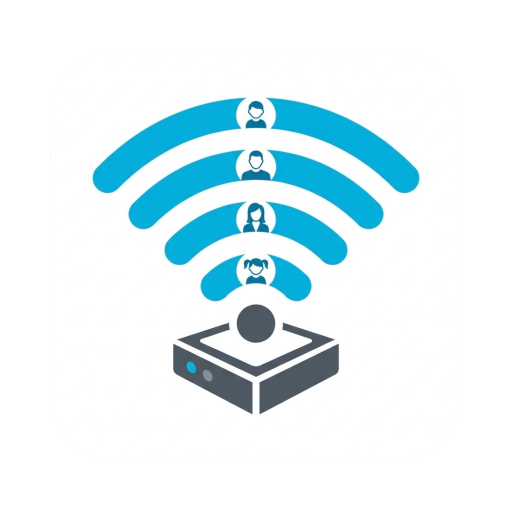

# ioBroker.cisco-checkpresence

## Адаптер Cisco Catalyst 9800 CheckPresence для ioBroker

Обнаруживает присутствие членов семьи, запрашивая информацию у беспроводного контроллера Cisco Catalyst 9800 через RESTCONF. Вместо ненадежных проверок ping, адаптер считывает таблицу аутентифицированных клиентов непосредственно с WLC — если контроллер сообщает о подключении устройства, значит, оно действительно подключено.

## Требования

- Беспроводной контроллер Cisco Catalyst 9800 Series (9800-L, 9800-CL, 9800-40, 9800-80)
- Требуется **аутентификация 802.1X** . Адаптер идентифицирует клиентов по их имени пользователя 802.1X. Внешний RADIUS-сервер не требуется — достаточно локального EAP на контроллере беспроводной сети (WLC).
- Учетная запись пользователя WLC с доступом для чтения RESTCONF.
- ioBroker с js-controller ≥ 6.0.11 и Admin ≥ 7.0.23

## Конфигурация

Откройте настройки адаптера в административной панели ioBroker.

### вкладка "Подключение"

| Поле                                    | Описание                                                                                                             |
| --------------------------------------- | -------------------------------------------------------------------------------------------------------------------- |
| Хост WLC / IP-адрес                     | IP-адрес или имя хоста контроллера беспроводной сети Catalyst 9800 WLC                                               |
| Имя пользователя                        | Имя пользователя RESTCONF (например)`iobroker_bot` )                                                                 |
| Пароль                                  | Пароль RESTCONF (хранится в зашифрованном виде)                                                                      |
| Интервал (с)                            | Интервал опроса в секундах (10–300, по умолчанию: 30)                                                                |
| Игнорировать самоподписанный сертификат | Включите эту опцию, если ваш контроллер беспроводной сети использует самоподписанный TLS-сертификат (рекомендуется). |

### Вкладка «Пользователи»

Сопоставление имен пользователей 802.1X с именами штатов в ioBroker:

| Поле                    | Описание                                                                       |
| ----------------------- | ------------------------------------------------------------------------------ |
| Имя пользователя 802.1X | Имя пользователя, как оно отображается в таблице клиентов WLC.                 |
| Название штата          | Название, используемое для обозначения штата в соответствии с`presence.<name>` |

## Штаты

Для каждого настроенного пользователя адаптер создает следующие состояния:

| Состояние                 | Тип         | Описание                                                   |
| ------------------------- | ----------- | ---------------------------------------------------------- |
| `presence.<name>.present` | логический  | `true` если клиент в данный момент связан                  |
| `presence.<name>.ap`      | нить        | Название соответствующей точки доступа (например)`AP03n` ) |
| `presence.<name>.band`    | нить        | Радиодиапазон (`2.4 GHz` ,`5 GHz` , или`6 GHz` )           |
| `presence.<name>.rssi`    | число (дБм) | Уровень принимаемого сигнала                               |
| `presence.<name>.snr`     | число (дБ)  | Соотношение сигнал/шум                                     |
| `info.connection`         | логический  | `true` если контроллер беспроводной сети доступен          |

## Интеграция с резидентами ioBroker

Состояния присутствия можно связать с [адаптером ioBroker Residents](https://github.com/jpawlowski/ioBroker.residents) через поле **Foreign Presence Data Points** :

```
cisco-checkpresence.0.presence.leonie.present
```

## Известные ограничения

- **Несколько устройств на одного пользователя:** если несколько устройств аутентифицированы с использованием одного и того же имени пользователя 802.1X, используется первый клиент, возвращенный API WLC. Это ограничение, связанное с конкретным сценарием использования, а не ошибка.
- **Требуется 802.1X:** устройства без аутентификации 802.1X (например, устройства IoT, использующие PSK) не обнаруживаются. Локального EAP на контроллере беспроводной сети достаточно, если внешний RADIUS-сервер недоступен.
- **Только централизованное переключение:** протестировано с точками доступа в локальном режиме с централизованным переключением (CAPWAP). Работа гибкого/локального переключения может отличаться.

## Changelog
<!--
    Placeholder for the next version (at the beginning of the line):
    ### **WORK IN PROGRESS**
-->
### 0.1.0 (2026-08-03)
- (ioBroker-Bot) Adapter requires admin >= 7.8.23 now.
- Changed: admin UI migrated from the deprecated `@iobroker/adapter-react-v5` to `@iobroker/gui-components`

### 0.0.7 (2026-06-11)
- Fixed: Sanitise user-supplied state names to remove characters forbidden in ioBroker object IDs
- Fixed: Clamp pollInterval and absentThreshold to sane upper bounds
- Fixed: Avoid overlapping polls by self-scheduling the poll loop instead of using setInterval
- Fixed: Use translations for the admin tab labels and poll interval field
- Fixed: Corrected admin page title

### 0.0.6 (2026-06-06)
- Fixed: Fixed object structure

### 0.0.5 (2026-06-06)
- Fixed: Fixed object structure

### 0.0.4 (2026-06-06)
- Chore: Update to node 22
- Chore: Update dependencies
- Fixed: Fixed object structure

### 0.0.3 (2026-04-27)
- (M1kad0) fix npm publishing

### 0.0.2 (2026-04-26)
- (M1kad0) added absent threshold to debounce presence detection

### 0.0.1 (2026-04-26)
- Initial release
- Presence detection via RESTCONF (`common-oper-data`)
- AP name, radio band, RSSI and SNR via `traffic-stats`
- Encrypted password storage
- Dark/light mode admin UI with MUI v6

[Older changelogs can be found there](https://github.com/NurPech/ioBroker.cisco-checkpresence/blob/main/CHANGELOG_OLD.md)

## License

MIT License

Copyright (c) 2026 M1kad0 <leonie+iobroker@sgessinger.de>

Permission is hereby granted, free of charge, to any person obtaining a copy
of this software and associated documentation files (the "Software"), to deal
in the Software without restriction, including without limitation the rights
to use, copy, modify, merge, publish, distribute, sublicense, and/or sell
copies of the Software, and to permit persons to whom the Software is
furnished to do so, subject to the following conditions:

The above copyright notice and this permission notice shall be included in all
copies or substantial portions of the Software.

THE SOFTWARE IS PROVIDED "AS IS", WITHOUT WARRANTY OF ANY KIND, EXPRESS OR
IMPLIED, INCLUDING BUT NOT LIMITED TO THE WARRANTIES OF MERCHANTABILITY,
FITNESS FOR A PARTICULAR PURPOSE AND NONINFRINGEMENT. IN NO EVENT SHALL THE
AUTHORS OR COPYRIGHT HOLDERS BE LIABLE FOR ANY CLAIM, DAMAGES OR OTHER
LIABILITY, WHETHER IN AN ACTION OF CONTRACT, TORT OR OTHERWISE, ARISING FROM,
OUT OF OR IN CONNECTION WITH THE SOFTWARE OR THE USE OR OTHER DEALINGS IN THE
SOFTWARE.