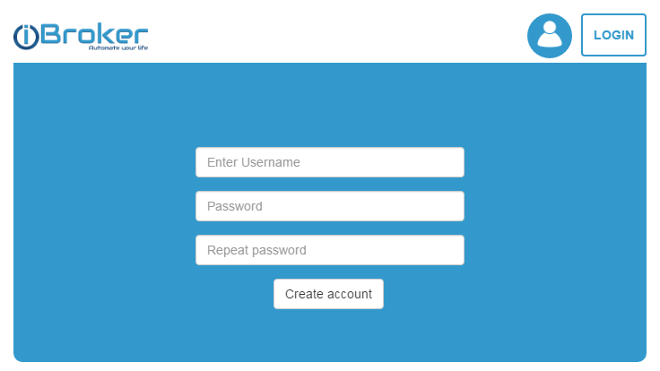

# Облачный адаптер ioBroker
Этот адаптер позволяет подключаться из Интернета через облако ioBroker к локальной установке ioBroker.

**Этот адаптер использует библиотеки Sentry для автоматического сообщения разработчикам об исключениях и ошибках кода.** Для получения более подробной информации и информации о том, как отключить отчеты об ошибках, см. [Документация плагина Sentry](https://github.com/ioBroker/plugin-sentry#plugin-sentry)! Отчеты Sentry используются начиная с js-controller 3.0.

## Настройки
### ПРИЛОЖЕНИЕ-КЛЮЧ
Чтобы использовать облачный адаптер, вам необходимо сначала получить APP-Key на [https://iobroker.net](https://iobroker.net).

Это ключ приложения, который пользователь может получить на сайте [https://iobroker.net](https://iobroker.net). Пожалуйста, получите ключ там и введите его здесь.



### Пример
Все запросы от облачного адаптера будут перенаправляться на конкретный веб-экземпляр. Пользователь должен указать здесь веб-экземпляр, который будет показан пользователю при входе на сайт https://iobroker.net.

### Разрешить самозаверяющие сертификаты
Если вы используете стандартное облако iobroker.net, вы можете его деактивировать. Эта опция важна только при использовании собственного облака.

### Настройки Алексы
***Alexa больше не поддерживается в адаптере `cloud`. Для этого используйте адаптер ioBroker.iot.***

## ИФТТТ
[инструкции](doc/ifttt.md)

## Услуги
Есть возможность отправлять сообщения на облачный адаптер.
Если вы вызываете `[POST]https://iobroker.net/service/custom_<NAME>/<user-app-key>` и значение в качестве полезной нагрузки.

```
curl --data "myString" https://iobroker.net/service/custom_test/<user-app-key>
```

Если вы установите в настройках поле «Белый список для сервисов» имя *custom_test*, а в качестве имени сервиса будете вызывать «custom_test», то состояние `cloud.0.services.custom_test` будет установлено в `myString`.

Вы можете написать «*» в белом списке и все услуги будут разрешены.

Начиная с версии 2.0.5 вы можете использовать запрос GET в форме `[GET]https://iobroker.net/service/custom_<NAME>/<user-app-key>/<data>`, чтобы поместить `\<data\>` в `cloud.0.services.custom_\<NAME\>`.

Здесь вы можете найти инструкции по использованию с [надсмотрщик](doc/tasker.md).

Служба IFTTT разрешена только в том случае, если установлен ключ IFTTT.

Зарезервированные имена: «ifttt», «text2command», «simpleApi», «swagger». Их необходимо использовать без префикса `"custom_"`.

### Текстовая2команда
Вы можете записать `text2command` в белый список, вы можете отправить POST-запрос к `https://iobroker.net/service/text2command/<user-app-key>` для записи данных в переменную `text2command.X.text`.

«X» можно определить в настройках с помощью опции «Использовать экземпляр text2command».

### Простой API
Вы можете использовать следующие команды (только pro):

- `[GET]https://iobroker.pro/service/simpleApi/<user-app-key>/get/stateID` — для чтения значения состояния => `{"val":103.516,"ack":true, "ts":1604132484682,"q":0,"from":"system.adapter.admin.0","lc":1604132469672,"result":"OK"}`
- `[GET]https://iobroker.pro/service/simpleApi/<user-app-key>/getPlainValue/stateID` — для чтения значения состояния => `103.641`
- `[GET]https://iobroker.pro/service/simpleApi/<user-app-key>/set/stateID?value=1` - чтобы установить значение состояния => `{"result":"OK"} `

**Не забудьте добавить `simpleApi` к разрешенным сервисам в конфигурации.**

### Ограничения
Если HTTPs (безопасность) или аутентификация включены в определенном веб-экземпляре, это не работает.

Вы можете деактивировать HTTPS и аутентификацию на этом веб-экземпляре, но лучше создать новый веб-экземпляр, привязанный к `localhost`, и выбрать этот экземпляр в настройках облака.

<!-- Заполнитель следующей версии (в начале строки):

### **РАБОТА В ПРОГРЕССЕ** -->

## Changelog
### 5.0.1 (2024-02-22)
* (bluefox) updated socket classes and fixed vis-2 error if connected via cloud
* (bluefox) minimum required node.js version is 16

### 4.4.1 (2023-04-17)
* (bluefox) allowed to use "neural" voices for aws text-to-speech engine

### 4.4.0 (2023-04-03)
* (bluefox) Corrected error with `name` command
* (bluefox) Corrected `text2speech` functionality

### 4.3.1 (2022-12-22)
* (bluefox) Downgrade of axios package to 0.27.2

### 4.3.0 (2022-10-27)
* (bluefox) Corrected work with lovelace

### 4.2.3 (2022-10-10)
* (Apollon77) Prepare for future js-controller versions
* (bluefox) Corrected error with iobroker.pro and delete object

### 4.2.2 (2022-08-24)
* (bluefox) Corrected error with services list and admin6

### 4.2.1 (2022-07-20)
* (bluefox) Used a new version of a socket library.

### 4.2.0 (2022-07-05)
* (bluefox) Added preparations for Admin 6

### 4.1.2 (2022-06-22)
* (bluefox) Added preparations for Admin 6
* (bluefox) Added better error reporting
* (bluefox) Removed outdated `request` library
* (bluefox) Used common sockets (could be buggy)

### 4.1.1 (2022-02-19)
* Important: Requires `js-controller` 3.1 at least!
* (Apollon77) Add some checks to prevent issues with missing data
* (Apollon77) FIx some crash cases reported by Sentry
* (Apollon77) pass HEAD requests without body (Sentry IOBROKER-CLOUD-14)

### 4.1.0 (2021-07-17)
* (bluefox) Added support for new javascript

### 4.0.11 (2021-05-12)
* (bluefox) Fixed the connection issue with the cloud
* (bluefox) Added support for Admin5

### 4.0.10 (2021-02-18)
* (Apollon77) Fix crash case (Sentry IOBROKER-CLOUD-X)

### 4.0.9 (2021-02-01)
* (bluefox) Support of lovelace via ioBroker.pro
* (bluefox) Fixed error with the admin

### 4.0.8 (2021-01-31)
* (Apollon77) Prevent crash case (Sentry IOBROKER-CLOUD-S)
* (bluefox) fix usage of credentials

### 4.0.7 (2021-01-30)
* (bluefox) Show the invalid authentication message

### 4.0.4 (2021-01-26)
* (bluefox) Stop all timers on the unloading

### 4.0.3 (2021-01-26)
* (bluefox) Added the ignoring of restart on disconnect by the redirection

### 4.0.2 (2021-01-24)
* (Apollon77) Make sure states which were not set or expired do not crash when requested via services (Sentry IOBROKER-CLOUD-P)

### 4.0.1 (2021-01-16)
* (Apollon77) Prevent crash case (Sentry IOBROKER-CLOUD-N)

### 4.0.0  (2020-12-14)
* (bluefox) Breaking change! Alexa was removed from cloud adapter.
* (bluefox) Allowed to use the login and password for authentication.

### 3.1.0 (2020-10-31)
* (bluefox) Implemented the easy simpleApi commands (not all)

### 3.0.5 (2020-10-30)
* (Apollon77) Make sure that subscribe patterns are strings (Sentry IOBROKER-CLOUD-D)

### 3.0.4 (2020-07-16)
* (Apollon77) crash prevented when socket is not connected (Sentry IOBROKER-CLOUD-8)

### 3.0.3 (2020-04-14)
* (bluefox) Updated socket.io version
* (bluefox) Added sentry.io reporting

### 3.0.2 (2020-02-23)
* (Apollon77) fix for pot. crash when used with web 3.x

### 3.0.1 (2020-01-05)
* (bluefox) Breaking changes: no alexa support. Use ioBroker.iot for that.
* (bluefox) Support of multiple clients for .pro

### 2.8.0 (2019-11-13)
* (bluefox) Connects your ioBroker server to the ioBroker cloud

### 2.7.1 (2018-09-07)
* (Apollon77) Enhancements for Custom Skill

### 2.7.0 (2018-06-18)
* (bluefox) Multilingual names were corrected

### 2.6.2 (2018-06-18)
* (Apollon77/AlCalzone/Bluefox) Several fixes

### 2.6.1 (2018-05-04)
* (bluefox) Support of custom alexa skill

### 2.5.0 (2018-03-17)
* (bluefox) Added actions on commands from server: wait, stop, redirect; to control load of the server by start.

### 2.4.7 (2018-02-09)
* (bluefox) Small changes in the configuration dialog
* (bluefox) add information about the expiring of remote access

### 2.4.6 (2018-02-09)
* (bluefox) Adding of new devices is fixed

### 2.4.5 (2018-01-29)
* (bluefox) Changes for Admin 3

### 2.4.4 (2018-01-20)
* (bluefox) The errors by controlling of temperature are caught now

### 2.4.2 (2018-01-20)
* (bluefox) Do not subscribe all objects

### 2.2.0 (2017-12-22)
* (bluefox) Better update of the devices in configuration dialog

### 2.1.1 (2017-12-11)
* (bluefox) Add settings for the ping timeout
* (grimneko) corrected some spelling mistakes
* (grimneko) update readme for IFTTT

### 2.1.0 (2017-12-06)
* (bluefox) Allowed disabling alexa service by state

### 2.0.8 (2017-11-28)
* (bluefox / Philipp Beckers) Translations

### 2.0.7 (2017-10-29)
* (bluefox) Changes for socket-io

### 2.0.6 (2017-10-26)
* (bluefox) Fixed small error in configuration
* (bluefox) Send uuid to cloud for authentication

### 2.0.5 (2017-09-26)
* (bluefox) The small custom service reaction improvement

### 2.0.4 (2017-09-12)
* (bluefox) Allowed access to admin via iobroker.pro
* (c-klinger) Added settings for the connection timeout

### 1.0.8 (2017-07-13)
* (bluefox) Allowed control light colors

### 1.0.7 (2017-06-26)
* (bluefox) AI deactivated
* (bluefox) changed a ping interval from 10 to 30 seconds
* (bluefox) fix double auth on connect

### 1.0.3 (2017-05-23)
* (bluefox) Rename some german words

### 1.0.2 (2017-05-23)
* (bluefox) Support for IFTTT

### 1.0.0 (2017-05-22)
* (bluefox) Catch an error if the invalid smart name set

### 0.8.2 (2017-04-24)
* (bluefox) controls of colors (english only)
* (bluefox) request temperature (target temperature and sensor temperature, english only)
* (bluefox) support for double names

### 0.7.1 (2017-04-05)
* (bluefox) Fixed reconnection

### 0.7.0 (2017-04-01)
* (bluefox) Try to fix reconnection

### 0.6.12 (2017-03-26)
* (bluefox) Try to fix error with names

### 0.6.11 (2017-03-20)
* (bluefox) Fixed scrollbar in configuration

### 0.6.10 (2017-03-03)
* (bluefox) Add tooltips in config
* (bluefox) Add workaround for alexa reconnection

### 0.6.9 (2017-02-17)
* (bluefox) Allowed using more than one smart name

### 0.6.8 (2017-02-16)
* (bluefox) Fix deactivation of enums

### 0.6.7 (2017-02-14)
* (bluefox) allow buttons to be controller with alexa

### 0.6.5 (2017-02-06)
* (bluefox) print warnings for invalid states

### 0.6.3 (2017-01-28)
* (bluefox) fix enum names
* (bluefox) add helper states and response text

### 0.6.2 (2017-01-25)
* (bluefox) add option "Place function in names first"

### 0.6.1 (2017-01-24)
* (bluefox) fix reconnect
* (bluefox) change smartName structure

### 0.5.0 (2017-01-20)
* (bluefox) add value by ON

### 0.4.2 (2017-01-12)
* (bluefox) add daily restart

### 0.4.1 (2017-01-06)
* (bluefox) use devices with ":" symbols in the names
* (bluefox) add debug outputs

### 0.4.0 (2017-01-06)
* (bluefox) Support of english language
* (bluefox) Use rooms of channel and not only states

### 0.3.3 (2017-01-02)
* (bluefox) Fix error with smartNames
* (bluefox) Take the superset of actions for group and not the last one
* (bluefox) if group has switches and dimmers, turn devices OFF if the percent level is less than 30%
* (bluefox) Remember ON level for dimmers to switch it later ON

### 0.3.0 (2016-12-29)
* (bluefox) Implement Heating profile for Alexa

### 0.2.0 (2016-12-13)
* (bluefox) support of amazon alexa

### 0.1.2 (2016-11-17)
* (bluefox) update socket.io

### 0.1.1 (2016-10-23)
* (bluefox) update some packages

### 0.1.0 (2016-08-01)
* (bluefox) support of read/write files

## License
The MIT License (MIT)

Copyright (c) 2016-2024 bluefox <dogafox@gmail.com>

Permission is hereby granted, free of charge, to any person obtaining a copy
of this software and associated documentation files (the "Software"), to deal
in the Software without restriction, including without limitation the rights
to use, copy, modify, merge, publish, distribute, sublicense, and/or sell
copies of the Software, and to permit persons to whom the Software is
furnished to do so, subject to the following conditions:

The above copyright notice and this permission notice shall be included in all
copies or substantial portions of the Software.

THE SOFTWARE IS PROVIDED "AS IS", WITHOUT WARRANTY OF ANY KIND, EXPRESS OR
IMPLIED, INCLUDING BUT NOT LIMITED TO THE WARRANTIES OF MERCHANTABILITY,
FITNESS FOR A PARTICULAR PURPOSE AND NONINFRINGEMENT. IN NO EVENT SHALL THE
AUTHORS OR COPYRIGHT HOLDERS BE LIABLE FOR ANY CLAIM, DAMAGES OR OTHER
LIABILITY, WHETHER IN AN ACTION OF CONTRACT, TORT OR OTHERWISE, ARISING FROM,
OUT OF OR IN CONNECTION WITH THE SOFTWARE OR THE USE OR OTHER DEALINGS IN THE
SOFTWARE.
