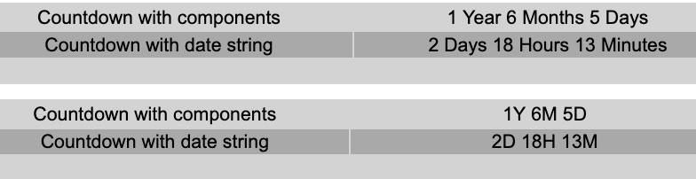
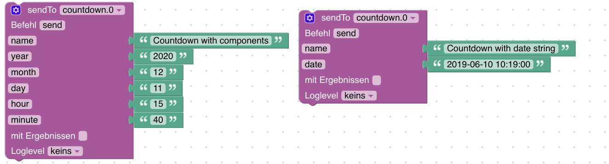
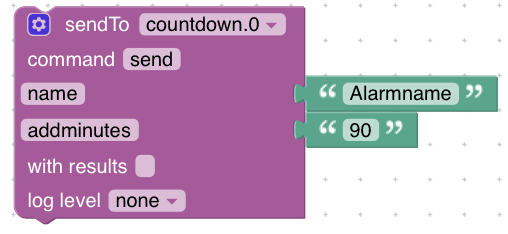

# IoBroker.countdown
[![Статус сборки Трэвис] (https://travis-ci.com/jack-blackson/ioBroker.countdown.svg?branch=master)](https://travis-ci.com/jack-blackson/ioBroker.countdown) [![Статус перевода] (https://weblate.iobroker.net/widgets/adapters/-/countdown/svg-badge.svg)](https://weblate.iobroker.net/engage/adapters/?utm_source=widget)

** Этот адаптер использует библиотеки Sentry для автоматического сообщения разработчикам об исключениях и ошибках кода. ** Дополнительные сведения и информацию о том, как отключить отчет об ошибках, см. В [Документация Sentry-Plugin](https://github.com/ioBroker/plugin-sentry#plugin-sentry)! Сторожевые отчеты используются начиная с js-controller 3.0.

Адаптер обратного отсчета для ioBroker ---------------------------------------------- --------------------------------

Цель адаптера - предоставить вам возможность запускать обратный отсчет для будущих событий с годами, месяцами, днями, часами и минутами. Он предоставит вам каждую из этих значений отдельно, а также две строки с короткой и длинной версиями даты.

## Отображение обратного отсчета
Адаптер автоматически предоставляет вам таблицу json. Вам просто нужно использовать его с разделенной таблицей json. Пожалуйста, отметьте там "Без заголовка". Можно отображать как короткий текст, так и длинный текст.

## Как создать обратный отсчет
Есть два способа настроить обратный отсчет:

* Вы можете создать обратный отсчет в настройках адаптера, во вкладке «Создать обратный отсчет».
* Вы можете создать вручную состояние в «настройке» устройства. Имя объекта - это имя сигнала тревоги, а значение будет датой. Дата должна быть в формате «ДД.ММ.ГГГГ ЧЧ: мм: сс».
* Вы можете создать сигнал тревоги с помощью sendto. Там вы можете отправить компоненты (минимум год, месяц, дату) или строку даты. Для строки даты вы можете настроить формат в настройках адаптера.

* Вы можете добавить дни, месяцы и годы с помощью sendto к сегодняшней дате. Поэтому, пожалуйста, отправьте компонент «name» и либо «addminutes», «addhours», «adddays», «addmonths» или «addyears» как значение int.

## Как удалить обратный отсчет
Вы можете удалить обратный отсчет с помощью sendto. Поэтому отправьте адаптеру только имя с помощью sendto, и обратный отсчет будет удален автоматически.

## Повторяющийся обратный отсчет
Если вы хотите, чтобы обратный отсчет повторялся через определенный период (например, вы не можете отсчитывать обратный отсчет до дня свадьбы каждый год), вы также можете сделать это с помощью этого адаптера. Поэтому либо заполните поле «Период повтора» в настройках адаптера, либо добавьте период после даты при создании обратного отсчета с типом «дата». SendTo будет выглядеть так для обратного отсчета, который должен закончиться 1 апреля 2020 года и повторяться каждый год:

sendTo ("countdown.0", "send", {"name": 'День свадьбы', "date": '01 .04.2020 00: 01 + 1Y '});

Параметры здесь следующие:

* Y: Годы
* M: Месяцы
* D: Дни
* H: Часы
* m: минуты

## Доступные выходы
| Тип данных | Описание |
|:---:|:---:|
| минут | Минуты до конца обратного отсчета (не всего!) |
| часов | часов до конца обратного отсчета (не всего!) |
| дней | Дней до конца обратного отсчета (не всего!) |
| месяцев | Месяцы до конца обратного отсчета (не всего!) |
| лет | Годы до конца обратного отсчета (не всего!) |
| имя | Имя обратного отсчета |
| endDate | Дата окончания обратного отсчета - форматируется как в настройке, определенной |
| inWordsShort | Комбинированное значение минут, часов, ... - например, 1Y 5M 4D |
| inWordsLong | Комбинированное значение минут, часов, ... - например, 1 год 5 месяцев 4 дня |
| totalHours | Общее количество часов до даты окончания |
| totalDays | Общее количество дней до даты окончания |
| totalWeeks | Общее количество недель до даты окончания |
| достигнуто | Логическое поле, определяющее, достигнута ли конечная дата |
| repeatEvery | Обратный отсчет повторяется через этот период после достижения конечной даты |

## Функции для добавления
* Возможность добавить скрипт в качестве параметра и запустить его, когда обратный отсчет закончится
* Возможность использовать плюс и минус в дополнительных минутах, а также другие функции добавления

## 1.2.1 (2021-05-09)
* (Джек-Блэксон) Мелкие исправления

## 1.2.0 (2021-05-09)
* (jack-blackson) Обновлены пакеты, добавлен Sentry
* (jack-blackson) Исправления для JS-контроллера 3.3
* (Джек-Блэксон) Исправлено, что обратный отсчет создается немедленно

## 1.1.0 (02.04.2020)
* (jack-blackson) исправление ошибки Ссылка Read-Me
* (jack-blackson) исправление ошибки repeatCycle

## 1.0.9 (31.03.2020)
* (jack-blackson) Исправление сообщений журнала.

## 1.0.8 (31.03.2020)
* (Джек-Блэксон) Повторять обратный отсчет в определенный период (например, каждый год)

## 1.0.7 (30.03.2020)
* (jack-blackson) Добавлен новый тип даты для настроек: ГГГГ-ММ-ДД
* (jack-blackson) Добавить обратный отсчет прямо в настройках адаптера

## 1.0.6 (20.03.2020)
* (DutchmanNL) Фиксированный тип адаптера

## 1.0.5 (05.02.2020)
* (jack-blackson) Исправление бага с будильником в полночь -> спасибо @Lueghi

## 1.0.4 (25.08.2019)
* (Джек-Блэксон) Информация о выпуске переупорядочена

## 1.0.3 (10.08.2019)
* (jack-blackson) Изменения для компактного режима
* (Джек-Блэксон) Различные исправления
* (jack-blackson) Теперь возможно наличие нескольких экземпляров адаптера.

## 1.0.2 (22.07.2019)
* (jack-blackson) Релизная версия

## 0.7.0 (07.07.2019)
* (jack-blackson) Исправления.
* (jack-blackson) теперь также возможно добавить минуты и часы
* (jack-blackson) точка данных в настройке теперь доступна для редактирования
* (Джек-Блэксон) добавлено общее количество недель

## 0.6.0 (06.07.2019)
* (jack-blackson) регулируемый формат даты для ввода и вывода
* (Джек-Блэксон) удалить обратный отсчет с помощью sendto
* (Джек-Блэксон) возможность добавлять обратный отсчет на «дни / месяцы / недели с этого момента)

## 0.5.0 (04.07.2019)
* (Джек-Блэксон) скорректируйте данные в таблице
* (jack-blackson) исправление ошибки при импорте даты

### 0.4.0 (04.06.2019)
* (jack-blackson) реструктуризация - теперь возможно создание алармов с помощью sendto или вручную с помощью datapoint

### 0.3.0 (24.05.2019)
* (Джек-Блэксон) добавлено общее количество дней и часов

### 0.2.0 (21.05.2019)
* (jack-blackson) настроенные пакеты

### 0.1.0 (29.04.2019)
* (Джек-Блэксон) начальная версия

## Changelog

## License
The MIT License (MIT)

Copyright (c) 2019-2021 jack-blackson <blacksonj7@gmail.com>

Permission is hereby granted, free of charge, to any person obtaining a copy
of this software and associated documentation files (the "Software"), to deal
in the Software without restriction, including without limitation the rights
to use, copy, modify, merge, publish, distribute, sublicense, and/or sell
copies of the Software, and to permit persons to whom the Software is
furnished to do so, subject to the following conditions:

The above copyright notice and this permission notice shall be included in
all copies or substantial portions of the Software.

THE SOFTWARE IS PROVIDED "AS IS", WITHOUT WARRANTY OF ANY KIND, EXPRESS OR
IMPLIED, INCLUDING BUT NOT LIMITED TO THE WARRANTIES OF MERCHANTABILITY,
FITNESS FOR A PARTICULAR PURPOSE AND NONINFRINGEMENT. IN NO EVENT SHALL THE
AUTHORS OR COPYRIGHT HOLDERS BE LIABLE FOR ANY CLAIM, DAMAGES OR OTHER
LIABILITY, WHETHER IN AN ACTION OF CONTRACT, TORT OR OTHERWISE, ARISING FROM,
OUT OF OR IN CONNECTION WITH THE SOFTWARE OR THE USE OR OTHER DEALINGS IN
THE SOFTWARE.