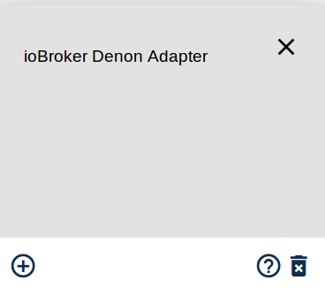
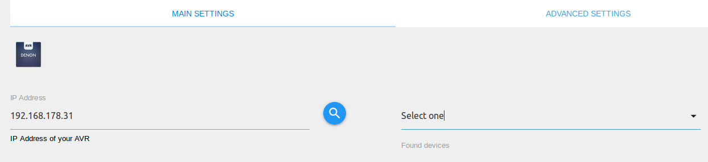
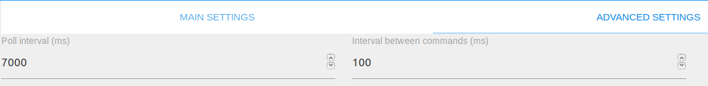

# ioBroker.denon

\===========================

## Отказ от ответственности

DENON и Marantz являются товарными знаками компании D\&M Holdings Inc. Разработчики данного модуля никоим образом не связаны с компанией D\&M Holdings Inc., а также с ее дочерними компаниями, логотипами или товарными знаками.

## Установка

Вы можете установить адаптер либо через веб-интерфейс ioBroker, либо на свой локальный компьютер с помощью npm.

### на основе браузера

1. Откройте веб-интерфейс ioBroker в браузере (например: 192.168.30.70:8081)
2. Нажмите на вкладку «Адаптеры».
3. Введите "Denon" в поле фильтра.
4. Нажмите на три точки, а затем на символ «+» адаптера DENON AVR.

### Локальная машина

Перейдите в папку iobroker и выполните следующую команду:

```bash
npm i iobroker.denon
```

## Настраивать

Помимо установки адаптера, необходимо убедиться в правильной настройке вашего AV-ресивера.

### ioBroker

1. Откройте интерфейс ioBroker в браузере (например: 192.168.1.33:8081)
2. Перейдите на вкладку «Адаптеры».
3. Нажмите на три точки, а затем на символ «+» адаптера DENON AVR.
4. Теперь вы можете увидеть страницу конфигурации адаптера --> введите IP-адрес вашего AV-ресивера DENON или нажмите на значок поиска, чтобы найти AV-ресиверы в вашей сети (через UPnP).
5. Если вы также хотите настроить интервал запроса/опроса, обязательно перейдите на вкладку «Расширенные настройки». Уменьшение интервала опроса сократит время между обновлением содержимого дисплея. Уменьшение интервала запроса сократит время между отправкой команд. Настройки по умолчанию должны подойти большинству пользователей.
6. Нажмите «Сохранить и закрыть».

### Настройка сети AV-ресивера

1. Нажмите кнопку SETUP, после чего на FL-дисплее (и в графическом интерфейсе) появится меню.

2. Выберите «Сеть» --> «Настройки»

3. Задайте параметры, описанные ниже.

   _DHCP: "ВКЛ" (Используйте этот параметр, если DHCP-сервер находится в локальной сети.)_

   _IP-адрес: Когда<DHCP> Если установлено значение "Выкл", пожалуйста, укажите IP-адрес._

   _Маска подсети: Когда<DHCP> Если установлено значение "Выкл", пожалуйста, установите маску подсети._

   _Шлюз: Установите адрес шлюза, когда он находится в локальной сети._

   _Основной DNS: Не задавайте этот параметр._

   _Второй DNS: Не устанавливайте этот параметр._

   _Прокси: Установите этот параметр в положение «Выкл.»._

4. Нажмите кнопку SETUP, после чего на FL-дисплее (и в графическом интерфейсе) появится меню.

5. Выберите «Сеть» --> «Управление сетью/Управление IP-адресами».

6. Установите для этого параметра значение "Всегда включено".

## Использование

Обратите внимание, что AVR-устройства могут обрабатывать только одно Telnet-соединение. Если у вас активно Telnet-соединение, например, с JavaScript-адаптером, AVR-устройство отклонит соединение с этим адаптером. Здесь вы можете найти описание состояний и способы их использования.

### Кнопки

Адаптер создает следующие кнопки:

#### Канал: zoneMain / zone2 / zone3

- zoneMain.playPause

  _Воспроизводите и приостанавливайте музыку из источников Bluetooth, онлайн, USB/iPod._

- zoneMain.play

  _Воспроизводите музыку через Bluetooth, онлайн, с USB-накопителей/iPod._

- zoneMain.pause

  _Приостановите воспроизведение музыки из источников Bluetooth, онлайн, USB/iPod._

- zoneMain.skipMinus

  _Перейти к предыдущему заголовку._

  _НЕ ПОЛНОСТЬЮ ПОДДЕРЖИВАЕТСЯ ДЛЯ AVR-РЕШЕТОВ HEOS_

- zoneMain.skipPlus

  _Перейти к следующему заголовку._

  _НЕ ПОЛНОСТЬЮ ПОДДЕРЖИВАЕТСЯ ДЛЯ AVR-РЕШЕТОВ HEOS_

- zoneMain.volumeDown / zone2.volumeDown / zone3.volumeDown

  _Уменьшить объем основной зоны / зоны 2 / зоны 3._

- zoneMain.volumeUp / zone2.volumeUp / zone3.volumeUp

  _Увеличьте громкость в Главной зоне / Зоне 2 / Зоне 3._

- zoneMain.equalizerBassUp / zone2.equalizerBassUp / zone3.equalizerBassUp

  _Кнопка, увеличивающая уровень басов в зоне._

  _Регулировка низких и высоких частот возможна, если параметр Dyn EQ выключен, а параметр Tone Control включен._

- zoneMain.equalizerBassDown / zone2.equalizerBassDown / zone3.equalizerBassDown

  _Кнопка, уменьшающая уровень басов в зоне._

  _Регулировка низких и высоких частот возможна, если параметр Dyn EQ выключен, а параметр Tone Control включен._

- zoneMain.equalizerTrebleUp / zone2.equalizerTrebleUp / zone3.equalizerTrebleUp

  _Кнопка, увеличивающая уровень высоких частот в зоне._

  _Регулировка низких и высоких частот возможна, если параметр Dyn EQ выключен, а параметр Tone Control включен._

- zoneMain.equalizerTrebleDown / zone2.equalizerTrebleDown / zone3.equalizerTrebleDown

  _Кнопка, уменьшающая уровень высоких частот в зоне._

  _Регулировка низких и высоких частот возможна, если параметр Dyn EQ выключен, а параметр Tone Control включен._

#### Канал: настройки

- settings.subwooferLevelDown / settings.subwooferTwoLevelDown

  _Уменьшите уровень громкости сабвуфера, нажав кнопку._

- settings.subwooferLevelUp / settings.subwooferTwoLevelUp

  _Увеличьте уровень сабвуфера, нажав кнопку._

- settings.containmentAmountDown

  _Уменьшите значение параметра Audyssey LFC. Кнопка будет создана только в том случае, если она поддерживается вашим AV-ресивером._

- settings.containmentAmountUp

  _Увеличьте значение Audyssey LFC. Кнопка будет создана только в том случае, если она поддерживается вашим AV-ресивером._

- settings.cursorUp / settings.cursorDown / settings.cursorLeft / settings.cursorRight

  _Имитирует кнопки управления на пульте дистанционного управления._

- настройки.ввод

  _Имитирует кнопку ввода на пульте дистанционного управления._

- настройки.возврат

  _Имитирует кнопку возврата/назад на пульте дистанционного управления._

- настройки.опция

  _Имитирует кнопку выбора опций на пульте дистанционного управления._

- настройки.info

  _Имитирует кнопку информации на пульте дистанционного управления._

### Канал: тюнер

- тюнер.частотаВверх

  _Повышает частоту тюнера._

- тюнер.частотаПонижение

  _Снижает частоту тюнера._

### Штаты

Адаптер создаст следующие состояния:

#### Канал: информация

- info.connection

  | Тип данных | Разрешение |
  | :--------: | :--------: |
  | логический |      Р     |

  _Логический индикатор только для чтения. Если ваш брокер подключен к вашему DENON AVR, состояние истинно, в противном случае — ложно._

- info.friendlyName

  | Тип данных | Разрешение |
  | :--------: | :--------: |
  |    нить    |      Р     |

  _Строка только для чтения. Содержит понятное имя подключенного AVR-монитора._

- info.onlinePresets

  | Тип данных | Разрешение |
  | :--------: | :--------: |
  |    нить    |      Р     |

  _Строка в формате JSON-массива, представляющая текущие сохраненные избранные каналы по их идентификатору и каналу. Названия каждого канала ограничены 20 цифрами. Вы можете сохранить текущий канал по идентификатору, установив параметр settings.savePreset, и загрузить его, установив параметр settings.loadPreset на соответствующий идентификатор._

#### Канал: zoneMain / zone2 / zone3

- zoneMain.volume / zone2.volume / zone3.volume

  | Тип данных | Разрешение |
  | :--------: | :--------: |
  |    число   |     Р/В    |

  _Числовое значение, представляющее текущий уровень громкости основной зоны / зоны 2 / зоны 3 вашего AV-ресивера. Здесь также можно установить уровень громкости. Громкость также отображается в дБ в отдельных состояниях, например, mainVolumeDB._

  _Диапазон значений от 0 до 98 (возможно, меньше из-за параметра maximumVolume), где 80 = 0 дБ._

  _Пример:_

  ```javascript
  setState('denon.0.zoneMain.volume', 45.5); // Sets volume of Main Zone to 45.5
  ```

- zoneMain.maximumVolume

  | Тип данных | Разрешение |
  | :--------: | :--------: |
  |    число   |      Р     |

  _Число только для чтения, представляющее максимально возможный уровень громкости, где 80 = 0 дБ. Уровень громкости также устанавливается в дБ в состоянии maximumVolumeDB._

- zoneMain.muteIndicator / zone2.muteIndicator / zone3.muteIndicator

  | Тип данных | Разрешение |
  | :--------: | :--------: |
  | логический |     Р/В    |

  _Логическое значение, которое принимает значение true, если основная зона / зона 2 / зона 3 отключены, в противном случае - false. В этом состоянии вы можете отключить звук на вашем AV-ресивере._

  _Пример:_

  ```javascript
  setState('denon.0.zoneMain.muteIndicator', true); // Mutes the Main Zone of your AVR
  ```

- zoneMain.powerZone / zone2.powerZone / zone3.powerZone

  | Тип данных | Разрешение |
  | :--------: | :--------: |
  | логический |     Р/В    |

  _Логическое значение, которое равно true, если зона включена, и false в противном случае. С помощью этого состояния вы можете включать и выключать свой AV-ресивер/зону._

- zoneMain.selectInput / zone2.selectInput / zone3.selectInput

  | Тип данных | Разрешение |
  | :--------: | :--------: |
  |    нить    |     Р/В    |

  _Строковое значение содержит текущий источник ввода. Вы также можете задать источник ввода с помощью следующей кодировки:_

  _0: ФОНО_

  _1: CD_

  _2: ТЮНЕР_

  _3: DVD_

  _4: БД_

  _5: ТВ_

  _6: SAT/CBL_

  _7: MPLAY_

  _8: ИГРА_

  _9: NET_

  _10: SPOTIFY_

  _11: LASTFM_

  _12: IRADIO_

  _13: СЕРВЕР_

  _14: ИЗБРАННОЕ_

  _15: AUX1_

  _16: AUX2_

  _17: AUX3_

  _18: AUX4_

  _19: AUX5_

  _20: AUX6_

  _21: AUX7_

  _22: БТ_

  _23: USB_

  _Обратите внимание, что не все источники входного сигнала доступны на каждой модели AV-ресивера. Если ваш AV-ресивер имеет дополнительные входы, они будут добавлены в список после их обнаружения._

  _Пример:_

  ```javascript
   setState('denon.0.zoneMain.selectInput', '5'); // Selects TV as input for Main Zone
  ```

- zoneMain.quickSelect / zone2.quickSelect / zone3.quickSelect

  | Тип данных | Разрешение |
  | :--------: | :--------: |
  |    число   |     Р/В    |

  _Имитирует кнопки быстрого выбора на пульте дистанционного управления, с цифрами от 1 до 5 для главной зоны / зоны 2 / зоны 3._

- ZoneMain.sleepTimer/zone2.sleepTimer/zone3.sleepTimer

  | Тип данных | Разрешение |
  | :--------: | :--------: |
  |    число   |     Р/В    |

  _Числовое значение для считывания и установки таймера сна для выбранной зоны. Значение будет обновлено менее чем за 10 секунд._

- zoneMain.iconURL

  | Тип данных | Разрешение |
  | :--------: | :--------: |
  |    нить    |      Р     |

  _Содержит ссылку, по которой вы можете найти кавер-версию песни/канала, которая сейчас воспроизводится._

  _НЕ ПОДДЕРЖИВАЕТСЯ ДЛЯ AV-РЕШЕТОВ HEOS_

- zoneMain.equalizerBass / zone2.equalizerBass / zone3.equalizerBass

  | Тип данных | Разрешение |
  | :--------: | :--------: |
  |    число   |     Р/В    |

  _Числовое значение, представляющее уровень басов в зоне. Диапазон значений от -6 до +6 дБ._

  _Регулировка низких и высоких частот возможна, если параметр Dyn EQ выключен, а параметр Tone Control включен._

- zoneMain.equalizerTreble / zone2.equalizerTreble / zone3.equalizerTreble

  | Тип данных | Разрешение |
  | :--------: | :--------: |
  |    число   |     Р/В    |

  _Числовое значение, представляющее уровень высоких частот в зоне. Диапазон значений от -6 до +6 дБ._

  _Регулировка низких и высоких частот возможна, если параметр Dyn EQ выключен, а параметр Tone Control включен._

- zoneMain.channelVolumeFrontLeft / zone2.channelVolumeFrontLeft / zone3.channelVolumeFrontLeft / ...

  | Тип данных | Разрешение |
  | :--------: | :--------: |
  |    число   |     Р/В    |

  _Числовое значение, представляющее текущий уровень громкости канала для каждого динамика. Каждый динамик имеет отдельное состояние. Настройки влияют на текущий выбранный режим ввода. Состояние можно регулировать в диапазоне от -12 дБ до +12 дБ._

#### Канал: тюнер

- тюнер.станцияName

  | Тип данных | Разрешение |
  | :--------: | :--------: |
  |    нить    |      Р     |

  _Строка только для чтения, содержащая текущее название станции, если оно доступно._

- тюнер.частота

  | Тип данных | Разрешение |
  | :--------: | :--------: |
  |    число   |     Р/В    |

  _Числовое значение, представляющее текущую частоту. С помощью этого параметра также можно установить частоту. Значения ниже 500 соответствуют FM-частоте, а значения выше 500 — AM-частоте._

  ```javascript
  setState('denon.0.tuner.frequency', 106.9); // Set frequency to 106.9 MHz (FM)
  ```

#### Канал: дисплей

- display.displayContent

  | Тип данных | Разрешение |
  | :--------: | :--------: |
  |    нить    |      Р     |

  _Строка только для чтения, содержащая содержимое дисплея вашего AV-ресивера. Она имеет девять состояний: от 0 до 9._

  _Отображение контента не поддерживается AV-ресиверами HEOS._

- display.brightness

  | Тип данных | Разрешение |
  | :--------: | :--------: |
  |    нить    |     Р/В    |

  _Строковое значение, представляющее яркость дисплея. Яркость дисплея также может быть задана с помощью следующей кодировки:_

  _0: Выкл --> выключает дисплей_

  _1: Темный --> дисплей становится темным_

  _2: Приглушение --> дисплей становится приглушенным_

  _3: Яркий --> включает яркий дисплей_

  _Пример:_

  ```javascript
  setState('denon.0.display.brightness', '3'); // Sets display brightness to "Bright"
  ```

#### Канал: настройки

- настройки.powerSystem

  | Тип данных | Разрешение |
  | :--------: | :--------: |
  | логический |     Р/В    |

  _Логическое значение, которое равно true, если AV-ресивер включен, и false в противном случае. С помощью этого состояния вы также можете включать и выключать AV-ресивер._

- настройки.surroundMode

  | Тип данных | Разрешение |
  | :--------: | :--------: |
  |    нить    |     Р/В    |

  _Строковое значение содержит текущий режим объемного звучания. Вы также можете изменить источник, используя следующую кодировку:_

  _0: СТЕРЕО_

  _1: ВИРТУАЛЬНЫЙ_

  _2: ВИДЕОИГРА_

  _3: MCH STEREO_

  _4: DTS SURROUND_

  _5: DOLBY DIGITAL_

  _6: ФИЛЬМ_

  _7: МУЗЫКА_

  _8: ПРЯМОЙ_

  _9: ЧИСТЫЙ ПРЯМОЙ_

  _10: АВТО_

  _11: ИГРА_

  _12: AURO3D_

  _13: AURO2DSURR_

  _14: ШИРОКОЭКРАННЫЙ_

  _15: СУПЕР СТАДИОН_

  _16: РОК-АРЕНА_

  _17: ДЖАЗ-КЛУБ_

  _18: КЛАССИЧЕСКИЙ КОНЦЕРТ_

  _19: МОНО-ФИЛЬМ_

  _20: МАТРИЦА_

  _Обратите внимание, что не все режимы объемного звучания доступны на каждой модели AV-ресивера._

  _Пример:_

  ```javascript
  setState('denon.0.settings.surroundMode', '3'); // Sets Multi Channel Stereo as surround mode
  ```

- settings.lfeAmount

  | Тип данных | Разрешение |
  | :--------: | :--------: |
  |    число   |     Р/В    |

  _Величина дополнительного сигнала сабвуфера, направляемого на динамики, в дБ. Диапазон от 0 дБ до -10 дБ. Где 10 = -10 дБ._

- настройки.экспертКоманда

  | Тип данных | Разрешение |
  | :--------: | :--------: |
  |    нить    |     Р/В    |

  _С помощью этого состояния вы можете отправлять собственные пользовательские команды. Обзор существующих команд можно найти в файле [AVR-Control-Protocol.pdf.](https://github.com/foxriver76/ioBroker.denon/blob/master/docs/AVR-Control-Protocol.pdf)_

  _Пример:_

  ```javascript
  setState('denon.0.settings.expertCommand', 'ECOON'); // Turns Main Zone ECO mode on
  ```

- settings.expertReadingPattern

  | Тип данных | Разрешение |
  | :--------: | :--------: |
  |    нить    |     Р/В    |

  _Если вы хотите получить конкретные ответы, сохраненные в`settings.expertReadingResult` Необходимо установить это состояние для регулярного выражения. Регулярное выражение должно быть задано, чтобы конструктор регулярного выражения мог его использовать. Рекомендуется использовать [тестер регулярных выражений](https://regexr.com/) . Не устанавливайте`/` в начале или в конце регулярного выражения._

  _Пример:_

  ```javascript
  setState('denon.0.settings.expertReadingPattern', '(MV.+)|(SSINFAISFSV.+)');

  ```

- settings.expertReadingResult

  | Тип данных | Разрешение |
  | :--------: | :--------: |
  |    нить    |      Р     |

  _Входящие данные, соответствующие регулярному выражению:`settings.expertReadingPattern` будет установлено в это состояние._

- настройки.диалогУправление

  | Тип данных | Разрешение |
  | :--------: | :--------: |
  |    число   |     Р/В    |

  _Регулятор диалога, позволяющий регулировать уровень громкости от 0 до 6 дБ._

- настройки.диалогУровеньНастройка

  | Тип данных | Разрешение |
  | :--------: | :--------: |
  | логический |     Р/В    |

  _Включает регулировку уровня диалогов, что позволяет изменять громкость диалогов в контенте DTS._

- настройки.диалогУровень

  | Тип данных | Разрешение |
  | :--------: | :--------: |
  | логический |     Р/В    |

  _Если включена регулировка уровня диалогов, вы можете изменять громкость диалогов в контенте DTS в диапазоне от -12 дБ до +12 дБ._

- настройки.выводМонитор

  | Тип данных | Разрешение |
  | :--------: | :--------: |
  |    нить    |     Р/В    |

  _Выберите монитор вывода вашего AV-ресивера. Это состояние будет создано только в том случае, если ваш AV-ресивер поддерживает два HDMI-выхода. Вы можете переключать состояние между:_

  _0: АВТО --> Автоматическое определение монитора_

  _1: 1 --> Выводит сигнал на монитор 1_

  _2: 2 --> Выводит сигнал на монитор 2_

  _Пример:_

  ```javascript
  setState('denon.0.settings.outputMonitor', '2'); // Sets monitor 2 as active monitor
  ```

- settings.videoProcessingMode

  | Тип данных | Разрешение |
  | :--------: | :--------: |
  |    нить    |     Р/В    |

  _Выберите режим обработки видео на вашем AV-ресивере. Это состояние будет создано только в том случае, если ваш AV-ресивер его поддерживает. Вы можете переключать состояние между:_

  _0: АВТО_

  _1: ИГРА_

  _2: ФИЛЬМ_

  _Пример:_

  ```javascript
  setState('denon.0.settings.videoProcessingMode', '2'); // Sets Video Processing Mode to "MOVIE"
  ```

- настройки.центрРаспространение

  | Тип данных | Разрешение |
  | :--------: | :--------: |
  | логический |     Р/В    |

  _Логическое значение, которое принимает значение true, если функция центрального спреда включена, и false в противном случае. С помощью этого состояния также можно включать/выключать центральный спред._

- настройки.динамическоеEq

  | Тип данных | Разрешение |
  | :--------: | :--------: |
  | логический |     Р/В    |

  _Логическое значение, представляющее состояние динамического эквалайзера. С помощью этого значения вы также можете включать и выключать динамический эквалайзер._

- settings.subwooferLevelState

  | Тип данных | Разрешение |
  | :--------: | :--------: |
  | логический |     Р/В    |

  _Логическое значение: если оно истинно, вы можете вносить изменения на уровне громкости сабвуфера._

- settings.subwooferLevel / settings.subwooferTwoLevel

  | Тип данных | Разрешение |
  | :--------: | :--------: |
  |    число   |     Р/В    |

  _Числовое значение, указывающее текущий уровень сабвуфера. Диапазон значений — от -12 до 12 (-12 дБ до +12 дБ). Состояние SubwooferTwoLevel будет создано только в том случае, если оно поддерживается вашим AV-ресивером._

- settings.audysseyLfc

  | Тип данных | Разрешение |
  | :--------: | :--------: |
  | логический |     Р/В    |

  _Логическое значение, содержащее и позволяющее управлять состоянием Audyssey Low Frequency Containment (вкл/выкл). Состояние будет создано только в том случае, если оно поддерживается вашим AV-ресивером._

- settings.containmentAmount

  | Тип данных | Разрешение |
  | :--------: | :--------: |
  |    число   |     Р/В    |

  _Числовое значение для установки параметра «Уровень подавления низких частот». Значение может быть от 1 до 7. Состояние будет создано только в том случае, если оно поддерживается вашим AV-ресивером._

- settings.multEq

  | Тип данных | Разрешение |
  | :--------: | :--------: |
  |    нить    |     Р/В    |

  _Строковое значение для настройки функции MultEQ вашего AV-ресивера со следующей кодировкой:_

  _0: ВЫКЛ._

  _1: Одиссея_

  _2: BYP.LR_

  _3: ПЛОСКИЙ_

  _4: РУКОВОДСТВО_

- настройки.динамическаяТолщина

  | Тип данных | Разрешение |
  | :--------: | :--------: |
  |    нить    |     Р/В    |

  _Строковое значение для выбора динамического уровня громкости с использованием следующей кодировки:_

  _0: ВЫКЛ --> отключает динамическую регулировку громкости_

  _1: LIT --> включает режим динамической регулировки громкости._

  _2: MED --> переключает динамическую громкость на средний уровень._

  _3: HEV --> увеличивает динамический объем до высокого уровня_

- settings.referenceLevelOffset

  | Тип данных | Разрешение |
  | :--------: | :--------: |
  |    нить    |     Р/В    |

  _Строковое значение для выбора смещения опорного уровня в следующей кодировке:_

  _0: 0 дБ_

  _5: 5 дБ_

  _10: 10 дБ_

  _15: 15 дБ_

  _Пример:_

  ```javascript
  setState('denon.0.settings.referenceLevelOffset', '5'); // Sets Reference Level Offset to 5 dB
  ```

- настройки.pictureMode

  | Тип данных | Разрешение |
  | :--------: | :--------: |
  |    нить    |     Р/В    |

  _Строковое значение для установки режима прямой смены изображения. Это состояние будет создано только в том случае, если ваш AV-ресивер его поддерживает._

  _В качестве строковых значений можно задать следующие параметры:_

  _'Выключенный'_

  _«Стандарт»_

  _'Фильм'_

  _'Яркий'_

  _'Транслировать'_

  _'Обычай'_

  _«День ISF»_

  _«Ночь ISF»_

  _Пример:_

  ```javascript
  setState('denon.0.settings.pictureMode', 'Standard'); // Set Picture Mode Direct Change to Standard
  ```

- настройки.toneControl

  | Тип данных | Разрешение |
  | :--------: | :--------: |
  | логический |     Р/В    |

  _Логическое значение, указывающее на состояние регулятора тембра. С помощью этого значения его можно включить/выключить._

  _Регулировка тембра может быть включена только тогда, когда параметр Dyn EQ установлен в положение OFF._

- настройки.настройкаМеню

  | Тип данных | Разрешение |
  | :--------: | :--------: |
  | логический |     Р/В    |

  _Логический индикатор, показывающий, открыто или закрыто меню настроек. С помощью этого индикатора вы можете открывать и закрывать его._

- настройки.сохранитьПредустановку

  | Тип данных | Разрешение |
  | :--------: | :--------: |
  |    число   |     Р/В    |

  _Числовое значение, которое можно установить равным значению info.onlinePresets. В этом случае текущий канал будет сохранен как предустановка для указанного номера. Можно использовать только номера, содержащиеся в info.onlinePresets. Подтверждение состояния не будет получено, независимо от того, была ли команда выполнена успешно или нет. Вы можете проверить info.onlinePresets, чтобы убедиться, что команда сработала должным образом._

- настройки.загрузитьПредустановку

  | Тип данных | Разрешение |
  | :--------: | :--------: |
  |    число   |     Р/В    |

  _Числовое значение, которое может быть установлено на значение info.onlinePresets. Это загрузит соответствующий канал. Подтверждение этого состояния не будет получено независимо от того, была ли команда выполнена успешно или нет._

- настройки.динамикПредустановка

  | Тип данных | Разрешение |
  | :--------: | :--------: |
  |    число   |     Р/В    |

  _Установите предустановленные динамики, если это поддерживается AV-ресивером. Предустановленные динамики могут быть следующими:`1` или`2` ._

### Другие штаты

В связи с тем, что некоторые AV-ресиверы, такие как DENON POA-3012CI, используют другую логику, существуют некоторые различия в состояниях. Состояния, эквивалентные перечисленным выше, это: settings.powerSystem, settings.expertCommand, display.brightness и info.connection. Кроме того, для каждой зоны 2-12 (четные) создаются следующие состояния:

- zoneX.speakerOneVolume / zoneX.speakerTwoVolume

  | Тип данных | Разрешение |
  | :--------: | :--------: |
  |    число   |     Р/В    |

  _Числовое значение, представляющее громкость динамиков AV-ресивера. Если параметр operationMode установлен на 'BRIDGED', динамики не могут управляться независимо, и управление одним из них также влияет на громкость других._

- zoneX.selectInputOne / zoneX.selectInputTwo

  | Тип данных | Разрешение |
  | :--------: | :--------: |
  |    нить    |     Р/В    |

  _Пара ключ-значение, представляющая выбранный вход динамика AV-ресивера. Если параметр operationMode установлен в значение 'BRIDGED', то динамиками нельзя управлять независимо, и управление одним из них также управляет входом другого._

  _Возможны следующие значения:_

  _'0': 'АВТОБУС Л'_

  _'1': 'АВТОБУС R'_

  _'2': 'АВТОБУС М'_

  _'3': 'AUX'_

- zoneX.operationMode

  | Тип данных | Разрешение |
  | :--------: | :--------: |
  |    нить    |     Р/В    |

  _Пара ключ-значение, представляющая режим работы AV-ресивера. Если режим работы установлен на «BRIDGED», то управление динамиками независимое невозможно, и управление первым динамиком также управляет вторым._

  _Возможны следующие значения:_

  _'0': 'НОРМАЛЬНЫЙ'_

  _'1': 'BRIDGED'_

- zoneX.lowCutFilterSpeakerOne / zoneX.lowCutFilterSpeakerTwo

  | Тип данных | Разрешение |
  | :--------: | :--------: |
  | логический |     Р/В    |

  _Логическое значение, указывающее, включен или выключен фильтр нижних частот для динамика. В мостовом режиме оба динамика будут зависеть друг от друга._

- zoneX.zoneTurnOnModeChange

  | Тип данных | Разрешение |
  | :--------: | :--------: |
  |    нить    |     Р/В    |

  _Пара ключ-значение, представляющая собой изменение режима включения зоны. Вы также можете управлять своим AV-ресивером с помощью этого состояния._

  _Возможны следующие значения:_

  _'0': 'Константа'_

  _'1': 'Спусковой крючок вставлен'_

  _'2': 'Аудиосигнал'_

  _'3': 'Выкл'_

- zoneX.triggerInput

  | Тип данных | Разрешение |
  | :--------: | :--------: |
  | логический |     Р/В    |

  _Включайте или выключайте входной сигнал триггера с помощью этого логического значения._

- zoneX.audioSignalInput

  | Тип данных | Разрешение |
  | :--------: | :--------: |
  | логический |     Р/В    |

  _Логическое значение, указывающее и управляющее входным аудиосигналом вашего AV-ресивера._

## Отсутствующие функции и ошибки

Если вы обнаружили отсутствие каких-либо функций или нашли ошибку, пожалуйста, создайте [заявку](https://github.com/foxriver76/ioBroker.denon/issues) .

Адаптер протестирован с ресиверами DENON AVR-X1200W и Marantz SR5009.

## Changelog
<!--
	Placeholder for the next version (at the beginning of the line):
	### __WORK IN PROGRESS__
-->
### 1.15.12 (2024-07-23)
* (foxriver76) updated dependencies
* (foxriver76) added tier and license information
* (foxriver76) fixed invalid object `denon.0`

### 1.15.5 (2024-01-06)
* (foxriver76) fixed issue on setting tuner frequency (closes #328)

### 1.15.4 (2023-08-19)
* (foxriver76) fixed detection of display content if content does not contain `NULL` (closes #323)

### 1.15.3 (2023-07-13)
* (foxriver76) fixed log entry when setting channel volume states (closes #321)

### 1.15.2 (2023-06-12)
* (foxriver76) fixed crash case with controller v5

### 1.15.1 (2023-06-09)
* (foxriver76) fix `displayContent` showing old information (closes #318)

### 1.15.0 (2023-02-20)
* (foxriver76) implemented missing channel volumes for main zone (closes #307)

### 1.14.0 (2023-02-03)
* (foxriver76) typescript port
* (foxriver76) fixed issues with decoding of input state

### 1.13.4 (2022-04-11)
* (foxriver76) we now respect `requestInterval` on determining the AVR model too

### 1.13.3 (2022-03-25)
* (foxriver76) fixed timeout beeing only applied on first reconnect (fixes #232)

### 1.13.2 (2022-03-23)
* (foxriver76) fixed requesting interval

### 1.13.1 (2022-03-19)
* (foxriver76) added `settings.speakerPreset`

### 1.12.1 (2022-01-03)
* (foxriver76) fixed missing digits in `tuner.stationName`

### 1.12.0 (2022-01-02)
* (foxriver76) we introduce tuner states
* (foxriver76) performance optimizations

### 1.11.2 (2021-08-08)
* (foxriver76) we fixed missing conversion to db on equalizer treble state for additional zones (fixes #162)

### 1.11.1 (2021-06-29)
* (foxriver76) fixes for silent reconnection - if ETIMEDOUT occurs repeatedly switch to debug, like for other errors (closes #149)

### 1.11.0 (2021-06-06)
* (foxriver76) implemented dialog level adjustment for DTS content (closes #143)
* (foxriver76) new datapoints are `settings.dialogLevelAdjust`, `settings.dialogLevel`, `settings.dialogControl`

### 1.10.7 (2021-05-12)
* (foxriver76) fix missing conversion to db on equalizer states for additional zones (fixes #137)

### 1.10.6 (2021-05-03)
* (foxriver76) we fixed some more types

### 1.10.5 (2021-05-02)
* (foxriver76) we fixed some datapoints having wrong types or wrong state values set (fixes #130)

### 1.10.4 (2021-02-20)
* (foxriver76) if an older model (e.g. AVR 3808) just sends `NSE`, we do not set displayContent state anymore (fixes #112)

### 1.10.3 (2021-01-28)
* (foxriver76) don't poll whole online presets after change, it is unnecessary load

### 1.10.2 (2021-01-28)
* (foxriver76) return after detecting NSH command
* (foxriver76) use release script

### 1.10.0 (2021-01-17)
* (foxriver76) auto-detect selectInput of all zones

### 1.9.4 (2021-01-03)
* (foxriver76) added missing rear height speaker states
* (foxriver76) revert the last added options because they are not working as intended
* (foxriver76) no longer remove digits and spaces from surroundMode response

### 1.9.2 (2021-01-03)
* (foxriver76) added some missing options for surroundMode

### 1.9.1 (2020-12-03)
* (foxriver76) prevent writing in destroyed socket on adapter unload
* (foxriver76) add subwoofer states for main zone
* (foxriver76) internal optimizations

### 1.8.1 (2020-11-29)
* (foxriver76) added states for atmos speakers `channelVolumeSurroundDolbyRight/Left` and `channelVolumeFrontDolbyLeft/Right`
* (foxriver76) fixed bug with setting channelVolume of other zones than main
* (foxriver76) added states `channelVolumeFrontHeightRight/Left` and `channelVolumeSurroundHeightLeft/Right`

### 1.7.7 (2020-04-28)
* (foxriver76) fixed timing issue which could lead to state creation procedure triggered more than once

### 1.7.5 (2020-04-21)
* (foxriver76) better error handling

### 1.7.4 (2020-04-01)
* (foxriver76) fix potential timeout issues

### 1.7.2 (2020-01-08)
* (foxriver76) another fix for DENON Picool to keep connection alive when turned off

### 1.7.1 (2019-11-19)
* (foxriver76) added ability to read desired data by expertReading states

### 1.6.1 (2019-10-08)
* (foxriver76) fixed bug with selectInput for zone2 and 3

### 1.6.0
* (foxriver76) added new state settings.lfeAmount

### 1.5.1
* (foxriver76) fix to detect DENON Ceol

### 1.5.0
* (foxriver76) added channel volumes for zone2 + 3
* (foxriver76) other optimizations
* (foxriver76) support of DENON POA-3012CI and similar AVRs
* (foxriver76) create db volumes everytime

### 1.3.2
* (foxriver76) compact mode compatibility added

### 1.2.7
* (foxriver76) make sure states are never set before creation
* (foxriver76) minor fixes and improvements

### 1.2.6
* (foxriver76) only updating sleep timer and quick select on change
* (foxriver76) using promises wherever possible
* (foxriver76) minor improvements

### 1.2.4
* (foxriver76) fix verbose logging on network issues
* (foxriver76) as long as connection error stays the same, logging happens on debug

### 1.2.3
* (foxriver76) add missing usb to selectInput for all zones

### 1.2.2
* (foxriver76) use adapter core

### 1.2.1
* (foxriver76) info.onlinePresets converted to JSON array to work properly with widgets

### 1.2.0
* (foxriver76) added info.onlinePresets which is a JSON string containing all presets
* (foxriver76) settings.savePreset and loadPreset to save and load presets according to the info.onlinePresets

### 1.1.0
* (foxriver76) added Bluetooth as select input (BT)

### 1.0.0
* (foxriver76) formal version increment

### 0.6.0
* (foxriver76) fix that enables Marantz receiver to use the quickSelect functionality
* (foxriver76) quick select is now acknoledged
* (foxriver76) remove old quick select buttons

### 0.5.0
* (foxriver76) added possibility to control channelVolume per speaker for Main Zone
* (foxriver76) new states added to readme and documentation

### 0.4.4
* (foxriver76) fix bug where picture mode command was sent as undefined

### 0.4.3
* (foxriver76) fallback for advanced settings
* (foxriver76) fix double reconnection when AVR closes the socket
* (foxriver76) fix a problem where callback for pictureMode is called to early

### 0.4.2
* (foxriver76) pictureMode role fixed

### 0.4.1
* (foxriver76) added picture mode direct change

### 0.3.9
* (foxriver76) only create containment amount, audyssey lfc, subwoofer two level if supproted
* (foxriver76) readme updated

### 0.3.8
* (foxriver76) add state to control center spread
* (foxriver76) readme updated
* (foxriver76) addded video processing mode control
* (foxriver76) optimizations and minor fixes

### 0.3.7
* (foxriver76) minor code optimization
* (foxriver76) fixes on readme
* (foxriver76) logging undhandled commands on debug

### 0.3.6
* (foxriver76) fixed displayState non-readable chars for old AVRs
* (foxriver76) fixes on readme
* (foxriver76) capital chars in mainZone volumeUp/down names, are now lowercase

### 0.3.5
* (foxriver76) removed isPlaying state, because not working properly
* (foxriver76) update readme

### 0.3.4
* (foxriver76) fix that HEOS does not create http and display content related states

### 0.3.3
* (foxriver76) added state for setup button
* (foxriver76) added cursors and remote control buttons
* (foxriver76) readme update

### 0.3.2
* (foxriver76) Added isPlaying state for non-HEOS AVR's, thanks to bluefox
* (foxriver76) Added link to cover for non-HEOS AVR's
* (foxriver76) displayContent, isPlaying, coverURL will only be generated for non-HEOS
* (foxriver76) Updated readme

### 0.3.1
* (foxriver76) Added placeholder ip in config gui
* (foxriver76) fixed volume in db for main zone

### 0.3.0
* (bluefox & foxriver76) Names and roles were refactored
* (bluefox) Discovery added
* (foxriver76) Update Readme
* (foxriver76) Implemented separate Play & Pause button
* (bluefox & foxriver76) Internal improvements

### 0.2.4
* (foxriver76) prevent adapter from doing more than one reconnect attempt at the same time
* (foxriver76) improved stability
* (foxriver76) update readme

### 0.2.3
* (foxriver76) added possibility to handle states in dB additional
* (foxriver76) minor changes

### 0.2.2
* (foxriver76) removed unneeded files
* (foxriver76) state lists are now of type string due to better compatibility
* (foxriver76) optimized matching for state lists
* (foxriver76) some state lists can be set by the value additionaly to the key

### 0.2.1
* (foxriver76) small bug fixes on connection error handling
* (foxriver76) improvements on module size

### 0.2.0
* (foxriver76) preparations for offical repository

### 0.1.9
* (foxriver76) improved stability
* (foxriver76) improved fault tolerance on volume (e. g. for use as smart device)

### 0.1.8
* (foxriver76) adapter sepcific connection error handling
* (foxriver76) minor reconnect fix

### 0.1.7
* (foxriver76) subwoofer level is now in dB
* (foxriver76) added control of treble, bass and tone control state
* (foxriver76) readme updated

### 0.1.6
* (foxriver76) connection stability improvements
* (foxriver76) some parameter settings added
* (foxriver76) readme updated

### 0.1.5
* (foxriver76) sleep timer for every zone
* (foxriver76) admin2 compatibility
* (foxriver76) minor fixes

### 0.1.4
* (foxriver76) HEOS bug fix (timeout)
* (foxriver76) new state for custom commands (expertCommand)
* (foxriver76) enhanced readme

### 0.1.3
* (foxriver76) bug fixes for Zone3
* (foxriver76) new state for main zone power
* (foxriver76) minor other improvements

### 0.1.2
* (foxriver76) Performance optimization
* (foxriver76) Faster display update
* (foxriver76) More appropriate reconnect intervall

### 0.1.1
* (foxriver76) new readme for npm

### 0.1.0
* (foxriver76) handling up to three zones
* (foxriver76) handling display content
* (foxriver76) setting display brightness

### 0.0.1
* (foxriver76) initial release

## License
The MIT License (MIT)

Copyright (c) 2018-2024 Moritz Heusinger <moritz.heusinger@gmail.com>

Permission is hereby granted, free of charge, to any person obtaining a copy
of this software and associated documentation files (the "Software"), to deal
in the Software without restriction, including without limitation the rights
to use, copy, modify, merge, publish, distribute, sublicense, and/or sell
copies of the Software, and to permit persons to whom the Software is
furnished to do so, subject to the following conditions:

The above copyright notice and this permission notice shall be included in
all copies or substantial portions of the Software.

THE SOFTWARE IS PROVIDED "AS IS", WITHOUT WARRANTY OF ANY KIND, EXPRESS OR
IMPLIED, INCLUDING BUT NOT LIMITED TO THE WARRANTIES OF MERCHANTABILITY,
FITNESS FOR A PARTICULAR PURPOSE AND NONINFRINGEMENT. IN NO EVENT SHALL THE
AUTHORS OR COPYRIGHT HOLDERS BE LIABLE FOR ANY CLAIM, DAMAGES OR OTHER
LIABILITY, WHETHER IN AN ACTION OF CONTRACT, TORT OR OTHERWISE, ARISING FROM,
OUT OF OR IN CONNECTION WITH THE SOFTWARE OR THE USE OR OTHER DEALINGS IN
THE SOFTWARE.