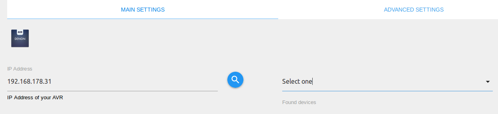
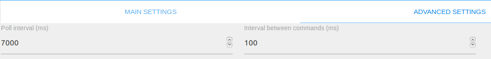

# IoBroker.denon
===========================


## Отказ от ответственности
DENON и Marantz являются товарными знаками D&M Holdings Inc.
Разработчики этого модуля никоим образом не одобрены и не связаны с D&M Holdings Inc. или какими-либо связанными дочерними компаниями, логотипами или товарными знаками.

## Установка
Вы можете установить адаптер через веб-интерфейс ioBroker или на свой локальный компьютер через npm.

### На основе браузера
1. Откройте веб-интерфейс ioBroker в браузере (например: 192.168.30.70:8081).
2. Нажмите на вкладку «Адаптеры».
3. Введите «Denon» в поле «Фильтр».
4. Нажмите на три точки, а затем на символ «+» адаптера DENON AVR.


### Локальная машина
Перейдите в папку iobroker и выполните следующую команду:

```bash
npm i iobroker.denon
```

## Настраивать
В дополнение к установке адаптера вы должны убедиться, что ваш AVR правильно настроен.

### IoБрокер
1. Откройте интерфейс ioBroker в браузере (например: 192.168.1.33:8081).
2. Перейдите на вкладку «Адаптеры».
3. Нажмите на три точки, а затем на символ «+» адаптера DENON AVR.


4. Теперь вы можете увидеть страницу конфигурации адаптера --> введите ip-адрес вашего DENON AVR или нажмите на поиск

значок для поиска AVR в вашей сети (через UPnP) 

5. Если вы также хотите настроить интервал запроса/опроса, не забудьте нажать на вкладку «Дополнительные настройки».

Уменьшая интервал опроса, адаптер уменьшит время между обновлением содержимого дисплея.
При уменьшении интервала запросов время между отправкой команд будет уменьшено.
Настройки по умолчанию должны подойти большинству пользователей.


6. Нажмите «Сохранить и закрыть».

### Сетевая настройка AV-ресивера
1. Нажмите кнопку SETUP, затем на FL-дисплее (и графическом интерфейсе) появится меню.
2. Выберите «Сеть» --> «Настройки».
3. Установите параметры, описанные ниже.

   *DHCP: «ВКЛ» (используйте этот параметр, когда DHCP-сервер находится в локальной сети.)*

   *IP-адрес: если для параметра <DHCP> установлено значение «Выкл.», установите IP-адрес.*

   *Маска подсети: если для параметра <DHCP> установлено значение «Выкл.», установите маску подсети.*

   *Шлюз: установите адрес шлюза, когда шлюз находится в локальной сети.*

   *Первичный DNS: не устанавливайте этот параметр.*

   *Второй DNS: не устанавливайте этот параметр.*

   *Прокси: установите для этого параметра значение «Выкл».*

4. Нажмите кнопку SETUP, после чего на FL-дисплее (и графическом интерфейсе) появится меню.
5. Выберите «Сеть» --> «Управление сетью/IP-управление».
6. Установите для этого параметра значение «Всегда включено».

## Применение
Обратите внимание, что AVR могут управлять только одним telnet-соединением. Если у вас есть активное соединение telnet e. грамм. с адаптером javascript, AVR откажется от подключения этого адаптера.
Здесь вы можете найти описание состояний и способы их использования.

### Кнопки
Адаптер создает следующие кнопки:

#### Канал: zoneMain / zone2 / zone3
* zoneMain.playPause

   *Воспроизведение и приостановка музыки с источников Bluetooth, Интернета, USB/iPod.*

* зонаMain.play

   *Воспроизведение музыки с источников Bluetooth, Интернета, USB/iPod.*

* zoneMain.pause

   *Пауза музыки с источников Bluetooth, Интернета, USB/iPod.*

* зонаMain.skipMinus

   *Перейти к предыдущему заголовку.*

   *НЕ ПОЛНОСТЬЮ ПОДДЕРЖИВАЕТСЯ ДЛЯ HEOS AVR*

* zoneMain.skipPlus

   *Перейти к следующему заголовку.*

   *НЕ ПОЛНОСТЬЮ ПОДДЕРЖИВАЕТСЯ ДЛЯ HEOS AVR*

* zoneMain.volumeDown / zone2.volumeDown / zone3.volumeDown

   *Уменьшите громкость основной зоны / Zone2 / Zone3.*

* zoneMain.volumeUp / zone2.volumeUp / zone3.volumeUp

   *Увеличить громкость основной зоны / зоны 2 / зоны 3.*

* zoneMain.equalizerBassUp / zone2.equalizerBassUp / zone3.equalizerBassUp

   *Кнопка, которая увеличивает уровень басов в Зоне.*

   *Настройки низких и высоких частот можно отрегулировать, если для параметра Dyn EQ установлено значение OFF, а функция Tone Control включена*

* zoneMain.equalizerBassDown / zone2.equalizerBassDown / zone3.equalizerBassDown

   *Кнопка, уменьшающая уровень басов в Зоне.*

   *Настройки низких и высоких частот можно отрегулировать, если для параметра Dyn EQ установлено значение OFF, а управление тоном включено*

* zoneMain.equalizerTrebleUp / zone2.equalizerTrebleUp / zone3.equalizerTrebleUp

   *Кнопка, которая увеличивает уровень высоких частот зоны.*

   *Настройки низких и высоких частот можно отрегулировать, если для параметра Dyn EQ установлено значение OFF, а функция Tone Control включена*

* zoneMain.equalizerTrebleDown / zone2.equalizerTrebleDown / zone3.equalizerTrebleDown

   *Кнопка, уменьшающая уровень высоких частот зоны.*

   *Настройки низких и высоких частот можно отрегулировать, если для параметра Dyn EQ установлено значение OFF, а управление тоном включено*

#### Канал: настройки
* settings.subwooferLevelDown / настройки.subwooferTwoLevelDown

   *Уменьшите уровень сабвуфера, нажав кнопку.*

* настройки.subwooferLevelUp / настройки.subwooferTwoLevelUp

   *Увеличьте уровень громкости сабвуфера, нажав кнопку.*

* настройки.containmentAmountDown

   * Уменьшите количество Audyssey LFC. Кнопка будет создана только в том случае, если она поддерживается вашим AVR.*

* настройки.containmentAmountUp

   * Увеличьте количество Audyssey LFC. Кнопка будет создана только в том случае, если она поддерживается вашим AVR.*

* settings.cursorUp/settings.cursorDown/settings.cursorLeft/settings.cursorRight

   *Имитирует кнопки курсора вашего пульта дистанционного управления*

* настройки.введите

   *Имитирует кнопку ввода на пульте дистанционного управления*

* настройки.возврат

   *Имитирует кнопку возврата/назад на пульте дистанционного управления*

* настройки.опция

   *Имитирует кнопку выбора на вашем пульте дистанционного управления*

* настройки.информация

   *Имитирует информационную кнопку вашего пульта дистанционного управления*

### Канал: тюнер
* тюнер.частотаВверх

    *Увеличивает частоту тюнера.*

* тюнер.частотаВниз

  *Уменьшает частоту тюнера.*

### Состояния
Следующие состояния будут созданы адаптером:

#### Канал: информация
* информация.связь

    |Тип данных|Разрешение|
    |:---:|:---:|
    |логический|R|

   * Логический индикатор только для чтения. Если ваш брокер подключен к вашему DENON AVR, состояние равно true, в противном случае — false.*

* info.friendlyName

    |Тип данных|Разрешение|
    |:---:|:---:|
    |строка|Р|

   * Строка только для чтения. Содержит понятное имя подключенного AVR.*

* info.onlinePresets

    |Тип данных|Разрешение|
    |:---:|:---:|
    |строка|Р|

*Строка в формате массива JSON, которая представляет текущее сохраненное избранное по идентификатору и каналу.
Имена каждого канала ограничены 20 цифрами. Вы можете сохранить текущий канал с идентификатором, установив settings.savePreset и загрузить один, установив settings.loadPreset для соответствующего идентификатора. *

#### Канал: zoneMain / zone2 / zone3
* zoneMain.volume / zone2.volume / zone3.volume

    |Тип данных|Разрешение|
    |:---:|:---:|
    |число|Ч/З|

*Числовое значение, которое представляет текущую громкость основной зоны / зоны 2 / зоны 3 вашего AVR. Здесь же можно установить громкость.
Громкость также представлена в дБ в отдельных состояниях, например. грамм. mainVolumeDB*

   * Диапазон от 0 до 98 (может быть меньше из-за максимальной громкости), где 80 = 0 дБ*

   *Пример:*

```javascript
setState('denon.0.zoneMain.volume', 45.5); // Sets volume of Main Zone to 45.5
```

* zoneMain.maximumVolume

    |Тип данных|Разрешение|
    |:---:|:---:|
    |число|R|

   *Число только для чтения, представляющее максимально возможную громкость, где 80 = 0 дБ. Громкость также устанавливается в дБ в состоянии maxVolumeDB.*

* zoneMain.muteIndicator/zone2.muteIndicator/zone3.muteIndicator

    |Тип данных|Разрешение|
    |:---:|:---:|
    |логический|чтение/запись|

   * Логическое значение, которое истинно, если звук основной зоны/зоны 2/зоны 3 отключен, в противном случае – ложь. В этом состоянии вы можете отключить свой AVR.*

   *Пример:*

```javascript
setState('denon.0.zoneMain.muteIndicator', true); // Mutes the Main Zone of your AVR
```

* zoneMain.powerZone/zone2.powerZone/zone3.powerZone

    |Тип данных|Разрешение|
    |:---:|:---:|
    |логический|чтение/запись|

   * Логическое значение, которое истинно, если зона включена, иначе ложно. В этом состоянии вы можете включать и выключать AVR/Zone.*

* zoneMain.selectInput/zone2.selectInput/zone3.selectInput

    |Тип данных|Разрешение|
    |:---:|:---:|
    |строка|чтение/запись|

   * Строковое значение содержит текущий источник ввода. Вы также можете установить источник входного сигнала со следующей кодировкой:*

   *0: ФОНО*

   *1: компакт-диск*

   *2: ТЮНЕР*

   *3: DVD*

   *4: БД*

   *5: ТВ*

   *6: СБ/КВ*

   *7: ВОСПРОИЗВЕДЕНИЕ*

   *8: ИГРА*

   *9: НЕТТО*

   *10: УЗНАТЬ*

   *11: ПОСЛЕДНЯЯ ЧАСТЬ*

   *12: ИРАДИО*

   *13: СЕРВЕР*

   *14: ИЗБРАННОЕ*

   *15: ВСПОМОГАТЕЛЬНЫЙ1*

   *16: ВСПОМОГАТЕЛЬНЫЙ2*

   *17: ВСПОМОГАТЕЛЬНЫЙ3*

   *18: ВСПОМОГАТЕЛЬНЫЙ4*

   *19: ВСПОМОГАТЕЛЬНЫЙ5*

   *20: ВСПОМОГАТЕЛЬНЫЙ6*

   *21: ВСПОМОГАТЕЛЬНЫЙ7*

   *22: БТ*

   *23: USB*

*Обратите внимание, что не все источники входного сигнала доступны на каждой модели AVR. Если ваш AVR имеет дополнительные входы, они будут добавлены в список, как только будут обнаружены.*

   *Пример:*

```javascript
 setState('denon.0.zoneMain.selectInput', '5'); // Selects TV as input for Main Zone
```

* zoneMain.quickSelect/zone2.quickSelect/zone3.quickSelect

   |Тип данных|Разрешение|
   |:---:|:---:|
   |число|Ч/З|

   *Имитирует кнопки быстрого выбора на пульте дистанционного управления с цифрами от 1 до 5 для основной зоны / зоны 2 / зоны 3.*

* zoneMain.sleepTimer / zone2.sleepTimer / zone3.sleepTimer

    |Тип данных|Разрешение|
    |:---:|:---:|
    |число|Ч/З|

   *Числовое значение для чтения и установки таймера сна для выбранной зоны. Значение будет обновлено менее чем через 10 секунд.*

* zoneMain.iconURL

    |Тип данных|Разрешение|
    |:---:|:---:|
    |строка|Р|

   *Содержит ссылку, по которой можно найти обложку воспроизводимого канала/песни.*

   *НЕ ПОДДЕРЖИВАЕТСЯ ДЛЯ HEOS AVR*

* zoneMain.equalizerBass / zone2.equalizerBass / zone3.equalizerBass

    |Тип данных|Разрешение|
    |:---:|:---:|
    |число|Ч/З|

   *Числовое значение, которое представляет уровень низких частот в Зоне. Диапазон значений от -6 до +6 дБ.*

   *Настройки низких и высоких частот можно отрегулировать, если для параметра Dyn EQ установлено значение OFF, а управление тоном включено*

* zoneMain.equalizerTreble / zone2.equalizerTreble / zone3.equalizerTreble

    |Тип данных|Разрешение|
    |:---:|:---:|
    |число|Ч/З|

   *Числовое значение, которое представляет уровень высоких частот зоны. Диапазон значений от -6 до +6 дБ.*

   *Настройки низких и высоких частот можно отрегулировать, если для параметра Dyn EQ установлено значение OFF, а управление тоном включено*

* zoneMain.channelVolumeFrontLeft / zone2.channelVolumeFrontLeft / zone3.channelVolumeFrontLeft / ...

   |Тип данных|Разрешение|
   |:---:|:---:|
   |число|Ч/З|

*Числовое значение, которое представляет текущий уровень громкости канала для каждого динамика. Каждый динамик имеет отдельное состояние. Настройки влияют на текущий выбор режима ввода. Состояние можно регулировать от -12 дБ до +12 дБ.*

#### Канал: тюнер
* тюнер.название станции

  |Тип данных|Разрешение|
  |:---:|:---:|
  |строка|Р|

  *Строка только для чтения, содержащая название текущей станции, если оно доступно.*

* тюнер.частота

  |Тип данных|Разрешение|
  |:---:|:---:|
  |число|Ч/З|

*Числовое значение, которое представляет текущую частоту. Вы также можете установить частоту с этим состоянием.
Значения ниже 500 относятся к частоте FM, а выше 500 — к частоте AM.*

```javascript
setState('denon.0.tuner.frequency', 106.9); // Set frequency to 106.9 MHz (FM)
```

#### Канал: дисплей
* дисплей.displayContent

    |Тип данных|Разрешение|
    |:---:|:---:|
    |строка|Р|

   *Строка, доступная только для чтения, содержащая содержимое вашего дисплея AVR. Он имеет девять состояний от 0 до 9.*

   *КОНТЕНТ ОТОБРАЖЕНИЯ НЕ ПОДДЕРЖИВАЕТСЯ ДЛЯ HEOS AVR*

* дисплей.яркость

    |Тип данных|Разрешение|
    |:---:|:---:|
    |строка|чтение/запись|

   * Строковое значение, представляющее яркость дисплея. Значение также может задавать яркость дисплея с помощью следующей кодировки:*

   *0: Off --> выключает дисплей*

   *1: Темный --> затемняет дисплей*

   *2: Затенен --> затемняет дисплей*

   *3: Яркий --> делает дисплей ярче*

   *Пример:*

```javascript
setState('denon.0.display.brightness', '3'); // Sets display brightness to "Bright"
```

#### Канал: настройки
* settings.powerСистема

    |Тип данных|Разрешение|
    |:---:|:---:|
    |логический|чтение/запись|

   * Логическое значение, которое является истинным, если AVR включен, иначе ложным. В этом состоянии вы также можете включать и выключать AVR.*

* настройки.surroundMode

    |Тип данных|Разрешение|
    |:---:|:---:|
    |строка|чтение/запись|

   * Строковое значение содержит текущий режим объемного звучания. Вы также можете изменить источник с помощью следующей кодировки:*

   *0: СТЕРЕО*

   *1: ВИРТУАЛЬНЫЙ*

   *2: ВИДЕОИГРА*

   *3: МЧ СТЕРЕО*

   *4: ОБЪЕМНОЕ DTS*

   *5: ДОЛБИ ЦИФРОВОЙ*

   *6: ФИЛЬМ*

   *7: МУЗЫКА*

   *8: НАПРЯМУЮ*

   *9: ЧИСТАЯ ПРЯМАЯ*

   *10: АВТО*

   *11: ИГРА*

   *12: АВРО3D*

   *13: АВРО2ДСУРР*

   *14: ШИРОКИЙ ЭКРАН*

   *15: СУПЕР СТАДИОН*

   *16: РОК АРЕНА*

   *17: ДЖАЗ-КЛУБ*

   *18: КЛАССИЧЕСКИЙ КОНЦЕРТ*

   *19: МОНО ФИЛЬМ*

   *20: МАТРИЦА*

   *Обратите внимание, что не все режимы Surround доступны на каждой модели AVR.*

   *Пример:*

```javascript
setState('denon.0.settings.surroundMode', '3'); // Sets Multi Channel Stereo as surround mode
```

* settings.lfeAmount

    |Тип данных|Разрешение|
    |:---:|:---:|
    |число|Ч/З|

*Количество сигнала сабвуфера, дополнительно направленного на динамики, в дБ.
Диапазон от 0 дБ до -10 дБ. Где 10 = -10 дБ.*

* settings.expertCommand

    |Тип данных|Разрешение|
    |:---:|:---:|
    |строка|чтение/запись|

   * Вы можете отправлять свои собственные команды с этим состоянием. Вы можете найти обзор существующих команд в [AVR-Control-Protocol.pdf](docs/AVR-Control-Protocol.pdf)*

   *Пример:*

```javascript
setState('denon.0.settings.expertCommand', 'ECOON'); // Turns Main Zone ECO mode on
```

* settings.expertReadingPattern

    |Тип данных|Разрешение|
    |:---:|:---:|
    |строка|чтение/запись|

*Если вы хотите получить конкретные ответы, хранящиеся в `settings.expertReadingResult`, вам необходимо установить регулярное выражение в это состояние.
RegEx должен быть установлен, чтобы его мог использовать конструктор RegEx. Рекомендуется использовать [Тестер регулярных выражений](https://regexr.com/).
Не устанавливайте `/` в начале или конце RegEx.*

    *Пример:*

```javascript
setState('denon.0.settings.expertReadingPattern', '(MV.+)|(SSINFAISFSV.+)');

ttings.expertReadingResult

|Data type|Permission|
|:---:|:---:|
|string|R|

*Incoming data, which matches the RegEx of `settings.expertReadingPattern` will be set to this state.*


ttings.dialogControl

|Data type|Permission|
|:---:|:---:|
|number|R/W|

*The dialog control, which can be operated from 0 dB to 6 dB.*

ttings.dialogLevelAdjust

|Data type|Permission|
|:---:|:---:|
|boolean|R/W|

*Turns the dialog level adjustment on, which allows to modify the dialog volume of DTS content.*

ttings.dialogLevel

|Data type|Permission|
|:---:|:---:|
|boolean|R/W|

*If dialog level adjustment is turned on you can modify the dialog volume of DTS content between -12 dB and +12 dB.*

ttings.outputMonitor

|Data type|Permission|
|:---:|:---:|
|string|R/W|

Select the output monitor of your AVR. This state will only be created if your AVR supports two HDMI outputs. You can switch the state between:*

0: AUTO --> Auto detection of monitor*

1: 1 --> Outputs signal to monitor 1*

2: 2 --> Outputs signal to monitor 2*

Example:*

``javascript
etState('denon.0.settings.outputMonitor', '2'); // Sets monitor 2 as active monitor
``

* settings.videoProcessingMode

    |Тип данных|Разрешение|
    |:---:|:---:|
    |строка|чтение/запись|

   *Выберите режим обработки видео вашего AVR. Это состояние будет создано только в том случае, если ваш AVR поддерживает его. Вы можете переключать состояние между:*

   *0: АВТО*

   *1: ИГРА*

   *2: ФИЛЬМ*

   *Пример:*

```javascript
setState('denon.0.settings.videoProcessingMode', '2'); // Sets Video Processing Mode to "MOVIE"
```

* settings.centerSpread

    |Тип данных|Разрешение|
    |:---:|:---:|
    |логический|чтение/запись|

   * Логическое значение, которое истинно, если центральный разворот включен, иначе ложно. В этом состоянии вы также можете включить/выключить разброс по центру.*

* настройки .dynamicEq

    |Тип данных|Разрешение|
    |:---:|:---:|
    |логический|чтение/запись|

   * Логическое значение, которое представляет состояние динамического эквалайзера. Вы также можете включать и выключать динамический эквалайзер в этом состоянии.*

* settings.subwooferLevelState

    |Тип данных|Разрешение|
    |:---:|:---:|
    |логический|чтение/запись|

   * Логическое значение, если оно истинно, вы можете вносить изменения на уровне сабвуфера.*

* настройки.subwooferLevel / настройки.subwooferTwoLevel

    |Тип данных|Разрешение|
    |:---:|:---:|
    |число|Ч/З|

*Числовое значение, указывающее текущий уровень громкости сабвуфера. Значение имеет диапазон от -12 до 12 (от -12 дБ до +12 дБ).
Состояние SubwooferTwoLevel будет создано только в том случае, если оно поддерживается вашим AVR.*

* настройки.audysseyLfc

    |Тип данных|Разрешение|
    |:---:|:---:|
    |логический|чтение/запись|

* Логическое значение, которое содержит и может управлять состоянием низкочастотного сдерживания Audyssey (вкл./выкл.).
Состояние будет создано только в том случае, если оно поддерживается вашим AVR.*

* настройки.containmentAmount

    |Тип данных|Разрешение|
    |:---:|:---:|
    |число|Ч/З|

*Числовое значение для установки уровня низкочастотного сдерживания. Значение может быть от 1 до 7. Состояние будет создано только в том случае, если оно поддерживается вашим AVR.*

* настройки.multEq

    |Тип данных|Разрешение|
    |:---:|:---:|
    |строка|чтение/запись|

   * Строковое значение для установки функции MultEQ вашего AVR со следующей кодировкой:*

   *0: ВЫКЛ*

   *1: ОДИССЕЙ*

   *2: БАЙП.ЛР*

   *3: ПЛОСКИЙ*

   *4: РУЧНОЙ*

* настройки.dynamicVolume

    |Тип данных|Разрешение|
    |:---:|:---:|
    |строка|чтение/запись|

   * Строковое значение для выбора динамического тома по следующей кодировке:*

   *0: OFF --> отключает динамическую громкость*

   *1: LIT --> загорается индикатор динамической громкости*

   *2: MED --> устанавливает динамическую громкость на среднюю*

   *3: HEV --> громкость динамического режима становится высокой*

* settings.referenceLevelOffset

    |Тип данных|Разрешение|
    |:---:|:---:|
    |строка|чтение/запись|

   * Строковое значение для выбора смещения опорного уровня в следующей кодировке:*

   *0: 0 дБ*

   *5: 5 дБ*

   *10: 10 дБ*

   *15: 15 дБ*

   *Пример:*

```javascript
setState('denon.0.settings.referenceLevelOffset', '5'); // Sets Reference Level Offset to 5 dB
```

* настройки .pictureMode

    |Тип данных|Разрешение|
    |:---:|:---:|
    |строка|чтение/запись|

   * Строковое значение для установки прямого изменения режима изображения. Это состояние будет создано только в том случае, если ваш AVR поддерживает его*

   *Вы можете установить следующие значения в виде строки:*

   *'Выключенный'*

   *'Стандарт'*

   *'Фильм'*

   *'Яркий'*

   *'Поток'*

   *'Обычай'*

   *'День ИСФ'*

   *'Ночь ИСФ'*

   *Пример:*

```javascript
setState('denon.0.settings.pictureMode', 'Standard'); // Set Picture Mode Direct Change to Standard
```

* настройки .toneControl

    |Тип данных|Разрешение|
    |:---:|:---:|
    |логический|чтение/запись|

   * Логическое значение, указывающее состояние управления тоном. Вы можете включить/выключить его в этом состоянии.*

   *Управление тоном можно включить, только если для параметра Dyn EQ установлено значение OFF*

* настройки.setupMenu

    |Тип данных|Разрешение|
    |:---:|:---:|
    |логический|чтение/запись|

   * Логический индикатор, показывающий, открыто или закрыто меню настройки в данный момент. Вы можете открывать и закрывать его в этом состоянии.*

* settings.savePreset

    |Тип данных|Разрешение|
    |:---:|:---:|
    |число|Ч/З|

*Числовое значение, которое можно установить равным значению info.onlinePresets. Затем текущий канал будет сохранен как пресет под заданным номером.
Можно использовать только номера, содержащиеся в info.onlinePresets. Состояние не получит подтверждения, независимо от того, была ли команда успешной или нет. Вы можете проверить info.onlinePresets, чтобы проверить, работает ли команда так, как нужно.*

* настройки.loadPreset

    |Тип данных|Разрешение|
    |:---:|:---:|
    |число|Ч/З|

*Числовое значение, которое можно установить равным значению info.onlinePresets. Это загрузит соответствующий канал.
Это состояние не получит подтверждения, независимо от того, была ли команда успешной или нет.*

* settings.speakerPreset

  |Тип данных|Разрешение|
  |:---:|:---:|
  |число|Ч/З|

  * Установите предустановку динамиков, если она поддерживается AVR. Предустановка динамика может быть `1` или `2`.*

### Другие штаты
Из-за того, что некоторые AVR, такие как DENON POA-3012CI, используют другую логику, существуют некоторые различия в состояниях.
Состояния, эквивалентные перечисленным выше, это: settings.powerSystem, settings.expertCommand, display.brightness и info.connection. Дополнительно для каждой зоны 2-12 (четные) создаются следующие состояния:

* zoneX.speakerOneVolume / zoneX.speakerTwoVolume

    |Тип данных|Разрешение|
    |:---:|:---:|
    |число|Ч/З|

*Числовое значение, представляющее громкость динамика AVR. Если для параметра operationMode установлено значение «BRIDGED», динамики не могут управляться независимо друг от друга, и управление одним из них также влияет на громкость других.*

* zoneX.selectInputOne/zoneX.selectInputTwo

    |Тип данных|Разрешение|
    |:---:|:---:|
    |строка|чтение/запись|

*Пара ключевых значений, которая представляет выбранный вход динамика AVR. Если для параметра operationMode установлено значение «BRIDGED», динамики не могут управляться независимо друг от друга, и управление одним из них также управляет вводом других.*

    *Возможны следующие значения:*

    *'0': 'ШИНА Л'*

    *'1': 'ШИНА R'*

    *'2': 'АВТОБУС М'*

    *'3': 'ВСПОМОГАТЕЛЬНЫЙ'*

* zoneX.operationMode

    |Тип данных|Разрешение|
    |:---:|:---:|
    |строка|чтение/запись|

*Пара значений ключа, которая представляет режим работы AVR. Если для параметра operationMode установлено значение «BRIDGED», динамики не могут управляться независимо друг от друга, а управление первым динамиком также управляет вторым динамиком.*

    *Возможны следующие значения:*

    *'0': 'НОРМАЛЬНЫЙ'*

    *'1': 'МОСТ'*

* zoneX.lowCutFilterSpeakerOne / zoneX.lowCutFilterSpeakerTwo

    |Тип данных|Разрешение|
    |:---:|:---:|
    |логический|чтение/запись|

* Логическое значение, указывающее, включен или отключен фильтр низких частот для динамика. В мостовом режиме оба динамика будут зависеть друг от друга.*

* zoneX.zoneTurnOnModeChange

    |Тип данных|Разрешение|
    |:---:|:---:|
    |строка|чтение/запись|

*Пара значений ключа, которая представляет изменение режима включения зоны для зоны. Вы также можете управлять своим AVR в этом состоянии.*

    *Возможны следующие значения:*

    *'0': 'Постоянная'*

    *'1': 'Триггер в'*

    *'2': 'Аудиосигнал'*

    *'3': 'Выкл'*

* zoneX.triggerInput

    |Тип данных|Разрешение|
    |:---:|:---:|
    |логический|чтение/запись|

    *Включите или выключите ввод триггера с помощью этого логического значения.*

* зонаX.audioSignalInput

    |Тип данных|Разрешение|
    |:---:|:---:|
    |логический|чтение/запись|

    * Логическое значение, которое указывает и управляет входным аудиосигналом вашего AVR.*

## Отсутствующие функции и ошибки
Если у вас отсутствуют какие-либо функции или обнаружена ошибка, откройте [проблема](https://github.com/foxriver76/ioBroker.denon/issues).

Адаптер протестирован с DENON AVR-X1200W и Marantz SR5009.

## Changelog
<!--
	Placeholder for the next version (at the beginning of the line):
	### __WORK IN PROGRESS__
-->
### 1.13.1 (2022-03-19)
* (foxriver76) added `settings.speakerPreset`

### 1.12.1 (2022-01-03)
* (foxriver76) fixed missing digits in `tuner.stationName`

### 1.12.0 (2022-01-02)
* (foxriver76) we introduce tuner states
* (foxriver76) performance optimizations

### 1.11.2 (2021-08-08)
* (foxriver76) we fixed missing conversion to db on equalizer treble state for additional zones (fixes #162)

### 1.11.1 (2021-06-29)
* (foxriver76) fixes for silent reconnection - if ETIMEDOUT occurs repeatedly switch to debug, like for other errors (closes #149)

### 1.11.0 (2021-06-06)
* (foxriver76) implemented dialog level adjustment for DTS content (closes #143)
* (foxriver76) new datapoints are `settings.dialogLevelAdjust`, `settings.dialogLevel`, `settings.dialogControl`

### 1.10.7 (2021-05-12)
* (foxriver76) fix missing conversion to db on equalizer states for additional zones (fixes #137)

### 1.10.6 (2021-05-03)
* (foxriver76) we fixed some more types

### 1.10.5 (2021-05-02)
* (foxriver76) we fixed some datapoints having wrong types or wrong state values set (fixes #130)

### 1.10.4 (2021-02-20)
* (foxriver76) if an older model (e.g. AVR 3808) just sends `NSE`, we do not set displayContent state anymore (fixes #112)

### 1.10.3 (2021-01-28)
* (foxriver76) don't poll whole online presets after change, it is unnecessary load

### 1.10.2 (2021-01-28)
* (foxriver76) return after detecting NSH command
* (foxriver76) use release script

### 1.10.0 (2021-01-17)
* (foxriver76) auto-detect selectInput of all zones

### 1.9.4 (2021-01-03)
* (foxriver76) added missing rear height speaker states
* (foxriver76) revert the last added options because they are not working as intended
* (foxriver76) no longer remove digits and spaces from surroundMode response

### 1.9.2 (2021-01-03)
* (foxriver76) added some missing options for surroundMode

### 1.9.1 (2020-12-03)
* (foxriver76) prevent writing in destroyed socket on adapter unload
* (foxriver76) add subwoofer states for main zone
* (foxriver76) internal optimizations

### 1.8.1 (2020-11-29)
* (foxriver76) added states for atmos speakers `channelVolumeSurroundDolbyRight/Left` and `channelVolumeFrontDolbyLeft/Right`
* (foxriver76) fixed bug with setting channelVolume of other zones than main
* (foxriver76) added states `channelVolumeFrontHeightRight/Left` and `channelVolumeSurroundHeightLeft/Right`

### 1.7.7 (2020-04-28)
* (foxriver76) fixed timing issue which could lead to state creation procedure triggered more than once

### 1.7.5 (2020-04-21)
* (foxriver76) better error handling

### 1.7.4 (2020-04-01)
* (foxriver76) fix potential timeout issues

### 1.7.2 (2020-01-08)
* (foxriver76) another fix for DENON Picool to keep connection alive when turned off

### 1.7.1 (2019-11-19)
* (foxriver76) added ability to read desired data by expertReading states

### 1.6.1 (2019-10-08)
* (foxriver76) fixed bug with selectInput for zone2 and 3

### 1.6.0
* (foxriver76) added new state settings.lfeAmount

### 1.5.1
* (foxriver76) fix to detect DENON Ceol

### 1.5.0
* (foxriver76) added channel volumes for zone2 + 3
* (foxriver76) other optimizations
* (foxriver76) support of DENON POA-3012CI and similar AVRs
* (foxriver76) create db volumes everytime

### 1.3.2
* (foxriver76) compact mode compatibility added

### 1.2.7
* (foxriver76) make sure states are never set before creation
* (foxriver76) minor fixes and improvements

### 1.2.6
* (foxriver76) only updating sleep timer and quick select on change
* (foxriver76) using promises wherever possible
* (foxriver76) minor improvements

### 1.2.4
* (foxriver76) fix verbose logging on network issues
* (foxriver76) as long as connection error stays the same, logging happens on debug

### 1.2.3
* (foxriver76) add missing usb to selectInput for all zones

### 1.2.2
* (foxriver76) use adapter core

### 1.2.1
* (foxriver76) info.onlinePresets converted to JSON array to work properly with widgets

### 1.2.0
* (foxriver76) added info.onlinePresets which is a JSON string containing all presets
* (foxriver76) settings.savePreset and loadPreset to save and load presets according to the info.onlinePresets

### 1.1.0
* (foxriver76) added Bluetooth as select input (BT)

### 1.0.0
* (foxriver76) formal version increment

### 0.6.0
* (foxriver76) fix that enables Marantz receiver to use the quickSelect functionality
* (foxriver76) quick select is now acknoledged
* (foxriver76) remove old quick select buttons

### 0.5.0
* (foxriver76) added possibility to control channelVolume per speaker for Main Zone
* (foxriver76) new states added to readme and documentation

### 0.4.4
* (foxriver76) fix bug where picture mode command was sent as undefined

### 0.4.3
* (foxriver76) fallback for advanced settings
* (foxriver76) fix double reconnection when AVR closes the socket
* (foxriver76) fix a problem where callback for pictureMode is called to early

### 0.4.2
* (foxriver76) pictureMode role fixed

### 0.4.1
* (foxriver76) added picture mode direct change

### 0.3.9
* (foxriver76) only create containment amount, audyssey lfc, subwoofer two level if supproted
* (foxriver76) readme updated

### 0.3.8
* (foxriver76) add state to control center spread
* (foxriver76) readme updated
* (foxriver76) addded video processing mode control
* (foxriver76) optimizations and minor fixes

### 0.3.7
* (foxriver76) minor code optimization
* (foxriver76) fixes on readme
* (foxriver76) logging undhandled commands on debug

### 0.3.6
* (foxriver76) fixed displayState non-readable chars for old AVRs
* (foxriver76) fixes on readme
* (foxriver76) capital chars in mainZone volumeUp/down names, are now lowercase

### 0.3.5
* (foxriver76) removed isPlaying state, because not working properly
* (foxriver76) update readme

### 0.3.4
* (foxriver76) fix that HEOS does not create http and display content related states

### 0.3.3
* (foxriver76) added state for setup button
* (foxriver76) added cursors and remote control buttons
* (foxriver76) readme update

### 0.3.2
* (foxriver76) Added isPlaying state for non-HEOS AVR's, thanks to bluefox
* (foxriver76) Added link to cover for non-HEOS AVR's
* (foxriver76) displayContent, isPlaying, coverURL will only be generated for non-HEOS
* (foxriver76) Updated readme

### 0.3.1
* (foxriver76) Added placeholder ip in config gui
* (foxriver76) fixed volume in db for main zone

### 0.3.0
* (bluefox & foxriver76) Names and roles were refactored
* (bluefox) Discovery added
* (foxriver76) Update Readme
* (foxriver76) Implemented separate Play & Pause button
* (bluefox & foxriver76) Internal improvements

### 0.2.4
* (foxriver76) prevent adapter from doing more than one reconnect attempt at the same time
* (foxriver76) improved stability
* (foxriver76) update readme

### 0.2.3
* (foxriver76) added possibility to handle states in dB additional
* (foxriver76) minor changes

### 0.2.2
* (foxriver76) removed unneeded files
* (foxriver76) state lists are now of type string due to better compatibility
* (foxriver76) optimized matching for state lists
* (foxriver76) some state lists can be set by the value additionaly to the key

### 0.2.1
* (foxriver76) small bug fixes on connection error handling
* (foxriver76) improvements on module size

### 0.2.0
* (foxriver76) preparations for offical repository

### 0.1.9
* (foxriver76) improved stability
* (foxriver76) improved fault tolerance on volume (e. g. for use as smart device)

### 0.1.8
* (foxriver76) adapter sepcific connection error handling
* (foxriver76) minor reconnect fix

### 0.1.7
* (foxriver76) subwoofer level is now in dB
* (foxriver76) added control of treble, bass and tone control state
* (foxriver76) readme updated

### 0.1.6
* (foxriver76) connection stability improvements
* (foxriver76) some parameter settings added
* (foxriver76) readme updated

### 0.1.5
* (foxriver76) sleep timer for every zone
* (foxriver76) admin2 compatibility
* (foxriver76) minor fixes

### 0.1.4
* (foxriver76) HEOS bug fix (timeout)
* (foxriver76) new state for custom commands (expertCommand)
* (foxriver76) enhanced readme

### 0.1.3
* (foxriver76) bug fixes for Zone3
* (foxriver76) new state for main zone power
* (foxriver76) minor other improvements

### 0.1.2
* (foxriver76) Performance optimization
* (foxriver76) Faster display update
* (foxriver76) More appropriate reconnect intervall

### 0.1.1
* (foxriver76) new readme for npm

### 0.1.0
* (foxriver76) handling up to three zones
* (foxriver76) handling display content
* (foxriver76) setting display brightness

### 0.0.1
* (foxriver76) initial release

## License
The MIT License (MIT)

Copyright (c) 2018-2022 Moritz Heusinger <moritz.heusinger@gmail.com>

Permission is hereby granted, free of charge, to any person obtaining a copy
of this software and associated documentation files (the "Software"), to deal
in the Software without restriction, including without limitation the rights
to use, copy, modify, merge, publish, distribute, sublicense, and/or sell
copies of the Software, and to permit persons to whom the Software is
furnished to do so, subject to the following conditions:

The above copyright notice and this permission notice shall be included in
all copies or substantial portions of the Software.

THE SOFTWARE IS PROVIDED "AS IS", WITHOUT WARRANTY OF ANY KIND, EXPRESS OR
IMPLIED, INCLUDING BUT NOT LIMITED TO THE WARRANTIES OF MERCHANTABILITY,
FITNESS FOR A PARTICULAR PURPOSE AND NONINFRINGEMENT. IN NO EVENT SHALL THE
AUTHORS OR COPYRIGHT HOLDERS BE LIABLE FOR ANY CLAIM, DAMAGES OR OTHER
LIABILITY, WHETHER IN AN ACTION OF CONTRACT, TORT OR OTHERWISE, ARISING FROM,
OUT OF OR IN CONNECTION WITH THE SOFTWARE OR THE USE OR OTHER DEALINGS IN
THE SOFTWARE.
