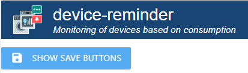

# IoBroker.device-напоминание

## Нужен файл readme на немецком языке?  [немецкий readme](https://github.com/Xenon-s/ioBroker.device-reminder/blob/master/README_GER.md)
 

# Адаптер для мониторинга состояний устройств Версия
Этот адаптер может определять с помощью измерительных гнезд, включено ли устройство, работает ли оно или выключено, и реагировать на это. Затем сообщения могут автоматически отправляться через Telegram, whatsapp, Alexa, Sayit, Pushover и электронную почту (возможен множественный выбор для каждого устройства). Также возможно автоматическое отключение розетки после завершения процесса (также с задержкой по времени). При заданном времени выполнения можно выводить сигнал тревоги на каждую точку данных (с внешним скриптом точка данных выдает только true/false или как отображение в vis). Для этого достаточно ввести время предварительного стробирования просто в минутах в точку данных 'device-reminder.X.XXX.config.runtime max'.

# Что следует учитывать?
Интервал обновления &quot;живого значения потребления (называется **&quot;\_energy &quot;**)&quot; для большинства устройств не должен превышать 10 секунд, в противном случае это может привести к очень запоздалым сообщениям. Сам адаптер опрашивает значения каждые 10 секунд и использует новые значения на основе событий. Это экономит систему  Команда в консоли Tasmota: TelePeriod 10

# Что возможно для каждого устройства?
- Уведомление при запуске устройства
- Уведомление об окончании работы соответствующего устройства
- Уведомление Telegram (возможно несколько идентификаторов)
- Уведомление Alexa (возможно несколько идентификаторов)
- Уведомление WhatsApp (возможно несколько идентификаторов)
- Уведомление о несоответствии (возможно несколько идентификаторов)
- Уведомление по электронной почте (возможно несколько идентификаторов)
- Уведомление о сигнале (возможны несколько идентификаторов)
- Матричное уведомление (возможно несколько идентификаторов)
- Уведомления можно создавать свободно или задавать внешним скриптом.
- Точки данных с текущим статусом, текущим потреблением и последним отправленным сообщением о статусе для использования значений из этого адаптера в других скриптах
- Устройства могут быть отключены по требованию (также с задержкой по времени), если обнаружено, что процесс завершен
- Голосовые помощники могут быть временно отключены для каждой точки данных
- Мониторинг времени выполнения в минутах: если время превышено, всем выбранным мессенджерам отправляется сигнал тревоги

# Инструкция
## Основные вещи заранее
Для каждой группы устройств, alexa и т. д. есть кнопка &quot;Проверить ввод&quot;. Если нажать на эту кнопку, существующие записи проверяются на достоверность и вы сразу получаете ответ, все ли записи верны. Если вы внесли изменения, эту кнопку нужно нажимать всегда! Кнопку нужно нажимать всегда, когда она появляется!    

## Создать устройство

- **Имя устройства**: свободно выбираемое имя
- **Тип устройства**: здесь необходимо выбрать, какое это устройство, чтобы вычисления в адаптере выполнялись корректно.
- **Потребление**: Нажав на кнопку с тремя белыми точками, вы откроете управление объектом. Вам нужно выбрать точку данных, которая показывает **текущее потребление**.
- **Включить/выключить**: Нажмите кнопку с тремя белыми точками, чтобы открыть управление объектами. Вам нужно выбрать точку данных, которая включает/выключает вашу **розетку** (не обязательно). Если это не выбрано, автоматическое выключение не произойдет.
- **Начальный текст**: уведомление, которое должно быть отправлено при запуске устройства (также возможны специальные символы)
- Конечный текст\*\*: Уведомление, которое будет отправлено после завершения работы устройства (также возможны специальные символы)

В **Starttext** и **Endtext** вы также можете получить сообщение из внешней точки данных. Это сообщение считывается с задержкой в 1 секунду из точки данных после изменения статуса устройства. Таким образом, вы можете получить сообщение из внешнего скрипта. Адаптер автоматически определяет, пришло ли сообщение из точки данных или оно было просто введено вручную. Чтобы выбрать точку данных, просто нажмите на кнопку с тремя белыми точками, а затем выберите соответствующую точку данных. **Обратите внимание**: можно использовать только либо точку данных **или** вручную введенное сообщение! 

# Настройка устройств

- **активно**: Активировано по умолчанию. Здесь вы можете временно деактивировать устройство, чтобы оно больше не отправляло уведомления.
- Устройство\*\*: будет создано автоматически
- **Alexa**: все ранее созданные Alexa перечислены здесь и могут быть добавлены одним щелчком мыши
- **sayit**: все ранее созданные устройства sayit перечислены здесь и могут быть добавлены одним щелчком мыши
- **telegram**: все ранее созданные пользователи Telegram перечислены здесь и могут быть добавлены одним щелчком мыши
- **whatsapp**: все ранее созданные пользователи WhatsApp будут перечислены здесь и могут быть добавлены, нажав на них
- **pushover**: все ранее созданные пользователи pushover перечислены здесь и могут быть добавлены одним щелчком мыши
- **email**: все ранее созданные пользователи электронной почты будут перечислены здесь и могут быть добавлены, нажав на них.
- **signal**: все ранее созданные пользователи сигнала перечислены здесь и могут быть добавлены, нажав на них
- **матрица**: все ранее созданные пользователи матрицы перечислены здесь и могут быть добавлены путем нажатия на них
- **Задержка выключения**: Здесь вы можете дополнительно ввести тайм-аут в **минутах**. По истечении тайм-аута розетка выключается _если активировано автоматическое выключение_. Уведомление о завершении работы устройства остается неизменным из-за тайм-аута! Может использоваться только в том случае, если в разделе «Устройства» также была добавлена точка данных выключения.
- **Отменить обнаружение**: если эта опция активирована, адаптер пытается определить, было ли устройство уже выключено вручную до уведомления, а затем больше не уведомляет.

После нажатия «**Сохранить и закрыть**» для каждого вновь созданного устройства в разделе _Объекты -> устройство-напоминание_ создается папка, в которой

- не беспокоить (если активировано, сообщения не будут отправляться через **голосовое напоминание**)
- время выполнения макс.
- текущее состояние устройства
- сигнализация времени выполнения
- среднее потребление (может использоваться в качестве вспомогательного средства для определения собственных пороговых значений)
- последние прогоны в формате JSON
- последнее время выполнения в формате чч:мм:сс
- текущее потребление в реальном времени
- сообщение посланникам
- текущее время выполнения в формате чч:мм:сс
- текущее время выполнения в миллисекундах

отображается. 

## Тестовая кнопка

В каждом мессенджере есть кнопка тестирования. При нажатии на нее в соответствующий мессенджер отправляется тестовое сообщение. Если сообщение не получено, проверьте конфигурацию. Сам адаптер не проверяет, пришло ли сообщение!

## Показывать кнопки сохранения, если они не отображаются автоматически

Так как кнопки сохранения иногда не отображаются, была добавлена кнопка, чтобы заставить это сделать. Если вы нажмете ее, появятся кнопки сохранения. Однако вы сохраняете на свой страх и риск, так как адаптер не проверяет входные данные! Адаптер может выйти из строя или данные конфигурации могут быть утеряны

## Создать Алексу

- **Имя**: свободно выбираемое имя, также возможны специальные символы.
- alexa2/../announcement'/'speak'\*\*: Здесь вам нужно выбрать точку данных, которая позволит вашей Alexa говорить. Чтобы выбрать точку данных, просто нажмите на кнопку с тремя маленькими белыми точками.
- **громкость 0–100**: громкость, с которой должна говорить ваша Alexa (от 0 до 100%).

Последние 2 поля можно использовать для создания периода времени, в течение которого вашей Alexa разрешено осуществлять голосовой вывод. По умолчанию период активен с 00:00 до 23:59.

- **активен с**: Время начала периода уведомления
- **активен до**: Время окончания периода уведомления

## Создать устройство SayIt

- **Имя**: свободно выбираемое имя, также возможны специальные символы.
- **'sayit/../text'**: выберите точку данных "text" в соответствующей папке устройства sayIt. Здесь отправляется текстовый вывод.
- **громкость 0-100**: громкость, с которой должно говорить ваше устройство sayit (от 0 до 100%)
- **активен с**: Время начала периода уведомления
- **неактивен с**: Время окончания периода уведомления

## Создать пользователя-пустышку

- **Имя**: свободно выбираемое имя, также возможны специальные символы.
- **Экземпляр Pushover**: экземпляр, которому должно быть отправлено сообщение.
- **Тема**: необязательная тема сообщения
- **Идентификатор устройства**: необязательный идентификатор устройства, на которое должно быть отправлено сообщение.
- **Приоритет**: Приоритет отправки
- **Звук**: Звук, который будет воспроизводиться, когда Пушовер получит сообщение.
- **TTL**: время, по истечении которого сообщение должно быть удалено (секунды)

## Создать пользователя электронной почты

- **имя**: свободно выбираемое имя, также возможны специальные символы.
- **адрес отправителя**: адрес электронной почты, с которого отправлено электронное письмо.
- **адрес получателя**: адрес электронной почты, на который будет отправлено сообщение.

## Создать пользователя сигнала

- **Имя**: свободно выбираемое имя, также возможны специальные символы.
- **Экземпляр сигнала**: установленный экземпляр для отправки

## Создать пользователя телеграмм

- **Имя**: свободно выбираемое имя, также возможны специальные символы.
- **Экземпляр Telegram**: установленный экземпляр для отправки
- **select username/firstname/chatID**: Выберите, отправлять ли на имя пользователя, имя или ChatID (рекомендуется). Данные хранятся в экземпляре Telegram. Если введен отрицательный ChatID, сообщение отправляется в группу
- **введите имя пользователя, имя или идентификатор чата**: введите имя пользователя, имя или идентификатор чата в зависимости от того, что было выбрано

## Создать пользователя whatsapp

- **Имя**: свободно выбираемое имя, также возможны специальные символы.
- **'whatsapp-cmb/../sendMessage'**: точка данных адаптера WhatsApp, на которую должно быть отправлено сообщение.

## Создать пользователя Discord

- **Имя**: свободно выбираемое имя, также возможны специальные символы.
- **Экземпляр Discord**: установленный экземпляр для отправки.
- **Идентификатор пользователя**: идентификатор пользователя Discord
- **Тег чата**: тег пользователя Discord
- **Имя чата**: Имя пользователя Discord (**Обязательное поле**)
- **Идентификатор сервера**: идентификатор сервера Discord
- **ID канала**: ID канала Discord

# Устройства по умолчанию
 Эти значения были определены в течение нескольких месяцев и с помощью многочисленных тестировщиков. Изменения значений могут привести к тому, что устройства больше не будут правильно регистрироваться, что приведет к ложным отчетам.

# Пользовательские устройства
 Эти значения могут быть настроены пользователем и затем использованы. Ниже приведено объяснение:

- **Порог «Старт» (Вт)**: начальное значение в ваттах, которое должно быть превышено, чтобы устройство было распознано как запущенное.
- **Пороговое значение «Конец» (Вт)**: Конечное значение в ваттах, которое должно быть ниже, чтобы устройство было распознано как отключенное.
- **Порог 'Режим ожидания' (Вт)**: Пороговое значение для обозначения устройства как "ВЫКЛ" или "В РЕЖИМЕ ОЖИДАНИЯ". Если текущее вычисленное значение ниже порога **Режима ожидания**, устройство распознается как выключенное.
- **Количество начальных значений**: определяет, как часто &quot;начальное значение&quot; должно быть превышено **последовательно**. Если значение окажется ниже этого значения, запуск будет прерван. Среднее значение этих значений должно превышать начальное значение, чтобы устройство было распознано как запущенное. 

_Пример: значение должно быть 10 Вт и превышено 3 раза подряд. 1. 15 Вт, 2. 1 Вт, 15 Вт => начальная фаза была прервана, так как второе значение было ниже 10._.

- **Количество конечных значений**: определяет, сколько значений должно быть записано перед расчетом готовности устройства. Чем меньше здесь значений, тем менее точный результат и увеличивается риск ложных срабатываний. Чем выше значение, тем точнее запись. Однако недостатком является то, что готовое сообщение отправляется с большой задержкой. Окончание обнаруживается только тогда, когда достигнуто «Количество конечных значений» и среднее потребление ниже «Порогового значения 'Окончание' (Вт)».

_Краткий пример расчета:_ Значения потребления поступают каждые 10 секунд. **Порог «конец» (Вт)** установлен на 50, **Количество конечных значений** установлено на 100. После того, как устройство было распознано как запущенное, записываются 100 значений (_принимает 100 значений x 10 секунд = 1000 секунд_), и только затем формируется среднее значение. Если оно ниже 50, примерно через 16,5 минут (мы помним **количество конечных значений** = 100 значений) распознается **завершено** и выводится сообщение (если настроено). Если значение выше 50, ничего не происходит, потому что устройство все еще работает. Каждое дополнительное значение теперь заменяет самое старое, и после каждого нового значения рассчитывается новое среднее значение. 

# Поддерживать
**Если вам понравилась моя работа :** 

  

## Changelog

<!--
	Placeholder for the next version (at the beginning of the line):
    ### __WORK IN PROGRESS__
-->

### 4.x

- (xenon-s) new Admin UI in jsonConfig

### 3.1.2 (2024-01-22)

- (xenon-s) bugfix: [issue #381](https://github.com/Xenon-s/ioBroker.device-reminder/issues/381)
- (xenon-s) bugfix: [issue #382](https://github.com/Xenon-s/ioBroker.device-reminder/issues/382)

### 3.1.1 (2024-01-20)

- (xenon-s) bugfix: [issue #380](https://github.com/Xenon-s/ioBroker.device-reminder/issues/380)

### 3.1.0 (2024-01-19)

**Attention! Check the Telegram settings after the update! You must now enter either the username, firstname or the ChatID!**

- (xenon-s) enhancement "Add comment field "Default / Custom values": [issue #337](https://github.com/Xenon-s/ioBroker.device-reminder/issues/337)
- (xenon-s) enhancement "Integrate Discord": [issue #341](https://github.com/Xenon-s/ioBroker.device-reminder/issues/341)
- (xenon-s) enhancement "Integrate Pushover TTL": [issue #342](https://github.com/Xenon-s/ioBroker.device-reminder/issues/342)
- (xenon-s) enhancement "Button to check the messenger configuration": [issue #379](https://github.com/Xenon-s/ioBroker.device-reminder/issues/379)
- (xenon-s) bugfix: [issue #344](https://github.com/Xenon-s/ioBroker.device-reminder/issues/344)
- (xenon-s) bugfix: [issue #345](https://github.com/Xenon-s/ioBroker.device-reminder/issues/345)
- (xenon-s) bugfix: [issue #346](https://github.com/Xenon-s/ioBroker.device-reminder/issues/346)
- (xenon-s) bugfix: [issue #363](https://github.com/Xenon-s/ioBroker.device-reminder/issues/363)
- (xenon-s) Optimization : MessageHandler revised

### 3.0.1 (2023-10-18)

- (xenon-s) Update testing: [issue #325](https://github.com/Xenon-s/ioBroker.device-reminder/issues/325)
- (xenon-s) bugfix: [issue #327](https://github.com/Xenon-s/ioBroker.device-reminder/issues/327)
- (xenon-s) bugfix: [issue #328](https://github.com/Xenon-s/ioBroker.device-reminder/issues/328)
- (xenon-s) bugfix: [issue #329](https://github.com/Xenon-s/ioBroker.device-reminder/issues/329)
- (xenon-s) bugfix: [issue #344](https://github.com/Xenon-s/ioBroker.device-reminder/issues/344)
- (xenon-s) bugfix: [issue #346](https://github.com/Xenon-s/ioBroker.device-reminder/issues/346)

### 3.0.0 (2023-10-18)

**Breaking Changes**

- Made basic changes to the adapter structure, because there were numerous problems with the new "js-Controller 5.x". It is mandatory to reinstall the adapter!
- Numerous bug fixes
- New messengers added
- Admin GUI fundamentally reworked
- Whatsapp and Telegram must now be created manually
- (xenon-s) Fixes for js-controller 5.\*
- (xenon-s) bugfix: [issue #278](https://github.com/Xenon-s/ioBroker.device-reminder/issues/278)
- (xenon-s) bugfix: [issue #273](https://github.com/Xenon-s/ioBroker.device-reminder/issues/273)
- (xenon-s) bugfix: [issue #267](https://github.com/Xenon-s/ioBroker.device-reminder/issues/267)
- (xenon-s) bugfix: [issue #218](https://github.com/Xenon-s/ioBroker.device-reminder/issues/218)
- (xenon-s) bugfix: [issue #207](https://github.com/Xenon-s/ioBroker.device-reminder/issues/207)
- (xenon-s) GUI Fixes "devices" : switch may be empty, but then no longer selectable
- (xenon-s) add: [issue #258: Signal Messenger added](https://github.com/Xenon-s/ioBroker.device-reminder/issues/258)
- (xenon-s) add: [issue #245: Matrix added](https://github.com/Xenon-s/ioBroker.device-reminder/issues/245)
- (xenon-s) add: [issue #185: pushover device id added](https://github.com/Xenon-s/ioBroker.device-reminder/issues/185)
- (xenon-s) bugfix [issue #210](https://github.com/Xenon-s/ioBroker.device-reminder/issues/210)
- (xenon-s) bugfix [issue #169](https://github.com/Xenon-s/ioBroker.device-reminder/issues/169)
- (xenon-s) bugfix [issue #297](https://github.com/Xenon-s/ioBroker.device-reminder/issues/297)

### 1.2.9 (2021-06-22)

- (xenon-s) bugfix: error catching JSON last operations doesn't work

### 1.2.4 (2021-06-13)

- (xenon-s) bugfix: incorrect JSON format

### 1.2.3 (2021-06-13)

- (xenon-s) bugfix: [issue #76](https://github.com/Xenon-s/ioBroker.device-reminder/issues/76) messages from datapoint were not displayed
- (xenon-s) bugfix: [issue #75](https://github.com/Xenon-s/ioBroker.device-reminder/issues/75) "undefined is not a valid state"

### 1.2.1 (2021-05-01)

- (xenon-s) Adapter structure redesigned to classes
- (xenon-s) Admin UI design and inputs made more user friendly
- (xenon-s) Telegram bug fixed
- (xenon-s) Fix for js-controller 3.3.\*
- (xenon-s) new datapoints added (runtime max, last runs as JSON, last runtime, runtime max, runtime alert)
- (xenon-s) add: runtime-alert

### 1.0.0 (2021-01-05)

- (xenon-s) initial commit version 1.0

## License

MIT License

Copyright (c) 2024 xenon-s <ente_s@hotmail.de>

Permission is hereby granted, free of charge, to any person obtaining a copy
of this software and associated documentation files (the "Software"), to deal
in the Software without restriction, including without limitation the rights
to use, copy, modify, merge, publish, distribute, sublicense, and/or sell
copies of the Software, and to permit persons to whom the Software is
furnished to do so, subject to the following conditions:

The above copyright notice and this permission notice shall be included in all
copies or substantial portions of the Software.

THE SOFTWARE IS PROVIDED "AS IS", WITHOUT WARRANTY OF ANY KIND, EXPRESS OR
IMPLIED, INCLUDING BUT NOT LIMITED TO THE WARRANTIES OF MERCHANTABILITY,
FITNESS FOR A PARTICULAR PURPOSE AND NONINFRINGEMENT. IN NO EVENT SHALL THE
AUTHORS OR COPYRIGHT HOLDERS BE LIABLE FOR ANY CLAIM, DAMAGES OR OTHER
LIABILITY, WHETHER IN AN ACTION OF CONTRACT, TORT OR OTHERWISE, ARISING FROM,
OUT OF OR IN CONNECTION WITH THE SOFTWARE OR THE USE OR OTHER DEALINGS IN THE
SOFTWARE.