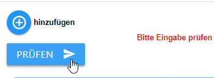

# ioBroker.device-reminder

## Нужен ли файл readme на английском языке?  [английская версия файла readme](/#/adapters/device-reminder)

 

# Адаптер для дополнительной защиты от версии Gerätezuständen

Дисерный адаптер может быть использован в качестве защитного приспособления для его использования в процессе установки или установки в целях безопасности. Es können dann Nachrichten for Telegram, WhatsApp, Alexa, Sayit, Pushover и Email (Mehrfachauswahl pro Gerät möglich) автоматически обрабатываются. Это может привести к тому, что Steckdose nach Beendigung des Vorgangs autotisch abzuschalten (auch Zeitverzögert). Bei vorgegebener Laufzeit ist es möglich, sich per Datenpunkt einen Alarm auszugeben (mit externem Script, der Datenpunkt Lifert nur true/false orls Anzeige in der vis). Далее следует указать Vorgabelaufzeit в течение нескольких минут в Datenpunkt 'device-reminder.X.XXX.config.runtime max' einzutragen.

# Was sollte beachtet werden?

Интервал обновления "Live-Verbrauchswert (heißt bei den meisten Geräten Geräten **"\_energy"** )" не будет больше, чем 10 секунд, и это будет означать, что вы очень сильно изменились, когда можете. Адаптер может выбрать опрос в течение 10 секунд, а также новые события. Das schont das System  Бефель в Тасмота Консоле: TelePeriod 10

# Was ist pro Gerät möglich?

- Benachrichtigung beim Gerätestart
- Benachrichtigung beim Vorgangsende des Jeweiligen Gerätes
- Telegram-Benachrichtigung (более подробные идентификаторы)
- Alexa-Benachrichtigung (более подробные идентификаторы)
- WhatsApp-Benachrichtung (более удобные идентификаторы)
- Pushover-Benachrichtung (более подробные идентификаторы)
- Email-Benachrichtung (более подробные идентификаторы)
- Сигнальные настройки (более подробные идентификаторы)
- Matrix-Benachrichtung (Mehrere IDs sind möglich)
- Discord-Benachrichtung (Mehrere IDs sind möglich)
- Benachrichtigungen können frei erstellt oder auch von einem externen Script vorgegeben werden
- Datenpunkte mit dem dem aktuellen Zustand, Live-Verbrauch und letzte gesendete Statusmeldung, um Werte aus diesem Adaptor in anderen Scripten verwenden zu können
- Geräte bei Bedarf abschalten (auch zeitverzögert), если Vorgang bedet erkannt wurde
- Sprachassistenten können per Datenpunkt vorrübergehend deaktiviert werden
- Laufzeitüberwachung in Minuten: Wird die Zeit überschritten, wird ein Alarm an alle ausgewählten Messenger gesendet

# Anleitung

## Grundlegendes vorab

Это предложение для группы устройств, Alexa и т. д. с помощью кнопки «Eingabe Prüfen». Кнопка «Wird dieser» может быть отключена, если вы хотите задать вопрос, чтобы получить правдоподобие, и человек может быть уверен в своем ответе, а также во всех случаях, когда он был отключен. Мужчина в шляпе Änderungen vorgenommen, так что muss dieser Button immer angeklickt werden! Der Button должен быть готов к использованию, если это не так!   

## устройство анлеген

- **Gerätename** : Имя Фрея Вельбарера
- **Типичный пример** : hier muss ausgewählt werden, um welches Gerät es sich Handelt, damit die Berechnungen im Adaptor correkt ausgeführt werden können
- **Описание** : Per Klick auf die Schaltfläche mit den drei weißen Punkten öffnet sich eure Objektverwaltung. Es muss der Datenpunkt ausgewählt werden, welcher den **aktuellen Live-Verbrauch** anzeigt.
- **Schalter AN/AUS** : Per Klick auf die Schaltfläche mit den drei weißen Punkten öffnet sich eure Objektverwaltung. Es muss der Datenpunkt ausgewählt werden, welcher eure **Steckdose an/aus schaltet** (keine Pflicht). Ist dieser nicht angewählt, kann auch kein autotisches ausschalten erfolgen
- **Начальный текст** : Benachrichtigung die gesendet werden soll, wenn das Gerät gestartet wird (auch Sonderzeichen sind möglich)
- **Конечный текст** : Benachrichtigung die gesendet werden soll, wenn das Gerät seinen Vorgang bedet Hat (auch Sonderzeichen sind möglich)

**Начальный** и **конечный текст** могут быть изменены с помощью внешних дат. Diese Nachricht wird mit mit 1 Sekunde Verzögerung aus dem Datenpunkt gelesen, nachdem sich der Status des Geräts geändert Hat. Somit kann man sich per externem Script eine Nachricht erstellen lassen. Адаптер работает автоматически, при этом необходимо указать дату или время, указанное вручную, или сделать это вручную. Когда вы нажмете кнопку «Datenpunkt auszuwählen», вы нажмете на кнопку «Datenpunkt auswählen» и нажмете на кнопку «Datenpunkt auswählen». **Bitte Beachten** : es kann nur entweder ein Datenpunkt **или** eine händisch eingetragene Nachricht verwendet werden! 

# Devices konfigurieren

- **aktiv** : Это стандартный активный режим. Hier kann man ein Device vorrübergehend deaktivieren, so dass es keine Benachrichtigungen mehr sendet
- **Ошибка** : автоматический ангельский режим.
- **Alexa** : alle zuvor erstellen Alexas werden hier aufgelistet und können per Klick hinzugefügt werden
- **Sayit** : все устройства Sayit были добавлены и проверены на нажатие кнопки мыши
- **Telegram** : alle zuvor angelegten Telegram user werden hier aufgelistet und können per Klick hinzugefügt werden
- **WhatsApp** : все сообщения об ангельских сообщениях Пользователь WhatsApp может получить список и нажать кнопку мыши, чтобы получить подсказку
- **Pushover** : alle zuvor angelegten Pushover user werden hier aufgelistet und können per Klick hinzugefügt werden
- **электронная почта** : alle zuvor angelegten email user werden hier aufgelistet und können per Klick hinzugefügt werden
- **сигнал** : все сигналы пользователя сигнала отображаются в списке и отображаются для щелчка по подсказке
- **Матрица** : все настройки пользователя матрицы отображаются в списке и отображаются для нажатия кнопки мыши
- **ausschalten** : Если разобрать, выключите Steckdose nach Beendigung des Vorgangs autotisch ab. Kann nur genutzt werden, wenn unter "Geräte" auch ein Ausschaltdatenpunkt hinterlegt wurde
- **Ausschaltverzögerung** : Возможно дополнительное время ожидания в течение **нескольких минут** . Когда вы увидите тайм-ауты, _когда произойдет автоматическое_ выключение, это будет отключено. Die Ende Benachrichtigung des Gerätes bleibt von einem timeout jedoch unberührt! Kann nur genutzt werden, wenn unter "Geräte" auch ein Ausschaltdatenpunkt hinterlegt wurde
- **Краткое описание** : Когда вы активируете адаптер, убедитесь, что он не работает, и его больше нельзя использовать.

Nachdem nun auf " **Speichern und schliessen** " geklickt wurde, wird unter _Objecte -> устройство-напоминание_ nun für jedes neu angelegte Device ein Ordner erstellt, in dem

- «не беспокоить» (когда активен, мы нажимаем **кнопку** «Не беспокоить»)
- максимальное время выполнения
- der aktuelle Zustand des Gerätes
- Laufzeitalarm
- среднее потребление (Kann als Hilfe genutzt werden um die eigenen Schwellwerte zu ermitteln)
- оставить сообщение в формате JSON
- die letzte Laufzeit в чч:мм:сс
- der aktuelle Live-Verbrauch
- die Nachricht an die Messenger
- Актуэль Лауфцайт в чч:мм:сс
- die aktuelle Laufzeit в Millisekunden

angezeigt wird.

## Кнопка проверки

Es gibt в Jedem Messenger einen Testknopf. Вам будет предложено провести тестовое тестирование и отправить ювелирный мессенджер. Чтобы получить дополнительную информацию, необходимо выбрать конфигурацию. Адаптер не будет полезен, если вы не хотите использовать его!

## Если кнопки сохранения не используются автоматически, их не нажимают.

Если кнопки Speicher Buttons не используются, то кнопка, которую вы используете, может быть использована отдельно. Попробуйте другие кнопки Speicherbuttons. Если вы используете адаптер для входа, он не будет полезен! Это может быть связано с изменением адаптеров или с датами настройки конфигурации.

## Алекса erstellen

- **Имя** : Frei wählbarer Name, auch Sonderzeichen sind möglich
- **'alexa2/../объявление'/'говорить'** : Hier muss **zwingend** der Datenpunkt ausgewählt werden, welcher eure Alexa sprechen lässt. Если вы используете Datenpunkt auszuwählen, einfach auf die Schaltfläche mit den drei kleinen weißen Punkten klicken.
- **том 0-100** : Lautstärke, mit der eure Alexa sprechen soll (от 0 до 100%) Mit den 2 letzten Feldern kann ein Zeitraum erstellt werden, in dem eure Alexa Sprachausgaben tätigen darf. Стандартное время включено с 00:00 до 23:59.
- **aktiv ab** : Startzeit des Benachrichtigungszeitraumes
- **активный бис** : Endzeit des Benachrichtigungszeitraumes

## SayIt User erstellen

- **Имя** : Frei wählbarer Name, auch Sonderzeichen sind möglich
- **'sayit/../text'** : den Datenpunkt "text" im jeweiligensayIt device Ordner auswählen. Здесь вы увидите петли Textausgabe.
- **громкость 0–100** : Lautstärke, mit der euer Sayit Device Sprechen Soll (от 0 до 100%)
- **aktiv ab** : Startzeit des Benachrichtigungszeitraumes
- **inaktiv ab** : Endzeit des Benachrichtigungszeitraumes

## pushover User erstellen

- **Имя** : Frei wählbarer Name, auch Sonderzeichen sind möglich
- **Pushover-Instanz** : die Instanz, an die gesendet werden soll.
- **Betreff** : опционально Betreff der Nachricht
- **Geräte ID** : опционально Geräte-ID, который может быть использован
- **Приоритет** : Die Priorität, mit der gesendet werden soll
- **Язык** : Der Sound, der abgespielt werden soll, wenn Pushover die Nachricht erhält
- **TTL** : Dauer, nach der eine Nachricht gelöscht werden soll (Секунды)

## email User erstellen

- **Имя** : Frei wählbarer Name, auch Sonderzeichen sind möglich
- **Absenderadresse** : Адрес электронной почты, отправленный по указанному адресу.
- **Empfängeradresse** : Адрес электронной почты, die die Nachricht empfangen soll

## signal User erstellen

- **Имя** : Frei wählbarer Name, auch Sonderzeichen sind möglich
- **Мгновенный сигнал** : Мгновенная установка, которую необходимо выполнить

## telegram Пользователь erstellen

- **Имя** : Frei wählbarer Name, auch Sonderzeichen sind möglich
- **Telegram-Instanz** : Die installierte Instanz, a die gesendet werden soll
- **Имя пользователя/имя/ChatID auswählen** : Auswählen, имя пользователя, имя или ChatID (empfohlen) должны быть указаны так. Die Daten Stehen в Telegram Instant. Wird eine отрицательный ChatID eingegeben, поэтому введите eine Gruppe Gesendet
- **имя пользователя или имя или ChatID eingeben** : Имя пользователя, имя или ChatID eingeben, je nachdem было ausgewählt wurde

## whatsapp User erstellen

- **Имя** : Frei wählbarer Name, auch Sonderzeichen sind möglich
- **'whatsapp-cmb/../sendMessage'** : Der Datenpunkt des Whatsapp-Adapters, an den die Nachricht gesendet werden soll

## Пользователь Discord erstellen

- **Имя** : Frei wählbarer Name, auch Sonderzeichen sind möglich
- **Discord Instanz** : Die Discord Ziel-Instanz
- **Идентификатор пользователя** : Die Идентификатор пользователя
- **Метка чата** : Метка пользователя
- **Имя в чате** : Имя пользователя ( **Pflichtfeld** )
- **Идентификатор сервера** : Die Server ID des Discord Servers
- **Идентификатор канала** : Die Channel ID des Discord Servers

# Стандартные типы устройств

 Diese Werte wurden über einen Zeitraum von mehreren Monaten und mit Hilfe von zahlreichen Testern ermittelt. Если вы не знаете, что делать, если вы хотите, чтобы вы не получили больше Ordnungsgemäß erfasst werden und es so zu Falschmeldungen kommt.

# Определенные типы Гератетипов

 Diese Werte können von Benutzer angepasst und dann genutzt werden. Im Folgenden die Erklärung dazu:

**ВНИМАНИЕ** : Diese Schwellwerte beziehen sich immer auf den aktuellen Wert des _среднее потребление_ , der im entsprechenden Datenpunkt des Gerätes im device-reminder Ordner abgelesen werden kann! Dieser Wert wird berechnet und zeigt daher nie den aktuellen Live-Wert an!

- **Schwellwert 'Start' (Ватт)** : Startwert in Watt der überschritten werden muss, damit das Gerät als gestartet erkannt wird
- **Schwellwert 'Ende' (Ватт)** : Endwert in Watt der unterschritten werden muss, damit das Gerät als bedet erkannt wird
- **Значение «Режим ожидания» (Ватт)** : значение «В режиме ожидания» может быть указано как «AUS» или «В режиме ожидания». Liegt der aktuell berechnete Wert unter dem Schwellwert **Standy** so wird das Gerät als ausgeschaltet erkannt
- **Anzahl Startwerte** : Hier wird angeben, часто der «Startwert» **в Folge** überschritten werden muss. Ein einmaliges Unterschreiten führt zum Startabbruch. Der Durchschnitt dieser Werte muss über dem Startwert Ligen, damit das Gerät als gestartet erkannt wird.  _Bsp: Der Wert soll 10W betragen и 3x в Folge überschritten werden. 1. 15 Вт, 2. 1 Вт, 15 Вт => Начальная фаза завершается, когда происходит задержка до 10 Вт._
- **Anzahl Endwerte** : Hier wird angeben, wie viele Werte aufgezeichnet werden sollen, bevor berechnet wird, ob das Gerät Fertig ist. Je weniger Werte hier stehen, desto ungenauer ist das Ergebnis und die Gefahr von Falschmeldungen steigt. Je höher der Wert, umso genauer die Erfassung. Nachteil ist jedoch, dass die Fertigmeldung stark verzögert gesendet wird. Прежде всего, если «Anzahl Endwerte» является erreicht и der Durchschnittsverbrauch unter dem «Schwellwert 'Ende' (Watt)» Liegt.

_Kurze Beispielrechnung:_ Es kommen alle 10 Sekunden Verbrauchswerte Rein. **Schwellwert 'Ende' (Ватт)** начисляется на 50, **Anzahl Endwerte** на 100. Nachdem das Gerät als gestartet erkannt wurde, werden 100 Werte ( _dauert 100Werte x 10 Sekunden = 1000 Sekunden_ ) aufgezeichnet und erst danach der Mittelwert gebildet. Продолжительность жизни до 50, около 16,5 минут (с 100 минутами **ожидания** ) будет **работать** и будет работать (когда это будет настроено). Liegt der Wert über 50, passiert nichts, das Gerät noch in Betrieb ist. Jeder weitere Wert ersetzt nun den ältesten und es wird nach jedem neuen Wert ein neuer Durchschnitt berechnet. 

# Unterstützung

**Falls euch meine Arbeit gefällt:** 

## Changelog

Der Changelog ist in der englischen Version der readme zu finden  
[english readme](/#/adapters/device-reminder)
 

## License

MIT License

Copyright (c) 2024 xenon-s

Permission is hereby granted, free of charge, to any person obtaining a copy
of this software and associated documentation files (the "Software"), to deal
in the Software without restriction, including without limitation the rights
to use, copy, modify, merge, publish, distribute, sublicense, and/or sell
copies of the Software, and to permit persons to whom the Software is
furnished to do so, subject to the following conditions:

The above copyright notice and this permission notice shall be included in all
copies or substantial portions of the Software.

THE SOFTWARE IS PROVIDED "AS IS", WITHOUT WARRANTY OF ANY KIND, EXPRESS OR
IMPLIED, INCLUDING BUT NOT LIMITED TO THE WARRANTIES OF MERCHANTABILITY,
FITNESS FOR A PARTICULAR PURPOSE AND NONINFRINGEMENT. IN NO EVENT SHALL THE
AUTHORS OR COPYRIGHT HOLDERS BE LIABLE FOR ANY CLAIM, DAMAGES OR OTHER
LIABILITY, WHETHER IN AN ACTION OF CONTRACT, TORT OR OTHERWISE, ARISING FROM,
OUT OF OR IN CONNECTION WITH THE SOFTWARE OR THE USE OR OTHER DEALINGS IN THE
SOFTWARE.