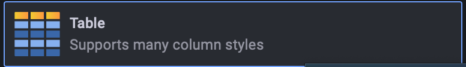
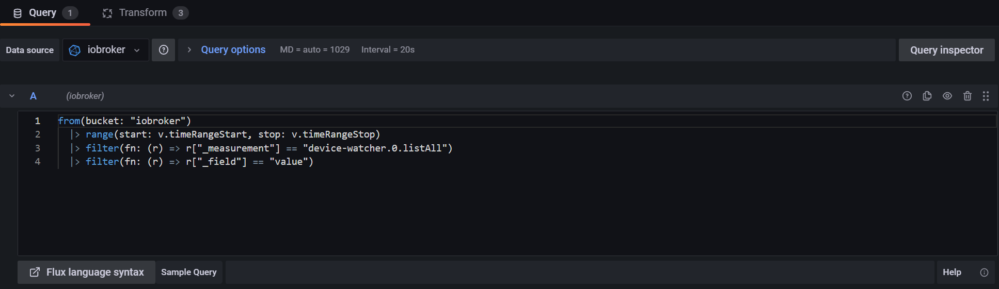
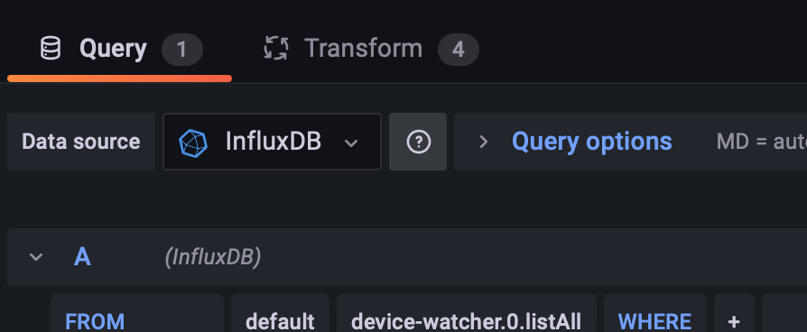
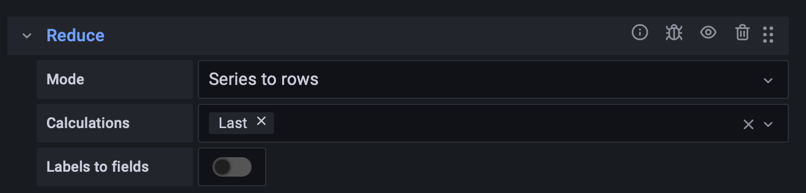
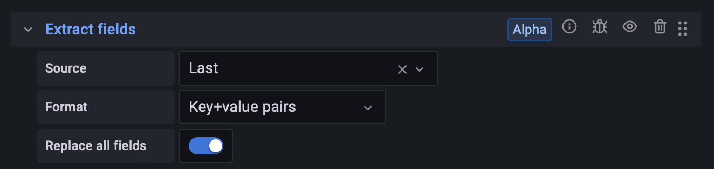
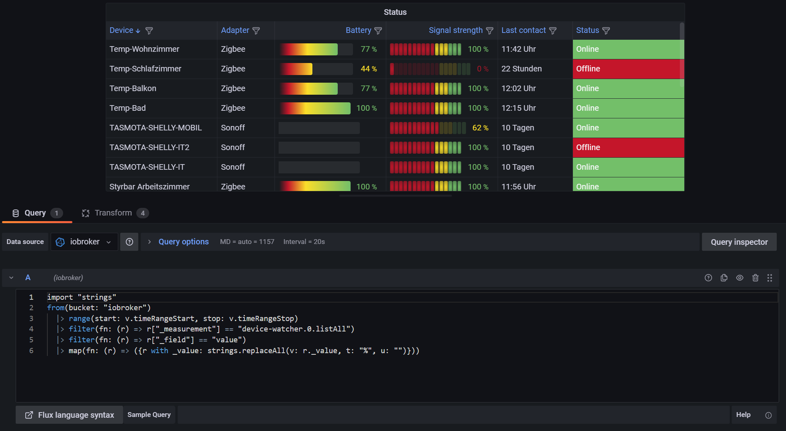

# ioBroker.device-watcher

## Как отобразить JSON-таблицу в Grafana с помощью Flux

Для корректного отображения JSON-списков в Grafana без плагина необходимо настроить определенные параметры.

1. Сначала значения точек данных передаются в InfluxDB.


2. В Grafana вы создаете новую панель и выбираете визуализацию.`Table` из.



3. В настройках запроса выберите базу данных ioBroker в качестве источника данных. Затем введите следующий синтаксис (имя сегмента и имя точки данных в области измерения могут отличаться, поэтому проверьте и скорректируйте их при необходимости):

```
from(bucket: "iobroker")
    |> range(start: v.timeRangeStart, stop: v.timeRangeStop)
    |> filter(fn: (r) => r["_measurement"] == "device-watcher.0.listAll")
    |> filter(fn: (r) => r["_field"] == "value")
```



4. Затем перейдите на вкладку «Преобразование».



5. Здесь вам необходимо выбрать три преобразования:

- Во-первых, возьмите`Extract fields` Выберите точку данных в качестве источника; формат следующий...`JSON` и флажок`Replace all fields` будут отобраны.


- Следующая трансформация —`Reduce` Здесь необходимо указать, что должно отображаться только последнее записанное значение из точки данных. Для этого вы выбираете режим.`Series to rows` и в расчетах`Last` выбран.



- Наконец, добавляется преобразование.`Extract fields` И ещё кое-что. Выберите следующий текст в качестве источника.`Last` На этот раз используется следующий формат для вывода значения.`Key+value pairs` и снова ставит галочку в этом поле.`Replace all fields` из.



После настройки всех параметров таблица должна отображаться корректно.


### Дополнительная информация:

Если вы хотите отображать уровни заряда батареи и сигнала графически в виде индикаторов, вам необходимо изменить синтаксис, как показано в следующем примере, удалив знаки процента, чтобы текст изменился со строкового типа на числовой:

```
import "strings"
from(bucket: "iobroker")
  |> range(start: v.timeRangeStart, stop: v.timeRangeStop)
  |> filter(fn: (r) => r["_measurement"] == "Device-Status")
  |> filter(fn: (r) => r["_field"] == "value")
  |> map(fn: (r) => ({r with _value: strings.replaceAll(v: r._value, t: "%", u: "")}))
```

После этого вы можете настроить отображение информации по своему вкусу, как показано на картинке.

