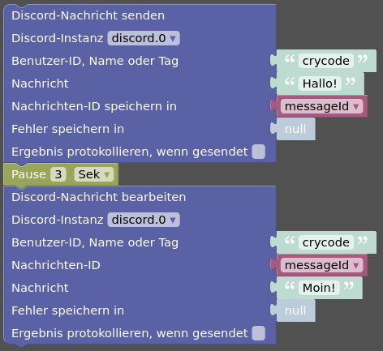

# IoBroker.discord


Этот адаптер [ioBroker] интегрирует бота [Discord] в ioBroker.

Адаптер создает дерево объектов с объектами и состояниями для серверов и каналов, в которых представлен бот.
Также создается дерево объектов для всех пользователей, которых видит бот.
Затем можно получать сообщения и отправлять сообщения и файлы через Discord через эти состояния.

Кроме того, адаптер может регистрировать команды Discord Slash.
Затем можно запросить или установить состояния ioBroker через this.

- [ioBroker.discord](#iobrokerdiscord)
  - [функции](#функции)
  - [Создать Discord-бота](#create-a-discord-bot)
  - [Добавить бота на сервер](#add-the-bot-to-a-server)
    - [Удалить бота с сервера](#remove-the-bot-from-a-server)
  - [Состояния](#состояния-состояния)
    - [discord.0.bot.\*](#discord0bot)
    - [discord.0.servers.\<идентификатор_сервера\>.\*](#discord0serversидентификатор_сервера)
    - [discord.0.servers.\<id-сервера\>.channels.\<id-канала\>.\*](#discord0serversserver-idchannelschannel-id)
    - [discord.0.servers.\<server-id\>.members.\<user-id\>.\*](#discord0serversserver-idmembersuser-id)
    - [discord.0.users.\<user-id\>.\*](#discord0usersuser-id)
    - [discord.0.slashCommands.\<имя-команды\>.\*](#discord0slashcommandsимя-команды)
    - [discord.0.raw.\*](#discord0raw)
  - [авторизация](#авторизация)
  - [сообщения](#сообщения)
    - [полученные сообщения](#messages-received)
      - [использование text2command](#use-of-text2command)
    - [отправить сообщения](#отправить-сообщения)
      - [Отправить простые тексты](#senden-simple-texts)
      - [Отправить файлы](#send-файлы)
      - [Отправить реакции](#send-реакции)
      - [отправка ответов](#отправка-ответов)
      - [Отправка специальных пользовательских сообщений] (#sending-special-custom-messages)
  - [слэш-команды](#слэш-команды)
    - [настроить состояния для слэш-команд](#configure-states-for-slash-commands)
    - [Состояния запроса](#states-query)
    - [установить состояния](#установить-состояния)
    - [Получить обзор состояний с конфигурациями для команд с косой чертой](#get-an-overview-of-states-with-configurations-for-slash-commands)
    - [Пользовательские косые команды] (#custom-slash-commands)
      - [Структура json-состояния пользовательских слеш-команд](#structure-of-a-json-state-of-custom-slash-commands)
  - [Блочный](#блочный)
    - [Пример Blockly: отправить сообщение пользователю и обработать его через три секунды](#blockly-example-send-a-message-to-a-user-and-process-it-after-three-seconds)
    - [Пример Blockly: отправка составного сообщения с вложением и двумя прикрепленными файлами](#blockly-example-sending-a-compound-message-with-embed-and-two-file-attachments)
    - [Блочный пример: ответьте на пользовательскую команду косой черты и отправьте изображение запрошенной IP-камеры]
  - [использование в скриптах](#использование-в-скриптах)
    - [отправка сообщения в скрипте](#sending-a-message-in-a-script)
    - [Редактирование сообщения в скрипте](#editing-a-message-in-a-script)
    - [Удаление сообщения в скрипте](#deleting-a-message-in-a-script)
    - [Добавить смайлик реакции к сообщению в скрипте](#add-reaction-emoji-to-a-message-in-a-script)
    - [Ожидание реакции на сообщение в скрипте](#waiting-for-reactions-to-a-message-in-a-script)
    - [Ответить на пользовательскую косую черту в скрипте](#reply-to-custom-slash-commands-in-a-script)
    - [Запросить информацию о сервере в скрипте](#Request-information-about-a-server-in-a-script)
    - [Запросить информацию о канале сервера в скрипте](#Request-information-about-a-server-channel-in-a-script)
    - [Запросить информацию о пользователе в скрипте](#request-information-about-a-user-in-a-script-)
    - [Запросить информацию об участнике сервера в скрипте](#request-information-about-a-server-member-in-a-script)
    - [Получить информацию о предыдущем сообщении в скрипте](#Get-information-about-a-previous-message-in-a-script)

## Функции
* состояния ioBroker для всех серверов бота для приема и отправки сообщений
* ioBroker указывает для всех пользователей, которых видит бот, для получения и отправки прямых сообщений
* Упрощено присоединение и выход из серверов Discord для бота
* Установить статус бота, включая действия
* Опционально контролировать статус присутствия пользователей
* При желании контролировать голосовой статус пользователей
* Голосовые действия для участников сервера (отключение звука, глухота, отключение)
* Обработка всех сообщений или только сообщений с упоминанием бота в каналах сервера
* Обработка прямых сообщений
* Опционально автоматически отвечать эмодзи на упоминания бота
* Состояния `.json` для данных канала, пользователя и сообщения
* Отправляйте сообщения, файлы, реакции (смайлики), ответы или пользовательский контент сообщений в формате JSON.
* Список участников сервера и канала, включая назначенные роли
* Поддержка команды Discord slash для получения и установки значений состояния
* Поддержка пользовательских команд Discord Slash, на которые можно воздействовать в пользовательских сценариях (включая Blockly).
* Поддержка [text2command] (должна быть включена для каждого состояния `.message` отдельно)
* Отправляйте, редактируйте и удаляйте сообщения, отправляйте и ждите ответов на сообщения в пользовательских скриптах
* Необязательные необработанные состояния для большей гибкости в пользовательских скриптах.
* Блочная поддержка с пользовательскими блоками для отправки и редактирования сообщений и обработки пользовательских команд косой черты.

Что *не* поддерживается и *не* предназначено:

* Сообщения в темах
* Отправка и получение голосовых сообщений

Отсутствует функция? Просто создайте запрос функции на [GitHub][GitHub New Issue].

## Создание Discord-бота
Чтобы использовать этот адаптер, необходимо создать приложение Discord Bot.

1. Перейдите на [Портал разработчиков Discord] и войдите в свою учетную запись Discord, если вы еще не вошли в нее.
2. В представлении _Приложения_ нажмите кнопку _Новое приложение_ в правом верхнем углу.

[](../../../de/adapterref/en/media/bot-creation-1.png)

3. Выберите имя для приложения (это будет имя бота) и нажмите _Создать_.

[](../../../de/adapterref/en/media/bot-creation-2.png)

4. (Необязательно) Загрузите _Значок приложения_, измените имя (_Имя_), измените описание (_Описание_), добавьте несколько _Тегов_ и сохраните изменения (_Сохранить изменения_).

[](../../../de/adapterref/en/media/bot-creation-3.png)

5. Перейдите к _Bot_ в левом меню и нажмите кнопку _Add Bot_.

[](../../../de/adapterref/en/media/bot-creation-4.png) В следующем диалоговом окне нажмите _Да, сделайте это!_, чтобы подтвердить создание бота.

6. Когда бот создан, вам нужно нажать кнопку _Reset Token_ один раз, чтобы получить токен бота.

[](../../../de/adapterref/en/media/bot-creation-5.png) Поскольку это приведет к аннулированию всех предыдущих токенов, вы должны подтвердить это, нажав кнопку _Да, сделайте это!_ в появившемся диалоговом окне.
После этого токен бота будет показан **один раз**, и вам следует скопировать его в безопасное место (например, в конфигурацию экземпляра адаптера).

7. На странице _Bot_ прокрутите вниз до _Privileged Gateway Intent_ и включите _Presence Intent_, _Server Members Intent_ и _Message Content Intent_. Не забудьте сохранить изменения (_Save Changes_).

[](../../../de/adapterref/en/media/bot-creation-6.png) Примечание. Как только бот появится на более чем 100 серверах, эти намерения потребуют проверки и одобрения Discord.

8. Теперь все готово для запуска экземпляра адаптера, а затем добавления бота на дискорд-сервер.

## Добавляем бота на сервер
Чтобы добавить бота на сервер, вы можете использовать вкладку _Добавить бота на сервер_ в конфигурации экземпляра адаптера.
Там появится ссылка, которая позволит добавить бота на сервер с правильно установленными всеми необходимыми разрешениями и областями действия.

[](../../../de/adapterref/iobroker.discord/media/bot-zu-server-hinzufuegen.png)

Адаптеру требуются следующие разрешения бота:

* Сменить никнейм
* Читать новости/просматривать каналы
* Умеренные члены
* Отправка сообщений
* Вставить ссылки
* Прикрепить файлы
* Прочитать историю сообщений
* Упомяните всех
* Добавить реакции
* Заглушить участников
* Глухие участники
* Переместить участников

Кроме того, необходимы следующие области применения:

* бот
* приложения.команды

Если разрешения или области отсутствуют, некоторые функции адаптера не будут работать.

### Удалить бота с сервера
Чтобы снова удалить бота с сервера, далее на той же странице конфигурации экземпляра адаптера вы можете выбрать сервер, а затем нажать кнопку _Покинуть сервер!_, чтобы указать боту покинуть сервер.

## Состояния
Каждый сервер, канал и пользователь идентифицируются своим уникальным числовым идентификатором.
Поскольку имена могут меняться, дерево объектов, созданное адаптером, использует эти идентификаторы для создания надежной структуры.

Все дерево объектов создается на основе того, что видит бот.
Поэтому возможно, например, что на сервере больше каналов, чем отображается.

### Дискорд.0.бот.*
| имя | Описание |
|---|---|
| `activityType` | Тип активности бота. Возможные значения: `Playing`, `Streaming`, `Listening`, `Watching`, `Competing` или пустая строка. |
| `status` | Статус присутствия бота. Возможные значения: `online`, `idle`, `dnd` и `invisible`. |
| `статус` | Статус присутствия бота. Возможные значения: «онлайн», «ожидание», «не беспокоить» и «невидимый». |

Эти состояния используются для установки статуса присутствия и активности бота в том виде, в котором он должен отображаться для пользователей.

### Discord.0.servers.\<id-сервера\>.*
| имя | Описание |
|---|---|
| `channels.*` | Каналы сервера. |
| `члены.*` | участники сервера. |

### Discord.0.servers.\<id-сервера\>.channels.\<id-канала\>.*
| имя | Описание |
|---|---|
| `channels.*` | Присутствует, только если канал является категорией. Структура там такая же, как и для серверных каналов. |
| `members` | Разделенный запятыми список участников (отображаемых имен) канала. |
| `message` | Последнее полученное сообщение на этом канале. |
| `messageId` | ID последнего полученного сообщения. |
| `messageAuthor` | Автор (тег пользователя) последнего полученного сообщения. |
| `messageTimestamp` | Отметка времени последнего полученного сообщения. |
| `messageJson` | Данные JSON последнего полученного сообщения. |
| `send` | Отправляйте текстовые сообщения или сообщения в формате JSON. |
| `sendFile` | Отправить файл. |
| `sendReply` | Отправка ответа на сообщение. |
| `sendReaction` | Отправить реакцию (эмодзи) на сообщение. |
| `json` | Данные JSON информации о канале. |
| `json` | Данные JSON информации о канале. |

Все состояния `message*` и `send*` см. в разделе _Сообщения_ ниже.

### Discord.0.servers.\<идентификатор_сервера\>.members.\<идентификатор-пользователя\>.*
| имя | Описание |
|---|---|
| `tag` | Уникальный тег пользователя в Discord. |
| `roles` | Разделенный запятыми список ролей пользователя на сервере. |
| `joinedAt` | Отметка времени, когда пользователь присоединился к серверу. |
| `voiceChannel` | Голосовой канал, к которому в данный момент подключен пользователь, или пустая строка, если он не подключен. |
| `voiceDisconnect` | Кнопка отключения пользователя от голосового канала. |
| `voiceSelfDeaf` | Индикатор, отключил ли пользователь глухота. |
| `voiceSelfMute` | Индикатор, отключил ли пользователь свой звук. |
| `voiceServerDeaf` | Индикатор того, был ли пользователь отключен сервером. Также может использоваться для изменения этого статуса. |
| `voiceServerMute` | Индикатор того, был ли пользователь отключен сервером. Также может использоваться для изменения этого статуса. |
| `json` | JSON данные пользовательской информации. |
| `json` | JSON данные пользовательской информации. |

Чтобы состояния `voice*` были актуальными, в конфигурации экземпляра должна быть включена опция _Наблюдать за состояниями голосового чата пользователей_.
Чтобы использовать действия `voiceDisconnect`, `voiceServerDeaf` и `voiceServerMute`, бот должен иметь соответствующие разрешения на сервере.

### Discord.0.users.\<userid\>.*
| имя | Описание |
|---|---|
| `tag` | Уникальный тег пользователя в Discord. |
| `activityType` | Характер текущей активности пользователя. Один из `Playing`, `Streaming`, `Listening`, `Watching`, `Competing`, `Custom` или пустая строка. |
| `activityName` | Название текущей активности пользователя. Например, название игры во время `Playing`. |
| `avatarUrl` | URL-адрес аватара пользователя. |
| `bot` | Индикатор, является ли пользователь ботом. |
| `message` | Последнее полученное прямое сообщение пользователя. |
| `messageId` | ID последнего полученного прямого сообщения от пользователя. |
| `messageTimestamp` | Отметка времени последнего полученного прямого сообщения от пользователя. |
| `messageJson` | Данные JSON последнего полученного прямого сообщения от пользователя. |
| `send` | Отправляйте текстовые сообщения или сообщения в формате JSON. |
| `sendFile` | Отправить файл. |
| `sendReply` | Отправка ответа на сообщение. |
| `sendReaction` | Отправить реакцию (эмодзи) на сообщение. |
| `json` | JSON данные пользовательской информации. |
| `json` | JSON данные пользовательской информации. |

Чтобы состояния `status` и `activity*` были актуальными, в конфигурации экземпляра должна быть включена опция _Наблюдать за присутствием пользователя_.

Все состояния `message*` и `send*` см. в разделе _Сообщения_ ниже.

### Discord.0.slashCommands.\<имя-команды\>.*
Кроме того, если в конфигурации экземпляра адаптера включены пользовательские команды, существуют следующие состояния.

Все эти состояния обновляются каждый раз при вызове пользовательской команды.

| имя | Описание |
|---|---|
| `json` | Данные JSON о последнем использовании команды. Содержит некоторую дополнительную информацию, не включенную в отдельные состояния. |
| `userId` | ID пользователя, вызвавшего команду. |
| `userTag` | Уникальный тег пользователя, вызвавшего команду. |
| `channelId` | ID канала, в котором была вызвана команда. |
| `serverId` | Идентификатор сервера, на котором была вызвана команда, или `null`, если команда была вызвана в прямом сообщении. |
| `timestamp` | Отметка времени последнего использования команды. |
| `option-*` | Параметры, указанные для команды. Для каждой настроенной опции создается отдельное состояние. Если при вызове команды опция не указана, то соответствующее состояние устанавливается в `null`. |
| `option-*.value` | Последнее значение, указанное для параметра при вызове команды. Если опция не указана, то соответствующее состояние устанавливается в `null`. |
| `option-*.choices` | Массив JSON с предопределенными вариантами выбора для этой опции. Доступно только для параметров Тип текста. Пример: `["Wert 1", "Wert 2", { "name": "Wert 3", "value": "w3" }]` |
| `sendReply` | Отправить ответ на вызванную команду. Как и в случае `.send` состояний каналов или пользователей, это может быть строка или объект JSON. См. раздел _Новости_ ниже. |
| `отправить ответ` | Отправить ответ на вызванную команду. Как и в случае с состояниями канала или пользователя `.send`, это может быть строка или объект JSON. См. раздел _Новости_ ниже. |

**Примечание.** Рекомендуется использовать состояние `json` в собственных сценариях, чтобы избежать дублирования.
Пример. Пользовательский сценарий считывает отдельные состояния `option-*`, пока пользователь снова вызывает команду, и параметры первого и второго вызова команды смешиваются.

### Дискорд.0.сырье.*
Кроме того, когда необработанные состояния включены в конфигурации экземпляра адаптера, возможны следующие состояния.

**Примечание.** Эти состояния содержат необработанные данные без какой-либо проверки, фильтрации или модификации адаптером. Сервера называются гильдией.

| имя | Описание |
|---|---|
| `messageJson` | Необработанные данные JSON последнего полученного сообщения. (сообщения канала и прямые сообщения) |
| `interactionJson` | Необработанные данные JSON о последнем полученном взаимодействии. (например, команды косой черты) |

## Авторизация
По умолчанию авторизация включена и только авторизованные пользователи смогут взаимодействовать с адаптером.

Авторизованные пользователи и роли сервера могут быть установлены в конфигурации экземпляра адаптера, включая разрешения для каждого пользователя/роли.
Для ролей сервера разрешения применяются только на этом сервере, а не на других серверах и не в личных сообщениях.
Если авторизации были назначены для каждого пользователя и роли сервера, то они объединяются для соответствующего сервера.

Пользователи и роли идентифицируются по их внутреннему идентификатору, поэтому даже изменения пользовательского тега, имени пользователя или имени роли не влияют на авторизацию.

Также возможно деактивировать авторизацию. Однако это следует делать только в том случае, если всем пользователям на всех серверах бота можно доверять!

## Новости
Адаптер может получать и отправлять сообщения от текстовых каналов и пользователей Discord.

По умолчанию в каналах обрабатываются только сообщения, в которых упоминается бот.
Чтобы сообщения без упоминаний также обрабатывались, в настройках экземпляра должна быть активирована опция _Обрабатывать все сообщения в каналах сервера_.

Если получено сообщение с упоминанием бота, то адаптер отвечает на это сообщение эмодзи.
Это можно настроить в конфигурации экземпляра адаптера.
Если авторизация включена, то бот будет реагировать только на упоминания от авторизованных пользователей.

### Полученные сообщения
Полученные сообщения помещаются в состояния `.message*` соответствующего объекта канала для сообщений канала или объекта пользователя для прямых сообщений.

По умолчанию при включенной авторизации записываются только сообщения от авторизованных пользователей.
Это можно настроить с помощью параметра _Обрабатывать сообщения от неавторизованных пользователей_ в конфигурации экземпляра адаптера, чтобы сообщения от неавторизованных пользователей также отбрасывались.

Последнее полученное сообщение для каждого канала/пользователя всегда сохраняется в состоянии `.message`.
Отметка времени, автор и идентификатор последнего полученного сообщения сохраняются в связанных состояниях.
Кроме того, вся эта информация также хранится в формате JSON в состоянии `.messageJson`.

#### Использование text2command
Чтобы использовать text2command, экземпляр text2command должен быть выбран в конфигурации экземпляра адаптера.

Для каждого состояния `.message` может быть включена пользовательская настройка _enable text2command для этого состояния_.
Если активировано, полученные сообщения отправляются в выбранный экземпляр text2command.

Ответ от text2command отправляется адаптером как ответ, как обычное сообщение или вообще не отправляется, в зависимости от конфигурации экземпляра адаптера.

### Отправка сообщений
Чтобы отправить сообщение, содержимое может быть записано в состояниях `.send*` канала или пользователя.

#### Отправляйте простые тексты
Чтобы отправить простые тексты, просто напишите текст в состоянии `.send` нужного получателя.
[Discord Markdown] можно использовать для форматирования текста, как и в клиенте Discord.

Чтобы упомянуть пользователя, идентификатор пользователя можно использовать в форме `<@Benutzer-ID>`.
`<@&Gruppen-ID>` можно использовать для упоминания групп, а `<#Kanal-ID>` — для каналов.

Примеры: `Dies ist meine Nachricht.`, `Dies ist _meine_ **formatierte** Nachricht.`, `Hey <@490222742801481728>!`

#### Отправить файлы
Чтобы отправить файл в виде вложения, укажите местоположение файла в состоянии `.sendFile` нужного получателя.

Расположение файла может быть...

* Абсолютный или относительный путь к локальному файлу.

Относительные пути относятся к каталогу адаптера установки ioBroker.
Путь может дополнительно иметь префикс `file://`.
Примеры: `/home/user/image.png`, `../../iobroker-data/files/myfile.txt`, `file:///tmp/image.jpg`

* URL-адрес удаленного файла.

  Пример: `https://www.iobroker.dev/images/iobroker.png`

* Содержимое файла в кодировке Base64.

  Пример: `data:image/png;base64,iVBORw0KGgoAAAANSUhEUgAAABAAAAAQCAYAAAAf8/9hAAACzklEQVQ4y3WTy2tcdRTHP+d3753HncncmbaJiYvEhZrU+ii2urJgFCyCLnykpbQrsbR/gRQaXPUPUHBlH4ogUsRSqq7qLtlZrQpKg6Uu1OCkSWZ65859zfzucTExsYLf3Tl8zznf85JHZ5+cVuGcMebg0YXXHN/3UVVAqfk1VJV+HCMiAKRpyuXPr1hrixsCZ10VzgEnXMeRF+afJwgaFIUC0Go1UYVOp4OYUYIoivjiyjWszecUMMaYAyXPk7m5R8jznCjqk2YpjuMQhj1AcT2XLM3oR30GgyFB0KDkeWKMOeAeP7ZgDh16jizNeO/9Dwh7PR7ft5ejRxa49tXXvPnG6yRJzNWrX/LDjz8xMTHOu4tnKJXLLC0tG1OtViVoNKhWK9wLQ9pr6yRJwtTUJC/Oz3P9+jckccrk5APcXd+g3V6jUqkwiqmKKwKIMBrbCKpw585vvHNmkT17dvHQzAylUhkjZocnggi4I0+BAML9sEXBX+27XLj0MXGSMLR2h6cFKLh+zSdoNlHYXtW/oaq019a3bRGhPlYnaDbxaz5GVflHV7lcYlcrYJRH+V9s8VUVN4r6bG5ugginT52k2+ny/c2bADjGMDG+m073HlmWbyvq9XoURUEU9TGO4+C4DsPBgI31DZIkwVqLAs8+8zQnjh/j1Vdevq84Iriei+M4GABByLKMTz+7zMWPPuHBqSkGgwGdbpeZ6WmiXu+/g9nu0E2SRMMwJMty6rUa+596gsOHX+L8hUvEcUyp5PH7H38yMb4bgMbYGFmWE4YhSZKozO3b/7PruI/Nzj7MybffotVqYYwhjmPq9TpBo8Hq6iqFjkpmWcaH5y+ysnKboR3+4lpbfGdtvvfWrV+lUi5T8jyKoqBeq9FqBqiC7/sYM7qAnggrK7fJ8lyBG67AWQWstQeXlpd33lmhVt96535/60aENE0YWmuBbwUW/wZQx0cNXLu4ygAAAABJRU5ErkJggg==`

Кроме того, в файл можно добавить текстовое сообщение. Просто напишите местоположение файла, за которым следует вертикальная черта `|` и сообщение в состоянии `.sendFile`.
Примеры: `/tmp/image.png|Dies ist meine Datei`, `https://www.iobroker.dev/images/iobroker.png|Das ioBroker Logo`

#### Отправка ответов
Состояние `.sendReaction` можно использовать для реакции на предыдущие сообщения с помощью эмодзи. Просто напишите смайлик в штате.

По умолчанию ответ отправляется на сообщение, идентификатор которого в настоящее время содержится в связанном состоянии `.messageId`.

Если нужно обработать конкретное сообщение, то идентификатор сообщения, за которым следует символ вертикальной черты `|` и эмодзи, можно записать в состояние `.sendReaction`.

Примеры: `👍`, `971032590515568660|👍`

#### Отправка ответов
Состояние `.sendReply` можно использовать для ответа на предыдущие сообщения.
Для этого просто напишите ответ в статусе.

По умолчанию ответ отправляется на сообщение, идентификатор которого в настоящее время содержится в связанном состоянии `.messageId`.

Если нужно ответить на конкретное сообщение, то идентификатор сообщения, за которым следует символ вертикальной черты `|`, и ответ можно записать в состояние `.sendReply`.

Примеры: `Dies ist eine Antwort.`, `971032590515568660|Dies ist eine Antwort.`

#### Отправка специальных пользовательских сообщений
Специальные настраиваемые сообщения также можно отправлять, записывая объект сообщения JSON в состояние `.send` или `.sendReply`.

Объект JSON должен иметь тип `MessageOptions`.
Для получения дополнительной информации см. [документацию Discord.js MessageOptions][MessageOptions].

Примеры:

Отправить картинку:

```json
{
  "files": [
    {
      "attachment": "/tmp/image.jpg",
      "name": "image.jpg",
      "description": "Mein tolles Bild"
    }
  ]
}
```

Отправить встроенный контент:

```json
{
  "content": "Verwende das:",
  "embeds": [
    {
      "title": "ioBorker.discord",
      "description": "Discord Adapter für ioBroker",
      "color": "#5865f2",
      "url": "https://github.com/crycode-de/ioBroker.discord",
      "author": {
        "name": "Peter Müller",
        "url": "https://github.com/crycode-de"
      },
      "image": {
        "url": "https://github.com/crycode-de/ioBroker.discord/raw/main/admin/discord.png"
      },
      "footer": {
        "text": "❤👍"
      }
    }
  ]
}
```

Отправить встроенное изображение из локального источника:

```json
{
  "embeds": [
    {
      "title": "IP-Cam Alarm",
      "description": "Schau dir das an:",
      "color": "#ff0000",
      "image": {
        "url": "attachment://cam.jpg"
      }
    }
  ],
  "files": [
    {
      "attachment": "http://192.168.1.50:8080/ip-cam.jpg",
      "name": "cam.jpg"
    }
  ]
}
```

## Слеш-команды
Если включено в конфигурации экземпляра адаптера, адаптер может работать с командами косой черты разногласий. Эти команды можно использовать для запроса или установки состояний ioBroker.

**Примечание.** Состояния, которые будут доступны для косой черты Discord, должны быть настроены индивидуально. См. ниже.

Слэш-команды Discord могут быть зарегистрированы адаптером как команды сервера (по умолчанию) или как глобальные команды. Это можно установить в конфигурации экземпляра адаптера.
Использование серверных команд имеет то преимущество, что изменения в командах (например, добавление состояний) применяются немедленно и без задержки.
Однако серверные команды нельзя использовать в прямых сообщениях между пользователем и ботом.
Глобальные команды также можно использовать в личных сообщениях, но любое изменение в командах может занять до часа, прежде чем Discord отобразит их. Это ограничение Discord, а не адаптер.

По умолчанию используются команды косой черты: `/iob-get` и `/iob-set`.
Имена и описания команд можно настроить в конфигурации экземпляра адаптера.

### Настройка состояний для команд с косой чертой
Для каждого состояния, которое должно быть доступно с помощью косой черты Discord, это необходимо включить в пользовательских настройках состояния.
Для этого просто щелкните значок шестеренки _Пользовательские настройки_ в представлении _Объекты_ в панели администратора, включите настройки для экземпляра адаптера и установите флажок _Включить команды Discord для этого состояния_.

[](../../../de/adapterref/iobroker.discord/media/slash-befehl-konfiguration-1.png)

[](../../../de/adapterref/iobroker.discord/media/slash-befehl-konfiguration-2.png)

_Имя_ и _Псевдоним_ могут быть определены для каждого состояния для использования в Discord.
_Имя_ используется для автоматического завершения команд, а _Псевдоним_ используется для внутренней идентификации. Оба не должны превышать длину 100 символов.

Для каждого статуса можно указать отдельно, должен ли он быть доступен для запроса и/или для настройки.
Кроме того, можно активировать, чтобы информация отображалась при запросе, если соответствующий статус не подтвержден, или чтобы он всегда устанавливался с подтверждением при настройке.

Для состояний типа данных `string` можно выбрать, что значение должно рассматриваться как файл (местоположение файла).
Если это активировано, то текущее значение состояния отправляется как с состояниями `.sendFile`.
Это позволяет, например, запрашивать изображения с помощью команды запроса.

Для состояний типа данных `number` можно указать количество знаков после запятой для округления значения в командах запроса.

Для состояний типа данных `boolean` могут быть определены пользовательские значения для `true` и `false`, которые затем используются для команд запроса для отображения и для команд установки для обнаружения.

### Состояния запроса
Чтобы запросить состояние, просто вызовите `/iob-get Zustandsalias` в клиенте Discord.
Для `Zustandsalias` при вводе команды отображается автозаполнение.

Каждое значение форматируется для вывода, как указано в объекте состояния и его пользовательских настройках.
Опционально добавляется информация, если нет подтверждения статуса.

### Установить состояния
Чтобы запросить состояние, просто вызовите `/iob-set Zustandsalias Neuer-Wert` в клиенте Discord.
Для `Zustandsalias` при вводе команды отображается автозаполнение.
`Neuer-Wert` анализируется адаптером, если тип данных состояния — `boolean` или `number`.

В зависимости от состояния можно настроить индивидуально, следует ли устанавливать значение с подтверждением или без него.

Для состояний типа данных `boolean` значения `true`, `on`, `yes`, `1` и их соответствующие переводы (`wahr`, § §SSSSS_6§ §, `ja`), а _Истинное значение_, сконфигурированное для состояния, интерпретируется как `true`.
Любое другое значение интерпретируется как `false`.

Для статусов типа данных `number` указанное значение интерпретируется как десятичное число.
Если установка ioBroker настроена на использование запятой в качестве десятичного разделителя, то число может быть указано с запятой или точкой в качестве десятичного разделителя. В противном случае в качестве десятичного разделителя допускается только точка.
Если в объекте состояния указаны значения для `min` и `max`, то они также проверяются.

### Получите обзор состояний с конфигурациями для команд с косой чертой
Чтобы получить обзор всех состояний с активной конфигурацией для косых команд, можно нажать кнопку _Журнал состояния объектов, настроенных для команд_, в конфигурации экземпляра адаптера. Вывод затем находится в журнале установки ioBroker.

### Пользовательские слэш-команды
Собственные слэш-команды можно активировать и настроить в конфигурации экземпляра адаптера.
Настроенные пользовательские команды затем регистрируются в Discord вместе со стандартными командами get и set.

К каждой пользовательской команде можно добавить параметры.
Затем эти параметры появятся в клиенте Discord для команды.
Если параметр не указан при вызове команды, то этот параметр содержит значение `null`.
Для параметров типа _Text_ динамически предопределенные варианты могут быть указаны в связанном состоянии `option-*.choices` в виде массива JSON.

Когда пользовательская команда вызывается, связанные данные записываются в соответствующие состояния. См. описание состояний в разделе _States_ выше.

Вся информация, включая параметры, записывается в состояние команды `.json`.
Это состояние в первую очередь следует использовать для получения данных команды в скриптах, так как вся необходимая информация хранится в одном месте и поэтому ничего нельзя перепутать даже при вызове нескольких команд за короткое время.
Для опций типа _User_, _Role_, _Channel_ или _Mentionable_ дополнительные поля заполняются в объектах Options.

**Примечание.** Команда должна быть оценена сама по себе, а затем на нее должен быть отправлен ответ. Вы можете сделать это, например, со своим собственным скриптом.
Ответ должен быть отправлен в течение 15 минут через состояние `.sendReply` или соответствующее действие `sendTo(...)`.
Если в течение этого времени ответ не будет отправлен, то клиент Discord покажет ошибку _Приложение не отвечает_.

**Примечание.** Ответ на командный вызов может быть отправлен несколько раз.
Ответ редактируется и перезаписывается новым содержанием.

#### Структура json-состояния пользовательских слэш-команд
```js
{
  interactionId: string,
  commandName: string,
  user: {
    id: string,
    tag: string,
    displayName: string,
  },
  channelId: string,
  serverId: string | null,
  timestamp: number,
  options: {
    [string]: {
      value: string | number | boolean | null,
      type: 'String' | 'Number' | 'Boolean' | 'User' | 'Role' | 'Channel' | 'Mentionable' | null,
      user?: { // wenn type USER oder MENIONABLE ist
        id: string,
        tag: string,
        bot: boolean,
      },
      member?: { // wenn type USER oder MENIONABLE ist und der Befehl auf einem Server aufgerufen wurde
        id: string,
        displayName: string,
        roles: { id: string, name: string }[],
      },
      role?: { // wenn type ROLE oder MENTIONABLE ist
        id: string,
        name: string,
      },
      channel?: { // wenn type CHANNEL ist
        id: string,
        name: string,
        type: 'GuildCategory' | 'GuildNews' | 'GuildStageVoice' | 'GuildStore' | 'GuildText' | 'GuildVoice',
        lastMessageId: string | null,
      },
    },
    // ...
  }
}
```

## Блочный
Адаптер поставляется с собственными блоками Blockly, для...

* Отправка сообщений на пользовательские или серверные каналы
* Редактировать сообщения в прямых сообщениях или каналах сервера
* Добавление смайликов к сообщениям
* Соберите содержимое сообщения с дополнительными вставками, вложениями и ответными ссылками.
* Соберите сообщения для встраивания
* Объединение вложений сообщений
* Реагировать на пользовательские команды косой черты
* Ответы на пользовательские слэш-команды

### Блочный пример: отправить сообщение пользователю и отредактировать его через три секунды
[](../../../de/adapterref/iobroker.discord/media/blockly-1.png)

<details><summary>Блочный код</summary>

```xml
<xml xmlns="https://developers.google.com/blockly/xml">
  <variables>
    <variable id="KIILW$,(eB?pT`;GDuMF">messageId</variable>
  </variables>
  <block type="discord_send_message_user" id="?xkCV};-Lk_-|Q`]%(Gt" x="63" y="38">
    <field name="instance">.0</field>
    <field name="logResultOk">FALSE</field>
    <value name="user">
      <shadow type="text" id="jXN@CluUy_M/ig@4[(Uk">
        <field name="TEXT">cryCode#9911</field>
      </shadow>
    </value>
    <value name="content">
      <shadow type="text" id="uLWu1CJ$;k}|VTyw1-8}">
        <field name="TEXT">Hallo!</field>
      </shadow>
    </value>
    <value name="varMessageId">
      <shadow type="logic_null" id="bJ2lJW0qOa@Zjv%(]mFU"></shadow>
      <block type="variables_get" id="xkJ(vH/;@7%)cDo0HU/~">
        <field name="VAR" id="KIILW$,(eB?pT`;GDuMF">messageId</field>
      </block>
    </value>
    <value name="varError">
      <shadow type="logic_null" id="H:f+1-:p9-YkmpehJoco"></shadow>
    </value>
    <next>
      <block type="timeouts_wait" id="OM8gv}Pl#_mHQ|)([mUe">
        <field name="DELAY">3</field>
        <field name="UNIT">sec</field>
        <next>
          <block type="discord_edit_message_user" id="|L3A+9{s_H8j`AF@,*VF">
            <field name="instance">.0</field>
            <field name="logResultOk">FALSE</field>
            <value name="user">
              <shadow type="text" id="voJ:{uuYtbBZ!Xe,rtV|">
                <field name="TEXT">cryCode#9911</field>
              </shadow>
            </value>
            <value name="messageId">
              <shadow type="text" id="64L=tOKvKwoqGHadRgDm">
                <field name="TEXT"></field>
              </shadow>
              <block type="variables_get" id="(M^6xk74LUEsPdH=LagL">
                <field name="VAR" id="KIILW$,(eB?pT`;GDuMF">messageId</field>
              </block>
            </value>
            <value name="content">
              <shadow type="text" id="rvnV^RF,g$M/3+(npHNC">
                <field name="TEXT">Moin!</field>
              </shadow>
            </value>
            <value name="varError">
              <shadow type="logic_null" id="{H4Q^vl400kxRKrffDz)"></shadow>
            </value>
          </block>
        </next>
      </block>
    </next>
  </block>
</xml>
```

</детали>

### Блочный пример: отправка составного сообщения с вложением и двумя прикрепленными файлами
[](../../../de/adapterref/iobroker.discord/media/blockly-2.png)

<details><summary>Блочный код</summary>

```xml
<xml xmlns="https://developers.google.com/blockly/xml">
  <block type="discord_send_message_server_channel" id="Mnc=pB-8%Dr/nsen|SC`" x="63" y="38">
    <field name="instance">.0</field>
    <field name="logResultOk">FALSE</field>
    <value name="serverId">
      <shadow type="text" id="PA4]t;7CuDrKtwa|oB?L">
        <field name="TEXT">813364154118963251</field>
      </shadow>
    </value>
    <value name="channelId">
      <shadow type="text" id="x^vm,CRT`z2AhDT#ZcUC">
        <field name="TEXT">813364154559102998</field>
      </shadow>
    </value>
    <value name="content">
      <shadow type="text" id="ebdEp~G?:_gInjN47g@f">
        <field name="TEXT"></field>
      </shadow>
      <block type="discord_create_content" id="kY,/zwmwkjo:U;cT?eN*">
        <value name="content">
          <shadow type="text" id="D|y(g`oE@H#gu+deGbv2">
            <field name="TEXT"></field>
          </shadow>
        </value>
        <value name="embeds">
          <shadow type="logic_null" id="Qt[pG25wLoI8+3/jN66C"></shadow>
          <block type="discord_create_embed" id="cXAWtP-36uYlAxLhIBhN">
            <value name="description">
              <shadow type="text" id="^D%m:ic9]AcUUQP8~U#6">
                <field name="TEXT">Eingebetteter Anhang</field>
              </shadow>
            </value>
            <value name="title">
              <shadow type="logic_null" id="_Wm.(^Ff6^u%K+gVz$^Z"></shadow>
            </value>
            <value name="url">
              <shadow type="logic_null" id="0,08A!7[kJ-nJPnPH$L5"></shadow>
            </value>
            <value name="color">
              <shadow type="colour_picker" id="V0}MlQJvN._LHFhG2K%@">
                <field name="COLOUR">#5865f2</field>
              </shadow>
            </value>
            <value name="imageUrl">
              <shadow type="logic_null" id="xXr:E++u0;@2#e]r;_`]"></shadow>
              <block type="text" id="76;;p-5{pls%KmrI!ar{">
                <field name="TEXT">attachment://datei1.jpg</field>
              </block>
            </value>
            <value name="footerText">
              <shadow type="logic_null" id="#BS`MgkNWbrQ@*m/kNdw"></shadow>
            </value>
          </block>
        </value>
        <value name="files">
          <shadow type="logic_null" id="4u@7^DXCI~J$r{Qx}1Ql"></shadow>
          <block type="lists_create_with" id="42g8r-+[xWw`|^.qOF!*">
            <mutation items="2"></mutation>
            <value name="ADD0">
              <block type="discord_create_file" id="EzK4NA^+bu4vChH/vj-b">
                <value name="attachment">
                  <shadow type="text" id="=OEkBZ:LFXvT2$S++21(">
                    <field name="TEXT">/tmp/datei1.jpg</field>
                  </shadow>
                </value>
                <value name="name">
                  <shadow type="text" id="zum#q*|`aD%A2s/N@/Ow">
                    <field name="TEXT">datei1.jpg</field>
                  </shadow>
                </value>
                <value name="description">
                  <shadow type="text" id="#ZZOq%3EHO/_GC+w.,-^">
                    <field name="TEXT"></field>
                  </shadow>
                </value>
              </block>
            </value>
            <value name="ADD1">
              <block type="discord_create_file" id="wIKo-2??SX@WcYc7e/5s">
                <value name="attachment">
                  <shadow type="text" id=")4lvYv.)IhU/p+~KUDym">
                    <field name="TEXT">/tmp/logdatei.txt</field>
                  </shadow>
                </value>
                <value name="name">
                  <shadow type="text" id="#)t#lK6{$RuZt34O;@Ag">
                    <field name="TEXT">log.txt</field>
                  </shadow>
                </value>
                <value name="description">
                  <shadow type="text" id="^UKzs+$TQ!tiE:`(=%}}">
                    <field name="TEXT"></field>
                  </shadow>
                </value>
              </block>
            </value>
          </block>
        </value>
        <value name="replyToId">
          <shadow type="logic_null" id="#1:[?d^x=)ZH.!uyxRI:"></shadow>
        </value>
      </block>
    </value>
    <value name="varMessageId">
      <shadow type="logic_null" id="@D^#9^84UknOfV|c$NK~"></shadow>
    </value>
    <value name="varError">
      <shadow type="logic_null" id="mJu{Fa9+]+Ml,{_OqIOh"></shadow>
    </value>
  </block>
</xml>
```

</детали>

### Блочный пример: ответ на пользовательскую команду косой черты и отправка изображения запрошенной IP-камеры
[](../../../de/adapterref/iobroker.discord/media/blockly-3.png)

<details><summary>Блочный код</summary>

```xml
<xml xmlns="https://developers.google.com/blockly/xml">
  <variables>
    <variable id="Wcj[Gmy,vX]b,)s,O)`U">interactionId</variable>
    <variable id="{sXn[Mn@ZN#fWtTV6O^;">userTag</variable>
    <variable id="ULmVI=-QcXLnD!e60KTV">camID</variable>
  </variables>
  <block type="discord_on_custom_cmd" id="GE,i32wKhz%KGlBhV$j=" x="63" y="13">
    <mutation xmlns="http://www.w3.org/1999/xhtml" options="cam"></mutation>
    <field name="instance">.0</field>
    <field name="varInteractionId" id="Wcj[Gmy,vX]b,)s,O)`U">interactionId</field>
    <field name="log">FALSE</field>
    <field name="commandName">super-command</field>
    <value name="varUserId">
      <shadow type="logic_null" id="/}0,E!Gq=C2U]C^.8m1@"></shadow>
    </value>
    <value name="varUserTag">
      <shadow type="logic_null" id="+r2I4SpfhuW%9DE21,[c"></shadow>
      <block type="variables_get" id="Q=v?u?yU}Tw*@FH*|x7.">
        <field name="VAR" id="{sXn[Mn@ZN#fWtTV6O^;">userTag</field>
      </block>
    </value>
    <value name="option0">
      <shadow type="logic_null" id="hL^g}gJg-b.+SOH0s9m1"></shadow>
      <block type="variables_get" id="z/Lf|chD)~Ge0N~@EWG%">
        <field name="VAR" id="ULmVI=-QcXLnD!e60KTV">camID</field>
      </block>
    </value>
    <statement name="STATEMENT">
      <block type="discord_send_custom_command_reply" id="zJXF!F=|Xt4.kG/6ctl(">
        <field name="instance">.0</field>
        <field name="interactionId" id="Wcj[Gmy,vX]b,)s,O)`U">interactionId</field>
        <field name="logResultOk">FALSE</field>
        <value name="content">
          <shadow type="text" id="bdVm59S9_U*GFB(IBO6x">
            <field name="TEXT"></field>
          </shadow>
          <block type="discord_create_content" id="6m8gBtp;K@t8}{`9gPd1">
            <value name="content">
              <shadow type="text" id=".c}Z71nQ8LlQ@h}_Z?qR">
                <field name="TEXT"></field>
              </shadow>
              <block type="text_join" id="Z{wQ$[1g7z?KPMSHB],Y">
                <mutation items="3"></mutation>
                <value name="ADD0">
                  <block type="text" id="cuzUE7GB$#gC*;nOQ|Ke">
                    <field name="TEXT">Hi </field>
                  </block>
                </value>
                <value name="ADD1">
                  <block type="variables_get" id="|[[T@|n1Ro{EU56/jJ@P">
                    <field name="VAR" id="{sXn[Mn@ZN#fWtTV6O^;">userTag</field>
                  </block>
                </value>
                <value name="ADD2">
                  <block type="text" id="LV$kS:Gzv#cJ#gXe/{4a">
                    <field name="TEXT">!</field>
                  </block>
                </value>
              </block>
            </value>
            <value name="embeds">
              <shadow type="logic_null" id="p8S?*FLv4a6aIJogCKU;"></shadow>
            </value>
            <value name="files">
              <shadow type="logic_null" id="y#a8q/mr^)Ymt*j)S:H/"></shadow>
              <block type="discord_create_file" id="vN%eoP74=*)f63CQiJ__">
                <value name="attachment">
                  <shadow type="text" id="2$9y5yj3.GHx.ms*:Ce2">
                    <field name="TEXT"></field>
                  </shadow>
                  <block type="text_join" id="K9zuKTz?-b8VT$8XUVQ8">
                    <mutation items="3"></mutation>
                    <value name="ADD0">
                      <block type="text" id="p3f^[{6t+UuDJN=49+#Z">
                        <field name="TEXT">/tmp/cam</field>
                      </block>
                    </value>
                    <value name="ADD1">
                      <block type="variables_get" id="oVmVHEX[iT(-X#]m=[U@">
                        <field name="VAR" id="ULmVI=-QcXLnD!e60KTV">camID</field>
                      </block>
                    </value>
                    <value name="ADD2">
                      <block type="text" id="wUXx)@u6*2,+9!q{W`n`">
                        <field name="TEXT">.jpg</field>
                      </block>
                    </value>
                  </block>
                </value>
                <value name="name">
                  <shadow type="text" id="L5fO_+by.^Z:se~6|xCj">
                    <field name="TEXT">cam.jpg</field>
                  </shadow>
                </value>
                <value name="description">
                  <shadow type="text" id="ku}h+v)9oY;1`[9Rr)w%">
                    <field name="TEXT"></field>
                  </shadow>
                </value>
              </block>
            </value>
            <value name="replyToId">
              <shadow type="logic_null" id="Ou%Gd6C*+2OaIPUxPp}t"></shadow>
            </value>
          </block>
        </value>
        <value name="varMessageId">
          <shadow type="logic_null" id="RUb!i][5`[t0*mzLwBvN"></shadow>
        </value>
        <value name="varError">
          <shadow type="logic_null" id="SLsj^+8=[Bp%/X8n]$?Z"></shadow>
        </value>
      </block>
    </statement>
  </block>
</xml>
```

</детали>

## Использование в скриптах
В сценариях функция `sendTo(...)` может использоваться для взаимодействия с экземпляром адаптера.

_Примечание:_ Все используемые идентификаторы являются строками.

### Отправка сообщения в скрипте
Для отправки сообщения можно использовать команду `send` или `sendMessage`. Они оба идентичны.

Часть `message` `sendTo(...)` должна быть объектом с `content` для отправки и одним из следующих параметров для идентификации получателя:

* `идентификатор пользователя`
* `тег пользователя`
* `serverId` и `channelId`

`content` может быть простой строкой или объектом [MessageOptions].

Возвращаемое значение в обратном вызове `sendTo(...)` — это объект, содержащий параметры сообщения и строку `result`, а также `messageId` сообщения разногласия, отправленного в случае успеха, или §§SSSSS_3§ § сообщение в случае ошибки.

Примеры:

```js
// Senden einer Nachricht zu einem Benutzer
sendTo('discord.0', 'sendMessage', {
  userTag: 'cryCode#9911',
  content: 'Hi!',
}, (ret) => {
  log(ret);
  // {'result':'Message sent to user cryCode#9911','userTag':'cryCode#9911','content':'Hi!','messageId':'971779972052160552'}

  if (ret.error) {
    log(ret.error, 'error');
    return;
  }
  log(`Nachricht gesendet mit ID ${ret.messageId}`);
});

// Senden einer Antwort zu einem Benutzer
sendTo('discord.0', 'sendMessage', {
  userId: '490222742801481728',
  content: {
    content: 'Ok!',
    reply: {
      messageReference: '971779972052160552', // ID der Nachricht, auf die geantwortet werden soll
    },
  },
}, (ret) => {
  log(ret);
  // {'result':'Message sent to user cryCode#9911','userId':'490222742801481728','content':{'content':'Ok!','reply':{'messageReference':'971779972052160552'}},'messageId':'971786369401761832'}
});

// Senden einer Datei an einen Serverkanal
sendTo('discord.0', 'sendMessage', {
  serverId: '813364154118963251',
  channelId: '813364154559102998',
  content: {
    content: 'Schau dir das an:',
    files: [
      {
        attachment: "/tmp/image.jpg",
        name: "image.jpg",
        description: "Mein tolles Bild"
      },
    ],
  },
}, (ret) => {
  log(ret);
  // {'result':'Message sent to channel Allgemein','serverId':'813364154118963251','channelId':'813364154559102998','content':{'content':'Schau dir das an:','files':[{'attachment':'/tmp/image.jpg','name':'image.jpg','description':'Mein tolles Bild'}]},'messageId':'971780152759558234'}
});
```

### Редактирование сообщения в скрипте
Предыдущие сообщения можно редактировать с помощью команды `editMessage`.
Конечно, редактировать можно только сообщения, отправленные ботом.

Часть `message` `sendTo(...)` аналогична `sendMessage` (см. выше) с добавлением `messageId` сообщения, подлежащего обработке.

Возвращаемое значение такое же, как и для `sendMessage`.

Примеры:

```js
// Eine Nachricht bearbeiten
sendTo('discord.0', 'editMessage', {
  userTag: 'cryCode#9911',
  content: 'Hallo!',
  messageId: '971495175367049276',
}, (ret) => {
  log(ret);
  // {'result':'Message edited','userTag':'cryCode#9911','content':'Hallo!','messageId':'971495175367049276'}
});

// Nachricht senden und nach fünf Sekunden bearbeiten
sendTo('discord.0', 'sendMessage', {
    userTag: 'cryCode#9911',
    content: 'Es ist jetzt: ' + new Date().toLocaleString(),
}, (ret) => {
  if (ret.error) {
    log(ret.error, 'error');
    return;
  }
  setTimeout(() => {
    sendTo('discord.0', 'editMessage', {
      userTag: 'cryCode#9911',
      content:  'Es ist jetzt: ' + new Date().toLocaleString(),
      messageId: ret.messageId,
    }, (ret2) => {
      log(ret2);
      // {'result':'Message edited','userTag':'cryCode#9911','content':'Es ist jetzt: 5.5.2022, 16:25:38','messageId':'971779692166266920'}
    });
  }, 5000);
});
```

### Удалить сообщение в скрипте
Предыдущее сообщение можно удалить с помощью команды `deleteMessage`.
Разумеется, удалять можно только сообщения, отправленные ботом.

Часть `message` `sendTo(...)` такая же, как `sendMessage` (см. выше), но без `content`, но с добавлением `messageId` сообщения. , который подлежит удалению.

Возвращаемое значение такое же, как и для `sendMessage`.

Пример:

```js
// Löschen einer Nachricht
sendTo('discord.0', 'deleteMessage', {
  userTag: 'cryCode#9911',
  messageId: '971495175367049276',
}, (ret) => {
  log(ret);
  // {'result':'Message deleted','userTag':'cryCode#9911','messageId':'971495175367049276'}
});
```

### Добавить смайлик реакции к сообщению в скрипте
Реакцию (эмодзи) можно добавить к предыдущему сообщению с помощью команды `addReaction`.

Часть `message` `sendTo(...)` такая же, как `sendMessage` (см. выше), но без `content`, но с добавлением `messageId` сообщения. , на который следует отреагировать, и файл `emoji`.

Возвращаемое значение такое же, как и для `sendMessage`.

Пример:

```js
// Hinzufügen einer Reaktion auf eine Nachricht
sendTo('discord.0', 'addReaction', {
  userTag: 'cryCode#9911',
  messageId: '971786369401761832',
  emoji: '😎',
}, (ret) => {
  log(ret);
  // {'result':'Reaction added to message','userTag':'cryCode#9911','messageId':'971786369401761832','emoji':'😎'}
});
```

### Ожидание реакции на сообщение в скрипте
Можно дождаться реакции (эмоджи) на предыдущее сообщение с помощью команды `awaitMessageReaction`.

Часть `message` `sendTo(...)` аналогична `editMessage` (см. выше), но без `content`, но с дополнительными `timeout` и §§SSSSS_5 §§ число.

`timeout` — это максимальное время ожидания для сбора реакций в диапазоне от 100 до 60000 мс.

Число `max` определяет максимальное количество собираемых реакций.
По умолчанию 1, если не указано.

Обратный вызов `sendTo(...)` вызывается, когда достигнуто либо максимальное время ожидания, либо заданное количество реакций.
Возвращаемое значение представляет собой объект, содержащий параметры сообщения и массив `reactions`. Каждый ответ является объектом `emoji`, `emojiId` и `users`, где `users` — это массив объектов с `id` и `tag`.
Если реакция представляет собой обычный смайлик, то это `emojiId` `null`.
Для пользовательских смайликов `emoji` содержит имя смайлика, а `emojiId` содержит идентификатор смайлика.

```js
sendTo('discord.0', 'awaitMessageReaction', {
  serverId: '813364154118963251',
  channelId: '813364154559102998',
  messageId: '970754574879162458',
  timeout: 10000,
  max: 3,
}, (ret) => {
  log(ret);
  // {'reactions':[{'emoji':'👍','emojiId':null,'users':[{'id':'490222742801481728','tag':'cryCode#9911'}]}],'serverId':'813364154118963251','channelId':'813364154559102998','messageId':'970754574879162458','timeout':10000,'max':3}
});
```

### Ответ на пользовательские слеш-команды в скрипте
Команду `sendCustomCommandReply` можно использовать для отправки ответа на вызов пользовательской команды.

Часть `message` `sendTo(...)` должна быть объектом с `content` для отправки и `interactionId` вызова команды.

`content` может быть простой строкой или объектом [MessageOptions] (например, `sendMessage`).

```js
on({ id: 'discord.0.slashCommands.iob-test.json', change: 'any', ack: true }, (obj) => {
  log(`Benutzerdefinierter Slash-Befehl ${obj.state.val}`);
  // Benutzerdefinierter Slash-Befehl {"interactionId":"977265764136517725","commandName":"iob-test","channelId":"813364154559102998","serverId":"813364154118963251","user":{"id":"490222742801481728","tag":"cryCode#9911","displayName":"Peter"},"timestamp":1653068714890,"options":{"myopt":{"value":"test","type":"String"}}}

  const data = JSON.parse(obj.state.val);

  let reply;
  if (data.options.myopt.value) {
    reply = {
      content: `Du hast mir "${data.options.myopt.value}" gegeben.`,
      embeds: [
        {
          title: 'Das ist großartig!',
          color: '#00AA00',
        },
      ],
    };
  } else {
    reply = `Du hast mir nichts gegeben. 🤨`;
  }

  sendTo('discord.0', 'sendCustomCommandReply', {
    interactionId: data.interactionId,
    content: reply,
  }, (ret) => {
    log(ret);
    // {'result':'Reply sent','interactionId':'977265764136517725','content':{'content':'Du hast mir \'test\' gegeben.','embeds':[{'title':'Das ist großartig!','color':'#00AA00'}]},'messageId':'977265765122183248'}
  });
});
```

### Получить информацию о сервере в скрипте
```js
sendTo('discord.0', 'getServerInfo', {
  serverId: '813364154118963251',
}, (ret) => {
  log(ret);
});
```

### Получить информацию о канале сервера в скрипте
```js
sendTo('discord.0', 'getChannelInfo', {
  serverId: '813364154118963251',
  channelId: '813364154559102998',
}, (ret) => {
  log(ret);
});
```

### Получить информацию о пользователе в скрипте
```js
sendTo('discord.0', 'getUserInfo', {
  userId: '490222742801481728',
}, (ret) => {
  log(ret);
});
```

```js
sendTo('discord.0', 'getUserInfo', {
  userTag: 'cryCode#9911',
}, (ret) => {
  log(ret);
});
```

### Получить информацию о члене сервера в скрипте
```js
sendTo('discord.0', 'getServerMemberInfo', {
  serverId: '813364154118963251',
  userId: '490222742801481728',
}, (ret) => {
  log(ret);
});
```

```js
sendTo('discord.0', 'getServerMemberInfo', {
  serverId: '813364154118963251',
  userTag: 'cryCode#9911',
}, (ret) => {
  log(ret);
});
```

### Получить информацию о предыдущем сообщении в скрипте
```js
sendTo('discord.0', 'getMessageInfo', {
  serverId: '813364154118963251',
  channelId: '813364154559102998',
  messageId: '978252795763359794',
}, (ret) => {
  log(ret);
});
```

```js
sendTo('discord.0', 'getMessageInfo', {
  userId: '490222742801481728',
  messageId: '976090572760694814',
}, (ret) => {
  log(ret);
});
```

```js
sendTo('discord.0', 'getMessageInfo', {
  userTag: 'cryCode#9911',
  messageId: '976090572760694814',
}, (ret) => {
  log(ret);
});
```

[ioBroker]: https://www.iobroker.net

[Discord]: https://discord.com

[text2command]: https://github.com/ioBroker/ioBroker.text2command

[GitHub New Issue]: https://github.com/crycode-de/ioBroker.discord/issues/new/choose

[Discord Developer Portal]: https://discord.com/developers/applications

[Discord Markdown]: https://support.discord.com/hc/en-us/articles/210298617-Markdown-Text-101-Chat-Formatting-Bold-Italic-Underline-

[MessageOptions]: https://discord.js.org/#/docs/discord.js/stable/typedef/MessageOptions

## Changelog

<!--
    Placeholder for the next version (at the beginning of the line):
    ### **WORK IN PROGRESS**
-->
### 2.0.0 (2023-06-11)

* (crycode-de) Updated discord.js to v14
* (crycode-de) 💥 **Breaking:** Activity types and channel types are now in title case. Example: `PLAYING` is now `Playing`, `GUILD_TEXT` is now `GuildText`.
* (crycode-de) 💥 **Breaking:** In raw states all `type` field values are now numbers representing the internal enum values of the types.
* (crycode-de) Add support for messages from the notification-manager adapter
* (crycode-de) Updated dependencies
* (crycode-de) Added Ukrainian translations
* Updated translations

### 1.1.6 (2022-07-28)

* (crycode-de) Fixed voice channel member count/list

### 1.1.5 (2022-07-27)

* (crycode-de) Made token validation less strict

### 1.1.4 (2022-07-14)

* (crycode-de) Fixed crash if custom command choices name was empty

### 1.1.3 (2022-07-01)

* (crycode-de) Dependency updates

### 1.1.2 (2022-06-23)

* (crycode-de) Fixed adapter termination on discord errors to let the js-controller restart the adapter

### 1.1.1 (2022-06-08)

* (crycode-de) Added support for text messages in voice channels
* (crycode-de) Added support for custom slash commands
* (crycode-de) Added Blockly support with special custom blocks
* (crycode-de) Send error replies on slash commands as ephemeral
* (crycode-de) Added config option to send all slash command replies as ephemeral
* (crycode-de) Register get/set commands only if states are configured for this
* (crycode-de) Choices for commands are now handled as autocomplete which allows more choices, is more dynamic and shows the choices only to authorized users
* (crycode-de) Added command options to `raw.interactionJson` json content
* (crycode-de) Fixed command name checks
* (crycode-de) Fixed some crashes / stuck conditions when network is not available
* (crycode-de) Fixed several small bugs

### 1.0.2 (2022-05-16)

* (crycode-de) Fixed some small issues found on adapter review

### 1.0.1 (2022-05-15)

* (crycode-de) Added possibility to let the bot leave a Discord server
* (crycode-de) Fixed crash on server updates

### 1.0.0 (2022-05-13)

* (crycode-de) First release

## License

MIT License

Copyright (c) 2022-2023 Peter Müller <peter@crycode.de>

Permission is hereby granted, free of charge, to any person obtaining a copy
of this software and associated documentation files (the "Software"), to deal
in the Software without restriction, including without limitation the rights
to use, copy, modify, merge, publish, distribute, sublicense, and/or sell
copies of the Software, and to permit persons to whom the Software is
furnished to do so, subject to the following conditions:

The above copyright notice and this permission notice shall be included in all
copies or substantial portions of the Software.

THE SOFTWARE IS PROVIDED "AS IS", WITHOUT WARRANTY OF ANY KIND, EXPRESS OR
IMPLIED, INCLUDING BUT NOT LIMITED TO THE WARRANTIES OF MERCHANTABILITY,
FITNESS FOR A PARTICULAR PURPOSE AND NONINFRINGEMENT. IN NO EVENT SHALL THE
AUTHORS OR COPYRIGHT HOLDERS BE LIABLE FOR ANY CLAIM, DAMAGES OR OTHER
LIABILITY, WHETHER IN AN ACTION OF CONTRACT, TORT OR OTHERWISE, ARISING FROM,
OUT OF OR IN CONNECTION WITH THE SOFTWARE OR THE USE OR OTHER DEALINGS IN THE
SOFTWARE.