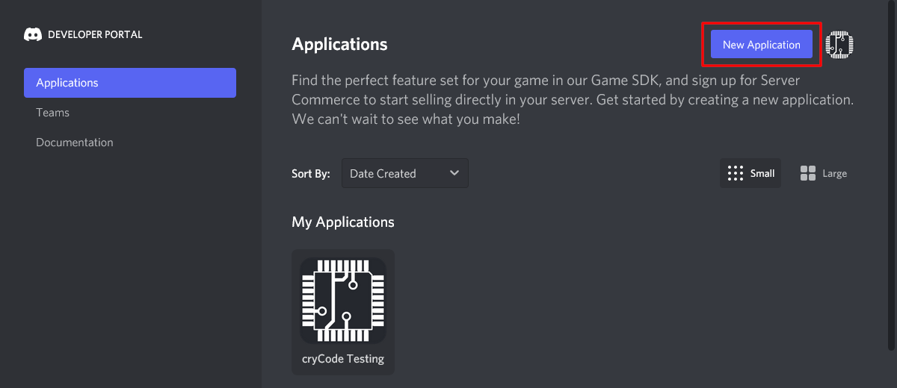
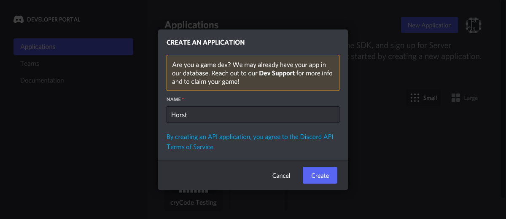
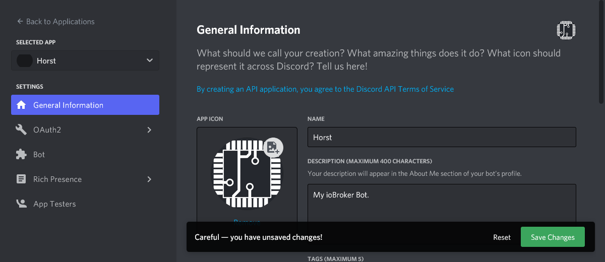
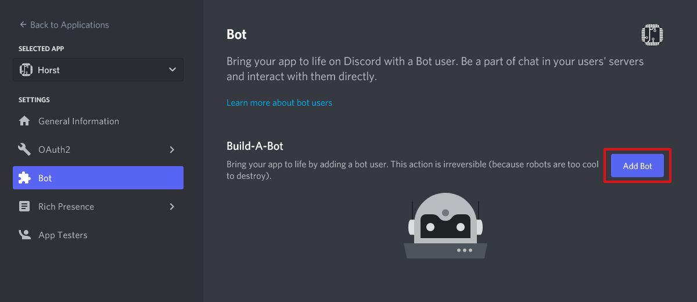
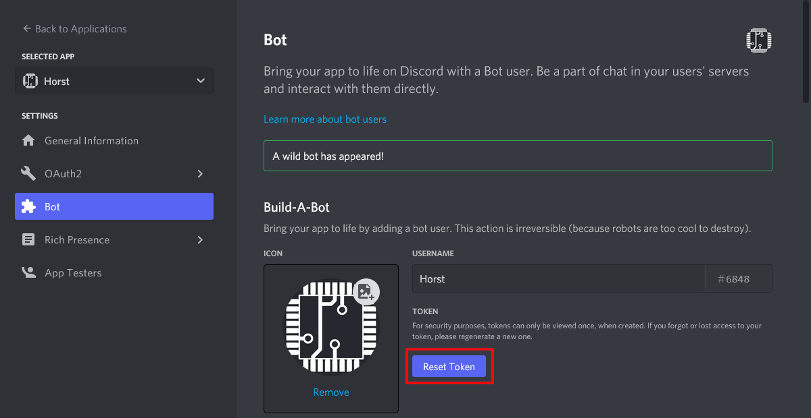
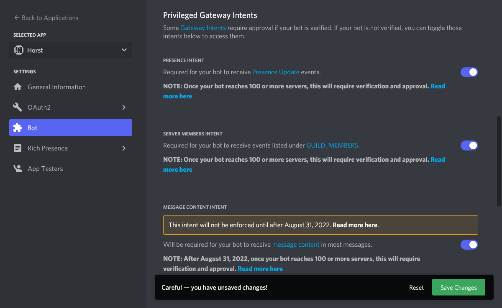
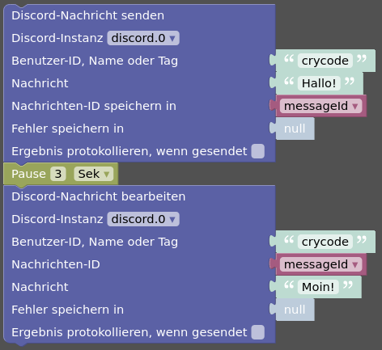
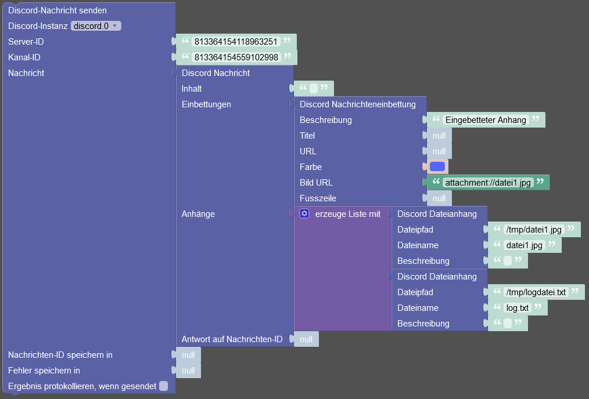
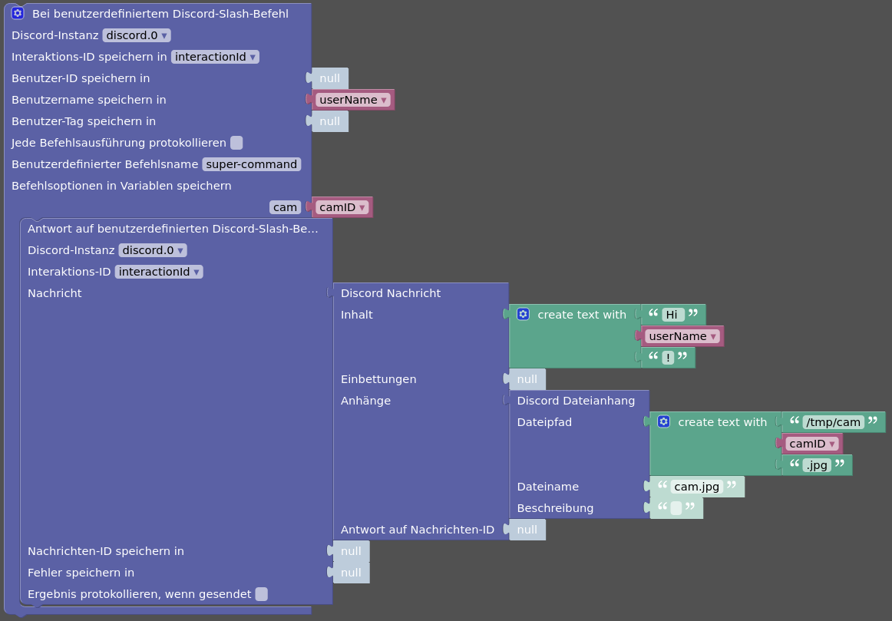

# IoBroker.discord


Этот адаптер [ioBroker] интегрирует бота [Discord] в ioBroker.

Адаптер создает дерево объектов с объектами и состояниями для серверов и каналов, в которых представлен бот.
Также создается дерево объектов для всех пользователей, которых видит бот.
Используя эти состояния, можно получать сообщения и отправлять сообщения и файлы через Discord.

Кроме того, адаптер может регистрировать слэш-команды Discord.
Это позволяет запрашивать или устанавливать состояния ioBroker.

- [ioBroker.discord](#iobrokerdiscord)
  - [Функции](#функции)
  - [Создание бота Discord](#creating-a-discord-bot)
  - [Добавить бота на сервер](#add-the-bot-to-a-server)
    - [Удалить бота с сервера](#удалить-бота-с-сервера)
  - [Штаты](#штаты-штаты)
    - [discord.0.bot.\*](#discord0bot)
    - [discord.0.servers.\<идентификатор-сервера\>.\*](#discord0serversидентификатор-сервера)
    - [discord.0.servers.\<идентификатор-сервера\>.channels.\<идентификатор-канала\>.\*](#discord0serversserver-idchannelschannel-id)
    - [discord.0.servers.\<идентификатор-сервера\>.members.\<идентификатор-пользователя\>.\*](#discord0serversserver-idmembersuser-id)
    - [discord.0.users.\<идентификатор-пользователя\>.\*](#discord0usersuser-id)
    - [discord.0.slashCommands.\<имя-команды\>.\*](#discord0slashcommandsимя-команды)
    - [discord.0.raw.\*](#discord0raw)
  - [авторизация](#авторизация)
  - [Новости](#новости)
    - [получать сообщения](#receive-messages)
      - [Использование text2command](#using-text2command)
    - [Отправить сообщения](#send-messages)
      - [Отправка простых текстов](#sending-simple-texts)
      - [Отправка файлов](#отправка-файлов)
      - [Отправка реакций](#отправка-реакций)
      - [Отправка ответа](#отправка-ответ)
      - [Отправка специальных пользовательских сообщений](#sending-special-custom-messages)
  - [Команды слэша](команды #слэша)
    - [Настроить состояния для слэш-команд](#configure-states-for-slash-commands)
    - [состояния запроса](#состояния-запроса)
    - [Установить состояния](#set-states)
    - [Получить обзор состояний с конфигурациями для слэш-команд](#get-an-overview-of-states-with-configurations-for-slash-commands)
    - [Пользовательские команды слэша](#custom-slash-commands)
      - [Структура json-состояния пользовательских слэш-команд](#structure-of-a-json-state-of-custom-slash-commands)
  - [Блокно](#блокно)
    - [Пример блочного режима: отправка сообщения пользователю и редактирование его через три секунды](#blockly-example-отправка-сообщения-пользователю-и-редактирование-через-три секунды)
    - [Блочный пример: отправка составного сообщения с вставкой и двумя вложенными файлами](#blockly-example-sending-a-complex-message-with-an-embed-and-two-file-attachments)
    - [Блочный пример: ответьте на пользовательскую команду косой черты и отправьте изображение запрошенной IP-камеры](#blockly-example-respond-to-custom-slash-command-and-send-image-of-requested-ip-cam)
  - [Использование в скриптах](#use-in-scripts)
    - [Отправка сообщения в скрипте](#отправка-сообщения-в-скрипте)
    - [Редактирование сообщения в скрипте](#редактирование-сообщения-в-скрипте)
    - [Удалить сообщение в скрипте](#удалить-сообщение-в-скрипте)
    - [Добавить эмодзи-реакцию к сообщению в скрипте](#add эмодзи-реакции в-сообщение-в-скрипте)
    - [Ожидание реакции на сообщение в скрипте](#ожидание-реакций-на-сообщение-в-скрипте)
    - [Отвечать на пользовательские команды слэша в скрипте](#реагировать на пользовательские команды слэша в скрипте)
    - [Запросить информацию о сервере в скрипте](#query-information-about-a-server-in-a-script)
    - [Запрос информации о канале сервера в скрипте](#query-information-about-a-server-channel-in-a-script)
    - [Запрос информации о пользователе в скрипте](#query-information-about-a-user-in-a-script)
    - [Запросить информацию об элементе сервера в скрипте](#query-information-about-a-server-member-in-a-script)
    - [Запрос информации о предыдущем сообщении в скрипте](#Запрос-информации-о-предыдущем-сообщении-в-скрипте)

## Функции
* ioBroker состояния для всех серверов бота для получения и отправки сообщений
* ioBroker указывает, что все пользователи, которых видит бот, могут получать и отправлять прямые сообщения.
* Упрощено подключение и выход из серверов Discord для бота.
* Установите статус бота, включая действия
* Опционально отслеживать статус присутствия пользователя
* Опционально отслеживать голосовой статус пользователей.
* Голосовые действия для участников сервера (отключить звук, оглохнуть, отключиться)
* Обработка всех сообщений или только сообщений с упоминанием бота в каналах сервера.
* Прямая обработка сообщений
* При желании автоматически отвечайте на упоминание бота смайликом.
* `.json` состояния для данных канала, пользователя и сообщения
* Отправляйте сообщения, файлы, реакции (смайлики), ответы или собственный контент сообщений в формате JSON.
* Список участников сервера и канала, включая назначенные роли.
* Поддержка косых команд Discord для запроса и установки значений состояния.
* Поддержка пользовательских слэш-команд Discord, на которые можно отвечать в пользовательских скриптах (включая Blockly).
* Поддержка [text2command] (необходимо включать индивидуально для каждого состояния `.message`)
* Отправляйте, редактируйте и удаляйте сообщения, отправляйте и ожидайте реакции на сообщения в пользовательских скриптах.
* Дополнительные необработанные состояния для большей гибкости в ваших собственных сценариях.
* Поддержка Blockly с настраиваемыми блоками для отправки и редактирования сообщений и обработки пользовательских команд косой черты.

Что *не* поддерживается и *не* предназначено:

* Сообщения в темах
* Отправлять и получать голосовые сообщения

Функция отсутствует? Просто создайте запрос на добавление функции на [GitHub][GitHub New Issue].

## Создание бота Discord
Чтобы использовать этот адаптер, необходимо создать приложение Discord Bot.

1. Перейдите на [Портал разработчиков Discord] и войдите в свою учетную запись Discord, если вы еще не вошли в систему.
2. В представлении _Приложения_ нажмите кнопку _Новое приложение_ в правом верхнем углу.

[](../../../de/adapterref/en/media/bot-creation-1.png)

3. Выберите имя для приложения (это будет имя бота) и нажмите _Создать_.

[](../../../de/adapterref/en/media/bot-creation-2.png)

4. (Необязательно) Загрузите _Значок приложения_, измените имя (_Имя_), измените описание (_Описание_), добавьте несколько _Тегов_ и сохраните изменения (_Сохранить изменения_).

[](../../../de/adapterref/en/media/bot-creation-3.png)

5. Перейдите к _Bot_ в левом меню и нажмите кнопку _Add Bot_.

[](../../../de/adapterref/en/media/bot-creation-4.png) В следующем диалоговом окне нажмите _Да, сделайте это!_, чтобы подтвердить создание бота.

6. Когда бот создан, вам необходимо один раз нажать кнопку _Сбросить токен_, чтобы получить токен бота.

[](../../../de/adapterref/en/media/bot-creation-5.png) Поскольку это аннулирует все предыдущие токены, вы должны подтвердить это с помощью кнопки _Да, сделайте это!_ в появившемся диалоговом окне.
После этого токен бота будет отображаться **один раз**, и вам следует скопировать его в безопасное место (например, в конфигурацию экземпляра адаптера).

7. На странице _Бот_ прокрутите немного вниз до _Намерения привилегированного шлюза_ и активируйте _Намерение присутствия_, _Намерение участников_ сервера_ и _Намерение содержимого сообщения_. Не забудьте сохранить изменения (_Save Changes_).

[](../../../de/adapterref/en/media/bot-creation-6.png) Примечание. Как только бот появится на более чем 100 серверах, эти намерения потребуют проверки и одобрения со стороны Discord.

8. Теперь все готово для запуска экземпляра адаптера и последующего добавления бота на сервер Discord.

## Добавляем бота на сервер
Чтобы добавить бота на сервер, можно использовать вкладку _Добавить бота на сервер_ в конфигурации экземпляра адаптера.
Там будет отображаться ссылка, по которой бота можно добавить на сервер, правильно выставив все необходимые разрешения и области применения.

[](../../../de/adapterref/iobroker.discord/media/bot-zu-server-hinzufuegen.png)

Для адаптера требуются следующие разрешения бота:

* Меняйте никнеймы
* Читать новости/просматривать каналы
* Умеренные участники
* Отправлять сообщения
* Вставлять ссылки
* Прикрепить файлы
* Читать историю сообщений
* Упомяните всех
* Добавить реакции
* Отключить звук участников
* Сделать участников глухими
* Переместить участников

Также необходимы следующие области применения:

*бот
* приложения.команды

Если разрешения или область действия отсутствуют, некоторые функции адаптера не будут работать.

### Удалить бота с сервера
Чтобы удалить бота с сервера, ниже на той же странице конфигурации экземпляра адаптера есть возможность выбрать сервер, а затем нажать кнопку _Покинуть сервер!_, чтобы сообщить боту покинуть сервер.

## Состояния
Каждый сервер, канал и пользователь идентифицируются своим уникальным числовым идентификатором.
Поскольку имена могут меняться, дерево объектов, созданное адаптером, использует эти идентификаторы для создания надежной структуры.

Все дерево объектов генерируется на основе того, что видит бот.
Поэтому возможно, например, что на сервере имеется больше каналов, чем отображается.

### Discord.0.bot.*
| Имя | Описание |
|---|---|
| `activityType` | Тип активности бота. Возможные значения: `Playing`, `Streaming`, `Listening`, `Watching`, `Competing`, `Custom` или пустая строка. |
| `status` | Статус присутствия бота. Возможные значения: `online`, `idle`, `dnd` и `invisible`. |
| `статус` | Статус присутствия бота. Возможные значения: «online», «idle», «dnd» и «invisible». |

Эти состояния используются для установки статуса присутствия и активности бота, которые должны отображаться для пользователей.

### Discord.0.servers.\<идентификатор-сервера\>.*
| Имя | Описание |
|---|---|
| `channels.*` | Серверные каналы. |
| `члены.*` | Участники сервера. |

### Discord.0.servers.\<идентификатор-сервера\>.channels.\<идентификатор-канала\>.*
| Имя | Описание |
|---|---|
| `channels.*` | Присутствует только в том случае, если канал является категорией. Структура такая же, как и у серверных каналов. |
| `members` | Список участников (отображаемых имен) канала, разделенных запятыми. |
| `message` | Последнее сообщение, полученное в этом канале. |
| `messageId` | Идентификатор последнего полученного сообщения. |
| `messageAuthor` | Автор (уникальное имя пользователя или тег пользователя) последнего полученного сообщения. |
| `messageTimestamp` | Временная метка последнего полученного сообщения. |
| `messageJson` | Данные JSON последнего полученного сообщения. |
| `send` | Отправка текстовых сообщений или сообщений в формате JSON. |
| `sendFile` | Отправка файла. |
| `sendReply` | Отправка ответа на сообщение. |
| `sendReaction` | Отправка реакции (эмодзи) на сообщение. |
| `json` | Данные JSON информации о канале. |
| `json` | Данные JSON информации о канале. |

Обо всех состояниях `message*` и `send*` см. раздел _Сообщения_ ниже.

### Discord.0.servers.\<идентификатор-сервера\>.members.\<идентификатор-пользователя\>.*
| Имя | Описание |
|---|---|
| `tag` | Уникальный тег пользователя в Discord. |
| `displayName` | Отображаемое имя пользователя на сервере. |
| `roles` | Список ролей пользователя на сервере, разделенный запятыми. |
| `joinedAt` | Временная метка того, когда пользователь присоединился к серверу. |
| `voiceChannel` | Голосовой канал, к которому в данный момент подключен пользователь, или пустая строка, если он не подключен. |
| `voiceDisconnect` | Кнопка отключения пользователя от голосового канала. |
| `voiceSelfDeaf` | Индикатор, оглушил ли пользователь себя. |
| `voiceSelfMute` | Индикатор того, отключил ли пользователь звук. |
| `voiceServerDeaf` | Индикатор того, был ли пользователь оглушен сервером. Также может использоваться для изменения этого статуса. |
| `voiceServerMute` | Индикатор того, был ли пользователь отключен сервером. Также может использоваться для изменения этого статуса. |
| `json` | Информация о пользователе. Данные JSON. |
| `json` | Информация о пользователе. Данные JSON. |

Чтобы состояния `voice*` были текущими, в конфигурации экземпляра должна быть включена опция _Следить за статусом голосового чата_ пользователей.
Для использования действий `voiceDisconnect`, `voiceServerDeaf` и `voiceServerMute` бот должен иметь соответствующие разрешения на сервере.

### Discord.0.users.\<идентификатор-пользователя\>.*
| Имя | Описание |
|---|---|
| `tag` | Уникальный тег пользователя в Discord. |
| `status` | Статус присутствия пользователя. Один из `online`, `offline`, `idle`, `dnd` |
| `activityType` | Тип текущей активности пользователя. Один из `Playing`, `Streaming`, `Listening`, `Watching`, `Competing`, `Custom` или пустая строка. |
| `activityName` | Название текущей активности пользователя. Например, название игры во время `Playing`. |
| `avatarUrl` | URL-адрес аватара пользователя. |
| `bot` | Индикатор того, является ли пользователь ботом. |
| `message` | Последнее прямое сообщение, полученное от пользователя. |
| `messageId` | Идентификатор последнего полученного прямого сообщения пользователя. |
| `messageTimestamp` | Временная метка последнего полученного прямого сообщения пользователя. |
| `messageJson` | Данные JSON последнего полученного прямого сообщения пользователя. |
| `send` | Отправка текстовых сообщений или сообщений в формате JSON. |
| `sendFile` | Отправка файла. |
| `sendReply` | Отправка ответа на сообщение. |
| `sendReaction` | Отправка реакции (эмодзи) на сообщение. |
| `json` | Информация о пользователе. Данные JSON. |
| `json` | Информация о пользователе. Данные JSON. |

Чтобы состояния `status` и `activity*` были текущими, в конфигурации экземпляра должна быть активирована опция _Наблюдать за присутствием пользователя_.

Обо всех состояниях `message*` и `send*` см. раздел _Сообщения_ ниже.

### Discord.0.slashCommands.\<имя-команды\>.*
Кроме того, если в конфигурации экземпляра адаптера включены специальные команды, существуют следующие состояния.

Все эти состояния обновляются каждый раз при вызове пользовательской команды.

| Имя | Описание |
|---|---|
| `json` | Данные JSON о последнем использовании команды. Содержит некоторую дополнительную информацию, не включенную в отдельные состояния. |
| `userId` | Идентификатор пользователя, вызвавшего команду. |
| `userTag` | Уникальный тег пользователя, вызвавшего команду. |
| `userName` | Имя пользователя, вызвавшего команду. (один раз, если `userTag` заканчивается на `#0`) |
| `channelId` | Идентификатор канала, в котором была вызвана команда. |
| `serverId` | Идентификатор сервера, на котором была вызвана команда, или `null`, если команда была вызвана в прямом сообщении. |
| `timestamp` | Временная метка последнего использования команды. |
| `option-*` | Параметры, указанные для команды. Для каждой настроенной опции создается отдельное состояние. Если опция не указана при вызове команды, то соответствующее состояние устанавливается в `null`. |
| `option-*.value` | Последнее значение, указанное для параметра при вызове команды. Если опция не указана, то соответствующее состояние устанавливается в `null`. |
| `option-*.choices` | Массив JSON с предопределенными вариантами выбора для этой опции. Присутствует только для параметров типа текста. Пример: `["Wert 1", "Wert 2", { "name": "Wert 3", "value": "w3" }]` |
| `sendReply` | Отправьте ответ на вызванную команду. Как и в случае с состояниями `.send` каналов или пользователей, это может быть строка или объект JSON. См. раздел _Новости_ ниже. |
| `отправитьОтвет` | Отправьте ответ на вызванную команду. Как и в случае с состояниями канала или пользователя .send, это может быть строка или объект JSON. См. раздел _Новости_ ниже. |

**Примечание.** Во избежание дублирования рекомендуется использовать состояние `json` в ваших собственных скриптах.
Пример: Пользовательский сценарий считывает отдельные состояния `option-*`, когда пользователь снова вызывает команду, и параметры первого и второго вызовов команды путаются.

### Discord.0.raw.*
Кроме того, если в конфигурации экземпляра адаптера включены необработанные состояния, существуют следующие состояния.

**Примечание.** Эти состояния включают необработанные данные без какой-либо проверки, фильтрации или изменения адаптером. Серверы называются гильдией.

| Имя | Описание |
|---|---|
| `messageJson` | Необработанные данные JSON последнего полученного сообщения. (Сообщения канала и личные сообщения) |
| `взаимодействиеJson` | Необработанные данные JSON о последнем полученном взаимодействии. (например, команды слэша) |

## Авторизация
По умолчанию авторизация включена и взаимодействовать с адаптером смогут только авторизованные пользователи.

Авторизованные пользователи и роли сервера могут быть установлены в конфигурации экземпляра адаптера, включая разрешения для каждого пользователя/роли.
Для ролей сервера разрешения применяются только на соответствующем сервере, а не на других серверах или в личных сообщениях.
Если разрешения были назначены для каждой роли пользователя и сервера, они объединяются для соответствующего сервера.

Пользователи и роли идентифицируются по их внутреннему идентификатору, поэтому даже изменения тега пользователя, имени пользователя или имени роли не влияют на авторизацию.

Также есть возможность деактивировать авторизацию. Однако делать это следует только в том случае, если всем пользователям на всех серверах бота можно доверять!

## Новости
Адаптер способен получать и отправлять сообщения от текстовых каналов и пользователей Discord.

По умолчанию каналы обрабатывают только сообщения, в которых упоминается бот.
Чтобы сообщения без упоминаний также обрабатывались, в конфигурации экземпляра должна быть активирована опция _Обрабатывать все сообщения в каналах сервера_.

Когда получено сообщение с упоминанием бота, адаптер отвечает на это сообщение смайликом.
Это можно настроить в конфигурации экземпляра адаптера.
Если включена авторизация, то бот будет отвечать только на упоминания авторизованных пользователей.

### Получать сообщения
Полученные сообщения сохраняются в состояниях `.message*` соответствующего объекта канала для сообщений канала или объекта пользователя для прямых сообщений.

По умолчанию при включенной авторизации сохраняются только сообщения от авторизованных пользователей.
Это можно настроить с помощью параметра _Обрабатывать сообщения от неавторизованных пользователей_ в конфигурации экземпляра адаптера, чтобы сообщения от неавторизованных пользователей также сохранялись.

Последнее сообщение, полученное для каждого канала/пользователя, всегда сохраняется в состоянии `.message`.
Временная метка, автор и идентификатор последнего полученного сообщения сохраняются в связанных состояниях.
Кроме того, вся эта информация также сохраняется в формате JSON в состоянии `.messageJson`.

#### Использование команды text2
Чтобы использовать text2command, экземпляр text2command должен быть выбран в конфигурации экземпляра адаптера.

Для каждого состояния `.message` можно включить пользовательскую настройку _enable text2command для этого состояния_.
Если этот параметр включен, полученные сообщения будут отправляться в выбранный экземпляр text2command.

Ответ от text2command отправляется адаптером в виде ответа, как обычное сообщение, или не отправляется вообще, в зависимости от конфигурации экземпляра адаптера.

### Отправлять сообщения
Чтобы отправить сообщение, содержимое может быть записано в состояния `.send*` канала или пользователя.

#### Отправка простых текстовых сообщений
Чтобы отправить простые текстовые сообщения, просто напишите текст в состоянии `.send` нужного пункта назначения.
[Discord Markdown] можно использовать для форматирования текста, как в клиенте Discord.

Чтобы упомянуть пользователя, его идентификатор можно использовать в форме `<@Benutzer-ID>`.
`<@&Gruppen-ID>` можно использовать для обозначения групп, а `<#Kanal-ID>` можно использовать для каналов.

Примеры: `Dies ist meine Nachricht.`, `Dies ist _meine_ **formatierte** Nachricht.`, `Hey <@490222742801481728>!`.

#### Отправка файлов
Чтобы отправить файл как вложение, запишите местоположение файла в состоянии `.sendFile` желаемого места назначения.

Местоположение файла может быть...

* Абсолютный или относительный путь к локальному файлу.

Относительные пути указаны относительно каталога адаптера установки ioBroker.
Путь может иметь префикс `file://`.
Примеры: `/home/user/image.png`, `../../iobroker-data/files/myfile.txt`, `file:///tmp/image.jpg`.

* URL-адрес удаленного файла.

  Пример: `https://www.iobroker.dev/images/iobroker.png`

* Содержимое файла в кодировке Base64.

  Пример: ``

Кроме того, в файл можно добавить текстовое сообщение. Для этого просто напишите местоположение файла, затем символ вертикальной черты `|` и сообщение в состоянии `.sendFile`.
Примеры: `/tmp/image.png|Dies ist meine Datei`, `https://www.iobroker.dev/images/iobroker.png|Das ioBroker Logo`.

#### Отправка реакций
Состояние `.sendReaction` можно использовать для реакции на предыдущие сообщения с помощью смайликов. Для этого просто напишите смайлик в статусе.

По умолчанию ответ отправляется на сообщение, идентификатор которого в данный момент содержится в соответствующем состоянии `.messageId`.

Если необходимо ответить на конкретное сообщение, то идентификатор сообщения, за которым следует символ вертикальной черты `|`, и эмодзи могут быть записаны в состояние `.sendReaction`.

Примеры: `👍`, `971032590515568660|👍`.

#### Отправка ответов
Состояние `.sendReply` можно использовать для ответа на предыдущие сообщения.
Для этого просто напишите ответ в штате.

По умолчанию ответ отправляется на сообщение, идентификатор которого в данный момент содержится в соответствующем состоянии `.messageId`.

Если необходимо ответить на конкретное сообщение, то за идентификатором сообщения следует символ вертикальной черты `|`, и ответ может быть записан в состояние `.sendReply`.

Примеры: `Dies ist eine Antwort.`, `971032590515568660|Dies ist eine Antwort.`.

#### Отправка специальных сообщений
Специальные пользовательские сообщения также можно отправлять, записывая объект сообщения JSON в состояние `.send` или `.sendReply`.

Объект JSON должен иметь тип `MessageOptions`.
Для получения дополнительной информации см. [документацию по discord.js MessageOptions][MessageOptions].

Примеры:

Отправить картинку:

```json
{
  "files": [
    {
      "attachment": "/tmp/image.jpg",
      "name": "image.jpg",
      "description": "Mein tolles Bild"
    }
  ]
}
```

Отправить встроенный контент:

```json
{
  "content": "Verwende das:",
  "embeds": [
    {
      "title": "ioBorker.discord",
      "description": "Discord Adapter für ioBroker",
      "color": "#5865f2",
      "url": "https://github.com/crycode-de/ioBroker.discord",
      "author": {
        "name": "Peter Müller",
        "url": "https://github.com/crycode-de"
      },
      "image": {
        "url": "https://github.com/crycode-de/ioBroker.discord/raw/main/admin/discord.png"
      },
      "footer": {
        "text": "❤👍"
      }
    }
  ]
}
```

Отправьте встроенное изображение из локального источника:

```json
{
  "embeds": [
    {
      "title": "IP-Cam Alarm",
      "description": "Schau dir das an:",
      "color": "#ff0000",
      "image": {
        "url": "attachment://cam.jpg"
      }
    }
  ],
  "files": [
    {
      "attachment": "http://192.168.1.50:8080/ip-cam.jpg",
      "name": "cam.jpg"
    }
  ]
}
```

## Слэш-команды
Если этот параметр включен в конфигурации экземпляра адаптера, адаптер может работать с косой чертой команд Discord. Эти команды можно использовать для запроса или установки состояний ioBroker.

**Примечание.** Состояния, доступные для косых команд Discord, должны быть настроены индивидуально. См. далее ниже.

Команды косой черты Discord могут быть зарегистрированы адаптером как команды сервера (по умолчанию) или как глобальные команды. Это можно установить в конфигурации экземпляра адаптера.
Преимущество использования серверных команд заключается в том, что изменения в командах (например, добавление состояний) применяются немедленно и без задержки.
Однако команды сервера нельзя использовать в прямых сообщениях между пользователем и ботом.
Глобальные команды также можно использовать в личных сообщениях, но для отражения любых изменений в командах в Discord может потребоваться до часа. Это ограничение Discord, а не адаптера.

Команды косой черты по умолчанию: `/iob-get` и `/iob-set`.
Имена и описания команд можно настроить в конфигурации экземпляра адаптера.

### Настройка состояний для команд с косой чертой
Для любого состояния, которое вы хотите сделать доступным с помощью косой черты Discord, это необходимо включить в пользовательских настройках состояния.
Для этого просто нажмите значок шестеренки _Пользовательские настройки_ в представлении _Объекты_ в администраторе, включите настройки экземпляра адаптера и установите флажок _Включить команды Discord для этого состояния_.

[](../../../de/adapterref/iobroker.discord/media/slash-befehl-konfiguration-1.png)

[](../../../de/adapterref/iobroker.discord/media/slash-befehl-konfiguration-2.png)

Для каждого состояния можно определить _Имя_ и _Псевдоним_ для использования в Discord.
_Имя_ используется при автозаполнении команд, а _Псевдоним_ используется в качестве внутреннего идентификатора. Оба не должны превышать 100 символов в длину.

Для каждого состояния можно индивидуально определить, должно ли оно быть доступно для запроса и/или настройки.
Кроме того, можно активировать, чтобы информация отображалась при запросе, если соответствующий статус не подтвержден, или чтобы при настройке всегда устанавливалось подтверждение.

Для состояний типа данных `string` можно выбрать, чтобы значение обрабатывалось как файл (местоположение файла).
Если это активировано, то текущее значение состояния отправляется так же, как и состояния `.sendFile`.
Это позволяет, например, запрашивать изображения с помощью команды запроса.

Для состояний типа данных `number` можно указать количество десятичных знаков для округления значения в командах запроса.

Для состояний типа данных `boolean` могут быть определены пользовательские значения для `true` и `false`, которые затем используются для отображения в командах запроса и для обнаружения в командах установки.

### Состояния запроса
Чтобы запросить статус, просто вызовите `/iob-get Zustandsalias` в клиенте Discord.
Для `Zustandsalias` при вводе команды отображается автозаполнение.

Каждое значение форматируется для вывода, как указано в объекте состояния и его пользовательских настройках.
Опционально информация добавляется, если статус не подтвержден.

### Установка состояний
Чтобы запросить статус, просто вызовите `/iob-set Zustandsalias Neuer-Wert` в клиенте Discord.
Для `Zustandsalias` при вводе команды отображается автозаполнение.
`Neuer-Wert` анализируется адаптером, если тип данных состояния — `boolean` или `number`.

Для каждого состояния можно индивидуально настроить, следует ли устанавливать значение с подтверждением или без него.

Для состояний типа данных `boolean` значения `true`, `on`, `yes`, `1` и связанные с ними переводы (`wahr`, § §SSSSS_6§ §, `ja`), а также _Истинное значение_, настроенное для состояния, интерпретируется как `true`.
Любое другое значение интерпретируется как `false`.

Для состояний типа данных `number` указанное значение интерпретируется как десятичное число.
Если установка ioBroker настроена на использование запятой в качестве десятичного разделителя, то число можно указать с помощью запятой или точки в качестве десятичного разделителя. В противном случае в качестве десятичного разделителя допускается только точка.
Если в объекте состояния указаны значения `min` и `max`, то они также будут проверены.

### Получите обзор состояний с конфигурациями для команд с косой чертой
Чтобы получить обзор всех состояний с активной конфигурацией для косой черты, вы можете нажать кнопку _Журнал объектов состояния, настроенных для команд_ в конфигурации экземпляра адаптера. Затем выходные данные появятся в журнале установки ioBroker.

### Пользовательские команды слэша
Ваши собственные команды слэша можно активировать и настроить в конфигурации экземпляра адаптера.
Настроенные пользовательские команды затем регистрируются в Discord вместе со стандартными командами получения и установки.

К каждой пользовательской команде можно добавить параметры.
Эти параметры затем появятся в клиенте Discord для команды.
Если при вызове команды опция не указана, то эта опция содержит значение `null`.
Для опций типа _Text_ предопределенные варианты могут быть динамически указаны в соответствующем состоянии `option-*.choices` в виде массива JSON.

При вызове определяемой пользователем команды данные для нее записываются в соответствующие состояния. См. описание состояний в разделе _States_ выше.

Вся информация, включая параметры, записывается в состояние `.json` команды.
Это состояние в первую очередь следует использовать для сохранения данных команд в скриптах, так как вся необходимая информация хранится в одном месте и ничего не перепутается, даже если за короткий промежуток времени будет вызвано несколько команд.
Для опций типа _Пользователь_, _Роль_, _Канал_ или _Mentionable_ в объектах опций заполняются дополнительные поля.

**Примечание.** Необходимо оценить саму команду, а затем отправить на нее ответ. Это можно сделать, например, с помощью собственного скрипта.
Ответ должен быть отправлен в течение 15 минут через состояние `.sendReply` или связанное с ним действие `sendTo(...)`.
Если в течение определенного времени ответ не будет отправлен, клиент Discord отобразит ошибку _Приложение не отвечает_.

**Примечание.** Ответ на вызов команды можно отправлять несколько раз.
Ответ отредактируется и перезаписывается новым содержанием.

#### Структура состояния json пользовательских команд слэша
```js
{
  interactionId: string,
  commandName: string,
  user: {
    id: string,
    tag: string,
    name: string,
    displayName: string,
  },
  channelId: string,
  serverId: string | null,
  timestamp: number,
  options: {
    [string]: {
      value: string | number | boolean | null,
      type: 'String' | 'Number' | 'Boolean' | 'User' | 'Role' | 'Channel' | 'Mentionable' | null,
      user?: { // wenn type USER oder MENIONABLE ist
        id: string,
        tag: string,
        name: string,
        bot: boolean,
      },
      member?: { // wenn type USER oder MENIONABLE ist und der Befehl auf einem Server aufgerufen wurde
        id: string,
        tag: string,
        name: string,
        displayName: string,
        roles: { id: string, name: string }[],
      },
      role?: { // wenn type ROLE oder MENTIONABLE ist
        id: string,
        name: string,
      },
      channel?: { // wenn type CHANNEL ist
        id: string,
        name: string,
        type: 'GuildCategory' | 'GuildNews' | 'GuildStageVoice' | 'GuildStore' | 'GuildText' | 'GuildVoice',
        lastMessageId: string | null,
      },
    },
    // ...
  }
}
```

## Блочно
Адаптер поставляется с собственными блоками Blockly, для...

* Отправка сообщений пользователям или каналам сервера.
* Редактировать сообщения в личных сообщениях или каналах сервера.
* Добавление эмодзи-реакций к сообщениям.
* Содержимое составного сообщения с дополнительными вставками, вложениями и ссылками на ответ.
* Создание вставок сообщений
* Создание вложений к сообщению.
* Реагировать на пользовательские команды слэша
* Реагировать на пользовательские команды слэша

### Блочный пример: отправка сообщения пользователю и его редактирование через три секунды
[](../../../de/adapterref/iobroker.discord/media/blockly-1.png)

<details><summary>Блочный код</summary>

```xml
<xml xmlns="https://developers.google.com/blockly/xml">
  <variables>
    <variable id="KIILW$,(eB?pT`;GDuMF">messageId</variable>
  </variables>
  <block type="discord_send_message_user" id="?xkCV};-Lk_-|Q`]%(Gt" x="163" y="38">
    <field name="instance">.0</field>
    <field name="logResultOk">FALSE</field>
    <value name="user">
      <shadow type="text" id="jXN@CluUy_M/ig@4[(Uk">
        <field name="TEXT">crycode</field>
      </shadow>
    </value>
    <value name="content">
      <shadow type="text" id="uLWu1CJ$;k}|VTyw1-8}">
        <field name="TEXT">Hallo!</field>
      </shadow>
    </value>
    <value name="varMessageId">
      <shadow type="logic_null" id="bJ2lJW0qOa@Zjv%(]mFU"></shadow>
      <block type="variables_get" id="xkJ(vH/;@7%)cDo0HU/~">
        <field name="VAR" id="KIILW$,(eB?pT`;GDuMF">messageId</field>
      </block>
    </value>
    <value name="varError">
      <shadow type="logic_null" id="H:f+1-:p9-YkmpehJoco"></shadow>
    </value>
    <next>
      <block type="timeouts_wait" id="OM8gv}Pl#_mHQ|)([mUe">
        <field name="DELAY">3</field>
        <field name="UNIT">sec</field>
        <next>
          <block type="discord_edit_message_user" id="|L3A+9{s_H8j`AF@,*VF">
            <field name="instance">.0</field>
            <field name="logResultOk">FALSE</field>
            <value name="user">
              <shadow type="text" id="voJ:{uuYtbBZ!Xe,rtV|">
                <field name="TEXT">crycode</field>
              </shadow>
            </value>
            <value name="messageId">
              <shadow type="text" id="64L=tOKvKwoqGHadRgDm">
                <field name="TEXT"></field>
              </shadow>
              <block type="variables_get" id="(M^6xk74LUEsPdH=LagL">
                <field name="VAR" id="KIILW$,(eB?pT`;GDuMF">messageId</field>
              </block>
            </value>
            <value name="content">
              <shadow type="text" id="rvnV^RF,g$M/3+(npHNC">
                <field name="TEXT">Moin!</field>
              </shadow>
            </value>
            <value name="varError">
              <shadow type="logic_null" id="{H4Q^vl400kxRKrffDz)"></shadow>
            </value>
          </block>
        </next>
      </block>
    </next>
  </block>
</xml>
```

</подробнее>

### Блочный пример: отправка составного сообщения с встраиванием и двумя вложенными файлами
[](../../../de/adapterref/iobroker.discord/media/blockly-2.png)

<details><summary>Блочный код</summary>

```xml
<xml xmlns="https://developers.google.com/blockly/xml">
  <block type="discord_send_message_server_channel" id="Mnc=pB-8%Dr/nsen|SC`" x="63" y="38">
    <field name="instance">.0</field>
    <field name="logResultOk">FALSE</field>
    <value name="serverId">
      <shadow type="text" id="PA4]t;7CuDrKtwa|oB?L">
        <field name="TEXT">813364154118963251</field>
      </shadow>
    </value>
    <value name="channelId">
      <shadow type="text" id="x^vm,CRT`z2AhDT#ZcUC">
        <field name="TEXT">813364154559102998</field>
      </shadow>
    </value>
    <value name="content">
      <shadow type="text" id="ebdEp~G?:_gInjN47g@f">
        <field name="TEXT"></field>
      </shadow>
      <block type="discord_create_content" id="kY,/zwmwkjo:U;cT?eN*">
        <value name="content">
          <shadow type="text" id="D|y(g`oE@H#gu+deGbv2">
            <field name="TEXT"></field>
          </shadow>
        </value>
        <value name="embeds">
          <shadow type="logic_null" id="Qt[pG25wLoI8+3/jN66C"></shadow>
          <block type="discord_create_embed" id="cXAWtP-36uYlAxLhIBhN">
            <value name="description">
              <shadow type="text" id="^D%m:ic9]AcUUQP8~U#6">
                <field name="TEXT">Eingebetteter Anhang</field>
              </shadow>
            </value>
            <value name="title">
              <shadow type="logic_null" id="_Wm.(^Ff6^u%K+gVz$^Z"></shadow>
            </value>
            <value name="url">
              <shadow type="logic_null" id="0,08A!7[kJ-nJPnPH$L5"></shadow>
            </value>
            <value name="color">
              <shadow type="colour_picker" id="V0}MlQJvN._LHFhG2K%@">
                <field name="COLOUR">#5865f2</field>
              </shadow>
            </value>
            <value name="imageUrl">
              <shadow type="logic_null" id="xXr:E++u0;@2#e]r;_`]"></shadow>
              <block type="text" id="76;;p-5{pls%KmrI!ar{">
                <field name="TEXT">attachment://datei1.jpg</field>
              </block>
            </value>
            <value name="footerText">
              <shadow type="logic_null" id="#BS`MgkNWbrQ@*m/kNdw"></shadow>
            </value>
          </block>
        </value>
        <value name="files">
          <shadow type="logic_null" id="4u@7^DXCI~J$r{Qx}1Ql"></shadow>
          <block type="lists_create_with" id="42g8r-+[xWw`|^.qOF!*">
            <mutation items="2"></mutation>
            <value name="ADD0">
              <block type="discord_create_file" id="EzK4NA^+bu4vChH/vj-b">
                <value name="attachment">
                  <shadow type="text" id="=OEkBZ:LFXvT2$S++21(">
                    <field name="TEXT">/tmp/datei1.jpg</field>
                  </shadow>
                </value>
                <value name="name">
                  <shadow type="text" id="zum#q*|`aD%A2s/N@/Ow">
                    <field name="TEXT">datei1.jpg</field>
                  </shadow>
                </value>
                <value name="description">
                  <shadow type="text" id="#ZZOq%3EHO/_GC+w.,-^">
                    <field name="TEXT"></field>
                  </shadow>
                </value>
              </block>
            </value>
            <value name="ADD1">
              <block type="discord_create_file" id="wIKo-2??SX@WcYc7e/5s">
                <value name="attachment">
                  <shadow type="text" id=")4lvYv.)IhU/p+~KUDym">
                    <field name="TEXT">/tmp/logdatei.txt</field>
                  </shadow>
                </value>
                <value name="name">
                  <shadow type="text" id="#)t#lK6{$RuZt34O;@Ag">
                    <field name="TEXT">log.txt</field>
                  </shadow>
                </value>
                <value name="description">
                  <shadow type="text" id="^UKzs+$TQ!tiE:`(=%}}">
                    <field name="TEXT"></field>
                  </shadow>
                </value>
              </block>
            </value>
          </block>
        </value>
        <value name="replyToId">
          <shadow type="logic_null" id="#1:[?d^x=)ZH.!uyxRI:"></shadow>
        </value>
      </block>
    </value>
    <value name="varMessageId">
      <shadow type="logic_null" id="@D^#9^84UknOfV|c$NK~"></shadow>
    </value>
    <value name="varError">
      <shadow type="logic_null" id="mJu{Fa9+]+Ml,{_OqIOh"></shadow>
    </value>
  </block>
</xml>
```

</подробнее>

### Блочный пример: ответьте на пользовательскую команду с косой чертой и отправьте изображение запрошенной IP-камеры
[](../../../de/adapterref/iobroker.discord/media/blockly-3.png)

<details><summary>Блочный код</summary>

```xml
<xml xmlns="https://developers.google.com/blockly/xml">
  <variables>
    <variable id="Wcj[Gmy,vX]b,)s,O)`U">interactionId</variable>
    <variable id="{sXn[Mn@ZN#fWtTV6O^;">userName</variable>
    <variable id="ULmVI=-QcXLnD!e60KTV">camID</variable>
  </variables>
  <block type="discord_on_custom_cmd" id="GE,i32wKhz%KGlBhV$j=" x="63" y="13">
    <mutation xmlns="http://www.w3.org/1999/xhtml" options="cam"></mutation>
    <field name="instance">.0</field>
    <field name="varInteractionId" id="Wcj[Gmy,vX]b,)s,O)`U">interactionId</field>
    <field name="log">FALSE</field>
    <field name="commandName">super-command</field>
    <value name="varUserId">
      <shadow type="logic_null" id="/}0,E!Gq=C2U]C^.8m1@"></shadow>
    </value>
    <value name="varUserName">
      <block type="variables_get" id="Q=v?u?yU}Tw*@FH*|x7.">
        <field name="VAR" id="{sXn[Mn@ZN#fWtTV6O^;">userName</field>
      </block>
    </value>
    <value name="varUserTag">
      <shadow type="logic_null" id="+r2I4SpfhuW%9DE21,[c"></shadow>
    </value>
    <value name="option0">
      <shadow type="logic_null" id="hL^g}gJg-b.+SOH0s9m1"></shadow>
      <block type="variables_get" id="z/Lf|chD)~Ge0N~@EWG%">
        <field name="VAR" id="ULmVI=-QcXLnD!e60KTV">camID</field>
      </block>
    </value>
    <statement name="STATEMENT">
      <block type="discord_send_custom_command_reply" id="zJXF!F=|Xt4.kG/6ctl(">
        <field name="instance">.0</field>
        <field name="interactionId" id="Wcj[Gmy,vX]b,)s,O)`U">interactionId</field>
        <field name="logResultOk">FALSE</field>
        <value name="content">
          <shadow type="text" id="bdVm59S9_U*GFB(IBO6x">
            <field name="TEXT"></field>
          </shadow>
          <block type="discord_create_content" id="6m8gBtp;K@t8}{`9gPd1">
            <value name="content">
              <shadow type="text" id=".c}Z71nQ8LlQ@h}_Z?qR">
                <field name="TEXT"></field>
              </shadow>
              <block type="text_join" id="Z{wQ$[1g7z?KPMSHB],Y">
                <mutation items="3"></mutation>
                <value name="ADD0">
                  <block type="text" id="cuzUE7GB$#gC*;nOQ|Ke">
                    <field name="TEXT">Hi </field>
                  </block>
                </value>
                <value name="ADD1">
                  <block type="variables_get" id="|[[T@|n1Ro{EU56/jJ@P">
                    <field name="VAR" id="{sXn[Mn@ZN#fWtTV6O^;">userName</field>
                  </block>
                </value>
                <value name="ADD2">
                  <block type="text" id="LV$kS:Gzv#cJ#gXe/{4a">
                    <field name="TEXT">!</field>
                  </block>
                </value>
              </block>
            </value>
            <value name="embeds">
              <shadow type="logic_null" id="p8S?*FLv4a6aIJogCKU;"></shadow>
            </value>
            <value name="files">
              <shadow type="logic_null" id="y#a8q/mr^)Ymt*j)S:H/"></shadow>
              <block type="discord_create_file" id="vN%eoP74=*)f63CQiJ__">
                <value name="attachment">
                  <shadow type="text" id="2$9y5yj3.GHx.ms*:Ce2">
                    <field name="TEXT"></field>
                  </shadow>
                  <block type="text_join" id="K9zuKTz?-b8VT$8XUVQ8">
                    <mutation items="3"></mutation>
                    <value name="ADD0">
                      <block type="text" id="p3f^[{6t+UuDJN=49+#Z">
                        <field name="TEXT">/tmp/cam</field>
                      </block>
                    </value>
                    <value name="ADD1">
                      <block type="variables_get" id="oVmVHEX[iT(-X#]m=[U@">
                        <field name="VAR" id="ULmVI=-QcXLnD!e60KTV">camID</field>
                      </block>
                    </value>
                    <value name="ADD2">
                      <block type="text" id="wUXx)@u6*2,+9!q{W`n`">
                        <field name="TEXT">.jpg</field>
                      </block>
                    </value>
                  </block>
                </value>
                <value name="name">
                  <shadow type="text" id="L5fO_+by.^Z:se~6|xCj">
                    <field name="TEXT">cam.jpg</field>
                  </shadow>
                </value>
                <value name="description">
                  <shadow type="text" id="ku}h+v)9oY;1`[9Rr)w%">
                    <field name="TEXT"></field>
                  </shadow>
                </value>
              </block>
            </value>
            <value name="replyToId">
              <shadow type="logic_null" id="Ou%Gd6C*+2OaIPUxPp}t"></shadow>
            </value>
          </block>
        </value>
        <value name="varMessageId">
          <shadow type="logic_null" id="RUb!i][5`[t0*mzLwBvN"></shadow>
        </value>
        <value name="varError">
          <shadow type="logic_null" id="SLsj^+8=[Bp%/X8n]$?Z"></shadow>
        </value>
      </block>
    </statement>
  </block>
</xml>
```

</подробнее>

## Использование в скриптах
В скриптах функция `sendTo(...)` может использоваться для взаимодействия с экземпляром адаптера.

_Примечание:_ Все используемые идентификаторы являются строками.

### Отправка сообщения в скрипте
Для отправки сообщения можно использовать команду `send` или `sendMessage`. Они оба идентичны.

Часть `message` `sendTo(...)` должна быть объектом с отправляемым `content` и одним из следующих параметров для идентификации пункта назначения:

* `идентификатор пользователя`
* `userTag`
* `имя пользователя`
* `serverId` и `channelId`

`content` может быть простой строкой или объектом [MessageOptions].

Возвращаемое значение в обратном вызове `sendTo(...)` представляет собой объект, содержащий параметры сообщения и строку `result`, а также `messageId` отправленного сообщения Discord в случае успеха или §§SSSSSS_3§. § сообщение в случае ошибки.

Примеры:

```js
// Senden einer Nachricht zu einem Benutzer bei Verwendung des einmaligen Benutzernamens
sendTo('discord.0', 'sendMessage', {
  userName: 'crycode',
  content: 'Hi!',
}, (ret) => {
  log(ret);
  // {'result':'Message sent to user crycode','userName':'crycode','content':'Hi!','messageId':'971779972052155891'}

  if (ret.error) {
    log(ret.error, 'error');
    return;
  }
  log(`Nachricht gesendet mit ID ${ret.messageId}`);
});

// Senden einer Nachricht zu einem Benutzer bei Verwendung des Benutzer-Tags
// (für Bots und Benutzer, die noch nicht zu einem einmaligen Benutzernamen migriert sind)
sendTo('discord.0', 'sendMessage', {
  userTag: 'cryCode#9911',
  content: 'Hi!',
}, (ret) => {
  log(ret);
  // {'result':'Message sent to user cryCode#9911','userTag':'cryCode#9911','content':'Hi!','messageId':'971779972052160552'}

  if (ret.error) {
    log(ret.error, 'error');
    return;
  }
  log(`Nachricht gesendet mit ID ${ret.messageId}`);
});

// Senden einer Antwort zu einem Benutzer
sendTo('discord.0', 'sendMessage', {
  userId: '490222742801481728',
  content: {
    content: 'Ok!',
    reply: {
      messageReference: '971779972052160552', // ID der Nachricht, auf die geantwortet werden soll
    },
  },
}, (ret) => {
  log(ret);
  // {'result':'Message sent to user crycode','userId':'490222742801481728','content':{'content':'Ok!','reply':{'messageReference':'971779972052160552'}},'messageId':'971786369401761832'}
});

// Senden einer Datei an einen Serverkanal
sendTo('discord.0', 'sendMessage', {
  serverId: '813364154118963251',
  channelId: '813364154559102998',
  content: {
    content: 'Schau dir das an:',
    files: [
      {
        attachment: "/tmp/image.jpg",
        name: "image.jpg",
        description: "Mein tolles Bild"
      },
    ],
  },
}, (ret) => {
  log(ret);
  // {'result':'Message sent to channel Allgemein','serverId':'813364154118963251','channelId':'813364154559102998','content':{'content':'Schau dir das an:','files':[{'attachment':'/tmp/image.jpg','name':'image.jpg','description':'Mein tolles Bild'}]},'messageId':'971780152759558234'}
});
```

### Редактирование сообщения в скрипте
Предыдущие сообщения можно редактировать с помощью команды `editMessage`.
Разумеется, редактировать можно только сообщения, отправленные ботом.

Часть `message` в `sendTo(...)` аналогична `sendMessage` (см. выше) с добавлением `messageId` сообщения, подлежащего обработке.

Возвращаемое значение такое же, как `sendMessage`.

Примеры:

```js
// Eine Nachricht bearbeiten
sendTo('discord.0', 'editMessage', {
  userName: 'crycode',
  content: 'Hallo!',
  messageId: '971495175367049276',
}, (ret) => {
  log(ret);
  // {'result':'Message edited','userName':'crycode','content':'Hallo!','messageId':'971495175367049276'}
});

// Nachricht senden und nach fünf Sekunden bearbeiten
sendTo('discord.0', 'sendMessage', {
    userName: 'crycode',
    content: 'Es ist jetzt: ' + new Date().toLocaleString(),
}, (ret) => {
  if (ret.error) {
    log(ret.error, 'error');
    return;
  }
  setTimeout(() => {
    sendTo('discord.0', 'editMessage', {
      userName: 'crycode',
      content:  'Es ist jetzt: ' + new Date().toLocaleString(),
      messageId: ret.messageId,
    }, (ret2) => {
      log(ret2);
      // {'result':'Message edited','userName':'crycode','content':'Es ist jetzt: 5.5.2022, 16:25:38','messageId':'971779692166266920'}
    });
  }, 5000);
});
```

### Удаление сообщения в скрипте
Предыдущее сообщение можно удалить с помощью команды `deleteMessage`.
Разумеется, удалять можно только сообщения, отправленные ботом.

Часть `message` в `sendTo(...)` аналогична `sendMessage` (см. выше), но без `content`, но дополнительно с `messageId` сообщения, которое следует удалить.

Возвращаемое значение такое же, как `sendMessage`.

Пример:

```js
// Löschen einer Nachricht
sendTo('discord.0', 'deleteMessage', {
  userName: 'crycode',
  messageId: '971495175367049276',
}, (ret) => {
  log(ret);
  // {'result':'Message deleted','userName':'crycode','messageId':'971495175367049276'}
});
```

### Добавление смайлов реакции в сообщение в скрипте
Реакцию (эмодзи) можно добавить к предыдущему сообщению с помощью команды `addReaction`.

Часть `message` в `sendTo(...)` аналогична `sendMessage` (см. выше), но без `content`, но дополнительно с `messageId` сообщения, которое следует отреагировать, а `emoji`.

Возвращаемое значение такое же, как `sendMessage`.

Пример:

```js
// Hinzufügen einer Reaktion auf eine Nachricht
sendTo('discord.0', 'addReaction', {
  userName: 'crycode',
  messageId: '971786369401761832',
  emoji: '😎',
}, (ret) => {
  log(ret);
  // {'result':'Reaction added to message','userName':'crycode','messageId':'971786369401761832','emoji':'😎'}
});
```

### Ожидание реакции на сообщение в скрипте
Ожидать реакции (смайликов) на предыдущее сообщение можно с помощью команды `awaitMessageReaction`.

Часть `message` в `sendTo(...)` такая же, как `editMessage` (см. выше), но без `content`, но дополнительно с `timeout` и § §SSSSS_5. §§ число.

`timeout` — это максимальное время ожидания для сбора ответов в диапазоне от 100 до 60 000 мс.

Число `max` определяет максимальное количество реакций, которые необходимо собрать.
По умолчанию — 1, если не указано.

Обратный вызов `sendTo(...)` вызывается при достижении максимального времени ожидания или указанного количества реакций.
Возвращаемое значение — это объект с параметрами сообщения и массив `reactions`. Каждая реакция является объектом `emoji`, `emojiId` и `users`, где `users` — это массив объектов, содержащих `id` и `tag`.
Если реакция представляет собой обычный смайлик, то это `emojiId` `null`.
Для пользовательских смайлов `emoji` содержит имя, а `emojiId` содержит идентификатор смайлика.

```js
sendTo('discord.0', 'awaitMessageReaction', {
  serverId: '813364154118963251',
  channelId: '813364154559102998',
  messageId: '970754574879162458',
  timeout: 10000,
  max: 3,
}, (ret) => {
  log(ret);
  // {'reactions':[{'emoji':'👍','emojiId':null,'users':[{'id':'490222742801481728', 'name': 'crycode','tag':'crycode#0'}]}],'serverId':'813364154118963251','channelId':'813364154559102998','messageId':'970754574879162458','timeout':10000,'max':3}
});
```

### Реагировать на пользовательские команды слэша в скрипте
Команда `sendCustomCommandReply` может использоваться для отправки ответа на вызов пользовательской команды.

Часть `message` `sendTo(...)` должна быть объектом с `content` для отправки и `interactionId` вызова команды.

`content` может быть простой строкой или объектом [MessageOptions] (как и `sendMessage`).

```js
on({ id: 'discord.0.slashCommands.iob-test.json', change: 'any', ack: true }, (obj) => {
  log(`Benutzerdefinierter Slash-Befehl ${obj.state.val}`);
  // Benutzerdefinierter Slash-Befehl {"interactionId":"977265764136517725","commandName":"iob-test","channelId":"813364154559102998","serverId":"813364154118963251","user":{"id":"490222742801481728", "name":"crycode","tag":"crycode#0","displayName":"Peter"},"timestamp":1653068714890,"options":{"myopt":{"value":"test","type":"String"}}}

  const data = JSON.parse(obj.state.val);

  let reply;
  if (data.options.myopt.value) {
    reply = {
      content: `Du hast mir "${data.options.myopt.value}" gegeben.`,
      embeds: [
        {
          title: 'Das ist großartig!',
          color: '#00AA00',
        },
      ],
    };
  } else {
    reply = `Du hast mir nichts gegeben. 🤨`;
  }

  sendTo('discord.0', 'sendCustomCommandReply', {
    interactionId: data.interactionId,
    content: reply,
  }, (ret) => {
    log(ret);
    // {'result':'Reply sent','interactionId':'977265764136517725','content':{'content':'Du hast mir \'test\' gegeben.','embeds':[{'title':'Das ist großartig!','color':'#00AA00'}]},'messageId':'977265765122183248'}
  });
});
```

### Запрос информации о сервере в скрипте
```js
sendTo('discord.0', 'getServerInfo', {
  serverId: '813364154118963251',
}, (ret) => {
  log(ret);
});
```

### Запрос информации о канале сервера в скрипте
```js
sendTo('discord.0', 'getChannelInfo', {
  serverId: '813364154118963251',
  channelId: '813364154559102998',
}, (ret) => {
  log(ret);
});
```

### Запрос информации о пользователе в скрипте
```js
sendTo('discord.0', 'getUserInfo', {
  userId: '490222742801481728',
}, (ret) => {
  log(ret);
});
```

```js
sendTo('discord.0', 'getUserInfo', {
  userTag: 'cryCode#9911',
}, (ret) => {
  log(ret);
});
```

### Запрос информации об члене сервера в скрипте
```js
sendTo('discord.0', 'getServerMemberInfo', {
  serverId: '813364154118963251',
  userId: '490222742801481728',
}, (ret) => {
  log(ret);
});
```

```js
sendTo('discord.0', 'getServerMemberInfo', {
  serverId: '813364154118963251',
  userTag: 'cryCode#9911',
}, (ret) => {
  log(ret);
});
```

### Запрос информации о предыдущем сообщении в скрипте
```js
sendTo('discord.0', 'getMessageInfo', {
  serverId: '813364154118963251',
  channelId: '813364154559102998',
  messageId: '978252795763359794',
}, (ret) => {
  log(ret);
});
```

```js
sendTo('discord.0', 'getMessageInfo', {
  userId: '490222742801481728',
  messageId: '976090572760694814',
}, (ret) => {
  log(ret);
});
```

```js
sendTo('discord.0', 'getMessageInfo', {
  userTag: 'cryCode#9911',
  messageId: '976090572760694814',
}, (ret) => {
  log(ret);
});
```

[ioBroker]: https://www.iobroker.net

[Discord]: https://discord.com

[text2command]: https://github.com/ioBroker/ioBroker.text2command

[GitHub New Issue]: https://github.com/crycode-de/ioBroker.discord/issues/new/choose

[Discord Developer Portal]: https://discord.com/developers/applications

[Discord Markdown]: https://support.discord.com/hc/en-us/articles/210298617-Markdown-Text-101-Chat-Formatting-Bold-Italic-Underline-

[MessageOptions]: https://discord.js.org/#/docs/discord.js/stable/typedef/MessageOptions

## Changelog

<!--
    Placeholder for the next version (at the beginning of the line):
    ### **WORK IN PROGRESS**
-->
### 2.3.0 (2024-05-14)

* (crycode-de) 💥 Node.js 18+ is now required!
* (crycode-de) Added support for custom bot activities
* (crycode-de) Fixed Issue with embed colors not accepting hex color codes
* (crycode-de) Fixed user activities for users with custom activities (see [#60](https://github.com/crycode-de/ioBroker.discord/issues/60))
* (crycode-de) Updated dependencies

### 2.2.1 (2024-04-13)

* (crycode-de) Fixed blockly target detection if user is provided by a variable (You may need to move a block to update the generated code)
* (crycode-de) Updated dependencies

### 2.2.0 (2023-11-07)

* (crycode-de) Optimized error handling - Network related errors should now be handled completely without adapter restarts and better logging
* (crycode-de) Fixed small issues in config UI
* (crycode-de) Updated dependencies

### 2.1.2 (2023-09-04)

* (crycode-de) Fixed response to notification-manager adapter

### 2.1.1 (2023-08-27)

* (crycode-de) Updated dependencies
* Updated translations

### 2.1.0 (2023-07-12)

* (crycode-de) Added support for unique user names
* (crycode-de) Detect possible DNS errors during login to prevent restart loops
* (crycode-de) Better handling for login errors, first 4 errors are now logged just as info

### 2.0.0 (2023-06-11)

* (crycode-de) Updated discord.js to v14
* (crycode-de) 💥 **Breaking:** Activity types and channel types are now in title case. Example: `PLAYING` is now `Playing`, `GUILD_TEXT` is now `GuildText`.
* (crycode-de) 💥 **Breaking:** In raw states all `type` field values are now numbers representing the internal enum values of the types.
* (crycode-de) Add support for messages from the notification-manager adapter
* (crycode-de) Updated dependencies
* (crycode-de) Added Ukrainian translations
* Updated translations

### 1.1.6 (2022-07-28)

* (crycode-de) Fixed voice channel member count/list

### 1.1.5 (2022-07-27)

* (crycode-de) Made token validation less strict

### 1.1.4 (2022-07-14)

* (crycode-de) Fixed crash if custom command choices name was empty

### 1.1.3 (2022-07-01)

* (crycode-de) Dependency updates

### 1.1.2 (2022-06-23)

* (crycode-de) Fixed adapter termination on discord errors to let the js-controller restart the adapter

### 1.1.1 (2022-06-08)

* (crycode-de) Added support for text messages in voice channels
* (crycode-de) Added support for custom slash commands
* (crycode-de) Added Blockly support with special custom blocks
* (crycode-de) Send error replies on slash commands as ephemeral
* (crycode-de) Added config option to send all slash command replies as ephemeral
* (crycode-de) Register get/set commands only if states are configured for this
* (crycode-de) Choices for commands are now handled as autocomplete which allows more choices, is more dynamic and shows the choices only to authorized users
* (crycode-de) Added command options to `raw.interactionJson` json content
* (crycode-de) Fixed command name checks
* (crycode-de) Fixed some crashes / stuck conditions when network is not available
* (crycode-de) Fixed several small bugs

### 1.0.2 (2022-05-16)

* (crycode-de) Fixed some small issues found on adapter review

### 1.0.1 (2022-05-15)

* (crycode-de) Added possibility to let the bot leave a Discord server
* (crycode-de) Fixed crash on server updates

### 1.0.0 (2022-05-13)

* (crycode-de) First release

## License

MIT License

Copyright (c) 2022-2024 Peter Müller <peter@crycode.de>

Permission is hereby granted, free of charge, to any person obtaining a copy
of this software and associated documentation files (the "Software"), to deal
in the Software without restriction, including without limitation the rights
to use, copy, modify, merge, publish, distribute, sublicense, and/or sell
copies of the Software, and to permit persons to whom the Software is
furnished to do so, subject to the following conditions:

The above copyright notice and this permission notice shall be included in all
copies or substantial portions of the Software.

THE SOFTWARE IS PROVIDED "AS IS", WITHOUT WARRANTY OF ANY KIND, EXPRESS OR
IMPLIED, INCLUDING BUT NOT LIMITED TO THE WARRANTIES OF MERCHANTABILITY,
FITNESS FOR A PARTICULAR PURPOSE AND NONINFRINGEMENT. IN NO EVENT SHALL THE
AUTHORS OR COPYRIGHT HOLDERS BE LIABLE FOR ANY CLAIM, DAMAGES OR OTHER
LIABILITY, WHETHER IN AN ACTION OF CONTRACT, TORT OR OTHERWISE, ARISING FROM,
OUT OF OR IN CONNECTION WITH THE SOFTWARE OR THE USE OR OTHER DEALINGS IN THE
SOFTWARE.
