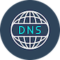

# IoBroker.dnscope


Этот адаптер использует сервис `Sentry.io` для автоматического сообщения мне, как разработчику, об исключениях, ошибках кода и новых схемах устройств. Подробнее см. ниже!

---

## Поддержка разработки адаптеров
**Если вам нравится DNScope, пожалуйста, рассмотрите возможность сделать пожертвование:**

[](https://paypal.me/mk1676)

---

## Описание
DNScope позволяет обновлять вашу учетную запись динамического DNS непосредственно в ioBroker.
Возможно обновить вашу учетную запись DNS текущим IP-адресом вашей среды без каких-либо обходных путей или дополнительного оборудования.

Вы можете установить интервал, с которым должна выполняться проверка и обновление.
Интервал по умолчанию составляет 10 минут.

В настоящее время поддерживаются следующие провайдеры DynDNS:

* IPv64
* DuckDNS
* NoIP
* Dynv6
* Обычай

При выборе `Custom` можно указать прямой URL-адрес обновления для интеграции с любым поставщиком, поддерживающим эту функцию.

В пользовательском URL-адресе можно использовать следующие заполнители, которые будут заменены текущим IP-адресом во время выполнения:

| Заполнитель | Описание |
|---|---|
| `{{ipv4}}` | Текущий публичный IPv4-адрес |
| `{{ip}}` | Текущий IP-адрес (IPv4 в обновлении до IPv4, IPv6 в обновлении до IPv6) |
| `{{ip}}` | Текущий IP-адрес (IPv4 в обновлении IPv4, IPv6 в обновлении IPv6) |

**Пример:**

```
https://dynupdate.example.com/update?hostname=myhome.example.com&myip={{ipv4}}&token=abc123
```

---

## Конфигурация адаптера
Для настройки адаптера необходимы ваши данные доступа к сервису DynDNS.
В зависимости от провайдера это может быть токен или имя пользователя/пароль.

Также необходимо ввести домен, который нужно обновить.

Если вам необходимо обновить несколько доменов, для каждого домена потребуется отдельный экземпляр.

--- <!-- ### **РАБОТА В ПРОЦЕССЕ** -->

## Changelog
### 0.3.0 (2026-08-20)
* (simatec) Adapter requires node.js >= 22 now
* (simatec) dependencies updated
* (simatec) Source code cleaned up
* (HJS72) Add detailed debug diagnostics for failed update requests (HTTP status, body, and headers)
* (HJS72) Ship compiled build output with the latest logging changes
* (HJS72) Fix HTTP 400 error when IP address could not be determined (skip update instead)
* (HJS72) Add debug log output for the full update request URL
* (HJS72) Add IP placeholder support for custom update URL (`{{ipv4}}`, `{{ipv6}}`, `{{ip}}`)

### 0.2.9 (2026-04-26)
* (simatec) dependencies updated
* (simatec) Source code cleaned up

### 0.2.8 (2026-03-29)
* (simatec) Fix License
* (simatec) dependencies updated

### 0.2.7 (2025-11-23)
* (simatec) dependencies updated

### 0.2.6 (2025-10-25)
* (simatec) dependencies updated
* (simatec) Fix npm publish

[Older changelogs can be found there](CHANGELOG_OLD.md)

## License
MIT License

Copyright (c) 2025 - 2026 simatec

Permission is hereby granted, free of charge, to any person obtaining a copy
of this software and associated documentation files (the "Software"), to deal
in the Software without restriction, including without limitation the rights
to use, copy, modify, merge, publish, distribute, sublicense, and/or sell
copies of the Software, and to permit persons to whom the Software is
furnished to do so, subject to the following conditions:

The above copyright notice and this permission notice shall be included in all
copies or substantial portions of the Software.

THE SOFTWARE IS PROVIDED "AS IS", WITHOUT WARRANTY OF ANY KIND, EXPRESS OR
IMPLIED, INCLUDING BUT NOT LIMITED TO THE WARRANTIES OF MERCHANTABILITY,
FITNESS FOR A PARTICULAR PURPOSE AND NONINFRINGEMENT. IN NO EVENT SHALL THE
AUTHORS OR COPYRIGHT HOLDERS BE LIABLE FOR ANY CLAIM, DAMAGES OR OTHER
LIABILITY, WHETHER IN AN ACTION OF CONTRACT, TORT OR OTHERWISE, ARISING FROM,
OUT OF OR IN CONNECTION WITH THE SOFTWARE OR THE USE OR OTHER DEALINGS IN THE
SOFTWARE.