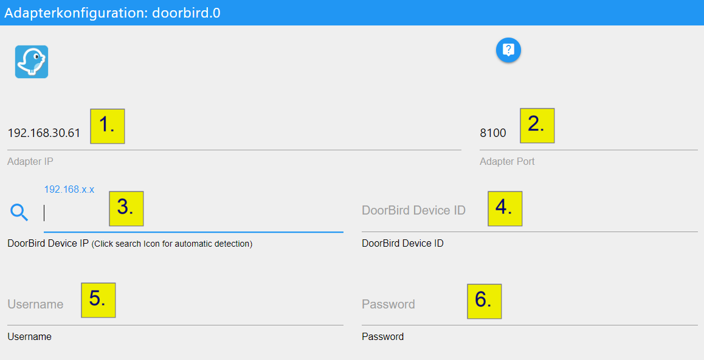

# ioBroker.doorbird

## Версии

## Что такое Doorbird?

DoorBird — это домофон, который выполняет функции как дверного звонка, так и системы безопасности. Устройство устанавливается снаружи дома, там, где обычно располагается дверной звонок, и включает в себя кнопку звонка и камеру над ней.

## Конфигурация

1. Введите IP-адрес, на котором адаптер должен прослушивать события от устройства Doorbird. (Обычно это IP-адрес вашего хоста ioBroker). Адаптер попытается автоматически заполнить это поле правильным IP-адресом. Если предварительно заполненный IP-адрес не совпадает с IP-адресом вашего хоста ioBroker, измените его на правильный.
2. Порт задан заранее.`8100` Вы можете изменить его, если порт уже используется другой службой. Просто попробуйте запустить адаптер с этим портом. Если порт недоступен, при запуске адаптера возникнет ошибка. Затем просто вернитесь сюда и измените порт.
3. Введите IP-адрес вашего устройства Doorbird. Вы можете нажать на значок поиска слева от поля ввода. После нажатия на значок в верхней части экрана настроек появится сообщение. Теперь у вас есть 60 секунд, чтобы нажать кнопку звонка на вашем устройстве Doorbird. Адаптер попытается определить IP-адрес и заполнить все поля за вас.
4. Идентификатор устройства (НЕ IP-адрес!) вашего Doorbird.
5. Имя пользователя, которому необходимы права **API-оператора** и права **постоянного наблюдения** за устройством Doorbird.
6. Пароль для имени пользователя, введенного в поле 5.



После ввода всей необходимой информации в диалоговое окно конфигурации нажмите «Сохранить и закрыть». Адаптер должен перезагрузиться, и вы готовы к работе!

## Доступ к снимкам состояния движения и дверного звонка.

Для получения текущего снимка используйте следующий URL-адрес:

```
http://<ioBroker-IP>:<Port>/files/doorbird.<instance>.Doorbell<number>_1.jpg
http://<ioBroker-IP>:<Port>/files/doorbird.<instance>.Motion_1.jpg
```

или (если Redis не используется)

```
/opt/iobroker/iobroker-data/files/doorbird.<instance>/Doorbell<number>_1.jpg
```

#### Пример:

`http://192.168.0.2:8081/files/doorbird.0/Doorbell1_1.jpg`

### Отправьте снимок через Telegram.

#### Пример

js-controller 5 необходим

```js
setState('doorbird.0.TakeSnapshot', true);
onFile('doorbird.0', 'TakeSnapshot_1.jpg', true, (id, fileName, size, fileData, mimeType) => {
    sendTo('telegram.0', {
        text: fileData,
        type: 'photo'
    });
});
```

## Совместимые устройства

| Устройство                                  | Аппаратная версия | Версия прошивки |
| ------------------------------------------- | ----------------- | --------------- |
| Видеодомофон DoorBird D10x                  | 1.00 и выше       | 000099 и выше   |
| Видеодомофон DoorBird D20x                  | 1.00 и выше       | 000099 и выше   |
| Видеодомофон DoorBird D21x                  | 1.00 и выше       | 000108 и выше   |
| BirdGuard B10x                              | 1.00 и выше       | 000099 и выше   |
| Видеодомофон DoorBird D11x                  | 1.00 и выше       | 000130 и выше   |
| Миниатюрная купольная камера DoorBird A1131 | 1.00 и выше       | 000148 и выше   |

## Changelog

<!--
    Placeholder for the next version (at the beginning of the line):
    ### **WORK IN PROGRESS**
-->
### **WORK IN PROGRESS**
- (copilot) Adapter requires node.js >= 22 now

### 3.1.0 (2026-02-24)
- (copilot) **CI/CD**: Migrated to ESLint 9 with @iobroker/eslint-config standard configuration
- (copilot) Adapter requires admin >= 7.7.22 now
- (copilot) Adapter requires js-controller >= 6.0.11 now

### 3.0.0 (2025-03-03)

NodeJS >= 20.x and js-controller >= 6 is required

- (@klein0r) Migrated to json config
- (@klein0r) Updated documentation and dependencies

### 2.0.0 (2024-09-02)

- (Schmakus) update dependencies

### 1.7.0 (2024-08-23)

- (Schmakus) Dependencies have been updated

### 1.6.0 (2024-07-02)

- (mcm1957) Adapter requires node.js >= 18 and Admin >=6 now
- (mcm1957) Dependencies have been updated

[Older changelogs can be found there](https://github.com/iobroker-community-adapters/ioBroker.doorbird/blob/master/CHANGELOG_OLD.md)

## License

The MIT License (MIT)

Copyright (c) 2025-2026 iobroker-community-adapters <>

Permission is hereby granted, free of charge, to any person obtaining a copy
of this software and associated documentation files (the "Software"), to deal
in the Software without restriction, including without limitation the rights
to use, copy, modify, merge, publish, distribute, sublicense, and/or sell
copies of the Software, and to permit persons to whom the Software is
furnished to do so, subject to the following conditions:

The above copyright notice and this permission notice shall be included in
all copies or substantial portions of the Software.

THE SOFTWARE IS PROVIDED "AS IS", WITHOUT WARRANTY OF ANY KIND, EXPRESS OR
IMPLIED, INCLUDING BUT NOT LIMITED TO THE WARRANTIES OF MERCHANTABILITY,
FITNESS FOR A PARTICULAR PURPOSE AND NONINFRINGEMENT. IN NO EVENT SHALL THE
AUTHORS OR COPYRIGHT HOLDERS BE LIABLE FOR ANY CLAIM, DAMAGES OR OTHER
LIABILITY, WHETHER IN AN ACTION OF CONTRACT, TORT OR OTHERWISE, ARISING FROM,
OUT OF OR IN CONNECTION WITH THE SOFTWARE OR THE USE OR OTHER DEALINGS IN
THE SOFTWARE.