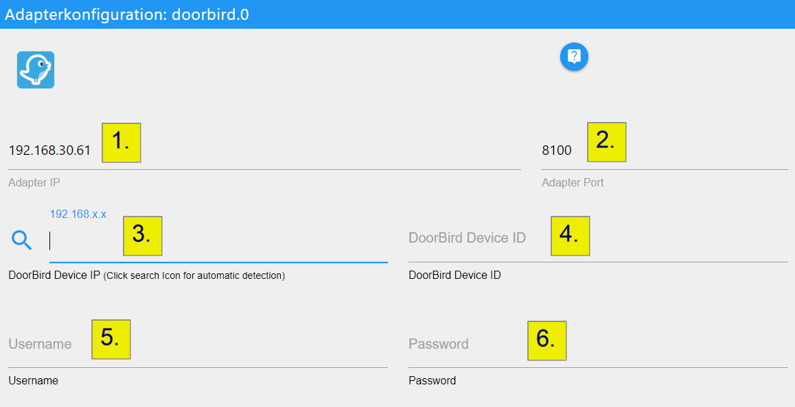

# IoBroker.doorbird


## Версии
## Что такое Doorbird?
DoorBird — это дверной домофон, который выполняет функции как дверного звонка, так и системы безопасности. Изделие устанавливается снаружи дома, где обычно находится дверной звонок, и имеет кнопку дверного звонка с камерой над ней.

## Конфигурация
1. Введите IP-адрес, на котором адаптер должен прослушивать события от устройства Doorbird.

(Обычно это IP вашего хоста ioBroker).
Адаптер пытается предварительно заполнить поле правильным IP-адресом для вас. Если предварительно заполненный IP-адрес не является IP-адресом вашего хоста ioBroker, пожалуйста, измените его на правильный IP-адрес.

2. Порт предопределен как `8100`. Вы можете изменить его, если порт уже используется другой службой.

Просто попробуйте запустить адаптер с этим портом. Если порт недоступен, вы получите ошибку при запуске адаптера. Затем просто вернитесь сюда и измените порт.

3. Введите IP вашего устройства Doorbird. Вы можете нажать на значок «поиск» слева от поля ввода. После нажатия на значок в верхней части экрана конфигурации появится сообщение. Теперь у вас есть 60 секунд, чтобы нажать кнопку звонка на вашем устройстве Doorbird. Адаптер пытается определить IP и заполнить все поля для вас.
4. Идентификатор устройства (НЕ IP!) вашего Doorbird.
5. Имя пользователя, которому необходимо иметь разрешения **API-Operator** и **Watch always** на устройстве Doorbird.
6. Пароль для имени пользователя, введенного в поле 5.



После того, как вы ввели всю необходимую информацию в диалоговое окно конфигурации, нажмите «Сохранить и закрыть». Адаптер должен перезапуститься, и вы готовы к работе!

## Доступ к снимкам движения и дверного звонка
Для получения текущего снимка используйте следующий URL:

```
http://<ioBroker-IP>:<Port>/files/doorbird.<instance>.Doorbell<number>_1.jpg
http://<ioBroker-IP>:<Port>/files/doorbird.<instance>.Motion_1.jpg
```

или (когда Redis не используется)

```
/opt/iobroker/iobroker-data/files/doorbird.<instance>/Doorbell<number>_1.jpg
```

#### Пример:
`http://192.168.0.2:8081/files/doorbird.0/Doorbell1_1.jpg`

### Отправить снимок через Telegram
#### Пример
необходим js-controller 5

```js
setState('doorbird.0.TakeSnapshot', true);
onFile('doorbird.0', 'TakeSnapshot_1.jpg', true, (id, fileName, size, fileData, mimeType) => {
    sendTo('telegram.0', {
        text: fileData,
        type: 'photo'
    });
});
```

## Совместимые устройства
| Устройство | Версия оборудования | Версия прошивки |
| -------------------------------- | ---------------- | ---------------- |
| Видеодомофон DoorBird D10x | 1.00 и выше | 000099 и выше |
| Видеодомофон DoorBird D20x | 1.00 и выше | 000099 и выше |
| Видеодомофон DoorBird D21x | 1.00 и выше | 000108 и выше |
| BirdGuard B10x | 1.00 и выше | 000099 и выше |
| Видеодомофон DoorBird D11x | 1.00 и выше | 000130 и выше |
| Мини-купольная камера DoorBird A1131 | 1.00 и выше | 000148 и выше |

## Changelog

<!--
    Placeholder for the next version (at the beginning of the line):
    ### **WORK IN PROGRESS**
-->
### 3.0.0 (2025-03-03)

NodeJS >= 20.x and js-controller >= 6 is required

- (@klein0r) Migrated to json config
- (@klein0r) Updated documentation and dependencies

### 2.0.0 (2024-09-02)

- (Schmakus) update dependencies

### 1.7.0 (2024-08-23)

- (Schmakus) Dependencies have been updated

### 1.6.0 (2024-07-02)

- (mcm1957) Adapter requires node.js >= 18 and Admin >=6 now
- (mcm1957) Dependencies have been updated

### 1.5.0 (2024-03-01)

- (Schmakus) update dependencies

## License

The MIT License (MIT)

Copyright (c) 2025 iobroker-community-adapters <>

Permission is hereby granted, free of charge, to any person obtaining a copy
of this software and associated documentation files (the "Software"), to deal
in the Software without restriction, including without limitation the rights
to use, copy, modify, merge, publish, distribute, sublicense, and/or sell
copies of the Software, and to permit persons to whom the Software is
furnished to do so, subject to the following conditions:

The above copyright notice and this permission notice shall be included in
all copies or substantial portions of the Software.

THE SOFTWARE IS PROVIDED "AS IS", WITHOUT WARRANTY OF ANY KIND, EXPRESS OR
IMPLIED, INCLUDING BUT NOT LIMITED TO THE WARRANTIES OF MERCHANTABILITY,
FITNESS FOR A PARTICULAR PURPOSE AND NONINFRINGEMENT. IN NO EVENT SHALL THE
AUTHORS OR COPYRIGHT HOLDERS BE LIABLE FOR ANY CLAIM, DAMAGES OR OTHER
LIABILITY, WHETHER IN AN ACTION OF CONTRACT, TORT OR OTHERWISE, ARISING FROM,
OUT OF OR IN CONNECTION WITH THE SOFTWARE OR THE USE OR OTHER DEALINGS IN
THE SOFTWARE.