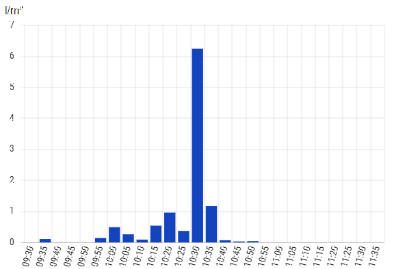
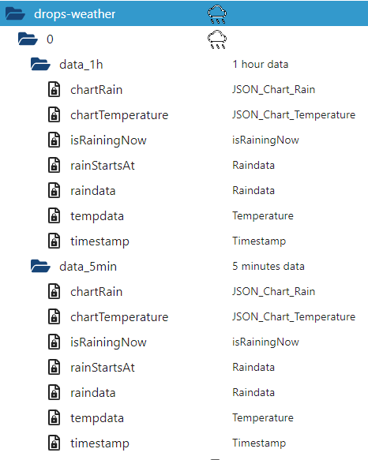
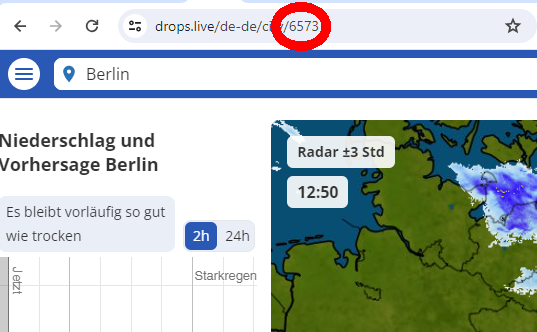

# ioBroker.drops-weather

## адаптер drops-weather для ioBroker

Этот адаптер предоставляет данные об осадках с [сайта https://www.drops.live.](https://www.drops.live)

## Функции

Этот адаптер считывает данные об осадках с веб-сайта с интервалом в 5 минут. Имеется точка данных для построения графика, которую можно напрямую использовать виджетом BarChart из раздела Material Design.

Данные за 5 минут и 1 час хранятся в разных состояниях.

## Конфигурация

Данные GPS-позиционирования больше не доступны на сайте drops.live.

Вам необходимо знать код города, в котором вы находитесь. Чтобы получить этот код, просто введите название вашего города (или укажите ваше местоположение) на [сайте https://www.drops.live](https://www.drops.live) .

Код вашего города вы найдете в URL-адресе:

В этом примере вы найдете число 6573 для Берлина.

## Примечание для пользователей архитектуры ARM (например, Raspberry Pi):

Этот адаптер пытается установить пакет 'chromium-browser' на архитектуре Linux/ARM. Это необходимо, поскольку стандартная установка Puppeteer не предоставляет работающий безголовый браузер на этой архитектуре. Если установка не удастся, можно установить любой совместимый браузер и указать путь к нему в конфигурации экземпляра.

## Кредиты

Создание этого адаптера было бы невозможно без замечательной работы @inbux ( <https://github.com/inbux> ), который создал предварительные версии этого адаптера (до V1.xx).

## Changelog

<!--
	Placeholder for the next version (at the beginning of the line):
	### **WORK IN PROGRESS**
-->
### **WORK IN PROGRESS**
- (copilot) Adapter requires node.js >= 22 now

### 1.3.0 (2026-03-03)
- (copilot) Adapter requires admin >= 7.7.22 now
- (mcm1957) Dependencies have been updated

### 1.2.10 (2025-12-23)
- (arteck) Dependencies have been updated

### 1.2.9 (2025-10-23)
- (arteck) skip download chrome if installed

### 1.2.8 (2025-10-23)
- (arteck) Dependencies have been updated

### 1.2.7 (2025-07-11)
- (arteck) fix adapter stop after wrong request

[Older changelogs can be found there](https://github.com/iobroker-community-adapters/ioBroker.drops-weather/blob/main/CHANGELOG_OLD.md)

## License

MIT License

Copyright (c) 2025-2026 iobroker-community-adapters <iobroker-community-adapters@gmx.de>  
Copyright (c) 2024 inbux <inbux.development@gmail.com>

Permission is hereby granted, free of charge, to any person obtaining a copy
of this software and associated documentation files (the "Software"), to deal
in the Software without restriction, including without limitation the rights
to use, copy, modify, merge, publish, distribute, sublicense, and/or sell
copies of the Software, and to permit persons to whom the Software is
furnished to do so, subject to the following conditions:

The above copyright notice and this permission notice shall be included in all
copies or substantial portions of the Software.

THE SOFTWARE IS PROVIDED "AS IS", WITHOUT WARRANTY OF ANY KIND, EXPRESS OR
IMPLIED, INCLUDING BUT NOT LIMITED TO THE WARRANTIES OF MERCHANTABILITY,
FITNESS FOR A PARTICULAR PURPOSE AND NONINFRINGEMENT. IN NO EVENT SHALL THE
AUTHORS OR COPYRIGHT HOLDERS BE LIABLE FOR ANY CLAIM, DAMAGES OR OTHER
LIABILITY, WHETHER IN AN ACTION OF CONTRACT, TORT OR OTHERWISE, ARISING FROM,
OUT OF OR IN CONNECTION WITH THE SOFTWARE OR THE USE OR OTHER DEALINGS IN THE
SOFTWARE.