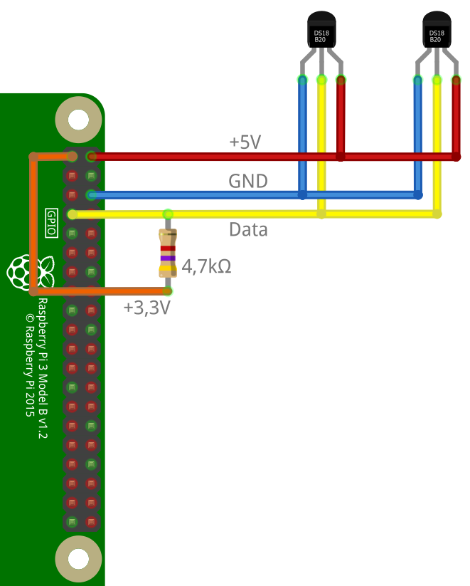

# IoBroker.ds18b20
Адаптер `ds18b20` позволяет напрямую интегрировать датчики температуры 1-Wire типа DS18B20 или аналогичные в ioBroker.

Требуется соответствующее оборудование с поддержкой шины 1-Wire (например, Raspberry Pi), и шина 1-Wire должна быть настроена для работы в системе (датчики перечислены в `/sys/bus/w1/devices/`).

Пример подключения датчиков DS18B20 к Raspberry Pi можно найти ниже.

## Функции
* Чтение текущего значения температуры
* Автоматическое определение подключенных датчиков
* Обнаружение ошибок при опросе датчиков (контрольная сумма, ошибка связи, отключение устройства)
* Интервал опроса для каждого датчика регулируется
* Отдельные датчики можно отключить
* Регулируемое округление и преобразование измеренного значения для каждого датчика
* Поддержка датчиков на удаленных системах через _Remote Client_

## Монтаж
Адаптер доступен из стабильного и последнего репозитория.

Последнюю разрабатываемую версию также можно установить с помощью URL-адреса GitHub `https://github.com/crycode-de/ioBroker.ds18b20.git`.
Однако это рекомендуется только в самых редких случаях!

## Конфигурация
В конфигурации адаптера **интервал опроса по умолчанию** может быть установлен в миллисекундах для всех датчиков. Минимум 500.

Кроме того, при необходимости можно изменить **путь устройств 1-Wire**.
Стандарт здесь — `/sys/bus/w1/devices`, что означает, что найдены датчики всех существующих мастеров шины.
В качестве альтернативы можно указать прямой путь к ведущему устройству шины, например, `/sys/bus/w1/devices/w1_bus_master1`, при этом будут найдены только датчики этого ведущего устройства шины.


Отдельные датчики можно добавить в таблицу вручную или с помощью **Поиска датчиков**.


**Адрес** — это адрес/идентификатор датчика 1-Wire, который одновременно определяет идентификатор объекта.
Например, датчик с адресом `28-0000077ba131` получает идентификатор объекта `ds18b20.0.sensors.28-0000077ba131`.

**Идентификатор удаленной системы** не задан (пустой) для непосредственно подключенных датчиков и идентификатор соответствующей системы для датчиков в удаленной системе.

**Имя** может быть свободно выбрано для идентификации датчика.

Для каждого датчика можно указать дополнительный **интервал запроса** в миллисекундах.
Если поле оставить пустым, применяется стандартный интервал опроса. Минимум 500.

**unit** определяет единицу измерения, хранящуюся в объекте ioBroker для значения.
По умолчанию это `°C`.

Через **Коэффициент** и **Смещение** можно адаптировать значение, считываемое датчиком, в соответствии с формулой `Wert = (Wert * Faktor) + Offset`.

**Десятичные разряды** указывают, до скольких знаков после запятой округляется значение.
Округление происходит после расчета с коэффициентом и смещением.

**Ноль при ошибке** определяет, как поступать с ошибками при считывании показаний датчика.
Если опция установлена, значения `null` записываются в состояние датчика в случае ошибок.
Без этой опции состояние не обновляется в случае ошибок.

Отдельные датчики можно деактивировать отдельно с помощью галочки **Активировано**.

Для интеграции датчиков в удаленную систему также можно активировать и настроить встроенный для этой цели сервер.


Ключ шифрования должен быть передан всем удаленным системам. Это шифрует связь между сервером и клиентами.

### Преобразование из `°C` в `°F`
Чтобы измеренные температуры возвращались адаптером в `°F`, `1.8` необходимо использовать в качестве коэффициента, а `32` — в качестве смещения.

## Действия
Путем записи в состояние `ds18b20.0.actions.readNow` можно инициировать немедленное считывание всех или определенного датчика.

Чтобы вызвать немедленное считывание всех датчиков, ключевое слово `all` должно быть записано в состоянии.

Если нужно прочитать только конкретный датчик, адрес или идентификатор объекта ioBroker датчика должен быть записан в состояние.

## Использование в скриптах
Адаптеру можно отправлять команды на считывание данных датчиков или на поиск датчиков.

### `read` / `readNow`
С помощью команды `read` или `readNow` можно считать все датчики или один датчик.

Если запрашиваются все датчики, ответ содержит объект с адресами датчиков для текущих значений.

Чтобы прочитать один датчик, адрес или идентификатор объекта ioBroker датчика, который нужно прочитать, должен быть указан как часть сообщения.
В этом случае значение возвращается напрямую.

```js
sendTo('ds18b20.0', 'read', null, (ret) => {
    log('ret: ' + JSON.stringify(ret));
    // ret: {"err":null,"value":{"28-0000077b9fea":21.94}}

    if (ret.err) {
        log(ret.err, 'warn');
    }
});

sendTo('ds18b20.0', 'read', '28-0000077ba131', (ret) => {
    log('ret: ' + JSON.stringify(ret));
    // ret: {"err":null,"value":21.94}

    if (ret.err) {
        log(ret.err, 'warn');
    }
});
```

### `search`
Команда `search` выполняет поиск подключенных в данный момент датчиков 1-Wire и возвращает адреса датчиков, найденных с помощью функции обратного вызова.

```js
sendTo('ds18b20.0', 'search', {}, (ret) => {
    log('ret: ' + JSON.stringify(ret));
    if (ret.err) {
        log(ret.err, 'warn');
    } else {
        for (let s of ret.sensors) {
            if (s.remoteSystemId) {
                log('Sensor: ' + s.address + '@' + s.remoteSystemId);
            } else {
                log('Sensor: ' + s.address);
            }
        }
    }
});
```

### `getRemoteSystems`
Системные идентификаторы подключенных в данный момент удаленных систем можно запросить через `getRemoteSystems`.

```js
sendTo('ds18b20.0', 'getRemoteSystems', {}, (ret) => {
    log('ret: ' + JSON.stringify(ret));
    log('Verbundene Systeme: ' + ret.join(', '));
});
```

## Информация об адаптере
Каждый экземпляр адаптера через состояние `ds18b20.*.info.connection` предоставляет информацию о том, все ли сконфигурированные датчики передают данные.
Если последнее считывание со всех датчиков было успешным, это состояние будет `true`.
Как только один из датчиков показывает ошибку, это состояние `false`.
Это состояние также будет `false`, если удаленные датчики включены и есть проблема с удаленным сервером.

Если удаленные системы активированы, список подключенных в данный момент удаленных систем можно найти в состоянии `ds18b20.*.info.remotesConnected`.

## DS18B20 на Raspberry Pi
Датчики температуры DS18B20 подключены к Raspberry Pi, как показано на рисунке ниже.
Важно отметить, что подтягивающий резистор должен быть подключен к +3,3 В, а не к +5 В, так как это может повредить GPIO.
В этом примере используется GPIO.04 (BCM).



Чтобы активировать шину 1-Wire на Raspberry Pi, необходимо добавить следующую строку в файл `/boot/config.txt`, а затем перезапустить Raspberry Pi.

```text
dtoverlay=w1-gpio,gpiopin=4
```

Если все работает, подключенные датчики отображаются в разделе `/sys/bus/w1/devices/`.

```sh
$ ls -l /sys/bus/w1/devices/
insgesamt 0
lrwxrwxrwx 1 root root 0 Nov  2 11:18 28-0000077b4592 -> ../../../devices/w1_bus_master1/28-0000077b4592
lrwxrwxrwx 1 root root 0 Nov  2 11:18 28-0000077b9fea -> ../../../devices/w1_bus_master1/28-0000077b9fea
lrwxrwxrwx 1 root root 0 Nov  2 10:49 w1_bus_master1 -> ../../../devices/w1_bus_master1
```

### Использование множества датчиков на Raspberry Pi
Количество датчиков, которые могут безошибочно работать на Raspberry Pi на одной линии, ограничено и зависит от некоторых технических условий (например, длины кабеля).
Первые, иногда случайные, отказы обычно происходят примерно из 10 датчиков.

Чтобы иметь возможность работать с большим количеством датчиков, их можно разделить на несколько потоков (т. е. несколько GPIO).
Затем для каждой нити требуется свой собственный подтягивающий резистор.

Чтобы активировать его, просто добавьте несколько записей с соответствующим номером GPIO в файл `/boot/config.txt`:

```text
dtoverlay=w1-gpio,gpiopin=4
dtoverlay=w1-gpio,gpiopin=17
```

Затем каждая запись генерирует в системе собственный `w1_bus_masterX`.

### Ошибка ядра при отрицательных температурах
В ядре 5.10.y Raspberry Pi была ошибка с середины ноября 2020 года, которая, например, считывала отрицательную температуру как 4092 °C. (см. [Проблема с GitHub](https://github.com/raspberrypi/linux/issues/4124)) Эта ошибка была исправлена в ядре 5.10.14 08.02.2021. (см. [GitHub коммит](https://github.com/Hexxeh/rpi-firmware/commit/115e3a5f77488d9ee30a33bcb5ac31eb587f60a8)) Проблему должен решить `rpi-update`.

С версиями адаптера до v1.2.2 включительно эти заведомо некорректные значения передаются в состояние ioBroker.
Начиная с версии 1.2.3, адаптер также проверяет достоверность считанного значения (от -80 до +150 °C) и отбрасывает неправдоподобные значения.

## Интеграция датчиков в удаленную систему
Начиная с версии 1.4.0 _ioBroker.ds18b20_ датчики в удаленных системах можно интегрировать напрямую через ваш собственный удаленный клиент _ioBroker.ds18b20_. Для этого требуется только Node.js в удаленной системе.

**Включить удаленные датчики** необходимо отметить в конфигурации адаптера. Затем адаптер запускает TCP-сервер на указанном порту и принимает подключения от клиентов.

Соединение между сервером и клиентом шифруется с использованием алгоритма `aes-256-cbc`.
Для этого ключ шифрования, отображаемый в конфигурации адаптера, должен быть установлен на клиентах.

Затем удаленный клиент _ioBroker.ds18b20_ устанавливает TCP-соединение с адаптером и отображается в конфигурации адаптера в разделе **Подключенные удаленные системы**.

### Установка удаленного клиента ioBroker.ds18b20
Настройка удаленного клиента _ioBroker.ds18b20_ предоставляется через GitHub.

Инструкции по установке см. в конфигурации адаптера.

## Changelog

<!--
    Placeholder for the next version (at the beginning of the line):
    ### **WORK IN PROGRESS**
-->
### 2.0.2 (2023-07-23)

* (crycode-de) Fixed bug on sensor migration
* (crycode-de) 💥 Need to set a new remote encryption key in admin if remote sensors are used

### 2.0.1 (2023-07-19)

* (crycode-de) Fixed config migration
* (crycode-de) Added warning message for upgrades

### 2.0.0 (2023-07-19)

* (crycode-de) 💥 Node.js 16.4+, js-controller 4+ and admin 6+ are required
* (crycode-de) New Admin UI using JsonConfig
* (crycode-de) 💥 `read` and `readNow` actions are now merged
* (crycode-de) New state `info.remotesConnected` with a list of connected remote systems (if enabled)
* (crycode-de) Added icons for the sensor status to the sensor objects
* (crycode-de) Label objects of disabled sensors
* (crycode-de) Delete objects of unconfigured/deleted sensors
* (crycode-de) Updated translations
* (crycode-de) Code optimizations and upgrades to current standards
* (crycode-de) Updated dependencies

### 1.6.1 (2022-12-15)

* (crycode-de) Remote client setup url displayed in admin UI fixed

### 1.6.0 (2022-01-29)

* (crycode-de) Added sorting of sensors in admin and keep the sort order
* (crycode-de) Allow usage of w1_bus_masterX directly as w1DevicesPath
* (crycode-de) Fixed display of errors in admin

## License

Copyright (c) 2019-2023 Peter Müller <peter@crycode.de>

### MIT License

Permission is hereby granted, free of charge, to any person obtaining
a copy of this software and associated documentation files (the
"Software"), to deal in the Software without restriction, including
without limitation the rights to use, copy, modify, merge, publish,
distribute, sublicense, and/or sell copies of the Software, and to
permit persons to whom the Software is furnished to do so, subject to
the following conditions:

The above copyright notice and this permission notice shall be
included in all copies or substantial portions of the Software.

THE SOFTWARE IS PROVIDED "AS IS", WITHOUT WARRANTY OF ANY KIND,
EXPRESS OR IMPLIED, INCLUDING BUT NOT LIMITED TO THE WARRANTIES OF
MERCHANTABILITY, FITNESS FOR A PARTICULAR PURPOSE AND
NONINFRINGEMENT. IN NO EVENT SHALL THE AUTHORS OR COPYRIGHT HOLDERS BE
LIABLE FOR ANY CLAIM, DAMAGES OR OTHER LIABILITY, WHETHER IN AN ACTION
OF CONTRACT, TORT OR OTHERWISE, ARISING FROM, OUT OF OR IN CONNECTION
WITH THE SOFTWARE OR THE USE OR OTHER DEALINGS IN THE SOFTWARE.