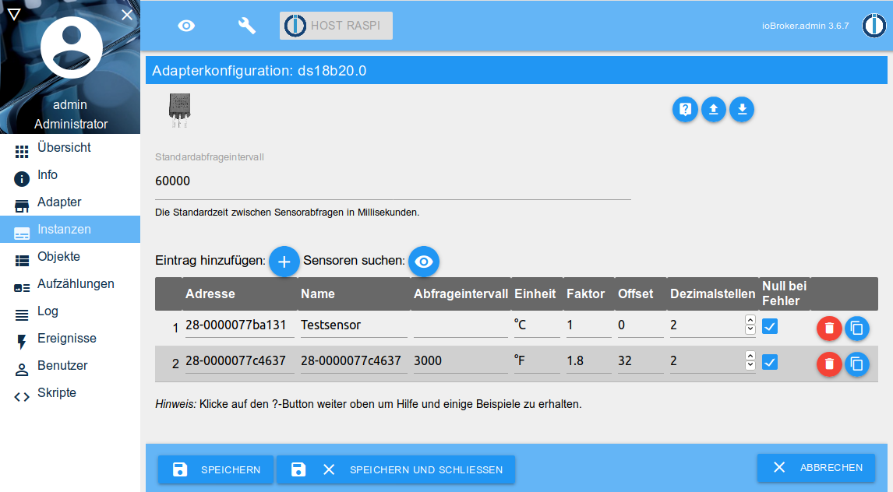

# IoBroker.ds18b20
Адаптер `ds18b20` позволяет напрямую интегрировать датчики температуры 1-Wire типа DS18B20 в ioBroker.

Требуется соответствующее оборудование с поддержкой шины 1-Wire (например, Raspberry Pi), и шина 1-Wire должна быть настроена для работы в системе (датчики перечислены в `/sys/bus/w1/devices/`).

Пример подключения датчиков DS18B20 к Raspberry Pi можно найти ниже.

## Особенности
* Чтение текущего значения температуры
* Автоматическое определение подключенных датчиков
* Обнаружение ошибок при опросе датчиков (контрольная сумма, ошибка связи, отключение устройства)
* Интервал опроса для каждого датчика регулируется
* Отдельные датчики можно отключить
* Регулируемое округление и преобразование измеренного значения для каждого датчика
* Поддержка датчиков на удаленных системах через _Remote Client_

## Установка
Адаптер доступен из стабильного и последнего репозитория.

Последнюю разрабатываемую версию также можно установить с помощью URL-адреса GitHub `https://github.com/crycode-de/ioBroker.ds18b20.git`.
Однако это рекомендуется только в самых редких случаях!

## Конфигурация
В конфигурации адаптера **интервал опроса по умолчанию** может быть установлен в миллисекундах для всех датчиков. Минимум 500.

Кроме того, при необходимости можно изменить **путь устройств 1-Wire**.
Стандарт здесь — `/sys/bus/w1/devices`, что означает, что найдены датчики всех существующих мастеров шины.
В качестве альтернативы можно указать прямой путь к мастеру шины, например, `/sys/bus/w1/devices/w1_bus_master1`, при этом будут найдены только датчики этого мастера шины.

Для интеграции датчиков в удаленную систему также можно активировать и настроить встроенный для этой цели сервер.

Отдельные датчики можно добавить в таблицу вручную или через **Поиск датчиков**.



**Адрес** является адресом/идентификатором датчика 1-Wire и в то же время определяет идентификатор объекта.
Например, датчик с адресом `28-0000077ba131` получает идентификатор объекта `ds18b20.0.sensors.28-0000077ba131`.

**Идентификатор удаленной системы** не установлен (пусто) для датчиков, подключенных напрямую, и идентификатор соответствующей удаленной системы для датчиков в удаленной системе.

**Имя** может быть свободно выбрано для идентификации датчика.

Для каждого датчика можно указать дополнительный **интервал запроса** в миллисекундах.
Если поле оставить пустым, применяется стандартный интервал опроса.
Минимум 500.

**unit** определяет единицу, хранящуюся в объекте ioBroker для значения.
По умолчанию это `°C`.

Через **Коэффициент** и **Смещение** можно адаптировать значение, считываемое датчиком, в соответствии с формулой `Wert = (Wert * Faktor) + Offset`.

**десятичные разряды** указывают, до скольких знаков после запятой округляется значение.
Округление происходит после расчета с коэффициентом и смещением.

**Ноль при ошибке** определяет, как поступать с ошибками при считывании показаний датчика.
Если опция установлена, значения `null` записываются в состояние датчика в случае ошибок.
Без этой опции состояние не обновляется в случае ошибок.

Отдельные датчики можно деактивировать отдельно с помощью галочки **Активировано**.

### Преобразование из `°C` в `°F`
Чтобы измеренные температуры возвращались адаптером в `°F`, `1.8` необходимо использовать в качестве коэффициента, а `32` — в качестве смещения.

## Действия
Путем записи в состояние `ds18b20.0.actions.readNow` можно инициировать немедленное считывание всех или определенного датчика.

Чтобы вызвать немедленное считывание всех датчиков, ключевое слово `all` должно быть записано в состоянии.

Если нужно прочитать только конкретный датчик, адрес или идентификатор объекта ioBroker датчика должен быть записан в состояние.

## Использование в скриптах
Адаптеру можно отправлять команды на считывание данных датчика или на поиск датчиков.

### `readNow`
Команда `readNow` инициирует немедленный опрос всех или определенного датчика.
Чтобы запросить все датчики, часть сообщения можно оставить пустой или можно использовать строку `all`.
Чтобы прочитать конкретный датчик, в части сообщения должен быть указан адрес датчика или идентификатор ioBroker.

Команда `readNow` не возвращает никаких данных. Это только запускает немедленное считывание датчиков.

```js
sendTo('ds18b20.0', 'readNow');
sendTo('ds18b20.0', 'readNow', '28-0000077ba131');
```

### `read`
С одного датчика можно считать команду `read`.
В части сообщения должен быть указан адрес или идентификатор объекта ioBroker датчика, который необходимо прочитать.
Прочитанное значение может быть дополнительно обработано с помощью функции обратного вызова.

```js
sendTo('ds18b20.0', 'read', '28-0000077ba131', (ret) => {
    log('ret: ' + JSON.stringify(ret));
    if (ret.err) {
        log(ret.err, 'warn');
    }
});
```

### `search`
Команда `search` выполняет поиск подключенных в данный момент датчиков 1-Wire и возвращает адреса датчиков, найденных с помощью функции обратного вызова.

```js
sendTo('ds18b20.0', 'search', {}, (ret) => {
    log('ret: ' + JSON.stringify(ret));
    if (ret.err) {
        log(ret.err, 'warn');
    } else {
        for (let s of ret.sensors) {
            if (s.remoteSystemId) {
                log('Sensor: ' + s.address + '@' + s.remoteSystemId);
            } else {
                log('Sensor: ' + s.address);
            }
        }
    }
});
```

### `getRemoteSystems`
Системные идентификаторы подключенных в данный момент удаленных систем можно запросить через `getRemoteSystems`.

```js
sendTo('ds18b20.0', 'getRemoteSystems', {}, (ret) => {
    log('ret: ' + JSON.stringify(ret));
    log('Verbundene Systeme: ' + ret.join(', '));
});
```

## Информация об адаптере
Каждый экземпляр адаптера через состояние `ds18b20.*.info.connection` предоставляет информацию о том, все ли сконфигурированные датчики передают данные.
Если последнее считывание со всех датчиков было успешным, это состояние будет `true`.
Как только один из датчиков показывает ошибку, это состояние `false`.

## DS18B20 на Raspberry Pi
Датчики температуры DS18B20 подключены к Raspberry Pi, как показано на рисунке ниже.
Важно отметить, что подтягивающий резистор должен быть подключен к +3,3 В, а не к +5 В, так как это может повредить GPIO.
В этом примере используется GPIO.04 (BCM).


Чтобы активировать шину 1-Wire на Raspberry Pi, необходимо добавить следующую строку в файл `/boot/config.txt`, а затем перезапустить Raspberry Pi.

```
dtoverlay=w1-gpio,gpiopin=4
```

Если все работает, подключенные датчики отображаются в разделе `/sys/bus/w1/devices/`.

```
$ ls -l /sys/bus/w1/devices/
insgesamt 0
lrwxrwxrwx 1 root root 0 Nov  2 11:18 28-0000077b4592 -> ../../../devices/w1_bus_master1/28-0000077b4592
lrwxrwxrwx 1 root root 0 Nov  2 11:18 28-0000077b9fea -> ../../../devices/w1_bus_master1/28-0000077b9fea
lrwxrwxrwx 1 root root 0 Nov  2 10:49 w1_bus_master1 -> ../../../devices/w1_bus_master1
```

### Использование множества датчиков на Raspberry Pi
Количество датчиков, которые могут безошибочно работать на Raspberry Pi на одной линии, ограничено и зависит от некоторых технических условий (например, длины кабеля).
Первые, иногда случайные, отказы обычно возникают примерно на 10 датчиках.

Чтобы иметь возможность работать с большим количеством датчиков, их можно разделить на несколько линий (т.е. несколько GPIO).
Затем для каждой нити требуется свой собственный подтягивающий резистор.

Чтобы активировать его, просто добавьте несколько записей с соответствующим номером GPIO в файл `/boot/config.txt`:

```
dtoverlay=w1-gpio,gpiopin=4
dtoverlay=w1-gpio,gpiopin=17
```

Затем каждая запись создает в системе собственный `w1_bus_masterX`.

### Ошибка ядра при отрицательных температурах
В ядре 5.10.y Raspberry Pi была ошибка с середины ноября 2020 года, из-за которой, например, отрицательные температуры считывались как 4092 °C. (см. [Проблема с GitHub](https://github.com/raspberrypi/linux/issues/4124)) Эта ошибка была исправлена в ядре 5.10.14 08.02.2021. (см. [GitHub коммит](https://github.com/Hexxeh/rpi-firmware/commit/115e3a5f77488d9ee30a33bcb5ac31eb587f60a8)) `rpi-update` должен решить проблему.

С версиями адаптера до v1.2.2 включительно эти заведомо некорректные значения передаются в состояние ioBroker.
Начиная с версии 1.2.3, адаптер также проверяет достоверность считанного значения (от -80 до +150 °C) и отбрасывает неправдоподобные значения.

## Интеграция датчиков в удаленную систему
Начиная с версии 1.4.0 _ioBroker.ds18b20_ датчики в удаленных системах можно интегрировать напрямую через ваш собственный удаленный клиент _ioBroker.ds18b20_. Для этого требуется только Node.js в удаленной системе.

**Включить удаленные датчики** необходимо отметить в конфигурации адаптера. Затем адаптер запускает TCP-сервер на указанном порту и принимает подключения от клиентов.

Соединение между сервером и клиентом шифруется с использованием алгоритма `aes-256-cbc`.
Для этого ключ шифрования, отображаемый в конфигурации адаптера, должен быть установлен на клиентах.

Затем удаленный клиент _ioBroker.ds18b20_ устанавливает TCP-соединение с адаптером и отображается в конфигурации адаптера в разделе **Подключенные удаленные системы**.

### Установка удаленного клиента ioBroker.ds18b20
Настройка удаленного клиента _ioBroker.ds18b20_ осуществляется через адаптер.

Инструкции по установке см. в конфигурации адаптера.

## Changelog

### 1.6.0 (2022-01-29)
* (crycode-de) Added sorting of sensors in admin and keep the sort order
* (crycode-de) Allow usage of w1_bus_masterX directly as w1DevicesPath
* (crycode-de) Fixed display of errors in admin
### 1.5.4 (2022-01-06)
* (crycode-de) Catch errors while sending request to remote client (IOBROKER-DS18B20-C)

### 1.5.3 (2021-12-28)
* (crycode-de) Increased remote client protocol version to inform users that they should update their remote clients

### 1.5.2 (2021-12-19)
* (ghecker1) Fix remote client reconnect after multiple failed attempts
  * **Reinstall of remote client needed to apply this fix!**

### 1.5.1 (2021-12-12)
* (crycode-de) Fix crash on undefined obj.native
* (crycode-de) Updated remote-client-setup info in admin if https is used

### 1.5.0 (2021-12-11)
* (crycode-de) Add setting to disable specific sensors

### 1.4.2 (2021-11-22)
* (crycode-de) Added some instructions for installing remote client in admin

### 1.4.1 (2021-04-20)
* (crycode-de) Fixed bug if multiple remote sensors are used

### 1.4.0 (2021-02-21)
* (crycode-de) Support for remote sensors using an own tiny daemon and encrypted TCP sockets
* (crycode-de) Set `q` flag to `0x81` (general problem by sensor) if a sensor reported a `null` value

### 1.3.0 (2021-02-11)
* (crycode-de) Searching for sensors now works for multiple 1-wire masters

### 1.2.3 (2021-02-11)
* (crycode-de) Added check of temperatures higher/lower than possible sensor values

### 1.2.2 (2021-02-06)
* (crycode-de) Fixed crash if settings are malformed (IOBROKER-DS18B20-3)

### 1.2.1 (2021-01-09)
* (crycode-de) Small fixes
* (crycode-de) Updated dependencies

### 1.2.0 (2020-12-21)
* (crycode-de) Added Sentry error reporting
* (crycode-de) Updated dependencies
* (crycode-de) Optimized npm package

### 1.1.5 (2020-10-14)
* (crycode-de) Fixed incorrect data type of object
* (crycode-de) Updated dependencies

### 1.1.4 (2020-02-03)
* (crycode-de) Updated connectionType and dataSource in io-package.json.

### 1.1.3 (2020-01-23)
* (crycode-de) Added `connectionType` in `io-package.json` and updated dependencies.

### 1.1.2 (2020-01-22)
* (crycode-de) Better handling of changed objects in admin.

### 1.1.1 (2020-01-09)
* (crycode-de) Fixed wrong communication errror detection on some sensors.

### 1.1.0 (2019-11-11)
* (crycode-de) Own implementation of reading the sensor data.
* (crycode-de) Fixed bug on decimals rounding.
* (crycode-de) 1-wire devices path is now configurable.

### 1.0.3 (2019-11-03)
* (crycode-de) Added documentation about DS18B20 at a Raspberry Pi; Dependencies updated

### 1.0.2 (2019-10-07)
* (crycode-de) Display error message when tried to search for sensors without adapter running.

### 1.0.1 (2019-10-01)
* (crycode-de) Type changed to hardware, Renamed command, Added missing documentation

### 1.0.0 (2019-09-09)
* (crycode-de) initial release

## License

Copyright (c) 2019-2022 Peter Müller <peter@crycode.de>

### MIT License

Permission is hereby granted, free of charge, to any person obtaining
a copy of this software and associated documentation files (the
"Software"), to deal in the Software without restriction, including
without limitation the rights to use, copy, modify, merge, publish,
distribute, sublicense, and/or sell copies of the Software, and to
permit persons to whom the Software is furnished to do so, subject to
the following conditions:

The above copyright notice and this permission notice shall be
included in all copies or substantial portions of the Software.

THE SOFTWARE IS PROVIDED "AS IS", WITHOUT WARRANTY OF ANY KIND,
EXPRESS OR IMPLIED, INCLUDING BUT NOT LIMITED TO THE WARRANTIES OF
MERCHANTABILITY, FITNESS FOR A PARTICULAR PURPOSE AND
NONINFRINGEMENT. IN NO EVENT SHALL THE AUTHORS OR COPYRIGHT HOLDERS BE
LIABLE FOR ANY CLAIM, DAMAGES OR OTHER LIABILITY, WHETHER IN AN ACTION
OF CONTRACT, TORT OR OTHERWISE, ARISING FROM, OUT OF OR IN CONNECTION
WITH THE SOFTWARE OR THE USE OR OTHER DEALINGS IN THE SOFTWARE.